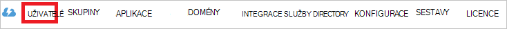

<properties
    pageTitle="Kurz: Azure Active Directory integrace s PostBeyond | Microsoft Azure"
    description="Zjistěte, jak nakonfigurovat jednotné přihlašování mezi Azure Active Directory a PostBeyond."
    services="active-directory"
    documentationCenter=""
    authors="jeevansd"
    manager="femila"
    editor=""/>

<tags
    ms.service="active-directory"
    ms.workload="identity"
    ms.tgt_pltfrm="na"
    ms.devlang="na"
    ms.topic="article"
    ms.date="10/24/2016"
    ms.author="jeedes"/>

# Kurz: Azure Active Directory integrace s PostBeyond

V tomto kurzu se naučíte, jak integrovat PostBeyond s Azure Active Directory (Azure AD).

Integrace PostBeyond s Azure AD poskytuje následující výhody:

- Můžete určit v Azure AD, kdo má přístup k PostBeyond
- Povolení uživatelům, aby automaticky získat přihlášení na k PostBeyond (jednotného přihlašování) s jejich Azure AD účty
- Správa účtů na jednom centrálním místě – klasické portálu Azure

Pokud budete chtít zjistit další informace o SaaS aplikace integrace se službou Azure AD, přečtěte si téma [Co je aplikace access a jednotné přihlašování s Azure Active Directory](active-directory-appssoaccess-whatis.md).

## Zjistit předpoklady pro

Abyste mohli nakonfigurovat integraci Azure AD pomocí PostBeyond, musíte následující položky:

- Předplatné Azure AD
- **PostBeyond** jednotného přihlašování povolené předplatného

> [AZURE.NOTE] Chcete-li otestovat kroky v tomto kurzu, není doporučujeme používat provozním prostředí.

Chcete-li otestovat kroky v tomto kurzu, budete by měl těmito doporučeními:

- Pokud je to nutné byste neměli používat provozním prostředí.
- Pokud nemáte prostředí zkušební verzi Azure AD, si můžete stáhnout měsíční zkušební [tady](https://azure.microsoft.com/pricing/free-trial/).

## Scénář popis
V tomto kurzu abyste je otestovali Azure AD jednotné přihlašování v testovacím prostředí. Scénář uvedené v tomto kurzu se skládá ze dvou hlavních stavebních bloků:

1. Přidání PostBeyond z Galerie
2. Konfigurace a testování Azure AD jednotné přihlášení

## Přidání PostBeyond z Galerie
Pokud chcete nakonfigurovat integraci PostBeyond do Azure AD, potřebujete přidat PostBeyond z Galerie do seznamu spravované SaaS aplikace.

**Pokud chcete přidat PostBeyond z galerie, proveďte následující kroky:**

1. Na **portálu Azure klasické**, v levém navigačním podokně klikněte na **Služby Active Directory**. 

    ![Služby Active Directory][1]

2. Ze seznamu **adresáře** vyberte adresář, pro kterou chcete povolit integrace adresářů.

3. Otevřete zobrazení aplikací v zobrazení adresáře, klikněte v nabídce horní na **aplikace** .

    ![Aplikace][2]

4. Klikněte na **Přidat** v dolní části stránky.

    ![Aplikace][3]

5. V dialogovém **Co chcete udělat** klikněte na **Přidat aplikaci z Galerie**.

    ![Aplikace][4]

6. Do pole Hledat zadejte **PostBeyond**.

    

7. V podokně výsledků vyberte **PostBeyond**a potom klikněte na **Dokončit** přidat aplikaci.

    

##  Konfigurace a testování Azure AD jednotné přihlášení
V této části Konfigurace a otestujte Azure AD jednotné přihlašování s PostBeyond založeného na uživateli testu s názvem "Britta Simon".

Azure AD pro jednotné přihlašování pracovat, musí ví, co protějšek uživatele v PostBeyond je pro uživatele v Azure AD. Jinými slovy odkaz vztah mezi Azure Active Directory a související uživatele v PostBeyond je potřeba vytvořit.
Tento odkaz vztah vznikne přiřazením hodnotu **uživatelské jméno** v Azure AD jako hodnota **uživatelské jméno** v PostBeyond.

Ke konfiguraci a otestujte Azure AD jednotné přihlašování s PostBeyond, je potřeba provést následující stavební bloky:

1. **[Konfigurace Azure AD jednotné přihlašování](#configuring-azure-ad-single-single-sign-on)** – uživatelům tuto funkci lze použít.
2. **[Vytváření Azure AD testování uživatele](#creating-an-azure-ad-test-user)** – testování Azure AD jednotné přihlašování s Britta Simon.
4. **[Vytváření PostBeyond otestovat uživatele](#creating-a-PostBeyond-test-user)** – a protějšek Britta Simon PostBeyond, která je propojená s Azure AD znázornění ní.
5. **[Přiřazení Azure AD testování uživatele](#assigning-the-azure-ad-test-user)** – povolení Britta Simon používat Azure AD jednotného přihlašování.
5. **[Testování jednotné přihlašování](#testing-single-sign-on)** – zkontrolujte, zda konfigurace pracuje.

### Konfigurace Azure AD jednotné přihlašování

Cílem tento oddíl je povolit Azure AD jednotné přihlašování v portálu Azure klasické a konfigurace jednotného přihlašování v aplikaci PostBeyond.

**Pokud chcete nakonfigurovat Azure AD jednotné přihlašování s PostBeyond, proveďte následující kroky:**

1. V nabídce nahoře klikněte na **Rychlý Start**.

    ![Konfigurace jednotného přihlašování][6]

2. Na portálu klasické na stránce integrace **PostBeyond** aplikace klikněte na **konfigurovat jednotné přihlašování** otevřete dialogové okno **Konfigurace jednotného přihlašování** .

    ![Konfigurace jednotného přihlašování][7] 

3. Na stránce **jakým způsobem uživatelé přihlásit k PostBeyond** vyberte **Azure AD jednotného přihlašování**a klikněte na tlačítko **Další**.
    
    

4. Na stránce **Konfigurovat nastavení aplikace** dialogové okno proveďte následující kroky: 

    

    na. Do textového pole symbol na adresu URL zadejte adresu URL pomocí následujícího vzorce: `https://app.postbeyond.com`. 

    b. Klikněte na tlačítko **Další**.

5. Na stránce **konfigurovat jednotné přihlašování v PostBeyond** klikněte na **Stáhnout certifikát**a pak uložit soubor v počítači. Také kopírovat Vystavitel URL, adresy URL služby jednotného přihlašování a hodnot URL jednoho odhlašovací služby. Je třeba tyto informace nasdílet PostBeyond podpory získat SSO nakonfigurované.

    

6. Jednotné přihlašování nakonfigurován pro aplikaci získáte kontaktovat tým podpory PostBeyond na <sso@postbeyond.com>. Vám pomůžou s velkými kanálu Konfigurace jednotného přihlašování a předejte mu takto: 

    - Pokud chcete stažený certifikátu
    - **Adresa URL vydavatel**
    - Adresu **URL SAML jednotné přihlašování**
    - **Adresa URL jednoho odhlašovací služby**

7. Na portálu klasické vyberte potvrzení jednotné přihlašování a klikněte na tlačítko **Další**.
    
    ![Azure AD jednotné přihlášení][10]

8. Na stránce **Potvrzení přihlášení** klepněte na **Dokončit**.  
    
    ![Azure AD jednotné přihlášení][11]

### Vytvoření uživatele služby Azure AD test
V této části vytvoříte testovací uživatelské jméno na portálu klasické s názvem Britta Simon.

![Vytvořit Azure AD uživatele][20]

**Pokud chcete vytvořit testovací uživatelské jméno v Azure AD, proveďte následující kroky:**

1. Na **portálu Azure klasické**, v levém navigačním podokně klikněte na **Služby Active Directory**.
    
     

2. Ze seznamu **adresáře** vyberte adresář, pro kterou chcete povolit integrace adresářů.

3. Zobrazení seznamu uživatelů, v nabídce v horní, klikněte na **uživatele**.
    
     

4. Na panelu nástrojů v dolní části otevřete dialogové okno **Přidat uživatele** , klikněte na **Přidat uživatele**.

     

5. Na stránce dialogové okno **námi o tohoto uživatele** proveďte následující kroky:
 
     

    na. Jako typ uživatele vyberte nového uživatele ve vaší organizaci.

    b. Do **textového pole**uživatelské jméno zadejte **BrittaSimon**.

    c. Klikněte na tlačítko **Další**.

6.  Na stránce dialogové okno **Uživatelského profilu** proveďte následující kroky:

     

    na. Do textového pole **jméno** zadejte **Britta**.  

    b. **Příjmení** textového pole Typ **Simon**.

    c. Do textového pole **Název zobrazení** zadejte **Britta Simon**.

    d. Vyberte v seznamu **Role** **uživatele**.

    e. Klikněte na tlačítko **Další**.

7. Na stránce **stažení dočasné heslo** dialogového okna klikněte na **vytvořit**.

     

8. Na stránce **stažení dočasné heslo** dialogové okno proveďte následující kroky:

     

    na. Poznamenejte si hodnotu **Nové heslo**.

    b. Klikněte na **dokončení**.   

### Vytvoření uživatele PostBeyond test

V této části vytvoříte uživatele s názvem Britta Simon v PostBeyond. Pokud nevíte, jak přidat Britta Simon v PostBeyond, přejděte prosím pracujete se na tým podpory PostBeyond přidejte zkušební uživatele a povolení jednotné přihlašování. Obraťte se na ně v <sso@postbeyond.com>.

### Přiřazení uživatelské test Azure AD

V této části povolíte Britta Simon pomocí Azure jednotného přihlašování udělit přístup k PostBeyond.

![Přiřazení uživatele][200] 

**Pokud chcete přiřadit Britta Simon PostBeyond, proveďte následující kroky:**

1. Na portálu klasické otevřete zobrazení aplikací v zobrazení adresáře, klikněte na **aplikace** v horní nabídce.

    ![Přiřazení uživatele][201] 

2. V seznamu aplikací vyberte **PostBeyond**.

     

1. V nabídce na horní klikněte na **uživatele**.

    ![Přiřazení uživatele][203] 

1. V seznamu všichni uživatelé vyberte **Britta Simon**.

2. Na panelu nástrojů dole klepněte na tlačítko **přiřadit**.

    ![Přiřazení uživatele][205]

### Testování jednotné přihlašování

Cílem tento oddíl je vyzkoušet Azure AD jednoho přihlašování konfiguraci pomocí panelu aplikace Access.

Po kliknutí na dlaždici PostBeyond na panelu aplikace Access by si můžete PostBeyond přihlašovací stránka. Klikněte na **přihlásit pomocí Office 365**, zadejte svoje přihlašovací údaje Azure AD. Potom jste měli Zaprotokolují do PostBeyond.

## Další zdroje informací

* [Seznam výukové programy pro o tom, jak integrovat SaaS aplikace Azure Active Directory](active-directory-saas-tutorial-list.md)
* [Co je aplikace access a jednotné přihlašování s Azure Active Directory?](active-directory-appssoaccess-whatis.md)

<!--Image references-->

[1]: ./media/active-directory-saas-postbeyond-tutorial/tutorial_general_01.png
[2]: ./media/active-directory-saas-postbeyond-tutorial/tutorial_general_02.png
[3]: ./media/active-directory-saas-postbeyond-tutorial/tutorial_general_03.png
[4]: ./media/active-directory-saas-postbeyond-tutorial/tutorial_general_04.png

[5]: ./media/active-directory-saas-postbeyond-tutorial/tutorial_general_05.png
[6]: ./media/active-directory-saas-postbeyond-tutorial/tutorial_general_06.png
[7]:  ./media/active-directory-saas-postbeyond-tutorial/tutorial_general_050.png
[10]: ./media/active-directory-saas-postbeyond-tutorial/tutorial_general_060.png
[11]: ./media/active-directory-saas-postbeyond-tutorial/tutorial_general_070.png
[20]: ./media/active-directory-saas-postbeyond-tutorial/tutorial_general_100.png

[200]: ./media/active-directory-saas-postbeyond-tutorial/tutorial_general_200.png
[201]: ./media/active-directory-saas-postbeyond-tutorial/tutorial_general_201.png
[203]: ./media/active-directory-saas-postbeyond-tutorial/tutorial_general_203.png
[204]: ./media/active-directory-saas-postbeyond-tutorial/tutorial_general_204.png
[205]: ./media/active-directory-saas-postbeyond-tutorial/tutorial_general_205.png
