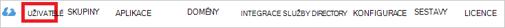

<properties
    pageTitle="Kurz: Azure Active Directory integrace s portálu prostředků | Microsoft Azure"
    description="Zjistěte, jak nakonfigurovat jednotné přihlašování mezi Azure Active Directory a portálu finančních prostředků."
    services="active-directory"
    documentationCenter=""
    authors="jeevansd"
    manager="femila"
    editor=""/>

<tags
    ms.service="active-directory"
    ms.workload="identity"
    ms.tgt_pltfrm="na"
    ms.devlang="na"
    ms.topic="article"
    ms.date="09/02/2016"
    ms.author="jeedes"/>

# Kurz: Azure Active Directory integrace s portálu prostředků

V tomto kurzu se naučíte, jak integrovat portálu prostředků s Azure Active Directory (Azure AD).

Integrace portálu prostředků s Azure AD poskytuje následující výhody:

- Můžete určit v Azure AD, kdo má přístup k portálu prostředků
- Povolení uživatelům, aby automaticky získat přihlášení z k prostředků portálu (jednotného přihlašování) pomocí svých účtů Azure AD
- Správa účtů na jednom centrálním místě – klasické portálu Azure

Pokud budete chtít zjistit další informace o SaaS aplikace integrace se službou Azure AD, přečtěte si téma [Co je aplikace access a jednotné přihlašování s Azure Active Directory](active-directory-appssoaccess-whatis.md).

## Zjistit předpoklady pro

Abyste mohli nakonfigurovat integraci Azure AD pomocí portálu prostředků, musíte následující položky:

- Předplatné Azure AD
- **Portálu prostředků** jednotného přihlašování povolené předplatného

> [AZURE.NOTE] Chcete-li otestovat kroky v tomto kurzu, není doporučujeme používat provozním prostředí.

Chcete-li otestovat kroky v tomto kurzu, budete by měl těmito doporučeními:

- Pokud je to nutné byste neměli používat provozním prostředí.
- Pokud nemáte prostředí zkušební verzi Azure AD, si můžete stáhnout měsíční zkušební [tady](https://azure.microsoft.com/pricing/free-trial/).

## Scénář popis
V tomto kurzu abyste je otestovali Azure AD jednotné přihlašování v testovacím prostředí. Scénář uvedené v tomto kurzu se skládá ze dvou hlavních stavebních bloků:

1. Přidání prostředků portálu z Galerie
2. Konfigurace a testování Azure AD jednotné přihlášení

## Přidání prostředků portálu z Galerie
Pokud chcete nakonfigurovat integraci portálu prostředků do Azure AD, potřebujete přidat portálu prostředků v galerii do seznamu spravované SaaS aplikace.

**Přidat portálu prostředků z galerie, proveďte následující kroky:**

1. Na **portálu Azure klasické**, v levém navigačním podokně klikněte na **Služby Active Directory**. 

    ![Služby Active Directory][1]

2. Ze seznamu **adresáře** vyberte adresář, pro kterou chcete povolit integrace adresářů.

3. Otevřete zobrazení aplikací v zobrazení adresáře, klikněte v nabídce horní na **aplikace** .

    ![Aplikace][2]

4. Klikněte na **Přidat** v dolní části stránky.

    ![Aplikace][3]

5. V dialogovém **Co chcete udělat** klikněte na **Přidat aplikaci z Galerie**.

    ![Aplikace][4]

6. Do pole Hledat zadejte **Portálu finančních prostředků**.

    

7. V podokně výsledků vyberte **Portálu prostředků**a potom klikněte na **Dokončit** přidat aplikaci.

    

##  Konfigurace a testování Azure AD jednotné přihlášení
V této části Konfigurace a otestujte Azure AD jednotné přihlašování pomocí prostředků portálu založeného na uživateli testu s názvem "Britta Simon".

Pro jednotné přihlašování pracovat musí Azure AD vědět, co uživatel protějšek v portálu prostředků pro uživatele v Azure AD. Odkaz vztah mezi Azure Active Directory a související uživatele v portálu prostředků jinými slovy, je nutné stanovit.
Tento odkaz vztah vznikne přiřazením hodnotu **uživatelské jméno** v Azure AD jako hodnota **uživatelské jméno** v portálu finančních prostředků.

Ke konfiguraci a otestujte Azure AD jednotné přihlašování pomocí portálu prostředků, je potřeba provést následující stavební bloky:

1. **[Konfigurace Azure AD jednotné přihlašování](#configuring-azure-ad-single-single-sign-on)** – uživatelům tuto funkci lze použít.
2. **[Vytváření Azure AD testování uživatele](#creating-an-azure-ad-test-user)** – testování Azure AD jednotné přihlašování s Britta Simon.
4. **[Vytvoření portálu prostředků testování uživatele](#creating-a-the-funding-portal-test-user)** – a protějšek Britta Simon prostředků portálu, která je propojená s Azure AD znázornění jí.
5. **[Přiřazení Azure AD testování uživatele](#assigning-the-azure-ad-test-user)** – povolení Britta Simon používat Azure AD jednotného přihlašování.
5. **[Testování jednotné přihlašování](#testing-single-sign-on)** – zkontrolujte, zda konfigurace pracuje.

### Konfigurace Azure AD jednotné přihlašování

Cíl v této části je povolit Azure AD jednotné přihlašování v portálu Azure klasické a konfigurace jednotného přihlašování v aplikaci portálu finančních prostředků.

Aplikace portál prostředků očekává výrazy SAML má být atribut s názvem "externalId1". Hodnota "externalId1" by měla být rozpoznané studentID. Nakonfigurujte deklaraci "externalId1" pro tuto aplikaci. Na kartě **"Atributy"** aplikace můžete spravovat hodnoty tyto atributy. Následující obrázek ukazuje příklad pro tuto.

 

**Abyste mohli nakonfigurovat Azure AD jednotné přihlašování pomocí portálu prostředků, proveďte následující kroky:**

1. Na portálu na stránce integrace aplikaci **Portálu prostředků** v nabídce v horní části Azure klasické klepněte na položku **atributy**.
     
    ![Konfigurace jednotného přihlašování][5]

2. V dialogu tokenu atributy SAML přidejte atribut "externalId1".

    na. Klikněte na **Přidat uživatele atribut** otevřete dialogové okno **Přidat atribut uživatele** . 
    
    

    b. **Název atributu** do textového pole zadejte název atributu "externalId1".

    c. **Hodnota atributu** seznamu vyberte atribut, který chcete použít pro implementaci. Například pokud hodnota StudentID které máte uložené v ExtensionAttribute1, vyberte user.extensionattribute1.

    d. Klikněte na **dokončení**. Potom klikněte na **Použít změny**.

1. V nabídce nahoře klikněte na **Rychlý Start**.

    ![Konfigurace jednotného přihlašování][6]

2. Na portálu klasické na stránce **Portálu prostředků** aplikace integrace klikněte na **konfigurovat jednotné přihlašování** otevřete dialogové okno **Konfigurace jednotného přihlašování** .

    ![Konfigurace jednotného přihlašování][7] 

3. Na stránce, **jakým způsobem uživatelé přihlásit k portálu prostředků** vyberte **Azure AD jednotného přihlašování**a klikněte na tlačítko **Další**.
    
    

4. Na stránce **Konfigurovat nastavení aplikace** dialogové okno proveďte následující kroky: 

    

    na. Do textového pole symbol na adresu URL zadejte adresu URL pomocí následujícího vzorce: `https://<subdomain>.regenteducation.net/`.

    b. Klikněte na tlačítko **Další**.

5. Na stránce **konfigurovat jednotné přihlašování v portálu prostředků** klikněte na **Stáhnout metadata**a pak uložit soubor v počítači.

    

6. Pokud chcete získat SSO nakonfigurován pro aplikaci, kontaktujte podporu portálu finančních prostředků. Vám pomůžou s velkými kanálu Konfigurace jednotného přihlašování. Zkontrolujte Všimněte si, že máte posílání e-mailů a připojíte stáhnout soubor metadat pro info@regenteducation.com.

7. Na portálu klasické vyberte potvrzení jednotné přihlašování a klikněte na tlačítko **Další**.
    
    ![Azure AD jednotné přihlášení][10]

8. Na stránce **Potvrzení přihlášení** klepněte na **Dokončit**.  
    
    ![Azure AD jednotné přihlášení][11]

### Vytvoření uživatele služby Azure AD test
V této části vytvoříte testovací uživatelské jméno na portálu klasické s názvem Britta Simon.

![Vytvořit Azure AD uživatele][20]

**Vytvoření testovací uživatelské jméno v Azure AD, proveďte následující kroky:**

1. Na **portálu Azure klasické**, v levém navigačním podokně klikněte na **Služby Active Directory**.
    
     

2. Ze seznamu **adresáře** vyberte adresář, pro kterou chcete povolit integrace adresářů.

3. Zobrazení seznamu uživatelů, v nabídce v horní, klikněte na **uživatele**.
    
     

4. Na panelu nástrojů v dolní části otevřete dialogové okno **Přidat uživatele** , klikněte na **Přidat uživatele**.

     

5. Na stránce dialogové okno **námi o tohoto uživatele** proveďte následující kroky:
 
     

    na. Jako typ uživatele vyberte nového uživatele ve vaší organizaci.

    b. Do **textového pole**uživatelské jméno zadejte **BrittaSimon**.

    c. Klikněte na tlačítko **Další**.

6.  Na stránce dialogové okno **Uživatelského profilu** proveďte následující kroky:

     

    na. Do textového pole **jméno** zadejte **Britta**.  

    b. **Příjmení** textového pole Typ **Simon**.

    c. Do textového pole **Název zobrazení** zadejte **Britta Simon**.

    d. Vyberte v seznamu **Role** **uživatele**.

    e. Klikněte na tlačítko **Další**.

7. Na stránce **stažení dočasné heslo** dialogového okna klikněte na **vytvořit**.

     

8. Na stránce **stažení dočasné heslo** dialogové okno proveďte následující kroky:

     

    na. Poznamenejte si hodnotu **Nové heslo**.

    b. Klikněte na **dokončení**.   

### Vytvoření uživatele test portálu prostředků

V této části vytvoříte uživatele s názvem Britta Simon v portálu finančních prostředků. Pokud nevíte, jak přidat Britta Simon v portálu prostředků, přejděte prosím pracujete se na tým podpory portálu prostředků přidejte zkušební uživatele a povolení jednotné přihlašování. Obraťte se na ně v info@regenteducation.com.

### Přiřazení uživatelské test Azure AD

V této části povolíte Britta Simon pomocí Azure jednotného přihlašování udělit přístup k portálu finančních prostředků.

![Přiřazení uživatele][200] 

**Přiřadit Britta Simon k portálu prostředků, proveďte následující kroky:**

1. Na portálu klasické otevřete zobrazení aplikací v zobrazení adresáře, klikněte na **aplikace** v horní nabídce.

    ![Přiřazení uživatele][201] 

2. V seznamu aplikací vyberte **Portálu finančních prostředků**.

     

1. V nabídce na horní klikněte na **uživatele**.

    ![Přiřazení uživatele][203] 

1. V seznamu všichni uživatelé vyberte **Britta Simon**.

2. Na panelu nástrojů dole klepněte na tlačítko **přiřadit**.

    ![Přiřazení uživatele][205]

### Testování jednotné přihlašování

Cílem tento oddíl je vyzkoušet Azure AD jednoho přihlašování konfiguraci pomocí panelu aplikace Access.

Po kliknutí na dlaždici portálu prostředků v panelu aplikace Access můžete by měla získat automaticky přihlášení na aplikaci portálu finančních prostředků.

## Další zdroje informací

* [Seznam výukové programy pro o tom, jak integrovat SaaS aplikace Azure Active Directory](active-directory-saas-tutorial-list.md)
* [Co je aplikace access a jednotné přihlašování s Azure Active Directory?](active-directory-appssoaccess-whatis.md)

<!--Image references-->

[1]: ./media/active-directory-saas-thefundingportal-tutorial/tutorial_general_01.png
[2]: ./media/active-directory-saas-thefundingportal-tutorial/tutorial_general_02.png
[3]: ./media/active-directory-saas-thefundingportal-tutorial/tutorial_general_03.png
[4]: ./media/active-directory-saas-thefundingportal-tutorial/tutorial_general_04.png

[5]: ./media/active-directory-saas-thefundingportal-tutorial/tutorial_general_05.png
[6]: ./media/active-directory-saas-thefundingportal-tutorial/tutorial_general_06.png
[7]:  ./media/active-directory-saas-thefundingportal-tutorial/tutorial_general_050.png
[10]: ./media/active-directory-saas-thefundingportal-tutorial/tutorial_general_060.png
[11]: ./media/active-directory-saas-thefundingportal-tutorial/tutorial_general_070.png
[20]: ./media/active-directory-saas-thefundingportal-tutorial/tutorial_general_100.png

[200]: ./media/active-directory-saas-thefundingportal-tutorial/tutorial_general_200.png
[201]: ./media/active-directory-saas-thefundingportal-tutorial/tutorial_general_201.png
[203]: ./media/active-directory-saas-thefundingportal-tutorial/tutorial_general_203.png
[204]: ./media/active-directory-saas-thefundingportal-tutorial/tutorial_general_204.png
[205]: ./media/active-directory-saas-thefundingportal-tutorial/tutorial_general_205.png
