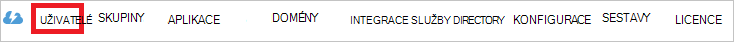

<properties
    pageTitle="Kurz: Azure Active Directory integrace s interaktivní průvodci Yonyx | Microsoft Azure"
    description="Zjistěte, jak nakonfigurovat jednotné přihlašování mezi Azure Active Directory a interaktivní průvodci Yonyx."
    services="active-directory"
    documentationCenter=""
    authors="jeevansd"
    manager="femila"
    editor=""/>

<tags
    ms.service="active-directory"
    ms.workload="identity"
    ms.tgt_pltfrm="na"
    ms.devlang="na"
    ms.topic="article"
    ms.date="10/26/2016"
    ms.author="jeedes"/>

# Kurz: Azure Active Directory integrace s Yonyx interaktivní průvodci

Cílem tohoto kurzu je vidíte, jak integrovat Yonyx interaktivní průvodci se službou Azure Active Directory (Azure AD).

Interaktivní průvodci Yonyx integrace s Azure AD poskytuje následující výhody:

- Můžete určit v Azure AD, kdo má přístup k interaktivní průvodci Yonyx
- Povolení uživatelům, aby automaticky získat přihlášení z k interaktivní průvodci Yonyx (jednotného přihlašování) pomocí svých účtů Azure AD
- Správa účtů na jednom centrálním místě – klasické portálu Azure

Pokud budete chtít zjistit další informace o SaaS aplikace integrace se službou Azure AD, přečtěte si téma [Co je aplikace access a jednotné přihlašování s Azure Active Directory](active-directory-appssoaccess-whatis.md).

## Zjistit předpoklady pro

Abyste mohli nakonfigurovat Azure AD integrace s interaktivní průvodci Yonyx, musíte následující položky:

- Předplatné Azure AD
- Interaktivní průvodci Yonyx jednotného přihlašování povolené předplatného

> [AZURE.NOTE] Chcete-li otestovat kroky v tomto kurzu, není doporučujeme používat provozním prostředí.

Chcete-li otestovat kroky v tomto kurzu, budete by měl těmito doporučeními:

- Pokud je to nutné byste neměli používat provozním prostředí.
- Pokud nemáte prostředí zkušební verzi Azure AD, si můžete stáhnout měsíční zkušební [tady](https://azure.microsoft.com/pricing/free-trial/).

## Scénář popis
Cílem tohoto kurzu je umožňují testování Azure AD jednotné přihlašování v testovacím prostředí.

Scénář uvedené v tomto kurzu se skládá ze dvou hlavních stavebních bloků:

1. Přidání interaktivní průvodci Yonyx z Galerie
2. Konfigurace a testování Azure AD jednotné přihlášení

## Přidání interaktivní průvodci Yonyx z Galerie
Pokud chcete nakonfigurovat integraci interaktivní průvodci Yonyx do Azure AD, potřebujete přidat interaktivní průvodci Yonyx z Galerie do seznamu spravované SaaS aplikace.

**Interaktivní průvodci Yonyx přidat z galerie, proveďte následující kroky:**

1. Na **portálu Azure klasické**, v levém navigačním podokně klikněte na **Služby Active Directory**. 

    ![Služby Active Directory][1]

2. Ze seznamu **adresáře** vyberte adresář, pro kterou chcete povolit integrace adresářů.

3. Pokud chcete otevřít zobrazení aplikací v zobrazení adresáře, klikněte v nabídce horní na **aplikace** .
    
    ![Aplikace][2]

4. Klikněte na **Přidat** v dolní části stránky.
    
    ![Aplikace][3]

5. V dialogovém **Co chcete udělat** klikněte na **Přidat aplikaci z Galerie**.

    ![Aplikace][4]

6. Do pole Hledat zadejte **Yonyx interaktivní průvodci**.

    

7. V panelu Výsledky vyberte **Interaktivní průvodci Yonyx**a klikněte na **Dokončit** přidat aplikaci.

    

##  Konfigurace a testování Azure AD jednotné přihlášení
Cílem tento oddíl je ukazují, jak konfigurovat a otestujte Azure AD jednotné přihlašování pomocí Yonyx interaktivní průvodci podle testovací uživatelské jméno s názvem "Britta Simon".

Azure AD pro jednotné přihlašování pracovat, musí ví, co je databáze odpovídajících funkcí pro uživatele systému Yonyx interaktivní průvodci uživateli v Azure AD. Jinými slovy odkaz vztah mezi Azure Active Directory a související uživatele v Yonyx interaktivní průvodci je potřeba vytvořit.

Tento odkaz vztah vznikne přiřazením hodnotu **uživatelské jméno** v Azure AD jako hodnota **uživatelské jméno** v Yonyx interaktivní průvodci.

Ke konfiguraci a otestujte Azure AD jednotné přihlašování s interaktivní průvodci Yonyx, je potřeba provést následující stavební bloky:

1. **[Konfigurace Azure AD jednotné přihlašování](#configuring-azure-ad-single-single-sign-on)** – uživatelům tuto funkci lze použít.
2. **[Vytváření Azure AD testování uživatele](#creating-an-azure-ad-test-user)** – testování Azure AD jednotné přihlašování s Britta Simon.
3. **[Vytvoření interaktivní průvodci Yonyx testování uživatele](#creating-a-yonyx-interactive-guides-test-user)** – a protějšek Britta Simon Yonyx interaktivní průvodci, která je propojená s Azure AD znázornění jí.
4. **[Přiřazení Azure AD otestujte uživatele](#assigning-the-azure-ad-test-user)** – povolení Britta Simon používat Azure AD jednotného přihlašování.
5. **[Testování jednotné přihlašování](#testing-single-sign-on)** – zkontrolujte, zda konfigurace pracuje.

### Konfigurace Azure AD jednotné přihlašování

V tomto oddílu povolení Azure AD jednotné přihlašování v portálu klasické a konfigurace jednotného přihlašování v aplikaci Yonyx interaktivní průvodci.

**Abyste mohli nakonfigurovat Azure AD jednotné přihlašování s interaktivní průvodci Yonyx, proveďte následující kroky:**

1. Na portálu klasické na stránce integrace aplikace **Yonyx interaktivní průvodci** klikněte na **konfigurovat jednotné přihlašování** otevřete dialogové okno **Konfigurace jednotného přihlašování** .
     
    ![Konfigurace jednotného přihlašování][6] 

2. Na stránce **jakým způsobem uživatelé přihlásit k interaktivní průvodci Yonyx** vyberte **Azure AD jednotného přihlašování**a klikněte na tlačítko **Další**.
    
    

3. Na stránce **Konfigurovat nastavení aplikace** dialogové okno proveďte následující kroky a klikněte na **Další**:

    

    na. **Přihlaste se na adresu URL** do textového pole, zadejte adresu URL pomocí následujícího vzorce: `https://<company name>.yonyx.com/y/conversation/?id=<guid number>`.

    b. **Identifikátor URI** do textového pole, zadejte adresu URL pomocí následujícího vzorce: `https://<company name>.yonyx.com`.

    c. Klikněte na tlačítko **Další**

    > [AZURE.NOTE] Všimněte si, že budete muset aktualizovat tyto hodnoty skutečné znaménko na adresy URL a identifikátor URI. Aby tyto hodnoty, obraťte se na Yonyx interaktivní průvodci podpoře prostřednictvím <mailto:support@yonyx.com>.

4. Na stránce **konfigurovat jednotné přihlašování v Yonyx interaktivní průvodci** klikněte na **Stáhnout certifikát** a potom uložit soubor v počítači:

    

5. Získat nakonfigurován pro vaše aplikace, kontaktní Yonyx interaktivní průvodci podpoře prostřednictvím jednotného přihlašování <mailto:support@yonyx.com> a dejte jí následující:

    • Stažený **certifikátu**

    • **Vystavitel URL**

    • Adresu **URL služby jednotného přihlašování**

    • **Adresy URL jednoho odhlašovací služby**

6. Na portálu klasické vyberte potvrzení jednotné přihlašování a klikněte na tlačítko **Další**.
    
    ![Azure AD jednotné přihlášení][10]

7. Na stránce **Potvrzení přihlášení** klepněte na **Dokončit**.  
    
    ![Azure AD jednotné přihlášení][11]

### Vytvoření uživatele služby Azure AD test
Cílem v této části je vytvoření uživatele test na portálu klasické s názvem Britta Simon.

![Vytvořit Azure AD uživatele][20]

**Vytvoření testovací uživatelské jméno v Azure AD, proveďte následující kroky:**

1. Na **portálu Azure klasické**, v levém navigačním podokně klikněte na **Služby Active Directory**.

    

2. Ze seznamu **adresáře** vyberte adresář, pro kterou chcete povolit integrace adresářů.

3. Zobrazení seznamu uživatelů, v nabídce v horní, klikněte na **uživatele**.
    
    

4. Na panelu nástrojů v dolní části otevřete dialogové okno **Přidat uživatele** , klikněte na **Přidat uživatele**.

    

5. Na stránce dialogové okno **námi o tohoto uživatele** proveďte následující kroky:

    

    na. Jako typ uživatele vyberte nového uživatele ve vaší organizaci.

    b. Do **textového pole**uživatelské jméno zadejte **BrittaSimon**.

    c. Klikněte na tlačítko **Další**.

6.  Na stránce dialogové okno **Uživatelského profilu** proveďte následující kroky:
    
    

    na. Do textového pole **jméno** zadejte **Britta**.  

    b. **Příjmení** do textového pole zadejte **Simon**.

    c. Do textového pole **Název zobrazení** zadejte **Britta Simon**.

    d. Vyberte v seznamu **Role** **uživatele**.

    e. Klikněte na tlačítko **Další**.

7. Na stránce **stažení dočasného hesla** dialogového okna klikněte na **vytvořit**.
    
    

8. Na stránce **stažení dočasné heslo** dialogové okno proveďte následující kroky:
    
    

    na. Poznamenejte si hodnotu **Nové heslo**.

    b. Klikněte na **dokončení**.   

### Vytvoření interaktivní průvodci Yonyx zkušební uživatele

Cílem tento oddíl je vytvoření uživatele s názvem Britta Simon v Yonyx interaktivní průvodci. Interaktivní průvodci Yonyx podporuje za běhu zřizování, což je standardně povolený.

Neexistuje žádná akce položku, kterou v této části. Při pokusu o přístup k Adobe kreativní cloudu, pokud dosud neexistuje se vytvoří nový uživatel.

> [AZURE.NOTE] Pokud je potřeba ručně vytvořit uživatelem, budete muset kontaktovat tým podpory interaktivní průvodci Yonyx prostřednictvím <mailto:support@yonyx.com>.

### Přiřazení uživatelské test Azure AD

Cílem tento oddíl je povolení Britta Simon pomocí Azure jednotného přihlašování udělení přístup Yonyx interaktivní průvodci.
    
![Přiřazení uživatele][200]

**Interaktivní průvodci Yonyx přiřadit Britta Simon, proveďte následující kroky:**

1. Na portálu klasické otevřete zobrazení aplikací v zobrazení adresáře, klikněte na **aplikace** v horní nabídce.
    
    ![Přiřazení uživatele][201]

2. V seznamu aplikací vyberte **Yonyx interaktivní průvodci**.
    
    

3. V nabídce na horní klikněte na **uživatele**.
    
    ![Přiřazení uživatele][203]

4. V seznamu uživatelů zvolte **Britta Simon**.

5. Na panelu nástrojů dole klepněte na tlačítko **přiřadit**.
    
    ![Přiřazení uživatele][205]

### Testování jednotné přihlašování

Cílem tento oddíl je vyzkoušet Azure AD jednoho přihlašování konfiguraci pomocí panelu aplikace Access.
 
Po kliknutí na dlaždici interaktivní průvodci Yonyx na panelu aplikace Access můžete by měla získat automaticky přihlášení na aplikaci Yonyx interaktivní průvodci.

## Další zdroje informací

* [Seznam výukové programy pro o tom, jak integrovat SaaS aplikace Azure Active Directory](active-directory-saas-tutorial-list.md)
* [Co je aplikace access a jednotné přihlašování s Azure Active Directory?](active-directory-appssoaccess-whatis.md)

<!--Image references-->

[1]: ./media/active-directory-saas-yonyx-tutorial/tutorial_general_01.png
[2]: ./media/active-directory-saas-yonyx-tutorial/tutorial_general_02.png
[3]: ./media/active-directory-saas-yonyx-tutorial/tutorial_general_03.png
[4]: ./media/active-directory-saas-yonyx-tutorial/tutorial_general_04.png

[6]: ./media/active-directory-saas-yonyx-tutorial/tutorial_general_05.png
[10]: ./media/active-directory-saas-yonyx-tutorial/tutorial_general_06.png
[11]: ./media/active-directory-saas-yonyx-tutorial/tutorial_general_07.png
[20]: ./media/active-directory-saas-yonyx-tutorial/tutorial_general_100.png

[200]: ./media/active-directory-saas-yonyx-tutorial/tutorial_general_200.png
[201]: ./media/active-directory-saas-yonyx-tutorial/tutorial_general_201.png
[203]: ./media/active-directory-saas-yonyx-tutorial/tutorial_general_203.png
[204]: ./media/active-directory-saas-yonyx-tutorial/tutorial_general_204.png
[205]: ./media/active-directory-saas-yonyx-tutorial/tutorial_general_205.png
