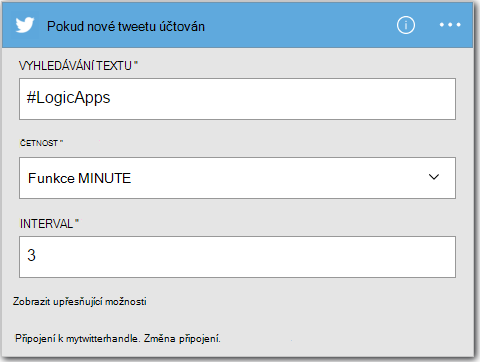
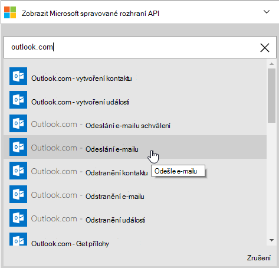
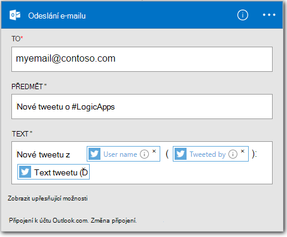

<properties
    pageTitle="Vytvoření aplikace logiky | Microsoft Azure"
    description="Naučte se vytvářet aplikace logiky připojení SaaS služby"
    authors="jeffhollan"
    manager="dwrede"
    editor=""
    services="logic-apps"
    documentationCenter=""/>

<tags
    ms.service="logic-apps"
    ms.workload="na"
    ms.tgt_pltfrm="na"
    ms.devlang="na"
    ms.topic="get-started-article"
    ms.date="10/18/2016"
    ms.author="jehollan"/>

# Vytvoření nové aplikace logiky připojení SaaS služby

Toto téma ukazuje, jak, za několik okamžiků mohli rovnou začít s [Aplikacemi jiných logiky Azure](app-service-logic-what-are-logic-apps.md). Provedeme pomocí jednoduchého pracovního postupu, které můžete poslat e-mailu zajímavými tweety.

Pokud chcete použít tento scénář, budete potřebovat:

- Předplatné Azure
- Účet Twitter
- Outlook.com nebo hostovanou schránku Office 365

## Vytvoření nové aplikace logiky pro e-mail tweety

1. Na panelu [Azure portálu řídicího panelu](https://portal.azure.com)vyberte **Nová**. 
2. Na panelu hledání hledání logiky aplikace a vyberte **Aplikaci logiky**. Můžete také vybrat **Nový** **Web + Mobile**a vyberte **Aplikaci použití logických operátorů**. 
3. Zadejte název aplikace pro použití logických operátorů, vyberte umístění, skupina zdroje a vyberte **vytvořit**.  Pokud vyberete **kód Pin pro řídicí panel** aplikace logiky automaticky otevře po nasazení.  
4. Po otevření aplikace logiky pro první můžete vybírat z šablonu Začít.  Nyní klikněte na **Prázdné aplikace použití logických operátorů** k vytvoření to od začátku. 
1. První položku, kterou je potřeba vytvořit je aktivační událost.  Toto je zvláštní událost, spustí se aplikace pro použití logických operátorů.  Vyhledejte **twitter** aktivační událost vyhledávacího pole a vyberte ho.
7. Teď budete psaním hledaný výraz aktivovat na.  **Četnost** a **Interval** bude určovat, jak často aplikace logiky kontroloval nové tweety (a vrácení všech tweety během tohoto časového období).
    

5. Klikněte na tlačítko **nový krok** a pak zvolte **Přidat akci** nebo **Přidat podmínku**
6. Vyberete-li **Přidat akci**, můžete hledat z [dostupných spojnic](../connectors/apis-list.md) a vyberte akce. Můžete například vybrat **Outlook.com - odeslat E-mail** posílání pošty z adresy outlook.com:  
    

7. Nyní máte vyplňovat uživatelé parametry pro e-mail, se mají:  

8. Nakonec můžete vybrat, aby byla vaše aplikace logiky **Uložit** live.

## Správa aplikací logiky po vytvoření

Teď je aplikace logiky do začátků. Obraťte se pravidelně pro tweety se zadanými zadali. Pokud nalezne odpovídající tweetu, ho obdržíte e-mailu. Budete nakonec, přečtěte si, jak zakázat aplikaci nebo najdete v článku Jak funguje.

1. Přejděte na [portál Azure](https://portal.azure.com)

1. Klikněte na **Procházet** v levé části obrazovky a vyberte **Logiky aplikace**.

2. Klikněte na nová aplikace použití logických operátorů, který jste právě vytvořili, pokud chcete zobrazit aktuální stav a obecné informace.

3. Chcete-li upravit novou aplikaci použití logických operátorů, klikněte na **Upravit**.

5. Vypnout aplikaci, klikněte na panelu příkazů **Zakázat** .

1. Zobrazení historie spustit signálu a aktivační signál sledování při spuštění aplikace pro použití logických operátorů.  Klikněte na tlačítko **Aktualizovat** zobrazíte nejnovější data.

Za méně než pět minut bylo možné nastavit jednoduché logiky aplikace spuštěné v cloudu. Další informace o použití aplikace logických funkcí, najdete v článku [Použití logických operátorů aplikace funkce]. Další informace o použití logických operátorů aplikace definice sami, najdete v článku [vytváření definice logiky aplikace](app-service-logic-author-definitions.md).

<!-- Shared links -->
[Azure portal]: https://portal.azure.com
[Použití funkce aplikace logiky]: app-service-logic-create-a-logic-app.md
