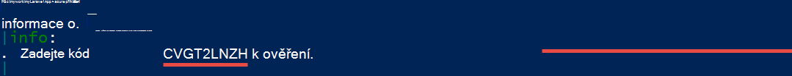
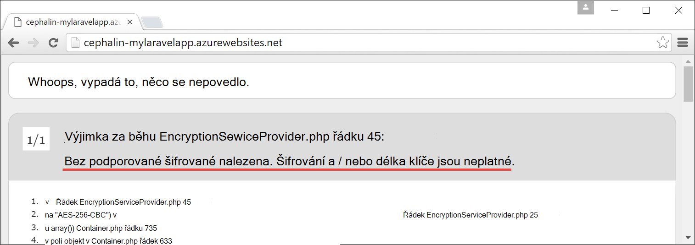

<properties
    pageTitle="Vytvoření, konfigurace a nasazení do webových aplikací PHP Azure"
    description="Návod, jak chcete-li spustit aplikaci služby Azure do webových aplikací PHP (Laravel). Zjistěte, jak nakonfigurovat aplikaci služby Azure požadavkům framework PHP, které zvolíte."
    services="app-service\web"
    documentationCenter="php"
    authors="cephalin"
    manager="wpickett"
    editor=""
    tags="mysql"/>

<tags
    ms.service="app-service-web"
    ms.workload="web"
    ms.tgt_pltfrm="na"
    ms.devlang="PHP"
    ms.topic="article"
    ms.date="06/03/2016" 
    ms.author="cephalin"/>

# Vytvoření, konfigurace a nasazení do webových aplikací PHP Azure

[AZURE.INCLUDE [tabs](../../includes/app-service-web-get-started-nav-tabs.md)]

Tomto kurzu se dozvíte, jak vytvoření, konfigurace a nasazení aplikace od web PHP pro Azure a jak nakonfigurovat aplikaci služby Azure požadavkům na webovou aplikaci PHP. Na konci kurzu bude mít funkční [Laravel](https://www.laravel.com/) v prohlížeči spuštění živé v [Aplikaci služby Azure](../app-service/app-service-value-prop-what-is.md).

Vývojář PHP můžete přenést oblíbené framework PHP na Azure. Tento kurz používá Laravel jednoduše jako příklad konkrétní aplikace. Naučíte se: 

- Nasazení pomocí libovolná
- Nastavení PHP verze
- Použití start souboru, který není v kořenovém adresáři aplikace
- Proměnné specifické prostředí aplikace Access
- Aktualizace aplikace v Azure

Můžete použít, co jste se naučili tady do jiných PHP webových aplikací web apps nasazené Azure.

>[AZURE.INCLUDE [app-service-linux](../../includes/app-service-linux.md)] 

## Zjistit předpoklady pro

- Instalace [PHP 5.6.x](http://php.net/downloads.php) (podpora PHP 7 je beta)
- Instalace [autora](https://getcomposer.org/download/)
- Instalace [Azure rozhraní příkazového řádku](../xplat-cli-install.md)
- Instalace [Libovolná](http://www.git-scm.com/downloads)
- Zřízení účtu Microsoft Azure. Pokud nemáte účet, můžete [Registrace bezplatnou zkušební verzi](/pricing/free-trial/?WT.mc_id=A261C142F) nebo [Aktivujte své výhody odběratele Visual Studio](/pricing/member-offers/msdn-benefits-details/?WT.mc_id=A261C142F).

>[AZURE.NOTE] Najdete v článku web appu v akci. [Vyzkoušejte aplikaci služby](http://go.microsoft.com/fwlink/?LinkId=523751) okamžitě a vytvoření aplikace krátkodobý starter – žádné povinné platební kartou, žádné závazky.

## Vytvoření aplikace PHP (Laravel) v počítači vývojáře

1. Otevřete nový Windows příkazový řádek, okna prostředí PowerShell, Linux prostředí nebo terminálu OS X. Spusťte následující příkazy pro ověření správně nainstalované požadované nástroje v počítači. 

        php --version
        composer --version
        azure --version
        git --version

    

    Pokud jste nenainstalovali nástroje, najdete v článku [požadavky](#Prerequisites) pro stahování odkazy.
    
2. Instalace Laravel třeba takto:

        composer global require "laravel/installer

3. `CD`do pracovního adresáře a vytvořit novou aplikaci Laravel třeba takto:

        cd <working_directory>
        laravel new <app_name>

4. `CD`do nově vytvořený `<app_name>` adresář a otestujte aplikaci třeba takto:

        cd <app_name>
        php artisan serve
        
    Je třeba přejděte na http://localhost:8000 v prohlížeči a zobrazit na úvodní obrazovce Laravel.
    
    
    
Tak úplně, stačí běžná pracovní postup Laravel a nejste tady se <a href="https://laravel.com/docs/5.2" rel="nofollow">dozvíte Laravel</a>. Tak se Pojďme přesuňte na.

## Vytvořit Azure webovou aplikaci a nastavit libovolná nasazení

>[AZURE.NOTE] "Počkat! Co když budu chtít nasazení s FTP?" Je [kurz FTP](web-sites-php-mysql-deploy-use-ftp.md) vašim potřebám. 

S Azure rozhraní příkazového řádku můžete vytvořit webovou aplikaci v aplikaci služby Azure a nastavit pro nasazení libovolná s jedním řádkem příkazu. Dejme tomu.

1. Přejděte do režimu ASM a přihlaste se k Azure:

        azure config mode asm
        azure login
    
    Postupujte podle nápovědu pokračujte proces přihlášení.
    
    

4. Příkaz Vytvořit Azure web appu s libovolná nasazení. Po zobrazení výzvy zadejte počet na požadovanou oblast.

        azure site create --git <app_name>
    
    
    
    >[AZURE.NOTE] Pokud jste nikdy nastavíte nasazení přihlašovací údaje pro předplatné Azure, budete vyzváni k byla vytvořená. Tyto přihlašovací údaje, ne účet Azure přihlašovacích údajů, používají aplikaci služby pouze pro nasazení libovolná a FTP přihlášení. 
    
    Tento příkaz vytvoří nový libovolná úložiště k aktuálnímu adresáři (s `git init`) a pak se připojí do úložiště v Azure jako vzdálené libovolná (s `git remote add`).

<a name="configure"/>
## Konfigurace Azure web appu

Laravel aplikace pro práci v Azure budete muset zaměřte na několik věcí. Můžete udělat toto podobné cvičení PHP Framework podle výběru.

- Konfigurace PHP 5.5.9 nebo vyšší. V tématu [Nejnovější požadavky na Server 5,2 Laravel](https://laravel.com/docs/5.2#server-requirements) pro celý seznam požadavky na server. Zbytek seznamu jsou přípony, které jsou již povolit tak, že je Azure PHP zařízení. 
- Nastavení proměnných prostředí aplikace potřebuje. Použití Laravel `.env` soubor pro snadné nastavení proměnné. Ale, protože ho není má potvrzeného do ovládacího prvku zdroje (naleznete v tématu [Konfigurace prostředí Laravel](https://laravel.com/docs/5.2/configuration#environment-configuration), nastaví aplikace nastavení Azure webovou aplikaci místo.
- Ujistěte se, že aplikace Laravel vstupní bod, `public/index.php`, je nejdřív načíst. V tématu [Přehled životního cyklu Laravel](https://laravel.com/docs/5.2/lifecycle#lifecycle-overview). Jinými slovy, musíte nejdřív nastavit adresu URL kořenový web appu tak, aby ukazovaly `public` adresář.
- Povolení rozšíření autora v Azure, protože máte composer.json. Tímto způsobem můžete nechat autora starat o získání vyžadované balíčky při nasazení s `git push`. Je předmětem usnadnění. Pokud nezapnete automatizaci autora, stačí odebrat `/vendor` z `.gitignore` souboru tak, aby libovolná obsahuje ("zrušením zaškrtnutí-ignoruje") veškerý obsah `vendor` directory při potvrzování a nasazení kódu.

Pojďme postupně nakonfigurovat tyto úkoly.

4. Nastavení verze PHP vyžadovaného Laravel aplikace.

        azure site set --php-version 5.6

    Dokončení nastavení verze PHP! 
    
4. Vytvoření nového `APP_KEY` vaše Azure web app a jeho nastavení jako nastavení aplikace pro Azure webovou aplikaci.

        php artisan key:generate --show
        azure site appsetting add APP_KEY="<output_of_php_artisan_key:generate_--show>"

4. Také zapnout Laravel ladění k mají prioritu před každém nejasná `Whoops, looks like something went wrong.` stránky.

        azure site appsetting add APP_DEBUG=true

    Nastavení prostředí proměnných máte hotovo.
    
    >[AZURE.NOTE] Počkejte, Pojďme trochu zpomalovat a vysvětlují, co znamená Laravel a co Azure tady. Použití Laravel `.env` soubor v kořenovém adresáři zadat proměnné do aplikace, kde najdete řádku `APP_DEBUG=true` (i `APP_KEY=...`). Tuto proměnnou pracuje v `config/app.php` kódem     `'debug' => env('APP_DEBUG', false),`. [env()](https://laravel.com/docs/5.2/helpers#method-env) je Laravel podpůrnou metodu, která používá PHP [getenv()](http://php.net/manual/en/function.getenv.php) na pozadí.
    >
    >Však `.env` ignorován tak, že libovolná, protože je Schvalte dokument tak, že `.gitignore` soubor v kořenovém adresáři. Jednoduše řečeno, `.env`  
 ve vaší místní libovolná není úložiště posune Azure s ostatními soubory. Samozřejmě můžete jednoduše odebrat tento řádek z `.gitignore`, ale nemůžeme neodeberou vytvořené relace, že se nedoporučuje, použitím tohoto souboru do ovládacího prvku zdroje. Však způsob, jak zadat tyto proměnné v Azure potřebujete. 
    >
    >Je dobré zprávy, že nastavení aplikace v aplikaci služby Azure podporuje [getenv()](http://php.net/manual/en/function.getenv.php)  
 v PHP. Ano, zatímco můžete FTP nebo jiným způsobem ručně uložit `.env` souboru do Azure, stejně jako lze zadat proměnné chcete nastavení Azure aplikace bez `.env` v Azure, jako je to udělali My. Kromě toho pokud je proměnná v obou `.env` soubor, a v nastavení služby Azure aplikace wins nastavení Azure aplikace.     

4. Posledních dvou úkolů (nastavení virtuální adresář a povolení autora) vyžaduje [Azure portál](https://portal.azure.com), takže přihlášení k [portálu](https://portal.azure.com) s účtem Azure.

4. Spuštění v nabídce nalevo klikněte na **Aplikaci služby** > **&lt;název_aplikace >** > **Nástroje**.

    
    
    >[AZURE.TIP] Pokud kliknete na tlačítko **Nastavení** místo **Nástroje**, budete mít přístup k **Nastavení aplikace**  
 zásuvné, která umožňuje nastavení verze PHP, nastavení aplikace a virtuálních jako jste právě udělali. 
    
4. Klikněte na položku **rozšíření** > **Přidat** přidáte rozšíření.

4. Vyberte **autora** v **Zvolit rozšíření** [zásuvné](../azure-portal-overview.md) (*zásuvné*: stránku portálu, která se otevře ve vodorovném směru).

4. Klikněte na **OK** v zásuvné **právní přijmout podmínky** . 

5. **Přidat příponu** zásuvné klepnutím na tlačítko **OK** .

    Po dokončení Azure přidání rozšíření, byste měli vidět popisné zprávy v rohu stejně jako  **autora** uvedené v zásuvné **rozšíření** .

    

    Povolení autora máte hotovo.
    
4. Po návratu do zásuvné webovou aplikaci, klikněte na **Nastavení** > **Nastavení aplikace**.

    

    V **Nastavení aplikace** zásuvné Všimněte PHP verzi, kterou jste nastavili dříve:

    

    a nastavení aplikace, které jste přidali:
    
    

4. Přejděte dolů zásuvné a změňte virtuálního kořenového adresáře tak, aby ukazovaly na **site\wwwroot\public** místo **site\wwwroot**.

    

4. Klepněte na tlačítko **Uložit** v horní části zásuvné.

    Dokončení nastavení virtuální adresáře! 

## Nasazení web app s libovolná (a nastavení proměnné)

Jste připraveni nasazení kódu. Můžete udělat tomto zpět do příkazového řádku nebo terminál.

4. Uložte provedené změny a nasazení kódu modulu Azure web appu stejně jako v libovolné libovolná úložiště:

        git add .
        git commit -m "Hurray! My first commit for my Azure app!"
        git push azure master 

    Při spuštění `git push`, zobrazí se výzva k zadání hesla libovolná nasazení. Pokud se zobrazí výzva k vytvoření mapování přihlašovacích nasazení na `azure site create` dříve, zadejte do pole heslo, které jste použili.
    
5. Podívejme se spouštějí v prohlížeči spuštěním tento příkaz:

        azure site browse

    Prohlížeči by měl zobrazit Laravel úvodní obrazovku.
    
    
    
    Gratulujeme, který běží Laravel web appu v Azure.
             
## Odstranění běžných chyb

Tomhle článku je několik chyby, které můžou nastat při tématu kurz:

- [Azure rozhraní příkazového řádku se zobrazí "" server"není příkaz azure"](#clierror)
- [V prohlížeči zobrazuje chybu HTTP 403](#http403)
- [V prohlížeči zobrazuje "Whoops, vypadá to, něco se nepovedlo."](#whoops)
- [V prohlížeči zobrazuje "Žádné podporované encryptor nalezen."](#encryptor)

### Azure rozhraní příkazového řádku se zobrazí "" server"není příkaz azure"

Při spuštění `azure site *` v terminálu příkazového řádku se zobrazí chyba`error:   'site' is not an azure command. See 'azure help'.` 

Je to obvykle výsledku přepnutí do režimu "ARM" (Správce prostředků Azure). Tento problém vyřešíte přepnutí zpět do režimu "ASM" (Správa služby Azure) spuštěním `azure config mode asm`.

### V prohlížeči zobrazuje chybu HTTP 403

Jste nasadili webovou aplikaci pro Azure úspěšně, ale když přejdete na Azure webovou aplikaci, zobrazí se `HTTP 403` nebo`You do not have permission to view this directory or page.`

Totiž největší pravděpodobností web appu nemůžete najít vstupní bod k aplikaci Laravel. Ujistěte se, že jste změnili virtuálního kořenového adresáře tak, aby ukazovaly `site\wwwroot\public`, kde je Laravel `index.php` tu ( [Konfigurovat Azure web appu](#configure)).

### V prohlížeči zobrazuje "Whoops, vypadá to, něco se nepovedlo."

Jste nasadili webovou aplikaci pro Azure úspěšně, ale při prohlížení Azure webovou aplikaci, budete moct použít zašifrovanou zprávu`Whoops, looks like something went wrong.`

Podrobnější chyby získáte povolit Laravel ladění nastavením `APP_DEBUG` proměnná prostředí `true` (viz [Konfigurovat Azure web appu](#configure)).

### V prohlížeči zobrazuje "Žádné podporované encryptor nalezen."

Jste nasadili webovou aplikaci pro Azure úspěšně, ale když přejdete do Azure webové aplikace, se zobrazí chybová zpráva níže:

    
To je nasty chyby, ale alespoň není nejasná vzhledem k tomu, že jste zapnuli Laravel ladění. Zběžnou hledání chybové řetězce ve fórech Laravel řádku se zobrazí, že jde o kvůli nenastavíte APP_KEY `.env`, nebo v případě, které nemají `.env` v Azure vůbec. Problém můžete vyřešit tak, že přidáte nastavení `APP_KEY` jako Azure aplikaci nastavení (viz [Konfigurovat Azure web appu](#configure)).
    
## Další kroky

Naučte se přidávat data do aplikace vytvořením [databáze MySQL v Azure](../store-php-create-mysql-database.md). Také podívejte se na další užitečné odkazy pro PHP v Azure níže:

- [Středisko pro vývojáře PHP](/develop/php/).
- [Vytvoření webové aplikace z webu Azure Marketplace](app-service-web-create-web-app-from-marketplace.md)
- [Konfigurace PHP ve webových aplikacích pro aplikaci služby Azure](web-sites-php-configure.md)
- [Převedení WordPress více pracovišť služby Azure aplikace](web-sites-php-convert-wordpress-multisite.md)
- [Rozsáhlých WordPress na Azure aplikace služby](web-sites-php-enterprise-wordpress.md)
