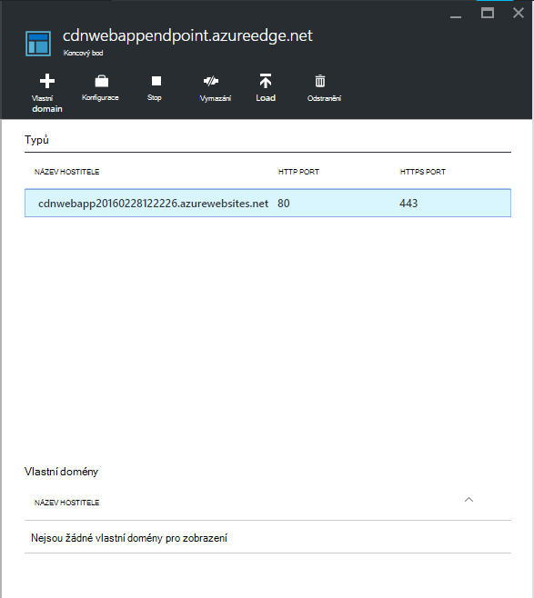

<properties 
    pageTitle="Použití Azure CDN v aplikaci služby Azure" 
    description="Kurz, který se naučíte nasazení aplikace od webové služby Azure aplikace, které bude sloužit obsahu z koncového integrované Azure CDN" 
    services="app-service\web,cdn" 
    documentationCenter=".net" 
    authors="cephalin" 
    manager="wpickett" 
    editor="jimbe"/>

<tags 
    ms.service="app-service" 
    ms.workload="tbd" 
    ms.tgt_pltfrm="na" 
    ms.devlang="dotnet" 
    ms.topic="article" 
    ms.date="07/01/2016" 
    ms.author="cephalin"/>


# <a name="use-azure-cdn-in-azure-app-service"></a>Použití Azure CDN v aplikaci služby Azure

[Aplikace služby](http://go.microsoft.com/fwlink/?LinkId=529714) lze integrovat s [Azure CDN](/services/cdn/), přidáte do globální změny měřítka schopností inherentní ve [Webových aplikacích pro aplikaci služby](http://go.microsoft.com/fwlink/?LinkId=529714) tak, že sloužící webového obsahu aplikace globálně ze serveru uzlů v blízkosti vaši zákazníci (aktualizovaný seznam všech aktuální umístění uzel najdete [tady](http://msdn.microsoft.com/library/azure/gg680302.aspx)). Scénáře jako podávání statické obrázky tento integrace může výrazně zvýšit výkon webové aplikace Azure aplikace služby a výrazně zlepšuje webovou aplikaci uživatelské rozhraní se uživateli Celosvětová dostupnost. 

Integrace Web Apps s Azure CDN poskytuje následující výhody:

- Integrace nasazení obsahu (obrázky, skripty a šablony stylů) jako součást procesu [Nepřetržitý nasazení](app-service-continuous-deployment.md) webovou aplikaci
- Snadno upgrade NuGet balíčků ve vaší webové aplikaci aplikace služby Azure, například jQuery nebo zavádění verze 
- Správa webové aplikace a podávané CDN obsah z stejného uživatelského rozhraní aplikace Visual Studio
- Integrace ASP.NET navazují a minification s Azure CDN

[AZURE.INCLUDE [app-service-web-to-api-and-mobile](../../includes/app-service-web-to-api-and-mobile.md)] 

## <a name="what-you-will-build"></a>Co vytvoříte ##

Nasazení aplikace od webové aplikace služby Azure pomocí výchozí šablonu ASP.NET MVC ve Visual Studiu, přidáte kód a bude předávat obsah z integrované CDN Azure, jako je obrázek, řadiče akce výsledků, výchozí JavaScript a soubory šablon stylů CSS a také vytvořit kód pro nastavení náhradní mechanismus při svazky podávané množství v případě, že CDN je offline.

## <a name="what-you-will-need"></a>Co budete potřebovat ##

Tento kurz obsahuje následující požadavky:

-   Aktivní [účet Microsoft Azure](/account/)
-   Visual Studio 2015 s [Azure SDK pro .NET](http://go.microsoft.com/fwlink/p/?linkid=323510&clcid=0x409) Pokud používáte Visual Studiu, postup se může lišit.

> [AZURE.NOTE] Musíte mít účet Azure tento kurz:
> + Můžete [Otevřít účet Azure zdarma](/pricing/free-trial/) – načtení přeplatky můžete vyzkoušet placené služby Azure a i když jste čerpány uchováváte účet a použití uvolnit Azure služby, jako je Web Apps.
> + Je možné [Aktivovat výhod odběratele Visual Studio](/pricing/member-offers/msdn-benefits-details/) : vaše aplikace Visual Studio předplatné vám přeplatky každý měsíc využívající služby placené Azure.
>
> Pokud chcete začít pracovat s aplikaci služby Azure před registrací účet Azure, přejděte na [Zkuste aplikaci služby](http://go.microsoft.com/fwlink/?LinkId=523751), které můžete okamžitě vytvořit web appu krátkodobý starter v aplikaci služby. Žádné povinné; kreditní karty žádné závazky.

## <a name="deploy-a-web-app-to-azure-with-an-integrated-cdn-endpoint"></a>Nasazení aplikace od web Azure pomocí integrovaného koncový bod CDN ##

V této části nasazení výchozí šablonu aplikace ASP.NET MVC ve Visual Studiu 2015 aplikace služby a potom integrace s nový koncový bod CDN. Postupujte podle těchto pokynů:

1. Ve Visual Studiu 2015 vytvořit novou webovou aplikaci ASP.NET v řádku nabídek tak, že přejdete do **Soubor > Nový > Projekt > Web > ASP.NET webové aplikace**. Pojmenujte ho a klikněte na **OK**.

    

3. Vyberte **MVC** a klikněte na **OK**.

    

4. Pokud jste přihlášeni k účtu Azure ještě, klepněte na ikonu účtu v pravém horním rohu a postupujte podle dialogové okno pro přihlášení k účtu Azure. Až budete mít Hotovo, nakonfigurujte aplikace tak, jak vidíte na obrázku a potom klikněte na **Nový** k vytvoření nového plánu aplikace služby aplikace.  

    

5. Konfigurace nový plán služeb aplikací v dialogovém okně, jak je ukázáno v následujícím příkladu a klikněte na **OK**. 

    

8. Kliknutím na **vytvořit** vytvoříte web appu.

    

9. Po vytvoření aplikace ASP.NET Publikujte projekt do Azure v podokně aktivitu aplikace služby Azure kliknutím **Publikovat `<app name>` pro tuto webovou aplikaci teď**. Klikněte na **Publikovat** dokončete proces.

    

    Zobrazí se publikovaného web app v prohlížeči a po dokončení publikování. 

1. Vytvoření koncového bodu CDN, přihlaste se k [portálu Azure](https://portal.azure.com). 
2. Klikněte na **+ Nový** > **médií + CDN** > **CDN**.

    

3. Zadejte **CDN**, **umístění**, **Skupina zdroje**, **ceny osy**a potom klikněte na **vytvořit**

       

4. V **Profilu CDN** zásuvné klikněte na tlačítko **+ koncového bodu** . Zadejte název, vyberte v rozevíracím seznamu **Typ Origin** a webovou aplikaci v rozevíracím seznamu **Origin hostname** **Web App** a potom klikněte na **Přidat**.  

    


    > [AZURE.NOTE] Po vytvoření koncového bodu CDN zásuvné **koncový bod** se zobrazí jeho adresu URL CDN a původní doméně, která je integrována. Však to trvat dlouho pro nové CDN koncového konfigurace být plně rozšíří do všech CDN umístění uzlů. 

3. Po návratu do zásuvné **koncový bod** klikněte na název koncového bodu CDN, který jste právě vytvořili.

    

3. Klikněte na tlačítko **Konfigurace** . V zásuvné **Konfigurovat** v **dotazu řetězec ukládání do mezipaměti chování** rozevíracího seznamu vyberte **mezipaměti každé jedinečnou adresu URL** a potom klikněte na tlačítko **Uložit** .


    

Po povolení to stejný odkaz stahovány pomocí odlišné řetězce dotazu bude do mezipaměti jako jednotlivé položky.

>[AZURE.NOTE] Během povolení řetězce dotazu není nutné zadávat pro tento kurz, chcete-li provést brzy největšímu pro usnadnění od jakákoli změna tady bude chvíli se rozšíří do všech uzlů CDN a nechcete, aby se všechny není dotazu řetězec-se zapnutým obsahu ucpat nahoru mezipaměť CDN (aktualizace obsahu CDN diskuze později).

2. Přejděte na adresu CDN koncového bodu. Pokud je připravená na koncový bod, byste měli vidět váš web appu zobrazí. Pokud se zobrazí chyba **HTTP 404** , není připraveno CDN koncového bodu. Budete muset počkat a za hodinu na rozšíří do všech uzlů okraj konfigurace CDN. 

    

1. Potom vyzkoušejte pro přístup k souboru **~/Content/bootstrap.css** v projektu ASP.NET. V okně prohlížeče přejděte na * *http://*&lt;cdnName >*.azureedge.net/Content/bootstrap.css**. Tato adresa URL je v mé nastavení:

        http://az673227.azureedge.net/Content/bootstrap.css

    Které odpovídá následující původní URL na CDN koncového bodu:

        http://cdnwebapp.azurewebsites.net/Content/bootstrap.css

    Když přejdete na * *http://*&lt;cdnName >*.azureedge.net/Content/bootstrap.css**, zobrazí se výzva ke stažení bootstrap.css, který jste dostali z vaší webové aplikace v Azure. 

    

Podobně se dostanete veřejně přístupný URL na * *http://*&lt;název_služby >*.cloudapp.net/** přímo z koncového bodu CDN. Příklad:

-   Soubor JS z cesty/Script
-   Obsah souboru z značku/Content cesta
-   Všechny řadiče/akce 
-   Pokud má řetězec dotazu aktivní na koncový bod CDN, všechny adresy URL řetězce dotazu
-   Celý Azure web appu, pokud je veřejná veškerý obsah

Nezapomeňte, že ho nemusí být vždy dobré (nebo obecně dobré) vytisknout celý Azure webovou aplikaci pomocí Azure CDN. Upozornění jsou:

-   Tento postup vyžaduje celého webu byl veřejný, protože Azure CDN nelze vytisknout soukromý obsah.
-   Pokud z nějakého důvodu přejde do režimu offline koncový bod CDN, zda plánovanou údržbu nebo chyba uživatele celou webovou aplikaci přejde do režimu offline pokud zákazníků můžete přesměrovaní na původní URL * *http://*&lt;název webu >*.azurewebsites.net/**. 
-   I s vlastními nastaveními Cache Control (viz [Konfigurovat možností mezipaměti pro statické soubory v Azure webovou aplikaci](#configure-caching-options-for-static-files-in-your-azure-web-app)) koncový bod CDN nezlepší výkon vysoce dynamický obsah. Pokud jste se pokusili načtení domovské stránky z koncového bodu CDN jako výše uvedeným, Všimněte si, že trvala alespoň na úrovni 5 sekund načíst výchozí domovské stránky poprvé, což je velmi jednoduché stránky. Představte si, co by stane klientského rozhraní, pokud tato stránka obsahuje dynamický obsah, který musíte aktualizovat každou minutu. Použití dynamického obsahu z koncového bodu CDN vyžaduje vypršení platnosti krátké mezipaměti, které se převádí na Neúspěšné přístupy do častých mezipaměti na koncový bod CDN. Škodí jak výkonu Azure webovou aplikaci a účinně chrání před účel CDN.

Alternativní se rozhodnout, jaký obsah a bude předávat z Azure CDN na případy v Azure web appu. K tomuto účelu jste již viděli, jak získat přístup jednotlivé soubory obsahu z koncového bodu CDN. Můžu vám ukáže, jak do určité řadiče akce prostřednictvím koncový bod CDN [poskytovat obsah z akcím řadiče prostřednictvím Azure CDN](#serve-content-from-controller-actions-through-azure-cdn).

## <a name="configure-caching-options-for-static-files-in-your-azure-web-app"></a>Konfigurace možnosti ukládání statické soubory v Azure webovou aplikaci ##

Integrací Azure CDN v Azure webovou aplikaci můžete určit, jak chcete statický obsah do mezipaměti v CDN koncového bodu. K tomuto účelu otevřete *Web.config* z ASP.NET projektu (například **cdnwebapp**) a přidejte `<staticContent>` prvek `<system.webServer>`. Dole XML nakonfiguruje mezipaměti vyprší za tři dny.  

    <system.webServer>
      <staticContent>
        <clientCache cacheControlMode="UseMaxAge" cacheControlMaxAge="3.00:00:00"/>
      </staticContent>
      ...
    </system.webServer>

Až to uděláte, budou všechny statické soubory v Azure webovou aplikaci sledovat stejné pravidlo mezipaměť CDN. Pro přesnější kontrolu nastavení mezipaměti přidejte *Web.config* souboru do jiné složky a přidejte svoje nastavení. Například přidat soubor *Web.config* ke složce *\Content* a obsah nahraďte následujícím XML:

    <?xml version="1.0"?>
    <configuration>
      <system.webServer>
        <staticContent>
          <clientCache cacheControlMode="UseMaxAge" cacheControlMaxAge="15.00:00:00"/>
        </staticContent>
      </system.webServer>
    </configuration>

Toto nastavení způsobí, že všechny statický soubory ve složce *\Content* do mezipaměti 15 dní.

Další informace o tom, jak nakonfigurovat `<clientCache>` prvek, najdete v článku [mezipaměti klienta &lt;clientCache >](http://www.iis.net/configreference/system.webserver/staticcontent/clientcache).

V následující části se také zobrazí konfiguraci nastavení mezipaměti pro řadiče akce výsledky v mezipaměti CDN.

## <a name="serve-content-from-controller-actions-through-azure-cdn"></a>Poskytovat obsah z akcím řadiče prostřednictvím Azure CDN ##

Při integraci Web Apps s Azure CDN je poměrně snadné poskytovat obsah z akcím řadiče prostřednictvím Azure CDN. Znovu Pokud se rozhodnete vytisknout celý Azure web appu pomocí svého CDN, nemusíte udělat vůbec vzhledem k tomu, že již máte dostupné prostřednictvím CDN všechny akce řadiče domény. Ale důvodů, které jsem už zdůraznit v [nasazení Azure webovou aplikaci pomocí integrovaného koncový bod CDN](#deploy-a-web-app-to-azure-with-an-integrated-cdn-endpoint), můžete rozhodnout, před tím a zvolte místo toho vyberte akci řadiče domény, kterou chcete vytisknout z Azure CDN. [Maarten Balliauw](https://twitter.com/maartenballiauw) se dozvíte, jak na to se zábavy MemeGenerator řadiči [zkrácení latence z webu Azure CDN](http://channel9.msdn.com/events/TechDays/Techdays-2014-the-Netherlands/Reducing-latency-on-the-web-with-the-Windows-Azure-CDN). Můžu se jednoduše ho reprodukovat tady.

Předpokládejme ve vaší webové aplikaci chcete generovat memes založené na malých částí boku Norris obrázku (fotografie [Miroslav](http://www.flickr.com/photos/alan-light/218493788/)světla) takto:


Máte jednoduchou `Index` akci, která umožňuje zákazníků, kteří mají zadat jejich na obrázku vygeneruje meme po jejich zveřejňují příspěvky k akci. Protože je Norris částí boku, očekáváte tuto stránku osvobozením globálně wildly Oblíbené. Toto je dobrým příkladem podávání částečně dynamického obsahu s Azure CDN. 

Pomocí výše uvedených kroků nastavit tuto akci řadiče domény:

1. Ve složce *\Controllers* nejradši cs s názvem *MemeGeneratorController.cs* a obsah nahraďte následující kód. Nahraďte cestu souboru pro `~/Content/chuck.bmp` a název CDN pro `yourCDNName`.


        using System;
        using System.Collections.Generic;
        using System.Diagnostics;
        using System.Drawing;
        using System.IO;
        using System.Net;
        using System.Web.Hosting;
        using System.Web.Mvc;
        using System.Web.UI;

        namespace cdnwebapp.Controllers
        {
          public class MemeGeneratorController : Controller
          {
            static readonly Dictionary<string, Tuple<string ,string>> Memes = new Dictionary<string, Tuple<string, string>>();

            public ActionResult Index()
            {
              return View();
            }

            [HttpPost, ActionName("Index")]
            public ActionResult Index_Post(string top, string bottom)
            {
              var identifier = Guid.NewGuid().ToString();
              if (!Memes.ContainsKey(identifier))
              {
                Memes.Add(identifier, new Tuple<string, string>(top, bottom));
              }

              return Content("<a href=\"" + Url.Action("Show", new {id = identifier}) + "\">here's your meme</a>");
            }

            [OutputCache(VaryByParam = "*", Duration = 1, Location = OutputCacheLocation.Downstream)]
            public ActionResult Show(string id)
            {
              Tuple<string, string> data = null;
              if (!Memes.TryGetValue(id, out data))
              {
                return new HttpStatusCodeResult(HttpStatusCode.NotFound);
              }

              if (Debugger.IsAttached) // Preserve the debug experience
              {
                return Redirect(string.Format("/MemeGenerator/Generate?top={0}&bottom={1}", data.Item1, data.Item2));
              }
              else // Get content from Azure CDN
              {
                return Redirect(string.Format("http://<yourCDNName>.azureedge.net/MemeGenerator/Generate?top={0}&bottom={1}", data.Item1, data.Item2));
              }
            }

            [OutputCache(VaryByParam = "*", Duration = 3600, Location = OutputCacheLocation.Downstream)]
            public ActionResult Generate(string top, string bottom)
            {
              string imageFilePath = HostingEnvironment.MapPath("~/Content/chuck.bmp");
              Bitmap bitmap = (Bitmap)Image.FromFile(imageFilePath);

              using (Graphics graphics = Graphics.FromImage(bitmap))
              {
                SizeF size = new SizeF();
                using (Font arialFont = FindBestFitFont(bitmap, graphics, top.ToUpperInvariant(), new Font("Arial Narrow", 100), out size))
                {
                    graphics.DrawString(top.ToUpperInvariant(), arialFont, Brushes.White, new PointF(((bitmap.Width - size.Width) / 2), 10f));
                }
                using (Font arialFont = FindBestFitFont(bitmap, graphics, bottom.ToUpperInvariant(), new Font("Arial Narrow", 100), out size))
                {
                    graphics.DrawString(bottom.ToUpperInvariant(), arialFont, Brushes.White, new PointF(((bitmap.Width - size.Width) / 2), bitmap.Height - 10f - arialFont.Height));
                }
              }
              MemoryStream ms = new MemoryStream();
              bitmap.Save(ms, System.Drawing.Imaging.ImageFormat.Png);
              return File(ms.ToArray(), "image/png");
            }

            private Font FindBestFitFont(Image i, Graphics g, String text, Font font, out SizeF size)
            {
              // Compute actual size, shrink if needed
              while (true)
              {
                size = g.MeasureString(text, font);

                // It fits, back out
                if (size.Height < i.Height &&
                     size.Width < i.Width) { return font; }

                // Try a smaller font (90% of old size)
                Font oldFont = font;
                font = new Font(font.Name, (float)(font.Size * .9), font.Style);
                oldFont.Dispose();
              }
            }
          }
        }

2. Klikněte pravým tlačítkem myši výchozí `Index()` akce a vyberte **Přidat zobrazení**.

    

3.  Přijměte následující nastavení a klikněte na **Přidat**.

    

4. Otevřete nový *Views\MemeGenerator\Index.cshtml* a nahraďte následující jednoduchý kód HTML odeslání jejich obsah:

        <h2>Meme Generator</h2>
        
        <form action="" method="post">
            <input type="text" name="top" placeholder="Enter top text here" />
            <br />
            <input type="text" name="bottom" placeholder="Enter bottom text here" />
            <br />
            <input class="btn" type="submit" value="Generate meme" />
        </form>

5. Znovu publikovat do Azure web appu a přejděte na * *http://*&lt;název_služby >*.cloudapp.net/MemeGenerator/Index** v prohlížeči. 

Po odeslání formuláře hodnoty, které mají `/MemeGenerator/Index`, `Index_Post` metoda akce se vrátí odkaz `Show` akce metodu zadávání identifikátorem odpovídajících. Když kliknete na odkaz, se dostanete tento kód:  

    [OutputCache(VaryByParam = "*", Duration = 1, Location = OutputCacheLocation.Downstream)]
    public ActionResult Show(string id)
    {
      Tuple<string, string> data = null;
      if (!Memes.TryGetValue(id, out data))
      {
        return new HttpStatusCodeResult(HttpStatusCode.NotFound);
      }

      if (Debugger.IsAttached) // Preserve the debug experience
      {
        return Redirect(string.Format("/MemeGenerator/Generate?top={0}&bottom={1}", data.Item1, data.Item2));
      }
      else // Get content from Azure CDN
      {
        return Redirect(string.Format("http://<yourCDNName>.azureedge.net/MemeGenerator/Generate?top={0}&bottom={1}", data.Item1, data.Item2));
      }
    }

Pokud je připojen váš místní ladění, zobrazí se vám běžná ladění zkušenosti s místní přesměrování. Pokud je spuštěn v Azure web appu, vás přesměruje na:

    http://<yourCDNName>.azureedge.net/MemeGenerator/Generate?top=<formInput>&bottom=<formInput>

Které odpovídá následující původní URL na koncový bod CDN:

    http://<yourSiteName>.azurewebsites.net/cdn/MemeGenerator/Generate?top=<formInput>&bottom=<formInput>

Adresa URL přepisu dříve použité pravidla, skutečné soubor, který získá cached koncový bod CDN po:

    http://<yourSiteName>.azurewebsites.net/MemeGenerator/Generate?top=<formInput>&bottom=<formInput>

Pak můžete použít `OutputCacheAttribute` atribut na `Generate` způsob, jak určit, jak výsledku akci by měl mezipaměti, které respektovat Azure CDN. Následující kód zadat vypršení platnosti mezipaměti 1 hodina (3600).

    [OutputCache(VaryByParam = "*", Duration = 3600, Location = OutputCacheLocation.Downstream)]

Podobně platí, můžete si můžete vytisknout si obsahu ze všech akcí řadiče domény v Azure webovou aplikaci pomocí svého Azure CDN s požadovanou možnost.

V následující části se vám ukáže, jak k obsluze skupinové a zmenšenou skripty a CSS prostřednictvím Azure CDN. 

## <a name="integrate-aspnet-bundling-and-minification-with-azure-cdn"></a>Integrace ASP.NET navazují a minification s Azure CDN ##

Šablony stylů CSS a skriptů změnám a jsou přednostní kandidáty pro mezipaměť Azure CDN. Nejjednodušší způsob, jak integrovat navazují minification s Azure CDN podávání celé webové aplikace pomocí Azure CDN je. Však jako důvodů podle [Integrace koncového Azure CDN s vaší Azure web app a slouží statický obsah na webových stránkách z Azure CDN](#deploy-a-web-app-to-azure-with-an-integrated-cdn-endpoint)může zvolit před tento přístup, můžu vám ukáže, jak na to při zachování prostředí požadované vývojářský ASP.NET navazují a minification, jako například:

-   Skvělé ladění režimu prostředí
-   Zjednodušené nasazení
-   Okamžité aktualizace klientů pro upgradu na novou verzi skript/šablony stylů CSS
-   Nouzový mechanismus selhání koncový bod CDN
-   Minimalizace úpravy kódu

Vytvořte projekt, který jste vytvořili v [Integrace koncového Azure CDN s vaší Azure web app a slouží statický obsah na webových stránkách z Azure CDN](#deploy-a-web-app-to-azure-with-an-integrated-cdn-endpoint), otevřete *App_Start\BundleConfig.cs* a podívejte se `bundles.Add()` volání metody.

    public static void RegisterBundles(BundleCollection bundles)
    {
        bundles.Add(new ScriptBundle("~/bundles/jquery").Include(
                    "~/Scripts/jquery-{version}.js"));
        ...
    }

První `bundles.Add()` údajů Přidá skript příruček virtuální adresář `~/bundles/jquery`. Potom otevřete *Views\Shared\_Layout.cshtml* zobrazíte vykreslení značku příruček skriptu. Je třeba moct najít následující řádek Razor kódu:

    @Scripts.Render("~/bundles/jquery")

Při spuštění tento kód Razor v Azure web appu se vykreslují pomocí `<script>` značku skript příruček podobná této: 

    <script src="/bundles/jquery?v=FVs3ACwOLIVInrAl5sdzR2jrCDmVOWFbZMY6g6Q0ulE1"></script>

Ale pokud ji běží ve Visual Studiu zadáním `F5`, se budou vykreslovat každý soubor skriptu v do skupiny jednotlivě (v případě výše pouze jeden soubor skriptu nachází v do skupiny):

    <script src="/Scripts/jquery-1.10.2.js"></script>

Umožňuje ladění kódu JavaScript v vývojové prostředí během snížení současných klientských připojení (navazují) a vylepšení soubor stáhnout výkonu (minification) do výroby. Je skvělé funkce zachovat integrací Azure CDN. Kromě toho protože vykreslená příruček již obsahuje řetězec automaticky generované verze, chcete-li replikovat tuto funkci tak, že při každé aktualizaci jQuery verze prostřednictvím NuGet jej lze aktualizovat na straně klienta co nejdříve.

Postupujte podle kroků pod navazují ASP.NET integrace a minification s koncovým CDN.

1. Po návratu do *App_Start\BundleConfig.cs*změnit `bundles.Add()` způsobů použití různých [příruček konstruktor](http://msdn.microsoft.com/library/jj646464.aspx), který určuje CDN adresu. K tomuto účelu nahradit `RegisterBundles` definice metody s kódem následující:  
    
        public static void RegisterBundles(BundleCollection bundles)
        {
          bundles.UseCdn = true;
          var version = System.Reflection.Assembly.GetAssembly(typeof(Controllers.HomeController))
            .GetName().Version.ToString();
          var cdnUrl = "http://<yourCDNName>.azureedge.net/{0}?" + version;

          bundles.Add(new ScriptBundle("~/bundles/jquery", string.Format(cdnUrl, "bundles/jquery")).Include(
                "~/Scripts/jquery-{version}.js"));

          bundles.Add(new ScriptBundle("~/bundles/jqueryval", string.Format(cdnUrl, "bundles/jqueryval")).Include(
                "~/Scripts/jquery.validate*"));

          // Use the development version of Modernizr to develop with and learn from. Then, when you're
          // ready for production, use the build tool at http://modernizr.com to pick only the tests you need.
          bundles.Add(new ScriptBundle("~/bundles/modernizr", string.Format(cdnUrl, "bundles/modernizr")).Include(
                "~/Scripts/modernizr-*"));

          bundles.Add(new ScriptBundle("~/bundles/bootstrap", string.Format(cdnUrl, "bundles/bootstrap")).Include(
                "~/Scripts/bootstrap.js",
                "~/Scripts/respond.js"));

          bundles.Add(new StyleBundle("~/Content/css", string.Format(cdnUrl, "Content/css")).Include(
                "~/Content/bootstrap.css",
                "~/Content/site.css"));
        }


    Nezapomeňte místo `<yourCDNName>` s názvem Azure CDN.

    Uveďte stručný, kterou nastavujete `bundles.UseCdn = true` a přidá pečlivě zpracovanou URL CDN do každého svazku. Například první konstruktoru kód:

        new ScriptBundle("~/bundles/jquery", string.Format(cdnUrl, "bundles/jquery"))

    je stejná jako: 

        new ScriptBundle("~/bundles/jquery", string.Format(cdnUrl, "http://<yourCDNName>.azureedge.net/bundles/jquery?<W.X.Y.Z>"))

    Tento konstruktor uvedeno ASP.NET navazují a minification vykreslování soubory jednotlivé skriptů při ladění místně, ale použít zadanou adresu CDN pro přístup k předmětné skriptu. Však dvě důležité vlastnosti s touto pečlivě zpracovanou adresou URL CDN:
    
    - Pro tuto adresu URL CDN pochází `http://<yourSiteName>.azurewebsites.net/bundles/jquery?<W.X.Y.Z>`, což je skutečně virtuální adresář příruček skriptu ve webové aplikaci.
    - Vzhledem k tomu, že používáte konstruktor CDN, značku CDN skriptu pro do skupiny už obsahuje řetězec automaticky generované verze vykreslená adresy URL. Řetězec jedinečné verze nutné ručně generovat každé změně příruček skript vynutit mezipaměti paní v Azure CDN. Ve stejnou dobu musí zůstat tento řetězec jedinečné verze konstantní prostřednictvím životnost nasazení maximalizovat přístupy do mezipaměti v Azure CDN po nasazení do skupiny.

3. Řetězec dotazu `<W.X.Y.Z>` použije z *Properties\AssemblyInfo.cs* v projektu ASP.NET. Můžete mít nasazení pracovního postupu, který obsahuje postupně verzi sestavení pokaždé, když publikujete ve službě Azure. Nebo můžete upravit *Properties\AssemblyInfo.cs* jenom v projektu, abyste pokaždé, když jste sestavili pomocí zástupných znaků zvýšit automaticky řetězec verze "*". Například změnit `AssemblyVersion` jak je ukázáno v následujícím příkladu:
    
        [assembly: AssemblyVersion("1.0.0.*")]
    
    Další strategie optimalizovat generování jedinečný řetězec po dobu trvání nasazení fungovalo tady.

3. Publikovat aplikace ASP.NET a přístup na domovskou stránku.
 
4. Zobrazení kódu HTML na stránce. Je třeba neuvidíte adresu URL CDN vykreslovat řetězcem jedinečné verze pokaždé, když znovu publikovat změny do Azure webové aplikace. Příklad:  
    
        ...
        <link href="http://az673227.azureedge.net/Content/css?1.0.0.25449" rel="stylesheet"/>
        <script src="http://az673227.azureedge.net/bundles/modernizer?1.0.0.25449"></script>
        ...
        <script src="http://az673227.azureedge.net/bundles/jquery?1.0.0.25449"></script>
        <script src="http://az673227.azureedge.net/bundles/bootstrap?1.0.0.25449"></script>
        ...

5. Ve Visual Studiu ladění ASP.NET aplikace ve Visual Studiu zadáním `F5`., 

6. Zobrazení kódu HTML na stránce. Zobrazí se pořád každý soubor skriptu jednotlivě vykreslovat tak, že máte konzistentní ladění dojít ve Visual Studiu.  
    
        ...
        <link href="/Content/bootstrap.css" rel="stylesheet"/>
        <link href="/Content/site.css" rel="stylesheet"/>
        <script src="/Scripts/modernizr-2.6.2.js"></script>
        ...
        <script src="/Scripts/jquery-1.10.2.js"></script>
        <script src="/Scripts/bootstrap.js"></script>
        <script src="/Scripts/respond.js"></script>
        ...    

## <a name="fallback-mechanism-for-cdn-urls"></a>Náhradní mechanismus při CDN adresy URL ##

Selhání koncový bod Azure CDN z nějakého důvodu chcete webovou stránku je natolik inteligentní, přístup k webu origin jako možnost náhradní načítání JavaScriptu nebo zavádění. Není dost vážně ztratíte obrázky na svoji webovou aplikaci z důvodu nedostupnost CDN, ale mnohem přísnější ztratíte zásadní stránek funkce poskytované skripty a šablony stylů.

Třídy [Sada](http://msdn.microsoft.com/library/system.web.optimization.bundle.aspx) obsahuje vlastnost s názvem [CdnFallbackExpression](http://msdn.microsoft.com/library/system.web.optimization.bundle.cdnfallbackexpression.aspx) , který umožňuje konfigurace nouzový mechanismus CDN chyby. Pokud chcete použít tuto vlastnost, postupujte následujícím způsobem:

1. V projektu ASP.NET, otevřete *App_Start\BundleConfig.cs*, které jste přidali adresy URL CDN v jednotlivých [konstruktor svazku](http://msdn.microsoft.com/library/jj646464.aspx)a přidejte `CdnFallbackExpression` kódu čtyři místa viz Přidání nouzový mechanismus do sady výchozí.  
    
        public static void RegisterBundles(BundleCollection bundles)
        {
          var version = System.Reflection.Assembly.GetAssembly(typeof(BundleConfig))
            .GetName().Version.ToString();
          var cdnUrl = "http://cdnurl.azureedge.net/.../{0}?" + version;
          bundles.UseCdn = true;

          bundles.Add(new ScriptBundle("~/bundles/jquery", string.Format(cdnUrl, "bundles/jquery")) 
                { CdnFallbackExpression = "window.jquery" }
                .Include("~/Scripts/jquery-{version}.js"));

          bundles.Add(new ScriptBundle("~/bundles/jqueryval", string.Format(cdnUrl, "bundles/jqueryval")) 
                { CdnFallbackExpression = "$.validator" }
                .Include("~/Scripts/jquery.validate*"));

          // Use the development version of Modernizr to develop with and learn from. Then, when you're
          // ready for production, use the build tool at http://modernizr.com to pick only the tests you need.
          bundles.Add(new ScriptBundle("~/bundles/modernizr", string.Format(cdnUrl, "bundles/modernizer")) 
                { CdnFallbackExpression = "window.Modernizr" }
                .Include("~/Scripts/modernizr-*"));

          bundles.Add(new ScriptBundle("~/bundles/bootstrap", string.Format(cdnUrl, "bundles/bootstrap"))     
                { CdnFallbackExpression = "$.fn.modal" }
                .Include(
                        "~/Scripts/bootstrap.js",
                        "~/Scripts/respond.js"));

          bundles.Add(new StyleBundle("~/Content/css", string.Format(cdnUrl, "Content/css")).Include(
                "~/Content/bootstrap.css",
                "~/Content/site.css"));
        }

    Když `CdnFallbackExpression` není null skript je vložené do formátu HTML a zkontrolovat, zda je úspěšně načíst do skupiny, pokud ne, přistupovat svazku přímo z webového serveru origin. Tato vlastnost je potřeba nastavit, aby JavaScript výraz, který testuje, zda odpovídajících příruček CDN vložen správně. Výraz potřebné k testování každého svazku odlišně podle toho, obsah. Pro výchozí sady nahoře:
    
    - `window.jquery`je definován v jquery-{verze} js
    - `$.validator`je definován v jquery.validate.js
    - `window.Modernizr`je definován v modernizer-{verze} js
    - `$.fn.modal`je definován v bootstrap.js
    
    Možná jste si všimli, že mám nenastavil CdnFallbackExpression pro `~/Cointent/css` příruček. Důvodem je, že tam je v současné době [chyb v System.Web.Optimization](https://aspnetoptimization.codeplex.com/workitem/104) vloží `<script>` značku náhradní CSS místo očekávaného `<link>` značku.
    
    Existuje, ale dobré [Nouzového Sada stylů](https://github.com/EmberConsultingGroup/StyleBundleFallback) nabízených [Členskými konzultační skupiny](https://github.com/EmberConsultingGroup). 

2. Použít toto alternativní řešení pro šablony stylů CSS, nejradši cs v projektu ASP.NET *App_Start* složku s názvem *StyleBundleExtensions.cs*a nahraďte [kód z GitHub](https://github.com/EmberConsultingGroup/StyleBundleFallback/blob/master/Website/App_Start/StyleBundleExtensions.cs)její obsah. 

4. V *App_Start\StyleFundleExtensions.cs*přejmenujte obor názvů aplikace ASP.NET (například **cdnwebapp**). 

3. Přejděte zpátky na `App_Start\BundleConfig.cs` a nahradit poslední `bundles.Add` výpis s Tento kód:  

        bundles.Add(new StyleBundle("~/Content/css", string.Format(cdnUrl, "Content/css"))
          .IncludeFallback("~/Content/css", "sr-only", "width", "1px")
          .Include(
            "~/Content/bootstrap.css",
            "~/Content/site.css"));

    Toto nové přípony používá stejné myšlenky k vloží skript ve formátu HTML ke kontrole DOM pro odpovídající název třídy, název pravidla a pravidla hodnotu podle sada šablon stylů CSS a spadá zpátky na webový server origin selže vyhledala hodnotu.

4. Do Azure webové aplikace znovu publikovat a zpřístupnit domovskou stránku. 
5. Zobrazení kódu HTML na stránce. Vložené skripty měli najít podobně jako tento:    
    
    ```
    ...
    <link href="http://az673227.azureedge.net/Content/css?1.0.0.25474" rel="stylesheet"/>
<script>(function() {
                var loadFallback,
                    len = document.styleSheets.length;
                for (var i = 0; i < len; i++) {
                    var sheet = document.styleSheets[i];
                    if (sheet.href.indexOf('http://az673227.azureedge.net/Content/css?1.0.0.25474') !== -1) {
                        var meta = document.createElement('meta');
                        meta.className = 'sr-only';
                        document.head.appendChild(meta);
                        var value = window.getComputedStyle(meta).getPropertyValue('width');
                        document.head.removeChild(meta);
                        if (value !== '1px') {
                            document.write('<link href="/Content/css" rel="stylesheet" type="text/css" />');
                        }
                    }
                }
                return true;
            }())||document.write('<script src="/Content/css"><\/script>');</script>

    <script src="http://az673227.azureedge.net/bundles/modernizer?1.0.0.25474"></script>
    <script>(window.Modernizr)||document.write('<script src="/bundles/modernizr"><\/script>');</script>
    ... 
    <script src="http://az673227.azureedge.net/bundles/jquery?1.0.0.25474"></script>
    <script>(window.jquery)||document.write('<script src="/bundles/jquery"><\/script>');</script>

    <script src="http://az673227.azureedge.net/bundles/bootstrap?1.0.0.25474"></script>
    <script>($.fn.modal)||document.write('<script src="/bundles/bootstrap"><\/script>');</script>
    ...
    ```

    Stále obsahuje vyvolání chybové zbývajících z vloženého skriptu pro sada šablon stylů CSS `CdnFallbackExpression` vlastnost v řádku:

        }())||document.write('<script src="/Content/css"><\/script>');</script>

    Ale od první část || výraz vždy vrátí hodnotu true (v řádku nad tím), funkce document.write() nikdy spustí.

6. K ověření, zda náhradní skript pracuje, přejděte zpátky zásuvné koncového CDN a klikněte na **Zastavit**.

    

7. Aktualizujte okno prohlížeče pro Azure web app. Teď byste měli vidět, správně načtený všechny skripty a šablony stylů.

## <a name="more-information"></a>Další informace 
- [Základní informace o síť pro doručování Azure obsahu (CDN)](../cdn/cdn-overview.md)
- [Použití Azure CDN](../cdn/cdn-create-new-endpoint.md)
- [Integrovat do cloudové služby Azure CDN](../cdn/cdn-cloud-service-with-cdn.md)
- [ASP.NET navazují a Minification](http://www.asp.net/mvc/tutorials/mvc-4/bundling-and-minification)

