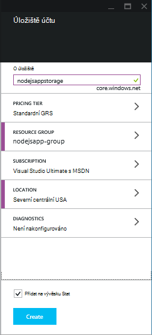
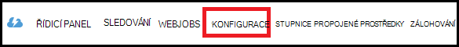
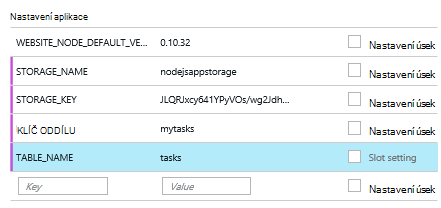

<properties
    pageTitle="Použití tabulku služba Azure Node.js web appu"
    description="Tento kurz se naučíte používat službu Azure tabulku pro uložení dat z aplikace Node.js, který je hostovaný ve webových aplikacích pro Azure aplikaci služby."
    tags="azure-portal"
    services="app-service\web, storage"
    documentationCenter="nodejs"
    authors="rmcmurray"
    manager="wpickett"
    editor=""/>

<tags
    ms.service="storage"
    ms.workload="storage"
    ms.tgt_pltfrm="na"
    ms.devlang="nodejs"
    ms.topic="article"
    ms.date="08/11/2016"
    ms.author="robmcm"/>

# Použití tabulku služba Azure Node.js web appu

## Základní informace

Tento kurz se dozvíte, jak můžete tabulku služba poskytovaná službou Azure správy dat pro ukládání a přístup k datům z aplikace [uzel] hostované ve webových aplikacích pro [Aplikaci služby Azure](http://go.microsoft.com/fwlink/?LinkId=529714) . Tento kurz předpokládá, že máte předchozí zkušenosti s používáním uzel a [Libovolná].

Naučíte se:

* Jak nainstalovat moduly uzel pomocí npm (uzel balíčku správce)

* Práce se službou Azure tabulky

* Jak používat rozhraní příkazového řádku Azure vytvořit web appu.

Provedením tohoto kurzu vytvoříte jednoduchý webové aplikace "seznam úkolů", která umožňuje vytváření, načítání a dokončení úkolů. Úkoly jsou uložené ve službě tabulky.

Tady je dokončený aplikace:

![Zobrazení prázdného tasklist na webovou stránku][node-table-finished]

>[AZURE.NOTE] Pokud chcete začít pracovat s aplikaci služby Azure před registrací účet Azure, přejděte na [Zkuste aplikaci služby](http://go.microsoft.com/fwlink/?LinkId=523751), které můžete okamžitě vytvořit web appu krátkodobý starter v aplikaci služby. Žádné povinné; kreditní karty žádné závazky.

## Zjistit předpoklady pro

Před postupujte podle pokynů v tomto článku, zkontrolujte, jestli máte nainstalovat následující:

* verze [uzel] 0.10.24 nebo vyšší

* [Libovolná]

[AZURE.INCLUDE [create-account-and-websites-note](../../includes/create-account-and-websites-note.md)]

## Vytvoření účtu úložiště

Vytvořte účet Azure úložiště. Aplikace použijete tento účet k ukládání položek úkolů.

1.  Přihlaste se k [portálu Azure](https://portal.azure.com/).

2. Klikněte na ikonu **Nový** na levé dolní části na portálu a potom klikněte na **Data + úložiště** > **úložiště**. Zadejte jedinečný název účtu úložiště a pro něj vytvořte nové [pole Skupina zdroje](../azure-resource-manager/resource-group-overview.md) .

    

    Po vytvoření účtu úložiště na tlačítko **oznámení** bude flash zelené **úspěšné** a zásuvné účtu úložiště je otevřené zobrazíte patří nové skupiny prostředků, kterou jste vytvořili.

5. V účtu úložiště zásuvné, klikněte na **Nastavení** > **klíče**. Primární přístupová klávesa zkopírování do schránky.

    ![Přístupová klávesa][portal-storage-access-keys]

##Nainstalovat moduly a generovat generování uživatelského rozhraní

V této části vytvoříte novou aplikaci uzel a slouží k přidání modulu balíčků npm. K této aplikaci použijete moduly [Express] a [Azure] . Modul Express poskytuje prostředí řadiče zobrazení Model uzel, zatímco Azure moduly poskytuje připojení ke službě tabulky.

### Instalace express a generovat generování uživatelského rozhraní

1. Z příkazového řádku, vytvořte nový adresář s názvem **tasklist** a přepnout do adresáře.  

2. Zadejte tento příkaz instalace modulu Express.

        npm install express-generator@4.2.0 -g

    V závislosti operačním systému budete muset umístění "sudo" před příkazu:

        sudo npm install express-generator@4.2.0 -g

    Zobrazí výstup podobně jako v následujícím příkladu:

        express-generator@4.2.0 /usr/local/lib/node_modules/express-generator
        ├── mkdirp@0.3.5
        └── commander@1.3.2 (keypress@0.1.0)

    > [AZURE.NOTE] "-G" parametr instalace modulu globálně. Tímto způsobem, můžeme použít **express** generovat webové aplikace vygenerovaných bez nutnosti zadávat další informace o cestě.

4. Vytvoření generování uživatelského rozhraní aplikace, zadejte **express** příkaz:

        express

    Podobně jako v následujícím příkladu se zobrazí výstup tento příkaz:

           create : .
           create : ./package.json
           create : ./app.js
           create : ./public
           create : ./public/images
           create : ./routes
           create : ./routes/index.js
           create : ./routes/users.js
           create : ./public/stylesheets
           create : ./public/stylesheets/style.css
           create : ./views
           create : ./views/index.jade
           create : ./views/layout.jade
           create : ./views/error.jade
           create : ./public/javascripts
           create : ./bin
           create : ./bin/www

           install dependencies:
             $ cd . && npm install

           run the app:
             $ DEBUG=my-application ./bin/www

    Nyní máte několik nových adresářů a souborů v adresáři **tasklist** .

### Instalace další moduly

Jeden ze souborů, které **Expresní** vytvoří je **package.json**. Tento soubor obsahuje seznam modul závislosti. Později při nasazení aplikace aplikace služby Web Apps tento soubor určí, které moduly je třeba nainstalovat na Azure.

Z příkazového řádku zadejte tento příkaz nainstalovat moduly popsané v souboru **package.json** . Budete muset používat "sudo".

    npm install

Podobně jako v následujícím příkladu se zobrazí výstup tento příkaz:

    debug@0.7.4 node_modules\debug

    cookie-parser@1.0.1 node_modules\cookie-parser
    ├── cookie-signature@1.0.3
    └── cookie@0.1.0

    [...]

Potom zadejte následující příkaz nainstalovat moduly [azure] [uzel uuid], [nconf] a [asynchronní] :

    npm install azure-storage node-uuid async nconf --save

**– Uložení** příznak přidá položky pro moduly do souboru **package.json** .

Podobně jako v následujícím příkladu se zobrazí výstup tento příkaz:

    async@0.9.0 node_modules\async

    node-uuid@1.4.1 node_modules\node-uuid

    nconf@0.6.9 node_modules\nconf
    ├── ini@1.2.1
    ├── async@0.2.9
    └── optimist@0.6.0 (wordwrap@0.0.2, minimist@0.0.10)

    [...]

## Vytvoření aplikace

Teď můžeme začít vytvářet aplikace.

### Vytvoření modelu

*Model* je objekt, který představuje data v aplikaci. Aplikace je jediný model objekt úkolu, který představuje položky v seznamu úkolů. Úkoly se mají následující pole:

- PartitionKey
- RowKey
- název (řetězec)
- kategorie (řetězec)
- dokončení (logická)

**PartitionKey** a **RowKey** používají tabulku služba jako klíče tabulky. Další informace najdete v článku [Principy datového modelu tabulku služba](https://msdn.microsoft.com/library/azure/dd179338.aspx).

1. V adresáři **tasklist** vytvořte nový adresář s názvem **modely**.

2. V adresáři **modely** vytvoření nového souboru s názvem **task.js**. Tento soubor bude obsahovat modelu doplňku pro úkoly vytvořené v aplikaci.

3. Na začátku tohoto souboru **task.js** přidáte následující kód neodkazuje požadované knihovny:

        var azure = require('azure-storage');
        var uuid = require('node-uuid');
        var entityGen = azure.TableUtilities.entityGenerator;

4. Přidejte následující kód definovat a export objektu úkolu. Tento objekt je zodpovědný za připojení k tabulce.

        module.exports = Task;

        function Task(storageClient, tableName, partitionKey) {
          this.storageClient = storageClient;
          this.tableName = tableName;
          this.partitionKey = partitionKey;
          this.storageClient.createTableIfNotExists(tableName, function tableCreated(error) {
            if(error) {
              throw error;
            }
          });
        };

5. Přidáte následující kód definovat další metody objektu úkolu, které umožňují interakce s daty uloženými v tabulce:

        Task.prototype = {
          find: function(query, callback) {
            self = this;
            self.storageClient.queryEntities(this.tableName, query, null, function entitiesQueried(error, result) {
              if(error) {
                callback(error);
              } else {
                callback(null, result.entries);
              }
            });
          },

          addItem: function(item, callback) {
            self = this;
            // use entityGenerator to set types
            // NOTE: RowKey must be a string type, even though
            // it contains a GUID in this example.
            var itemDescriptor = {
              PartitionKey: entityGen.String(self.partitionKey),
              RowKey: entityGen.String(uuid()),
              name: entityGen.String(item.name),
              category: entityGen.String(item.category),
              completed: entityGen.Boolean(false)
            };
            self.storageClient.insertEntity(self.tableName, itemDescriptor, function entityInserted(error) {
              if(error){  
                callback(error);
              }
              callback(null);
            });
          },

          updateItem: function(rKey, callback) {
            self = this;
            self.storageClient.retrieveEntity(self.tableName, self.partitionKey, rKey, function entityQueried(error, entity) {
              if(error) {
                callback(error);
              }
              entity.completed._ = true;
              self.storageClient.updateEntity(self.tableName, entity, function entityUpdated(error) {
                if(error) {
                  callback(error);
                }
                callback(null);
              });
            });
          }
        }

6. Uložte a zavřete soubor **task.js** .

### Vytvoření řadiče

*Řadiče* zpracovává požadavky HTTP a vykresluje odpověď HTML.

1. V adresáři **tasklist/směruje** nejradši s názvem **tasklist.js** a otevřete ho v textovém editoru.

2. Přidejte následující kód **tasklist.js**. Načte azure a asynchronní moduly, které využívají **tasklist.js**. Definuje také funkci **TaskList** předán instanci objektu **úkolu** , která byla definována dříve:

        var azure = require('azure-storage');
        var async = require('async');

        module.exports = TaskList;

3. Definování **TaskList** objektu.

        function TaskList(task) {
          this.task = task;
        }

4. Přidejte **TaskList**následujících způsobů:

        TaskList.prototype = {
          showTasks: function(req, res) {
            self = this;
            var query = new azure.TableQuery()
              .where('completed eq ?', false);
            self.task.find(query, function itemsFound(error, items) {
              res.render('index',{title: 'My ToDo List ', tasks: items});
            });
          },

          addTask: function(req,res) {
            var self = this;
            var item = req.body.item;
            self.task.addItem(item, function itemAdded(error) {
              if(error) {
                throw error;
              }
              res.redirect('/');
            });
          },

          completeTask: function(req,res) {
            var self = this;
            var completedTasks = Object.keys(req.body);
            async.forEach(completedTasks, function taskIterator(completedTask, callback) {
              self.task.updateItem(completedTask, function itemsUpdated(error) {
                if(error){
                  callback(error);
                } else {
                  callback(null);
                }
              });
            }, function goHome(error){
              if(error) {
                throw error;
              } else {
               res.redirect('/');
              }
            });
          }
        }

### Úprava app.js

1. V adresáři **tasklist** otevřete soubor **app.js** . Tento soubor byl vytvořený pomocí příkazu **express** .

2. Na začátku tohoto souboru, přidejte následující na načíst modul azure, nastaví na název tabulky, klíč oddílu a nastavit úložiště přihlašovacích údajů použitých v tomto příkladě:

        var azure = require('azure-storage');
        var nconf = require('nconf');
        nconf.env()
             .file({ file: 'config.json', search: true });
        var tableName = nconf.get("TABLE_NAME");
        var partitionKey = nconf.get("PARTITION_KEY");
        var accountName = nconf.get("STORAGE_NAME");
        var accountKey = nconf.get("STORAGE_KEY");

    > [AZURE.NOTE] nconf načte hodnoty konfigurace z proměnné nebo **config.json** soubor, který vytvoříte později.

3. V souboru app.js posuňte se dolů na místo, kam se zobrazí následující řádek:

        app.use('/', routes);
        app.use('/users', users);

    Nahraďte předchozí řádky s kódem ukázáno v následujícím příkladu. Spustí tato instance <strong>úkolu</strong> s připojením ke svému účtu úložiště. To je předán <strong>TaskList</strong>, který ho budou používat ke komunikaci s tabulku služba:

        var TaskList = require('./routes/tasklist');
        var Task = require('./models/task');
        var task = new Task(azure.createTableService(accountName, accountKey), tableName, partitionKey);
        var taskList = new TaskList(task);

        app.get('/', taskList.showTasks.bind(taskList));
        app.post('/addtask', taskList.addTask.bind(taskList));
        app.post('/completetask', taskList.completeTask.bind(taskList));

4. Uložte soubor **app.js** .

### Úprava zobrazení indexu

1. Otevřete soubor **tasklist/views/index.jade** v textovém editoru.

2. Nahradíte celý obsah souboru následující kód. Tato možnost definuje zobrazení, které zobrazí stávajícím úkolům a oblastí formuláře k přidání nových úkolů a označování existující jako dokončený.

        extends layout

        block content
          h1= title
          br

          form(action="/completetask", method="post")
            table.table.table-striped.table-bordered
              tr
                td Name
                td Category
                td Date
                td Complete
              if (typeof tasks === "undefined")
                tr
                  td
              else
                each task in tasks
                  tr
                    td #{task.name._}
                    td #{task.category._}
                    - var day   = task.Timestamp._.getDate();
                    - var month = task.Timestamp._.getMonth() + 1;
                    - var year  = task.Timestamp._.getFullYear();
                    td #{month + "/" + day + "/" + year}
                    td
                      input(type="checkbox", name="#{task.RowKey._}", value="#{!task.completed._}", checked=task.completed._)
            button.btn(type="submit") Update tasks
          hr
          form.well(action="/addtask", method="post")
            label Item Name:
            input(name="item[name]", type="textbox")
            label Item Category:
            input(name="item[category]", type="textbox")
            br
            button.btn(type="submit") Add item

3. Uložte a zavřete soubor **index.jade** .

### Úprava globální rozložení

Soubor **layout.jade** v adresáři **zobrazení** je globální šablony pro ostatní soubory **.jade** . V tomto kroku se budou ho upravit a použijte [Twitter zavádění](https://github.com/twbs/bootstrap), která je sada nástrojů, který usnadňuje navrhnout hodní vypadající web appu.

Stáhněte si a extrahujte soubory pro [Twitter zavádění](http://getbootstrap.com/). Zkopíroval soubor **bootstrap.min.css** ze složky počátečního zavedení **šablonami stylů css** do **veřejné/šablony stylů** adresáře aplikace.

Ve složce **zobrazení** otevřete **layout.jade** a nahradit celý obsah takto:

    doctype html
    html
      head
        title= title
        link(rel='stylesheet', href='/stylesheets/bootstrap.min.css')
        link(rel='stylesheet', href='/stylesheets/style.css')
      body.app
        nav.navbar.navbar-default
          div.navbar-header
          a.navbar-brand(href='/') My Tasks
        block content

### Vytvoření souboru konfigurace

Spusťte aplikaci místně, jsme budete umístění Azure úložiště pověření v souboru konfigurace. Vytvoření souboru s názvem * *config.json* *s JSON následující:

    {
        "STORAGE_NAME": "<storage account name>",
        "STORAGE_KEY": "<storage access key>",
        "PARTITION_KEY": "mytasks",
        "TABLE_NAME": "tasks"
    }

Nahraďte **název účtu úložiště** název účtu úložiště, které jste dříve vytvořili a **úložiště přístupová klávesa** s primární přístupová klávesa účtu úložiště. Příklad:

    {
        "STORAGE_NAME": "nodejsappstorage",
        "STORAGE_KEY": "KG0oDd..."
        "PARTITION_KEY": "mytasks",
        "TABLE_NAME": "tasks"
    }

Uložte tento soubor *jednu úroveň adresář vyšší* než adresáři **tasklist** takto:

    parent/
      |-- config.json
      |-- tasklist/

Důvod, proč to je vyhnout se kontrola konfiguračního souboru do ovládacího prvku zdroje, kde může být veřejné. Když jsme nasadit aplikaci Azure, použijeme proměnné místo konfiguračního souboru.

## Spusťte aplikaci místně

Chcete-li otestovat aplikace na místním počítači, proveďte následující kroky:

1. Z příkazového řádku přejděte do adresáře **tasklist** adresáře.

2. Ke spuštění aplikace místně použijte tento příkaz:

        npm start

3. Otevřete webový prohlížeč a přejděte na http://127.0.0.1:3000.

    Zobrazí se webová stránka podobně jako v následujícím příkladu.

    ![Zobrazení prázdného tasklist webové stránky][node-table-finished]

4. Pokud chcete vytvořit nový úkol, zadejte název a kategorií a klikněte na **Přidat položku**. 

6. Pokud chcete označit úkol jako dokončený, zaškrtněte **Dokončeno** a klikněte na **Aktualizovat úkoly**.

    ![Obrázek novou položku v seznamu úkolů][node-table-list-items]

Ačkoli aplikace běží místně, to je ukládání dat ve službě tabulky Azure.

## Nasazení aplikace Azure

Postup v této části pomocí nástroje Azure příkazového řádku v aplikaci služby vytvořit novou webovou aplikaci a pak pomocí libovolná nasazení aplikace. K provedení těchto kroků musíte mít předplatné Azure.

> [AZURE.NOTE] Tento postup lze provést také pomocí [Portálu Azure](https://portal.azure.com/). V tématu [Vytvoření a nasazení Node.js web app v aplikaci služby Azure].
>
> Pokud je první web appu, kterou jste vytvořili, musíte pomocí portálu Azure nasazení této aplikace.

Začněte tím, nainstalujte [Azure rozhraní příkazového řádku] zadáním následujícího příkazu z příkazového řádku:

    npm install azure-cli -g

### Import nastavení publikování

V tomto kroku stáhne soubor obsahující informace o předplatném.

1. Zadejte tento příkaz:

        azure account download

    Tento příkaz otevře v prohlížeči a přejde na stránku pro stažení. Po zobrazení výzvy se přihlaste pomocí účtu spojeného s předplatným Azure.

    <!-- ![The download page][download-publishing-settings] -->

    Stahování souboru, nebude zahájen automaticky. Pokud ne, kliknete na odkaz na začátku stránky ručně budou moct soubor stáhnout. Uložení souboru a poznamenejte si cestu k souboru.

2. Zadejte tento příkaz Importovat nastavení:

        azure account import <path-to-file>

    Zadejte cestu a název publikování souboru s nastavením, který jste stáhli v předchozím kroku.

3. Po dokončení nastavení importu, odstraňte soubor nastavení publikování. Již není potřeba a obsahuje citlivé informace týkající se předplatného Azure.

### Vytvoření aplikace pro web App služby

1. Z příkazového řádku přejděte do adresáře **tasklist** adresáře.

2. Použijte tento příkaz Vytvořit novou webovou aplikaci.

        azure site create --git

    Zobrazí se výzva pro webovou aplikaci název a umístění. Zadejte jedinečný název a vyberte stejný geografické polohy jako účet Azure úložiště.

    `--git` Parametr vytvoří libovolná úložiště na Azure pro tento web app. Pokud žádná existuje a přidá [Libovolná vzdálené] s názvem "azure", který se používá pro publikování aplikace Azure také inicializuje úložišti libovolná aktuálního adresáře. Nakonec vytvoří **web.config** soubor, který obsahuje nastavení používané Azure aplikacím uzel Host (hostitel). Pokud nezadáte `--git` parametr, ale v adresáři obsahuje libovolná úložiště, příkaz pořád vytvoří azure vzdálené.

    Po dokončení tohoto příkazu uvidíte výstup podobně jako tento. Všimněte si, že na začátek řádku s **webem vytvořené v** obsahuje adresa URL pro web app.

        info:   Executing command site create
        help:   Need a site name
        Name: TableTasklist
        info:   Using location southcentraluswebspace
        info:   Executing `git init`
        info:   Creating default .gitignore file
        info:   Creating a new web site
        info:   Created web site at  tabletasklist.azurewebsites.net
        info:   Initializing repository
        info:   Repository initialized
        info:   Executing `git remote add azure https://username@tabletasklist.azurewebsites.net/TableTasklist.git`
        info:   site create command OK

    > [AZURE.NOTE] Pokud je první aplikaci služby web app pro vaše předplatné, budete vyzváni k portálu Azure umožňuje vytvořit web appu. Další informace najdete v tématu [Vytvoření a nasazení Node.js web app v aplikaci služby Azure].

### Nastavení proměnné

V tomto kroku přidáte proměnné konfiguraci webové aplikace na Azure.
Z příkazového řádku zadejte následující údaje:

    azure site appsetting add
        STORAGE_NAME=<storage account name>;STORAGE_KEY=<storage access key>;PARTITION_KEY=mytasks;TABLE_NAME=tasks

Nahrazení **<storage account name>** s názvem ukládání účtu jste dříve vytvořili a nahradit **<storage access key>** s primární přístupová klávesa účtu úložiště. (Použít stejné hodnoty jako config.json soubor, který jste vytvořili.)

Můžete taky můžete nastavit proměnné [Azure portálu](https://portal.azure.com/):

1.  Otevřete zásuvné web appu po kliknutí na **Procházet** > **Web Apps** > název vaší webové aplikace.

1.  V zásuvné webovou aplikaci, klikněte na **Všechna nastavení** > **Nastavení aplikace**.

    <!--  -->

1.  Přejděte dolů do části **Nastavení aplikace** a přidejte dvojice klíč/hodnota.

    

1. Klikněte na **Uložit**.

### Publikování aplikace

Publikování aplikace, potvrďte soubory kódu libovolná a potom nabízená azure/předlohy.

1. Nastavení přihlašovacích údajů nasazení.

        azure site deployment user set <name> <password>

2. Přidání a potvrďte soubory aplikace.

        git add .
        git commit -m "adding files"

3. Použít o potvrzení pro aplikaci služby web appu:

        git push azure master

    Použití **předlohy** jako větvi cílové. Na konci nasazení zobrazí se příkaz podobně jako v následujícím příkladu:

        To https://username@tabletasklist.azurewebsites.net/TableTasklist.git
         * [new branch]      master -> master

4. Po dokončení operace push přejděte na adresu URL webové aplikace dříve vrácenou `azure create site` příkaz zobrazíte aplikace.

## Další kroky

Kroky v tomto článku popsat pomocí služby tabulku pro uložení informací, můžete také používat [MongoDB](https://mlab.com/azure/). 

## Další zdroje informací

[Azure rozhraní příkazového řádku]

## Co se změnilo
* Průvodce na změnu z webů pro aplikaci služby v tématu: [aplikaci služby Azure a jeho dopad na existující služby Azure](http://go.microsoft.com/fwlink/?LinkId=529714)

<!-- URLs -->

[Vytvořte a nasaďte Node.js web app v aplikaci služby Azure]: web-sites-nodejs-develop-deploy-mac.md
[Azure Developer Center]: /develop/nodejs/

[uzel]: http://nodejs.org
[Libovolná]: http://git-scm.com
[Express]: http://expressjs.com
[for free]: http://windowsazure.com
[Libovolná vzdálené]: http://git-scm.com/docs/git-remote

[Azure rozhraní příkazového řádku]: ../xplat-cli-install.md

[Azure]: https://github.com/Azure/azure-sdk-for-node
[uuid uzel]: https://www.npmjs.com/package/node-uuid
[nconf]: https://www.npmjs.com/package/nconf
[asynchronní]: https://www.npmjs.com/package/async

[Azure Portal]: https://portal.azure.com

[Create and deploy a Node.js application to an Azure Web Site]: web-sites-nodejs-develop-deploy-mac.md
 
<!-- Image References -->

[node-table-finished]: ./media/storage-nodejs-use-table-storage-web-site/table_todo_empty.png
[node-table-list-items]: ./media/storage-nodejs-use-table-storage-web-site/table_todo_list.png
[download-publishing-settings]: ./media/storage-nodejs-use-table-storage-web-site/azure-account-download-cli.png
[portal-new]: ./media/storage-nodejs-use-table-storage-web-site/plus-new.png
[portal-storage-account]: ./media/storage-nodejs-use-table-storage-web-site/new-storage.png
[portal-quick-create-storage]: ./media/storage-nodejs-use-table-storage-web-site/quick-storage.png
[portal-storage-access-keys]: ./media/storage-nodejs-use-table-storage-web-site/manage-access-keys.png
[go-to-dashboard]: ./media/storage-nodejs-use-table-storage-web-site/go_to_dashboard.png
[web-configure]: ./media/storage-nodejs-use-table-storage-web-site/sql-task-configure.png
[app-settings-save]: ./media/storage-nodejs-use-table-storage-web-site/savebutton.png
[app-settings]: ./media/storage-nodejs-use-table-storage-web-site/storage-tasks-appsettings.png
