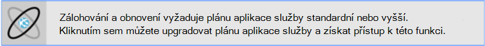
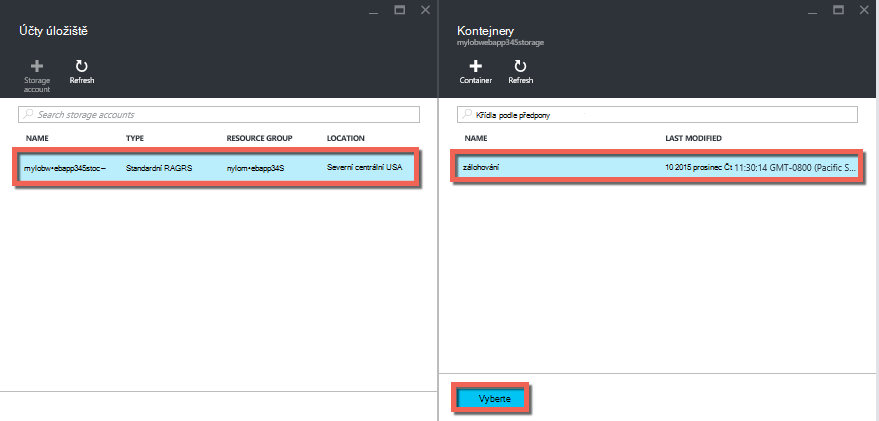
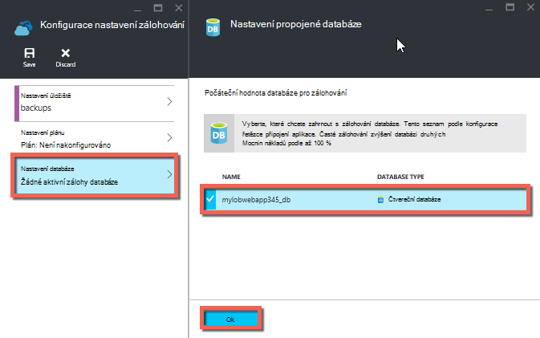
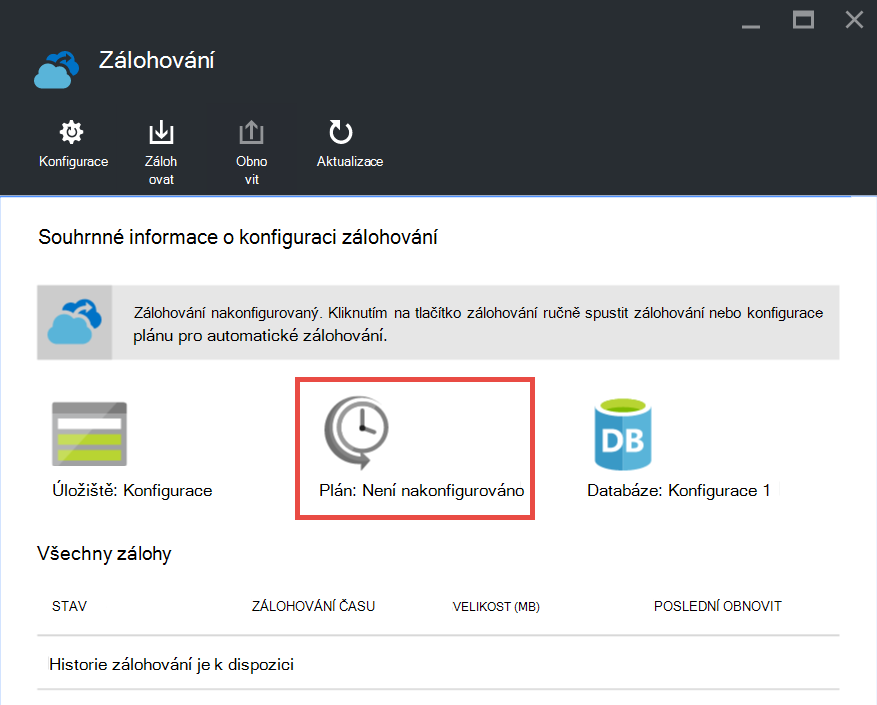

<properties 
    pageTitle="Obecnějším údajům vaši aplikaci distribuovali Azure" 
    description="Naučte se vytvářet zálohy aplikace v aplikaci služby Azure." 
    services="app-service" 
    documentationCenter="" 
    authors="cephalin" 
    manager="wpickett" 
    editor="jimbe"/>

<tags 
    ms.service="app-service" 
    ms.workload="na" 
    ms.tgt_pltfrm="na" 
    ms.devlang="na" 
    ms.topic="article" 
    ms.date="07/06/2016" 
    ms.author="cephalin"/>

# Obecnějším údajům vaši aplikaci distribuovali Azure

Zálohování a obnovení funkce v [Aplikaci služby Azure](../app-service/app-service-value-prop-what-is.md) umožňuje snadno vytvářet aplikace zálohy, ať už ručně nebo automaticky. Obnovení aplikace předchozího stavu nebo vytvořte nové aplikace na základě jedné ze zálohy původní aplikace. 

Informace o obnovení aplikace ze zálohy najdete v tématu [Obnovení aplikace v Azure](web-sites-restore.md).

## Co se zálohovala 
Služba aplikací může zálohovat následující informace:

* Konfigurace aplikace
* Obsah souboru
* Všechny databáze SQL Azure nebo databáze MySQL Azure (ClearDB) připojené k aplikaci (můžete zvolit ty, které chcete zahrnout do zálohování)

Tyto informace se zálohovala účet Azure úložiště a kontejneru, který určíte. 

> [AZURE.NOTE] Každý zálohování bylo dokončeno offline kopii svojí aplikace není přírůstková aktualizace.

## Omezení a požadavky

* Funkce zálohování a obnovení vyžaduje plán služeb aplikací **Standardní** osy nebo vyšší. Další informace o měřítka plánu aplikace služby použití vyšší úroveň najdete [škálování aplikace v Azure](web-sites-scale.md). Všimněte si, že **Premium** osy umožňuje větší počet denního zálohování než **Standardní** osy.
* Je třeba účet Azure úložiště a kontejneru ve stejném předplatném aplikace, které chcete zálohovat. Další informace o účtech Azure úložiště najdete v článku [odkazy](#moreaboutstorage) na konci tohoto článku.
* Zálohování může mít až 10GB aplikace a databáze obsahu. Pokud toto omezení překračuje záložní velikost bude dojde k chybě. 

## Vytvoření ruční zálohování

2. Na [Portálu Azure](https://portal.azure.com)přejděte na zásuvné vaše aplikace, vyberte **Nastavení**a pak **zálohy**. Zobrazí se zásuvné **zálohy** .
    
    ![Zálohování stránky][ChooseBackupsPage]

    >[AZURE.NOTE]Pokud se zobrazí následující zpráva, klikněte na upgradovat plán služeb aplikací před pokračováním s zálohy.
Další informace najdete v tématu [škálování aplikace v Azure](web-sites-scale.md) .  
    >

3. V zásuvné **zálohy** , klikněte na **úložiště: není nakonfigurováno** ke konfiguraci účtu úložiště.

    ![Vyberte účet úložiště][ChooseStorageAccount]
    
4. Vyberte cíl zálohování tak, že vyberete **Účtu úložiště** a **kontejner**. Účet úložiště musí patřit k stejném předplatném aplikace, které chcete zálohovat. Pokud chcete, můžete vytvořit nový účet úložiště nebo nové kontejneru v příslušné listy. Až budete hotovi, klikněte na **Výběr**.
    
    
    
5. V zásuvné **Konfigurovat nastavení zálohování** , pořád ještě zbývá Otevřít klikněte na **Nastavení databáze**, vyberte databáze, kterou chcete zahrnout do zálohování dat (SQL databáze nebo MySQL) a potom klikněte na **OK**.  

    

    > [AZURE.NOTE]  Pro danou databázi zobrazit v tomto seznamu musí existovat připojovací řetězec v části **Nastavení aplikace** zásuvné aplikace **připojovací řetězec** .

6. V zásuvné **Konfigurovat nastavení zálohování** klikněte na **Uložit**.  

7. Na panelu příkazů zásuvné **zálohování** klepněte na tlačítko **Zálohování**.
    
    ![Tlačítko BackUpNow][BackUpNow]
    
    Zobrazí se zpráva průběhu průběhu zálohování.

Po konfiguraci účtu úložiště a kontejneru záloh můžete provést ruční zálohování kdykoli.  

## Nastavení automatického zálohování

1. V zásuvné **zálohy** , klikněte na **plánu: není nakonfigurováno**. 

    
    
1. Na zásuvné **Nastavení zálohování plánu** nastavit **Naplánované záložní** **na**, a pak konfigurace záložní plánu podle potřeby a klikněte na **OK**.
    
    ![Povolení automatického zálohování][SetAutomatedBackupOn]
    
4. Do zásuvné **Konfigurovat nastavení zálohování** , pořád ještě zbývá Otevřít klikněte na **Nastavení úložiště**a zvolte cíl zálohování tak, že vyberete **Účtu úložiště** a **kontejner**. Účet úložiště musí patřit k stejném předplatném aplikace, které chcete zálohovat. Pokud chcete, můžete vytvořit nový účet úložiště nebo nové kontejneru v příslušné listy. Až budete hotovi, klikněte na **Výběr**.
    
    
    
5. V zásuvné **Konfigurovat nastavení zálohování** klikněte na **Nastavení databáze**, vyberte databáze, kterou chcete zahrnout do zálohování dat (SQL databáze nebo MySQL) a potom klikněte na **OK**.  

    

    > [AZURE.NOTE]  Pro danou databázi zobrazit v tomto seznamu musí existovat připojovací řetězec v části **Nastavení aplikace** zásuvné aplikace **připojovací řetězec** .

6. V zásuvné **Konfigurovat nastavení zálohování** klikněte na **Uložit**.  

## Zálohování pouze v části aplikace

Někdy nechcete zálohovat všechny objekty na aplikace. Tady je několik příkladů:

-   Můžete [Nastavit týdenní zálohování](web-sites-backup.md#configure-automated-backups) aplikace, která obsahuje statický obsah se nezměnilo nikdy, jako jsou staré příspěvků na blogu nebo obrázky.
-   Aplikace má víc než 10GB obsahu (to znamená maximální částku, kterou můžete zálohovat vždy).
-   Nechcete, aby k obecnějším údajům souborů protokolu.

Částečné zálohování umožňují zvolte přesně soubory, které chcete zálohovat.

### Vyloučit soubory ze zálohy

Pokud chcete vyloučit souborů a složek ze zálohy, vytvořit `_backup.filter` soubor ve složce D:\home\site\wwwroot aplikace a specifikujte seznam souborů a složek, které chcete vyloučit v ní. Snadný způsob, jak získat přístup k této je prostřednictvím [Kudu konzoly](https://github.com/projectkudu/kudu/wiki/Kudu-console). 

Předpokládejme, že máte aplikace, která obsahuje soubory protokolu a statické obrázky z předchozí roky, nikdy směrované na změnit. Už máte úplné zálohování aplikaci obsahovat původní obrázky. Teď chcete zálohovat aplikaci každý den, ale nechcete, aby si zaplatit ukládat protokoly nebo statický obrázek soubory, které nikdy změnit.

![Protokoly složky][LogsFolder]
![obrázky složky][ImagesFolder]
    
Pod kroky zobrazit, jak by vyloučíte tyto soubory ze zálohy.

1. Přejděte na `http://{yourapp}.scm.azurewebsites.net/DebugConsole` a určete složky, které chcete vyloučit z zálohování. V tomto příkladu by chcete vyloučit následující soubory a složky v této uživatelského rozhraní:

        D:\home\site\wwwroot\Logs
        D:\home\LogFiles
        D:\home\site\wwwroot\Images\2013
        D:\home\site\wwwroot\Images\2014
        D:\home\site\wwwroot\Images\brand.png

    [AZURE.NOTE] Poslední řádek zobrazuje vyloučit osobám soubory a složky.

2. Vytvoření souboru s názvem `_backup.filter` umístění výše uvedeném seznamu v souboru, ale odebrat `D:\home`. Adresář seznamu jednu nebo soubor na řádek. Aby obsah souboru by měl být:

    \site\wwwroot\Logs \LogFiles \site\wwwroot\Images\2013 \site\wwwroot\Images\2014 \site\wwwroot\Images\brand.PNG

3. Nahrajte soubor `D:\home\site\wwwroot\` adresáře webu pomocí účtu [serveru ftp](web-sites-deploy.md#ftp) nebo jiným způsobem. Pokud chcete, můžete vytvořit soubor přímo v `http://{yourapp}.scm.azurewebsites.net/DebugConsole` a vložte obsah tam.

4. Spusťte zálohování stejným způsobem jako obvyklým způsobem jej, [ručně](#create-a-manual-backup) nebo [automaticky](#configure-automated-backups).

Nyní, všechny soubory a složky, které jsou v jazyku `_backup.filter` bude vyloučené ze zálohy. V tomto příkladu soubory protokolu a soubory obrázků 2013 a 2014 se už zálohovat, a brand.png.

>[AZURE.NOTE] Obnovení částečné zálohování webu stejným způsobem jako [Obnovit pravidelného zálohování](web-sites-restore.md). Obnovování udělá správné věci.
>
>Po obnovení úplné zálohování veškerý obsah na webu nahrazen příkazem něco jiného, co je v zálohování. Pokud je soubor na webu, ale ne v zálohování se odstraní. Ale po obnovení částečné zálohy veškerý obsah, který se nachází v jednom zakázané adresářů nebo jiný soubor zakázané ještě zbývá je.

## Uložení záložní kopie

Po vytvoření zálohy jeden nebo více aplikace, budou zobrazeny na zásuvné **kontejnery** účtu úložiště, jakož i aplikace zálohy. V okně účet úložiště jednotlivých zálohování sestává z zip soubor, který obsahuje záložních dat a soubor XML, který obsahuje manifest obsah souboru ZIP. Můžete rozbalit a procházet tyto soubory, pokud chcete získat přístup k zálohování bez skutečně provedení obnovení aplikace.

Zálohování databáze aplikace jsou uložené v kořenovém souboru ZIP. Databáze SQL je soubor BACPAC (bez přípony souboru) a lze importovat. Pokud chcete vytvořit novou databázi SQL podle BACPAC export, přečtěte si téma [Import BACPAC soubor pro vytvoření nové databáze uživatele](http://technet.microsoft.com/library/hh710052.aspx).

> [AZURE.WARNING] Změna všech souborů v kontejneru **websitebackups** mohou způsobit zálohování osvobozením od neplatné a proto není – restorable.

## Další kroky
Informace o obnovení aplikace ze zálohy najdete v tématu [Obnovení aplikace v Azure](web-sites-restore.md). Můžete taky zálohování a obnovení aplikace služeb aplikací pomocí rozhraní REST API (viz [ZBÝVAJÍCÍ použití zálohování a obnovení aplikace aplikaci služby](websites-csm-backup.md)).

>[AZURE.NOTE] Pokud chcete začít pracovat s aplikaci služby Azure před registrací účet Azure, přejděte na [Zkuste aplikaci služby](http://go.microsoft.com/fwlink/?LinkId=523751), které můžete okamžitě vytvořit web appu krátkodobý starter v aplikaci služby. Žádné povinné; kreditní karty žádné závazky.

<!-- IMAGES -->
[ChooseBackupsPage]: ./media/web-sites-backup/01ChooseBackupsPage.png
[ChooseStorageAccount]: ./media/web-sites-backup/02ChooseStorageAccount.png
[IncludedDatabases]: ./media/web-sites-backup/03IncludedDatabases.png
[BackUpNow]: ./media/web-sites-backup/04BackUpNow.png
[BackupProgress]: ./media/web-sites-backup/05BackupProgress.png
[SetAutomatedBackupOn]: ./media/web-sites-backup/06SetAutomatedBackupOn.png
[Frequency]: ./media/web-sites-backup/07Frequency.png
[StartDate]: ./media/web-sites-backup/08StartDate.png
[StartTime]: ./media/web-sites-backup/09StartTime.png
[SaveIcon]: ./media/web-sites-backup/10SaveIcon.png
[ImagesFolder]: ./media/web-sites-backup/11Images.png
[LogsFolder]: ./media/web-sites-backup/12Logs.png
[GhostUpgradeWarning]: ./media/web-sites-backup/13GhostUpgradeWarning.png
 
