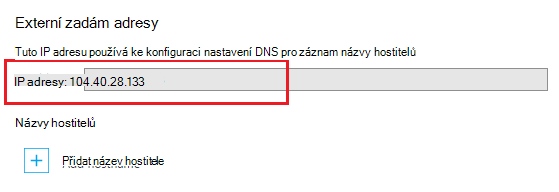

<properties
    pageTitle="Zabezpečené vaše aplikace vlastní doménu s HTTPS | Microsoft Azure"
    description="Zjistěte, jak zabezpečené název vlastní domény pro vaši aplikaci distribuovali aplikaci služby Azure nakonfigurováním vazbu certifikátu SSL. Můžete taky dozvíte, jak získat certifikát SSL od více nástrojů."
    services="app-service"
    documentationCenter=".net"
    authors="cephalin"
    manager="wpickett"
    editor="jimbe"
    tags="top-support-issue"/>

<tags
    ms.service="app-service"
    ms.workload="na"
    ms.tgt_pltfrm="na"
    ms.devlang="na"
    ms.topic="article"
    ms.date="08/08/2016"
    ms.author="cephalin"/>

# Zabezpečené vaše aplikace vlastní doménu s HTTPS

> [AZURE.SELECTOR]
- [Zakoupení certifikátu SSL v Azure](web-sites-purchase-ssl-web-site.md)
- [Použijte certifikát SSL od jinde](web-sites-configure-ssl-certificate.md)

Tento článek popisuje, jak povolit HTTPS pro web app, back-end mobilní aplikace nebo aplikace pro rozhraní API v [Aplikaci služby Azure](../app-service/app-service-value-prop-what-is.md) , která používá vlastní název domény. Zahrnuje ověřování pouze serveru. Pokud potřebujete vzájemné ověřování (včetně ověření klienta), najdete v článku [Jak chcete konfigurovat TLS vzájemné ověřování pro aplikaci služby](app-service-web-configure-tls-mutual-auth.md).

Zajistit s HTTPS aplikace, která obsahuje vlastní název domény, můžete přidat certifikát u tohoto názvu domény. Ve výchozím nastavení Azure zabezpečuje ** \*. azurewebsites.net** zástupných domény u jednoho certifikát SSL, aby klienty už přístup k aplikaci na * *https://*&lt;název_aplikace >*. azurewebsites.net**. Ale pokud chcete používat vlastní doménu, třeba **contoso.com**; **www.contoso.com**, a ** \*. contoso.com**, výchozího certifikátu nelze zabezpečit. Navíc podobně jako [certifikáty se zástupnými znaky](https://casecurity.org/2014/02/26/pros-and-cons-of-single-domain-multi-domain-and-wildcard-certificates/), výchozího certifikátu není tak bezpečný, jako je použití vlastní domény a certifikát pro tuto vlastní doménu.   

>[AZURE.NOTE] Získání nápovědy z Azure odborníci kdykoli [Azure fóra](https://azure.microsoft.com/support/forums/). Víc přizpůsobených podporu přejděte na [Podporu Azure](https://azure.microsoft.com/support/options/) a klikněte na **Získat podporu**.

## Co byste měli
Zajistit váš vlastní název domény s HTTPS svážete vlastní certifikát SSL tuto vlastní doménu v Azure. Před vazbu vlastní certifikát, musíte provést následující akce:

- Přidání certifikátu pro název domény, které je už nakonfigurovali v aplikaci umožňuje pouze **konfigurovat vlastní doménu** – aplikaci služby. Pokyny najdete v tématu [Mapovat vlastní název domény do aplikace Azure](web-sites-custom-domain-name.md). 
- **Přejít na základní osy nebo vyšší** Plány aplikaci služby v dolním cenách úrovní nepodporují vlastní certifikáty SSL. Pokyny najdete v tématu [škálování aplikace v Azure](web-sites-scale.md). 
- **Získejte certifikát SSL** – Pokud už nemáte jeden, musíte si ho založit od důvěryhodné [certifikační autorita](http://en.wikipedia.org/wiki/Certificate_authority) (CA). Certifikát musí být splněné všechny následující požadavky:

    - Je podepsáno důvěryhodné certifikační Autority (žádné soukromé CA servery).
    - Obsahuje privátním klíčem.
    - Vytvoří klíčové exchange a exportovat. Soubor PFX.
    - Vrátí minimální 2048bitový šifrování.
    - Jeho název subjektu odpovídá vlastní doménu, nutnou k zabezpečení. Zabezpečení víc domén s jeden certifikát, budete muset pomocí zástupných znaků názvu (například ** \*. contoso.com**) nebo zadejte hodnoty subjectAltName.
    - Sloučený se všechny **[intermediate certifikáty](http://en.wikipedia.org/wiki/Intermediate_certificate_authorities)** používané certifikační Autority. V ostatních případech může narazíte na problémy irreproducible interoperability v některých klientech.

        >[AZURE.NOTE] Nejjednodušší způsob, jak získat certifikát SSL, který vyhovuje všem je koupit         [přímo na Azure portálu](web-sites-purchase-ssl-web-site.md). Tento článek popisuje, jak to provést ručně a pak vytvořit vazbu s vlastní doménou v aplikaci služby.
        >   
        > **Certifikáty křivky kryptografický ECC (Elliptic)** , můžete pracovat s aplikací, ale mimo rozsah tohoto článku. Práce s certifikační Autority na přesný postup vytvoření ECC certifikátů.

## Krok 1. Získejte certifikát SSL

Protože čas poskytují různé typy certifikátu SSL v různých cena místech, by měly začít tak, že rozhodování, jaký typ certifikátu SSL koupit. Zabezpečení jednoho název_domény (**www.contoso.com**), stačí základní certifikátu. Zabezpečení víc názvů domén (**contoso.com** *a* **www.contoso.com** 
*a* **mail.contoso.com**), budete potřebovat [certifikát se zástupnými znaky](http://en.wikipedia.org/wiki/Wildcard_certificate) nebo certifikátu s [Alternativní název subjektu](http://en.wikipedia.org/wiki/SubjectAltName) (`subjectAltName`).

Když víte, který certifikát SSL koupit, odeslat certifikát Podepisování požádat o (zástupce) do certifikační Autority. Když se vrátit požadovaný certifikát od certifikační Autority, pak generovat soubor .pfx z certifikát. Můžete provést tyto kroky pomocí nástroje pro podle svého výběru. Tady je postup pro běžných nástrojů:

- [Postup Certreq.exe](#bkmk_certreq) – nástroj pro vytváření žádosti o certifikát. Součástí Windows, který uplynul od systému Windows XP nebo Windows Server 2000.
- [Správce služby IIS kroky](#bkmk_iismgr) – nástroj volba, pokud jste už znáte ho.
- [Kroky OpenSSL](#bkmk_openssl) – [nástroj otevřít zdroj, různé platformy](https://www.openssl.org). Můžete vám pomohou certifikát SSL z libovolné platformy.
- [kroky subjectAltName pomocí OpenSSL](#bkmk_subjectaltname) - kroky pro získání `subjectAltName` certifikáty.

Pokud chcete otestovat nastavení v aplikaci služby před zakoupením certifikát, si můžete vygenerovat certifikátu [podepsaného svým držitelem](https://en.wikipedia.org/wiki/Self-signed_certificate). Tento kurz nabízí dva způsoby, jak vygenerovat:

- [Certifikát podepsaný svým držitelem, Certreq.exe kroky](#bkmk_sscertreq)
- [Certifikát podepsaný svým držitelem, OpenSSL kroky](#bkmk_ssopenssl)

### Získejte certifikát pomocí Certreq.exe

1. Vytvoření souboru (například **myrequest.txt**) a zkopírujte do něj následující text a uložte ho ve pracovní adresář. Nahrazení `<your-domain>` zástupce s vlastní doménou aplikace.

        [NewRequest]
        Subject = "CN=<your-domain>"  ; E.g. "CN=www.contoso.com", or "CN=*.contoso.com" for a wildcard certificate
        Exportable = TRUE
        KeyLength = 2048              ; Required minimum is 2048
        KeySpec = 1
        KeyUsage = 0xA0
        MachineKeySet = True
        ProviderName = "Microsoft RSA SChannel Cryptographic Provider"
        ProviderType = 12
        HashAlgorithm = SHA256

        [EnhancedKeyUsageExtension]
        OID=1.3.6.1.5.5.7.3.1         ; Server Authentication

    Další informace o možnostech v zástupce a další možnosti najdete v [dokumentaci Certreq](https://technet.microsoft.com/library/dn296456.aspx).

4. Na příkazovém řádku `CD` do složky pracovní adresář a spusťte následující příkaz Vytvořit zástupce:

        certreq -new myrequest.txt myrequest.csr

    **myRequest.CSR** je vytvořena v aktuálním pracovním adresáři.

5. Odeslání **myrequest.csr** certifikační Autority na Získejte certifikát SSL. Můžete buď nahrání souboru nebo do webového formuláře zkopírujte obsah z textového editoru.

    Seznam čas důvěryhodné společností Microsoft, najdete v článku [Microsoft důvěryhodných Root Certificate Program: účastníci][cas].

6. Jakmile certifikační Autority odpověděl vám pomocí certifikátu (. Soubor CER), uložte ho ve vašem adresáři pracovní. Spusťte tento příkaz dokončete pole Čekání na zástupce oddělení služeb zákazníkům.

        certreq -accept -user <certificate-name>.cer

    Tento příkaz ukládá dokončení certifikát úložiště certifikátů Windows.

6. Pokud certifikační Autority používá intermediate certifikáty, nainstalujte je před pokračováním. Obvykle pocházejí jako samostatný soubor ke stažení od certifikační Autority a v několika formátů pro různé typy různých webových serverů. Vyberte verzi pro Microsoft IIS.

    Po stažení certifikáty, klikněte pravým tlačítkem na každý z nich v programu Průzkumník Windows a vyberte  **nainstalovat certifikát**. Použití výchozích hodnot v **Průvodci importem certifikát**a pokračujte ve výběru **Další** , dokud nebude dokončena importu.

7. Exportujte certifikát SSL z úložiště certifikátů, stiskněte klávesu `Win` + `R` a spusťte **příkaz certmgr.msc** spusťte Správce certifikátů. Vyberte položku **osobní** > **certifikáty**. Ve sloupci **Vystavitel** byste měli vidět položky se váš vlastní název domény a používat generovat v **Podle** sloupce Vystavitel certifikátu.

    ![Vložit obrázek zde správce certifikátu.][certmgr]

9. Klikněte pravým tlačítkem myši certifikát a vyberte **Všechny úkoly** > **Exportovat**. Podle pokynů **Průvodce exportem**klikněte na **Další**a pak vyberte **Ano, exportovat privátním klíčem**a pak znova klikněte na **Další** .

    ![Export privátním klíčem][certwiz1]

10. Vyberte **Osobní výměnu informací – PKCS #12** **Zahrnout všechny certifikáty Pokud je to možné cestě certifikátu**a **Exportovat všechny rozšířené vlastnosti**. Potom klikněte na **Další**.

    ![Zahrnout všechny certifikáty a rozšířené vlastnosti][certwiz2]

11. Zvolte **heslo**, zadejte a potvrďte heslo. Klikněte na tlačítko **Další**.

    ![Zadejte heslo][certwiz3]

12. Zadejte cestu a název souboru pro exportovaného certifikátu s příponou **.pfx**. Klikněte na **Další** a dokončit.

    ![Zadejte cestu k souboru][certwiz4]

Teď jste připraveni uložit exportovaný soubor PFX aplikaci služby. Viz [Krok 2. Nahrávání a svázat vlastní certifikát SSL](#bkmk_configuressl).

### Získejte certifikát správce služby IIS

1. Generování zákazníkům s Správce služby IIS odešlete certifikační Autority. Další informace o vytváření zástupce, najdete v tématu [vyžádání certifikát serveru Internetu (IIS 7)][iiscsr].

3. Odešlete zástupce do CA získat certifikát SSL. Seznam čas důvěryhodné společností Microsoft, najdete v článku [Microsoft důvěryhodných Root Certificate Program: účastníci][cas].

3. Dokončení zástupce oddělení služeb zákazníkům s certifikát, který certifikační Autority odešle zpět. Další informace o dokončení zástupce najdete v tématu [instalace certifikát serveru Internetu (IIS 7)][installcertiis].

4. Pokud certifikační Autority používá intermediate certifikáty, nainstalujte je před pokračováním. Obvykle pocházejí jako samostatný soubor ke stažení od certifikační Autority a v několika formátů pro různé typy různých webových serverů. Vyberte verzi pro Microsoft IIS.

    Po stažení certifikáty, klikněte pravým tlačítkem na každý z nich v programu Průzkumník Windows a vyberte **nainstalovat certifikát**. 
    Použití výchozích hodnot v **Průvodci importem certifikát**a pokračujte ve výběru **Další** , dokud nebude dokončena importu.

4. Exportujte certifikát SSL od správce služby IIS. Další informace o exportu certifikátu najdete v tématu [exportujte certifikát serveru (IIS 7)][exportcertiis]. 

    >[AZURE.IMPORTANT] V **Průvodci exportem certifikátu**Ujistěte se, vyberte **Ano, export privátním klíčem**  
    >
    >![Export privátním klíčem][certwiz1]  
    >
    > a také vybrat **Osobní informace Exchange - PKCS #12** **Zahrnout všechny certifikáty Pokud je to možné cestě certifikátu**a     **Exportovat všechny rozšířené vlastnosti**.
    >
    >![Zahrnout všechny certifikáty a rozšířené vlastnosti][certwiz2]

Teď jste připraveni uložit exportovaný soubor PFX aplikaci služby. Viz [Krok 2. Nahrávání a svázat vlastní certifikát SSL](#bkmk_configuressl).

### Získejte certifikát pomocí OpenSSL

1. Do příkazového řádku terminálu `CD` do pracovního adresáře generovat privátním klíčem a CSR spuštěním následujícího příkazu:

        openssl req -sha256 -new -nodes -keyout myserver.key -out server.csr -newkey rsa:2048

2. Po zobrazení výzvy zadejte příslušné informace. Příklad:

        Country Name (2 letter code)
        State or Province Name (full name) []: Washington
        Locality Name (eg, city) []: Redmond
        Organization Name (eg, company) []: Microsoft
        Organizational Unit Name (eg, section) []: Azure
        Common Name (eg, YOUR name) []: www.microsoft.com
        Email Address []:

        Please enter the following 'extra' attributes to be sent with your certificate request

        A challenge password []:

    Až budete hotovi, byste měli mít dva soubory v adresáři pracovní: **myserver.key** a **server.csr**. 
    **Server.csr** obsahuje zástupce a později potřebujete **myserver.key** .

3. Odešlete zástupce do CA získat certifikátu SSL. Seznam čas důvěryhodné společností Microsoft, najdete v článku [Microsoft důvěryhodných Root Certificate Program: účastníci][cas].

4. Jakmile certifikační Autority odešle požadovaný certifikát, uložte ho do souboru s názvem **myserver.crt** v adresáři fungovat. Pokud certifikační Autority poskytne ji v textovém formátu, jednoduše zkopírujte obsah do **myserver.crt** v textovém editoru a uložte jej. Soubor by měl vypadat takto:

        -----BEGIN CERTIFICATE-----
        MIIDJDCCAgwCCQCpCY4o1LBQuzANBgkqhkiG9w0BAQUFADBUMQswCQYDVQQGEwJV
        UzELMAkGA1UECBMCV0ExEDAOBgNVBAcTB1JlZG1vbmQxEDAOBgNVBAsTB0NvbnRv
        c28xFDASBgNVBAMTC2NvbnRvc28uY29tMB4XDTE0MDExNjE1MzIyM1oXDTE1MDEx
        NjE1MzIyM1owVDELMAkGA1UEBhMCVVMxCzAJBgNVBAgTAldBMRAwDgYDVQQHEwdS
        ZWRtb25kMRAwDgYDVQQLEwdDb250b3NvMRQwEgYDVQQDEwtjb250b3NvLmNvbTCC
        ASIwDQYJKoZIhvcNAQEBBQADggEPADCCAQoCggEBAN96hBX5EDgULtWkCRK7DMM3
        enae1LT9fXqGlbA7ScFvFivGvOLEqEPD//eLGsf15OYHFOQHK1hwgyfXa9sEDPMT
        3AsF3iWyF7FiEoR/qV6LdKjeQicJ2cXjGwf3G5vPoIaYifI5r0lhgOUqBxzaBDZ4
        xMgCh2yv7NavI17BHlWyQo90gS2X5glYGRhzY/fGp10BeUEgIs3Se0kQfBQOFUYb
        ktA6802lod5K0OxlQy4Oc8kfxTDf8AF2SPQ6BL7xxWrNl/Q2DuEEemjuMnLNxmeA
        Ik2+6Z6+WdvJoRxqHhleoL8ftOpWR20ToiZXCPo+fcmLod4ejsG5qjBlztVY4qsC
        AwEAATANBgkqhkiG9w0BAQUFAAOCAQEAVcM9AeeNFv2li69qBZLGDuK0NDHD3zhK
        Y0nDkqucgjE2QKUuvVSPodz8qwHnKoPwnSrTn8CRjW1gFq5qWEO50dGWgyLR8Wy1
        F69DYsEzodG+shv/G+vHJZg9QzutsJTB/Q8OoUCSnQS1PSPZP7RbvDV9b7Gx+gtg
        7kQ55j3A5vOrpI8N9CwdPuimtu6X8Ylw9ejWZsnyy0FMeOPpK3WTkDMxwwGxkU3Y
        lCRTzkv6vnHrlYQxyBLOSafCB1RWinN/slcWSLHADB6R+HeMiVKkFpooT+ghtii1
        A9PdUQIhK9bdaFicXPBYZ6AgNVuGtfwyuS5V6ucm7RE6+qf+QjXNFg==
        -----END CERTIFICATE-----

5. V příkazového řádku terminál, spusťte tento příkaz Exportovat **myserver.pfx** z **myserver.key** a **myserver.crt**:

        openssl pkcs12 -export -out myserver.pfx -inkey myserver.key -in myserver.crt

    Po zobrazení výzvy, definujte heslo zabezpečit soubor .pfx.

    > [AZURE.NOTE] Pokud certifikační Autority používá intermediate certifikáty, je nutné zadat jejich s `-certfile` parametr. Obvykle pocházejí jako samostatný soubor ke stažení od certifikační Autority a v několika formátů pro různé typy různých webových serverů. Vyberte požadovanou verzi s `.pem` rozšíření.
    >
    > Vaše `openssl -export` příkaz by měl vypadat následujícím příkladu, který vytvoří soubor .pfx, který obsahuje intermediate certifikáty ze souboru **intermediate cets.pem** :
    >  
    > `openssl pkcs12 -chain -export -out myserver.pfx -inkey myserver.key -in myserver.crt -certfile intermediate-cets.pem`

Teď jste připraveni uložit exportovaný soubor PFX aplikaci služby. Viz [Krok 2. Nahrávání a svázat vlastní certifikát SSL](#bkmk_configuressl).

### Získejte certifikát SubjectAltName pomocí OpenSSL

1. Vytvoření souboru s názvem **sancert.cnf**, zkopírujte následující text do ní a uložte jej v adresáři pracovní:

        # -------------- BEGIN custom sancert.cnf -----
        HOME = .
        oid_section = new_oids
        [ new_oids ]
        [ req ]
        default_days = 730
        distinguished_name = req_distinguished_name
        encrypt_key = no
        string_mask = nombstr
        req_extensions = v3_req # Extensions to add to certificate request
        [ req_distinguished_name ]
        countryName = Country Name (2 letter code)
        countryName_default =
        stateOrProvinceName = State or Province Name (full name)
        stateOrProvinceName_default =
        localityName = Locality Name (eg, city)
        localityName_default =
        organizationalUnitName  = Organizational Unit Name (eg, section)
        organizationalUnitName_default  =
        commonName              = Your common name (eg, domain name)
        commonName_default      = www.mydomain.com
        commonName_max = 64
        [ v3_req ]
        subjectAltName=DNS:ftp.mydomain.com,DNS:blog.mydomain.com,DNS:*.mydomain.com
        # -------------- END custom sancert.cnf -----

    V řádku, který začíná `subjectAltName`, nahraďte všechny názvy domén, chcete-li zabezpečené hodnota (kromě  `commonName`). Příklad:

        subjectAltName=DNS:sales.contoso.com,DNS:support.contoso.com,DNS:fabrikam.com

    Není potřeba změnit další pole, včetně `commonName`. Zobrazí se výzva k zadání do další několik kroků.

1. Do příkazového řádku terminálu `CD` do pracovní adresář a spusťte tento příkaz:

        openssl req -sha256 -new -nodes -keyout myserver.key -out server.csr -newkey rsa:2048 -config sancert.cnf

2. Po zobrazení výzvy zadejte příslušné informace. Příklad:

        Country Name (2 letter code) []: US
        State or Province Name (full name) []: Washington
        Locality Name (eg, city) []: Redmond
        Organizational Unit Name (eg, section) []: Azure
        Your common name (eg, domain name) []: www.microsoft.com

    Až budete hotovi, byste měli mít dva soubory v adresáři pracovní: **myserver.key** a **server.csr**. 
    **Server.csr** obsahuje zástupce a později potřebujete **myserver.key** .

3. Odešlete zástupce do CA získat certifikátu SSL. Seznam čas důvěryhodné společností Microsoft, najdete v článku [Microsoft důvěryhodných Root Certificate Program: účastníci][cas].

4. Po certifikační Autority odešle požadovaný certifikát, uložte ho do souboru nazvaného **myserver.crt**. Pokud vaše CA poskytne ji v textovém formátu, jednoduše zkopírujte obsah do **myserver.crt** v textovém editoru a uložte jej. Soubor by měl vypadat takto:

        -----BEGIN CERTIFICATE-----
        MIIDJDCCAgwCCQCpCY4o1LBQuzANBgkqhkiG9w0BAQUFADBUMQswCQYDVQQGEwJV
        UzELMAkGA1UECBMCV0ExEDAOBgNVBAcTB1JlZG1vbmQxEDAOBgNVBAsTB0NvbnRv
        c28xFDASBgNVBAMTC2NvbnRvc28uY29tMB4XDTE0MDExNjE1MzIyM1oXDTE1MDEx
        NjE1MzIyM1owVDELMAkGA1UEBhMCVVMxCzAJBgNVBAgTAldBMRAwDgYDVQQHEwdS
        ZWRtb25kMRAwDgYDVQQLEwdDb250b3NvMRQwEgYDVQQDEwtjb250b3NvLmNvbTCC
        ASIwDQYJKoZIhvcNAQEBBQADggEPADCCAQoCggEBAN96hBX5EDgULtWkCRK7DMM3
        enae1LT9fXqGlbA7ScFvFivGvOLEqEPD//eLGsf15OYHFOQHK1hwgyfXa9sEDPMT
        3AsF3iWyF7FiEoR/qV6LdKjeQicJ2cXjGwf3G5vPoIaYifI5r0lhgOUqBxzaBDZ4
        xMgCh2yv7NavI17BHlWyQo90gS2X5glYGRhzY/fGp10BeUEgIs3Se0kQfBQOFUYb
        ktA6802lod5K0OxlQy4Oc8kfxTDf8AF2SPQ6BL7xxWrNl/Q2DuEEemjuMnLNxmeA
        Ik2+6Z6+WdvJoRxqHhleoL8ftOpWR20ToiZXCPo+fcmLod4ejsG5qjBlztVY4qsC
        AwEAATANBgkqhkiG9w0BAQUFAAOCAQEAVcM9AeeNFv2li69qBZLGDuK0NDHD3zhK
        Y0nDkqucgjE2QKUuvVSPodz8qwHnKoPwnSrTn8CRjW1gFq5qWEO50dGWgyLR8Wy1
        F69DYsEzodG+shv/G+vHJZg9QzutsJTB/Q8OoUCSnQS1PSPZP7RbvDV9b7Gx+gtg
        7kQ55j3A5vOrpI8N9CwdPuimtu6X8Ylw9ejWZsnyy0FMeOPpK3WTkDMxwwGxkU3Y
        lCRTzkv6vnHrlYQxyBLOSafCB1RWinN/slcWSLHADB6R+HeMiVKkFpooT+ghtii1
        A9PdUQIhK9bdaFicXPBYZ6AgNVuGtfwyuS5V6ucm7RE6+qf+QjXNFg==
        -----END CERTIFICATE-----

5. V příkazového řádku terminál, spusťte tento příkaz Exportovat **myserver.pfx** z **myserver.key** a **myserver.crt**:

        openssl pkcs12 -export -out myserver.pfx -inkey myserver.key -in myserver.crt

    Po zobrazení výzvy, definujte hesla k zabezpečení soubor .pfx.

    > [AZURE.NOTE] Pokud certifikační Autority používá intermediate certifikáty, je nutné zadat jejich s `-certfile` parametr. Obvykle pocházejí jako samostatný soubor ke stažení od certifikační Autority a v několika formátů pro různé typy různých webových serverů. Vyberte požadovanou verzi s `.pem` rozšíření).
    >
    > Vaše `openssl -export` příkaz by měl vypadat následujícím příkladu, který vytvoří soubor .pfx, který obsahuje intermediate certifikáty ze souboru **intermediate cets.pem** :
    >  
    > `openssl pkcs12 -chain -export -out myserver.pfx -inkey myserver.key -in myserver.crt -certfile intermediate-cets.pem`

Teď jste připraveni uložit exportovaný soubor PFX aplikaci služby. Viz [Krok 2. Nahrávání a svázat vlastní certifikát SSL](#bkmk_configuressl).

### Vytvoření certifikátu podepsaného svým držitelem pomocí Certreq.exe ###

>[AZURE.IMPORTANT] Podepsaný certifikáty jsou pouze pro účely testování. Většině prohlížečů vrácení chyb při návštěvě web, který je zabezpečená pomocí certifikátu podepsaného svým držitelem. Přejděte na web některých prohlížečích může ani odmítnout. 

1. Vytvoření textového souboru (například **mycert.txt**), zkopírujte do něj následující text a uložení souboru v pracovní adresář. Nahrazení `<your-domain>` zástupce s vlastní doménou aplikace.

        [NewRequest]
        Subject = "CN=<your-domain>"  ; E.g. "CN=www.contoso.com", or "CN=*.contoso.com" for a wildcard certificate
        Exportable = TRUE
        KeyLength = 2048              ; KeyLength can be 2048, 4096, 8192, or 16384 (required minimum is 2048)
        KeySpec = 1
        KeyUsage = 0xA0
        MachineKeySet = True
        ProviderName = "Microsoft RSA SChannel Cryptographic Provider"
        ProviderType = 12
        HashAlgorithm = SHA256
        RequestType = Cert            ; Self-signed certificate
        ValidityPeriod = Years
        ValidityPeriodUnits = 1

        [EnhancedKeyUsageExtension]
        OID=1.3.6.1.5.5.7.3.1         ; Server Authentication

    Je důležité parametr `RequestType = Cert`, která určuje certifikátu podepsaného svým držitelem. 
    Další informace o možnostech v zástupce a další možnosti najdete v [dokumentaci Certreq](https://technet.microsoft.com/library/dn296456.aspx).

4. Na příkazovém řádku `CD` pracovní adresář a spustit tento příkaz:

        certreq -new mycert.txt mycert.crt
    
    Nový certifikát podepsaný svým držitelem nainstalovaný teď v úložišti certifikátů.

7. Exportujte certifikát z úložiště certifikátů, stiskněte klávesu `Win` + `R` a spusťte **příkaz certmgr.msc** spusťte Správce certifikátů. Vyberte položku **osobní** > **certifikáty**. Ve sloupci **Vystavitel** byste měli vidět položky se váš vlastní název domény a používat generovat v **Podle** sloupce Vystavitel certifikátu.

    ![Vložit obrázek zde správce certifikátu.][certmgr]

9. Klikněte pravým tlačítkem myši certifikát a vyberte **Všechny úkoly** > **Exportovat**. Podle pokynů **Průvodce exportem**klikněte na **Další**a pak vyberte **Ano, exportovat privátním klíčem**a pak znova klikněte na **Další** .

    ![Export privátním klíčem][certwiz1]

10. Vyberte **Osobní výměnu informací – PKCS #12** **Zahrnout všechny certifikáty Pokud je to možné cestě certifikátu**a **Exportovat všechny rozšířené vlastnosti**. Potom klikněte na **Další**.

    ![Zahrnout všechny certifikáty a rozšířené vlastnosti][certwiz2]

11. Zvolte **heslo**, zadejte a potvrďte heslo. Klikněte na tlačítko **Další**.

    ![Zadejte heslo][certwiz3]

12. Zadejte cestu a název souboru pro exportovaného certifikátu s příponou **.pfx**. Klikněte na **Další** a dokončit.

    ![Zadejte cestu k souboru][certwiz4]

Teď jste připraveni uložit exportovaný soubor PFX aplikaci služby. Viz [Krok 2. Nahrávání a svázat vlastní certifikát SSL](#bkmk_configuressl).

###Vytvoření certifikátu podepsaného svým držitelem pomocí OpenSSL ###

>[AZURE.IMPORTANT] Podepsaný certifikáty jsou pouze pro účely testování. Většině prohlížečů vrácení chyb při návštěvě web, který je zabezpečená pomocí certifikátu podepsaného svým držitelem. Přejděte na web některých prohlížečích může ani odmítnout. 

1. Vytvoření textového souboru s názvem **serverauth.cnf**, a pak zkopírujte následující obsah do ní a uložte jej v adresáři pracovní:

        [ req ]
        default_bits           = 2048
        default_keyfile        = privkey.pem
        distinguished_name     = req_distinguished_name
        attributes             = req_attributes
        x509_extensions        = v3_ca

        [ req_distinguished_name ]
        countryName         = Country Name (2 letter code)
        countryName_min         = 2
        countryName_max         = 2
        stateOrProvinceName     = State or Province Name (full name)
        localityName            = Locality Name (eg, city)
        0.organizationName      = Organization Name (eg, company)
        organizationalUnitName      = Organizational Unit Name (eg, section)
        commonName          = Common Name (eg, your app's domain name)
        commonName_max          = 64
        emailAddress            = Email Address
        emailAddress_max        = 40

        [ req_attributes ]
        challengePassword       = A challenge password
        challengePassword_min       = 4
        challengePassword_max       = 20

        [ v3_ca ]
         subjectKeyIdentifier=hash
         authorityKeyIdentifier=keyid:always,issuer:always
         basicConstraints = CA:false
         keyUsage=nonRepudiation, digitalSignature, keyEncipherment
         extendedKeyUsage = serverAuth

2. Do příkazového řádku terminálu `CD` do pracovní adresář a spusťte tento příkaz:

        openssl req -sha256 -x509 -nodes -days 365 -newkey rsa:2048 -keyout myserver.key -out myserver.crt -config serverauth.cnf

    Tento příkaz vytvoří dva soubory: **myserver.crt** (certifikátu podepsaného svým držitelem) a **myserver.key** (privátním klíčem), na základě nastavení v **serverauth.cnf**.

3. Spuštěním následujícího příkazu exportujte certifikát soubor .pfx:

        openssl pkcs12 -export -out myserver.pfx -inkey myserver.key -in myserver.crt

    Po zobrazení výzvy, definujte hesla k zabezpečení soubor .pfx.

Teď jste připraveni uložit exportovaný soubor PFX aplikaci služby. Viz [Krok 2. Nahrávání a svázat vlastní certifikát SSL](#bkmk_configuressl).

## Krok 2. Nahrávání a svázat vlastní certifikát SSL

Před přesunete, přečtěte si část [Co byste měli](#bkmk_domainname) a ověřte, že:

- máte vlastní doménu, která odpovídá aplikaci Azure
- vaše aplikace běží v **základní** osy nebo vyšší, a
- máte certifikát SSL pro vlastní doménu od certifikační Autority.

1. V prohlížeči otevřete ** [Azure portál.](https://portal.azure.com/)**
2.  Vyberte možnost **Aplikaci služby** na levé straně stránky.
3.  Klikněte na název aplikace, ke kterému chcete přiřadit certifikát. 
4.  V části **Nastavení**klikněte na tlačítko **certifikáty SSL**
5.  Klikněte na **Odeslat certifikát**
6.  Vyberte exportovaný soubor .pfx v [kroku 1](#bkmk_getcert) a zadejte heslo, které vytvoříte před. Klepněte na **Odeslat** na odeslat certifikát. Teď byste měli vidět nahraný certifikát zpět v zásuvné **certifikát SSL** .
7. **Vazby ssl** oddíl, klepněte na **Přidat vazby**
8. V zásuvné **Přidat vazbu SSL** umožňuje rozevíracích seznamů vyberte název domény k zabezpečení s SSL a certifikát používat. Může taky vyberte, zda chcete použít **[Název serveru označení (SNI)](http://en.wikipedia.org/wiki/Server_Name_Indication)** nebo IP na základě SSL.

    

       •    IP based SSL associates a certificate with a domain name by mapping the dedicated public IP address of the server to the domain name. This requires each domain name (contoso.com, fabricam.com, etc.) associated with your service to have a dedicated IP address. This is the traditional          method of associating SSL certificates with a web server.
       •    SNI based SSL is an extension to SSL and **[Transport Layer Security](http://en.wikipedia.org/wiki/Transport_Layer_Security)** (TLS) that allows multiple domains to share the same IP address, with separate security certificates for each domain. Most modern browsers (including Internet Explorer, Chrome, Firefox and Opera) support SNI, however older browsers may not support SNI. For more information on SNI, see the **[Server Name Indication](http://en.wikipedia.org/wiki/Server_Name_Indication)** article on Wikipedia.
     
9. Klikněte na příkaz **Přidat vazbu** uložte změny a povolení SSL.

## Krok 3. Změňte mapování název domény (IP základě SSL pouze)

Používáte jenom vazby **SNI SSL** , můžete tuto část přeskočte. Více vazeb **SNI SSL** společně pracovat na existující sdílené IP adrese přiřazené k aplikaci. Ale pokud vytváříte vazby **IP na základě SSL** vytvoří aplikaci služby vyhrazené IP adresu pro vazbu, protože **IP na základě SSL** vyžaduje některé. Pouze jednu snaží IP adresa se dají vytvářet, proto může přidat pouze jednu vazbu **IP na základě SSL** .

Protože tuto vyhrazené IP adresu musíte se ke konfiguraci aplikace dál, pokud:

- Jste [použili záznam mapovat vlastní domény](web-sites-custom-domain-name.md#a) Azure aplikace a právě přidali vazby **IP na základě SSL** . V tomto scénáři je potřeba změnit mapování stávající záznam tak, aby ukazovaly na vyhrazenou IP adresu podle těchto kroků:

    1. Po dokončení konfigurace IP podle SSL vazbu, vyhrazené IP adresu přiřazen aplikace. Tuto IP adresu můžete najít na stránce **vlastní doménu** v části Nastavení aplikace, vpravo nahoře v části **názvy hostitelů** . Se zobrazí jako **Externí IP adresa**
    
        

    2. [Změnit mapování pro váš vlastní název domény k IP adrese tento nový záznam](web-sites-custom-domain-name.md#a).

- Už máte jednu nebo více vazeb **SNI SSL** ve své aplikaci a jste právě přidali vazby **IP založeny SSL** . Po dokončení vazby vaše * &lt;název_aplikace >*. azurewebsites.net domény název odkazuje na novou IP adresu. Proto všechny existující [mapování CNAME z vlastní domény](web-sites-custom-domain-name.md#cname) * &lt;název_aplikace >*. azurewebsites.net, včetně těch, které **SNI SSL** zabezpečit, také přijímá přenosy na nové adresu, která se vytvoří **základě IP SSL** pouze. V tomto scénáři je potřeba směrování přenosů **SNI SSL** zpátky na původní sdílené IP adresu podle těchto kroků:

    1. Určení všechna [CNAME mapování vlastní domény](web-sites-custom-domain-name.md#cname) do aplikace, který má vazbu **SNI SSL** .

    2. Přemapovat každý záznam CNAME pro **sni.** &lt;název_aplikace >. azurewebsites.net namísto &lt;název_aplikace >. azurewebsites.net.

## Krok 4. Test HTTPS pro vlastní doménu

Vše, co zbývá je teď zkontrolujte, že HTTPS funguje pro vaši vlastní doménu. V různých prohlížečích, přejděte k `https://<your.custom.domain>` zobrazíte, že obsluhuje aplikace.

- Pokud aplikace nabízí certifikát chybových zpráv funkce ověření, pravděpodobně používáte certifikátu podepsaného svým držitelem.

- Pokud to není případ, se může vynechali intermediate certifikátů při exportu .pfx certifikát. Přejděte zpět do [Co je potřeba](#bkmk_domainname) k ověření, že vaše oddělení služeb zákazníkům vyhovuje všechny službou aplikace.

## Vynutit HTTPS v aplikaci

Pokud chcete povolit HTTP přístup k aplikaci, tento krok přeskočte. Provede aplikace služba *není* vynutit HTTPS, aby návštěvníci pořád přístup k aplikaci pomocí protokolu HTTP. Pokud chcete vynutit HTTPS aplikace, můžete definovat pravidlo revize v `web.config` souboru aplikace. Každé aplikaci služby aplikace má tento soubor, bez ohledu na to framework jazyk aplikace.

> [AZURE.NOTE] Existuje specifické pro určitý jazyk přesměrování žádostí o. ASP.NET MVC [RequireHttps](http://msdn.microsoft.com/library/system.web.mvc.requirehttpsattribute.aspx) filtr můžete použít místo pravidlo revize v `web.config` (viz [nasazení zabezpečené technologie ASP.NET MVC 5 aplikace na web appu](web-sites-dotnet-deploy-aspnet-mvc-app-membership-oauth-sql-database.md)).

Postupujte podle těchto kroků:

1. Přejděte na konzole Kudu ladění aplikace. Adresu `https://<appname>.scm.azurewebsites.net/DebugConsole`.

2. V konzole ladění CD `D:\home\site\wwwroot`.

3. Otevřít `web.config` kliknutím na tlačítko tužky.

    

    Pokud nasazení aplikace Visual Studio nebo libovolná aplikaci služby vygeneruje příslušné `web.config` .NET, PHP, Node.js nebo Python aplikace v kořenovém adresáři aplikace. 
    Pokud `web.config` nemá neexistuje, spusťte `touch web.config` v okně příkazového řádku web vytvořit. Nebo můžete vytvořit v místním projektu a přeinstalujte kódu.

4. Pokud jste měli k vytvoření `web.config`, zkopírujte následující kód do ní a uložte jej. Pokud jste otevřeli existující web.config a pak stačí kopírovat celé `<rule>` označení do vaší `web.config`společnosti `configuration/system.webServer/rewrite/rules` prvek.

        <?xml version="1.0" encoding="UTF-8"?>
        <configuration>
          <system.webServer>
            <rewrite>
              <rules>
                <!-- BEGIN rule TAG FOR HTTPS REDIRECT -->
                <rule name="Force HTTPS" enabled="true">
                  <match url="(.*)" ignoreCase="false" />
                  <conditions>
                    <add input="{HTTPS}" pattern="off" />
                  </conditions>
                  <action type="Redirect" url="https://{HTTP_HOST}/{R:1}" appendQueryString="true" redirectType="Permanent" />
                </rule>
                <!-- END rule TAG FOR HTTPS REDIRECT -->
              </rules>
            </rewrite>
          </system.webServer>
        </configuration>

    Pokud chcete toto pravidlo vrátí HTTP 301 (trvalé přesměrování) protokol HTTPS pokaždé, když uživatel požádá o stránku pomocí protokolu HTTP. Ho přesměruje z http://contoso.com https://contoso.com.

    >[AZURE.IMPORTANT] Pokud jsou už jiných `<rule>` značky v vaše `web.config`, umístěte zkopírovaný `<rule>` značku před druhou `<rule>` značky.

4. Uložte soubor v konzole ladění Kudu. Má se projeví okamžitě přesměrovat všechny požadavky na HTTPS.

Další informace o modulu přepisu adresy URL služby IIS najdete v dokumentaci [Přepisu adresy URL](http://www.iis.net/downloads/microsoft/url-rewrite) .

## Další materiály ##
- [Centrum zabezpečení aplikace Microsoft Azure](/support/trust-center/security/)
- [Konfigurace možností odemknout v Azure weby](/blog/2014/01/28/more-to-explore-configuration-options-unlocked-in-windows-azure-web-sites/)
- [Povolení protokolování diagnostiky](web-sites-enable-diagnostic-log.md)
- [Konfigurace webové aplikace v aplikaci služby Azure](web-sites-configure.md)
- [Portál Správa Azure](https://manage.windowsazure.com)

>[AZURE.NOTE] Pokud chcete začít pracovat s aplikaci služby Azure před registrací účet Azure, přejděte na [Zkuste aplikaci služby](http://go.microsoft.com/fwlink/?LinkId=523751), kde můžete okamžitě vytvořit aplikaci krátkodobý starter v aplikaci služby. Žádné povinné; kreditní karty žádné závazky.

[customdomain]: web-sites-custom-domain-name.md
[iiscsr]: http://technet.microsoft.com/library/cc732906(WS.10).aspx
[cas]: http://social.technet.microsoft.com/wiki/contents/articles/31634.microsoft-trusted-root-certificate-program-participants-v-2016-april.aspx
[installcertiis]: http://technet.microsoft.com/library/cc771816(WS.10).aspx
[exportcertiis]: http://technet.microsoft.com/library/cc731386(WS.10).aspx
[openssl]: http://www.openssl.org/
[portal]: https://manage.windowsazure.com/
[tls]: http://en.wikipedia.org/wiki/Transport_Layer_Security
[staticip]: ./media/web-sites-configure-ssl-certificate/staticip.png
[website]: ./media/web-sites-configure-ssl-certificate/sslwebsite.png
[scale]: ./media/web-sites-configure-ssl-certificate/sslscale.png
[standard]: ./media/web-sites-configure-ssl-certificate/sslreserved.png
[pricing]: /pricing/details/
[configure]: ./media/web-sites-configure-ssl-certificate/sslconfig.png
[uploadcert]: ./media/web-sites-configure-ssl-certificate/ssluploadcert.png
[uploadcertdlg]: ./media/web-sites-configure-ssl-certificate/ssluploaddlg.png
[sslbindings]: ./media/web-sites-configure-ssl-certificate/sslbindings.png
[sni]: http://en.wikipedia.org/wiki/Server_Name_Indication
[certmgr]: ./media/web-sites-configure-ssl-certificate/waws-certmgr.png
[certwiz1]: ./media/web-sites-configure-ssl-certificate/waws-certwiz1.png
[certwiz2]: ./media/web-sites-configure-ssl-certificate/waws-certwiz2.png
[certwiz3]: ./media/web-sites-configure-ssl-certificate/waws-certwiz3.png
[certwiz4]: ./media/web-sites-configure-ssl-certificate/waws-certwiz4.png

