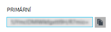

<properties
    pageTitle="Připojení webové aplikace v aplikaci služby Azure Redis mezipaměti prostřednictvím protokolu Memcache | Microsoft Azure"
    description="Připojení webové aplikace služby Azure aplikace do mezipaměti Redis pomocí protokolu Memcache"
    services="app-service\web"
    documentationCenter="php"
    authors="SyntaxC4"
    manager="wpickett"
    editor="riande"/>

<tags
    ms.service="app-service-web"
    ms.devlang="php"
    ms.topic="get-started-article"
    ms.tgt_pltfrm="windows"
    ms.workload="na"
    ms.date="02/29/2016"
    ms.author="cfowler"/>

# <a name="connect-a-web-app-in-azure-app-service-to-redis-cache-via-the-memcache-protocol"></a>Připojení webové aplikace v aplikaci služby Azure Redis mezipaměti prostřednictvím protokolu Memcache

V tomto článku se dozvíte jak připojit web app WordPress v [Aplikaci služby Azure](http://go.microsoft.com/fwlink/?LinkId=529714) do [Mezipaměti Redis Azure] [ 12] pomocí [Memcache] [ 13] protokol. Pokud máte existující webovou aplikaci, která používá Memcached server pro ukládání do mezipaměti v paměti, můžete migrace na aplikaci služby Azure a pomocí mezipaměti řešení první strany v Microsoft Azure malé nebo beze změny kód aplikace. Kromě toho můžete použít existující Memcache odborných informací k vytvoření vysoce scalable distribuované aplikace v aplikaci služby Azure s Azure Redis mezipaměti pro ukládání v paměti při používání rámců Oblíbené aplikace například .NET PHP, Node.js, Java a Python.  

Služba aplikací Web Apps umožňuje tento scénář aplikací pomocí webové aplikace Memcache překrytí, což je místního serveru Memcached, která funguje jako Memcache proxy serveru pro ukládání do mezipaměti volání Azure Redis mezipaměti. Díky aplikaci, která informuje uživatele o protokolu Memcache mezipaměti dat pomocí Redis mezipaměti. Překrytí Memcache funguje na úrovni Protocol (protokol), takže ji může používat všechny aplikace nebo aplikace framework, dokud sděluje pomocí protokolu Memcache.

[AZURE.INCLUDE [app-service-web-to-api-and-mobile](../../includes/app-service-web-to-api-and-mobile.md)] 

## <a name="prerequisites"></a>Zjistit předpoklady pro

Překrytí Memcache webu aplikace mohou sloužit u jakékoli aplikace za předpokladu, že sděluje pomocí protokolu Memcache. V tomto příkladu konkrétní odkaz aplikace je Scalable WordPress web, který můžete zřízení z Azure Marketplace.

Postupujte podle kroků uvedených v těchto článcích:

* [Zřízení instanci služby Azure Redis mezipaměti][0]
* [Nasazení Scalable WordPress webu v Azure][1]

Až budete mít Scalable WordPress webu nasazený a instanci Redis mezipaměti zřízení pak budete připraveni pokračovat povolení překrytí Memcache v Azure aplikace služby Web Apps.

## <a name="enable-the-web-apps-memcache-shim"></a>Povolení překrytí Memcache webové aplikace

Abyste mohli konfigurovat Memcache překrytí, musíte vytvořit tři nastavení aplikace. Lze to provést pomocí různých metod včetně [Azure portál](http://go.microsoft.com/fwlink/?LinkId=529715) [klasické portál][3], [Rutiny prostředí PowerShell Azure] [ 5] nebo [rozhraní příkazového řádku Azure][5]. Pro účely tento příspěvek budu používat [Portál Azure] [ 4] nastavení aplikace. Následující hodnoty můžete načtená z **Nastavení** zásuvné instance Redis mezipaměti.


### <a name="add-redishost-app-setting"></a>Přidání REDIS_HOST aplikace nastavení

Na první nastavení aplikací je potřeba vytvořit **REDIS\_hostitele** nastavení aplikace. Nastavení cíle do kterého překrytí přepošle informace mezipaměti. Hodnotu požadované pro nastavení aplikace REDIS_HOST můžete načtená z zásuvné **Vlastnosti** instance Redis mezipaměti.


Nastavit klíč nastavení aplikace **REDIS\_hostitele** a hodnotu nastavení aplikace **hostname** instance Redis mezipaměti.


### <a name="add-rediskey-app-setting"></a>Přidání REDIS_KEY aplikace nastavení

Na druhé nastavení aplikací je potřeba vytvořit **REDIS\_klíč** nastavení aplikace. Toto nastavení poskytuje že ověřovací token muset bezpečně přístup instanci Redis mezipaměti. Můžete získat hodnotu požadované pro nastavení aplikace REDIS_KEY zásuvné **přístupových kláves z verze** instance Redis mezipaměti.



Nastavit klíč nastavení aplikace **REDIS\_klíč** a hodnotu z aplikace nastavení **Primárního klíče** instance Redis mezipaměti.


### <a name="add-memcacheshimredisenable-app-setting"></a>Přidání MEMCACHESHIM_REDIS_ENABLE aplikace nastavení

Poslední aplikace nastavení slouží k povolení překrytí Memcache ve webových aplikacích, který používá pro připojení do mezipaměti Redis Azure a předat dál mezipaměti REDIS_HOST a REDIS_KEY volání. Nastavit klíč nastavení aplikace **MEMCACHESHIM\_REDIS\_povolit** a hodnotu **true**.


Jakmile dokončíte přidávání nastavení aplikace tři (3) klikněte na tlačítko **Uložit**.

## <a name="enable-memcache-extension-for-php"></a>Povolení Memcache rozšíření PHP

Aby aplikace k hovoru Memcache Protocol (protokol) je nutné nainstalovat koncovku Memcache PHP – framework jazyka pro web WordPress.

### <a name="download-the-phpmemcache-extension"></a>Stáhněte si php_memcache rozšíření

Přejděte na [PECL][6]. V části ukládání do mezipaměti kategorie klikněte na [memcache][7]. Ve sloupci stahování klikněte na odkaz DLL.


Stáhněte si nejsou vlákna bezpečí (Směřuje) x86 odkaz pro verzi PHP povolené ve webových aplikacích. (Výchozí hodnota je PHP 5.4)


### <a name="enable-the-phpmemcache-extension"></a>Povolte php_memcache rozšíření

Po stažení souboru rozbalit a nahrajte **php\_memcache.dll** do **d:\\domácí\\webu\\kořenových\\Koš\\přípona\\ ** adresář. Po se php_memcache.dll do webové aplikace, budete muset povolit rozšíření runtime PHP. Povolení rozšíření Memcache na portálu Azure, otevřete zásuvné **Nastavení aplikace** pro web app a potom přidat nové nastavení aplikace pomocí klíče **PHP\_rozšíření** a hodnotu **Koš\\přípona\\php_memcache.dll**.


> [AZURE.NOTE] Pokud web appu potřebujete-li načíst více přípon PHP, hodnota PHP_EXTENSIONS by měla být čárkou oddělený seznam relativní cest k souborům DLL.


Až budete hotovi, klikněte na **Uložit**.

## <a name="install-memcache-wordpress-plugin"></a>Nainstalujte modul plug-in Memcache WordPress

> [AZURE.NOTE] [Modul plug-in mezipaměti objekt Memcached](https://wordpress.org/plugins/memcached/) si taky můžete stáhnout z WordPress.org.

Na stránce modulů plug-in WordPress klikněte na tlačítko **Přidat nové**.


Do pole Hledat zadejte **memcached** a stiskněte klávesu **Enter**.


V seznamu vyhledejte **Mezipaměti objektů Memcached** a potom klikněte na **Nainstalovat**.


### <a name="enable-the-memcache-wordpress-plugin"></a>Povolit modul plug-in Memcache WordPress

>[AZURE.NOTE] Postupujte podle pokynů v tomto blogu o [tom, jak povolit rozšíření webu ve webových aplikacích] [ 8] nainstalovat Visual Studio týmovou.

V `wp-config.php` soubor, přidejte následující kód nad ukončit úpravy komentáře těsně před koncem soubor.

```php
$memcached_servers = array(
    'default' => array('localhost:' . getenv("MEMCACHESHIM_PORT"))
);
```

Jakmile tento kód byly vloženy, Monako automatické ukládání dokumentu.

Dalším krokem je povolit modul plug-in mezipaměti objektů. Důvodem je přetažením **objekt cache.php** ze složky **wp – obsah a moduly plug-in a memcached** do **webové části obsah** složky povolit funkci Memcache mezipaměti objektů.


Teď je **objekt cache.php** soubor ve složce **webové části obsah** , mezipaměti objektů Memcached teď povolený.


## <a name="verify-the-memcache-object-cache-plugin-is-functioning"></a>Ověření, že funguje modul plug-in Memcache mezipaměti objektů

Všechny kroky povolit překrytí webové aplikace Memcache dokončeny nyní. Vlevo jediné je k ověření, že data naplňovat instanci Redis mezipaměti.

### <a name="enable-the-non-ssl-port-support-in-azure-redis-cache"></a>Zapnutí podpory port není SSL v mezipaměti Redis Azure

>[AZURE.NOTE] Při psaní v tomto článku rozhraní příkazového řádku Redis nepodporuje připojení SSL, tedy tyto kroky jsou potřeba.

Na portálu Azure procházením Redis mezipaměti instanci, kterou jste vytvořili pro tento web app. Až do mezipaměti zásuvné se otevře, klikněte na ikonu **Nastavení** .


**Porty přístup** vyberte ze seznamu.


Klikněte na **Ne** pro **Povolit přístup jenom přes SSL**.


Zobrazí se, že je teď nastavený port NON-SSL. Klikněte na **Uložit**.


### <a name="connect-to-azure-redis-cache-from-redis-cli"></a>Připojení k Azure Redis mezipaměti z redis rozhraní příkazového řádku

>[AZURE.NOTE] Tento krok předpokládá, které redis místně nainstalovaný v počítači vývoj. [Instalace Redis místně pomocí těchto pokynů][9].

Otevřete příkazového řádku konzola podle výběru a zadejte tento příkaz:

```shell
redis-cli –h <hostname-for-redis-cache> –a <primary-key-for-redis-cache> –p 6379
```

Nahrazení ** &lt;hostname pro redis mezipaměti&gt; ** s hostname skutečné xxxxx.redis.cache.windows.net a ** &lt;primární klíč – pro redis mezipaměti&gt; ** s přístupová klávesa mezipaměti, stiskněte klávesu **Enter**. Jakmile rozhraní příkazového řádku obsahuje připojené k instanci Redis mezipaměti, zadejte příkazům redis. V následující snímek můžu jste se rozhodli seznam klíče.


Hovor do seznamu klávesy by vrátit hodnotu. Pokud ne, zkuste přejdete na web appu a opakováním.

## <a name="conclusion"></a>Uzavření

Blahopřejeme! Aplikaci WordPress má nyní centralizované mezipaměti pro usnadnění zvýšit výkon. Mějte na paměti, překrytí Memcache webových aplikací se dá používat se každého klienta Memcache bez ohledu na programovací jazyk nebo framework aplikace. Poskytnutí zpětné vazby nebo zeptejte překrytí webové aplikace Memcache publikování fóra [MSDN] [ 10] nebo [Stackoverflow][11].

>[AZURE.NOTE] Pokud chcete začít pracovat s aplikaci služby Azure před registrací účet Azure, přejděte na [Zkuste aplikaci služby](http://go.microsoft.com/fwlink/?LinkId=523751), které můžete okamžitě vytvořit web appu krátkodobý starter v aplikaci služby. Žádné povinné; kreditní karty žádné závazky.

## <a name="whats-changed"></a>Co se změnilo
* Průvodce na změnu z webů pro aplikaci služby v tématu: [aplikaci služby Azure a jejich dopad na existující služby Azure](http://go.microsoft.com/fwlink/?LinkId=529714)


[0]: ../redis-cache/cache-dotnet-how-to-use-azure-redis-cache.md#create-a-cache
[1]: http://bit.ly/1t0KxBQ
[2]: http://manage.windowsazure.com
[3]: http://portal.azure.com
[4]: ../powershell-install-configure.md
[5]: /downloads
[6]: http://pecl.php.net
[7]: http://pecl.php.net/package/memcache
[8]: http://blog.syntaxc4.net/post/2015/02/05/how-to-enable-a-site-extension-in-azure-websites.aspx
[9]: http://redis.io/download#installation
[10]: https://social.msdn.microsoft.com/Forums/home?forum=windowsazurewebsitespreview
[11]: http://stackoverflow.com/questions/tagged/azure-web-sites
[12]: /services/cache/
[13]: http://memcached.org
