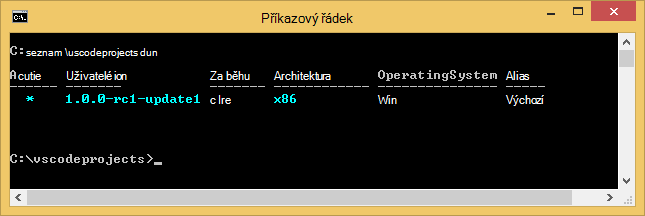
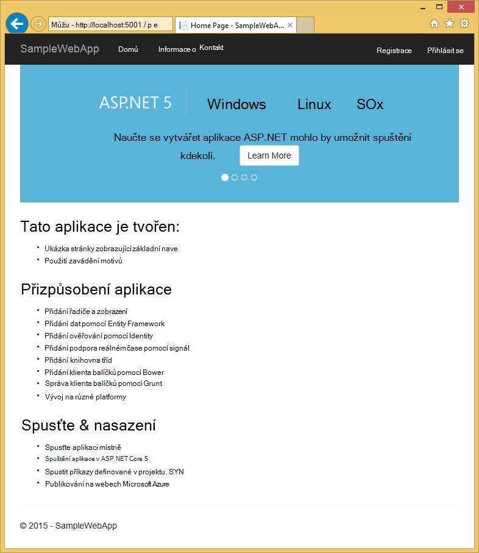
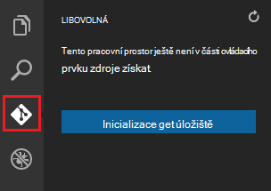
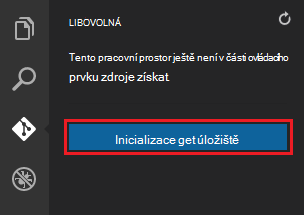
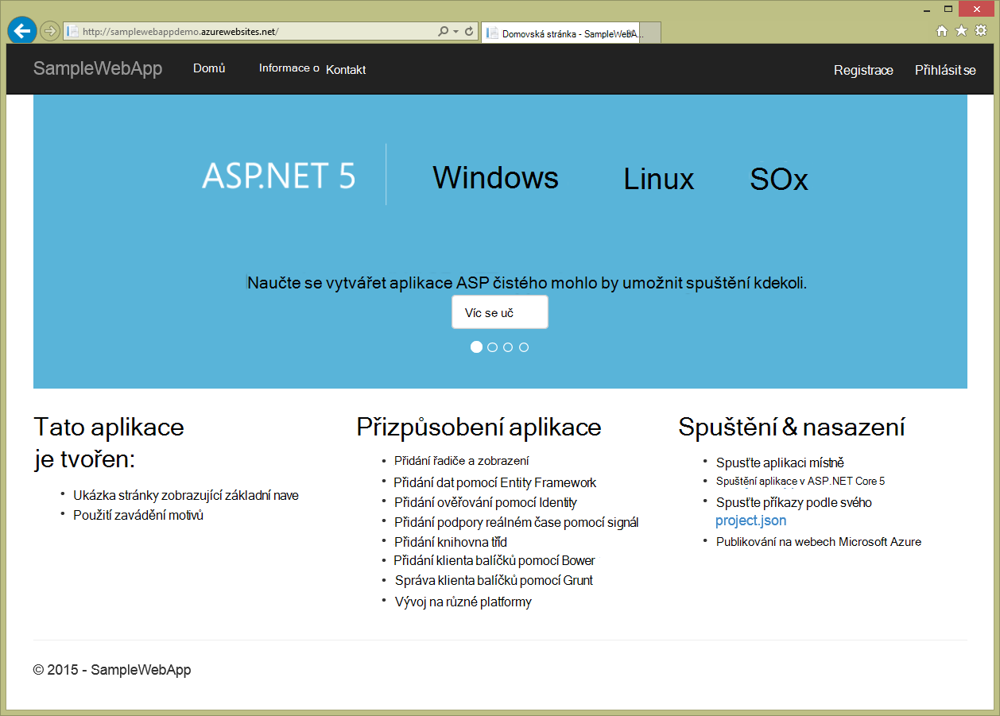

<properties
   pageTitle="Vytvořit webovou aplikaci ASP.NET 5 ve Visual Studiu kódu"
   description="Tento kurz ukazuje, jak vytvořit webovou aplikaci ASP.NET 5 pomocí aplikace Visual Studio kódu."
   services="app-service\web"
   documentationCenter=".net"
   authors="erikre"
   manager="wpickett"
   editor="jimbe"/>

<tags
    ms.service="app-service-web" 
    ms.workload="web" 
    ms.tgt_pltfrm="dotnet" 
    ms.devlang="na" 
    ms.topic="article" 
    ms.date="02/26/2016" 
    ms.author="cephalin"/>

# Vytvořit webovou aplikaci ASP.NET 5 ve Visual Studiu kódu

## Základní informace

Tento kurz se dozvíte, jak vytvořit webovou aplikaci ASP.NET 5 pomocí [Aplikace Visual Studio kód (a)](http://code.visualstudio.com//Docs/whyvscode) a nasazení služby [Azure aplikace](../app-service/app-service-value-prop-what-is.md). 

> [AZURE.NOTE] I když tento článek odkazuje na web aplikace, platí také rozhraní API aplikace a mobilní aplikace. 

Technologie ASP.NET 5 je významný vzhled ASP.NET. Technologie ASP.NET 5 je nový otevřít zdroj a různé platformy rámec pro vytváření moderní cloudové webové aplikace pomocí .NET. Další informace najdete v tématu [Úvod do technologie ASP.NET 5](http://docs.asp.net/en/latest/conceptual-overview/aspnet.html). Informace o aplikaci služby Azure web apps najdete v tématu [Přehled webových aplikacích](app-service-web-overview.md).

[AZURE.INCLUDE [app-service-web-try-app-service.md](../../includes/app-service-web-try-app-service.md)]

## Zjistit předpoklady pro  

* Instalace [a kód](http://code.visualstudio.com/Docs/setup).
* Instalace [Node.js](http://nodejs.org) - Node.js představuje platformu pro vytváření aplikací rychlé a scalable serveru sešity pomocí Javascriptového. Modul runtime (uzly) je uzel a [npm](http://www.npmjs.com/) správce balíček pro uzel moduly. Použijete npm k scaffold webovou aplikaci ASP.NET 5 v tomto kurzu.
* Instalace libovolná - si můžete nainstalovat z některého z těchto míst: [Chocolatey](https://chocolatey.org/packages/git) nebo [Libovolná scm.com](http://git-scm.com/downloads). Pokud začínáte libovolná, zvolte [Libovolná scm.com](http://git-scm.com/downloads) a vyberte možnost **Použít libovolná z příkazového řádku systému Windows**. Jakmile nainstalujete libovolná taky musíte nastavit libovolná uživatelské jméno a e-mailem jako je potřeba dál v tomto kurzu (při provádění potvrzení z a kód).  

## Instalace technologie ASP.NET 5 a DNX
ASP.NET 5/DNX (prostředí spuštění .NET) je štíhlé zásobníku .NET pro vytváření moderní cloudu a webových aplikací web apps spuštěné v operačním systému Windows, OS X a Linux. Ho má byla vytvořená základu poskytnout optimalizované vývoj rámec pro aplikace, které jsou používaný v cloudu nebo spuštění místní. Je tvořen moduly prvků s minimálními režijních, takže zachovat pružnost při vytváření vašeho řešení.

Tento kurz určen vám usnadní zahájení práce vytváření aplikací pomocí nejnovější verze vývoj ASP.NET 5 a DNX. Následující pokyny jsou specifické pro Windows. Podrobnější pokyny k instalaci OS X Linux a Windows, najdete v článku [instalace 5 ASP.NET a DNX](https://code.visualstudio.com/Docs/ASPnet5#_installing-aspnet-5-and-dnx). 

1. Pokud chcete nainstalovat .NET verze správce (DNVM) v systému Windows, otevřete příkazový řádek a spusťte tento příkaz.

        @powershell -NoProfile -ExecutionPolicy unrestricted -Command "&{$Branch='dev';iex ((new-object net.webclient).DownloadString('https://raw.githubusercontent.com/aspnet/Home/dev/dnvminstall.ps1'))}"

    To bude stažení skriptu DNVM a v adresáři vašeho uživatelského profilu. 

2. **Restartujte Windows** dokončete instalaci DNVM. 

    Po restartování Windows můžete otevřít příkazového řádku pro ověření umístění DNVM zadáním následujících akcí:

        where dnvm

    Okno příkazového řádku se zobrazí cesty podobně jako tento.

    

3. Teď, když máte DNVM, musíte ji použijete k stáhnout DNX ke spuštění aplikace. Na příkazovém řádku spusťte následující:

        dnvm upgrade

    Ověření vašeho DNVM a zobrazit aktivní runtime zadáním následujícího příkazového řádku:

        dnvm list

    Do příkazového řádku se zobrazí podrobnosti o aktivní runtime.

    

    Pokud víc runtime DNX je uvedeno, můžete zadat následující (nebo novější verzi) na příkazovém řádku nastavit aktivní runtime DNX. Nastavte ve stejné verzi, používaná generátor ASP.NET 5 při vytváření aplikace pro web dál v tomto kurzu. *Není třeba změnit runtime modul aktivní, pokud je nastavena na nejpozději k dispozici.*

        dnvm use 1.0.0-update1 –p

> [AZURE.NOTE] Podrobnější pokyny k instalaci OS X Linux a Windows, najdete v článku [instalace 5 ASP.NET a DNX](https://code.visualstudio.com/Docs/ASPnet5#_installing-aspnet-5-and-dnx). 

## Vytvoření webové aplikace 

Tato část popisuje scaffold novou webovou aplikaci pro aplikaci ASP.NET. Správce balíčků uzel (npm) se používají k instalaci [Yeoman](http://yeoman.io/) (nástroj pro generování uživatelského rozhraní aplikace – a kód ekvivalent Visual Studio **Soubor > Nový projekt** operace), [Grunt](http://gruntjs.com/) (JavaScript úkolu runner) a [Bower](http://bower.io/) (správce klienta straně balíčku). 

1. Otevřete okno příkazového řádku s oprávněními správce a přejděte do umístění, kde chcete vytvořit projekt ASP.NET. Například vytvořte adresář *vscodeprojects* na kořenové úrovni C:\.

2. Zadejte tento příkaz příkazového řádku nainstalovat Yeoman a podpůrných nástrojů.

        npm install -g yo grunt-cli generator-aspnet bower

    > [AZURE.NOTE] Může se zobrazit upozornění znázorňující, že vaše npm je aktuální. Toto upozornění nemá vliv na tomto kurzu.

3. Zadejte tento příkaz příkazového řádku a vytvořte složku projektu scaffold aplikace.

        yo aspnet

4. Pomocí kláves se šipkami vyberte požadovaný typ **Webové aplikace základní** z nabídky generátor ASP.NET 5 a stiskněte klávesu ** &lt;Enter >**.

    

5. Zadejte název nové webové aplikace ASP.NET **SampleWebApp**. Jak tento název je použít v celém kurz, pokud jste vybrali jiným názvem, musíte ho nahradit všechny výskyty **SampleWebApp**. Po stisknutí kláves ** &lt;Enter >**, Yeoman vytvoří novou složku nazvanou **SampleWebApp** a soubory potřebné pro novou aplikaci.

6. Na příkazovém řádku změňte adresáře do nové složky projektu:

        cd SampleWebApp

7. Také na příkazovém řádku nainstalovat potřebné balíčků NuGet spustit aplikaci, zadejte tento příkaz:

        dnu restore

8. Otevření kódu a zadáním následujícího příkazového řádku:

        code .

## Místně spustit web app

Teď, když jste vytvořili web appu a načíst všechny NuGet balíčky aplikace, můžete použít web appu místně.

1. Z **Palety příkaz** v kódu a zadejte tento příkaz zobrazíte možnosti k dispozici příkaz run:

        dnx: Run Command

    > [AZURE.NOTE] Pokud Omnisharp server neběží, spustí se. Znovu zadejte příkaz výše.

    Potom vyberte tento příkaz Spustit webovou aplikaci:
        
        dnx web - (SampleWebApp)

    Do příkazového řádku se zobrazí, že vaše aplikace spustila. Pokud okna příkazového nezobrazí tato zpráva, zkontrolujte dolním levém corning kódu a chyb v projektu.
    
    > [AZURE.NOTE]Vystavení příkazu z **Palety příkaz** vyžaduje **>** znak na začátku příkazového řádku. Můžete zobrazit podrobnosti související s příkazem **webové** v souboru *project.json* .   
    > Pokud příkaz nezobrazí nebo není k dispozici, budete muset nainstalovat rozšíření C#. Spuštění `>Extensions: Install Extension` a `ext install c#` nainstalovat rozšíření C#.

2. Otevřete prohlížeč a přejděte na následující adresu URL.

    **http://localhost:5000**

    Výchozí stránky ve web appu bude vypadat takto.

    

3. Zavřete okno prohlížeče. V **Okně příkazového řádku**stisknutím **Kombinace kláves Ctrl + C** ukončete aplikaci a zavřete **Okno příkazového řádku**. 

## Vytvoření webové aplikace v portálu Azure

Vytvoření webové aplikace na portálu Azure se provede následující kroky.

1. Přihlaste se k [portálu Azure](https://portal.azure.com).

2. Klikněte na tlačítko **Nový** v horní levé části na portálu.

3. Klikněte na **webové aplikace > webové aplikace**.

    

4. Zadejte hodnoty **název**, například **SampleWebAppDemo**. Všimněte si, že tento název musí být jedinečný a portálu vynutíte, když se pokusíte zadejte název. Proto při výběru možnosti enter jinou hodnotu, bude nutné nahrazovat daná hodnota u každého výskytu **SampleWebAppDemo** , která se zobrazí v tomto kurzu. 

5. Vyberte existující **Plán služeb aplikací** nebo vytvořte novou. Pokud vytváříte nový plán vyberte ceny osy, umístění a další možnosti. Další informace o aplikaci služby plány naleznete v článku [Přehled hloubkovou plány aplikaci služby Azure](../app-service/azure-web-sites-web-hosting-plans-in-depth-overview.md).

    

6. Klikněte na **vytvořit**.

    

## Povolení libovolná publikování pro nový web app

Libovolná je systému správy verzí distribuované použitý pro nasazení webovou aplikaci služby Azure aplikace. Chcete ukládat kód, který napíšete pro webovou aplikaci v místním úložišti libovolná a budete nasadíte kódu Azure stisknutím do vzdálené úložiště.   

1. Přihlaste se k [portálu Azure](https://portal.azure.com).

2. Klikněte na **Procházet**.

3. Klikněte na **Web Apps** zobrazíte seznam aplikací web apps přidružený k předplatnému Azure.

4. Vyberte v prohlížeči, který jste vytvořili v tomto kurzu.

5. Ve webové aplikaci zásuvné, klikněte na **Nastavení** > **průběžné nasazení**. 

    

6. Klikněte na **vyberete zdroj > místní úložiště libovolná**.

7. Klikněte na **OK**.

    

8. Pokud jste dříve si nenastavili nasazení přihlašovací údaje pro publikování webových aplikací nebo jiných aplikací aplikaci služby, nastavíte je teď:

    * Klikněte na **Nastavení** > **Nasazení pověření**. Zobrazí se zásuvné **nastavit přihlašovací údaje nasazení** .

    * Vytvořte uživatelské jméno a heslo.  Musíte toto heslo později při nastavování libovolná.

    * Klikněte na **Uložit**.

9. V zásuvné webovou aplikaci, klikněte na **Nastavení > Vlastnosti**. Adresa URL vzdálené libovolná úložiště, které budete nasazení se zobrazuje v části **Adresa URL libovolná**.

10. Zkopírujte **Adresu URL libovolná** hodnota pro pozdější použití v tomto kurzu.

    

## Publikování webové aplikace na aplikaci služby Azure

V této části vytvoříte místní úložiště libovolná a nabízených z této úložiště na Azure nasadit webovou aplikaci Azure.

1. V kódu a vyberte možnost **Libovolná** v levém navigačním panelu.

    

2. Vyberte, abyste měli jistotu, že pracovního prostoru je v části ovládacího prvku zdroje libovolná **Inicializace libovolná úložiště** . 

    

3. Otevřete okno příkazového a změňte adresářů do adresáře vaší webové aplikace. Zadejte tento příkaz:

        git config core.autocrlf false

    Tento příkaz zabrání problém o kde Line FEED konce a LF konce se jedná o text.

4. V kódu a přidejte potvrdit zprávu a klikněte na **Potvrdit všechny** ikona kontroly.

    

5. Po dokončení zpracování libovolná uvidíte, že nejsou žádné soubory uvedené v okně libovolná v části **změny**. 

    

6. Změna zpátky do okna příkazového kde příkazového řádku odkazuje na adresář, kde je uložena webovou aplikaci.

7. Vytvoření vzdáleného odkazu pro předání aktualizace do webové aplikace pomocí adresy URL libovolná (končí ".git"), který jste si zkopírovali.

        git remote add azure [URL for remote repository]

8. Konfigurace libovolná místně uložit přihlašovacích údajů tak, aby se být automaticky přidána na příkazy nabízených generované a kód.

        git config credential.helper store

9. Použít změny pro Azure zadáním následujícího příkazu. Po tomto počáteční nabízených Azure budou moct dělat všechny příkazy nabízených na a kód. 

        git push -u azure master

    Zobrazí se výzva k zadání hesla, který jste vytvořili dříve v Azure. **Poznámka: Heslo nebude vidět.**

    Výstup z výše uvedených příkaz ukončí se zprávou, že nasazení byla úspěšně dokončena.

        remote: Deployment successful.
        To https://user@testsite.scm.azurewebsites.net/testsite.git
        [new branch]      master -> master

> [AZURE.NOTE] Pokud uděláte změny aplikace, můžete znovu publikovat přímo v kódu a pomocí předdefinovaných funkcí libovolná tak, že vyberete možnost **Potvrdit vše** a pak na možnost **nabízená** . Zjistíte **nabízená** možnost je dostupná v nabídce rozevíracího seznamu vedle tlačítka **Potvrdit všechny** a **aktualizace** .

Pokud potřebujete ke spolupráci na projektu, měli byste zvážit předání do GitHub mezi předání do Azure.

## Spuštění aplikace v Azure
Teď jste nasadili webovou aplikaci, Pojďme spustit aplikaci během hostované v Azure. 

Můžete to udělat dvěma způsoby:

* Otevřete prohlížeč a zadejte název svojí webové aplikace následujícím způsobem.   

        http://SampleWebAppDemo.azurewebsites.net
 
* Na portálu Azure vyhledejte zásuvné webových aplikací pro webovou aplikaci a klikněte na tlačítko **Procházet** k zobrazení aplikace 
* ve výchozím prohlížeči.

## Souhrn
V tomto kurzu se naučíte vytvořit web appu v kódu a a ho nasadit do Azure. Další informace o kódu a najdete v článku [Proč Visual Studio kód?](https://code.visualstudio.com/Docs/) Informace o aplikaci služby web apps najdete v tématu [Přehled webových aplikacích](app-service-web-overview.md). 
