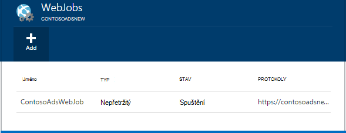
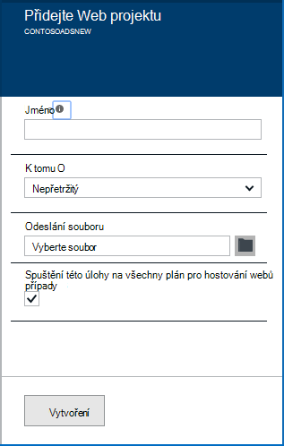
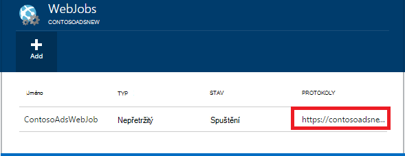

<properties 
    pageTitle="Spuštění úlohy na pozadí s WebJobs" 
    description="Zjistěte, jak provádět úlohy na pozadí v Azure web apps." 
    services="app-service" 
    documentationCenter="" 
    authors="tdykstra" 
    manager="wpickett" 
    editor="jimbe"/>

<tags 
    ms.service="app-service" 
    ms.workload="na" 
    ms.tgt_pltfrm="na" 
    ms.devlang="na" 
    ms.topic="article" 
    ms.date="04/27/2016" 
    ms.author="tdykstra"/>

# <a name="run-background-tasks-with-webjobs"></a>Spuštění úlohy na pozadí s WebJobs

## <a name="overview"></a>Základní informace

Spuštěním programů nebo skriptů v WebJobs ve vaší webové aplikaci [Aplikaci služby](http://go.microsoft.com/fwlink/?LinkId=529714) třemi způsoby: Služba průběžně, nebo podle plánu. Neexistuje žádná další nákladů na použití WebJobs.

Tento článek ukazuje, jak nasazení WebJobs pomocí [Portálu Azure](https://portal.azure.com). Informace o tom, jak nasadit pomocí aplikace Visual Studio nebo doručení nepřetržitý proces najdete v článku [jak WebJobs Azure nasadit na Web Apps](websites-dotnet-deploy-webjobs.md).

Azure WebJobs SDK zjednoduší mnoho WebJobs programovacím úkoly. Další informace najdete v tématu [Co je WebJobs SDK](websites-dotnet-webjobs-sdk.md).

 Funkce Azure (aktuálně v náhledu) je další způsob, jak spouštět programy a skripty v aplikaci služby Azure. Další informace najdete v tématu [Přehled funkcí Azure](../azure-functions/functions-overview.md).

[AZURE.INCLUDE [app-service-web-to-api-and-mobile](../../includes/app-service-web-to-api-and-mobile.md)] 

## <a name="acceptablefiles"></a>Typy souborů přijatelné skripty a programy

Přijaté následující typy souborů:

* cmd, BAT, .exe (pomocí windows cmd)
* .ps1 (pomocí powershellu)
* .SH (s využitím flám)
* PHP (pomocí php)
* .PY (pomocí python)
* JS (pomocí uzel)
* .JAR (pomocí jazyka java)

## <a name="CreateOnDemand"></a>Vytvoření na vyžádání WebJob na portálu

1. Ve **Web Appu** zásuvné [Portál Azure](https://portal.azure.com)klikněte na **všechna nastavení > WebJobs** zobrazíte zásuvné **WebJobs** .
    
    
    
5. Klikněte na **Přidat**. Zobrazí se dialogové okno **Přidat WebJob** .
    
    
    
2. Do pole **název**zadejte název WebJob. Název musí začínat písmenem nebo číslo a nesmí obsahovat speciální znaky jiné než "-" a "_".
    
4. V dialogovém okně **jak spustit** vyberte **Spustit jako služba**.
    
3. V dialogovém okně **Odeslat soubor** klikněte na ikonu složky a vyhledejte soubor zip obsahujícího skript. Soubor zip by měl obsahovat váš spustitelný soubor (.exe cmd bat .sh PHP .py js) i všechny podpůrné soubory potřebné ke spuštění programu nebo skriptu.
    
5. Zaškrtněte políčko **vytvořit** a nahrát skriptu do webové aplikace. 
    
    Název, který jste definovali pro WebJob se zobrazí v seznamu na zásuvné **WebJobs** .
    
6. WebJob, klikněte pravým tlačítkem na jeho název v seznamu a klikněte na příkaz **Spustit**.
    
    
    
## <a name="CreateContinuous"></a>Vytvoření nepřetržitě pracovního WebJob

1. Vytvoření nepřetržitě provádění WebJob, postupujte stejně pro vytváření WebJob, že se spustí jednou, ale v dialogovém okně **jak spustit** zvolte **nepřetržitě**.

2. Zahájení nebo ukončení průběžné WebJob, klikněte pravým tlačítkem myši WebJob v seznamu a klikněte na **Spustit** nebo **Zastavit**.
    
> [AZURE.NOTE] Pokud váš web appu získáte na více než jedna instance nepřetržitě pracovního WebJob spustí ve všech vašich instancí. Na vyžádání a plánovanou WebJobs spustit jedna instance vybrali tak, že Microsoft Azure Vyrovnávání zatížení.
    
> Nepřetržitý WebJobs spuštění problémy se spolehlivým a u všech instancí povolit vždy na * konfigurace nastavení pro webovou aplikaci jinak budou zastavit spuštěný webu hostitele Správce služeb nečinný příliš dlouho.

## <a name="CreateScheduledCRON"></a>Vytvoření plánované WebJob pomocí výrazu CRON

Tento postup je k dispozici pro spuštění v režimu Basic, standardní nebo Premium webových aplikací Web Apps a vyžaduje nastavení **Vždy na** aktivní na aplikace.

Nastavit na službu WebJob plánované WebJob, jednoduše zahrnout `settings.job` soubor v kořenovém souboru zip WebJob. Tento soubor JSON by měl obsahovat `schedule` vlastnost s [CRON výraz](https://en.wikipedia.org/wiki/Cron), v následujícím příkladu.

Výraz CRON se skládá ze 6 polí: `{second} {minute} {hour} {day} {month} {day of the week}`.

Například aktivace vaší WebJob každých 15 minut vaše `settings.job` byste měli:

```json
{
    "schedule": "0 */15 * * * *"
}
``` 

Další příklady plánu CRON:

- Každou hodinu (tedy pokaždé, když má počet minut hodnotu 0):`0 0 * * * *` 
- Každou hodinu z 9: 00 odp 5:`0 0 9-17 * * *` 
- Na 9:30 dopoledne každý den:`0 30 9 * * *`
- Na 9:30 dopoledne každý den týdne:`0 30 9 * * 1-5`

**Poznámka**: při nasazení WebJob z aplikace Visual Studio, zkontrolujte, že označit vaše `settings.job` vlastnosti souboru jako kopie Pokud novější.


## <a name="CreateScheduled"></a>Vytvoření plánované WebJob Plánovač Azure

Následující postup alternativní využívá plánovači Azure. V tomto případě vaší WebJob nemá přímočaře znalost plánu. Místo toho plánovači Azure získá nakonfigurované tak, aby aktivace WebJob podle plánu. 

Na portálu Azure ještě nemá možnost vytvořit plánované WebJob, ale až do funkce se přidá, že můžete to udělat pomocí [klasické portálu](http://manage.windowsazure.com).

1. [Klasický portál](http://manage.windowsazure.com) přejděte na stránku WebJob a klikněte na **Přidat**.

1. V dialogovém okně **jak spustit** zvolte **Spustit podle plánu**.
    
    ![Nové úlohy][NewScheduledJob]
    
2. Vyberte **Oblast Plánovač** práce a potom klikněte na šipku v pravém dolním rohu dialogového okna přejděte na další obrazovce.

3. V dialogovém okně **Vytvořit úlohy** zvolte typ **opakování** chcete: **jednorázové úlohu** nebo **Periodický**.
    
    ![Naplánovat opakování][SchdRecurrence]
    
4. Také nastavit čas **spuštění** : **teď** nebo **na určitou dobu**.
    
    ![Spuštění plánu][SchdStart]
    
5. Pokud chcete začít v daném čase, zvolte počáteční časových hodnot ve skupině **Spuštění**.
    
    ![Zahájení plánování v daném čase][SchdStartOn]
    
6. Pokud jste se rozhodli opakovanou úlohu, máte **Opakovat každé** možnost zvolit frekvenci opakování události a **Končící na** lze zadat koncový čas.
    
    ![Naplánovat opakování][SchdRecurEvery]
    
7. Pokud se rozhodnete **týdnů**, můžete vybrat pole **Podle určitého plánu** a určete, které dny v týdnu, který chcete úlohu.
    
    ![Plán dny v týdnu][SchdWeeksOnParticular]
    
8. Pokud zvolíte **měsíce** a zaškrtněte políčko **Podle určitého plánu** , můžete nastavit úlohu na určité číslovaný **dny** v měsíci. 
    
    ![Naplánování konkrétní dat v měsíci.][SchdMonthsOnPartDays]
    
9. Pokud se rozhodnete **Pracovních dnů**, můžete zvolit který den nebo dny v týdnu měsíc má úlohy na spustit.
    
    ![Naplánování určitého týdne dny v měsíci][SchdMonthsOnPartWeekDays]
    
10. Nakonec můžete také **výskytů** možnost zvolit který týden v měsíci (nejdřív druhá třetí atd.) má spuštění úlohy v pracovních dnů jste zadali.
    
    ![Plánování dnů určitého týdne na konkrétní týdnů za měsíc][SchdMonthsOnPartWeekDaysOccurences]
    
11. Pokud jste vytvořili jeden nebo více úkolů, jejich jména se zobrazí na kartě WebJobs s jejich stavem naplánování typu a dalších informací. Historie informace o posledních 30 WebJobs zachovaná.
    
    ![Seznam úloh][WebJobsListWithSeveralJobs]
    
### <a name="Scheduler"></a>Naplánovaných úloh a Plánovač Azure

Naplánovaných úloh je možné dále konfigurovat na stránkách Azure Plánovač [klasické portálu](http://manage.windowsazure.com).

1.  Na stránce WebJobs kliknutím na odkaz **plánu** projektu přejděte na stránku portálu Plánovač Azure. 
    
    ![Odkaz na Azure Plánovač][LinkToScheduler]
    
2. Na stránce Plánovač klikněte na úkoly.
    
    ![Na stránce portálu Plánovač projekt][SchedulerPortal]
    
3. Otevře se stránka **Akce úlohy** , kde lze konfigurovat další úkoly. 
    
    ![Akce úlohy PageInScheduler][JobActionPageInScheduler]
    
## <a name="ViewJobHistory"></a>Zobrazení historie úlohy

1. Jak zobrazit historii spuštění úlohy, včetně úloh vytvořené pomocí WebJobs SDK, klikněte na příslušný odkaz ve sloupci **protokoly** zásuvné WebJobs. (Můžete ikonu schránky zkopírujte adresu URL stránce soubor protokolu do schránky, pokud chcete, můžete si.)
    
    
        
2. Kliknutí na odkaz otevře stránku Podrobnosti WebJob. Tato stránka zobrazuje název na příkaz spustit, kolikrát poslední spustili a jeho úspěšně nebo neúspěšně. V části **poslední úlohy**klikněte na čas zobrazíte další podrobnosti.
    
    ![WebJobDetails][WebJobDetails]
    
3. Zobrazí se stránka **WebJob spustit podrobnosti** . Klikněte na **Přepínač výstup** zobrazíte text obsah protokolu. Protokol výstup je ve formátu textu. 
    
    ![Spuštění podrobnosti úlohy Web][WebJobRunDetails]
    
4. Výstup text zobrazíte v samostatném okně prohlížeče, klikněte na odkaz **Stáhnout** . Pokud si Pokud chcete stáhnout samotný text, klikněte pravým tlačítkem odkaz a uložte obsah souboru pomocí možnosti prohlížeče.
    
    ![Stáhněte si výstup protokolu][DownloadLogOutput]
    
5. Odkaz **WebJobs** v horní části stránky poskytuje pohodlný způsob, jak získat seznam WebJobs na řídicím panelu Historie.
    
    ![Propojení se seznamem WebJobs][WebJobsLinkToDashboardList]
    
    ![Seznam WebJobs na řídicím panelu Historie][WebJobsListInJobsDashboard]
    
    Klikněte na jednu z těchto odkazů přejdete na stránku Podrobnosti WebJob pro daný úkol, který jste vybrali.


## <a name="WHPNotes"></a>Poznámky
    
- Web apps v bezplatné režimu můžete vypršení časového limitu po 20 minut, pokud nejsou žádné požadavky na stránce Správce služeb (nasazení) a webové aplikace portál v Azure otevřít. Požadavky na aktuální web nebude obnovit takto.
- Kód pro průběžné úlohu potřebuje měly zapisovat nekonečné opakování.
- Nepřetržitý úlohy souvislá pouze v případě web appu nahoru.
- Základní a standardní režimy nabídky vždy na funkcí, které, když povolíte, zabrání webové aplikace stále nečinný.
- Můžete jenom ladění nepřetržitě systém WebJobs. Ladění plánované nebo na vyžádání WebJobs není podporovaná.

## <a name="NextSteps"></a>Další kroky
 
Další informace najdete v tématu [Azure WebJobs doporučené zdroje][WebJobsRecommendedResources].

[PSonWebJobs]:http://blogs.msdn.com/b/nicktrog/archive/2014/01/22/running-powershell-web-jobs-on-azure-websites.aspx
[WebJobsRecommendedResources]:http://go.microsoft.com/fwlink/?LinkId=390226

[OnDemandWebJob]: ./media/web-sites-create-web-jobs/01aOnDemandWebJob.png
[WebJobsList]: ./media/web-sites-create-web-jobs/02aWebJobsList.png
[NewContinuousJob]: ./media/web-sites-create-web-jobs/03aNewContinuousJob.png
[NewScheduledJob]: ./media/web-sites-create-web-jobs/04aNewScheduledJob.png
[SchdRecurrence]: ./media/web-sites-create-web-jobs/05SchdRecurrence.png
[SchdStart]: ./media/web-sites-create-web-jobs/06SchdStart.png
[SchdStartOn]: ./media/web-sites-create-web-jobs/07SchdStartOn.png
[SchdRecurEvery]: ./media/web-sites-create-web-jobs/08SchdRecurEvery.png
[SchdWeeksOnParticular]: ./media/web-sites-create-web-jobs/09SchdWeeksOnParticular.png
[SchdMonthsOnPartDays]: ./media/web-sites-create-web-jobs/10SchdMonthsOnPartDays.png
[SchdMonthsOnPartWeekDays]: ./media/web-sites-create-web-jobs/11SchdMonthsOnPartWeekDays.png
[SchdMonthsOnPartWeekDaysOccurences]: ./media/web-sites-create-web-jobs/12SchdMonthsOnPartWeekDaysOccurences.png
[RunOnce]: ./media/web-sites-create-web-jobs/13RunOnce.png
[WebJobsListWithSeveralJobs]: ./media/web-sites-create-web-jobs/13WebJobsListWithSeveralJobs.png
[WebJobLogs]: ./media/web-sites-create-web-jobs/14WebJobLogs.png
[WebJobDetails]: ./media/web-sites-create-web-jobs/15WebJobDetails.png
[WebJobRunDetails]: ./media/web-sites-create-web-jobs/16WebJobRunDetails.png
[DownloadLogOutput]: ./media/web-sites-create-web-jobs/17DownloadLogOutput.png
[WebJobsLinkToDashboardList]: ./media/web-sites-create-web-jobs/18WebJobsLinkToDashboardList.png
[WebJobsListInJobsDashboard]: ./media/web-sites-create-web-jobs/19WebJobsListInJobsDashboard.png
[LinkToScheduler]: ./media/web-sites-create-web-jobs/31LinkToScheduler.png
[SchedulerPortal]: ./media/web-sites-create-web-jobs/32SchedulerPortal.png
[JobActionPageInScheduler]: ./media/web-sites-create-web-jobs/33JobActionPageInScheduler.png
 
