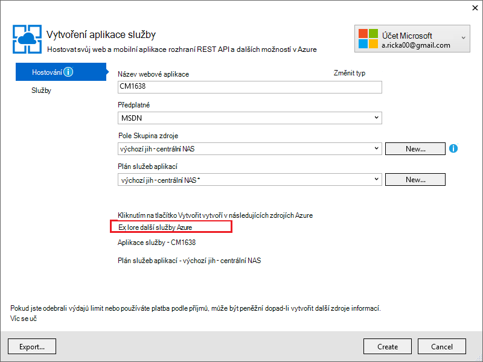
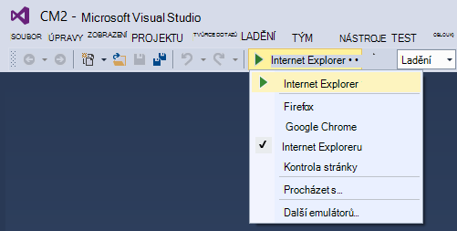
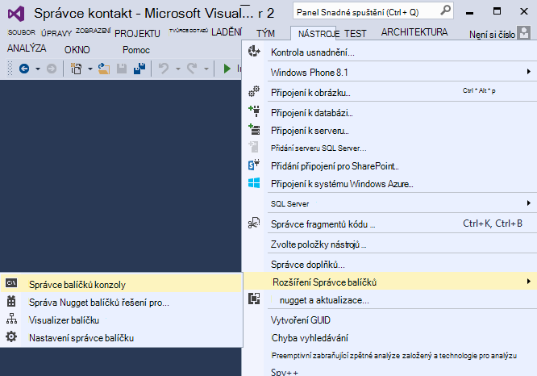

<properties 
    pageTitle="Vytvoření aplikace pro ASP.NET MVC s auth a SQL databáze a nasazení aplikace služby Azure" 
    description="Zjistěte, jak můžete vyvíjet aplikace ASP.NET MVC 5 s back-end databáze SQL a tak mohli ověřovat a přidejte ho nasadit do Azure." 
    services="app-service\web" 
    documentationCenter=".net" 
    authors="Rick-Anderson" 
    writer="Rick-Anderson" 
    manager="wpickett" 
    editor=""/>

<tags 
    ms.service="app-service-web" 
    ms.workload="web" 
    ms.tgt_pltfrm="na" 
    ms.devlang="dotnet" 
    ms.topic="article" 
    ms.date="03/21/2016" 
    ms.author="riande"/> 

# Vytvoření aplikace pro ASP.NET MVC s auth a SQL databáze a nasazení aplikace služby Azure

Tento kurz ukazuje, jak vytvářet do zabezpečené technologie ASP.NET MVC 5 webových aplikací, který umožňuje uživatelům přihlášení pomocí přihlašovacích údajů z Facebooku nebo Google. Aplikace je jednoduchý seznamu kontaktů, které používá ADO.NET Entity Framework pro přístup k databázi. Aplikace se nasadit [aplikaci](http://go.microsoft.com/fwlink/?LinkId=529714)služby Azure. 

Na Přejít ke kurzu, budete mít zabezpečené založených na datech webovou aplikaci nahoru práce v cloudu a práce s databází cloudu. Následující obrázek znázorňuje na přihlašovací stránku aplikace dokončený.

![přihlašovací stránka][rxb]

Se dozvíte:

* Jak vytvořit projekt web zabezpečené technologie ASP.NET MVC 5 ve Visual Studiu.
* Jak ověřit a povolte uživatelům, kteří se přihlásí pomocí přihlašovacích údajů z účtů Google nebo Facebook (sociální poskytovatele ověřování pomocí [OAuth 2.0](http://oauth.net/2 "http://oauth.net/2")).
* Jak ověřit a povolte uživatelům, kteří zaregistrovat v databázi spravuje aplikace (místní ověřování pomocí [Technologie ASP.NET Identity](http://asp.net/identity/)).
* Jak používat ADO.NET Entity Framework 6 kód 1 pro čtení a zápis dat do databáze SQL.
* Jak používat Entity Framework kód první migrace nasadit databázi.
* Jak uložit relačních dat v cloudu pomocí databáze SQL Azure.
* Postup pro nasazení web projektu, který využívá databázi pro [web app](http://go.microsoft.com/fwlink/?LinkId=529714) v aplikaci služby Azure.

>[AZURE.NOTE] Toto je dlouhý kurz. Pokud budete potřebovat rychlý úvod popisující projekty webovou aplikaci služby Azure a Visual Studia, najdete v článku [vytvořit webovou aplikaci ASP.NET v aplikaci služby Azure](web-sites-dotnet-get-started.md). Poradce při potížích s informacemi, naleznete v části [Poradce při potížích](#troubleshooting) .
>
>Nebo pokud chcete začít pracovat s aplikaci služby Azure před registrací účet Azure, [Zkuste aplikaci služby](http://go.microsoft.com/fwlink/?LinkId=523751), které můžete okamžitě vytvořit web appu krátkodobý starter v aplikaci služby. Žádné povinné; kreditní karty žádné závazky.

## Zjistit předpoklady pro

Pro dokončení tohoto kurzu, třeba účet Microsoft Azure. Pokud nemáte účet, můžete [aktivovat své Visual Studio účastnická výhody](/pricing/member-offers/msdn-benefits-details/?WT.mc_id=A261C142F) nebo [zaregistrovat bezplatnou zkušební verzi](/pricing/free-trial/?WT.mc_id=A261C142F).

Pokud chcete nastavit vývojové prostředí, musíte nainstalovat [Visual Studio 2013 aktualizaci 5](http://go.microsoft.com/fwlink/?LinkId=390521) nebo novější a nejnovější verzi [Azure SDK pro .NET](http://go.microsoft.com/fwlink/?linkid=324322&clcid=0x409). Tento článek je určen pro Visual Studio aktualizace 4 a SDK 2.8.1. Stejné pokyny fungovat Visual Studio 2015 s nejnovější [Azure SDK pro .NET](http://go.microsoft.com/fwlink/?linkid=518003&clcid=0x409) nainstalovaný, ale některé obrazovky bude vypadat lišit od obrázků.

## Vytvoření aplikace ASP.NET MVC 5

### Vytvoření projektu

1. V nabídce **soubor** klikněte na **Nový projekt**.

    

1. V dialogovém okně **Nový projekt** rozbalte **C#** a vyberte **Web** podle **Nainstalované šablony**a vyberte **ASP.NET webová aplikace**. Pojmenujte aplikace **ContactManager**a potom klikněte na **OK**.

    
 
    **Poznámka:** Zkontrolujte, že zadáte "ContactManager". Kód bloky, které jste se později kopírování předpokládá, že název projektu je ContactManager. 

1. V dialogovém okně **Nový projekt ASP.NET** vyberte šablonu **MVC** . Zkontrolujte **ověřování** nastavena na **Jednotlivých uživatelských účtů**, je zaškrtnuté políčko **hostitele v cloudu** , **Aplikaci služby** je vybraná možnost.

    

1. Klikněte na **OK**.

1. Zobrazí se dialogové okno **Konfigurovat nastavení Microsoft Azure Web App** . Budete muset přihlásit, pokud jste tak již neučinili nebo zadejte nové přihlašovacích údajů, pokud vypršela přihlašovací jméno.

1. Nepovinné: Změna zadejte hodnotu do pole **název webové aplikace** (viz obrázek dole).

    Adresa URL webové aplikace budou {název} .azurewebsites .net, aby název musí být jedinečný v doméně azurewebsites.net. Průvodce konfigurací navrhuje jedinečný název přidáním číslo k názvu projektu "ContactManager" a který je v pořádku pro účely tohoto návodu.

5. **Pole Skupina zdroje** rozevíracího seznamu vyberte existující skupiny nebo **vytvořit nové skupiny prostředků**(viz obrázek dole). 

    Pokud chcete, můžete vybrat skupina zdroje, které už máte. Ale pokud vytvoření nové skupiny prostředků a použít ji jenom na tento kurz, bude možné snadno odstranit všechny Azure zdroje, který jste vytvořili pro kurz až to budete mít s nimi. Informace o skupinách prostředků najdete v článku [Přehled Správce prostředků Azure](../azure-resource-manager/resource-group-overview.md). 

5. V **aplikaci služby plán** vyberte rozevírací seznam vyberte existující plán nebo **vytvořit novou aplikaci služby plánování**(viz obrázek dole).

    Pokud chcete, můžete vybrat plán aplikace služeb, které už máte. Informace o různých plánech aplikaci služby najdete v tématu [Přehled hloubkovou plány aplikaci služby Azure](../app-service/azure-web-sites-web-hosting-plans-in-depth-overview.md). 

1. Klepněte na **Další služby Azure prozkoumat** přidat databázi SQL.

    

1. Klepněte **+** ikony pro přidání databázi SQL.

    

1. Klepněte na **Nový** v dialogovém okně **Konfigurovat databázi SQL** :

    

1. Zadejte název pro správce a silné heslo.

    

    Název serveru musí být jedinečná. Může obsahovat malá písmena, číslice a spojovníky. Nesmí obsahovat koncových spojovníku. Uživatelské jméno a heslo jsou nové přihlašovací údaje, který vytváříte nový serveru. 

    Pokud už máte databázový server, můžete zvolit, místo abyste vytvářeli jeden. Databázový server cenné zdrojem informací jsou a obecně Chcete-li vytvořit více databází na stejný server pro testování a vývoj nevytvářejte databázovým serverem na databázi. Však pro účely tohoto návodu potřebujete jenom server dočasně a vytvořením serveru ve stejné skupině zdroje jako web je to snadný způsob odstranit obou webové aplikace a databáze prostředky odstraněním skupina zdroje až to budete mít s kurzu. 

    Pokud vyberete existující databázový server, zkontrolujte, že váš web appu a databáze jsou ve stejné oblasti.

    

4. Klepněte na **vytvořit**.

    Visual Studio vytvoří web projektu ContactManager, vytvoří pole Skupina zdroje a plán služeb aplikací, kterou jste zadali, a vytvoří do webových aplikací v aplikaci služby Azure se zadaným názvem.

### Nastavit záhlaví a zápatí

1. V **Okně Průzkumník** otevřete soubor *Layout.cshtml* ve složce *Views\Shared* .

    ![_Layout.cshtml v Průzkumníku řešení][newapp004]

1. Nahraďte ActionLink v souboru *Layout.cshtml* následující kód.

    @Html.ActionLink("CMUkázka","Index","Kontaktů", nové {oblasti =" "}, nové { @class ="navigační panel značku"})
                   

    Zkontrolujte, že změníte třetí parametr "Doma" k "Kontakty". Revize výše vytvoří odkaz "Kontakty" na každé stránce metody Index řadiče domény kontakty. Změňte název aplikace v záhlaví a zápatí z "Moje aplikace ASP.NET" a "Název aplikace" na "Contact Manager" a "CM ukázka". 
 
### Spusťte aplikaci místně

1. Stiskněte kombinaci kláves CTRL + F5 pro spuštění aplikace.

    Domovská stránka aplikace se zobrazí jako výchozí prohlížeč.

    

To je vše, musíte udělat pro tuto chvíli k vytvoření aplikace, která se nasadit do Azure. 

## Nasazení aplikace Azure

1. Ve Visual Studiu klikněte pravým tlačítkem myši na projekt v **Průzkumníku řešení** a místní nabídce vyberte **Publikovat** .

    
    
    Spustí se průvodce **Publikovat Web** .

1. V dialogovém okně **Publikovat Web** klikněte na **Publikovat**.

    

    Aplikaci, kterou jste vytvořili je nyní spuštěna v cloudu. Při příštím nasazení aplikace, má být nasazené pouze soubory změněné (nebo nové).

    

## Povolit protokol SSL pro projekt ##

1. V **Okně Průzkumník řešení**klikněte na projekt **ContactManager** a potom stisknutím klávesy F4 otevřete okno **Vlastnosti** .

3. Změna **SSL povolené** na **hodnotu True**. 

4. Zkopírujte adresu **SSL URL**.

    Adresa URL SSL bude https://localhost:44300 nebo pokud jste už dřív vytvořili SSL webových aplikacích.

    ![povolení SSL][rxSSL]
 
1. V **Okně Průzkumník řešení**klikněte pravým tlačítkem myši projektu **Contact Manager** a klikněte na **Vlastnosti**.

1. Klikněte na kartu **Web** .

1. Změňte **Adresa Url Project** použít **Protokol SSL URL** a jejich ukládání na stránce (ovládací prvek S).

    
 
1. Zkontrolujte, že Internet Explorer prohlížeč, který spustí Visual Studiu, jak je znázorněno na následujícím obrázku:

    

    Voliče prohlížeče umožňuje určit prohlížeč, který spustí Visual Studio. Můžete vybrat více prohlížečích a mít Visual Studio aktualizaci jednotlivé prohlížeče, když uděláte změny. Další informace najdete v článku [Použití prohlížeče odkaz ve Visual Studiu 2013](http://www.asp.net/visual-studio/overview/2013/using-browser-link).

    

1. Stisknutím kláves CTRL + F5 spustit aplikaci. Klikněte na tlačítko **Ano** spustíte proces důvěryhodnosti certifikátu podepsaného svým držitelem, které služby IIS Express vygenerovala.

     

1. Přečtěte si dialogové okno **Upozornění zabezpečení** a potom klepněte na tlačítko **Ano** Chcete-li nainstalovat certifikát představující **localhost**.

    

1. IE vidíte *domovské* stránce a nejsou žádná upozornění SSL.

     

     Internet Explorer je dobrá volba, protože přijme certifikát a zobrazí obsah HTTPS bez upozornění při práci v SSL. Microsoft Edge a Google Chrome taky přijměte certifikát. Firefox používá vlastní úložiště certifikátů, zobrazí se upozornění.

     

## Přidání databáze do aplikace

Dále se aktualizovat aplikaci přidáte možnost zobrazit a aktualizovat kontakty a uložení dat v databázi. Aplikace bude používat Framework Entity (EF) k vytvoření databáze a číst a aktualizovat data.

### Přidání datových modelů tříd kontaktů

Začněte tak, že vytvoříte jednoduchý datový model v kódu.

1. V **Okně Průzkumník řešení**klikněte pravým tlačítkem myši na složku modely, klikněte na **Přidat**a potom **předmětu**.

    

2. V dialogovém okně **Přidat novou položku** zadejte název nového souboru třídy *Contact.cs*a potom klikněte na **Přidat**.

    ![Přidání dialogové okno Nová položka][adddb002]

3. Nahraďte obsah souboru Contact.cs následující kód.

        using System.ComponentModel.DataAnnotations;
        using System.Globalization;
        namespace ContactManager.Models
        {
            public class Contact
            {
                public int ContactId { get; set; }
                public string Name { get; set; }
                public string Address { get; set; }
                public string City { get; set; }
                public string State { get; set; }
                public string Zip { get; set; }
                [DataType(DataType.EmailAddress)]
                public string Email { get; set; }
            }
        }
**Obraťte se na** třída definuje data, která se uloží pro každý z kontaktů, iniciály primární klíč, *KódKontaktu*, který je nutný pro databázi.

### Vytvoření webové stránky, které umožňují uživatelům aplikace pro práci s kontakty

Funkce vygenerovaných ASP.NET MVC automaticky generovat kód, který provádí vytvořit, číst, aktualizovat a odstraňovat akce (CRUD). 

1. Vytvoření projektu **(Ctrl + Shift + B)**. (Třeba sestavíte projekt před použitím mechanismus vygenerovaných.)
 
1. V **Okně Průzkumník**klikněte pravým tlačítkem myši na složku řadiče a klikněte na tlačítko **Přidat**a klikněte na **řadiče domény**.

    ![Přidání řadiče domény řadiče složky kontextové nabídky][addcode001]

5. V dialogovém okně **Přidat Scaffold** vyberte **MVC 5 řadiče s zobrazeními pomocí EF** a potom klikněte na **Přidat**.
    
    

1. Do pole rozevíracího seznamu **třídy modelu** vyberte **kontakt (ContactManager.Models)**. (Viz na následujícím obrázku.)

1. V **předmětu kontextu dat**vyberte **ApplicationDbContext (ContactManager.Models)**. **ApplicationDbContext** se použije pro členství DB a naše o kontaktech.

    

1. Klikněte na **Přidat**.

   Visual Studio vytvoří řadiči pomocí metody a zobrazení pro databáze CRUD pro objekty **kontaktu** .

## Povolení migrace, vytvořit databázi, Přidání ukázkových dat a inicializační dat ##

Je další úkol povolit funkci [Kód první migrace](http://msdn.microsoft.com/library/hh770484.aspx) k vytvoření databázových tabulek podle datový model, který jste vytvořili.

1. V nabídce **Nástroje** vyberte **Správce balíčků NuGet** a zvolte **Správce balíčků konzoly**.

    

2. V okně **Správce balíčků konzoly** zadejte tento příkaz:

        enable-migrations

    Příkaz **Povolit migrace** vytvoří složku *migrace* a umístí do této složky *Configuration.cs* soubor, který můžete upravit můžete naplnit databázi a nakonfigurovat migrace. 

2. V okně **Správce balíčků konzoly** zadejte tento příkaz:

        add-migration Initial

    Příkaz **Přidat migrace počáteční** generuje do souboru nazvaného ** &lt;date_stamp&gt;počáteční** ve složce *migrace* . V tomto souboru vytvoří databázových tabulek. První parametr ( **výchozí** ) slouží k vytvoření názvu souboru. Zobrazí se nové soubory tříd v **Průzkumníku řešení**.

    Ve třídě **Počáteční** metodu **se** vytvoří tabulku Kontakty a **dolů** metodu (vyvolají chcete se vrátit na předchozí stav) vynechává ho.

3. Otevřete soubor *Migrations\Configuration.cs* . 

4. Přidejte následující `using` údajů. 

         using ContactManager.Models;

5. Nahraďte metodu *Počáteční hodnota* následující kód:

        protected override void Seed(ContactManager.Models.ApplicationDbContext context)
        {
            context.Contacts.AddOrUpdate(p => p.Name,
               new Contact
               {
                   Name = "Debra Garcia",
                   Address = "1234 Main St",
                   City = "Redmond",
                   State = "WA",
                   Zip = "10999",
                   Email = "debra@example.com",
               },
                new Contact
                {
                    Name = "Thorsten Weinrich",
                    Address = "5678 1st Ave W",
                    City = "Redmond",
                    State = "WA",
                    Zip = "10999",
                    Email = "thorsten@example.com",
                },
                new Contact
                {
                    Name = "Yuhong Li",
                    Address = "9012 State st",
                    City = "Redmond",
                    State = "WA",
                    Zip = "10999",
                    Email = "yuhong@example.com",
                },
                new Contact
                {
                    Name = "Jon Orton",
                    Address = "3456 Maple St",
                    City = "Redmond",
                    State = "WA",
                    Zip = "10999",
                    Email = "jon@example.com",
                },
                new Contact
                {
                    Name = "Diliana Alexieva-Bosseva",
                    Address = "7890 2nd Ave E",
                    City = "Redmond",
                    State = "WA",
                    Zip = "10999",
                    Email = "diliana@example.com",
                }
                );
        }

    Tento kód inicializuje (osiva) databáze spolu s kontaktními informacemi. Další informace o ohlašovat databázi naleznete v tématu [financování a DBs ladění Framework Entity (EF)](http://blogs.msdn.com/b/rickandy/archive/2013/02/12/seeding-and-debugging-entity-framework-ef-dbs.aspx). Vytvoření projektu můžete ověřit, že nejsou žádné kompilace chyby.

6. V **Konzole Správce balíčků** zadejte příkaz:

        update-database

    ![Příkazy Správce balíčků konzoly][addcode009]

    **Aktualizace databáze** se spustí první migrace, který vytvoří databázi. Ve výchozím nastavení databáze se vytvoří jako databázi SQL serveru Express LocalDB. 

7. Stisknutím kláves CTRL + F5 spustit aplikaci a potom klikněte na odkaz **Ukázky CM** ; nebo přejít https://localhost:(port#)/Cm. 

    Aplikace zobrazují data počáteční hodnota a odkazy pro úpravu, podrobnosti a odstranit. Můžete vytvářet, upravovat, odstranit a zobrazit data.

    ![MVC zobrazení dat][rx2]

## Přidání poskytovatele OAuth2

>[AZURE.NOTE] Pro podrobné informace o používání Google a Facebooku vývojář portálové weby, tento kurz obsahuje odkazy na výukové programy pro na webu ASP.NET. Však Google a Facebooku změnit své weby častěji, než se aktualizují tyto kurzy a jsou teď aktuální. Pokud máte potíže s pokynů, najdete v článku doporučené Disqus komentář na konci tohoto kurzu seznam co se změnilo. 

[OAuth] (http://oauth.net/ "http://OAuth.NET/") je otevřený protokol umožňující zabezpečené se tak mohli ověřovat jednoduchý a standardní metody z webu, přenosných a stolních aplikací. Šablona ASP.NET MVC internet používá OAuth vystavit Facebook, Twitter, Google a Microsoft jako zprostředkovatelů ověřování. I když tento kurz používá pouze Google zprostředkovatele ověřování, můžete snadno upravit kód použít kterýkoli z těchto poskytovatelů. Postup provedení jiných poskytovatelů se hodně podobají kroky, které se zobrazí v tomto kurzu. Jako poskytovatele ověřování použít Facebook, najdete v článku [Aplikace 5 MVC s Facebooku, Twitteru, Linkedinu a přihlašování Google OAuth2 ](http://www.asp.net/mvc/tutorials/mvc-5/create-an-aspnet-mvc-5-app-with-facebook-and-google-oauth2-and-openid-sign-on).

Kromě ověřování používá tento kurz role implementovat se tak mohli ověřovat. Pouze na uživatele, kteří přidat k roli *hodnoty canEdit* provádění změn dat (to znamená, vytvoření, úprava nebo odstranění kontaktů).

1. Postupujte podle pokynů v [Aplikaci 5 MVC s Facebooku, Twitteru, Linkedinu a Google OAuth2 přihlašování](http://www.asp.net/mvc/tutorials/mvc-5/create-an-aspnet-mvc-5-app-with-facebook-and-google-oauth2-and-openid-sign-on#goog) v části **Vytvoření aplikace Google OAuth 2 nastavit Google aplikace pro OAuth2**.

3. Spustit a otestovat aplikaci můžete ověřit, že se můžete přihlásit pomocí ověřování Google.

2. Pokud chcete vytvořit sociální přihlášení tlačítka ikonami zprostředkovatele, najdete v článku [poměrně sociální přihlášení tlačítka pro ASP.NET MVC 5](http://www.jerriepelser.com/blog/pretty-social-login-buttons-for-asp-net-mvc-5)

## Použití rozhraní API členství

V této části přidáte místních uživatelů a rolí *hodnoty canEdit* databázi členství. Pouze uživatelé v roli *hodnoty canEdit* budou moct upravit data. Doporučený postup je název role akcemi, které mohou vykonávat, tak, aby *hodnoty canEdit* upřednostňované přes roli s názvem *Správce*. Když aplikace vývoj, můžete přidat nové role například *canDeleteMembers* spíše než méně popisný *superAdmin*.

1. Otevřete soubor *migrations\configuration.cs* a přidejte následující `using` příkazy:

        using Microsoft.AspNet.Identity;
        using Microsoft.AspNet.Identity.EntityFramework;

1. Přidejte následující metodu **AddUserAndRole** třídy:

        bool AddUserAndRole(ContactManager.Models.ApplicationDbContext context)
        {
            IdentityResult ir;
            var rm = new RoleManager<IdentityRole>
                (new RoleStore<IdentityRole>(context));
            ir = rm.Create(new IdentityRole("canEdit"));
            var um = new UserManager<ApplicationUser>(
                new UserStore<ApplicationUser>(context));
            var user = new ApplicationUser()
            {
                UserName = "user1@contoso.com",
            };
            ir = um.Create(user, "P_assw0rd1");
            if (ir.Succeeded == false)
                return ir.Succeeded;
            ir = um.AddToRole(user.Id, "canEdit");
            return ir.Succeeded;
        }

1. Nová metoda zavolejte z metodu **Počáteční hodnota** :

        protected override void Seed(ContactManager.Models.ApplicationDbContext context)
        {
            AddUserAndRole(context);
            context.Contacts.AddOrUpdate(p => p.Name,
                // Code removed for brevity
        }

    Na následujících obrázcích vidíte změny *Počáteční hodnota* metodu:

    

    Tento kód vytvoří novou roli s názvem *hodnoty canEdit*, vytvoří novou místní uživatele *user1@contoso.com*a přidá *user1@contoso.com* roli *hodnoty canEdit* . Další informace najdete v tématu [výukové programy pro ASP.NET Identity](http://www.asp.net/identity/overview/features-api) na webu ASP.NET.

## Použijte dočasné kód s odkazem přidat nové sociální přihlášení uživatele na hodnoty canEdit rolí  ##

V této části dočasně upravíte metodu **ExternalLoginConfirmation** v účtu správce pro přidávání nových uživatelů registrace se zprostředkovatelem OAuth roli *hodnoty canEdit* . Jsme přáním k poskytování nástroji [WSAT](http://msdn.microsoft.com/library/ms228053.aspx) podobně jako v budoucnu které vám umožní vytvářet a upravovat uživatelské účty a role. Do té doby se dají dělat stejnou funkci pomocí dočasné kódu.

1. Otevřete soubor **Controllers\AccountController.cs** a přejděte na požadovanou metodu **ExternalLoginConfirmation** .

1. Přidejte následující volání **AddToRoleAsync** těsně před **SignInAsync** volání.

        await UserManager.AddToRoleAsync(user.Id, "canEdit");

   Kód výše přidá nově registrovaných uživatele k roli "hodnoty canEdit", které poskytuje přístup k metody akce, které se mění data (Upravit). Následující úryvek ukazuje nový řádek kód v kontextu.

          // POST: /Account/ExternalLoginConfirmation
          [HttpPost]
          [AllowAnonymous]
          [ValidateAntiForgeryToken]
          public async Task ExternalLoginConfirmation(ExternalLoginConfirmationViewModel model, string returnUrl)
          {
             if (User.Identity.IsAuthenticated)
             {
                return RedirectToAction("Index", "Manage");
             }
             if (ModelState.IsValid)
             {
                // Get the information about the user from the external login provider
                var info = await AuthenticationManager.GetExternalLoginInfoAsync();
                if (info == null)
                {
                   return View("ExternalLoginFailure");
                }
                var user = new ApplicationUser { UserName = model.Email, Email = model.Email };
                var result = await UserManager.CreateAsync(user);
                if (result.Succeeded)
                {
                   result = await UserManager.AddLoginAsync(user.Id, info.Login);
                   if (result.Succeeded)
                   {
                      await UserManager.AddToRoleAsync(user.Id, "canEdit");
                      await SignInManager.SignInAsync(user, isPersistent: false, rememberBrowser: false);
                      return RedirectToLocal(returnUrl);
                   }
                }
                AddErrors(result);
             }
             ViewBag.ReturnUrl = returnUrl;
             return View(model);
          }

Dále v tomto kurzu se nasazení aplikace Azure, kde můžete se přihlaste pomocí služby Google nebo jiné zprostředkovatelů ověřování od jiných výrobců. Nově registrovaných účtu to bude přidat k roli *hodnoty canEdit* . Každý, kdo najde webovou aplikaci URL a má Google ID můžete zaregistrovat a aktualizace vaší databáze. Ostatním uživatelům zabránit řešením konfliktů, můžete je přestat webu. Budete moct ověřit, kdo je roli *hodnoty canEdit* porovnáním databáze.

V **Konzole Správce balíčků** stisknutím klávesy šipka nahoru vyvoláte tento příkaz:

        Update-Database

Spustí příkaz **Update databáze** metodu **Počáteční hodnota** a, která se spouští **AddUserAndRole** metody, kterou jste přidali výše. Metoda **AddUserAndRole** vytvoří uživatel *user1@contoso.com* a přidá ji do *hodnoty canEdit* role.

## Zamknout aplikaci SSL a atribut udělit oprávnění ##

V této části použijete atribut [udělit oprávnění](http://msdn.microsoft.com/library/system.web.mvc.authorizeattribute.aspx) k omezení přístupu k metody akce. Anonymní uživatelé budou moct zobrazit pouze akce způsob **Index** domácí řadiče domény. Registrovaná uživatelé budou moct najdete v článku o kontaktech ( **Index** a **Podrobnosti** stránek řadiče Cm), o stránkou a stránkou kontaktu. Pouze uživatelé v roli *hodnoty canEdit* budou moct metody akce přístupu, které se mění data.

1. Otevřete soubor *App_Start\FilterConfig.cs* a metodu *RegisterGlobalFilters* nahraďte následujícím (který přidává dva filtry):

        public static void RegisterGlobalFilters(GlobalFilterCollection filters)
        {
            filters.Add(new HandleErrorAttribute());
            filters.Add(new System.Web.Mvc.AuthorizeAttribute());
            filters.Add(new RequireHttpsAttribute());
        }
        
    Tento kód přidá [udělit oprávnění](http://msdn.microsoft.com/library/system.web.mvc.authorizeattribute.aspx) a [RequireHttps](http://msdn.microsoft.com/library/system.web.mvc.requirehttpsattribute.aspx) filtr k aplikaci. [Povolení](http://msdn.microsoft.com/library/system.web.mvc.authorizeattribute.aspx) filtrování anonymní uživatelé nemají přístup jakékoli metody v aplikaci. Atribut [AllowAnonymous](http://blogs.msdn.com/b/rickandy/archive/2012/03/23/securing-your-asp-net-mvc-4-app-and-the-new-allowanonymous-attribute.aspx) použije vyjádření výslovného nesouhlasu se tak mohli ověřovat požadavek pár postupů, aby mohli anonymní uživatelé můžou přihlásit a můžete zobrazit na domovské stránce. [RequireHttps](http://msdn.microsoft.com/library/system.web.mvc.requirehttpsattribute.aspx) vyžaduje, aby všechny přístup k web appu pomocí HTTPS.

    Alternativní přístup je přidat [udělit oprávnění](http://msdn.microsoft.com/library/system.web.mvc.authorizeattribute.aspx) a atributem [RequireHttps](http://msdn.microsoft.com/library/system.web.mvc.requirehttpsattribute.aspx) každý řadiče domény, ale má za zabezpečení nejvhodnější použít pro celou aplikaci. Přidáním globálně, automaticky chráněné každý nový způsob řadiče domény a akce, přidané – není potřeba pamatovat na jejich použitím. Další informace najdete v článku [zabezpečení aplikace MVC ASP.NET a nový atribut AllowAnonymous](http://blogs.msdn.com/b/rickandy/archive/2012/03/23/securing-your-asp-net-mvc-4-app-and-the-new-allowanonymous-attribute.aspx). 

1. Přidejte atribut [AllowAnonymous](http://blogs.msdn.com/b/rickandy/archive/2012/03/23/securing-your-asp-net-mvc-4-app-and-the-new-allowanonymous-attribute.aspx) metody **Index** řadiče domény Domů. Atribut [AllowAnonymous](http://blogs.msdn.com/b/rickandy/archive/2012/03/23/securing-your-asp-net-mvc-4-app-and-the-new-allowanonymous-attribute.aspx) umožňuje white seznamu metody, pomocí kterých chcete vyjádření výslovného nesouhlasu se tak mohli ověřovat. 

        public class HomeController : Controller
        {
          [AllowAnonymous]
          public ActionResult Index()
          {
             return View();
          }

    Pokud neuděláte globální vyhledávání *AllowAnonymous*, uvidíte, že pracovní postup slouží v metody přihlášení a registrace účtu správce.

1. Přidání v *CmController.cs* `[Authorize(Roles = "canEdit")]` třídy MetadataExchangeClientMode a HttpPost metody, které se mění data (vytvořit, upravit, odstranit, všech akcí způsobů s výjimkou Index a podrobnosti) ve řadiče *Cm* . Část Dokončený kód je uveden níže: 

        // GET: Cm/Create
        [Authorize(Roles = "canEdit")]
        public ActionResult Create()
        {
           return View(new Contact { Address = "123 N 456 W",
            City="Great Falls", Email = "ab@cd.com", Name="Joe Smith", State="MT",
           Zip = "59405"});
        }
        // POST: Cm/Create
        // To protect from overposting attacks, please enable the specific properties you want to bind to, for 
        // more details see http://go.microsoft.com/fwlink/?LinkId=317598.
        [HttpPost]
        [ValidateAntiForgeryToken]
         [Authorize(Roles = "canEdit")]
        public ActionResult Create([Bind(Include = "ContactId,Name,Address,City,State,Zip,Email")] Contact contact)
        {
            if (ModelState.IsValid)
            {
                db.Contacts.Add(contact);
                db.SaveChanges();
                return RedirectToAction("Index");
            }
            return View(contact);
        }
        // GET: Cm/Edit/5
        [Authorize(Roles = "canEdit")]
        public ActionResult Edit(int? id)
        {
            if (id == null)
            {
                return new HttpStatusCodeResult(HttpStatusCode.BadRequest);
            }
            Contact contact = db.Contacts.Find(id);
            if (contact == null)
            {
                return HttpNotFound();
            }
            return View(contact);
        }
        
1. Stisknutím kláves CTRL + F5 spustit aplikaci.

1. Pokud se stále přihlášeni z předchozí relace, vybrán odkaz **Odhlásit se** .

1. Klikněte na **informace o** nebo **kontakt** odkazy. Budete přesměrováni na přihlašovací stránku, protože anonymní uživatelé neuvidí tyto stránky.

1. Klikněte na odkaz **registrace jako nového uživatele** a přidat místní uživatele s e-mailem *joe@contoso.com*. Ověřte *Jana* můžete zobrazit na domovské stránce asi a obraťte se na stránky. 

    

1. Klikněte na odkaz *Ukázky CM* a zkontrolujte, že se data.

1. Klikněte na odkaz upravit na stránce, budete přesměrováni na přihlašovací stránku (protože nového místního uživatele není přidat k roli *hodnoty canEdit* ).

1. Přihlaste se jako *user1@contoso.com* pomocí hesla "P_assw0rd1" ("0" v "slovo" je nula). Budete přesměrováni na stránku upravit, který jste vybrali předtím. 
2. 

    Pokud se nejde přihlásit pomocí tohoto účtu a hesla, zkuste kopírování heslo ze zdrojového kódu a vložte ji. Pokud pořád nemůžete přihlásit, zaškrtněte sloupec **uživatelské jméno** v tabulce **AspNetUsers** k ověření *user1@contoso.com* jsme přidali. 

1. Ověřte, jestli že můžete provádět změny dat.

## Nasazení aplikace Azure

1. Ve Visual Studiu klikněte pravým tlačítkem myši na projekt v **Průzkumníku řešení** a místní nabídce vyberte **Publikovat** .

    ![Publikování projektu kontextové nabídky][firsdeploy003]

    Spustí se průvodce **Publikovat Web** .

1. Klikněte na kartu **Nastavení** na levé straně dialogu **Publikovat Web** . 

2. V části **ApplicationDbContext** vyberte databázi, kterou jste vytvořili při vytváření projektu.
   

1. V části **ContactManagerContext**vyberte **Spustit první migrací kód**.

    

1. Klikněte na **Publikovat**.

1. Přihlaste se jako *user1@contoso.com* (pomocí hesla "P_assw0rd1") a ověřte, můžete upravit data.

1. Odhlaste se.

1. Přejděte do [Google vývojáři konzoly](https://console.developers.google.com/) a na **přihlašovací údaje** kartu aktualizace přesměrování URI a JavaScript Orgins použití adresy URL Azure.

1. Přihlaste se pomocí účtu Google nebo Facebooku. K roli **hodnoty canEdit** , který se přidejte účet Google nebo Facebooku. Pokud dojde k chybě HTTP 400 zprávou *přesměrování URI v žádosti o: https://contactmanager {Moje version}.azurewebsites.net/signin-google neodpovídá registrovaných přesměrování URI.*, budete muset počkat, až se rozšíří provedených změn. Pokud se zobrazí tato chyba za více než několik minut, ověřte správnost URI.

### Ukončení ostatním uživatelům zabránit registrace web appu  

1. V **Průzkumníku serveru**, přejděte na **Azure > aplikaci služby > {skupiny zdrojů} > {webovou aplikaci}**.

4. Klikněte pravým tlačítkem myši web appu a vyberte **Zastavit**. 

    Můžete taky z [Portálu Azure](https://portal.azure.com/), můžete přejít na web appu zásuvné a potom klikněte na ikonu **Ukončit** v horní části zásuvné.

    

### Odebrání AddToRoleAsync, publikovat a testovat

1. Poznámky nebo odebrání následující kód metodu **ExternalLoginConfirmation** v účtu správce:

        await UserManager.AddToRoleAsync(user.Id, "canEdit");

1. Vytvoření projektu (který ukládá změny souboru a ověří, že jste si všechny chyby kompilace).

5. Klikněte pravým tlačítkem myši na projekt v **Průzkumníku řešení** a vyberte **Publikovat**.

       
    
4. Klikněte na tlačítko **Start náhled** . Pouze soubory, které je potřeba aktualizovat jsou nasazeny.

5. Spusťte aplikaci webu z aplikace Visual Studio nebo z portálu. , **Nebude možné publikovat během přerušili web appu**.

    

5. Vraťte se do aplikace Visual Studio a klikněte na **Publikovat**.

3. Azure aplikace se objeví ve výchozím prohlížeči. Pokud jste se přihlásili, odhlaste, můžete zobrazit na domovskou stránku jako anonymní uživatel.  

4. Klikněte na odkaz **o** . Budete přesměrovaní na přihlášení stránky.

5. Klikněte na odkaz **Registrace** na přihlašovací stránce a vytvořte místního účtu. Použijeme tento místního účtu pro ověření se dostanete ke čtení jenom stránky, ale nebudete mít přístup k stránkách – ty měnit data, (které jsou chráněny roli *hodnoty canEdit* ). Novějším v tomto kurzu se odebere místního účtu přístup. 

    

1. Ověřte, že můžete přejít na stránky *o* a *kontaktu* .

    

1. Klikněte na odkaz **Ukázky CM** přejděte na správce **Cm** . Můžete taky můžete připojit *Cm* na adresu URL. 

    
 
1. Klikněte na odkaz pro úpravy. 

    Budete přesměrováni na přihlašovací stránku. 

2. Ve skupinovém rámečku **použít jiné služby mohli přihlásit**, klikněte na Google nebo Facebook a protokolu účtem dříve registrované. (Pokud pracujete rychle a cookie relace nebyla vypršel časový limit, který se automaticky Zaprotokolují účtem Google nebo Facebooku, které jste dříve použili.)

2. Ověřte, že můžete upravit dat při přihlášení k tomuto účtu.

    **Poznámka:** Nelze odhlášení z Google z této aplikace a protokolu zohledňovala různých google ve stejném prohlížeči. Pokud používáte jeden prohlížeč, budete muset přejděte do Google a odhlásit se. Je možné se připojit pomocí jiného účtu ze stejného ověřovacích třetích stran dat (třeba Google) pomocí jiný prohlížeč.

    Pokud jste si křestní jméno a příjmení z informací o účtu Google, dojde k NullReferenceException.

## Zkontrolujte tento kód SQL Azure DB ##

1. V **Průzkumníku serveru**, přejděte na **Azure > SQL databáze > {databázi}**

2. Klikněte pravým tlačítkem myši databázi a pak vyberte **Otevřít v Průzkumníkovi objektu SQL serveru**.
 
    
 
3. Pokud jste to ještě k této databázi už předtím připojili, může být vyzváni k přidat pravidlo brány firewall pro povolení přístupu pro vaše aktuální IP adresa. IP adresa bude předem vyplněné. Jednoduše klikněte na **Přidat pravidlo brány Firewall** pro povolení přístupu.

    

3. Přihlaste se k databázi pomocí uživatelského jména a hesla, které jste zadali při vytvoření databázovém serveru. 
 
1. Pravým tlačítkem myši na tabulku **AspNetUsers** a vyberte možnost **Zobrazit Data**.

    
 
1. Poznámka: Id z účtu Google registrovaným v roli **hodnoty canEdit** a Id *user1@contoso.com*. Pouze uživatelé v roli **hodnoty canEdit** by mělo být. (Budete ověřte, že v dalším kroku.)

    
 
2. V **Průzkumníku objektu SQL serveru**klikněte pravým tlačítkem na **AspNetUserRoles** a vyberte možnost **Zobrazit Data**.

    
 
3. Ověřte, zda je **ID uživatele** z *user1@contoso.com* a zaregistrujete účtu Google. 

## Řešení potíží

Pokud narazíte na problémy, tady je několik návrhů co zkusit.

* Chyby zřizování SQL databáze – zkontrolujte, jestli aktuální SDK nainstalovaný. Před 2.8.1 verzím chyby způsobující v některých případech chyby při a pokusu o vytvoření databázový server nebo databáze.
* Chybová zpráva "operace není podporována pro typu vašeho předplatného nabídky" při vytváření Azure zdroje – stejný jako výše.
* Chyby při nasazení - zvažte možnost přechodu prostřednictvím v článku [základní informace o nasazení ASP.NET](web-sites-dotnet-get-started.md) . Scénář nasazení je jednodušší a pokud máte stejnému problému tam může být snadněji izolovat. Například v některých prostředích organizace podnikovou bránu firewall můžou bránit programu nasazení webu provádět typy připojení Azure, který potřebuje.
* Možnost bez vyberte připojovací řetězec v Průvodci Publikovat Web při nasazení – Pokud jste použili jiný způsob vytvoření Azure zdrojů (například snažíte se nasadit na web appu a SQL databáze vytvořené v portálu) databáze SQL nemusí být přidružené k web appu. Nejsnazším řešením je vytvořit nový web app a databáze pomocí a jak je vidět v tomto kurzu. Nemusíte zahájení kurzu přes – v Průvodci Publikovat Web můžete se rozhodnout pro vytvoření nové webové aplikace a dostanete stejné Azure zdroje vytváření dialogu, který se zobrazí, když vytvoříte projektu.
* Pokyny pro Google nebo Facebooku – portál pro vývojáře jsou aktuální – doporučené Disqus komentář na konci tohoto kurzu.

## Další kroky

Jste si vytvořili základní ASP.NET MVC webové aplikace, která ověřuje uživatele. Podrobnosti o běžné úlohy ověřování a zabezpečit citlivá data najdete v článku následující kurzy.

- [Vytvoření zabezpečené technologie ASP.NET MVC 5 web appu s protokolem v e-mailové potvrzení a obnovení hesla](http://www.asp.net/mvc/overview/getting-started/create-an-aspnet-mvc-5-web-app-with-email-confirmation-and-password-reset)
- [ASP.NET MVC 5 aplikace pomocí služby SMS a e-mailu dvojúrovňové ověřování](http://www.asp.net/mvc/overview/getting-started/aspnet-mvc-5-app-with-sms-and-email-two-factor-authentication)
- [Doporučené postupy pro nasazení hesla a další citlivá data ASP.NET a Azure](http://www.asp.net/identity/overview/features-api/best-practices-for-deploying-passwords-and-other-sensitive-data-to-aspnet-and-azure) 
- [Vytvoření aplikace pro ASP.NET MVC 5 s Facebook a Google OAuth2](http://www.asp.net/mvc/tutorials/mvc-5/create-an-aspnet-mvc-5-app-with-facebook-and-google-oauth2-and-openid-sign-on ) Jedná se o pokyny pro přidání dat profilu uživatele registrace DB a podrobné pokyny k používání služby Facebook jako poskytovatele ověřování.
- [Začínáme s ASP.NET MVC 5](http://www.asp.net/mvc/tutorials/mvc-5/introduction/getting-started)

Další rozšířené kurz týkající se informace o používání Entity Framework najdete v tématu [Začínáme s EF a MVC](http://www.asp.net/mvc/tutorials/getting-started-with-ef-using-mvc/creating-an-entity-framework-data-model-for-an-asp-net-mvc-application).

Tento kurz napsal [Anderson RTF](http://blogs.msdn.com/b/rickandy/) (Twitter [@RickAndMSFT](https://twitter.com/RickAndMSFT)) pomoc od Toma Dryml a Jiří Dorrans (Twitter [@blowdart](https://twitter.com/blowdart)). 

***Sdělte sdělit svůj názor*** na jste přidali, nebo jste co jste chtěli zobrazit lepší, nejen o kurz samotné, ale i o produktech, které ukazuje. Váš názor nám určit jejich prioritu vylepšení pomůže. Můžete taky požádat o a hlasovat na nová témata v [Zobrazení mě jak s kód](http://aspnet.uservoice.com/forums/228522-show-me-how-with-code).

## Co se změnilo

* Průvodce na změnu z webů pro aplikaci služby v tématu: [aplikaci služby Azure a jeho dopad na existující služby Azure](http://go.microsoft.com/fwlink/?LinkId=529714)

<!-- bookmarks -->
[Add an OAuth Provider]: #addOauth
[Using the Membership API]:#mbrDB
[Create a Data Deployment Script]:#ppd
[Update the Membership Database]:#ppd2

[setupwindowsazureenv]: #bkmk_setupwindowsazure
[createapplication]: #bkmk_createmvc4app
[deployapp1]: #bkmk_deploytowindowsazure1
[deployapp11]: #bkmk_deploytowindowsazure11
[adddb]: #bkmk_addadatabase

<!-- images-->
[rx2]: ./media/web-sites-dotnet-deploy-aspnet-mvc-app-membership-oauth-sql-database/rx2.png

[rx5]: ./media/web-sites-dotnet-deploy-aspnet-mvc-app-membership-oauth-sql-database-vs2013/rx5.png
[rx6]: ./media/web-sites-dotnet-deploy-aspnet-mvc-app-membership-oauth-sql-database-vs2013/rx6.png
[rx7]: ./media/web-sites-dotnet-deploy-aspnet-mvc-app-membership-oauth-sql-database-vs2013/rx7.png
[rx8]: ./media/web-sites-dotnet-deploy-aspnet-mvc-app-membership-oauth-sql-database-vs2013/rx8.png
[rx9]: ./media/web-sites-dotnet-deploy-aspnet-mvc-app-membership-oauth-sql-database-vs2013/rx9.png

[rxb]: ./media/web-sites-dotnet-deploy-aspnet-mvc-app-membership-oauth-sql-database/rxb.png

[rxSSL]: ./media/web-sites-dotnet-deploy-aspnet-mvc-app-membership-oauth-sql-database/rxSSL.png

[rxNOT]: ./media/web-sites-dotnet-deploy-aspnet-mvc-app-membership-oauth-sql-database-vs2013/rxNOT.png
[rxNOT2]: ./media/web-sites-dotnet-deploy-aspnet-mvc-app-membership-oauth-sql-database-vs2013/rxNOT2.png

[rxNOT]: ./media/web-sites-dotnet-deploy-aspnet-mvc-app-membership-oauth-sql-database-vs2013/rxNOT.png
[rxNOT]: ./media/web-sites-dotnet-deploy-aspnet-mvc-app-membership-oauth-sql-database-vs2013/rxNOT.png
[rxNOT]: ./media/web-sites-dotnet-deploy-aspnet-mvc-app-membership-oauth-sql-database-vs2013/rxNOT.png
[rr1]: ./media/web-sites-dotnet-deploy-aspnet-mvc-app-membership-oauth-sql-database-vs2013/rr1.png

[rxPrevDB]: ./media/web-sites-dotnet-deploy-aspnet-mvc-app-membership-oauth-sql-database-vs2013/rxPrevDB.png

[rxWSnew]: ./media/web-sites-dotnet-deploy-aspnet-mvc-app-membership-oauth-sql-database-vs2013/rxWSnew2.png
[rxCreateWSwithDB]: ./media/web-sites-dotnet-deploy-aspnet-mvc-app-membership-oauth-sql-database-vs2013/rxCreateWSwithDB.png

[setup007]: ./media/web-sites-dotnet-deploy-aspnet-mvc-app-membership-oauth-sql-database-vs2013/dntutmobile-setup-azure-site-004.png

[newapp004]: ./media/web-sites-dotnet-deploy-aspnet-mvc-app-membership-oauth-sql-database/dntutmobile-createapp-004.png

[firsdeploy003]: ./media/web-sites-dotnet-deploy-aspnet-mvc-app-membership-oauth-sql-database/dntutmobile-deploy1-publish-001.png

[adddb002]: ./media/web-sites-dotnet-deploy-aspnet-mvc-app-membership-oauth-sql-database/dntutmobile-adddatabase-002.png
[addcode001]: ./media/web-sites-dotnet-deploy-aspnet-mvc-app-membership-oauth-sql-database/dntutmobile-controller-add-context-menu.png

[addcode008]: ./media/web-sites-dotnet-deploy-aspnet-mvc-app-membership-oauth-sql-database-vs2013/dntutmobile-migrations-package-manager-menu.png
[addcode009]: ./media/web-sites-dotnet-deploy-aspnet-mvc-app-membership-oauth-sql-database/dntutmobile-migrations-package-manager-console.png

[Important information about ASP.NET in Azure web apps]: #aspnetwindowsazureinfo
[Next steps]: #nextsteps

[ImportPublishSettings]: ./media/web-sites-dotnet-deploy-aspnet-mvc-app-membership-oauth-sql-database-vs2013/ImportPublishSettings.png
 
