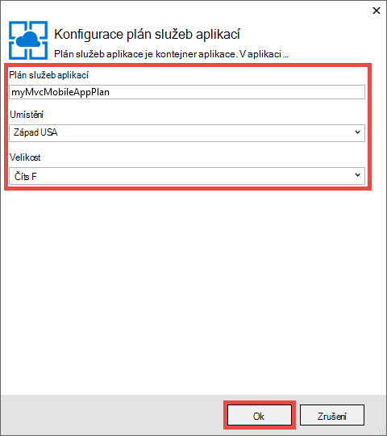
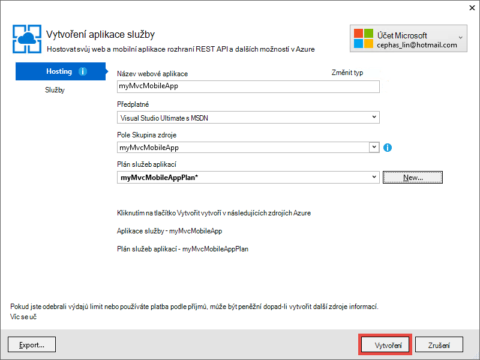

<properties 
    pageTitle="Nasazení aplikace ASP.NET MVC 5 mobilní webové aplikace služby Azure" 
    description="Kurz, která se naučíte nasazení aplikace od webové aplikace služby Azure pomocí funkcí pro mobilní zařízení ve webové aplikaci ASP.NET MVC 5." 
    services="app-service" 
    documentationCenter=".net" 
    authors="cephalin" 
    manager="wpickett" 
    editor="jimbe"/>

<tags 
    ms.service="app-service" 
    ms.workload="na" 
    ms.tgt_pltfrm="na" 
    ms.devlang="dotnet" 
    ms.topic="article" 
    ms.date="01/12/2016" 
    ms.author="cephalin;riande"/>

# Nasazení aplikace ASP.NET MVC 5 mobilní webové aplikace služby Azure

Tento kurz naučí základní informace o tom, jak vytvořit webovou aplikaci ASP.NET MVC 5, která je mobile ovládáním a nasazení aplikace služby Azure. Pro účely tohoto návodu potřebujete [Visual Studio Express 2013 pro Web] [ Visual Studio Express 2013] nebo edici professional aplikace Visual Studio, která už. Můžete použít [Visual Studio 2015] ale snímky obrazovky se budou lišit a musíte použít šablony 4.x ASP.NET.

[AZURE.INCLUDE [create-account-and-websites-note](../../includes/create-account-and-websites-note.md)]

## Co je budete vytvářet

Pro účely tohoto návodu přidáte funkcí pro mobilní zařízení jednoduchou aplikaci výpis konference, která je součástí [projektu starter][StarterProject]. Následující obrázek ukazuje relace ASP.NET v aplikaci dokončené, jak je vidět v prohlížeči emulátoru v nástroje pro vývojáře aplikace Internet Explorer 11 F12.

![][FixedSessionsByTag]

Můžete použít [nástroj Fiddler] a nástrojů pro vývojáře Internet Explorer 11 F12[ Fiddler] pomoci při ladění aplikace. 

## Dovednosti, které se dozvíte

To, co se dozvíte:

-   Jak publikovat webové aplikace přímo do webových aplikací v aplikaci služby Azure pomocí aplikace Visual Studio 2013.
-   Jak ASP.NET MVC 5 šablony pomocí šablon stylů CSS zavádění framework zlepšit zobrazení na mobilních zařízeních
-   Postup vytvoření specifických pro mobilní zobrazení jej směrovat konkrétní mobilní prohlížeče, například iPhone a Android
-   Postup vytvoření neodpovídá zobrazení (zobrazení, které odpovídají jednotlivé prohlížeče na zařízeních)

## Nastavení vývojové prostředí:

Nastavte si vývojové prostředí – nainstalujte Azure SDK pro .NET 2.5.1 nebo novější. 

1. Instalace Azure SDK .NET, klikněte na odkaz. Pokud nemáte Visual Studio 2013 ještě nenainstalovali, bude kliknutím na odkaz nainstalovaný. Tento kurz vyžaduje Visual Studio 2013. [Azure SDK Visual Studio 2013][AzureSDKVs2013]
1. V okně webové platformy klikněte na tlačítko **instalovat** a pokračujte v instalaci.

Taky musíte emulátoru mobilní prohlížeče. Budou fungovat něco z tohoto:

-   Prohlížeče emulátoru v [Nástroje pro vývojáře aplikace Internet Explorer 11 F12] [ EmulatorIE11] (použitý v všechny snímky obrazovek mobilním prohlížeči). Má uživatelského agenta řetězec předvolby pro Windows Phone 8, Windows Phone 7 a Apple iPad.
-   Prohlížeče emulátoru v [Google Chrome DevTools][EmulatorChrome]. Obsahuje předvolby pro mnoho zařízení s Androidem, jakož i Apple iPhone, Apple iPad a Amazon Kindle Fire. Také napodobuje události dotykového ovládání.
-   [Mobilní emulátoru Opera][EmulatorOpera]

Projekty Visual Studio s C\# zdrojového kódu jsou k dispozici v tomto tématu:

-   [Stažení projektu Starter][StarterProject]
-   [Dokončení projektu stáhnout][CompletedProject]

##Nasazení projektu starter Azure webovou aplikaci

1.  Stažení aplikace konference výpis [starter projektu][StarterProject].

2.  Pak v programu Průzkumník Windows, klikněte pravým tlačítkem myši na stažený soubor ZIP a zvolte *Vlastnosti*.

3.  V dialogovém okně **Vlastnosti** klikněte na tlačítko **Zrušit blokování** . (Odblokování zabrání upozornění zabezpečení, ke kterým dochází při pokusu o použití souboru *ZIP* staženou z webu.)

4.  Klikněte pravým tlačítkem myši na soubor ZIP a vyberte **Extrahovat vše** soubor rozbalit. 

5.  Ve Visual Studiu otevřete soubor *C#\Mvc5Mobile.sln* .

6.  V okně Průzkumník projektu klikněte pravým tlačítkem myši a klikněte na **Publikovat**.

    ![][DeployClickPublish]

7.  V Publikovat Web klikněte na **Microsoft Azure aplikaci služby**.

    ![][DeployClickWebSites]

8.  Pokud jste se ještě nepřihlásili do Azure, klikněte na **Přidat účet**.

    ![][DeploySignIn]

9.  Postupujte podle pokynů k přihlášení k účtu Azure.

11. Dialogové okno aplikace služby by nyní vidíte při přihlášení. Klikněte na **Nový**.

    ![][DeployNewWebsite]  

12. V poli **Název webové aplikace** zadejte název předpony jedinečné aplikace. Název aplikace plně kvalifikovaný web bude * &lt;předponu >*. azurewebsites.net. Také vyberte nebo zadejte název nové skupiny prostředků v **pole Skupina zdroje**. Potom klikněte na **Nový** vytvořte nový plán služeb aplikací.

    ![][DeploySiteSettings]

13. Konfigurace nový plán služeb aplikací a klepněte na tlačítko **OK**. 

    

13. Zpátky v dialogovém okně Vytvořit aplikaci služby klikněte na **vytvořit**.

     

13. Po Azure zdroje vytvářejí, Publikovat Web bude vyplněno dialogové okno s nastavením pro novou aplikaci. Klikněte na **Publikovat**.

    ![][DeployPublishSite]

    Po dokončení publikování projektu starter v Azure webovou aplikaci Visual Studio spustí plochy prohlížeč a zobrazí živou web appu.

14. Spusťte emulátoru mobilní prohlížeče, zkopírujte adresu URL pro konference aplikace (*<prefix>*. azurewebsites.net) do emulátoru, klikněte na tlačítko horní doprava a zvolte **Procházet podle značky**. Pokud používáte Internet Explorer 11 jako výchozí prohlížeč, stačí zadat `F12`, pak `Ctrl+8`a potom změňte profil prohlížeče na **Windows Phone**. Na následujícím obrázku vidíte *AllTags* zobrazení v režimu na výšku (pomocí **Procházet podle značky**).

    ![][AllTags]

>[AZURE.TIP] Zatímco aplikace MVC 5 z aplikace Visual Studio můžete ladění, můžete publikovat webovou aplikaci Azure znovu a zkontrolujte živou web app přímo z mobilního prohlížeče nebo emulátor prohlížeče.

Zobrazení je velmi přečíst na mobilním zařízení. Můžete taky už vidíte některé vizuální efekty použitými rámcem zavádění šablon stylů CSS.
Klikněte na odkaz **ASP.NET** .

![][SessionsByTagASP.NET]

Zobrazení značek ASP.NET je Lupa instalován na obrazovku, která zavádění za vás automaticky. Však můžete vylepšit toto zobrazení lépe podle mobilní prohlížeče. Díky sloupci **Datum** je například nepřehledný. Dále v tomto kurzu změníte zobrazení *AllTags* snažíme usnadnit jeho ovládáním mobile.

##Framework počátečního zavedení šablonami stylů CSS

Nový v MVC 5 je šablona integrovanou zavádění podporu. Už jste mohli vidět, jak ho okamžitě se vylepšuje s různými zobrazeními v aplikaci. Na navigačním panelu v horní je třeba automaticky sbalitelný po menší šířku prohlížeče. V prohlížeči počítače zkuste upravit velikost okna prohlížeče a najdete v článku jak na navigačním panelu mění jeho vzhled a chování. Toto je neodpovídá web návrhu, která je integrovaná zavádění.

Vzhled webové aplikace bez zavádění zobrazíte otevřete *aplikace\_Start\\BundleConfig.cs* a komentáře se řádky, které obsahují *bootstrap.js* a *bootstrap.css*. Následující kód ukazuje poslední dvě výkazy `RegisterBundles` metoda po změně:

     bundles.Add(new ScriptBundle("~/bundles/bootstrap").Include(
              //"~/Scripts/bootstrap.js",
              "~/Scripts/respond.js"));

    bundles.Add(new StyleBundle("~/Content/css").Include(
              //"~/Content/bootstrap.css",
              "~/Content/site.css"));

Stiskněte `Ctrl+F5` spustit aplikaci.

Sledujte sbalitelný na navigačním panelu je teď jenom běžnému Neseřazený seznam. Znovu klikněte na tlačítko **Procházet podle značky** a potom klikněte na **ASP.NET**.
V mobilní emulátoru zobrazení zobrazí se teď už není Lupa instalován na obrazovku a musí neposunete šikmo abyste mohli vidět pravé straně tabulky.

![][SessionsByTagASP.NETNoBootstrap]

Vrátit zpět změny a aktualizujte mobilním prohlížeči můžete ověřit, že byla obnovená ovládáním mobilní zobrazení.

Zavádění se nevztahuje na ASP.NET MVC 5 a můžete využít těchto funkcí v libovolné webové aplikace. Ale ho je nově integrované v šabloně projektu ASP.NET MVC 5 tak, aby MVC 5 webové aplikace můžete využít zavádění ve výchozím nastavení.

Další informace o zavádění, přejděte na [zavádění] [ BootstrapSite] webu.

V následující části uvidíte, jak poskytnout konkrétní zobrazení v prohlížeči mobile.

##Změnit zobrazení, rozložení a dílčí zobrazení

Přepsat všechny zobrazení (včetně rozložení a dílčí zobrazení) pro mobilní prohlížeče obecně pro jednotlivé mobilní prohlížeče nebo pro konkrétní prohlížeč. Poskytnout specifických pro mobilní zobrazení, můžete zkopírovat soubor zobrazit a přidat *. Mobilní* k názvu souboru. Vytvoření mobilního zobrazení *Index* , například můžete zkopírovat *zobrazení\\Home\\Index.cshtml* k *zobrazení\\Home\\Index.Mobile.cshtml*.

V této části vytvoříte soubor specifických mobile rozložení.

Začít, zkopírujte *zobrazení\\sdílené\\\_Layout.cshtml* k *zobrazení\\sdílené\\\_Layout.Mobile.cshtml*. Otevřít * \_Layout.Mobile.cshtml* a přejděte na název aplikace **MVC5** **MVC5 aplikace (mobilní)**.

V každém `Html.ActionLink` volání navigačního panelu, odebrat "Procházet" ve všech odkazů *ActionLink*. Následující kód ukazuje kompletní `<ul class="nav navbar-nav">` značku souboru mobilní rozložení.

    <ul class="nav navbar-nav">
        <li>@Html.ActionLink("Home", "Index", "Home")</li>
        <li>@Html.ActionLink("Date", "AllDates", "Home")</li>
        <li>@Html.ActionLink("Speaker", "AllSpeakers", "Home")</li>
        <li>@Html.ActionLink("Tag", "AllTags", "Home")</li>
    </ul>

Kopírovat *zobrazení\\Home\\AllTags.cshtml* zařaďte do *zobrazení\\Home\\AllTags.Mobile.cshtml*. Otevřete nový soubor a změňte `<h2>` element z "Značky" k "značky (M)":

    <h2>Tags (M)</h2>

Přejděte na stránku značky pomocí desktopové prohlížeče a používání mobilní prohlížeče emulátoru. Mobilní prohlížeče emulátoru zobrazí dvě změny provedené (název z * \_Layout.Mobile.cshtml* a od *AllTags.Mobile.cshtml*).

![][AllTagsMobile_LayoutMobile]

Naopak zobrazení plochy nezměnil (s názvy z * \_Layout.cshtml* a *AllTags.cshtml*).

![][AllTagsMobile_LayoutMobileDesktop]

##Vytvoření zobrazení specifické pro prohlížeč

Kromě mobile – plochu specifické a zobrazení můžete vytvořit zobrazení pro jednotlivé prohlížeče. Můžete například vytvořit zobrazení, které jsou specificky pro iPhone nebo Android prohlížeče. V této části vytvoříte rozložení prohlížeče Iphonu a iPhone verzi *AllTags* zobrazení.

Otevřete soubor *Global.asax* a přidejte následující kód do dolní části `Application_Start` metody.

    DisplayModeProvider.Instance.Modes.Insert(0, new DefaultDisplayMode("iPhone")
    {
        ContextCondition = (context => context.GetOverriddenUserAgent().IndexOf
            ("iPhone", StringComparison.OrdinalIgnoreCase) >= 0)
    });

Tento kód definuje nový režim zobrazení s názvem "iPhone", bude porovnány s každé příchozí žádosti. Pokud příchozí žádosti odpovídá podmínka, kterou jste definovali (Pokud uživatelského agenta obsahuje řetězec "iPhone"), bude hledat ASP.NET MVC zobrazení, jejichž název obsahuje přípona "iPhone".

>[AZURE.NOTE] Při přidávání režimy mobilní zobrazení specifické pro prohlížeč, například pro iPhone a Android, ujistěte se, chcete-li nastavit první argument `0` (Vložit v horní části seznamu) a ujistěte se, že režimu specifické pro prohlížeč přednost před mobilní šablony (*. Mobile.cshtml). Pokud mobilní šablony v horní části seznamu místo toho, budou vybrány přes režim zamýšlené zobrazení (první shody wins a mobilní šablon odpovídá všechny mobilní prohlížeče). 

Kód, klikněte pravým tlačítkem myši `DefaultDisplayMode`, zvolte **vyřešit**a potom `using System.Web.WebPages;`. Tato akce přidá odkaz `System.Web.WebPages` názvů, který se dozvíte, kde `DisplayModeProvider` a `DefaultDisplayMode` typy jsou definovány.

![][ResolveDefaultDisplayMode]

Můžete taky můžete jednoduše přidat ručně následující řádek `using` část souboru.

    using System.Web.WebPages;

Uložte změny. Kopírovat *zobrazení\\sdílené\\\_Layout.Mobile.cshtml* zařaďte do *zobrazení\\sdílené\\\_Layout.iPhone.cshtml*. Otevřete nový soubor a potom změňte název z `MVC5 Application (Mobile)` k `MVC5 Application (iPhone)`.

Kopírovat *zobrazení\\Home\\AllTags.Mobile.cshtml* zařaďte do *zobrazení\\Home\\AllTags.iPhone.cshtml*. V novém souboru změnit `<h2>` prvek z "značky (M)" k "Značky (iPhone)".

Spusťte aplikaci. Spusťte emulátoru mobilní prohlížeče, ujistěte se, že jeho uživatelského agenta je nastavený na "iPhone" a přejděte do zobrazení *AllTags* . Pokud používáte emulátor v nástroje pro vývojáře aplikace Internet Explorer 11 F12, nakonfigurujte emulace následujícím způsobem:

-   Profil prohlížeče = **Windows Phone**
-   Identifikační řetězec = **vlastní**
-   Vlastní řetězec = **Apple-iPhone5C1/1001.525**

Následující obrázek ukazuje zobrazení *AllTags* vykreslena emulátoru v nástroje pro vývojáře aplikace Internet Explorer 11 F12 s vlastní identifikačního řetězce (Toto je řetězec agenta uživatele Iphonu 5 C).

![][AllTagsIPhone_LayoutIPhone]

V mobilním prohlížeči vyberte **reproduktory** odkaz. Protože neexistuje mobilní zobrazení (*AllSpeakers.Mobile.cshtml*), výchozí zobrazení reproduktory (*AllSpeakers.cshtml*) vykreslení zobrazení mobilní rozložení (*\_Layout.Mobile.cshtml*). Jak vidíte dole, název **Aplikace MVC5 (mobilní)** je definována v * \_Layout.Mobile.cshtml*.

![][AllSpeakers_LayoutMobile]

Výchozí zobrazení (jiný než mobilní) z vykreslování uvnitř mobilní rozložení můžete globálně zakázat pomocí nastavení `RequireConsistentDisplayMode` k `true` v *zobrazení\\\_ViewStart.cshtml* souborů takto:

    @{
        Layout = "~/Views/Shared/_Layout.cshtml";
        DisplayModeProvider.Instance.RequireConsistentDisplayMode = true;
    }

Když `RequireConsistentDisplayMode` je nastavený na `true`, mobilní rozložení (*\_Layout.Mobile.cshtml*) slouží jenom pro mobilní zobrazení (tedy je-li zobrazit soubor ve formuláři * **ViewName**. Mobile.cshtml*). Chcete nastavit `RequireConsistentDisplayMode` k `true` Pokud mobilní rozložení nefunguje s jiný než mobilní zobrazení. Následující snímek obrazovky znázorňuje, jak stránka *reproduktory* vykreslí kdy `RequireConsistentDisplayMode` je nastavený na `true` (bez řetězec "(mobilní)" v navigační panel nahoře).

![][AllSpeakers_LayoutMobileOverridden]

Režim konzistentního zobrazení v určitém zobrazení můžete zakázat pomocí nastavení `RequireConsistentDisplayMode` k `false` v souboru zobrazení. Následující kód v *zobrazení\\Home\\AllSpeakers.cshtml* souboru sady `RequireConsistentDisplayMode` k `false`:

    @model IEnumerable<string>

    @{
        ViewBag.Title = "All speakers";
        DisplayModeProvider.Instance.RequireConsistentDisplayMode = false;
    }

V této části jsme jsme si, jak vytvořit mobilní rozložení a zobrazení a vytvoření rozložení a zobrazení pro určitá zařízení například iPhone.
Hlavní výhodou framework zavádění CSS je však neodpovídá rozložení, což znamená, že jeden stylesheet se dají použít přes plochy, telefonu a tabletu prohlížeče vytvořit jednotný vzhled a chování. V následující části uvidíte, jak můžete využít zavádění vytvořit ovládáním mobilní zobrazení.

##Vylepšení seznamu reproduktory

Jak jste právě viděli, *reproduktory* zobrazení je čitelné, ale odkazy jsou malé a obtížně na mobilním zařízení klepnete. V této části budete uděláte *AllSpeakers* zobrazení ovládáním mobilní telefon, který zobrazuje odkazy velké a snadno klepněte a obsahuje vyhledávací pole můžete rychle najít reproduktory.

Stylu zavádění [propojené seznamu skupiny][] můžete použít ke zlepšení *reproduktory* zobrazení. V *zobrazení\\Home\\AllSpeakers.cshtml*, nahraďte obsah souboru Razor následující kód.

     @model IEnumerable<string>

    @{
        ViewBag.Title = "All Speakers";
    }

    <h2>Speakers</h2>

    

        @foreach (var speaker in Model)
        {
            @Html.ActionLink(speaker, "SessionsBySpeaker", new { speaker }, new { @class = "list-group-item" })
        }
    

`class="list-group"` Atribut `
` tag použije styl seznamu zavádění a `class="input-group-item"` atribut platí zavádění seznamu styl položky pro jednotlivé odkazy.

Aktualizujte mobilní prohlížeč. Aktualizované zobrazení vypadat takto:

![][AllSpeakersFixed]

Styl zavádění [propojené seznamu skupiny][] díky celé pole u všech odkazů, který se dá kliknout, což je mnoho uživatelů lepší. Přepnutí na zobrazení plochy a sledujte jednotný vzhled a chování.

![][AllSpeakersFixedDesktop]

I když zobrazení v mobilním prohlížeči vylepšili, je dá obtížně přecházet dlouhého seznamu reproduktorů. Zavádění nenabízí možnost Vyhledávací filtr funkce mimo předdefinovaných, ale můžete ho přidat s několika řádky kódu. Nejdřív bude zobrazení přidejte vyhledávací pole a potom připojit s kódem JavaScript funkce filtru. V *zobrazení\\Home\\AllSpeakers.cshtml*, přidejte \<formuláře\> označení hned za \<h2\> označení, jak je ukázáno v následujícím příkladu:

    @model IEnumerable<string>

    @{
        ViewBag.Title = "All Speakers";
    }

    <h2>Speakers</h2>

    <form class="input-group">
        
        <input type="text" class="form-control" placeholder="Search speaker">
    </form>
     
    

        @foreach (var speaker in Model)
        {
            @Html.ActionLink(speaker, 
                             "SessionsBySpeaker", 
                             new { speaker }, 
                             new { @class = "list-group-item" })
        }
    

Všimněte si, že `<form>` a `<input>` značky obou obsahovat zavádění styly použité na ně. `` Element přidá zavádění [glyphicon][] do vyhledávacího pole.

Ve složce *skripty* přidejte JavaScript soubor s názvem *filter.js*. Otevřete soubor a vložte následující kód:

    $(function () {

        // reset the search form when the page loads
        $("form").each(function () {
            this.reset();
        });

        // wire up the events to the <input> element for search/filter
        $("input").bind("keyup change", function () {
            var searchtxt = this.value.toLowerCase();
            var items = $(".list-group-item");

            // show all speakers that begin with the typed text and hide others
            for (var i = 0; i < items.length; i++) {
                var val = items[i].text.toLowerCase();
                val = val.substring(0, searchtxt.length);
                if (val == searchtxt) {
                    $(items[i]).show();
                }
                else {
                    $(items[i]).hide();
                }
            }
        });
    });

Potřebujete zahrnout filter.js registrovaných sady. Otevřít *aplikace\_Start\\BundleConfig.cs* a změňte první sady. Změna první `bundles.Add` údajů (pro **jquery** příruček) zahrnout *skripty\\filter.js*, následujícím způsobem:

     bundles.Add(new ScriptBundle("~/bundles/jquery").Include(
                "~/Scripts/jquery-{version}.js",
                "~/Scripts/filter.js"));

Sada **jquery** už vykreslení výchozím * \_rozložení* zobrazení. Můžete později využít kód JavaScript použít funkci Filtr pro další zobrazení seznamů.

Aktualizujte mobilní prohlížeč a přejděte do zobrazení *AllSpeakers* . Do vyhledávacího pole zadejte "sc". Seznamu reproduktory by teď filtrovat podle hledaný řetězec.

![][AllSpeakersFixedSearchBySC]

##Vylepšení seznamu značek

Jako zobrazení *reproduktory* zobrazení *značek* je číst, ale odkazy malých a obtížné klepněte na mobilním zařízení. Zobrazení *značky* můžete opravit stejným způsobem jako řešení *reproduktory* zobrazení, pokud používáte kód změny popisované dříve, ale s tímto `Html.ActionLink` syntaxi metody v *zobrazení\\Home\\AllTags.cshtml*:

    @Html.ActionLink(tag, 
                     "SessionsByTag", 
                     new { tag }, 
                     new { @class = "list-group-item" })

Aktualizovaných plochy prohlížeče vypadá takto:

![][AllTagsFixedDesktop]

A aktualizovaných mobilní prohlížeče vypadá takto: 

![][AllTagsFixed]

>[AZURE.NOTE] Pokud zjistíte, že původní formátování seznamu stále existuje v mobilním prohlížeči a přemýšlíte, co se stalo s hodní zavádění styl, je to artefaktem starší vzít vytvořit mobilní konkrétní zobrazení. Teď, když používáte framework zavádění CSS k vytvoření návrhu neodpovídá web, přejděte vedoucí a odeberte tyto specifických mobile a zobrazení specifických mobile rozložení. Až budete mít Hotovo, zobrazí aktualizovaných mobilním prohlížeči zavádění styl.

##Vylepšení seznamu kalendářních dat

Můžete vylepšit zobrazení *kalendářních dat* jako lepší zobrazení *reproduktory* a *značky* použijete kód změny popisované dříve, ale s tímto `Html.ActionLink` syntaxi metody v *zobrazení\\Home\\AllDates.cshtml*:

    @Html.ActionLink(date.ToString("ddd, MMM dd, h:mm tt"), 
                     "SessionsByDate", 
                     new { date }, 
                     new { @class = "list-group-item" })

Zobrazí se zobrazení aktualizovaných mobilní prohlížeče takto:

![][AllDatesFixed]

Zobrazení *data* dál zvýšíte uspořádání hodnoty data a času pomocí data. Lze provést pomocí zavádění [panely][] styl. Nahrazení obsahu *zobrazení\\Home\\AllDates.cshtml* soubor se tento kód:

    @model IEnumerable<DateTime>

    @{
        ViewBag.Title = "All Dates";
    }

    <h2>Dates</h2>

    @foreach (var dategroup in Model.GroupBy(x=>x.Date))
    {
        

            

                @dategroup.Key.ToString("ddd, MMM dd")
            

            

                @foreach (var date in dategroup)
                {
                    @Html.ActionLink(date.ToString("h:mm tt"), 
                                     "SessionsByDate", 
                                     new { date }, 
                                     new { @class = "list-group-item" })
                }
            

        

    }

Tento kód vytvoří samostatný `
` označit pro každé různých datum v seznamu a používá [propojené seznamu skupiny][] pro příslušné odkazy jako předtím. Tady je mobilní prohlížeče vypadá stejně jako při spuštění tento kód:

![][AllDatesFixed2]

Přejděte prohlížeč. Poznámka: znovu jednotný vzhled.

![][AllDatesFixed2Desktop]

##Zlepšení SessionsTable zobrazení

V této části můžete vytočit zobrazení *SessionsTable* mobile popisný. Tato změna je rozsáhlejší předchozích změn.

V mobilním prohlížeči, klepněte na tlačítko **značky** a potom zadejte `asp` do vyhledávacího pole.

![][AllTagsFixedSearchByASP]

Klepněte na odkaz **ASP.NET** .

![][SessionsTableTagASP.NET]

Jak vidíte, je zobrazení ve formátu tabulky, která je aktuálně navržený lze zobrazit v prohlížeč. Je ale trochu obtížné Čtěte dál mobilní prohlížeč. Pokud to pokud chcete opravit, otevřete *zobrazení\\Home\\SessionsTable.cshtml* a nahradit obsah souboru následující kód:

    @model IEnumerable<Mvc5Mobile.Models.Session>

    <h2>@ViewBag.Title</h2>

    

        

            @foreach (var session in Model)
            {
                

                    

                        @Html.ActionLink(session.Title, 
                                         "SessionByCode", 
                                         new { session.Code }, 
                                         new { @class="list-group-item active" })
                        

                            

                                @Html.Partial("_SpeakersLinks", session)
                            

                            

                                @session.DateText
                            

                            

                                @Html.Partial("_TagsLinks", session)
                            

                        

                    

                

            }
        

    

Kód provádí 3 věci:

-   používá zavádění [vlastního seznamu propojené skupiny][] formátování informací relace svisle, tak, aby všechny tyto informace jsou přečíst na mobilní prohlížeč (třídy například seznamu seskupit položky text)
-   slouží k použití [mřížky systému][] do rozložení, takže položky relace tok vodorovně v prohlížeči počítače a svisle v mobilním prohlížeči (pomocí třídy sloupec md-4)
-   použití [neodpovídá nástroje][] skrýt značky relace při zobrazení v mobilním prohlížeči (pomocí třídy skryté křížky)

Můžete taky klepnout odkazu nadpisu přejdete na příslušné relace. Na následujícím obrázku odráží změny kódu.

![][FixedSessionsByTag]

Zavádění systému, který jste použili automaticky uspořádá relací v mobilním prohlížeči svisle. Všimněte si také, že nejsou zobrazeny značky. Přejděte prohlížeč.

![][SessionsTableFixedTagASP.NETDesktop]

V prohlížeči počítače Všimněte si, že jsou teď zobrazí značky. Uvidíte taky, že zavádění systému, která jste použili uspořádá relace položky ve dvou sloupcích. Pokud zvětšíte prohlížeče, uvidíte, že uspořádání změní na tři sloupce.

##Zlepšení SessionByCode zobrazení

Nakonec se určují zobrazení *SessionByCode* snažíme usnadnit jeho ovládáním mobile.

V mobilním prohlížeči, klepněte na tlačítko **značky** a potom zadejte `asp` do vyhledávacího pole.

![][AllTagsFixedSearchByASP]

Klepněte na odkaz **ASP.NET** . Relace značky ASP.NET se zobrazí.

![][FixedSessionsByTag]

Zvolte odkaz **vytváření jedné stránky aplikace pomocí technologie ASP.NET a AngularJS** .

![][SessionByCode3-644]

Výchozí zobrazení plochy je v pořádku, ale můžete vylepšit vzhled snadno pomocí některé součásti zavádění grafického rozhraní.

Otevřít *zobrazení\\Home\\SessionByCode.cshtml* a nahraďte obsah následující kód:

    @model Mvc5Mobile.Models.Session

    @{
        ViewBag.Title = "Session details";
    }
    <h3>@Model.Title (@Model.Code)</h3>
    

        <strong>@Model.DateText</strong> in <strong>@Model.Room</strong>
    

    

        

            Speakers
        

        @foreach (var speaker in Model.Speakers)
        {
            @Html.ActionLink(speaker, 
                             "SessionsBySpeaker", 
                             new { speaker }, 
                             new { @class="panel-body" })
        }
    

    
@Model.Abstract

    

        

            Tags
        

        @foreach (var tag in Model.Tags)
        {
            @Html.ActionLink(tag, 
                             "SessionsByTag", 
                             new { tag }, 
                             new { @class = "panel-body" })
        }
    

Nové značky používají zavádění panely stylu zlepšit mobilní zobrazení. 

Aktualizujte mobilní prohlížeč. Následující obrázek znázorňuje kód změny, které jste právě vytvořili:

![][SessionByCodeFixed3-644]

## Zalamovat a revize

Tento kurz uvádí, jak používat ASP.NET MVC 5 se dají mobile ovládáním webových aplikací. Jedná se o:

-   Nasazení aplikace ASP.NET MVC 5 pro webovou aplikaci aplikace služby
-   Vytvoření rozložení neodpovídá webové stránky v aplikaci MVC 5 pomocí zavádění
-   Změnit rozložení a dílčí zobrazení, globálně i pro jednotlivé zobrazení
-   Použití zámku přepíší rozložení ovládacích prvků a částečné `RequireConsistentDisplayMode` vlastnost
-   Vytvoření zobrazení zaměřených konkrétní prohlížečích, například prohlížeče Iphonu
-   Použití zavádění styl v kódu Razor

## Viz taky

-   [9 základní principy návrh neodpovídá webu](http://blog.froont.com/9-basic-principles-of-responsive-web-design/)
-   [Zavádění][BootstrapSite]
-   [Úřední zavádění blogu][]
-   [Kurz zavádění Twitter z kurz republika][]
-   [Zavádění hřišť][]
-   [W3C doporučení mobilní webové aplikace doporučené postupy][]
-   [W3C Candidate doporučení pro dotazy médií][]

## Co se změnilo
* Průvodce na změnu z webů pro aplikaci služby v tématu: [aplikaci služby Azure a jeho dopad na existující služby Azure](http://go.microsoft.com/fwlink/?LinkId=529714)

<!-- Internal Links -->
[Deploy the starter project to an Azure web app]: #bkmk_DeployStarterProject
[Bootstrap CSS Framework]: #bkmk_bootstrap
[Override the Views, Layouts, and Partial Views]: #bkmk_overrideviews
[Create Browser-Specific Views]:#bkmk_browserviews
[Improve the Speakers List]: #bkmk_Improvespeakerslist
[Improve the Tags List]: #bkmk_improvetags
[Improve the Dates List]: #bkmk_improvedates
[Improve the SessionsTable View]: #bkmk_improvesessionstable
[Improve the SessionByCode View]: #bkmk_improvesessionbycode

<!-- External Links -->
[Visual Studio Express 2013]: http://www.visualstudio.com/downloads/download-visual-studio-vs#d-express-web
[Visual Studio 2015]: https://www.visualstudio.com/downloads/download-visual-studio-vs
[AzureSDKVs2013]: http://go.microsoft.com/fwlink/p/?linkid=323510&clcid=0x409
[Fiddler]: http://www.fiddler2.com/fiddler2/
[EmulatorIE11]: http://msdn.microsoft.com/library/ie/dn255001.aspx
[EmulatorChrome]: https://developers.google.com/chrome-developer-tools/docs/mobile-emulation
[EmulatorOpera]: http://www.opera.com/developer/tools/mobile/
[StarterProject]: http://go.microsoft.com/fwlink/?LinkID=398780&clcid=0x409
[CompletedProject]: http://go.microsoft.com/fwlink/?LinkID=398781&clcid=0x409
[BootstrapSite]: http://getbootstrap.com/
[WebPIAzureSdk23NetVS13]: ./media/web-sites-dotnet-deploy-aspnet-mvc-mobile-app/WebPIAzureSdk23NetVS13.png
[Skupina propojené seznamu]: http://getbootstrap.com/components/#list-group-linked
[glyphicon]: http://getbootstrap.com/components/#glyphicons
[panely]: http://getbootstrap.com/components/#panels
[vlastní seznam propojené skupiny]: http://getbootstrap.com/components/#list-group-custom-content
[systém mřížky]: http://getbootstrap.com/css/#grid
[neodpovídá nástroje]: http://getbootstrap.com/css/#responsive-utilities
[Úřední zavádění blogu]: http://blog.getbootstrap.com/
[Kurz zavádění Twitter z kurz republika]: http://www.tutorialrepublic.com/twitter-bootstrap-tutorial/
[Zavádění hřišť]: http://www.bootply.com/
[W3C doporučení mobilní webové aplikace doporučené postupy]: http://www.w3.org/TR/mwabp/
[W3C Candidate doporučení pro dotazy médií]: http://www.w3.org/TR/css3-mediaqueries/

<!-- Images -->
[DeployClickPublish]: ./media/web-sites-dotnet-deploy-aspnet-mvc-mobile-app/deploy-to-azure-website-1.png
[DeployClickWebSites]: ./media/web-sites-dotnet-deploy-aspnet-mvc-mobile-app/deploy-to-azure-website-2.png
[DeploySignIn]: ./media/web-sites-dotnet-deploy-aspnet-mvc-mobile-app/deploy-to-azure-website-3.png
[DeployUsername]: ./media/web-sites-dotnet-deploy-aspnet-mvc-mobile-app/deploy-to-azure-website-4.png
[DeployPassword]: ./media/web-sites-dotnet-deploy-aspnet-mvc-mobile-app/deploy-to-azure-website-5.png
[DeployNewWebsite]: ./media/web-sites-dotnet-deploy-aspnet-mvc-mobile-app/deploy-to-azure-website-6.png
[DeploySiteSettings]: ./media/web-sites-dotnet-deploy-aspnet-mvc-mobile-app/deploy-to-azure-website-7.png
[DeployPublishSite]: ./media/web-sites-dotnet-deploy-aspnet-mvc-mobile-app/deploy-to-azure-website-8.png
[MobileHomePage]: ./media/web-sites-dotnet-deploy-aspnet-mvc-mobile-app/mobile-home-page.png
[FixedSessionsByTag]: ./media/web-sites-dotnet-deploy-aspnet-mvc-mobile-app/SessionsByTag-ASP.NET-Fixed.png
[AllTags]: ./media/web-sites-dotnet-deploy-aspnet-mvc-mobile-app/AllTags.png
[SessionsByTagASP.NET]: ./media/web-sites-dotnet-deploy-aspnet-mvc-mobile-app/SessionsByTag-ASP.NET.png
[SessionsByTagASP.NETNoBootstrap]: ./media/web-sites-dotnet-deploy-aspnet-mvc-mobile-app/SessionsByTag-ASP.NET-NoBootstrap.png
[AllTagsMobile_LayoutMobile]: ./media/web-sites-dotnet-deploy-aspnet-mvc-mobile-app/AllTagsMobile-_LayoutMobile.png
[AllTagsMobile_LayoutMobileDesktop]: ./media/web-sites-dotnet-deploy-aspnet-mvc-mobile-app/AllTagsMobile-_LayoutMobile-Desktop.png
[ResolveDefaultDisplayMode]: ./media/web-sites-dotnet-deploy-aspnet-mvc-mobile-app/Resolve-DefaultDisplayMode.png
[AllTagsIPhone_LayoutIPhone]: ./media/web-sites-dotnet-deploy-aspnet-mvc-mobile-app/AllTagsIPhone-_LayoutIPhone.png
[AllSpeakers_LayoutMobile]: ./media/web-sites-dotnet-deploy-aspnet-mvc-mobile-app/AllSpeakers-_LayoutMobile.png
[AllSpeakers_LayoutMobileOverridden]: ./media/web-sites-dotnet-deploy-aspnet-mvc-mobile-app/AllSpeakers-_LayoutMobile-Overridden.png
[AllSpeakersFixed]: ./media/web-sites-dotnet-deploy-aspnet-mvc-mobile-app/AllSpeakers-Fixed.png
[AllSpeakersFixedDesktop]: ./media/web-sites-dotnet-deploy-aspnet-mvc-mobile-app/AllSpeakers-Fixed-Desktop.png
[AllSpeakersFixedSearchBySC]: ./media/web-sites-dotnet-deploy-aspnet-mvc-mobile-app/AllSpeakers-Fixed-SearchBySC.png
[AllTagsFixedDesktop]: ./media/web-sites-dotnet-deploy-aspnet-mvc-mobile-app/AllTags-Fixed-Desktop.png 
[AllTagsFixed]: ./media/web-sites-dotnet-deploy-aspnet-mvc-mobile-app/AllTags-Fixed.png
[AllDatesFixed]: ./media/web-sites-dotnet-deploy-aspnet-mvc-mobile-app/AllDates-Fixed.png
[AllDatesFixed2]: ./media/web-sites-dotnet-deploy-aspnet-mvc-mobile-app/AllDates-Fixed2.png
[AllDatesFixed2Desktop]: ./media/web-sites-dotnet-deploy-aspnet-mvc-mobile-app/AllDates-Fixed2-Desktop.png
[AllTagsFixedSearchByASP]: ./media/web-sites-dotnet-deploy-aspnet-mvc-mobile-app/AllTags-Fixed-SearchByASP.png
[SessionsTableTagASP.NET]: ./media/web-sites-dotnet-deploy-aspnet-mvc-mobile-app/SessionsTable-Tag-ASP.NET.png
[SessionsTableFixedTagASP.NETDesktop]: ./media/web-sites-dotnet-deploy-aspnet-mvc-mobile-app/SessionsTable-Fixed-Tag-ASP.NET-Desktop.png
[SessionByCode3-644]: ./media/web-sites-dotnet-deploy-aspnet-mvc-mobile-app/SessionByCode-3-644.png
[SessionByCodeFixed3-644]: ./media/web-sites-dotnet-deploy-aspnet-mvc-mobile-app/SessionByCode-Fixed-3-644.png
 
