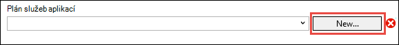
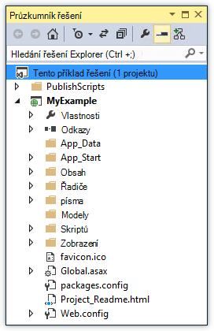

<properties
    pageTitle="Nasazení aplikace ASP.NET aplikace služby Azure pomocí aplikace Visual Studio | Microsoft Azure"
    description="Naučte se nasadit projekt webové technologie ASP.NET na novou webovou aplikaci pro aplikaci služby Azure pomocí aplikace Visual Studio."
    services="app-service\web"
    documentationCenter=".net"
    authors="tdykstra"
    manager="wpickett"
    editor=""/>

<tags
    ms.service="app-service-web"
    ms.workload="web"
    ms.tgt_pltfrm="na"
    ms.devlang="dotnet"
    ms.topic="get-started-article"
    ms.date="07/22/2016"
    ms.author="rachelap"/>

# Nasazení aplikace služby Azure, pomocí aplikace Visual Studio webovou aplikaci ASP.NET

[AZURE.INCLUDE [tabs](../../includes/app-service-web-get-started-nav-tabs.md)]

## Základní informace

Tento kurz ukazuje, jak nasazení webové aplikace technologie ASP.NET k [web appu v aplikaci služby Azure](app-service-web-overview.md) pomocí aplikace Visual Studio 2015.

Kurz předpokládá, že jsou ASP.NET vývojář, který má žádné předchozí zkušenosti s použitím Azure. Když jste hotoví, budete mít jednoduchou webovou aplikaci nahoru a spuštění v cloudu.

Se dozvíte:

* Jak vytvořit novou webovou aplikaci pro aplikaci služby při vytvoření nového webu projektu ve Visual Studiu.
* Jak nasadit projekt webové aplikace pro webovou aplikaci služby pomocí aplikace Visual Studio.

Diagram znázorňuje, co můžete dělat v tomto kurzu.

Na konci kurzu oddíl [Poradce při potížích](#troubleshooting) vám bude radit představu o tom, jak dělat, když něco nefunguje a [Další kroky](#next-steps) sekci naleznete odkazy na další kurzy, které obsahují další název hloubkové o tom, jak používat aplikaci služby Azure.

Je to Začínáme – kurz, web projektu, který ukazuje, jak nasazení je jednoduché, která nepoužívá databáze a nebude proveďte ověření se tak mohli ověřovat. Odkazy na další upřesňující témata nasazení najdete v článku [jak nasazení Azure webovou aplikaci](web-sites-deploy.md).

Kromě dobu potřebnou k instalaci Azure SDK pro .NET potrvá tento kurz asi 10 až 15 minut, dokončete.

## Zjistit předpoklady pro

* Kurz předpokládá, že jste pracovali ASP.NET MVC a Visual Studia. Pokud potřebujete úvod, přečtěte si článek [Začínáme s ASP.NET MVC 5](http://www.asp.net/mvc/overview/getting-started/introduction/getting-started).

* Musíte mít účet Azure. Můžete [Otevřít bezplatný účet Azure](/pricing/free-trial/?WT.mc_id=A261C142F) nebo [Aktivovat Visual Studio účastnická výhod](/pricing/member-offers/msdn-benefits-details/?WT.mc_id=A261C142F). 

    Pokud chcete začít pracovat s aplikaci služby Azure před registraci účet Azure, přejděte na [Zkuste aplikaci služby](http://go.microsoft.com/fwlink/?LinkId=523751). Zde můžete vytvořit aplikaci krátkodobý starter v aplikaci služby – bez platební kartou povinné a bez závazky.

## Nastavení vývojové prostředí:

Kurz určen pro Visual Studio 2015 s [Azure SDK pro .NET](../dotnet-sdk.md) 2,9 nebo novější. 

* [Stáhněte si nejnovější SDK Azure pro Visual Studio 2015](http://go.microsoft.com/fwlink/?linkid=518003). Pokud ještě nemáte ho se nainstaluje SDK Visual Studio 2015.

    >[AZURE.NOTE] Podle toho, kolik závislostí SDK již máte v počítači instalaci sady SDK může chvíli trvat, z několika minut zabere nejméně půl hodiny.

Pokud máte Visual Studio 2013 a budete chtít použít, můžete [Stáhnout nejnovější SDK Azure Visual Studio 2013](http://go.microsoft.com/fwlink/?LinkID=324322). Některé obrazovky může vypadat lišit od obrázků.

## Konfigurace nového webu projektu

Dalším krokem je vytvoření webu projektu ve Visual Studiu a web app v aplikaci služby Azure. V této části kurzu nakonfigurujete nový web projektu. 

1. Otevřete aplikaci Visual Studio 2015.

2. Klikněte na **Soubor > Nový > projektu**.

3. V dialogovém okně **Nový projekt** klikněte na **Visual Basic > Web > ASP.NET webové aplikace**.

3. Ujistěte se, že **.NET Framework 4.5.2** je zúžený na cílové rozhraní.

4.  [Azure aplikace přehledy](../application-insights/app-insights-overview.md) sleduje webovou aplikaci pro dostupnost, výkonu a využití. Postupně výchozí při prvním vytvoření webu projektu po instalaci aplikace Visual Studio je zaškrtnuto políčko **Přidat přehledy aplikace do projektu** . Pokud je zaškrtnuté, ale nechcete zkuste aplikaci přehledy, zrušte zaškrtnutí políčka.

4. Pojmenujte aplikace **MyExample**a potom klikněte na **OK**.

    

5. V dialogovém okně **Nový projekt ASP.NET** vyberte šablonu **MVC** a potom klikněte na **Změnit ověřování**.

    Pro účely tohoto návodu nasazení projektu technologie ASP.NET MVC. Pokud budete chtít Naučte se nasadit projekt rozhraní API webových ASP.NET, naleznete v části [Další kroky](#next-steps) . 

    

6. V dialogovém okně **Změnit ověřování** klikněte na položku **Bez ověření**a klikněte na **OK**.

    

    Tento kurz Začínáme – nasazujete jednoduché aplikace, které neprovádí uživatele přihlásit.

5. V části **Microsoft Azure** dialogového okna **Nový projekt ASP.NET** Ujistěte se, že je zaškrtnuté **hostovat v cloudu** a že v rozevíracím seznamu je vybrán **Aplikaci služby** .

    

    Tato nastavení přímé Visual Studio při vytváření Azure webové aplikace pro web projektu.

6. Klikněte na tlačítko **OK**

## Konfigurace Azure prostředků pro nové webové aplikace

Teď Visual Studio informovat o Azure prostředky, které chcete vytvořit.

5. V dialogovém okně **Vytvořit aplikaci služby** klikněte na **Přidat účet**a pak se přihlaste k Azure pomocí ID a heslo účtu, který používáte pro správu předplatného Azure.

    

    Pokud jste již přihlášeni dříve na stejném počítači, nemusí se zobrazit na tlačítko **Přidat účet** . V takovém případě můžete tento krok přeskočit nebo možná budete muset znovu zadejte svoje přihlašovací údaje.
 
3. Zadejte **Název webové aplikace** , který je v doméně *azurewebsites.net* jedinečný. Například můžete ji nazvat MyExample reprezentovaný číslem od doprava a byly jedinečné, například MyExample810. Pokud výchozí název webu se vytvoří, bude jedinečný a příště mohli použít.

    Pokud už někdo jiný použil název, který zadáte, se zobrazí červený vykřičník vpravo místo zelená značka zaškrtnutí a budete muset zadat jiný název.

    Adresa URL aplikace je tento název plus *. azurewebsites.net*. Řekněme, že je v poli Název `MyExample810`, adresa URL je `myexample810.azurewebsites.net`.

    Můžete také použít vlastní doménu s Azure webovou aplikaci. Další informace najdete v tématu [konfigurace vaší vlastní doménou v aplikaci služby Azure](web-sites-custom-domain-name.md).

6. Klikněte na tlačítko **Nový** vedle pole **Skupina zdroje** a podle potřeby zadejte "MyExample" nebo jiný název. 

    

    Skupina zdroje je kolekce Azure zdroje, jako jsou webové aplikace, databáze a VMs. Výukové obecně je nejvhodnější pro vytvoření nové skupiny prostředků vzhledem k tomu, který usnadňuje odstranit v jednom kroku Azure, které vytvoříte výukové zdroje. Další informace najdete v tématu [Přehled Správce prostředků Azure](../azure-resource-manager/resource-group-overview.md).

4. Klikněte na tlačítko **Nový** vedle **Plánu služby aplikace** rozevíracího seznamu.

    

    Zobrazí se dialogové okno **Konfigurovat plán služeb aplikací** .

    

    V následujících krocích nakonfigurovat aplikaci služby plánu pro nové skupiny prostředků. Plán služeb aplikací určuje výpočetním prostředky, které webovou aplikaci běží na. Například pokud se rozhodnete bezplatné osy, rozhraní API aplikace je spuštěn sdílené VMs spuštěn pro některé placené úrovní ho na vyhrazené VMs. Další informace najdete v tématu [Přehled plány aplikaci služby](../app-service/azure-web-sites-web-hosting-plans-in-depth-overview.md).

5. V dialogovém okně **Konfigurovat plán služeb aplikace** zadejte "MyExamplePlan" nebo jiný název podle potřeby.

5. V rozevíracím seznamu **umístění** vyberte umístění, které je nejblíž vám.

    Tohle nastavení určuje, které Azure datacentra aplikace se spustí v. Pro účely tohoto návodu můžete vybrat všechny oblasti a smysl nebude výrazná rozdíl. Ale aplikace výrobní budete chtít vašeho serveru být co nejblíže k klienti, které jsou přístupu, aby byl minimalizován [latence](http://www.bing.com/search?q=web%20latency%20introduction&qs=n&form=QBRE&pq=web%20latency%20introduction&sc=1-24&sp=-1&sk=&cvid=eefff99dfc864d25a75a83740f1e0090).

5. V rozevíracím seznamu **velikost** klikněte na položku **Free**.

    Pro účely tohoto návodu bezplatného ceny osy poskytne dobré dost výkon.

6. V dialogovém okně **Konfigurovat plán služeb aplikací** klikněte na **OK**.

7. V dialogovém okně **Vytvořit aplikaci služby** klikněte na **vytvořit**.

## Vytvoří aplikace project a webové aplikace Visual Studio

Ve chvíli, obvykle menší než jednu minutu Visual Studio vytvoří web projektu a web app.  

Okno **Průzkumník řešení** zobrazuje souborů a složek v novém projektu.

**Aktivity aplikace služby Azure** , zobrazí se vytvořené web appu.

Okno **Průzkumníka cloudu** můžete zobrazit a spravovat Azure zdrojů, včetně novou webovou aplikaci, kterou jste právě vytvořili.

    
## Nasazení aplikace project web Azure web appu

V této části nasadíte web project web appu.

1. V **Okně Průzkumník**projektu klikněte pravým tlačítkem myši a vyberte **Publikovat**.

    

    Ve chvíli zobrazí se průvodce **Publikovat Web** . Spustí se průvodce *Publikovat profil* , který obsahuje nastavení pro nasazení aplikace project web na nový web appu.

    Profil publikování obsahuje uživatelské jméno a heslo pro nasazení.  Byly vytvořeny těchto přihlašovacích údajů pro vás a nemusíte je zadat. Heslo zašifrované v souboru skryté specifické pro uživatele v `Properties\PublishProfiles` složky.
 
8. Na kartě **připojení** průvodce **Publikovat Web** klikněte na **Další**.

    

    Je další kartu **Nastavení** . Tady můžete změnit konfiguraci sestavení nasazení sestavení ladění pro [vzdálené ladění](../app-service-web/web-sites-dotnet-troubleshoot-visual-studio.md#remotedebug). Kartu také nabízí několik [Možnosti publikování souboru](https://msdn.microsoft.com/library/dd465337.aspx#Anchor_2).

10. Na kartě **Nastavení** klikněte na **Další**.

    

    Na kartě **Náhled** následuje článek. Tady máte možnost najdete v článku co soubory budou zkopírovány z projektu do rozhraní API aplikace. Když jste nasazení projektu do aplikace rozhraní API pro, které jste už nasazené na dříve, zkopírovány pouze změněné soubory. Pokud chcete zobrazit seznam zkopírovat, kliknete na tlačítko **Start náhled** .

11. Na kartě **Náhled** klikněte na **Publikovat**.

    

    Po klepnutí na tlačítko **Publikovat**Visual Studio zahájí proces kopírování souborů na server Azure. Může to trvat jednu až dvě minuty.

    **Výstup** a **Aktivity aplikace služby Azure** windows zobrazit, jaké akce nasazení pořízení a informujte úspěšném dokončení nasazení.

    

    Po úspěšném nasazení jako výchozí prohlížeč automaticky otevře na adresu URL nasazené webové aplikace a aplikace, kterou jste vytvořili teď běží v cloudu. Adresu URL v adresním řádku prohlížeče ukazuje, že web appu se načte z Internetu.

    

    > [AZURE.TIP]Můžete povolit **Publikování jedním kliknutím** nástrojů rychlého nasazení. Klikněte na **Zobrazení > Panely nástrojů**a pak vyberte **Publikování jedním kliknutím**. Panel nástrojů slouží k výběru profilu, klikněte na tlačítko Publikovat nebo klikněte na tlačítko Otevřít průvodce **Publikovat Web** .
    > 

## Řešení potíží

Pokud narazíte na problém při procházení tohoto kurzu, ujistěte se, že používáte nejnovější verzi Azure SDK pro .NET. Nejjednodušší způsob, jak to udělat je [Stáhnout SDK Azure pro Visual Studio 2015](http://go.microsoft.com/fwlink/?linkid=518003). Pokud máte nainstalovanou aktuální verzi, webové platformy značí, že není potřeba žádná instalace.

Pokud se v podnikové síti a pokoušíte nasazení služby Azure aplikace přes bránu firewall, ujistěte se, jestli jsou porty 443 a 8172 otevřené pro nasazení webu. Pokud tyto porty nejde otevřít, podívejte se na následující postup dál najdete další možnosti nasazení.

Po spuštění v aplikaci služby Azure webovou aplikaci ASP.NET můžete chtít Další informace o Visual Studio funkce, které usnadňují Poradce při potížích. Informace o protokolování vzdálené ladění a informace, najdete v tématu [Poradce při potížích s Azure webové aplikace ve Visual Studiu](web-sites-dotnet-troubleshoot-visual-studio.md).

## Další kroky

V tomto kurzu jste viděli, jak vytvořit jednoduchý webovou aplikaci a nasadit na Azure webovou aplikaci. Tady je několik souvisejících témat a materiály pro dozvědět další informace o aplikaci služby Azure:

* Sledování a správa webovou aplikaci [Azure portálu](https://portal.azure.com/). 

    Další informace najdete v tématu [Přehled portálu Azure](/services/management-portal/) a [Konfigurovat web apps v aplikaci služby Azure](web-sites-configure.md).

* Nasazení existující web projektu do nové webové aplikace, pomocí aplikace Visual Studio

    Klikněte pravým tlačítkem myši na projekt v **Průzkumníku řešení**a potom klikněte na **Publikovat**. Vyberte **Aplikaci služby Microsoft Azure** jako cíl publikování a potom klikněte na **Nový**. Dialogová okna budou stejné jako co ukázali jsme si v tomto kurzu.

* Nasazení web projektu z ovládacího prvku zdroje

    Informace o [automatizaci nasazení](http://www.asp.net/aspnet/overview/developing-apps-with-windows-azure/building-real-world-cloud-apps-with-windows-azure/continuous-integration-and-continuous-delivery) ze [zdrojového ovládacího prvku systému](http://www.asp.net/aspnet/overview/developing-apps-with-windows-azure/building-real-world-cloud-apps-with-windows-azure/source-control)najdete v tématu [Začínáme s aplikací web apps v aplikaci služby Azure](app-service-web-get-started.md) a [nasazení Azure webovou aplikaci](web-sites-deploy.md).

* Nasazení ASP.NET webového rozhraní API aplikace rozhraní API v aplikaci služby Azure

    Ukázali jsme si postup vytvoření instanci služby Azure aplikace, která je určená hlavně hostovat na webu. Aplikace služby také nabízí funkce pro hostování webového rozhraní API, jako je CORS podpory a podpora metadat rozhraní API pro generování kódu klienta. Ve web appu můžete používat funkce rozhraní API, ale pokud chcete hlavně hostovat rozhraní API v instanci služby aplikace, **rozhraní API aplikace** by být lepší volbou. Další informace najdete v tématu [Začínáme s aplikací rozhraní API a ASP.NET v aplikaci služby Azure](../app-service-api/app-service-api-dotnet-get-started.md). 

* Přidání vlastního názvu domény a SSL

    Informace o tom, jak použít protokol SSL a vlastní doménu (například, www.contoso.com místo contoso.azurewebsites.net) najdete v následujících zdrojích:

    * [Konfigurace vaší vlastní doménou v aplikaci služby Azure](web-sites-custom-domain-name.md)
    * [Povolení HTTPS Azure webu](web-sites-configure-ssl-certificate.md)

* Odstraňte zdroje, který obsahuje webovou aplikaci a související Azure zdroje až to budete mít s nimi.

    Informace o práci se skupinami zdroje na portálu Azure tématech [nasazení se šablonami správce prostředků a Azure portálu](../resource-group-template-deploy-portal.md).   

*   Další příklady vytváření webovou aplikaci ASP.NET v aplikaci služby naleznete v tématu [Vytvoření a nasazení aplikace ASP.NET webové aplikace služby Azure](https://github.com/Microsoft/HealthClinic.biz/wiki/Create-and-deploy-an-ASP.NET-web-app-in-Azure-App-Service) a [Vytvoření a nasazení mobilní aplikace v aplikaci služby Azure](https://github.com/Microsoft/HealthClinic.biz/wiki/Create-and-deploy-a-mobile-app-in-Azure-App-Service) z připojit [HealthClinic.biz](https://github.com/Microsoft/HealthClinic.biz) 2015 [ukázku](https://blogs.msdn.microsoft.com/visualstudio/2015/12/08/connectdemos-2015-healthclinic-biz/). Rychlé další prohlídky z ukázku HealthClinic.biz najdete v článku [Rychlé Azure vývojář nástroje prohlídky](https://github.com/Microsoft/HealthClinic.biz/wiki/Azure-Developer-Tools-Quickstarts).
