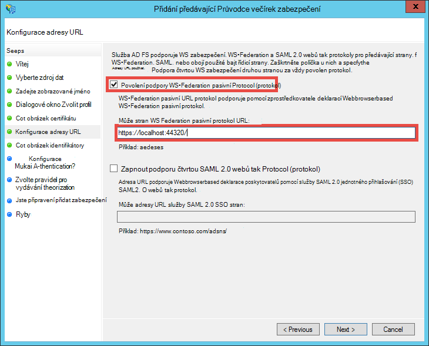

<properties 
    pageTitle="Vytvoření řádku obchodní Azure aplikace pomocí služby AD FS ověřování | Microsoft Azure" 
    description="Naučte se vytvářet aplikace řádek obchodní služby Azure aplikace, která ověří s místní služba tokenů zabezpečení. Tento kurz zaměřuje AD FS jako na místní služba tokenů zabezpečení." 
    services="app-service\web" 
    documentationCenter=".net" 
    authors="cephalin" 
    manager="wpickett" 
    editor=""/>

<tags 
    ms.service="app-service-web" 
    ms.devlang="dotnet" 
    ms.topic="article" 
    ms.tgt_pltfrm="na" 
    ms.workload="web" 
    ms.date="08/31/2016" 
    ms.author="cephalin"/>

# Vytvoření řádku obchodní Azure aplikace pomocí ověřování ADFS

Tento článek ukazuje, jak vytvořit MVC aplikace technologie ASP.NET řádku obchodní [aplikace](../app-service/app-service-value-prop-what-is.md) služby Azure pomocí místní [Active Directory Federation Services](http://technet.microsoft.com/library/hh831502.aspx) jako poskytovatele identity. Tento scénář pracovat, i když chcete vytvořit řádek podnikových aplikací v aplikaci služby Azure ale vaše organizace vyžaduje dat adresáře uložený na místě.

>[AZURE.NOTE] Základní informace o různých podnikových a tak mohli ověřovat možnosti pro aplikaci služby Azure najdete v článku [Ověřit s místní služby Active Directory v Azure aplikace](web-sites-authentication-authorization.md).

## Co vytvoříte ##

Vytvoříte základní ASP.NET aplikace v Azure aplikace služby Web Apps pomocí následujících funkcí:

- Ověřuje uživatele oproti AD FS
- Použití `[Authorize]` povolit uživatelům pro různé akce
- Konfigurace statické ladění ve Visual Studiu i publikování aplikace služby Web Apps (Konfigurovat jednou, ladění a publikovat kdykoli)  

## Co byste měli ##

[AZURE.INCLUDE [free-trial-note](../../includes/free-trial-note.md)]

Potřebujete podle následujících pokynů tento kurz:

- V místním nasazení služby AD FS (začátku do konce návod laboratorní použité v tomto kurzu naleznete v tématu [otestujte laboratorní: Služba tokenů zabezpečení samostatného se službou AD FS v Azure OM (pro pouze test)](https://blogs.msdn.microsoft.com/cephalin/2014/12/21/test-lab-standalone-sts-with-ad-fs-in-azure-vm-for-test-only/))
- Oprávnění k vytváření může narozeninovou párty s motivy vztahy důvěryhodnosti služby správy AD FS
- Visual Studio 2013 aktualizace 4 nebo novější
- [Azure SDK 2.8.1](http://go.microsoft.com/fwlink/p/?linkid=323510&clcid=0x409) nebo novější

## Použití vzorku žádost o řádek obchodní šablony ##

Ukázková aplikace v tomto kurzu [Web Appu WSFederation DotNet)](https://github.com/AzureADSamples/WebApp-WSFederation-DotNet), vznikne týmem Azure Active Directory. Protože AD FS podporuje federaci WS, můžete ho jako šablonu vytvořit řádek podnikových aplikací s usnadnění. Poskytuje tyto funkce:

- Používají [WS Federation](http://msdn.microsoft.com/library/bb498017.aspx) k ověření místního nasazení služby AD FS
- Přihlášení a odhlašovací funkce
- Použití [Microsoft.Owin](http://www.asp.net/aspnet/overview/owin-and-katana/an-overview-of-project-katana) (místo Windows Identity Foundation), což je budoucí technologie ASP.NET a mnohem jednodušší nastavení ověřování a povolení než WIF

## Nastavení aplikace ##

2.  Zkopírovat nebo stáhnout ukázkový řešení ve [Web Appu WSFederation DotNet](https://github.com/AzureADSamples/WebApp-WSFederation-DotNet) místního adresáře.

    > [AZURE.NOTE] Postupujte podle pokynů v [README.md](https://github.com/AzureADSamples/WebApp-WSFederation-DotNet/blob/master/README.md) ukazují, jak nastavit aplikace pomocí služby Azure Active Directory. Ale v tomto kurzu jste nastavili pro ni AD FS, tak místo toho postupujte podle kroků v tomto poli.

3.  Otevřete řešení a pak otevřete Controllers\AccountController.cs v **Průzkumníku řešení**.

    Zobrazí se, že kód jednoduše problémy ověřování výzvou k ověření uživatele pomocí WS Federation. Všechny ověřování nakonfigurovaný v App_Start\Startup.Auth.cs.

4.  Otevřete App_Start\Startup.Auth.cs. V `ConfigureAuth` metody, Poznámka řádku:

        app.UseWsFederationAuthentication(
            new WsFederationAuthenticationOptions
            {
                Wtrealm = realm,
                MetadataAddress = metadata                                      
            });

    OWIN světě je tento fragment skutečně minimum, budete muset konfigurace federace WS ověřování. Je mnohem jednodušší a elegantní více než WIF, kde je Web.config vkládány s XML z celého na místě. Pouze informace, které budete potřebovat je řídicí strany (RP) identifikátor a adresu URL soubor metadata služby AD FS. Tady je příklad:

    -   Identifikátor URI RP:`https://contoso.com/MyLOBApp`
    -   Adresa metadat:`http://adfs.contoso.com/FederationMetadata/2007-06/FederationMetadata.xml`

5.  V App_Start\Startup.Auth.cs změňte následující definice statické řetězce:  
    <pre class="prettyprint">
    soukromé statické řetězec sféry = ConfigurationManager.AppSettings["ida:<mark>RPIdentifier</mark>"]; <mark><del>soukromé statické řetězec aadInstance = ConfigurationManager.AppSettings["ida:AADInstance"];</del></mark> 
     <mark><del>soukromé statické řetězec klienta = ConfigurationManager.AppSettings["ida:Tenant"];</del></mark> 
     <mark><del>soukromé statické řetězec metadat = řetězec. Formát ("{0} / {1} /federationmetadata/2007-06/federationmetadata.xml", aadInstance, klienta);</del></mark> 
     <mark>soukromé statické řetězec metadat = řetězec. Formát ("https:// {0} /federationmetadata/2007-06/federationmetadata.xml", ConfigurationManager.AppSettings["ida:ADFS"]);</mark>

    <mark><del>řetězec autorita = String.Format (CultureInfo.InvariantCulture, aadInstance, klienta);</del></mark>
    </pre>

6.  Teď změňte odpovídající v Web.config. Otevřete soubor Web.config a změnit následující nastavení aplikace:  
    <pre class="prettyprint">
    &lt;appSettings&gt;
    &lt;add key="webpages:Version" value="3.0.0.0" /&gt;
    &lt;add key="webpages:Enabled" value="false" /&gt;
    &lt;add key="ClientValidationEnabled" value="true" /&gt;
    &lt;add key="UnobtrusiveJavaScriptEnabled" value="true" /&gt;
      <mark><del>&lt;add key="ida:Wtrealm" value="[Enter the App ID URI of WebApp-WSFederation-DotNet https://contoso.onmicrosoft.com/WebApp-WSFederation-DotNet]" /&gt;</del></mark>
      <mark><del>&lt;add key="ida:AADInstance" value="https://login.windows.net" /&gt;</del></mark>
      <mark><del>&lt;add key="ida:Tenant" value="[Enter tenant name, e.g. contoso.onmicrosoft.com]" /&gt;</del></mark>
      <mark>&lt;add key="ida:RPIdentifier" value="[Enter the relying party identifier jak konfigurovat službu AD FS, například https://localhost:44320 /] "/&gt;</mark>
      <mark>&lt;přidání klíče ="ida: služby AD FS"hodnota =,"[zadejte plně kvalifikovaný název domény služby AD FS, například adfs.contoso.com]"/&gt; </mark>        

    &lt;/appSettings&gt;
    </pre>

    Vyplňte klíčových hodnot na základě příslušných prostředí.

7.  Vytvoření aplikace a ujistěte se, že nejsou žádné chyby.

To je vše. Ukázková aplikace je teď začít pracovat se službou AD FS. Potřebujete ke konfiguraci RP zabezpečení s touto aplikací ve službě AD FS později.

## Nasazení aplikace ukázkové Azure aplikace služby Web Apps

Tady publikovat aplikace do webových aplikací ve webových aplikacích pro aplikaci služby při zachování ladění prostředí. Všimněte si, že budete chtít před má RP zabezpečení se službou AD FS, takže ověřování se stále nefunguje ještě publikovat aplikace. Ale pokud to udělat teď můžete mít adresa URL webové aplikace, které můžete použít pro nastavení zabezpečení RP později.

1. Klikněte pravým tlačítkem myši projektu a vyberte **Publikovat**.

    

2. Vyberte **Aplikaci služby Microsoft Azure**.
3. Pokud nejste přihlášení k Azure, klikněte na **Sign In** a přihlášení pomocí účtu Microsoft k předplatnému Azure.
4. Když se přihlásíte, klikněte na **Nový** vytvořit web appu.
5. Vyplňte všechna povinná pole. Budete připojení k místnímu dat později, takže nevytvoříte databáze pro tento web app.

    

6. Klikněte na **vytvořit**. Po vytvoření web appu se otevře dialogové okno Publikovat Web.
7. V **Cílové adresy URL**změňte **http** na **https**. Zkopírujte úplnou adresu URL do textového editoru pro pozdější použití. Potom klikněte na **Publikovat**.

    

11. Ve Visual Studiu otevřete **Web.Release.config** v projektu. Vložení následující XML do `<configuration>` značky a nahradit hodnoty klíče URL vaší webové aplikace publikovat.  
    <pre class="prettyprint">
&lt;appSettings&gt;
   &lt;přidání klíče = "ida: RPIdentifier" hodnota = "<mark>[například https://mylobapp.azurewebsites.net/]</mark>" xdt: Transform = xdt:Locator="Match(key)"SetAttributes"" /&gt;
&lt;/appSettings&gt;</pre>

Až budete hotovi, máte dvě RP identifikátory konfigurovat projektu, jeden pro prostředí ladění ve Visual Studiu a druhý pro publikované web app v Azure. Chcete nastavit RP zabezpečení u každé každém z obou prostředí ve službě AD FS. Během ladění, nastavení aplikace v Web.config se používají k provádění konfiguraci **ladění** práce se službou AD FS. Když je publikován (ve výchozím nastavení konfiguraci **verze** publikování) transformovaných Web.config odeslán se zahrne změny nastavení aplikace v Web.Release.config.

Pokud chcete připojit publikovaného web app v Azure do něj (tedy musí nahrajete symboly ladění kódu v aplikaci publikovaného web app), můžete vytvořit klonovat konfiguraci ladění Azure ladění, ale s vlastním vlastní Web.config transformace (například Web.AzureDebug.config), který používá nastavení aplikace z Web.Release.config. Umožňuje provádět udržovat statický konfiguraci v různých prostředích.

## Konfigurace předávající stran vztahy důvěryhodnosti služby správy AD FS ##

Teď budete muset před pomocí aplikace vzorku a skutečně ověření se službou AD FS nakonfigurovat RP zabezpečení správy AD FS. Musíte nastavit dvou samostatných RP vztahy důvěryhodnosti služby, jeden pro prostředí ladění a druhý publikované webové aplikace.

> [AZURE.NOTE] Ujistěte se, opakujte podle těchto kroků pro obě prostředí.

4.  Na server služby AD FS Přihlaste se pomocí přihlašovacích údajů, které mají správy přístupových práv pro službu AD FS.
5.  Spusťte nástroj AD FS Správa. Klikněte pravým tlačítkem myši **vztahy důvěryhodnosti AD FS\Trusted Relationships\Relying stran** a vyberte **Přidat může stran důvěřovat**.

    

5.  Na stránce **Vybrat zdroj dat** vyberte **ručního zadávání dat o řídicí strany**. 

    

6.  Na stránce **Zadejte název zobrazení** zadejte zobrazované jméno pro aplikaci a klikněte na tlačítko **Další**.
7.  Na stránce **Zvolte protokol** klikněte na **Další**.
8.  V **Konfigurovat** certifikátů klikněte na **Další**.

    > [AZURE.NOTE] Vzhledem k tomu, měli byste použít HTTPS už, šifrované tokeny jsou volitelné. Pokud Opravdu chcete šifrovat tokeny ze služby AD FS na této stránce, musíte taky přidání logiky dešifrování token v kódu. Další informace najdete v tématu [Ruční konfigurace OWIN WS-Federation middleware a přijímat zašifrované tokeny](http://chris.59north.com/post/2014/08/21/Manually-configuring-OWIN-WS-Federation-middleware-and-accepting-encrypted-tokens.aspx).
  
5.  Přesunutí na další krok musíte užitečnou informací z aplikace Visual Studio projektu. V dialogovém okně Vlastnosti projektu si poznamenejte adresu **SSL URL** rohu aplikace. 

    

6.  Zpět správy AD FS, na stránce **Konfigurace URL** **Může stran důvěřovat Průvodce přidáním**vyberte **Zapnout podporu pro federaci WS pasivní protokol** a zadejte do pole Adresa URL SSL Visual Studio projektu, který je uvedeno v předchozím kroku. Potom klikněte na **Další**.

    

    > [AZURE.NOTE] Adresa URL určuje, kam chcete odeslat klient po úspěšném ověření. Ladění prostředí by měl být <code>https://localhost:&lt;port&gt;/</code>. Publikované webové aplikace třeba adresu URL webové aplikace.

7.  Na stránce **Konfigurace identifikátory** ověřte, že je už uvedená projektu SSL URL a klikněte na tlačítko **Další**. Klikněte na **Další** úplně za účelem Průvodce zůstává výchozí.

    > [AZURE.NOTE] V App_Start\Startup.Auth.cs Visual Studio projektu, je tento identifikátor porovnány s přínosu <code>WsFederationAuthenticationOptions.Wtrealm</code> během federované ověřování. Ve výchozím nastavení se adresa URL aplikace z předchozího kroku přidá ve formě identifikátor RP.

8.  Teď dokončení konfigurace aplikace RP pro váš projekt ve službě AD FS. Pak nakonfigurujete tuto aplikaci k odeslání deklarací potřeby tak, že aplikace. Dialogové okno **Úpravy pravidla deklaraci identity** je otevřen ve výchozím nastavení vám na konci průvodce abyste mohli začít okamžitě. Pojďme konfigurace aspoň následující deklarací (plus pár schémata v závorkách):

    -   Název (http://schemas.xmlsoap.org/ws/2005/05/identity/claims/name) – umožňuje pomocí technologie ASP.NET hydrate `User.Identity.Name`.
    -   Hlavní název uživatele (http://schemas.xmlsoap.org/ws/2005/05/identity/claims/upn) – slouží k uživatele v organizaci jednoznačně identifikovat.
    -   Členství ve skupinách jako role (http://schemas.microsoft.com/ws/2008/06/identity/claims/role) - se dá používat se `[Authorize(Roles="role1, role2,...")]` ozdob povolit řadiče/akce. Ve skutečnosti nemusí být tento postup většina performant pro ověřování rolí. Pokud vaši uživatelé AD patří stovky skupiny zabezpečení, bude se jednat o stovky role deklarace v SAML token. Alternativní přístup je odeslání jednoho role deklarace podmíněně podle členství uživatele v s určitou skupinou. Však jsme budete v jednoduchosti je krása pro účely tohoto návodu.
    -   Name ID (http://schemas.xmlsoap.org/ws/2005/05/identity/claims/nameidentifier) - mohou sloužit k ověření proti padělání. Další informace o tom, aby fungoval s ověřením proti padělání naleznete v části **Přidat řádek obchodní funkci** [vytvořit řádku obchodní Azure aplikace pomocí ověřování služby Azure Active Directory](web-sites-dotnet-lob-application-azure-ad.md#bkmk_crud).

    > [AZURE.NOTE] Typy deklarací, které potřebujete ke konfiguraci aplikace je určený podle potřeb vaší aplikace. Seznam deklarací podporované aplikacemi Azure Active Directory (tedy RP vztahy důvěryhodnosti služby) například najdete v článku [podporované tokenu a typy deklarací](http://msdn.microsoft.com/library/azure/dn195587.aspx).

8.  V dialogovém okně Upravit deklarace pravidla klikněte na **Přidat pravidlo**.
9.  Konfigurace název UPN a role deklarace, jak je vidět snímek a klikněte na tlačítko **Dokončit**.

    

    Dále vytvořte přechodná název ID převzetí pomocí kroků znázorněn v [Názvu identifikátory v SAML výrazy](http://blogs.msdn.com/b/card/archive/2010/02/17/name-identifiers-in-saml-assertions.aspx).

9.  Klikněte znovu na **Přidat pravidlo** .
10. Zaškrtněte políčko **Odeslat deklarací pomocí vlastní pravidla** a klikněte na tlačítko **Další**.
11. Vložte jazyka následující pravidla do pole **vlastní pravidla** , název pravidla **Za identifikátor relace** a klikněte na tlačítko **Dokončit**.  
    <pre class="prettyprint">
    C1: [typ == "http://schemas.microsoft.com/ws/2008/06/identity/claims/windowsaccountname"] &amp; &amp; 
    c2: [typ == "http://schemas.microsoft.com/ws/2008/06/identity/claims/authenticationinstant"] = > Přidat (Uložit = "_OpaqueIdStore", typy = ("<mark>http://contoso.com/internal/sessionid</mark>"), dotaz = "{0} { 1}; {2}; {3}; {4} ", parametr ="useEntropy", parametr = c1. Hodnota, parametr = c1. OriginalIssuer parametr = "", parametr = c2. Hodnota);
    </pre>

    Tento snímek by měl vypadat vlastního pravidla:

    

9.  Klikněte znovu na **Přidat pravidlo** .
10. Výběr **transformaci příchozí deklaraci** a klikněte na tlačítko **Další**.
11. Pravidlo nakonfigurovat tak, jak je vidět na snímek (pomocí typ deklarace, kterou jste vytvořili v vlastního pravidla) a klikněte na tlačítko **Dokončit**.

    

    Podrobné informace o kroky pro přechodná deklarace ID názvu najdete v článku [Identifikátory název v SAML výrazy](http://blogs.msdn.com/b/card/archive/2010/02/17/name-identifiers-in-saml-assertions.aspx).

12. V dialogovém okně **Upravit deklarace pravidla** klikněte na **použít** . Teď by měl vypadat jako na následující snímek obrazovky:

    

    > [AZURE.NOTE] Ještě jednou zkontrolujte, opakujte tento postup u ladění prostředí a publikovaného web appu.

## Testování federované ověřování aplikace

Jste připraveni k testování logiku ověřování aplikace proti AD FS. V laboratoři Moje služby AD FS prostředí mám testovací uživatelské jméno, které patří do skupiny testovat v Active Directory (AD).

Testování ověřování ladění, musíte udělat teď stačí typ `F5`. Pokud chcete testovat ověřovací do publikovaného web appu, přejděte na adresu URL.

Po načtení webovou aplikaci, klikněte na **Sign In**. Teď by měla získat přihlašovací dialogové okno nebo na přihlašovací stránku podávané množství službou AD FS, v závislosti na metodě ověřování vybrané službou AD FS. Tady najdete, co mám vstoupit Internet Explorer 11.

Po přihlášení pomocí účtu uživatele v AD doméně služby AD FS nasazení teď byste měli vidět na domovskou stránku znova **Dobrý den, <User Name>!** v rohu. Tady je můžu získat.

Zatím jste úspěšně následujícími způsoby:

- Aplikace úspěšně dosáhl AD FS a odpovídající identifikátor RP nachází v databázi služby AD FS
- Služba AD FS ověřil úspěšně Active Directory a přesměrování zpět na domovskou stránku aplikace
- Služba AD FS jako úspěšně odeslána deklarace názvu (http://schemas.xmlsoap.org/ws/2005/05/identity/claims/name) do aplikace uvedené tím, že uživatelské jméno zobrazený v rohu. 

Pokud chybí deklarace názvu, by zobrazila **Dobrý den,!**. Když si prohlédnete Views\Shared\_LoginPartial.cshtml, zjistíte, že používá `User.Identity.Name` zobrazíte uživatelské jméno. Jak jsme zmínili dříve, pokud je k dispozici v SAML token deklarace názvu ověřeného uživatele, hydráty ASP.NET tuto vlastnost s ním. Zobrazíte všechny odesílané ze služby AD FS deklarací umístěte zarážky Controllers\HomeController.cs, v akci metodě rejstříku. Po ověření uživatele zkontrolovat, jestli `System.Security.Claims.Current.Claims` kolekce.

 

## Povolit uživatelům pro konkrétní řadiče nebo akce

Protože členství ve skupinách jako role deklarace zahrnuli v konfiguraci RP zabezpečení, je můžete nyní používat přímo v `[Authorize(Roles="...")]` ozdob řadiče a kroky. V řádku obchodní aplikací vzorkem vytvořit čtení aktualizace odstranění (CRUD) můžete povolit určité role pro přístup k každou akci. Nyní se jenom vyzkoušet tuto funkci na existující řadiče Domů.

1. Otevřete Controllers\HomeController.cs.
2. Vylepšení vzhledu `About` a `Contact` akce metody podobně jako následující kód pomocí zabezpečení seskupení členství, která obsahuje ověřeného uživatele.  
    <pre class="prettyprint">
    <mark>[Povolte (role = "Test skupina")]</mark> 
    veřejné ActionResult About() {ViewBag.Message = "Aplikace popis stránku.";

        return View();
    }

    <mark>[Povolte (role = "Domain Admins")]</mark> 
    veřejné ActionResult Contact() {ViewBag.Message = "Kontaktů stránku.";

        return View();
    }  </pre>

    Když mám přidal **Otestujte uživatele** do **Skupiny Test** v testovacím prostředí Moje služby AD FS, třeba na test se tak mohli ověřovat použiju Test skupiny `About`. Pro `Contact`, budete testovat záporné velikost písmen **Domain Admins**, ke kterému **Testování uživatele** nepatří.

3. Začněte psát ladění `F5` a přihlaste se a pak kliknout na **o produktu**. Má nyní se nacházíte `~/About/Index` stránky povede, pokud ověřený uživatel oprávnění pro tuto akci.
4. Nyní klikněte na **kontakt**, které v mém případě musí mít možnost Povolit **Testovací uživatelské jméno** pro akci. V prohlížeči se však přesměruje do služby AD FS, která se zobrazuje tato zpráva:

    

    Pokud prošetřit tuto chybu v Prohlížeč událostí na server služby AD FS zobrazí tato zpráva o výjimce:  
    <pre class="prettyprint">
   Microsoft.IdentityServer.Web.InvalidRequestException: MSIS7042: <mark>stejné relaci prohlížeče klienta připíše "6" požadavky v poslední 11 sekundách.</mark> Požádejte správce podrobnosti.
   na Microsoft.IdentityServer.Web.Protocols.PassiveProtocolHandler.UpdateLoopDetectionCookie (WrappedHttpListenerContext kontext) na Microsoft.IdentityServer.Web.Protocols.WSFederation.WSFederationProtocolHandler.SendSignInResponse (WSFederationContext kontext, MSISSignInResponse odpovědi) v Microsoft.IdentityServer.Web.PassiveProtocolListener.ProcessProtocolRequest (ProtocolContext protocolContext, PassiveProtocolHandler protocolHandler) na Microsoft.IdentityServer.Web.PassiveProtocolListener.OnGetContext (WrappedHttpListenerContext kontext) </pre>

    Příčiny této chyby je, že ve výchozím nastavení MVC vrátí 401 Neautorizováno, pokud nemáte oprávnění role uživatele. To spustí žádost opakované poskytovatele identity (AD FS). Protože již ověření uživatele služby AD FS vrátí na stejnou stránku, kterou pak problémy jiné 401, vytváření smyčku přesměrování. Přepíší prvku AuthorizeAttribute `HandleUnauthorizedRequest` metoda s jednoduché logiku zobrazíte něco, který dává smysl místo pokračováním smyčka přesměrování.

5. Vytvoření souboru v aplikaci project s názvem AuthorizeAttribute.cs a vložte následující kód.

        using System;
        using System.Web.Mvc;
        using System.Web.Routing;
        
        namespace WebApp_WSFederation_DotNet
        {
            [AttributeUsage(AttributeTargets.Class | AttributeTargets.Method, Inherited = true, AllowMultiple = true)]
            public class AuthorizeAttribute : System.Web.Mvc.AuthorizeAttribute
            {
                protected override void HandleUnauthorizedRequest(AuthorizationContext filterContext)
                {
                    if (filterContext.HttpContext.Request.IsAuthenticated)
                    {
                        filterContext.Result = new System.Web.Mvc.HttpStatusCodeResult((int)System.Net.HttpStatusCode.Forbidden);
                    }
                    else
                    {
                        base.HandleUnauthorizedRequest(filterContext);
                    }
                }
            }
        }

    Kód přepsání odešle HTTP 403 (zakázáno) místo HTTP 401 (Neautorizováno) ověřené ale neoprávněným případů.

6. Spuštění ladění znova `F5`. Kliknutím na **kontakt** nyní vidíte obsahující víc informací, (i když body) chybová zpráva:

    

7. Publikování aplikace znovu k Azure aplikace služby Web Apps a otestujte chování živou aplikace.

## Připojení k místní data

Důvod, proč se, že chcete implementovat řádku obchodní aplikace se službou AD FS místo Azure Active Directory je potíže s kompatibilitou se zapamatovat si organizace dat vypnout místní. To také znamená, že váš web app v Azure musí přístup k místní databází, protože nemáte oprávnění pro účely [SQL databáze](/services/sql-database/) jako osy dat webové aplikace.

Azure aplikace služby webových aplikací Web Apps podporuje přístup k databázím místní s dvěma způsoby: [Hybridní připojení](../biztalk-services/integration-hybrid-connection-overview.md) a [Virtuální sítě](web-sites-integrate-with-vnet.md). Další informace najdete v tématu [použití VNET integrace a hybridní připojení s Azure aplikace služby Web Apps](https://azure.microsoft.com/blog/2014/10/30/using-vnet-or-hybrid-conn-with-websites/).

## Další materiály

- [Zamknout aplikaci SSL a atribut udělit oprávnění](web-sites-dotnet-deploy-aspnet-mvc-app-membership-oauth-sql-database.md#protect-the-application-with-ssl-and-the-authorize-attribute)
- [Ověření se místní službou Active Directory v aplikaci Azure](web-sites-authentication-authorization.md)
- [Vytvoření řádku obchodní Azure aplikace pomocí ověřování služby Azure Active Directory](web-sites-dotnet-lob-application-azure-ad.md)
- [Použít místní organizace ověřování (FS) s ASP.NET ve Visual Studiu 2013](http://www.cloudidentity.com/blog/2014/02/12/use-the-on-premises-organizational-authentication-option-adfs-with-asp-net-in-visual-studio-2013/)
- [Migrace webu projektu VS2013 z WIF do Katana](http://www.cloudidentity.com/blog/2014/09/15/MIGRATE-A-VS2013-WEB-PROJECT-FROM-WIF-TO-KATANA/)
- [Služby Active Directory Federation Services přehled](http://technet.microsoft.com/library/hh831502.aspx)
- [Specifikace WS Federation 1.1](http://download.boulder.ibm.com/ibmdl/pub/software/dw/specs/ws-fed/WS-Federation-V1-1B.pdf?S_TACT=105AGX04&S_CMP=LP)

