<properties 
    pageTitle="Vytvoření řádku obchodní Azure aplikace pomocí ověřování služby Azure Active Directory | Microsoft Azure" 
    description="Naučte se vytvářet aplikace řádek obchodní ASP.NET MVC služby Azure aplikace, která ověří s Azure Active Directory" 
    services="app-service\web, active-directory" 
    documentationCenter=".net" 
    authors="cephalin" 
    manager="wpickett" 
    editor=""/>

<tags 
    ms.service="app-service-web" 
    ms.devlang="dotnet" 
    ms.topic="article" 
    ms.tgt_pltfrm="na" 
    ms.workload="web" 
    ms.date="09/01/2016" 
    ms.author="cephalin"/>

# Vytvoření řádku obchodní Azure aplikace pomocí ověřování služby Azure Active Directory #

Tento článek popisuje, jak při vytváření aplikace řádek obchodní .NET při používání [Azure aplikace služby Web Apps](http://go.microsoft.com/fwlink/?LinkId=529714) [ověřování / se tak mohli ověřovat](../app-service/app-service-authentication-overview.md) funkce. Také ukazuje, jak používat [Azure Active Directory grafu rozhraní API aplikace](https://msdn.microsoft.com/Library/Azure/Ad/Graph/api/api-catalog) dat adresáře dotazu v aplikaci.

Azure Active Directory klienta, který používáte může být jen Azure adresář. Nebo může být [synchronizované s místní služba Active Directory](../active-directory/active-directory-aadconnect.md) pro pracující s informacemi, které jsou pro místní organizaci a vzdáleného vytvořit jednu přihlašování setkat i v případě. Tento článek používá výchozí adresář pro váš účet Azure.

## Co vytvoříte ##

Vytvoříte jednoduché aplikace vytvořit čtení aktualizace odstranění (CRUD) řádek obchodní ve webových aplikacích pro aplikaci služby skladeb pracovní položky pomocí následujících funkcí:

- Ověřuje uživatele oproti Azure Active Directory
- Dotazy uživatelé a skupiny directory pomocí [Azure Active Directory graf rozhraní API aplikace](http://msdn.microsoft.com/library/azure/hh974476.aspx)
- Použití šablony ASP.NET MVC *Bez ověřování*

Pokud potřebujete řízení přístupu na základě rolí (RBAC) pro řádek obchodní aplikace v Azure, najdete v článku [Dalším krokem](#next).

## Co byste měli ##

[AZURE.INCLUDE [free-trial-note](../../includes/free-trial-note.md)]

Potřebujete podle následujících pokynů tento kurz:

- Tenanta služby Azure Active Directory s uživateli v různých skupin
- Oprávnění k vytváření aplikací na klienta služby Azure Active Directory
- Visual Studio 2013 aktualizace 4 nebo novější
- [Azure SDK 2.8.1 nebo novější](https://azure.microsoft.com/downloads/)

## Vytvoření a nasazení do webových aplikací Azure ##

1. Z aplikace Visual Studio, klikněte na **soubor** > **Nový** > **projektu**.

2. Vyberte **Webová aplikace ASP.NET**, název projektu a klikněte na tlačítko **OK**.

3. Vyberte šablonu **MVC** a potom změňte ověřování **Bez**ověřování. Ujistěte se, že je vybrán **hostitel v cloudu** a klikněte na **OK**.

    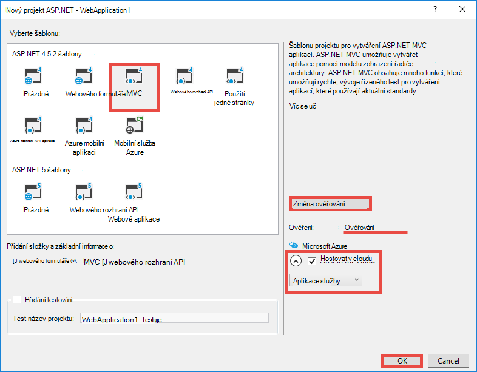

4. V dialogovém okně **Vytvořit aplikaci služby** klikněte na **Přidat účet** (a potom v rozevíracím seznamu **Přidat účet** ) k přihlášení k účtu Azure.

5. Po přihlášení nakonfigurujte webovou aplikaci. Vytvoření skupiny zdrojů a nový plán služeb aplikací po kliknutí na příslušné tlačítko **Nový** . Klikněte na **Prozkoumat další služby Azure** pokračovat.

    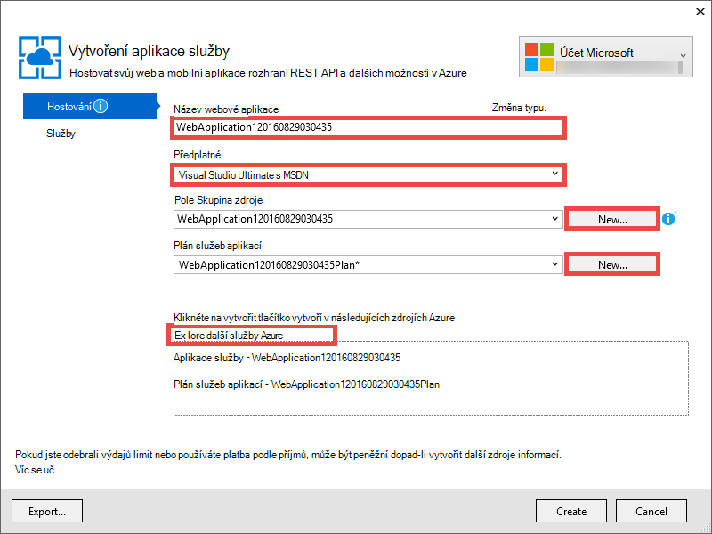

6. Na kartě **služby** klikněte na **+** přidání SQL databáze aplikace. 

    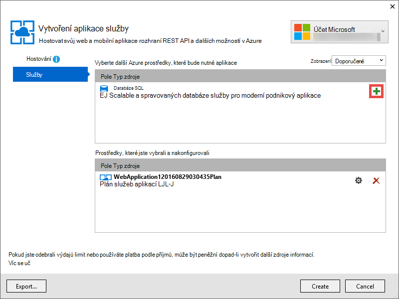

7. **Konfigurace databáze SQL**klikněte na **Nový** pro vytvoření instance serveru SQL Server.

8. V dialogovém okně **Konfigurace serveru SQL Server**nakonfigurujte instance serveru SQL Server. Potom klikněte na **OK** **OK**a **vytvořit** a spusťte tak vytváření aplikací v Azure.

9. V **Aktivitu aplikace služby Azure**uvidíte po dokončení vytváření aplikací. Klikněte na * *Publikovat &lt; *název_aplikace*> Tento Web Appu nyní**klikněte na **publikovat **. 

    Po dokončení Visual Studio otevře aplikace publikování v prohlížeči. 

    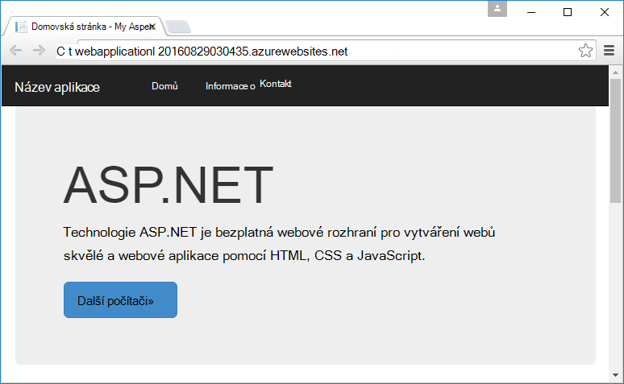

## Konfigurace ověřování a adresářům

1. Přihlaste se k [portálu Azure](https://portal.azure.com).

2. V nabídce nalevo klikněte na **Aplikaci služby** > **&lt;*název_aplikace*>** > **ověřování / se tak mohli ověřovat **.

    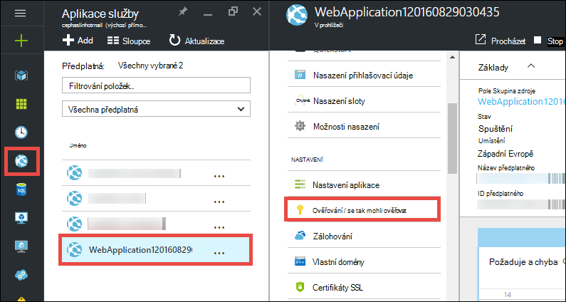

3. Zapnutí služby Azure Active Directory authentication kliknutím **na** > **Azure Active Directory** > **Express** > **OK**.

    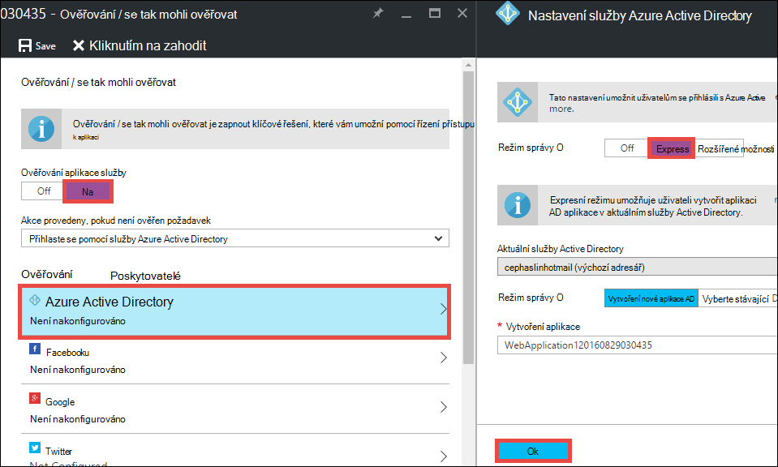

4. V řádku nabídek klikněte na **Uložit** .

    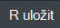

    Po nastavení ověřování jsou uloženy úspěšně, zkuste přechod na aplikaci znova v prohlížeči. Výchozí nastavení vynutit ověřování celou aplikaci. Pokud jste se ještě nepřihlásili, budete přesměrováni na přihlašovací obrazovce. Po přihlášení se zobrazí aplikace zajištěná HTTPS. Pak budete muset povolit přístup k datům adresář. 

5. Přejděte na [klasické portálu](https://manage.windowsazure.com).

6. Klikněte v nabídce nalevo na **Služby Active Directory** > **Výchozí adresáře** > **aplikace** > **&lt;*název_aplikace*> **.

    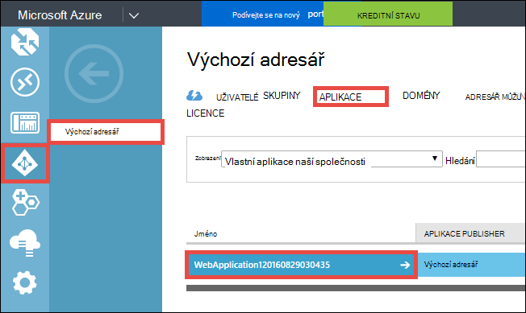

    Toto je vytvořený aplikaci služby Azure Active Directory aplikace povolit povolení / funkce ověřování.

7. Klikněte na **Uživatelé** a **skupiny** , abyste měli jistotu, že máte v adresáři někteří uživatelé a skupiny. Pokud ne, vytvořte několik zkušební uživatele a skupiny.

    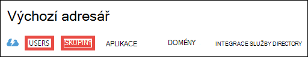

7. Klikněte na **Konfigurovat** pro nastavení této aplikace.

8. Přejděte dolů do části **klíče** a přidejte klíč tak, že vyberete dobu trvání. Potom klikněte na možnost **Delegovat oprávnění** a vyberte **Číst adresáře data**. Klikněte na **Uložit**.

    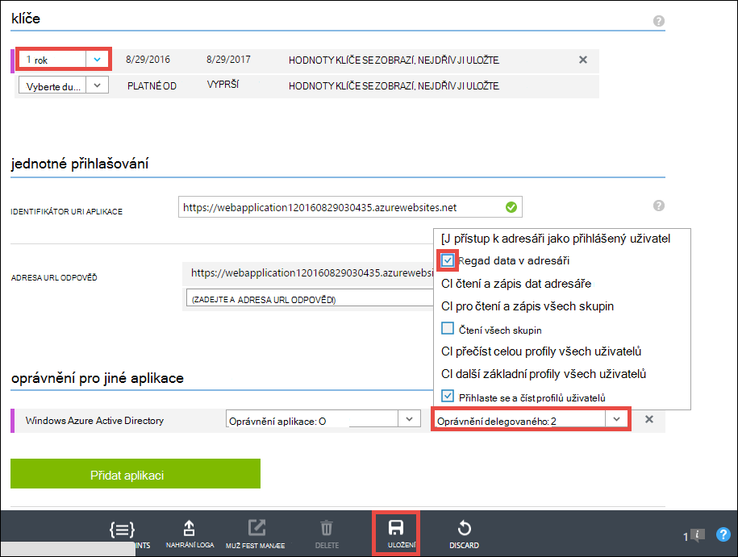

8. Po nastavení se uloží, posuňte se zpátky do části **klíče** a klikněte na tlačítko **Kopírovat** a zkopírujte klíč klienta. 

    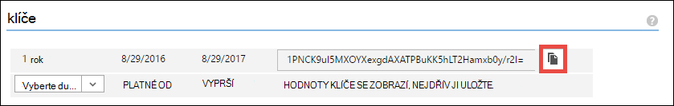

    >[AZURE.IMPORTANT] Pokud jste opustit tuto stránku nyní, nebude moct někdy opětovné tento klíč klienta.

9. Dále je třeba konfigurovat webovou aplikaci k tomuto klíči. Přihlaste se k [Azure zdroje Explorer](https://resources.azure.com) Azure účtem.

10. V horní části stránky klepněte na možnost **Pro čtení i zápis** ke změnám v podokně zdroje Azure.

    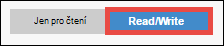

11. Zjištění nastavení ověřování aplikace, c:\ předplatná > * *&lt;*subscriptionname*>** > **resourceGroups** > **&lt;*resourcegroupname*>** > **poskytovatelů** > **Microsoft.Web** > **weby** > **&lt;*název_aplikace*>** > **konfigurace** > **authsettings **.

12. Klikněte na **Upravit**.

    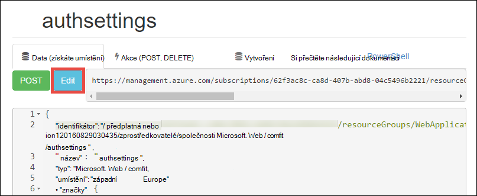

13. V podokně úpravy nastavení `clientSecret` a `additionalLoginParams` vlastnosti takto.

        ...
        "clientSecret": "<client key from the Azure Active Directory application>",
        ...
        "additionalLoginParams": ["response_type=code id_token", "resource=https://graph.windows.net"],
        ...

14. Klikněte na **umístění** umístěné nahoře odeslat změny.

    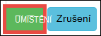

14. Otestovat, pokud máte se tak mohli ověřovat token získat přístup Azure Active Directory grafu rozhraní API, jednoduše přejděte * *https://&lt;*název_aplikace*>.azurewebsites.net/.auth/me** v prohlížeči. Pokud jste nakonfigurovali všechno správně, byste měli vidět `access_token` vlastnost v odpovědi JSON.

    `~/.auth/me` Cesta URL se spravuje ověřování aplikace služby / se tak mohli ověřovat vám umožní všechny informace týkající se ověřená relace. Další informace najdete v tématu [ověření a povolení aplikace služby Azure](../app-service/app-service-authentication-overview.md).

    >[AZURE.NOTE] `access_token` Obsahuje dobu platnosti. Však aplikace služby ověřování / se tak mohli ověřovat funguje token aktualizace s `~/.auth/refresh`. Další informace o tom, jak používat najdete v článku     [Aplikace služby Token úložiště](https://cgillum.tech/2016/03/07/app-service-token-store/).

Pak bude Udělejte něco užitečné s daty adresář.

## Přidání řádku obchodní funkce do aplikace

Teď vytvářet jednoduché CRUD pracovní položky sledování.  

5.  Ve složce ~\Models vytvoření souboru třídy s názvem WorkItem.cs a nahradit `public class WorkItem {...}` s kódem takto:

        using System.ComponentModel.DataAnnotations;

        public class WorkItem
        {
            [Key]
            public int ItemID { get; set; }
            public string AssignedToID { get; set; }
            public string AssignedToName { get; set; }
            public string Description { get; set; }
            public WorkItemStatus Status { get; set; }
        }

        public enum WorkItemStatus
        {
            Open,
            Investigating,
            Resolved,
            Closed
        }

7.  Vytvoření projektu k usnadnění nový model logiky základní konstrukce ve Visual Studiu.

8.  Přidání nové položky scaffolded `WorkItemsController` ke složce ~\Controllers (klikněte pravým tlačítkem myši **řadiče**, přejděte na **Přidat**a vyberte možnost **Nová položka generované uživatelské rozhraní**). 

9.  Vyberte **MVC 5 řadiče se zobrazeními pomocí Framework entita** a klikněte na **Přidat**.

10. Vyberte model, která jste vytvořili, a pak klikněte na **+** a pak **Přidat** Přidat kontext dat a klikněte na tlačítko **Přidat**.

    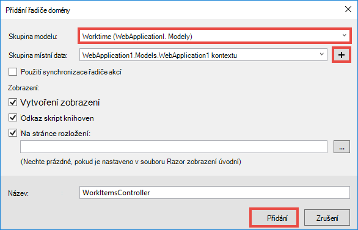

14. V ~\Views\WorkItems\Create.cshtml (automaticky scaffolded zboží) najděte `Html.BeginForm` metoda Pomocník a změňte následující zvýrazněný:  
<pre class="prettyprint">
    @modelWebApplication1.Models.WorkItem

    @{ViewBag.Title = &quot;vytvořit&quot;; }

    &lt;H2&gt;vytvořit&lt;/h2&gt;

    @using(Html.BeginForm (<mark>&quot;vytvořit&quot;, &quot;WorkItems&quot;, FormMethod.Post nové {id = &quot;hlavní formulář&quot; }</mark>)) {@Html.AntiForgeryToken()

        &lt;div class=&quot;form-horizontal&quot;&gt;
            &lt;h4&gt;WorkItem&lt;/h4&gt;
            &lt;hr /&gt;
            @Html.ValidationSummary(true, &quot;&quot;, new { @class = &quot;text-danger&quot; })
            &lt;div class=&quot;form-group&quot;&gt;
                @Html.LabelFor(model =&gt; model.AssignedToID, htmlAttributes: new { @class = &quot;control-label col-md-2&quot; })
                &lt;div class=&quot;col-md-10&quot;&gt;
                    @Html.EditorFor(model =&gt; model.AssignedToID, new { htmlAttributes = new { @class = &quot;form-control&quot;<mark>, @type = &quot;hidden&quot;</mark> } })
                    @Html.ValidationMessageFor(model =&gt; model.AssignedToID, &quot;&quot;, new { @class = &quot;text-danger&quot; })
                &lt;/div&gt;
            &lt;/div&gt;

            &lt;div class=&quot;form-group&quot;&gt;
                @Html.LabelFor(model =&gt; model.AssignedToName, htmlAttributes: new { @class = &quot;control-label col-md-2&quot; })
                &lt;div class=&quot;col-md-10&quot;&gt;
                    @Html.EditorFor(model =&gt; model.AssignedToName, new { htmlAttributes = new { @class = &quot;form-control&quot; } })
                    @Html.ValidationMessageFor(model =&gt; model.AssignedToName, &quot;&quot;, new { @class = &quot;text-danger&quot; })
                &lt;/div&gt;
            &lt;/div&gt;

            &lt;div class=&quot;form-group&quot;&gt;
                @Html.LabelFor(model =&gt; model.Description, htmlAttributes: new { @class = &quot;control-label col-md-2&quot; })
                &lt;div class=&quot;col-md-10&quot;&gt;
                    @Html.EditorFor(model =&gt; model.Description, new { htmlAttributes = new { @class = &quot;form-control&quot; } })
                    @Html.ValidationMessageFor(model =&gt; model.Description, &quot;&quot;, new { @class = &quot;text-danger&quot; })
                &lt;/div&gt;
            &lt;/div&gt;

            &lt;div class=&quot;form-group&quot;&gt;
                @Html.LabelFor(model =&gt; model.Status, htmlAttributes: new { @class = &quot;control-label col-md-2&quot; })
                &lt;div class=&quot;col-md-10&quot;&gt;
                    @Html.EnumDropDownListFor(model =&gt; model.Status, htmlAttributes: new { @class = &quot;form-control&quot; })
                    @Html.ValidationMessageFor(model =&gt; model.Status, &quot;&quot;, new { @class = &quot;text-danger&quot; })
                &lt;/div&gt;
            &lt;/div&gt;

            &lt;div class=&quot;form-group&quot;&gt;
                &lt;div class=&quot;col-md-offset-2 col-md-10&quot;&gt;
                    &lt;input type=&quot;submit&quot; value=&quot;Create&quot; class=&quot;btn btn-default&quot;<mark> id=&quot;submit-button&quot;</mark> /&gt;
                &lt;/div&gt;
            &lt;/div&gt;
        &lt;/div&gt;
    }

    &lt;div&gt;
    @Html.ActionLink(&quot;zpátky do seznamu&quot;, &quot;indexu&quot;) &lt;/div    &gt;

    @sectionSkripty { @Scripts.Render( &quot;~/bundles/jqueryval&quot;)     <mark> &lt;skript&gt; 
     / / kód pro výběr osob nebo skupin var maxResultsPerPage = 14;         var vstupní = document.getElementById (&quot;AssignedToName&quot;);

            // Access token from request header, and tenantID from claims identity
            var token = &quot;@Request.Headers[&quot;X-MS-TOKEN-AAD-ACCESS-TOKEN&quot;]&quot;;
            var tenant =&quot;@(System.Security.Claims.ClaimsPrincipal.Current.Claims
                            .Where(c => c.Type == &quot;http://schemas.microsoft.com/identity/claims/tenantid&quot;)
                            .Select(c => c.Value).SingleOrDefault())&quot;;

            var picker = new AadPicker(maxResultsPerPage, input, token, tenant);

            // Submit the selected user/group to be asssigned.
            $(&quot;#submit-button&quot;).click({ picker: picker }, function () {
                if (!picker.Selected())
                    return;
                $(&quot;#main-form&quot;).get()[0].elements[&quot;AssignedToID&quot;].value = picker.Selected().objectId;
            });
        &lt;/script&gt;</mark>
    }
    </pre>
    
    Všimněte si, že `token` a `tenant` používají `AadPicker` objekt, který chcete volat Azure Active Directory grafu rozhraní API aplikace. Budete přidávat `AadPicker` později.   
    
    >[AZURE.NOTE] Stejně jednoduše si můžete `token` a `tenant` na straně klienta se `~/.auth/me`, ale bude pozvání dalších serveru. Příklad:
    >  
    >     $.ajax({
    >         dataType: "json",
    >         url: "/.auth/me",
    >         success: function (data) {
    >             var token = data[0].access_token;
    >             var tenant = data[0].user_claims
    >                             .find(c => c.typ === 'http://schemas.microsoft.com/identity/claims/tenantid')
    >                             .val;
    >         }
    >     });
    
15. Proveďte požadované změny stejné s ~ \Views\WorkItems\Edit.cshtml.

15. `AadPicker` Objekt je definován v skript, který potřebujete přidat do projektu. Klikněte pravým tlačítkem myši na složku ~\Scripts, přejděte na **Přidat**a klikněte na **soubor JavaScript**. Typ `AadPickerLibrary` název souboru a klikněte na **OK**.

16. Kopírování obsahu z [tady](https://raw.githubusercontent.com/cephalin/active-directory-dotnet-webapp-roleclaims/master/WebApp-RoleClaims-DotNet/Scripts/AadPickerLibrary.js) do ~ \Scripts\AadPickerLibrary.js.

    V skriptu `AadPicker` objekt volá [Azure Active Directory grafu rozhraní API aplikace](https://msdn.microsoft.com/Library/Azure/Ad/Graph/api/api-catalog) vyhledejte uživatelé a skupiny, které odpovídají vstupní.  

17. ~\Scripts\AadPickerLibrary.js taky používá [widgety jQuery funkce Automatické dokončování uživatelského rozhraní](https://jqueryui.com/autocomplete/). Takže budete muset přidat jQuery uživatelského rozhraní do projektu. Klikněte pravým tlačítkem na projektu v a klikněte na **Spravovat balíčků NuGet**.

18. Ve Správci balíčku NuGet klikněte na tlačítko Procházet, do panelu hledání zadejte **jquery uživatelského rozhraní** a klikněte na **jQuery.UI.Combined**.

    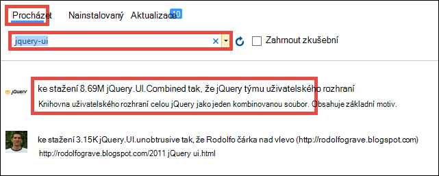

19. V pravém podokně klikněte na tlačítko **instalovat**a potom klepněte na tlačítko **OK** .

19. Otevřete ~\App_Start\BundleConfig.cs a proveďte následující zvýrazněný změny:  
    <pre class="prettyprint">
    Veřejné statické void RegisterBundles(BundleCollection bundles) {sady. Přidání (nové ScriptBundle (&quot;~/bundles/jquery&quot;). Zahrnout ( &quot;~/Scripts/jquery-{version}.js&quot;<mark>, &quot;~/Scripts/jquery-ui-{version}.js&quot;, &quot;~/Scripts/AadPickerLibrary.js&quot;</mark>));

        bundles.Add(new ScriptBundle(&quot;~/bundles/jqueryval&quot;).Include(
                    &quot;~/Scripts/jquery.validate*&quot;));

        // Use the development version of Modernizr to develop with and learn from. Then, when you&#39;re
        // ready for production, use the build tool at http://modernizr.com to pick only the tests you need.
        bundles.Add(new ScriptBundle(&quot;~/bundles/modernizr&quot;).Include(
                    &quot;~/Scripts/modernizr-*&quot;));

        bundles.Add(new ScriptBundle(&quot;~/bundles/bootstrap&quot;).Include(
                    &quot;~/Scripts/bootstrap.js&quot;,
                    &quot;~/Scripts/respond.js&quot;));

        bundles.Add(new StyleBundle(&quot;~/Content/css&quot;).Include(
                    &quot;~/Content/bootstrap.css&quot;,
                    &quot;~/Content/site.css&quot;<mark>,
                    &quot;~/Content/themes/base/jquery-ui.css&quot;</mark>));
    }
    </pre>

    Existují další performant způsoby, jak spravovat soubory šablon stylů CSS a JavaScript v aplikaci. Však pro zjednodušení jenom budete počítač na svazky načtené s všechna zobrazení.

12. Nakonec v ~ \Global.asax, přidejte následující řádek doručení s kódem v `Application_Start()` metody. `Ctrl`+`.`na každou názvů chybu řešení pro nápravu udělat.

        AntiForgeryConfig.UniqueClaimTypeIdentifier = ClaimTypes.NameIdentifier;
    
    > [AZURE.NOTE] Budete potřebovat tento řádek kódu, protože používá výchozí šablonu MVC <code>[ValidateAntiForgeryToken]</code> ozdob v některých akcí. Z důvodu chování popsaná [Společnosti Brock Allen](https://twitter.com/BrockLAllen)     [MVC 4, AntiForgeryToken](http://brockallen.com/2012/07/08/mvc-4-antiforgerytoken-and-claims/) a deklarací příspěvku HTTP může ověření se nezdařilo proti padělání tokenu protože:

    > - Azure Active Directory neodesílá http://schemas.microsoft.com/accesscontrolservice/2010/07/claims/identityprovider, který je potřeba ve výchozím nastavení ochrany proti padělání token.
    > - Pokud Azure Active Directory je adresář synchronizují se službou AD FS, zabezpečení služby AD FS ve výchozím nastavení neodesílá deklaraci http://schemas.microsoft.com/accesscontrolservice/2010/07/claims/identityprovider buď, sice můžete ručně nakonfigurovat službu AD FS odeslat tato deklarace.

    > `ClaimTypes.NameIdentifies`Určuje deklaraci `http://schemas.xmlsoap.org/ws/2005/05/identity/claims/nameidentifier`, která poskytnout Azure Active Directory.  

20. Teď publikujte změny. Klikněte pravým tlačítkem myši projektu a klikněte na **Publikovat**.

21. Klikněte na **Nastavení**, ujistěte se, že k databázi SQL připojovací řetězec, vyberte **Databázi Update** proveďte požadované změny schématu pro modelu a klikněte na **Publikovat**.

    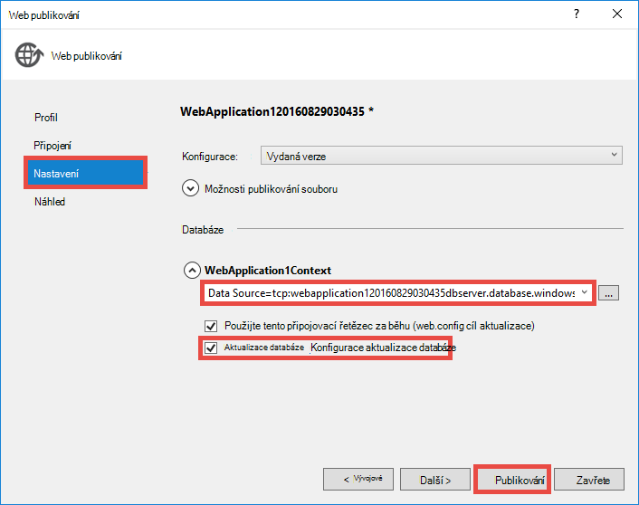

22. V prohlížeči přejděte na https://&lt;*název_aplikace*>.azurewebsites.net/workitems a klikněte na **Vytvořit nový**.

23. Klikněte do pole **AssignedToName** . Teď byste měli vidět uživatelé a skupiny a od vašeho klienta služby Azure Active Directory v rozevíracím seznamu. Lze zadat k filtrování nebo používat `Up` nebo `Down` základní nebo klepnutím vyberte uživatele nebo skupiny. 

    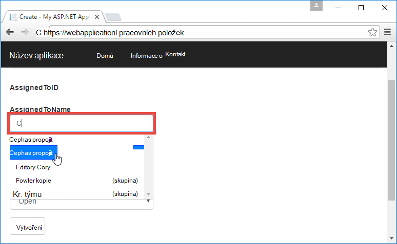

24. Klikněte na **vytvořit** k uložení změn. Potom klikněte na **Upravit** u vytvořeného pracovní položky sledovat ke stejnému chování.

Congrats teď používáte řádku obchodní aplikace v Azure pomocí služby directory access! Je jich že můžete dělat s rozhraní API grafu. Přečtěte si článek [rozhraní API Azure AD grafu](https://msdn.microsoft.com/library/azure/ad/graph/api/api-catalog).

## Další krok

Řízení přístupu na základě rolí (RBAC) pro řádek obchodní aplikace v azure najdete v článku [Web Appu RoleClaims DotNet](https://github.com/Azure-Samples/active-directory-dotnet-webapp-roleclaims) ukázku od týmu služeb Azure Active Directory. Ukazuje, jak povolit role pro aplikaci služby Azure Active Directory a poté schválit uživatelé, kteří mají `[Authorize]` ozdob.

Pokud aplikace řádek obchodní potřebuje přístup k datům místní, najdete v článku [přístup místních zdrojů pomocí hybridní připojení aplikace služby Azure](web-sites-hybrid-connection-get-started.md).

## Další materiály

- [A mohli ověřovat v aplikaci služby Azure](../app-service/app-service-authentication-overview.md)
- [Ověření se místní službou Active Directory v aplikaci Azure](web-sites-authentication-authorization.md)
- [Vytvoření řádku obchodní aplikace v Azure pomocí služby AD FS ověřování](web-sites-dotnet-lob-application-adfs.md)
- [Aplikace služby Auth a Azure AD graf rozhraní API](https://cgillum.tech/2016/03/25/app-service-auth-aad-graph-api/)
- [Microsoft Azure Active Directory ukázky a si přečtěte následující dokumentaci](https://github.com/AzureADSamples)
- [Azure Active Directory podporovaná Token a typy deklarací](http://msdn.microsoft.com/library/azure/dn195587.aspx)

[Protect the Application with SSL and the Authorize Attribute]: web-sites-dotnet-deploy-aspnet-mvc-app-membership-oauth-sql-database.md#protect-the-application-with-ssl-and-the-authorize-attribute
