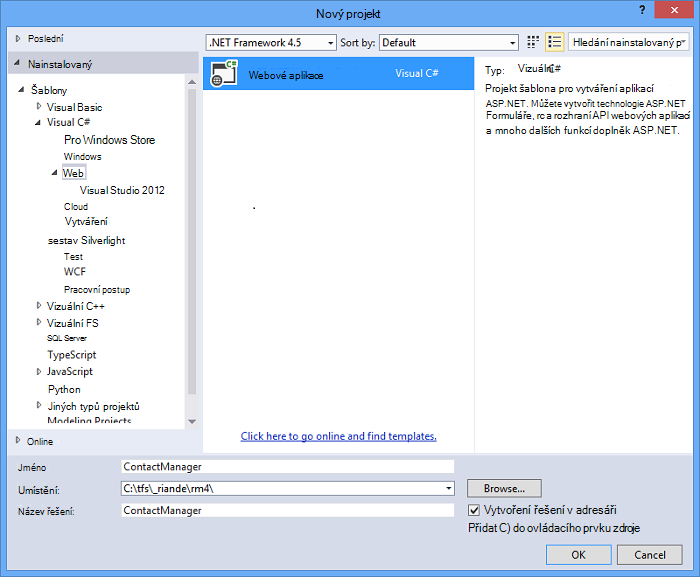
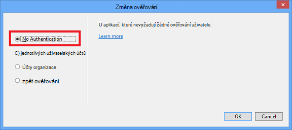
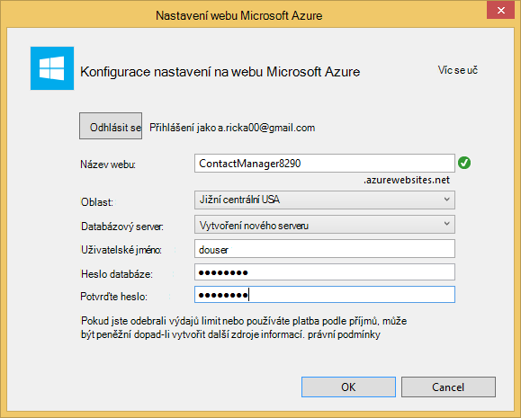
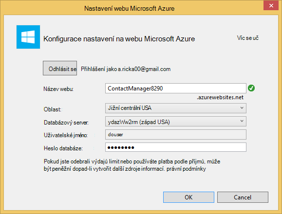
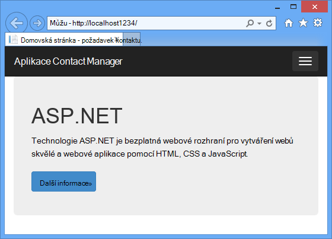
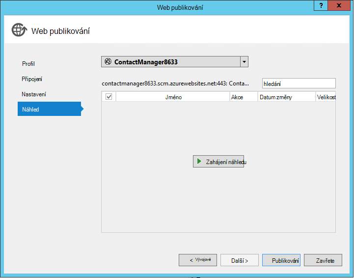
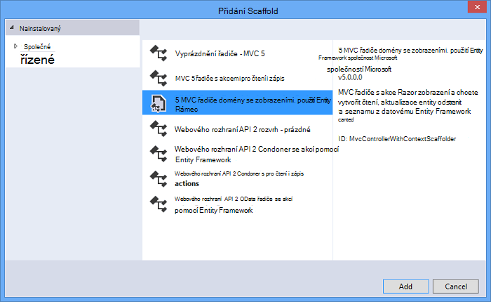
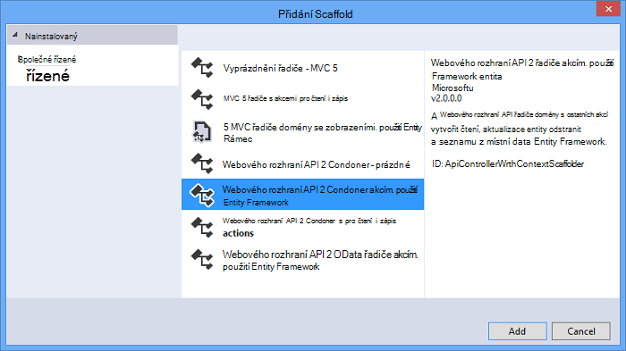
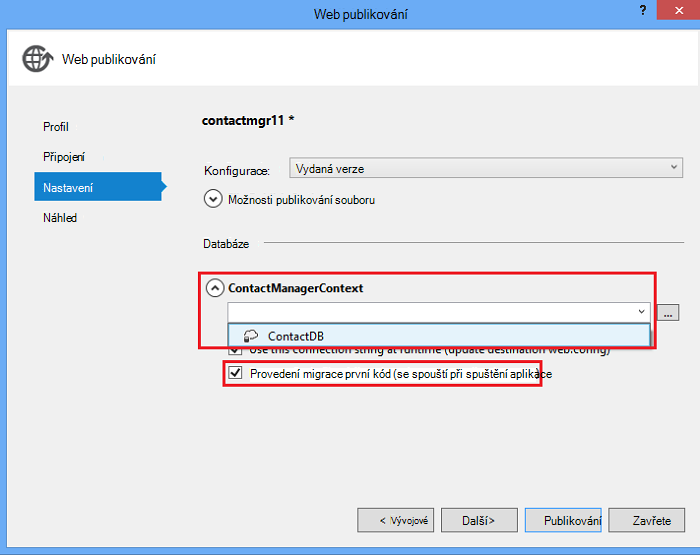

<properties 
    pageTitle="Vytvoření služba REST pomocí rozhraní API webových ASP.NET a databáze SQL Azure aplikace služby" 
    description="Kurz, který se naučíte nasazení aplikace, která používá rozhraní API webových ASP.NET na Azure webovou aplikaci pomocí aplikace Visual Studio." 
    services="app-service\web" 
    documentationCenter=".net" 
    authors="Rick-Anderson" 
    writer="Rick-Anderson" 
    manager="wpickett" 
    editor=""/>

<tags 
    ms.service="app-service-web" 
    ms.workload="web" 
    ms.tgt_pltfrm="na" 
    ms.devlang="dotnet" 
    ms.topic="article" 
    ms.date="02/29/2016" 
    ms.author="riande"/>

# Vytvoření služba REST pomocí rozhraní API webových ASP.NET a databáze SQL Azure aplikace služby

Tento kurz ukazuje, jak nasadit webovou aplikaci ASP.NET Pomocník pro [Aplikaci služby Azure](http://go.microsoft.com/fwlink/?LinkId=529714) pomocí Průvodce Publikovat Web ve Visual Studiu 2013 nebo Visual Studio 2013 komunity Edition. 

Účet Azure, můžete otevřít zdarma a pokud ještě nemáte Visual Studio 2013, SDK pro Web Express nainstaluje automaticky Visual Studio 2013. Tak můžete začít, vývoj pro Azure úplně pro volného.

Tento kurz předpokládá, že máte žádné zkušenosti pomocí Azure. K dokončení tohoto kurzu, budete mít jednoduchou web app nahoru a systémem v cloudu.
 
Se dozvíte:

* Jak povolit počítači pro Azure vývoj instalací Azure SDK.
* Jak vytvořit projekt Visual Studio ASP.NET MVC 5 a publikujte projekt do aplikace Azure.
* Použití rozhraní API webových ASP.NET povolit rozhraní API Restful volá.
* Jak používat databázi SQL Azure uložit data.
* Jak publikovat aktualizace aplikací Azure.

Budete vytvářet jednoduché seznam kontaktů webové aplikace, která je založená na ASP.NET MVC 5 a používá ADO.NET Entity Framework pro přístup k databázi. Následující obrázek znázorňuje dokončené aplikace:

![snímek obrazovky webu][intro001]

<!-- the next line produces the "Set up the development environment" section as see at http://azure.microsoft.com/documentation/articles/web-sites-dotnet-get-started/ -->
[AZURE.INCLUDE [create-account-and-websites-note](../../includes/create-account-and-websites-note.md)]

### Vytvoření projektu

1. Spusťte Visual Studio 2013.
1. V nabídce **soubor** klikněte na **Nový projekt**.
3. V dialogovém okně **Nový projekt** rozšíření **Visual Basic** a vyberte **Web** a pak vyberte **Webová aplikace ASP.NET**. Název aplikace **ContactManager** a klikněte na **OK**.

    

1. V dialogovém okně **Nový projekt ASP.NET** vyberte šablonu **MVC** , zaškrtněte **Rozhraní API webových** a klikněte na **Změnit ověřování**.

1. V dialogovém okně **Změnit ověřování** klikněte na položku **Bez ověření**a klikněte na **OK**.

    

    Ukázka aplikaci, kterou vytváříte nemají funkcí, které vyžadují uživatelům se přihlásit. Informace o tom, jak implementovat a tak mohli ověřovat funkcí naleznete v části [Další kroky](#nextsteps) na konci tohoto kurzu. 

1. V dialogovém okně **Nový projekt ASP.NET** zkontrolujte, jestli že je zaškrtnuté políčko **hostitele v cloudu** a klikněte na **OK**.

Pokud jste to ještě dříve k přihlášení Azure, se výzva k přihlášení.

1. Průvodce konfigurací navrhne jedinečný název podle *ContactManager* (viz na následujícím obrázku). Vyberte oblast blízkosti. [Azurespeed.com](http://www.azurespeed.com/ "AzureSpeed.com") umožňuje najít nejnižší datovém centru latence. 
2. Pokud jste nevytvořili databázovým serverem před, vyberte **vytvořit nový server**, zadejte uživatelské jméno a heslo databáze.

    

Pokud máte databázovým serverem pomocí a vytvořte novou databázi. Databázový server cenné zdrojem informací jsou a obecně Chcete-li vytvořit více databází na stejný server pro testování a vývoj nevytvářejte databázovým serverem na databázi. Zkontrolujte, že váš web a databáze jsou ve stejné oblasti.

### Nastavit záhlaví a zápatí

1. V **Okně Průzkumník**rozbalte složku *Views\Shared* a otevřete soubor *_Layout.cshtml* .

    ![_Layout.cshtml v Průzkumníku řešení][newapp004]

1. Nahraďte obsah souboru *Views\Shared_Layout.cshtml* tento kód:

        <!DOCTYPE html>
        <html lang="en">
        <head>
            <meta charset="utf-8" />
            <title>@ViewBag.Title - Contact Manager</title>
            <link href="~/favicon.ico" rel="shortcut icon" type="image/x-icon" />
            <meta name="viewport" content="width=device-width" />
            @Styles.Render("~/Content/css")
            @Scripts.Render("~/bundles/modernizr")
        </head>
        <body>
            <header>
                

                    

                        
@Html.ActionLink("Contact Manager", "Index", "Home")

                    

                

            </header>
            

                @RenderSection("featured", required: false)
                <section class="content-wrapper main-content clear-fix">
                    @RenderBody()
                </section>
            

            <footer>
                

                    

                        
&copy; @DateTime.Now.Year - Contact Manager

                    

                

            </footer>
            @Scripts.Render("~/bundles/jquery")
            @RenderSection("scripts", required: false)
        </body>
        </html>
            
Revize nad se změní na název aplikace z "Moje aplikace ASP.NET" k "Contact Manager" a odstraní odkazy **pro domácnosti**, **o** nebo **kontakt**.

### Spusťte aplikaci místně

1. Stisknutím kláves CTRL + F5 spustit aplikaci.
Domovská stránka aplikace se zobrazí jako výchozí prohlížeč.
    

To je vše, musíte udělat pro tuto chvíli k vytvoření aplikace, která se nasadit do Azure. Později budete přidávat funkce databáze.

## Nasazení aplikace Azure

1. Ve Visual Studiu klikněte pravým tlačítkem myši na projekt v **Průzkumníku řešení** a místní nabídce vyberte **Publikovat** .

    ![Publikování projektu kontextové nabídky][PublishVSSolution]

    Spustí se průvodce **Publikovat Web** .

12. Klikněte na **Publikovat**.

Visual Studio zahájí proces kopírování souborů na server Azure. V okně **výstupu** ukazuje, jaké akce nasazení pořízení a sestavách úspěšném dokončení nasazení.

14. Jako výchozí prohlížeč automaticky otevře adresu URL webu nasazený.

    Aplikaci, kterou jste vytvořili teď běží v cloudu.
    
    ![Seznam úkolů domovskou stránku spuštěné v Azure][rxz2]

## Přidání databáze do aplikace

Dále se aktualizovat aplikaci MVC přidáte možnost zobrazit a aktualizovat kontakty a uložení dat v databázi. Aplikace bude používat Entity Framework k vytvoření databáze a číst a aktualizovat data v databázi.

### Přidání datových modelů tříd pro kontakty

Začněte tak, že vytvoříte jednoduchý datový model v kódu.

1. V **Okně Průzkumník řešení**klikněte pravým tlačítkem myši na složku modely, klikněte na **Přidat**a potom **předmětu**.

    ![Přidání třídy v místní nabídka pro složky modely][adddb001]

2. V dialogovém okně **Přidat novou položku** zadejte název nového souboru třídy *Contact.cs*a potom klikněte na **Přidat**.

    ![Přidání dialogové okno Nová položka][adddb002]

3. Nahraďte obsah souboru Contacts.cs následující kód.

        using System.Globalization;
        namespace ContactManager.Models
        {
            public class Contact
            {
                public int ContactId { get; set; }
                public string Name { get; set; }
                public string Address { get; set; }
                public string City { get; set; }
                public string State { get; set; }
                public string Zip { get; set; }
                public string Email { get; set; }
                public string Twitter { get; set; }
                public string Self
                {
                    get { return string.Format(CultureInfo.CurrentCulture,
                         "api/contacts/{0}", this.ContactId); }
                    set { }
                }
            }
        }

**Obraťte se na** třída definuje data, která se uloží pro každý z kontaktů, iniciály primární klíč, KódKontaktu, který je nutný pro databázi. Na konci kurzu, můžete získat další informace o datových modelech v části [Další kroky](#nextsteps) .

### Vytvoření webové stránky, které umožňují uživatelům aplikace pro práci s kontakty

ASP.NET MVC funkci vygenerovaných můžete automaticky generovat kód, který provádí vytvořit, číst, aktualizovat a odstraňovat akce (CRUD).

## Přidání řadiči a zobrazení dat

1. V **Okně Průzkumník**rozbalte složku řadiče.

3. Vytvoření projektu **(Ctrl + Shift + B)**. (Třeba sestavíte projekt před použitím mechanismus generování uživatelského rozhraní.) 

4. Klikněte pravým tlačítkem myši na složku řadiče a klikněte na **Přidat**a potom klikněte na **řadiče domény**.

    ![Přidání řadiče domény řadiče složky kontextové nabídky][addcode001]

1. V dialogovém okně **Přidat Scaffold** vyberte **MVC řadiče domény se zobrazeními pomocí Framework entita** a klikněte na **Přidat**.

 

6. Nastavte jeho název na **HomeController**. Vyberte **kontakt** jako svojí třídě modelu. Klikněte na tlačítko **Nový datový kontext** a přijměte výchozí "ContactManager.Models.ContactManagerContext" **Nový datový typ kontextu**. Klikněte na **Přidat**.

    Dialogové okno zobrazí výzvu: "souboru s názvem HomeController již existuje. Chcete nahradit ho? ". Klikněte na **Ano**. Jsme přepisování řadiče Domů, který byl vytvořený pomocí nového projektu. Použijeme nového řadiče domácnosti pro našem seznamu kontaktů.

    Visual Studio vytvoří metod řadiče a zobrazení pro databáze CRUD pro objekty **kontaktu** .

## Povolení migrace, vytvořit databázi, Přidání ukázkových dat a inicializační dat ##

Je další úkol povolit funkci [Kód první migrace](http://curah.microsoft.com/55220) k vytvoření databáze podle datový model, který jste vytvořili.

1. V nabídce **Nástroje** vyberte **Správce balíčku knihovny** a potom **Konzoly balíčku správce**.

    ![Správce balíčků konzoly v nabídce Nástroje][addcode008]

2. V okně **Správce balíčků konzoly** zadejte tento příkaz:

        enable-migrations 
  
    Příkaz **Povolit migrace** vytvoří složku *migrace* a umístí do této složky *Configuration.cs* soubor, který můžete upravit konfigurace migrace. 

2. V okně **Správce balíčků konzoly** zadejte tento příkaz:

        add-migration Initial

    Příkaz **Přidat migrace počáteční** vygeneruje třídu s názvem ** &lt;date_stamp&gt;počáteční** , která vytvoří databázi. První parametr ( *výchozí* ) je libovolného a použitých k vytvoření názvu souboru. Zobrazí se nové soubory tříd v **Průzkumníku řešení**.

    Ve třídě **Počáteční** metodu **se** vytvoří tabulku Kontakty a **dolů** metodu (vyvolají chcete se vrátit na předchozí stav) vynechává ho.

3. Otevřete soubor *Migrations\Configuration.cs* . 

4. Přidejte následující obory názvů. 

         using ContactManager.Models;

5. Nahraďte metodu *Počáteční hodnota* následující kód:
        
        protected override void Seed(ContactManager.Models.ContactManagerContext context)
        {
            context.Contacts.AddOrUpdate(p => p.Name,
               new Contact
               {
                   Name = "Debra Garcia",
                   Address = "1234 Main St",
                   City = "Redmond",
                   State = "WA",
                   Zip = "10999",
                   Email = "debra@example.com",
                   Twitter = "debra_example"
               },
                new Contact
                {
                    Name = "Thorsten Weinrich",
                    Address = "5678 1st Ave W",
                    City = "Redmond",
                    State = "WA",
                    Zip = "10999",
                    Email = "thorsten@example.com",
                    Twitter = "thorsten_example"
                },
                new Contact
                {
                    Name = "Yuhong Li",
                    Address = "9012 State st",
                    City = "Redmond",
                    State = "WA",
                    Zip = "10999",
                    Email = "yuhong@example.com",
                    Twitter = "yuhong_example"
                },
                new Contact
                {
                    Name = "Jon Orton",
                    Address = "3456 Maple St",
                    City = "Redmond",
                    State = "WA",
                    Zip = "10999",
                    Email = "jon@example.com",
                    Twitter = "jon_example"
                },
                new Contact
                {
                    Name = "Diliana Alexieva-Bosseva",
                    Address = "7890 2nd Ave E",
                    City = "Redmond",
                    State = "WA",
                    Zip = "10999",
                    Email = "diliana@example.com",
                    Twitter = "diliana_example"
                }
                );
        }

    Tento kód výše spustí databázi spolu s kontaktními informacemi. Další informace o ohlašovat databáze najdete v článku [DBs ladění Framework Entity (EF)](http://blogs.msdn.com/b/rickandy/archive/2013/02/12/seeding-and-debugging-entity-framework-ef-dbs.aspx).

1. V **Konzole Správce balíčků** zadejte příkaz:

        update-database

    ![Příkazy Správce balíčků konzoly][addcode009]

    **Aktualizace databáze** se spustí první migrace, který vytvoří databázi. Ve výchozím nastavení databáze se vytvoří jako databázi SQL serveru Express LocalDB.

1. Stisknutím kláves CTRL + F5 spustit aplikaci. 

Aplikace zobrazují data počáteční hodnota a odkazy pro úpravu, podrobnosti a odstranit.

![MVC zobrazení dat][rxz3]

## Úprava zobrazení

1. Otevřete soubor *Views\Home\Index.cshtml* . V dalším kroku jsme nahradí vygenerovaných značek kód, který používá [jQuery](http://jquery.com/) a [Knockout.js](http://knockoutjs.com/). Tento nový kód načte seznam kontaktů z pomocí rozhraní API webových a JSON a váže data kontaktů k používání knockout.js uživatelského rozhraní. Další informace naleznete v části [Další kroky](#nextsteps) na konci tohoto kurzu. 

2. Nahraďte obsah souboru následující kód.

        @model IEnumerable<ContactManager.Models.Contact>
        @{
            ViewBag.Title = "Home";
        }
        @section Scripts {
            @Scripts.Render("~/bundles/knockout")
            
        }
        <ul id="contacts" data-bind="foreach: contacts">
            <li class="ui-widget-content ui-corner-all">
                <h1 data-bind="text: Name" class="ui-widget-header"></h1>
                

                

                    ,
                    
                    
                

                

                
Email?

                

                
Twitter?

                
<a data-bind="attr: { href: Self }, click: $root.removeContact" class="removeContact ui-state-default ui-corner-all">Remove</a>

            </li>
        </ul>
        <form id="addContact" data-bind="submit: addContact">
            <fieldset>
                <legend>Add New Contact</legend>
                <ol>
                    <li>
                        <label for="Name">Name</label>
                        <input type="text" name="Name" />
                    </li>
                    <li>
                        <label for="Address">Address</label>
                        <input type="text" name="Address" >
                    </li>
                    <li>
                        <label for="City">City</label>
                        <input type="text" name="City" />
                    </li>
                    <li>
                        <label for="State">State</label>
                        <input type="text" name="State" />
                    </li>
                    <li>
                        <label for="Zip">Zip</label>
                        <input type="text" name="Zip" />
                    </li>
                    <li>
                        <label for="Email">E-mail</label>
                        <input type="text" name="Email" />
                    </li>
                    <li>
                        <label for="Twitter">Twitter</label>
                        <input type="text" name="Twitter" />
                    </li>
                </ol>
                <input type="submit" value="Add" />
            </fieldset>
        </form>

3. Klikněte pravým tlačítkem myši složku a klikněte na tlačítko **Přidat**a potom klikněte na **Nová položka...**.

    ![Přidání stylů v místní nabídka pro složky obsahu][addcode005]

4. V dialogovém okně **Přidat novou položku** horní doprava vyhledávacího pole zadejte **styl** a vyberte **Šablonu stylů**.
    ![Přidání dialogové okno Nová položka][rxStyle]

5. Zadejte název souboru *Contacts.css* a klikněte na **Přidat**. Nahraďte obsah souboru následující kód.
    
        .column {
            float: left;
            width: 50%;
            padding: 0;
            margin: 5px 0;
        }
        form ol {
            list-style-type: none;
            padding: 0;
            margin: 0;
        }
        form li {
            padding: 1px;
            margin: 3px;
        }
        form input[type="text"] {
            width: 100%;
        }
        #addContact {
            width: 300px;
            float: left;
            width:30%;
        }
        #contacts {
            list-style-type: none;
            margin: 0;
            padding: 0;
            float:left;
            width: 70%;
        }
        #contacts li {
            margin: 3px 3px 3px 0;
            padding: 1px;
            float: left;
            width: 300px;
            text-align: center;
            background-image: none;
            background-color: #F5F5F5;
        }
        #contacts li h1
        {
            padding: 0;
            margin: 0;
            background-image: none;
            background-color: Orange;
            color: White;
            font-family: Trebuchet MS, Tahoma, Verdana, Arial, sans-serif;
        }
        .removeContact, .viewImage
        {
            padding: 3px;
            text-decoration: none;
        }

    Použijeme tuto šablonu stylů pro rozložení, barev a stylů použitých v seznamu kontaktů Správce aplikací.

6. Otevřete soubor *App_Start\BundleConfig.cs* .

7. Přidejte následující kód k registraci modulu plug-in(http://knockoutjs.com/index.html "KO") [Pád].

        bundles.Add(new ScriptBundle("~/bundles/knockout").Include(
                    "~/Scripts/knockout-{version}.js"));
    Tento příklad použití pád zjednodušit dynamické kód v JavaScriptu zpracovávající šablony blokování.

8. Upravte položku obsah/css zaregistrovat v šabloně stylů *contacts.css* . Změňte následující řádek:

                 bundles.Add(new StyleBundle("~/Content/css").Include(
                   "~/Content/bootstrap.css",
                   "~/Content/site.css"));
:

        bundles.Add(new StyleBundle("~/Content/css").Include(
                   "~/Content/bootstrap.css",
                   "~/Content/contacts.css",
                   "~/Content/site.css"));

1. V konzole Správce balíčků spusťte tento příkaz nainstalovat pád.

        Install-Package knockoutjs

## Přidání řadiče webového rozhraní API Restful rozhraní

1. V **Okně Průzkumník**řadiče pravým tlačítkem klikněte na **Přidat** a potom **řadiče …** 

1. V dialogovém okně **Přidat Scaffold** zadejte **Webového rozhraní API 2 řadiče se akcí pomocí Entity Framework** a potom klikněte na **Přidat**.

    

4. V dialogovém okně **Přidat řadiče** zadejte "ContactsController" jako název svého zařízení. Vyberte "Kontaktu (ContactManager.Models)" **modelu předmětu**.  Ponechat výchozí hodnotu pro **datové kontextové třídy**. 

6. Klikněte na **Přidat**.

### Spusťte aplikaci místně

1. Stisknutím kláves CTRL + F5 spustit aplikaci.

    ![Stránka indexu][intro001]

2. Zadejte kontaktu a klikněte na **Přidat**. Aplikace vrátí na domovskou stránku a zobrazí na kontakt, který jste zadali.

    ![Stránka indexu s položkami seznamu úkolů][addwebapi004]

3. V prohlížeči připojení **/api/contacts** na adresu URL.

    Výslednou adresu URL bude vypadat podobně jako http://localhost:1234/rozhraní api/kontakty. RESTful webového rozhraní API jste přidali vrátí uložené kontakty. Firefox a Chrome se zobrazí data ve formátu XML.

    ![Index stránky s položkami seznamu úkolů][rxFFchrome]
    

    IE vás vyzve k otevření nebo uložení kontakty.

    ![Dialogové okno Uložit webového rozhraní API][addwebapi006]
    
    
    Otevřete vrácené kontakty v programu Poznámkový blok nebo v prohlížeči.
    
    Tento výstup můžete spotřebované jinou aplikací, jako je mobilní webovou stránku nebo do aplikace.

    ![Dialogové okno Uložit webového rozhraní API][addwebapi007]

    **Upozornění zabezpečení**: V tomto okamžiku aplikace je zabezpečený a ohroženo CSRF útok. Dále v tomto kurzu budeme odeberete tuto chybu. Další informace najdete v článku [útoky rozhraní zabraňující webů požádat o padělání (CSRF)][prevent-csrf-attacks].
## Přidání zámku XSRF

Žádost o webů padělání (označovaná taky jako XSRF nebo CSRF) se útok proti web hostovaný aplikací kterými nebezpečný web, který může ovlivnit interakce mezi prohlížeče klienta a web důvěryhodný prohlížeče. Tyto útoky jsou umožnily, protože webových prohlížečích odešle tokeny ověřování automaticky se každý požadavek na web. Příklad kanonické je ověřovací soubor cookie, například ASP. Ověřování pomocí formulářů lístek na síť. Weby, které použít libovolnou mechanismus trvalý ověřování (například ověřování systému Windows, základní a tak dále) však můžete směrovat tak, že tyto útoky.

Útok XSRF se liší od útok phishing. Útoky typu phishing nevyžadovaly interakci stanete obětí online. V rámci útoku phishing nebezpečný web, který bude napodobit cílový web a obětí oklamat do poskytnout podpoře citlivé informace a mohl. Útok XSRF je často zásah nutná stanete obětí online. Místo toho mohl může v prohlížeči automatické odesílání všechny relevantní soubory cookie na cílový web.

Další informace najdete v tématu [Otevření projektu zabezpečení webové aplikace](https://www.owasp.org/index.php/Main_Page) (OWASP) [XSRF](https://www.owasp.org/index.php/Cross-Site_Request_Forgery_(CSRF)).

1. V **Okně Průzkumník**pravým **ContactManager** projektu a klikněte na tlačítko **Přidat** a potom na **předmětu**.

2. Zadejte název souboru *ValidateHttpAntiForgeryTokenAttribute.cs* a přidejte následující kód:

        using System;
        using System.Collections.Generic;
        using System.Linq;
        using System.Net;
        using System.Net.Http;
        using System.Web.Helpers;
        using System.Web.Http.Controllers;
        using System.Web.Http.Filters;
        using System.Web.Mvc;
        namespace ContactManager.Filters
        {
            public class ValidateHttpAntiForgeryTokenAttribute : AuthorizationFilterAttribute
            {
                public override void OnAuthorization(HttpActionContext actionContext)
                {
                    HttpRequestMessage request = actionContext.ControllerContext.Request;
                    try
                    {
                        if (IsAjaxRequest(request))
                        {
                            ValidateRequestHeader(request);
                        }
                        else
                        {
                            AntiForgery.Validate();
                        }
                    }
                    catch (HttpAntiForgeryException e)
                    {
                        actionContext.Response = request.CreateErrorResponse(HttpStatusCode.Forbidden, e);
                    }
                }
                private bool IsAjaxRequest(HttpRequestMessage request)
                {
                    IEnumerable<string> xRequestedWithHeaders;
                    if (request.Headers.TryGetValues("X-Requested-With", out xRequestedWithHeaders))
                    {
                        string headerValue = xRequestedWithHeaders.FirstOrDefault();
                        if (!String.IsNullOrEmpty(headerValue))
                        {
                            return String.Equals(headerValue, "XMLHttpRequest", StringComparison.OrdinalIgnoreCase);
                        }
                    }
                    return false;
                }
                private void ValidateRequestHeader(HttpRequestMessage request)
                {
                    string cookieToken = String.Empty;
                    string formToken = String.Empty;
                    IEnumerable<string> tokenHeaders;
                    if (request.Headers.TryGetValues("RequestVerificationToken", out tokenHeaders))
                    {
                        string tokenValue = tokenHeaders.FirstOrDefault();
                        if (!String.IsNullOrEmpty(tokenValue))
                        {
                            string[] tokens = tokenValue.Split(':');
                            if (tokens.Length == 2)
                            {
                                cookieToken = tokens[0].Trim();
                                formToken = tokens[1].Trim();
                            }
                        }
                    }
                    AntiForgery.Validate(cookieToken, formToken);
                }
            }
        }

1. Přidejte následující příkaz *pomocí* řadiči smlouvy tak, abyste měli přístup ke atributů **[ValidateHttpAntiForgeryToken]** .

        using ContactManager.Filters;

1. Přidejte do příspěvku metody **ContactsController** chránit před XSRF hrozeb atribut **[ValidateHttpAntiForgeryToken]** . Přidá ji do metody akce "PutContact", "PostContact" a **DeleteContact** .

        [ValidateHttpAntiForgeryToken]
            public IHttpActionResult PutContact(int id, Contact contact)
            {

1. Aktualizujte *skripty* část souboru *Views\Home\Index.cshtml* zahrnout kódu a získání tokeny XSRF.

         @section Scripts {
            @Scripts.Render("~/bundles/knockout")
            
         }

## Publikování aktualizace aplikací a databáze SQL Azure

Publikování aplikace, opakujte tento postup, který jste postupovali podle výše.

1. V **Okně Průzkumník řešení**klikněte pravým tlačítkem myši projektu a vyberte **Publikovat**.

    ![Publikování][rxP]

5. Klikněte na kartu **Nastavení** .
    

1. V části **ContactsManagerContext(ContactsManagerContext)**klepněte na ikonu **v** změnit *vzdálené připojovací řetězec* připojovací řetězec pro databázi kontaktů. Klikněte na tlačítko **ContactDB**.

    

7. Zaškrtněte políčko spustit kód první v případě migrací **(se spouští při spuštění aplikace)**.

1. Klikněte na tlačítko **Další** a potom klikněte na tlačítko **Náhled**. Visual Studio zobrazí seznam souborů, které budou přidány nebo aktualizovat.

8. Klikněte na **Publikovat**.
Po dokončení nasazení prohlížeči se otevře domovskou stránku aplikace.

    ![Stránka Index se žádné kontakty.][intro001]

    Visual Studio procesu publikování automaticky konfigurovat připojovací řetězec *nasazeném nastavení(Web.config)) tak, aby ukazovaly k SQL databázi* . Taky nakonfigurovaná kód první přenesení do automaticky databázi upgradovat na nejnovější verzi aplikace připojí se k databázi po nasazení poprvé.

    Po nastavení této konfigurace kódem první databázi vytvořil spuštěním kód v **Počáteční** předmětu, který jste vytvořili. Stejně to při prvním pokusu o přístup k databázi po nasazení aplikace.

9. Zadejte kontaktu, stejně jako při spuštění aplikace místně, můžete ověřit úspěšnou nasazení databáze.

Až uvidíte, že položky, kterou zadáte se uloží a zobrazuje se na stránce Správce kontaktů, víte, že má uložené v databázi.

![Index stránky s kontakty][addwebapi004]

Aplikaci teď běží v cloudu, ukládání dat pomocí databáze SQL. Po dokončení testování aplikace v Azure, odstraňte ji. Aplikace je veřejné a nemá mechanismus omezit přístup.

>[AZURE.NOTE] Pokud chcete začít pracovat s aplikaci služby Azure před registrací účet Azure, přejděte na [Zkuste aplikaci služby](http://go.microsoft.com/fwlink/?LinkId=523751), které můžete okamžitě vytvořit web appu krátkodobý starter v aplikaci služby. Žádné povinné; kreditní karty žádné závazky.

## Další kroky

Skutečné aplikaci vyžadují a tak mohli ověřovat a použijete k tomuto účelu databáze členství. Kurz [nasazení aplikace zabezpečené technologie ASP.NET MVC s OAuth, členství a SQL databáze](web-sites-dotnet-deploy-aspnet-mvc-app-membership-oauth-sql-database.md) je založená na tomto kurzu a ukazuje, jak nasazení webové aplikace s databází členství.

Jiný způsob ukládání dat v aplikaci Azure je použít Azure úložiště, které poskytují úložiště-relačních dat v podobě objektů BLOB a tabulky. Následující odkazy poskytují další informace o rozhraní API webových, ASP.NET MVC a okno Azure.
 

* [Začínáme s Entity Framework pomocí MVC][EFCodeFirstMVCTutorial]
* [Úvod do technologie ASP.NET MVC 5](http://www.asp.net/mvc/tutorials/mvc-5/introduction/getting-started)
* [První ASP.NET webového rozhraní API](http://www.asp.net/web-api/overview/getting-started-with-aspnet-web-api/tutorial-your-first-web-api)
* [Ladění WAWS](web-sites-dotnet-troubleshoot-visual-studio.md)

Tento kurz a ukázkové aplikace napsal [Anderson RTF](http://blogs.msdn.com/b/rickandy/) (Twitter [@RickAndMSFT](https://twitter.com/RickAndMSFT)) pomoc od Toma Dryml a Jiří Dorrans (Twitter [@blowdart](https://twitter.com/blowdart)). 

Zkontrolujte opustit názory na co vám líbí, nebo jak jste chtěli zobrazit lepší, nejen o kurz samotné, ale i o produktech, které ukazuje. Váš názor nám určit jejich prioritu vylepšení pomůže. Zejména zajímá zjistit kolik úrok je další automatizace procesů konfiguraci a nasazení databázi členství. 

## Co se změnilo
* Průvodce na změnu z webů pro aplikaci služby v tématu: [aplikaci služby Azure a jeho dopad na existující služby Azure](http://go.microsoft.com/fwlink/?LinkId=529714)

<!-- bookmarks -->
[Add an OAuth Provider]: #addOauth
[Add Roles to the Membership Database]:#mbrDB
[Create a Data Deployment Script]:#ppd
[Update the Membership Database]:#ppd2
[setupdbenv]: #bkmk_setupdevenv
[setupwindowsazureenv]: #bkmk_setupwindowsazure
[createapplication]: #bkmk_createmvc4app
[deployapp1]: #bkmk_deploytowindowsazure1
[adddb]: #bkmk_addadatabase
[addcontroller]: #bkmk_addcontroller
[addwebapi]: #bkmk_addwebapi
[deploy2]: #bkmk_deploydatabaseupdate

<!-- links -->
[EFCodeFirstMVCTutorial]: http://www.asp.net/mvc/tutorials/getting-started-with-ef-using-mvc/creating-an-entity-framework-data-model-for-an-asp-net-mvc-application
[dbcontext-link]: http://msdn.microsoft.com/library/system.data.entity.dbcontext(v=VS.103).aspx

<!-- images-->
[rxE]: ./media/web-sites-dotnet-rest-service-aspnet-api-sql-database/rxE.png
[rxP]: ./media/web-sites-dotnet-rest-service-aspnet-api-sql-database/rxP.png
[rx22]: ./media/web-sites-dotnet-rest-service-aspnet-api-sql-database/
[rxb2]: ./media/web-sites-dotnet-rest-service-aspnet-api-sql-database/rxb2.png
[rxz]: ./media/web-sites-dotnet-rest-service-aspnet-api-sql-database/rxz.png
[rxzz]: ./media/web-sites-dotnet-rest-service-aspnet-api-sql-database/rxzz.png
[rxz2]: ./media/web-sites-dotnet-rest-service-aspnet-api-sql-database/rxz2.png
[rxz3]: ./media/web-sites-dotnet-rest-service-aspnet-api-sql-database/rxz3.png
[rxStyle]: ./media/web-sites-dotnet-rest-service-aspnet-api-sql-database/rxStyle.png
[rxz4]: ./media/web-sites-dotnet-rest-service-aspnet-api-sql-database/rxz4.png
[rxz44]: ./media/web-sites-dotnet-rest-service-aspnet-api-sql-database/rxz44.png
[rxNewCtx]: ./media/web-sites-dotnet-rest-service-aspnet-api-sql-database/rxNewCtx.png
[rxPrevDB]: ./media/web-sites-dotnet-rest-service-aspnet-api-sql-database/rxPrevDB.png
[rxOverwrite]: ./media/web-sites-dotnet-rest-service-aspnet-api-sql-database/rxOverwrite.png
[rxPWS]: ./media/web-sites-dotnet-rest-service-aspnet-api-sql-database/rxPWS.png
[rxNewCtx]: ./media/web-sites-dotnet-rest-service-aspnet-api-sql-database/rxNewCtx.png
[rxAddApiController]: ./media/web-sites-dotnet-rest-service-aspnet-api-sql-database/rxAddApiController.png
[rxFFchrome]: ./media/web-sites-dotnet-rest-service-aspnet-api-sql-database/rxFFchrome.png
[intro001]: ./media/web-sites-dotnet-rest-service-aspnet-api-sql-database/dntutmobil-intro-finished-web-app.png
[rxCreateWSwithDB]: ./media/web-sites-dotnet-rest-service-aspnet-api-sql-database/rxCreateWSwithDB.png
[setup007]: ./media/web-sites-dotnet-rest-service-aspnet-api-sql-database/dntutmobile-setup-azure-site-004.png
[setup009]: ../Media/dntutmobile-setup-azure-site-006.png
[newapp002]: ./media/web-sites-dotnet-rest-service-aspnet-api-sql-database/dntutmobile-createapp-002.png
[newapp004]: ./media/web-sites-dotnet-rest-service-aspnet-api-sql-database/dntutmobile-createapp-004.png
[firsdeploy007]: ./media/web-sites-dotnet-rest-service-aspnet-api-sql-database/dntutmobile-deploy1-publish-005.png
[firsdeploy009]: ./media/web-sites-dotnet-rest-service-aspnet-api-sql-database/dntutmobile-deploy1-publish-007.png
[adddb001]: ./media/web-sites-dotnet-rest-service-aspnet-api-sql-database/dntutmobile-adddatabase-001.png
[adddb002]: ./media/web-sites-dotnet-rest-service-aspnet-api-sql-database/dntutmobile-adddatabase-002.png
[addcode001]: ./media/web-sites-dotnet-rest-service-aspnet-api-sql-database/dntutmobile-controller-add-context-menu.png
[addcode002]: ./media/web-sites-dotnet-rest-service-aspnet-api-sql-database/dntutmobile-controller-add-controller-dialog.png
[addcode004]: ./media/web-sites-dotnet-rest-service-aspnet-api-sql-database/dntutmobile-controller-modify-index-context.png
[addcode005]: ./media/web-sites-dotnet-rest-service-aspnet-api-sql-database/dntutmobile-controller-add-contents-context-menu.png
[addcode007]: ./media/web-sites-dotnet-rest-service-aspnet-api-sql-database/dntutmobile-controller-modify-bundleconfig-context.png
[addcode008]: ./media/web-sites-dotnet-rest-service-aspnet-api-sql-database/dntutmobile-migrations-package-manager-menu.png
[addcode009]: ./media/web-sites-dotnet-rest-service-aspnet-api-sql-database/dntutmobile-migrations-package-manager-console.png
[addwebapi004]: ./media/web-sites-dotnet-rest-service-aspnet-api-sql-database/dntutmobile-webapi-added-contact.png
[addwebapi006]: ./media/web-sites-dotnet-rest-service-aspnet-api-sql-database/dntutmobile-webapi-save-returned-contacts.png
[addwebapi007]: ./media/web-sites-dotnet-rest-service-aspnet-api-sql-database/dntutmobile-webapi-contacts-in-notepad.png
[Add XSRF Protection]: #xsrf
[WebPIAzureSdk20NetVS12]: ./media/web-sites-dotnet-rest-service-aspnet-api-sql-database/WebPIAzureSdk20NetVS12.png
[Add XSRF Protection]: #xsrf
[ImportPublishSettings]: ./media/web-sites-dotnet-rest-service-aspnet-api-sql-database/ImportPublishSettings.png
[ImportPublishProfile]: ./media/web-sites-dotnet-rest-service-aspnet-api-sql-database/ImportPublishProfile.png
[PublishVSSolution]: ./media/web-sites-dotnet-rest-service-aspnet-api-sql-database/PublishVSSolution.png
[ValidateConnection]: ./media/web-sites-dotnet-rest-service-aspnet-api-sql-database/ValidateConnection.png
[WebPIAzureSdk20NetVS12]: ./media/web-sites-dotnet-rest-service-aspnet-api-sql-database/WebPIAzureSdk20NetVS12.png
[prevent-csrf-attacks]: http://www.asp.net/web-api/overview/security/preventing-cross-site-request-forgery-(csrf)-attacks
 
