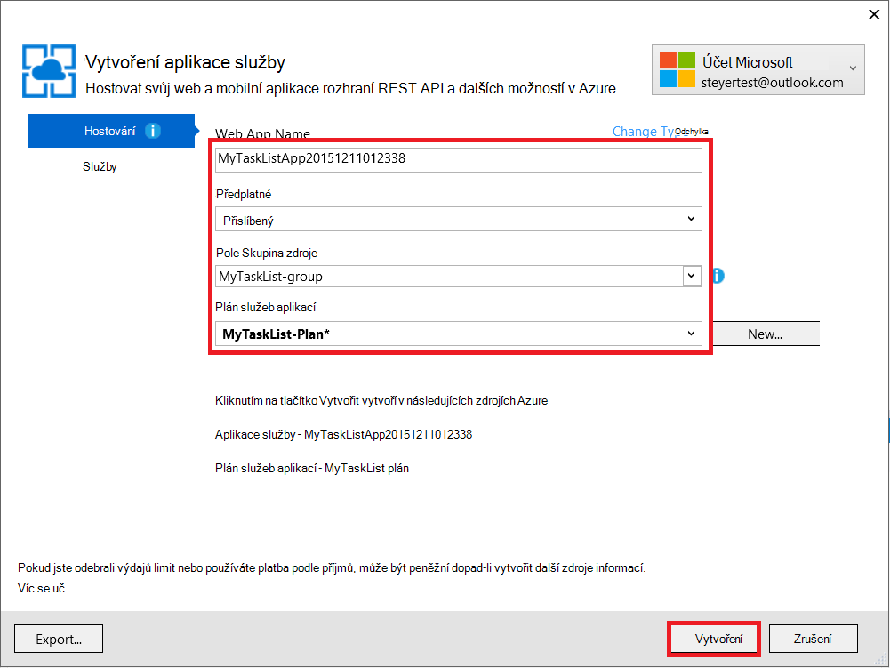
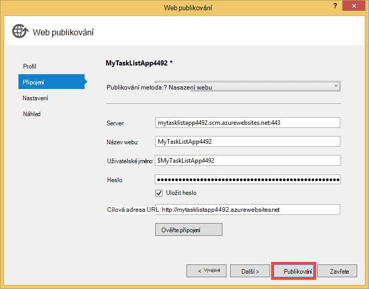

<properties 
    pageTitle="Vytvoření webové aplikace v Azure, který se připojuje k MongoDB spuštěné v počítači virtuální" 
    description="Kurz se naučíte nasadit aplikaci ASP.NET aplikaci služby Azure pomocí libovolná připojení k MongoDB na Azure virtuálního počítače."
    tags="azure-portal" 
    services="app-service\web, virtual-machines" 
    documentationCenter=".net" 
    authors="cephalin" 
    manager="wpickett" 
    editor=""/>

<tags 
    ms.service="app-service-web" 
    ms.workload="web" 
    ms.tgt_pltfrm="na" 
    ms.devlang="dotnet" 
    ms.topic="article" 
    ms.date="02/29/2016" 
    ms.author="cephalin"/>

# Vytvoření webové aplikace v Azure, který se připojuje k MongoDB spuštěné v počítači virtuální

Libovolná můžete nasadit aplikaci ASP.NET Azure aplikace služby Web Apps. V tomto kurzu vytvoříte jednoduché front-end ASP.NET MVC úkolu seznamu aplikace, která se připojí k databázi MongoDB spuštěné v počítači virtuální v Azure.  [MongoDB] [ MongoDB] je Oblíbené otevřít zdroj, vysoký výkon NoSQL databáze. Po spuštění a testování ASP.NET aplikace v počítači vývoj, bude nahrát aplikaci pro aplikaci služby webových aplikací Web Apps pomocí libovolná.

>[AZURE.NOTE] Pokud chcete začít pracovat s aplikaci služby Azure před registrací účet Azure, přejděte na [Zkuste aplikaci služby](http://go.microsoft.com/fwlink/?LinkId=523751), které můžete okamžitě vytvořit web appu krátkodobý starter v aplikaci služby. Žádné povinné; kreditní karty žádné závazky.

## Knowledge pozadí ##

Znalost následující je užitečné pro účely tohoto návodu, ale nejsou nutné:

* C# ovladač MongoDB. Další informace o vývoji aplikací C# proti MongoDB naleznete v článku MongoDB [CSharp jazyk Centrum][MongoC#LangCenter]. 
* ASP .NET framework webové aplikace. Se dozvíte na [webu ASP.net][ASP.NET].
* Rozhraní ASP .NET webové aplikace MVC. Se dozvíte na [webu ASP.NET MVC][MVCWebSite].
* Azure. Mohli rovnou začít čtení v [Azure][WindowsAzure].

## Zjistit předpoklady pro ##

- [Visual Studio Express 2013 pro Web]  [ VSEWeb] nebo [Visual Studio 2013] [VSUlt]
- [Azure SDK pro .NET](http://go.microsoft.com/fwlink/p/?linkid=323510&clcid=0x409)
- Aktivní předplatné Microsoft Azure

[AZURE.INCLUDE [create-account-and-websites-note](../../includes/create-account-and-websites-note.md)]

 
## Vytvoření virtuálního počítače a nainstalujte MongoDB ##

Tento kurz předpokládá, že jste vytvořili virtuálního počítače v Azure. Po vytvoření virtuální počítač bude potřeba nainstalovat MongoDB na virtuálního počítače:

* Vytvoření virtuálního počítače Windows a nainstalovat MongoDB naleznete v tématu [Instalace MongoDB na počítač virtuální serverem Windows v Azure][InstallMongoOnWindowsVM].

Po vytvoření virtuálního počítače v Azure a nainstalovaný MongoDB nezapomeňte název DNS virtuálního počítače ("testlinuxvm.cloudapp.net", například) a externí port pro MongoDB, který jste zadali v koncový bod.  Budete potřebovat tyto informace dál v tomto kurzu.

## Vytvoření aplikace ##

V tomto oddílu vytvořit aplikaci ASP.NET s názvem "Můj seznam úkolů" pomocí aplikace Visual Studio a provést počáteční nasazení k Azure aplikace služby Web Apps. Spustí aplikaci místně, ale bude připojit k počítači virtuální na Azure a použijte MongoDB instanci, kterou jste vytvořili tam.

1. Ve Visual Studiu klikněte na **Nový projekt**.

    ![Zahájení nového projektu stránky][StartPageNewProject]

1. V okně **Nový projekt** v levém podokně vyberte **Visual Basic**a pak vyberte **Web**. V prostředním podokně vyberte **Webová aplikace ASP.NET**. V dolní název projektu "MyTaskListApp" a klikněte na **OK**.

    ![Dialogové okno Nový projekt][NewProjectMyTaskListApp]

1. V dialogovém okně **Nový projekt ASP.NET** vyberte **MVC**a potom klikněte na **OK**.

    ![Vyberte šablonu MVC][VS2013SelectMVCTemplate]

1. Pokud ještě nejste přihlášeni k Microsoft Azure, se zobrazí výzva k přihlášení. Postupujte podle pokynů a přihlaste se do Azure.
2. Jakmile se přihlásíte, můžete začít konfigurace webovou aplikaci aplikaci služby. Zadejte **název webové aplikace**, **plán služeb aplikací**, **Skupina zdroje**a **oblast**a pak klikněte na **vytvořit**.

    

1. Po projektu vytváření dokončí, počkejte pro web app byly vytvořeny v aplikaci služby Azure, jak je uvedeno v okně **Aktivitu aplikace služby Azure** . Potom klikněte na **Publikovat MyTaskListApp teď tento Web Appu**.

1. Klikněte na **Publikovat**.

    

    Po publikování aplikace ASP.NET výchozí k Azure aplikace služby Web Apps bude spuštěn v prohlížeči.

## Instalace ovladačů MongoDB C#

MongoDB nabízí podporu klientské aplikace C# prostřednictvím ovladač, který budete potřebovat k instalaci na svém počítači místní rozvoj. Ovladač C# je k dispozici prostřednictvím NuGet.

Instalace ovladačů MongoDB C#:

1. V **Okně Průzkumník**projektu **MyTaskListApp** pravým tlačítkem vyberte **Spravovat NuGetPackages**.

    ![Správa NuGet balíčků][VS2013ManageNuGetPackages]

2. V okně **Spravovat balíčků NuGet** v levém podokně klikněte na tlačítko **Online**. Do pole **Hledání Online** na pravé straně zadejte "mongodb.driver".  Klikněte na **nainstalovat** a nainstalujte ovladači.

    ![Vyhledat MongoDB C# ovladač][SearchforMongoDBCSharpDriver]

3. Klikněte na **mám přijmout** přijmout 10gen, Inc. licenční podmínky.

4. Po instalaci ovladač, klikněte na **Zavřít** .
    ![MongoDB C# ovladač nainstalován][MongoDBCsharpDriverInstalled]

Teď je nainstalován ovladač MongoDB C#.  Odkazy na knihoven **MongoDB.Bson** **MongoDB.Driver**a **MongoDB.Driver.Core** přidané do projektu.

![MongoDB C# ovladač odkazy][MongoDBCSharpDriverReferences]

## Přidání modelu ##
V **Okně Průzkumník**po kliknutí pravým tlačítkem složku *modely* **Přidat** novou **předmětu** a nazvěte ji *TaskModel.cs*.  V *TaskModel.cs*nahraďte stávající kód následující kód:

    using System;
    using System.Collections.Generic;
    using System.Linq;
    using System.Web;
    using MongoDB.Bson.Serialization.Attributes;
    using MongoDB.Bson.Serialization.IdGenerators;
    using MongoDB.Bson;
    
    namespace MyTaskListApp.Models
    {
        public class MyTask
        {
            [BsonId(IdGenerator = typeof(CombGuidGenerator))]
            public Guid Id { get; set; }
    
            [BsonElement("Name")]
            public string Name { get; set; }
    
            [BsonElement("Category")]
            public string Category { get; set; }
    
            [BsonElement("Date")]
            public DateTime Date { get; set; }
    
            [BsonElement("CreatedDate")]
            public DateTime CreatedDate { get; set; }
    
        }
    }

## Přidání vrstvy přístupu k datům ##
V **Okně Průzkumník řešení**klikněte pravým tlačítkem myši *MyTaskListApp* projektu a **Přidat** do **Nové složky** nazvané *DAL*.  Po kliknutí pravým tlačítkem složku *DAL* **Přidat** novou **předmětu**. Název souboru třídy *Dal.cs*.  V *Dal.cs*nahraďte stávající kód následující kód:

    using System;
    using System.Collections.Generic;
    using System.Linq;
    using System.Web;
    using MyTaskListApp.Models;
    using MongoDB.Driver;
    using MongoDB.Bson;
    using System.Configuration;
    
    
    namespace MyTaskListApp
    {
        public class Dal : IDisposable
        {
            private MongoServer mongoServer = null;
            private bool disposed = false;
    
            // To do: update the connection string with the DNS name
            // or IP address of your server. 
            //For example, "mongodb://testlinux.cloudapp.net"
            private string connectionString = "mongodb://mongodbsrv20151211.cloudapp.net";
    
            // This sample uses a database named "Tasks" and a 
            //collection named "TasksList".  The database and collection 
            //will be automatically created if they don't already exist.
            private string dbName = "Tasks";
            private string collectionName = "TasksList";
    
            // Default constructor.        
            public Dal()
            {
            }
    
            // Gets all Task items from the MongoDB server.        
            public List<MyTask> GetAllTasks()
            {
                try
                {
                    var collection = GetTasksCollection();
                    return collection.Find(new BsonDocument()).ToList();
                }
                catch (MongoConnectionException)
                {
                    return new List<MyTask>();
                }
            }
    
            // Creates a Task and inserts it into the collection in MongoDB.
            public void CreateTask(MyTask task)
            {
                var collection = GetTasksCollectionForEdit();
                try
                {
                    collection.InsertOne(task);
                }
                catch (MongoCommandException ex)
                {
                    string msg = ex.Message;
                }
            }
    
            private IMongoCollection<MyTask> GetTasksCollection()
            {
                MongoClient client = new MongoClient(connectionString);
                var database = client.GetDatabase(dbName);
                var todoTaskCollection = database.GetCollection<MyTask>(collectionName);
                return todoTaskCollection;
            }
    
            private IMongoCollection<MyTask> GetTasksCollectionForEdit()
            {
                MongoClient client = new MongoClient(connectionString);
                var database = client.GetDatabase(dbName);
                var todoTaskCollection = database.GetCollection<MyTask>(collectionName);
                return todoTaskCollection;
            }
    
            # region IDisposable
    
            public void Dispose()
            {
                this.Dispose(true);
                GC.SuppressFinalize(this);
            }
    
            protected virtual void Dispose(bool disposing)
            {
                if (!this.disposed)
                {
                    if (disposing)
                    {
                        if (mongoServer != null)
                        {
                            this.mongoServer.Disconnect();
                        }
                    }
                }
    
                this.disposed = true;
            }
    
            # endregion
        }
    }

## Přidání řadiče ##
Otevřete soubor *Controllers\HomeController.cs* v **Okně Průzkumník** a nahraďte stávající kód takto:

    using System;
    using System.Collections.Generic;
    using System.Linq;
    using System.Web;
    using System.Web.Mvc;
    using MyTaskListApp.Models;
    using System.Configuration;
    
    namespace MyTaskListApp.Controllers
    {
        public class HomeController : Controller, IDisposable
        {
            private Dal dal = new Dal();
            private bool disposed = false;
            //
            // GET: /MyTask/
    
            public ActionResult Index()
            {
                return View(dal.GetAllTasks());
            }
    
            //
            // GET: /MyTask/Create
    
            public ActionResult Create()
            {
                return View();
            }
    
            //
            // POST: /MyTask/Create
    
            [HttpPost]
            public ActionResult Create(MyTask task)
            {
                try
                {
                    dal.CreateTask(task);
                    return RedirectToAction("Index");
                }
                catch
                {
                    return View();
                }
            }
    
            public ActionResult About()
            {
                return View();
            }
    
            # region IDisposable
    
            new protected void Dispose()
            {
                this.Dispose(true);
                GC.SuppressFinalize(this);
            }
    
            new protected virtual void Dispose(bool disposing)
            {
                if (!this.disposed)
                {
                    if (disposing)
                    {
                        this.dal.Dispose();
                    }
                }
    
                this.disposed = true;
            }
    
            # endregion
    
        }
    }

## Nastavení styly ##
Pokud chcete změnit název v horní části stránky, Otevřít *Views\Shared\\_Layout.cshtml* souborů v **Průzkumníku řešení** a nahradit "Název aplikace" v záhlaví navigační panel "Můj úkol seznam aplikací" takže vypadá takto:

    @Html.ActionLink("My Task List Application", "Index", "Home", null, new { @class = "navbar-brand" })

Pokud chcete nastavit nabídce seznam úkolů, otevřete soubor *\Views\Home\Index.cshtml* a nahraďte stávající kód následující kód:
    
    @model IEnumerable<MyTaskListApp.Models.MyTask>
    
    @{
        ViewBag.Title = "My Task List";
    }
    
    <h2>My Task List</h2>
    
    <table border="1">
        <tr>
            <th>Task</th>
            <th>Category</th>
            <th>Date</th>
            
        </tr>
    
    @foreach (var item in Model) {
        <tr>
            <td>
                @Html.DisplayFor(modelItem => item.Name)
            </td>
            <td>
                @Html.DisplayFor(modelItem => item.Category)
            </td>
            <td>
                @Html.DisplayFor(modelItem => item.Date)
            </td>
            
        </tr>
    }
    
    </table>
    
  @Html.Partial("Create", new MyTaskListApp.Models.MyTask())

Pokud chcete přidat možnost vytvořit nový úkol, klikněte pravým tlačítkem myši *Views\Home\\ * složku a **Přidat** **zobrazení**.  Zadejte název zobrazení *vytvořit*. Nahraďte kód takto:

    @model MyTaskListApp.Models.MyTask
    
    
    
    
    
    @using (Html.BeginForm("Create", "Home")) {
        @Html.ValidationSummary(true)
        <fieldset>
            <legend>New Task</legend>
    
            

                @Html.LabelFor(model => model.Name)
            

            

                @Html.EditorFor(model => model.Name)
                @Html.ValidationMessageFor(model => model.Name)
            

    
            

                @Html.LabelFor(model => model.Category)
            

            

                @Html.EditorFor(model => model.Category)
                @Html.ValidationMessageFor(model => model.Category)
            

    
            

                @Html.LabelFor(model => model.Date)
            

            

                @Html.EditorFor(model => model.Date)
                @Html.ValidationMessageFor(model => model.Date)
            

    
            

                <input type="submit" value="Create" />
            

        </fieldset>
    }

**Průzkumník řešení** by měl vypadat takto:

![Průzkumník řešení][SolutionExplorerMyTaskListApp]

## Nastavení MongoDB připojovacího řetězce ##
V **Okně Průzkumník**otevřete soubor *DAL/Dal.cs* . Jak najdete na následující řádek kódu:

    private string connectionString = "mongodb://<vm-dns-name>";

Nahrazení `<vm-dns-name>` s názvem DNS počítač virtuální MongoDB jste vytvořili v kroku [vytvořit virtuální počítač a nainstalovat MongoDB][] tohoto kurzu.  Najděte název DNS virtuálního počítače, přejděte na portál Azure, vyberte **virtuálních počítačích**a najděte **Název DNS**.

Pokud je v poli Název DNS virtuálního počítače "testlinuxvm.cloudapp.net" a MongoDB sleduje na výchozí port 27017, bude vypadat řádku připojení řetězec kódu:

    private string connectionString = "mongodb://testlinuxvm.cloudapp.net";

Pokud koncový bod virtuálního počítače určuje jiný externí port pro MongoDB, můžete zkusit zadejte port v připojovacím řetězci:

    private string connectionString = "mongodb://testlinuxvm.cloudapp.net:12345";

Další informace o MongoDB připojovací řetězec, najdete v článku [připojení][MongoConnectionStrings].

## Testování místní nasazení ##

Ke spuštění aplikace v počítači vývoj, zvolte **Spustit ladění** z nabídky **ladění** nebo přístupů **F5**. Služby IIS Express spustí a otevře se prohlížeč a otevře na domovskou stránku aplikace.  Můžete přidat nový úkol, který bude přidán do databáze MongoDB spuštěné v počítači virtuální v Azure.

![Moje aplikace seznam úkolů][TaskListAppBlank]

## Publikování na Azure služba aplikací Web Apps

V této části publikujete změny k Azure aplikace služby Web Apps.

1. V Průzkumníku **MyTaskListApp** znovu pravým tlačítkem klikněte na **Publikovat**.
2. Klikněte na **Publikovat**.

    Teď byste měli vidět webové aplikace spuštěné v aplikaci služby Azure a přístup k databázi MongoDB v Azure virtuálních počítačích.

## Souhrn ##

Teď úspěšně nasazení aplikace ASP.NET k Azure aplikace služby Web Apps. Chcete-li zobrazit web appu:

1. Přihlaste se k portálu Azure.
2. Klikněte na **Web apps**. 
3. Vyberte webovou aplikaci v seznamu **Aplikací Web Apps** .

Další informace o vývoji aplikací C# proti MongoDB naleznete v článku [CSharp jazyk Center][MongoC#LangCenter]. 

[AZURE.INCLUDE [app-service-web-whats-changed](../../includes/app-service-web-whats-changed.md)]
 

<!-- HYPERLINKS -->

[AzurePortal]: http://manage.windowsazure.com
[WindowsAzure]: http://www.windowsazure.com
[MongoC#LangCenter]: http://docs.mongodb.org/ecosystem/drivers/csharp/
[MVCWebSite]: http://www.asp.net/mvc
[ASP.NET]: http://www.asp.net/
[MongoConnectionStrings]: http://www.mongodb.org/display/DOCS/Connections
[MongoDB]: http://www.mongodb.org
[InstallMongoOnWindowsVM]: ../virtual-machines/virtual-machines-windows-classic-install-mongodb.md
[VSEWeb]: http://www.microsoft.com/visualstudio/eng/2013-downloads#d-2013-express
[VSUlt]: http://www.microsoft.com/visualstudio/eng/2013-downloads

<!-- IMAGES -->

[StartPageNewProject]: ./media/web-sites-dotnet-store-data-mongodb-vm/NewProject.png
[NewProjectMyTaskListApp]: ./media/web-sites-dotnet-store-data-mongodb-vm/NewProjectMyTaskListApp.png
[VS2013SelectMVCTemplate]: ./media/web-sites-dotnet-store-data-mongodb-vm/VS2013SelectMVCTemplate.png
[VS2013DefaultMVCApplication]: ./media/web-sites-dotnet-store-data-mongodb-vm/VS2013DefaultMVCApplication.png
[VS2013ManageNuGetPackages]: ./media/web-sites-dotnet-store-data-mongodb-vm/VS2013ManageNuGetPackages.png
[SearchforMongoDBCSharpDriver]: ./media/web-sites-dotnet-store-data-mongodb-vm/SearchforMongoDBCSharpDriver.png
[MongoDBCsharpDriverInstalled]: ./media/web-sites-dotnet-store-data-mongodb-vm/MongoDBCsharpDriverInstalled.png
[MongoDBCSharpDriverReferences]: ./media/web-sites-dotnet-store-data-mongodb-vm/MongoDBCSharpDriverReferences.png
[SolutionExplorerMyTaskListApp]: ./media/web-sites-dotnet-store-data-mongodb-vm/SolutionExplorerMyTaskListApp.png
[TaskListAppBlank]: ./media/web-sites-dotnet-store-data-mongodb-vm/TaskListAppBlank.png
[WAWSCreateWebSite]: ./media/web-sites-dotnet-store-data-mongodb-vm/WAWSCreateWebSite.png
[WAWSDashboardMyTaskListApp]: ./media/web-sites-dotnet-store-data-mongodb-vm/WAWSDashboardMyTaskListApp.png
[Image9]: ./media/web-sites-dotnet-store-data-mongodb-vm/RepoReady.png
[Image10]: ./media/web-sites-dotnet-store-data-mongodb-vm/GitInstructions.png
[Image11]: ./media/web-sites-dotnet-store-data-mongodb-vm/GitDeploymentComplete.png

<!-- TOC BOOKMARKS -->
[Vytvoření virtuálního počítače a nainstalujte MongoDB]: #virtualmachine
[Create and run the My Task List ASP.NET application on your development computer]: #createapp
[Create an Azure web site]: #createwebsite
[Deploy the ASP.NET application to the web site using Git]: #deployapp
 