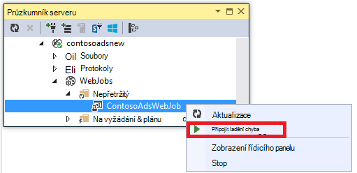
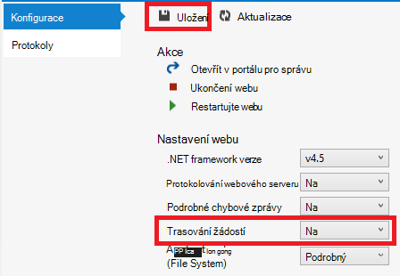

<properties 
    pageTitle="Poradce při potížích s web app v aplikaci služby Azure pomocí aplikace Visual Studio" 
    description="Zjistěte, jak řešit problémy s Azure webovou aplikaci pomocí vzdálené ladění, sledování a nástroje protokolování, které jsou součástí aplikace Visual Studio 2013." 
    services="app-service" 
    documentationCenter=".net" 
    authors="tdykstra" 
    manager="wpickett" 
    editor=""/>

<tags 
    ms.service="app-service" 
    ms.workload="na" 
    ms.tgt_pltfrm="na" 
    ms.devlang="dotnet" 
    ms.topic="article" 
    ms.date="08/29/2016" 
    ms.author="rachelap"/>

# Poradce při potížích s web app v aplikaci služby Azure pomocí aplikace Visual Studio

## Základní informace

Tento kurz ukazuje, jak používat nástroje Visual Studiu, které pomáhají ladění do webových aplikací v [Aplikaci služby](http://go.microsoft.com/fwlink/?LinkId=529714)spuštěním [režim ladění](http://www.visualstudio.com/get-started/debug-your-app-vs.aspx) vzdáleně nebo zobrazením protokoly aplikací a webový server.

[AZURE.INCLUDE [app-service-web-to-api-and-mobile](../../includes/app-service-web-to-api-and-mobile.md)]

Se dozvíte:

* Které funkce správy Azure webové aplikace jsou dostupné ve Visual Studiu.
* Jak používat zobrazení vzdálený Visual Studio rychlé změny ve vzdáleném web appu.
* Jak spustit režim ladění vzdáleně při projektu běží Azure, jak pro web app a WebJob.
* Jak vytvořit protokoly aplikace sledování a zobrazení průběhu aplikace vytváří je.
* Zobrazení protokolů webového serveru, včetně podrobných chybových zpráv a se nepodařilo žádost o trasování.
* Jak odeslat diagnostické protokoly k úložišti Azure účet a zobrazit je.

Pokud máte Visual Studio Ultimate, můžete také [IntelliTrace](http://msdn.microsoft.com/library/vstudio/dd264915.aspx) pro ladění. IntelliTrace není uvedené v tomto kurzu.

## Zjistit předpoklady pro

Tento kurz spolupracuje vývojové prostředí, web projektu a Azure v prohlížeči, který jste vytvořili v [Začínáme s Azure a ASP.NET][GetStarted]. Pro WebJobs oddíly, budete potřebovat aplikaci, kterou vytvoříte v [Začít pracovat s Azure WebJobs SDK][GetStartedWJ].

Ukázky zobrazené v tomto kurzu jsou pro webovou aplikaci C# MVC, ale Poradce při potížích postup je stejný pro aplikace Visual Basic a webového formuláře.

Kurz předpokládá, že používáte Visual Studio 2015 nebo 2013. Pokud používáte Visual Studio 2013, funkce WebJobs vyžadují [aktualizaci 4](http://go.microsoft.com/fwlink/?LinkID=510314) nebo novější. 

Streamování protokoly funkce jenom pro aplikace zaměřených .NET Framework 4 nebo novější.

## Správa a konfigurace webové aplikace

Visual Studio poskytuje přístup k podmnožiny webové aplikace správy funkce a nastavení k dispozici v [Portálu Azure](http://go.microsoft.com/fwlink/?LinkId=529715). V této části uvidíte, jaké máte možnosti pomocí **Průzkumníka serveru**. Chcete-li zobrazit nejnovější funkce Azure integrace vyzkoušíte **Cloudu Explorer** taky. Otevřete oba windows v nabídce **Zobrazit** . 

1. Pokud jste ještě nejste přihlášeni k Azure ve Visual Studiu, klikněte na tlačítko **připojit k Azure** v **Průzkumníku serveru**.

    Další možností je nainstalovat certifikát správy, která umožňují přístup ke svému účtu. Pokud se rozhodnete nainstalovat certifikát, klikněte pravým tlačítkem myši na uzel **Azure** v **Průzkumníku serveru**a v místní nabídce klikněte na **Spravovat a filtr předplatná** . V dialogovém okně **Spravovat Azure předplatná** klikněte na kartu **certifikáty** a potom klikněte na **importovat**. Postupujte podle pokynů ke stažení a importujte soubor předplatného (nazývané také souboru *.publishsettings* ) pro váš účet Azure.

    > [AZURE.NOTE]
    > Při stahování souboru předplatného, uložte ho do složky mimo vaší zdrojové kód adresáře (například ve složce Downloads) a potom ho odstraňte po dokončení importu. Zlými úmysly, který získá přístup k souboru předplatného můžete upravit, vytvořit a odstranit služby Azure.

    Další informace o připojení k Azure zdrojů z aplikace Visual Studio najdete v tématu [Správa účtů, předplatná a správní role](http://go.microsoft.com/fwlink/?LinkId=324796#BKMK_AccountVCert).

2. V **Průzkumníku serveru**rozbalte **Azure** a rozbalte položku **Aplikaci služby**.

3. Rozbalení skupiny zdrojů, který obsahuje webovou aplikaci, kterou jste vytvořili [Začínáme s Azure a ASP.NET][GetStarted], klikněte pravým tlačítkem myši web app a klikněte na **Nastavení zobrazení**.

    

    Zobrazí se karta **Azure v prohlížeči** , a zobrazí se tam web app Správa a konfigurace úkoly, které jsou k dispozici ve Visual Studiu.

    

    V tomto kurzu budete používat protokolování a sledování rozevírací seznamy. Použijete i vzdálené ladění, ale k tomu budete používat jinou metodu.
   
    Informace o polích připojení řetězce a nastavení aplikace v tomto okně najdete v tématu [Azure Web Apps: jak řetězce aplikace a připojení řetězce práce](http://blogs.msdn.com/b/windowsazure/archive/2013/07/17/windows-azure-web-sites-how-application-strings-and-connection-strings-work.aspx).

    Pokud chcete provést úkol správy web app nelze provést v tomto okně, klikněte na **Otevřít v portálu pro správu** a otevřete okno prohlížeče na portál Azure.

## Přístup k souborům web app v Průzkumníku serveru

Obvykle nasadit web projektu se `customErrors` příznaku v nastavení(Web.config)) nastavit `On` nebo `RemoteOnly`, což znamená, že nedostáváte užitečné chybová zpráva, když něco dojde k chybě. Pro mnoho chyb, který jste dostali, stačí na stránku jako jednu z následujících akcí z nich.

**Chyba serveru "/" aplikace:**

**Došlo k chybě:**

**Na webu nemůže zobrazit stránky**

Nejjednodušší způsob, jak najít příčiny chyby je často povolit podrobné chybové zprávy, které první předchozí snímky obrazovek vysvětluje, jak dělat. Vyžadující ke změně nasazeném nastavení(Web.config)). Můžete upravit *nastavení(Web.config)) v projektu* a přeinstalujte projektu, nebo vytvořit [Web.config transformace](http://www.asp.net/mvc/tutorials/deployment/visual-studio-web-deployment/web-config-transformations) a nasazení sestavení ladění, ale je rychlejší způsob: v **Okně Průzkumník** můžete přímo prohlížet a upravovat soubory ve vzdáleném web appu pomocí funkce *vzdálené zobrazení* .

1. V **Průzkumníku serveru**rozbalte **Azure**, rozbalte **Aplikaci služby**, rozbalte skupinu, do zdroje umístěné ve web appu a potom rozbalte uzel pro web app.

    Zobrazí uzlů, které umožňují přístup k obsahu soubory a soubory protokolu web appu.

2. Rozbalte uzel **soubory** a poklepáním *nastavení(Web.config))* .

    

    Visual Studio otevře nastavení(Web.config)) ze vzdáleného web appu a zobrazená [vzdáleného] vedle názvu souboru v záhlaví.

3. Přidejte následující řádek `system.web` prvek:

    `<customErrors mode="Off"></customErrors>`

    

4. Aktualizujte prohlížeč, který je zobrazený neužitečné chybová zpráva a teď zobrazí podrobné chybová zpráva, například v následujícím příkladu:

    

    (Chyba vidět vytvořil přidání řádku zobrazené v červené barvě *Views\Home\Index.cshtml*.)

Úprava nastavení(Web.config)) je pouze příkladem scénáře, ve kterých možnost číst a upravovat soubory na Azure webovou aplikaci zkontrolujte při odstraňování problémů.

## Vzdálené ladění webových aplikací web apps

Pokud podrobnou chybovou zprávu nenabízí možnost dost informací a nelze znovu vytvořit chyby do schránky místně, je jiný způsob, jak řešit problémy s spustit v režimu ladění vzdáleně. Můžete nastavit zarážky, zpracovávají paměti přímo, přecházet mezi kód a dokonce měnit cestě kódu. 

Vzdálené ladění nefunguje v edicích Express aplikace Visual Studio.

Tato část popisuje ladění vzdáleně používat project vytvoříte v [Začínáme s Azure a ASP.NET][GetStarted].

1. Otevřete webový projekt, který jste vytvořili v [Začínáme s Azure a ASP.NET][GetStarted].

1. Otevřete *Controllers\HomeController.cs*.

2. Odstranění `About()` metoda a vložte následující kód v jeho umístění.

        public ActionResult About()
        {
            string currentTime = DateTime.Now.ToLongTimeString();
            ViewBag.Message = "The current time is " + currentTime;
            return View();
        }

2. [Nastavení zarážky](http://www.visualstudio.com/get-started/debug-your-app-vs.aspx) `ViewBag.Message` řádku.

1. V **Okně Průzkumník**projektu klikněte pravým tlačítkem myši a klikněte na **Publikovat**.

2. V rozevíracím seznamu **profil** vyberte stejný jako profil, který jste použili v [Začínáme s Azure a ASP.NET][GetStarted].

3. Klikněte na kartu **Nastavení** a změňte **konfiguraci** **ladění**a potom klikněte na **Publikovat**.

    

4. Po zavedení dokončení a prohlížeči se otevře Azure adresu URL webové aplikace, zavřete prohlížeč.

5. V **Průzkumníku serveru**klikněte pravým tlačítkem webovou aplikaci a potom klikněte na **Připojit ladění**. 

    

    Na domovskou stránku spuštěné v Azure automaticky otevře v prohlížeči. Možná budete muset počkejte 20 sekund, aby Azure slouží k nastavení serveru pro ladění. Toto zpoždění pouze se stane při prvním spuštění v režimu ladění na web appu. Další časy další 48 hodin při spuštění ladění znovu tam nebude zpoždění.

    **Poznámka:** Pokud máte jakékoli potíže při spuštění ladění, zkuste to udělat pomocí **Průzkumníka cloudu** místo **Průzkumník serveru**.

6. Klikněte na **informace o** v nabídce.

    Visual Studio zastaví na zarážku a kód běží v Azure, není ve vašem počítači.

7. Najeďte myší `currentTime` proměnné zobrazíte časovou hodnotu.

    

    O čase, který se zobrazí je údaj o čase Azure serveru, který může být v různých časové pásmo než místního počítače.

8. Zadejte novou hodnotu `currentTime` proměnná, například "Nyní spuštěny v Azure".

5. Stisknutím klávesy F5 pokračovat v práci.

    Na stránce o aplikaci Azure zobrazí nové hodnoty, které jste zadali do proměnné aktualnicas.

    

## Vzdálené ladění WebJobs

Tato část popisuje ladění vzdáleně v aplikaci project a web vytvořenou v [Začít pracovat s Azure WebJobs SDK](websites-dotnet-webjobs-sdk.md). 

Funkce uvedeno v této části jsou k dispozici pouze v aplikaci Visual Studio 2013 s aktualizacemi 4 nebo novější. 

Vzdálené ladění funguje jenom s nepřetržitý WebJobs. Plánované a na vyžádání WebJobs nepodporují ladění.

1. Otevřete webový projekt, který jste vytvořili v [Začít pracovat s Azure WebJobs SDK][GetStartedWJ].

1. V projectu ContosoAdsWebJob otevřete *Functions.cs*.

2. Na první použití příkazu v [Nastavení zarážky](http://www.visualstudio.com/get-started/debug-your-app-vs.aspx) `GnerateThumbnail` metody.

    

1. V **Okně Průzkumník řešení**klikněte pravým tlačítkem na web projektu (ne project WebJob) a klikněte na **Publikovat**.

2. V rozevíracím seznamu **profil** vyberte stejný jako profil, který jste použili v [Začít pracovat s Azure WebJobs SDK](websites-dotnet-webjobs-sdk.md).

3. Klikněte na kartu **Nastavení** a změňte **konfiguraci** **ladění**a potom klikněte na **Publikovat**.

    Visual Studio nasadí web a WebJob projekty a prohlížeči se otevře Azure adresu URL webové aplikace.

5. V okně **Průzkumník Server** rozbalte **Azure > aplikaci služby > Skupina zdroje > webovou aplikaci > WebJobs > spojitým**a potom klikněte pravým tlačítkem myši **ContosoAdsWebJob**.

7. Klikněte na tlačítko **Připojit ladění**. 

    

    Na domovskou stránku spuštěné v Azure automaticky otevře v prohlížeči. Možná budete muset počkejte 20 sekund, aby Azure slouží k nastavení serveru pro ladění. Toto zpoždění pouze se stane při prvním spuštění v režimu ladění na web appu. Při příštím připojení ladění tam nebude zpoždění, když uděláte 48 hodin.

6. Ve webovém prohlížeči, který se otevře domovskou stránku služby Active Directory společnosti Contoso vytvořte nový ad. 

    Vytváření ad způsobí, že fronty zprávu vytvořili, který bude převzít tak, že WebJob a zpracování. Když WebJobs SDK volá funkce fronty zprávu zpracovat, kód zavolá vaše zarážka.

7. Když ladění rozděleno na vaše zarážka, můžete prozkoumat a změnit proměnnými hodnotami program je spuštěná v cloudu. Na následujícím obrázku je znázorněn ladění obsah blobInfo objekt, který byl předán metodu GenerateThumbnail.

    
 
5. Stisknutím klávesy F5 pokračovat v práci.

    Metoda GenerateThumbnail dokončí, vytváření miniatury.

6. V prohlížeči aktualizujte stránku rejstřík a uvidíte miniaturu.

6. Ve Visual Studiu stisknutím kombinace kláves SHIFT + F5 zastavení ladění.

7. V **Průzkumníku serveru**klikněte pravým tlačítkem myši na uzel ContosoAdsWebJob a klikněte na **Řídicí panel zobrazení**.

8. Přihlaste se pomocí svých přihlašovacích údajů Azure a potom klikněte na název WebJob přejdete na stránku pro vaše WebJob. 

    

    Řídicí panel, který zobrazuje použití funkce GenerateThumbnail spouštět naposledy.

    (Při příštím klikněte na **Řídicí panel zobrazení**nebudete muset přihlásit a prohlížeči přejde přímo na stránku pro vaše WebJob.)

9. Klikněte na název funkce Zobrazit podrobné informace o spuštění (funkce).

    

Pokud vaše funkce [napsali protokoly](websites-dotnet-webjobs-sdk-storage-queues-how-to.md#logs), může kliknete **ToggleOutput** neuvidíte.

## Poznámky k vzdálené ladění

* V režimu ladění ve výrobním se nedoporučuje. Pokud webovou aplikaci výrobní není zachován se k několika instancích spuštěných serveru, ladění zabrání webového serveru reagovat na další žádosti. Pokud máte více instancí webového serveru, připojíte k ladění dostanete náhodné instance a máte způsob, jak zajistit, že požadavky na pozdější prohlížeče budou přesměrovány na vybraný výskyt. Také obvykle není nasazení sestavení ladění výrobní a optimalizace kompilátoru pro verzi sestavení může znemožňují zobrazit řádek po řádku co je nového ve zdrojovém kódu. Pro řešení problémů s výrobní, je nejlepší zdroj aplikace trasování a webového serveru protokoly.

* Vyhněte se dlouhé zarážkami na zarážky při vzdáleném ladění. Azure zpracuje proces, který je zastaveno po dobu delší než několik minut jako reagovat proces a vypne ho.

* Při ladění, serveru odesílá Visual Studiu, které by mohly ovlivnit pásma poplatky data. Informace o sazby šířky pásma najdete v článku [Ceny Azure](/pricing/calculator/).

* Ujistěte se, že `debug` atribut `compilation` prvek *nastavení(Web.config))* nastaveno true (pravda). Je nastavena na true ve výchozím nastavení při publikování konfiguraci sestavení ladění.

        <system.web>
          <compilation debug="true" targetFramework="4.5" />
          <httpRuntime targetFramework="4.5" />
        </system.web>

* Pokud zjistíte, že nebude ladění kroku do kódu, který chcete ladění, pravděpodobně změňte nastavení pouze můj kód.  Další informace najdete v tématu [omezit krokování pouze můj kód](http://msdn.microsoft.com/library/vstudio/y740d9d3.aspx#BKMK_Restrict_stepping_to_Just_My_Code).

* Časovač spustí na serveru povolit funkci vzdálené ladění a po 48 hodin funkci se automaticky vypnou a zůstanou vypnuté. Toto omezení 48 hodin se provádí z důvodů zabezpečení a výkonu. Můžete snadno zapnout funkci zpět jako kolikrát chcete. Doporučujeme, ale necháte je vypnutá, když nejsou aktivně ladění.

* Ladění můžete ručně připojit k libovolnému procesu, nejen webové aplikace procesu (w3wp.exe). Další informace o použití režimu ladění ve Visual Studiu najdete v článku [ladění ve Visual Studiu](http://msdn.microsoft.com/library/vstudio/sc65sadd.aspx).

## Přehled protokoly pro diagnostiku

ASP.NET aplikace, které se spouští v Azure webovou aplikaci můžete vytvořit následující typy protokolů:

* **Protokoly sledování aplikací** 
  Aplikace vytvoří tyto protokoly tak, že zavoláte metody třídy [System.Diagnostics.Trace](http://msdn.microsoft.com/library/system.diagnostics.trace.aspx) .
* **Webový server protokoly** 
  Webový server vytvoří položku protokolu pro každý požadavek protokolu HTTP na web appu.
* **Protokoly podrobné chybové zprávy** 
  Webový server vytvoří stránku HTML s některé další informace o nezdařeném uložení požadavků HTTP (ty, jejichž výsledkem je stavový kód 400 nebo vyšší). 
* **Nepodařilo protokoly žádost o sledování** 
  Webový server vytvoří soubor XML s podrobného trasování informace o nezdařeném uložení požadavků HTTP. Webový server také poskytuje soubor XSL formátovat XML v prohlížeči.
  
Protokolování ovlivňuje výkon webové aplikace, takže Azure umožňuje povolit nebo zakázat každého typu protokolu podle potřeby. Pro protokoly aplikace můžete určit, že by se měly zapisovat jenom protokoly do určité míry závažnosti. Je vypnutá, když vytvoříte nový web app a ve výchozím nastavení protokolování povoleno.

Protokoly jsou aby došlo k zápisu soubory ve složce *LogFiles* v systému souborů svojí webové aplikace a jsou dostupné prostřednictvím protokolu FTP. Webový server protokoly a aplikací lze také zapsat s klientem úložišti Azure. Můžete zachovat větší množství protokoly účet úložiště, než je možné v systému souborů. Jste která maximálně 100 MB protokoly při použití systému souborů. (Soubor systémové protokoly jsou určeny pouze pro krátkodobých uchovávání informací. Azure odstraní původní protokoly uvolníte místo pro nové po dosažení mezní).  

## Vytvoření a zobrazení protokoly sledování aplikací

V této části můžete udělat následující úkoly:

* Přidání příkazů trasování web projektu, který jste vytvořili v [Začínáme s Azure a ASP.NET][GetStarted].
* Zobrazení protokolů místně spuštění projektu.
* Zobrazení protokolů vygenerovaný tak, že aplikace spuštěné v Azure. 

Informace o tom, jak vytvořit aplikaci protokoly do WebJobs, najdete v článku [jak pracovat s úložištěm fronty Azure pomocí WebJobs SDK – jak psát protokoly](websites-dotnet-webjobs-sdk-storage-queues-how-to.md#logs). Následující pokyny pro zobrazení protokolů a řízení, jak jsou uložené v Azure použít taky protokoly aplikace vytvořil WebJobs. 

### Přidejte trasování příkazy aplikace

1. Otevřete *Controllers\HomeController.cs*a nahradit `Index`, `About`, a `Contact` metody přidat následující kód `Trace` příkazy a `using` údajů pro `System.Diagnostics`:

        public ActionResult Index()
        {
            Trace.WriteLine("Entering Index method");
            ViewBag.Message = "Modify this template to jump-start your ASP.NET MVC application.";
            Trace.TraceInformation("Displaying the Index page at " + DateTime.Now.ToLongTimeString());
            Trace.WriteLine("Leaving Index method");
            return View();
        }
        
        public ActionResult About()
        {
            Trace.WriteLine("Entering About method");
            ViewBag.Message = "Your app description page.";
            Trace.TraceWarning("Transient error on the About page at " + DateTime.Now.ToShortTimeString());
            Trace.WriteLine("Leaving About method");
            return View();
        }
        
        public ActionResult Contact()
        {
            Trace.WriteLine("Entering Contact method");
            ViewBag.Message = "Your contact page.";
            Trace.TraceError("Fatal error on the Contact page at " + DateTime.Now.ToLongTimeString());
            Trace.WriteLine("Leaving Contact method");
            return View();
        }       

2. Přidat `using System.Diagnostics;` údajů do horní části souboru.
                
### Zobrazit výstup trasování místně

3. Stisknutím klávesy F5 spustit aplikaci v režimu ladění.

    Sledování posluchače výchozí zapíše všechny výstup trasování v okně **výstupu** , spolu s výstup ladění. Následující obrázek znázorňuje výstup sledování příkazy, které jste přidali `Index` metody.

    

    Podle těchto kroků ukazují, jak zobrazit výstup trasování na webové stránce bez kompilace v režimu ladění.

2. Otevřete aplikaci nastavení(Web.config)) (je umístěn ve složce projekt) a přidejte `<system.diagnostics>` prvků na konci souboru těsně před ukončením `</configuration>` prvek:

        <system.diagnostics>
            <trace>
              <listeners>
                <add name="WebPageTraceListener"
                    type="System.Web.WebPageTraceListener, 
                    System.Web, 
                    Version=4.0.0.0, 
                    Culture=neutral,
                    PublicKeyToken=b03f5f7f11d50a3a" />
              </listeners>
            </trace>
          </system.diagnostics>

    `WebPageTraceListener` Umožňuje zobrazení sledování výstup procházením `/trace.axd`.

3. Přidání <a href="http://msdn.microsoft.com/library/vstudio/6915t83k(v=vs.100).aspx">prvku trasování</a> v části `<system.web>` v nastavení(Web.config)), například v následujícím příkladu:

        <trace enabled="true" writeToDiagnosticsTrace="true" mostRecent="true" pageOutput="false" />

3. Stisknutím kláves CTRL + F5 spustit aplikaci.

4. Na panelu Adresa v okně prohlížeče přidat *trace.axd* na adresu URL a stiskněte klávesu Enter (adresa URL bude vypadat podobně jako http://localhost:53370/trace.axd).

5. Na stránce **Trasování aplikace** klikněte na **Zobrazit podrobnosti** na prvním řádku (nikoli řádek BrowserLink).

    

    Zobrazí se stránka **Podrobnosti o žádosti** a v části **Informace o sledování** se zobrazí výstup sledování příkazy, které jste přidali do `Index` metody.

    

    Ve výchozím nastavení `trace.axd` je k dispozici pouze místně. Pokud byste chtěli zpřístupnit pod vzdálené web appu, můžete přidat `localOnly="false"` k `trace` prvek *nastavení(Web.config)), jak je vidět v následujícím příkladu* :

        <trace enabled="true" writeToDiagnosticsTrace="true" localOnly="false" mostRecent="true" pageOutput="false" />

    Povolení však `trace.axd` ve výrobním v prohlížeči se obecně nedoporučuje, z bezpečnostních důvodů a v následujících částech uvidíte snadný způsob, jak číst protokoly trasování v Azure webovou aplikaci.

### Zobrazit výstup trasování v Azure

1. V **Okně Průzkumník**projektu webové pravým tlačítkem klikněte na **Publikovat**.

2. V dialogovém okně **Publikovat Web** klikněte na **Publikovat**.

    Po Visual Studio publikuje aktualizace, otevřete okno prohlížeče na domovskou stránku (za předpokladu, že **Cílovou adresu URL** neměli zrušte na kartě **připojení** ).

3. V **Průzkumníku serveru**klikněte pravým tlačítkem na váš web appu a vyberte **Zobrazit streamování protokoly**. 

    

    V okně **výstupu** zobrazuje připojeni k služba streamování protokolu a se přidá čára pro oznámení každou minutu jdoucí tak, že bez protokol zobrazíte.

    

4. V okně prohlížeče, které vidíte domovské stránky aplikace klikněte na **kontakt**.

    V rámci několik sekund, než jste přidali do trasování výstup úroveň chyb `Contact` metoda se zobrazí v okně **výstupu** .

    

    Visual Studio pouze zobrazuje úroveň chyb trasování protože je to výchozí nastavení, pokud povolíte protokol monitorování služeb. Při vytváření nové aplikace Azure web všechny protokolování standardně, jak jste viděli při dříve otevření na stránce nastavení:

    

    Však vybrán **Zobrazení datových proudů protokolů**Visual Studio automaticky změní **Aplikace Logging(File System)** **chyby**, což znamená, že se zobrazí chyba úroveň protokolování. Pokud chcete zobrazit všechny trasování protokoly, můžete toto nastavení změnit na **podrobné**. Když vyberete úroveň závažnosti nižší než chyby, vznikly také všechny protokoly pro vyšší úrovně závažnosti. Tak vyberete úplné, taky uvidíte informace, upozornění a protokolů chyb.  

4. V **Průzkumníku serveru**klikněte pravým tlačítkem myši v prohlížeči a klikněte na **Nastavení zobrazení** stejně jako při dříve.

5. Přejděte do **Aplikace protokolování (File System)** **podrobné**a pak klikněte na **Uložit**.
 
    

6. V okně prohlížeče, která se nyní zobrazí stránku **kontakt** klikněte na **Domů**a potom kliknout na **o produktu**a klepněte na **kontakt**.

    Několik sekund zobrazí v okně **výstupu** všech výstup trasování.

    

    V této části můžete povolit nebo zakázat protokolování nastaveními Azure web app. Můžete taky povolit a zakázat posluchače trasování změnou nastavení(Web.config)). Však úpravy nastavení(Web.config)) způsobí, že aplikace domény do koše, zatímco povolení protokolování přes web app konfigurace není to udělat. Pokud problém trvá moc dlouho reprodukovat, nebo dochází přerušovaně, recyklace domény aplikace může "Opravit" a vynutí Počkejte, až se to děje znovu. Povolení Diagnostika v Azure není to udělat, abyste mohli začít okamžitě zapsání informace o chybě.

### Funkce okně výstupu

Karta **Azure protokoly** okně **výstupu** obsahuje několik tlačítek a do textového pole:

Tyto provádět následující funkce:

* Zrušte zaškrtnutí políčka v okně **výstupu** .
* Povolení nebo zakázání zalamování řádků.
* Zahájení nebo ukončení sledování protokoly.
* Určete, které protokoly sledování.
* Stáhněte si protokoly.
* Protokoly na základě hledaný řetězec nebo regulárních výrazů filtru
* Zavřete okno **výstupu** .

Pokud chcete zadat hledaný řetězec nebo regulárních výrazů, Visual Studio filtruje informace o protokolování na straně klienta. To znamená, že po protokoly se zobrazují v okně **výstupu** a změnit kritéria filtru aniž byste museli obnovit protokoly můžete zadat kritéria.

## Zobrazení protokolů webového serveru

Webový server protokoly zaznamenání všech činnosti HTTP pro web app. Chcete-li zobrazit v okně **výstupu** , budete muset povolit pro web app a nástroji řekněte Visual Studio, které chcete sledovat. 

1. V **Azure webové aplikace konfigurace** kartu, kterou jste otevřeli z **Průzkumníka serveru**změňte protokolování na webový Server na **zapnuto**a klikněte na tlačítko **Uložit**.

    

2. V okně **výstupu** klikněte na tlačítko **Zadejte, které Azure protokoly sledování** .
    
    

3. V dialogovém okně **Možnosti protokolování Azure** vyberte **protokolů webového serveru**a klikněte na tlačítko **OK**.

    

4. V okně prohlížeče, zobrazující web appu klikněte na **Domů**a potom kliknout na **o produktu**a klepněte na **kontakt**.

    Protokoly aplikace obecně zobrazit jako první, následovaný protokolů webového serveru. Možná budete muset chvíli počkejte protokolů zobrazit. 

    

Ve výchozím nastavení při prvním zapnutí protokolů webového serveru pomocí aplikace Visual Studio Azure zapíše protokoly systému souborů. Jako alternativu můžete portálu Azure můžete určit, které by se měly zapisovat protokoly do kontejneru objektů blob v účtu úložiště webový server.

Pokud používáte portálu povolit protokolování s klientem Azure úložiště webový server a potom zakažte protokolování ve Visual Studiu, když znovu povolit protokolování ve Visual Studiu nastavení účtu úložiště obnoveny. 

## Zobrazení protokolů podrobné chybové zprávy

Podrobné chybové protokoly poskytují další informace o požadavcích HTTP, jejichž výsledkem je odpověď kódy chyb (400 nebo novější). Chcete-li zobrazit je v okně **výstupu** , musíte povolit pro web app a nástroji řekněte Visual Studio, které chcete sledovat.

1. V **Azure webové aplikace konfigurace** kartu, kterou jste otevřeli z **Průzkumníka serveru**změňte **Podrobné chybové zprávy** na **zapnuto**a klepněte na tlačítko **Uložit**.

    

2. V okně **výstupu** klikněte na tlačítko **Zadejte, které Azure protokoly sledování** .

3. V dialogovém okně **Možnosti protokolování Azure** klikněte na **všechny protokoly**a potom klikněte na **OK**.

    

4. Na panelu Adresa v okně prohlížeče přidat další znak na adresu URL způsobit chybu 404 (například `http://localhost:53370/Home/Contactx`), a stiskněte klávesu Enter.

    Za několik sekund protokolu podrobné chyb se zobrazí v okně Visual Studio **výstupu** .

    

    CTRL + klikněte na odkaz zobrazit výstup protokolu formátované v prohlížeči:

    

## Stáhněte si soubor systémové protokoly

Protokoly, které můžete sledovat v okně **výstupu** si můžete stáhnout také jako soubor *ZIP* . 

1. V okně **výstupu** klikněte na **Stáhnout Streaming protokoly**.

    

    Průzkumník souborů otevře do složky pro *stažení* s vybranou možností stažený soubor.

    

2. Extrahování souboru *ZIP* a uvidíte následující struktura složek:

    

    * Protokoly sledování aplikace jsou v *txt* soubory ve složce *LogFiles\Application* .
    * Webový server protokoly jsou *.log* soubory ve složce *LogFiles\http\RawLogs* . Nástroj například [Protokolu analyzátor](http://www.microsoft.com/download/details.aspx?displaylang=en&id=24659) umožňuje zobrazit a pracovat s tyto soubory.
    * Podrobné chybové zprávy protokoly jsou soubory *.html* ve složce *LogFiles\DetailedErrors* .

    (Složce *nasazení* je určen pro soubory vytvořené pomocí ovládacího prvku zdroje publikování; nemá nic týkající se aplikace Visual Studio publikování. Je *Libovolná* složka pro trasování týkající se ovládacího prvku zdroje publikování a protokol streamování služba souborů.)  

## Zobrazení protokolů ukládání

Protokoly sledování aplikací lze také odeslat účet Azure úložiště a můžete tyto informace zobrazit ve Visual Studiu. Chcete-li budete vytvořit účet úložiště, povolení protokoly úložiště na portálu klasické a zobrazení na kartě **protokoly** okna **Azure Web Appu** .

Můžete poslat protokoly některé nebo všechny tři míst:

* Systém souborů.
* Úložiště tabulek účtu.
* Úložiště objektů BLOB účtu.

Můžete určit úroveň různých závažnosti pro každý cíl. 

Tabulky to snadný způsob zobrazení podrobností o protokolů online a podporují streamování; můžete vyhledat protokoly v tabulkách a zobrazit nové protokoly, jak jsou vytvářeny. Objekty BLOB usnadňují ke stažení protokoly souborů se změnami a jejich analýzu použití HDInsight, protože HDInsight věděli, jak pracovat s úložiště objektů blob. Další informace najdete v tématu **Hadoop a MapReduce** v [Možnosti ukládání dat (stavební reálný cloudu aplikace s Azure)](http://www.asp.net/aspnet/overview/developing-apps-with-windows-azure/building-real-world-cloud-apps-with-windows-azure/data-storage-options).

Teď máte nastavena na úroveň, protokoly systému souborů podle těchto kroků vás provede jednotlivými nastavení úrovně protokolů s informacemi o přejdete k tabulkám účtu úložiště. Informace o úrovni znamená, že všechny protokoly vytvořené tak, že zavoláte `Trace.TraceInformation`, `Trace.TraceWarning`, a `Trace.TraceError` se zobrazí, ale ne protokoly vytvořené tak, že zavoláte `Trace.WriteLine`.

Účty úložiště nabízí další úložiště a dlouhodobou zachování protokolů ve srovnání s systému souborů. Další výhodou odeslat protokoly sledování aplikací k základnímu úložišti je získat další informace se každý protokol, který nedostáváte z protokoly systému souborů.

5. Klikněte pravým tlačítkem **úložiště** Azure uzlu a potom klikněte na **Vytvořit účet úložiště**.

3. V dialogovém okně **Vytvořit účet úložiště** zadejte název účtu úložiště. 

    Název musí být musí být jedinečný (jiný účet Azure úložiště můžete mít stejný název). Pokud zadané jméno se už používá dostanete možnost ho změnit.

    Adresa URL pro přístup ke svému účtu úložiště bude *{název}*. core.windows.net. 

5. Nastavení rozevíracího seznamu **oblast nebo skupinu spřažení** k oblasti nejblíže.

    Tohle nastavení určuje, které Azure datacentra uspořádá účtu úložiště. Pro účely tohoto návodu svého výběru smysl nebude výrazná rozdíl, ale pro web app výrobní chcete webového serveru a vaším účtem úložiště ve stejné oblasti, kterou chcete minimalizovat latence a data výstupní náklady. V oblasti co nejtěsněji prohlížečích přístup k vaší webové aplikace k minimalizaci latence by měla běžet webové aplikace (vytvoříte později).

6. Nastavte **místně nadbytečné** **replikace** rozevíracího seznamu. 

    Když geo replikace aktivované řešení účet úložiště, uložené obsah replikovat na vedlejší datacentra povolit převzetí na uvedeném místě v případě havárie hlavní primární umístění. Replikace GEO můžete další vynakládá. U účtů test a vývoj obecně nechcete, aby si zaplatit geo replikace. Další informace najdete v tématu [Vytvoření, spravovat, nebo odstraněním účtu úložiště](../storage-create-storage-account/#replication-options).

5. Klikněte na **vytvořit**. 

      

1. V okně Visual Studio **Azure Web Appu** klikněte na kartě **protokoly** a potom klikněte na **Konfigurovat protokolování v portálu pro správu**.

    <!-- todo:screenshot of new portal if the VS page link goes to new portal -->
    

    Tím se otevře karta **Konfigurovat** klasické portálu pro web app.

2. Na portálu klasické **Konfigurovat** karet přejděte dolů do části diagnostics aplikace a potom přejděte do **Aplikace protokolování (úložiště tabulek)** **na**.

3. Změňte **úroveň protokolování** na **informace**.

4. Klikněte na **Správa úložiště tabulek**.

    

    V dialogovém okně **Spravovat úložiště tabulek diagnostických nástrojů aplikace** můžete účtu úložiště, pokud máte víc než jednu. Můžete vytvořit novou tabulku nebo použít existující úrovně.

    

6. V rozevíracím seznamu **Spravovat úložiště tabulek diagnostických nástrojů aplikace** klepněte na značku zaškrtnutí dialogové okno zavřete.

6. Na portálu klasické **Konfigurovat** karet klikněte na **Uložit**.

7. V okně prohlížeče, který se zobrazuje aplikace web appu klikněte na **Domů**a potom kliknout na **o produktu**a klepněte na **kontakt**.

    K tomuto účtu úložiště odesílán informace zaznamenané do protokolu vytvořené pomocí procházení tyto webové stránky.

8. Na kartě **protokoly** okna **Azure Web Appu** ve Visual Studiu klepněte na tlačítko **Aktualizovat** v části **Diagnostiky souhrn**.

    

    Oddíl **Diagnostické souhrn** zobrazuje protokoly pro poslední 15 minut ve výchozím nastavení. Můžete změnit období zobrazíte další protokoly. 

    (Pokud se zobrazí chyba "tabulky není nebyl nalezen", zkontrolujte, že jste vyhledali stránky, které se trasování po povolení **Aplikace protokolování (úložiště)** a po kliknutí na **Uložit**.)

    

    Všimněte si, že v tomto zobrazení se zobrazí **Proces ID** a **Podprocesu** pro jednotlivé protokoly, který nedostáváte v protokolech systému souborů. Další pole zobrazíte přímo prohlížení tabulek Azure úložiště.

8. Klikněte na možnost **Zobrazit všechny protokoly aplikace**.

    Tabulka protokolu sledování se zobrazí v prohlížeči tabulky Azure úložiště.
   
    (Pokud se zobrazí chyba "posloupnost obsahuje žádné prvky", spusťte **Průzkumníka serveru**, rozbalte uzel pro váš účet úložiště uzlu **Azure** , klikněte pravým tlačítkem myši **tabulky** a klikněte na **Aktualizovat**.)

    

    Toto zobrazení ukazuje dalších polí, že nevidíte v jiných zobrazeních. Toto zobrazení můžete také pomocí zvláštní uživatelské rozhraní Tvůrce dotazů pro vytváření dotazů filtrovat protokoly. Další informace najdete v tématu Práce s tabulky zdroje – filtrování entit v [Procházení prostředků úložiště v Průzkumníkovi serveru](http://msdn.microsoft.com/library/ff683677.aspx).

7. Jak si prohlédnout podrobnosti o jeden řádek, poklikejte na jeden či více řádků.

    

## Zobrazení protokolů trasování žádost o nezdařeném uložení

Protokoly sledování žádost o nezdařeném uložení jsou užitečné, pokud je potřeba porozumět podrobnosti jak IIS zpracovává žádost HTTP v situacích, například adresu URL přepisování nebo ověřování problémů. 

Azure webové aplikace pomocí stejné žádost o nezdařeném uložení trasování funkci, která byla k dispozici u IIS 7.0 a novější. Nemáte přístup k nastavení služby IIS, které slouží ke konfiguraci, které chyby získat přihlášení k lyncu, ale. Po povolení trasování žádostí všechny chyby ukládány. 

Pomocí aplikace Visual Studio můžete povolit trasování žádostí, ale nemůžete je zobrazit ve Visual Studiu. Tyto protokoly jsou soubory XML. Služba streamování protokolu sleduje pouze soubory, které jsou považované za čitelný v režimu prostého textu: *txt*, *HTML*a *.log* soubory.

Žádost o nezdařeném uložení trasování protokoly můžete zobrazit v prohlížeči přímo prostřednictvím protokolu FTP nebo místně po pomocí nástroje FTP stáhnete do místního počítače. V této části můžete budete je zobrazit v prohlížeči přímo.

1. Na kartě **Konfigurace** okna **Azure Web Appu** , který jste otevřeli z **Průzkumníka serveru**změnit **Nezdařilo trasování žádostí** **o**a potom klikněte na **Uložit**.

    

4. Na panelu Adresa v okně prohlížeče, který ukazuje web appu přidat další znak na adresu URL a stisknutím klávesy Enter způsobit chybu 404.

    To způsobí, že žádosti o nezdařeném uložení trasování protokolu vytvořit a podle těchto kroků ukazují, jak zobrazit nebo stáhnout protokol.

2. Ve Visual Studiu na kartě **Konfigurace** okna **Azure Web Appu** klikněte na **Otevřít v portálu pro správu**.

3. V **Nastavení** zásuvné [Azure portálu](https://portal.azure.com) pro webovou aplikaci klikněte na **nasazení přihlašovací údaje**a zadejte nové uživatelské jméno a heslo.

    

    ** Při přihlášení, je nutné použít úplné uživatelské jméno s názvem webové aplikace s předponou k němu. Například pokud jako uživatelské jméno zadejte "myid" a "myexample" je tento web, se přihlásit jako "myexample\myid".

5. V novém okně prohlížeče přejděte na adresu URL, která se zobrazí v části **název hostitele FTP** nebo **název hostitele FTPS** ve **Web Appu** zásuvné pro webovou aplikaci. 

6. Přihlaste se pomocí přihlašovacích údajů FTP, které jste vytvořili dříve (včetně webové aplikace název předponu uživatelské jméno).

    Prohlížeč zobrazí kořenové složce ve web appu.

6. Otevřete složku *LogFiles* .

    

7. Otevřete složku, která se nazývá W3SVC plus číselnou hodnotu.

    

    Složka obsahuje soubory XML pro všechny chyby, které jste odhlášeni po povolení trasování žádostí a soubor XSL, prohlížeči můžete formátovat XML.

    

8. Klikněte na soubor XML selhalo požadavku, který chcete zobrazit informace o sledování pro.

    Následující obrázek znázorňuje část sledování informací pro ukázkové chybu.

    

## Další kroky

Ukázali jsme si jak Visual Studio umožňuje snadno zobrazit protokoly vytvořené službou Azure webovou aplikaci. Následující části obsahují odkazy na další materiály na souvisejících témat:

* Řešení potíží s Azure web app
* Ladění ve Visual Studiu 
* Vzdálené ladění v Azure
* Trasování v aplikacích technologie ASP.NET
* Analýzu protokolů webového serveru
* Analýza protokoly žádost o sledování se nezdařila.
* Ladění Cloudovým službám

### Řešení potíží s Azure web app

Další informace o řešení potíží s aplikací web apps v aplikaci služby Azure najdete v následujících zdrojích:

* [Sledování aplikací web apps](/manage/services/web-sites/how-to-monitor-websites/)
* [Analyzuje nevrací paměti v Azure Web Apps s Visual Studio 2013](http://blogs.msdn.com/b/visualstudioalm/archive/2013/12/20/investigating-memory-leaks-in-azure-web-sites-with-visual-studio-2013.aspx). Příspěvek na blog Microsoft ALM o funkcích aplikace Visual Studio pro analýzu problémů spravované paměti.
* [Azure aplikace online nástroje pro web, který byste měli vědět o](/blog/2014/03/28/windows-azure-websites-online-tools-you-should-know-about-2/). Příspěvek na blogu od Amitu Apple.

Nápovědu k konkrétní řešení potíží dotaz spusťte podproces v některém z následujících fóra:

* [Fórum komunity Azure na webu ASP.NET](http://forums.asp.net/1247.aspx/1?Azure+and+ASP+NET).
* [Fórum komunity Azure na webu MSDN](http://social.msdn.microsoft.com/Forums/windowsazure/).
* [StackOverflow.com](http://www.stackoverflow.com).

### Ladění ve Visual Studiu 

Další informace o použití režimu ladění ve Visual Studiu najdete v tématu MSDN [ladění ve Visual Studiu](http://msdn.microsoft.com/library/vstudio/sc65sadd.aspx) a [Ladění tipy s Visual Studio 2010](http://weblogs.asp.net/scottgu/archive/2010/08/18/debugging-tips-with-visual-studio-2010.aspx).

### Vzdálené ladění v Azure

Další informace o vzdálené ladění pro Azure web apps a WebJobs najdete v následujících zdrojích:

* [Úvod k vzdálené ladění služba Azure aplikací Web Apps](/blog/2014/05/06/introduction-to-remote-debugging-on-azure-web-sites/).
* [Úvod k vzdálené ladění Azure aplikace služby Web Apps část 2 – uvnitř vzdálené ladění](/blog/2014/05/07/introduction-to-remote-debugging-azure-web-sites-part-2-inside-remote-debugging/)
* [Úvod k vzdálené ladění na Azure aplikace služby Web Apps část 3 – více instancí prostředí a libovolná](/blog/2014/05/08/introduction-to-remote-debugging-on-azure-web-sites-part-3-multi-instance-environment-and-git/)
* [WebJobs ladění (video)](https://www.youtube.com/watch?v=ncQm9q5ZFZs&list=UU_SjTh-ZltPmTYzAybypB-g&index=1)

Pokud váš web appu back-end rozhraní API webových Azure nebo služby Mobile a potřebujete ladění, najdete v článku [Ladění .NET back-end ve Visual Studiu](http://blogs.msdn.com/b/azuremobile/archive/2014/03/14/debugging-net-backend-in-visual-studio.aspx).

### Trasování v aplikacích technologie ASP.NET

Na Internetu jsou k dispozici žádné důkladné a aktuální úvodem ASP.NET trasování. Nejlepší, můžete je téma Začínáme s staré úvodní materiály vytvořené pro formulářích webového protože MVC neměli zatím a doplnit, novější blogu příspěvků, která se zaměřují na určité problémy. Některé dobré místa, kde začít jsou v následujících zdrojích:

* [Sledování a Telemetrie (stavební reálný cloudu aplikace s Azure)](http://www.asp.net/aspnet/overview/developing-apps-with-windows-azure/building-real-world-cloud-apps-with-windows-azure/monitoring-and-telemetry).  E-knihy kapitola doporučení pro sledování v Azure cloudové aplikace.
* [Trasování technologie ASP.NET](http://msdn.microsoft.com/library/ms972204.aspx) 
  Starý, ale pořád užitečný zdroj pro základní Úvod k předmětu.
* [Sledování posluchače](http://msdn.microsoft.com/library/4y5y10s7.aspx) 
  Informace o sledování posluchače, ale není zmínit [WebPageTraceListener](http://msdn.microsoft.com/library/system.web.webpagetracelistener.aspx).
* [Návod: Integrace s System.Diagnostics trasování trasování technologie ASP.NET](http://msdn.microsoft.com/library/b0ectfxd.aspx) 
  To příliš je starý, ale obsahuje některé další informace, které úvodní článek nepokrývá.
* [Trasování v zobrazeních ASP.NET MVC Razor](http://blogs.msdn.com/b/webdev/archive/2013/07/16/tracing-in-asp-net-mvc-razor-views.aspx) 
  Kromě trasování v zobrazeních Razor příspěvek také vysvětluje, jak vytvořit filtr chyby k přihlášení všechny neošetřené výjimky MVC aplikace. Další informace o tom, jak log všechny neošetřené výjimky ve formulářích webového aplikaci, podívejte se na příklad Global.asax v [Dokončení příkladu chyb](http://msdn.microsoft.com/library/bb397417.aspx) na webu MSDN. V MVC nebo webového formuláře Pokud chcete protokolování určitými výjimkami, ale nechat framework výchozí zpracování platit pro ně, můžete můžete zachytit a znovu vyvolal jako v následujícím příkladu:

        try
        {
           // Your code that might cause an exception to be thrown.
        }
        catch (Exception ex)
        {
            Trace.TraceError("Exception: " + ex.ToString());
            throw;
        } 

* [Streamování diagnostiky sledování protokolování z Azure příkazového řádku (plus pohled!)](http://www.hanselman.com/blog/StreamingDiagnosticsTraceLoggingFromTheAzureCommandLinePlusGlimpse.aspx) 
  K čemu tomuto kurzu používání příkazového řádku ukazuje, jak se ve Visual Studiu. [Pohled](http://www.hanselman.com/blog/IfYoureNotUsingGlimpseWithASPNETForDebuggingAndProfilingYoureMissingOut.aspx) je nástroj pro ladění ASP.NET aplikací. 
* [Pomocí webové aplikace protokolování a diagnostice - s David Ebbo](/documentation/videos/azure-web-site-logging-and-diagnostics/) a [datových proudů protokoly z Web Apps – s David Ebbo](/documentation/videos/log-streaming-with-azure-web-sites/) 
  Videa Jiří Hanselman a David Ebbo.

Protokolování chyb alternativu k vytvoření vlastního kódu trasování je můžete otevřít zdroj protokolování framework například [ELMAH](http://nuget.org/packages/elmah/). Další informace najdete v tématu [Jiří Hanselmana příspěvky ELMAH](http://www.hanselman.com/blog/NuGetPackageOfTheWeek7ELMAHErrorLoggingModulesAndHandlersWithSQLServerCompact.aspx).

Nezapomeňte, že nemusíte pomocí technologie ASP.NET nebo System.Diagnostics trasování, pokud chcete získat streamování protokoly z Azure. Služba streamování protokolování Azure webové aplikace bude vysílání *txt*, *HTML*nebo *.log* souboru, kterou najde ve složce *LogFiles* . Proto můžete vytvořit vlastní protokolování systému, který data zapisuje k systému souborů ve web appu a soubor bude automaticky streamují a stáhnout. Je potřeba udělat stačí napsat aplikace kód, který vytváří soubory ve složce *d:\home\logfiles* . 

### Analýzu protokolů webového serveru

Další informace o analýze protokolů webového serveru najdete v následujících zdrojích:

* [Programu LogParser](http://www.microsoft.com/download/details.aspx?id=24659) 
  Nástroj pro zobrazení dat v protokolů webového serveru (soubory*.log* ).
* [Řešení potíží s výkonem IIS nebo chyby aplikací pomocí programu LogParser](http://www.iis.net/learn/troubleshoot/performance-issues/troubleshooting-iis-performance-issues-or-application-errors-using-logparser) 
  Úvod do protokolu analyzátor nástroj, který můžete použít k analýze protokolů webového serveru.
* [Blog publikuje tak, že Robert McMurray k použití programu LogParser](http://blogs.msdn.com/b/robert_mcmurray/archive/tags/logparser/) 
* [Stavový kód HTTP ve službě IIS 7.0, IIS 7.5 a IIS 8.0](http://support.microsoft.com/kb/943891)

### Analýza protokoly žádost o sledování se nezdařila.

Na webu Microsoft TechNet obsahuje [Pomocí se nepodařilo trasování žádostí](http://www.iis.net/learn/troubleshoot/using-failed-request-tracing) oddíl, které mohou být užitečné pro vědět, jak používat tyto protokoly. Tento si přečtěte následující dokumentaci se však zaměřuje hlavně na konfiguraci trasování žádostí ve službě IIS, které nelze použít v Azure Web Apps.

[GetStarted]: web-sites-dotnet-get-started.md
[GetStartedWJ]: websites-dotnet-webjobs-sdk.md
 
