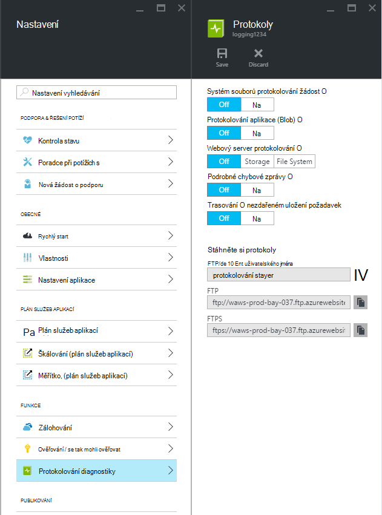
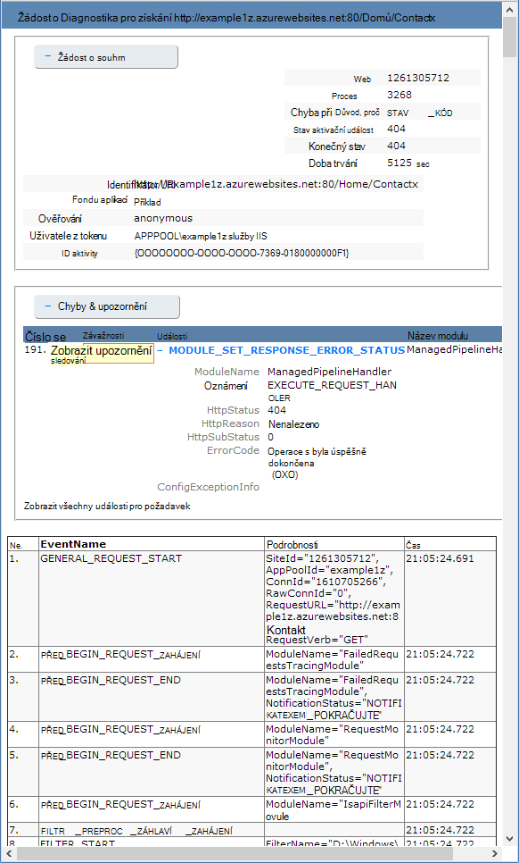

<properties
    pageTitle="Povolení protokolování diagnostiky pro web apps v aplikaci služby Azure"
    description="Zjistěte, jak povolit protokolování diagnostiky a přístrojového vybavení přidat aplikaci, a taky jak přístupu k informacím zaznamenané Azure."
    services="app-service"
    documentationCenter=".net"
    authors="cephalin"
    manager="wpickett"
    editor="jimbe"/>

<tags
    ms.service="app-service"
    ms.workload="na"
    ms.tgt_pltfrm="na"
    ms.devlang="na"
    ms.topic="article"
    ms.date="06/06/2016"
    ms.author="cephalin"/>

# Povolení protokolování diagnostiky pro web apps v aplikaci služby Azure

## Základní informace

Azure umožňuje předdefinovaných diagnostiky kvůli usnadnění ladění [aplikaci služby v prohlížeči](http://go.microsoft.com/fwlink/?LinkId=529714). V tomto článku se dozvíte, jak povolit protokolování diagnostiky a přístrojového vybavení přidat aplikaci, a taky jak přístupu k informacím zaznamenané Azure.

Tento článek používá [Portálu Azure](https://portal.azure.com), Azure PowerShell a rozhraní příkazového řádku Azure (Azure rozhraní příkazového řádku) pro práci s protokoly pro diagnostiku. Informace o práci s pomocí aplikace Visual Studio protokoly pro diagnostiku najdete v tématu [Poradce při potížích s Azure ve Visual Studiu](web-sites-dotnet-troubleshoot-visual-studio.md).

[AZURE.INCLUDE [app-service-web-to-api-and-mobile](../../includes/app-service-web-to-api-and-mobile.md)]

## Webový server diagnostiky a složka Doručená pošta aplikace Outlook

Aplikaci služby webové aplikace poskytovat funkce diagnostické protokolování informace z webového serveru a webové aplikace. Toto jsou logicky rozdělené do **webového serveru diagnostiky** a **Složka Doručená pošta aplikace Outlook**.

### Diagnostika webový server

Můžete povolit nebo zakázat následující typy protokolů:

- **Podrobné protokolování chyb** – podrobné informace o chybě pro HTTP stavů označující selhání (stavový kód 400 nebo vyšší). To může obsahovat informace, které vám můžou pomoct zjistit, proč server vrátil kód chyby.
- **Nepodařilo trasování žádost** - podrobné informace o nezdařeném uložení požadavků, včetně trasování součástí služby IIS slouží k zpracovat žádosti a doba v jednotlivé součásti. To může být užitečné, když se pokoušíte zvýšit výkon webu nebo izolovat co způsobuje specifickou chybu HTTP má být vrácena.
- **Protokolování na webový Server** – informace o [formátu souboru diakritikou protokolu W3C](http://msdn.microsoft.com/library/windows/desktop/aa814385.aspx)transakce HTTP. To je užitečné při určování celkové metriky webu jako je třeba počet zpracování žádostí o nebo kolik žádosti se z konkrétní IP adresy.

### Složka Doručená pošta aplikace Outlook

Diagnostika aplikace umožňuje zachycení informací vytvořené pomocí webové aplikace. Aplikace ASP.NET můžete použít třídu [System.Diagnostics.Trace](http://msdn.microsoft.com/library/36hhw2t6.aspx) záznam informace do protokolu diagnostických nástrojů aplikace. Příklad:

    System.Diagnostics.Trace.TraceError("If you're seeing this, something bad happened");

Za běhu načtete tyto protokoly pomoci při řešení. Další informace najdete v článku [Poradce při potížích s Azure web apps ve Visual Studiu](web-sites-dotnet-troubleshoot-visual-studio.md).

Aplikaci služby webové aplikace taky zaznamenává informace o nasazení při publikování obsahu do webových aplikací. K tomu dojde automaticky a žádné konfigurace nastavení pro nasazení protokolování. Nasazení protokolování umožňuje určit, proč se nepodařilo na nasazení. Například pokud používáte vlastní nasazení skript, používáte nasazení protokolování a zjistit, proč se nedaří skript.

## Jak povolit diagnostických nástrojů

Povolit Diagnostika v [Portálu Azure](https://portal.azure.com), přejděte na zásuvné pro webovou aplikaci a klikněte na **Nastavení > protokolování diagnostiky**.

<!-- todo:cleanup dogfood addresses in screenshot -->

Po povolení **aplikace diagnostiky** taky zvolte požadovanou **úroveň**. Toto nastavení umožňuje filtrování informací zachycených **informační**, **upozornění** nebo **chybovou** informace. Toto nastavení **podrobného** zaznamená všechny informace o vytvořené pomocí aplikace.

> [AZURE.NOTE] Na rozdíl od změny nastavení(Web.config)), povolení aplikace diagnostiky nebo změnou úrovní diagnostickém protokolu není odpadkového domény aplikace, která spuštění aplikace v rámci.

Na kartě [klasické portálu](https://manage.windowsazure.com) webové aplikace **Konfigurovat** můžete vybrat **úložiště** nebo **systému souborů** pro **protokolování webový server**. Výběr **úložiště** umožňuje vybrat úložiště účtu a potom kontejneru objektů blob s protokoly zápisu. Všechny protokoly pro **diagnostiku webu** jsou napsali k systému souborů.

Karta [klasické portál](https://manage.windowsazure.com) webové aplikace **Konfigurovat** taky obsahuje další nastavení diagnostických nástrojů aplikace:

* **Systém souborů** - ukládá aplikace diagnostické informace k systému souborů web app. Tyto soubory můžete k nim získat přístup pomocí protokolu FTP nebo stáhli jako archiv Zip pomocí prostředí PowerShell Azure nebo rozhraní Azure příkazového řádku (Azure rozhraní příkazového řádku).
* **Úložiště tabulek** - ukládá diagnostické informace aplikace zadaný název účtu úložiště Azure a tabulky.
* **Úložiště objektů blob** - s informacemi aplikace Diagnostika v zadaném kontejneru účet Azure úložiště a objektů blob.
* **Doba uchovávání informací** - ve výchozím nastavení se automaticky neodstraní protokoly z **úložiště objektů blob**. Vyberte **nastavení uchovávání informací** a zadejte počet dní zachovat protokoly, pokud chcete automaticky odstranit protokoly.

>[AZURE.NOTE] Pokud můžete [Obnovit přístupových kláves z verze účtu úložiště](storage-create-storage-account.md#view-copy-and-regenerate-storage-access-keys), musíte nastavit konfigurace odpovídajících protokolování aktualizované klávesami. Akce:
>
> 1. Na kartě **Konfigurovat** nastavte funkci odpovídajících protokolování **vypnout**. Uložení nastavení.
> 2. Povolení protokolování k tabulce nebo účtu úložiště objektů blob znovu. Uložení nastavení.

Libovolnou kombinací systému souborů, úložiště tabulek nebo úložiště objektů blob lze povolit ve stejnou dobu a mít konfigurace na úrovni jednotlivých protokolu. Chcete například protokolu chyb a upozornění na objektů blob úložiště jako dlouhodobé řešení protokolování při povolení protokolování systému souborů na úrovni úplné.

Zatímco všechny tři úložišť poskytují stejnou základní informace o protokolu událostí, **úložiště tabulek** a **úložiště objektů blob** Další informace, například instance ID, ID vlákna a podrobnějších časové razítko (formát popisky) než protokolování do protokolu **systému souborů**.

> [AZURE.NOTE] Informace uložené v **úložiště tabulek** nebo v **úložišti objektů blob** můžete otevřít pouze prostřednictvím úložiště klienta nebo aplikace, můžete pracovat přímo u těchto systémů úložiště. Například Visual Studio 2013 obsahuje Průzkumníka úložiště, který lze použít k prohlížení tabulek nebo objektů blob úložiště a HDInsight dostanete dat uložených v úložišti objektů blob. Můžete také napsat aplikace, která má přístup k úložišti Azure pomocí jedné z [Azure SDK](/downloads/#).

> [AZURE.NOTE] Diagnostika může být také užitečné z prostředí PowerShell Azure pomocí rutinu **Set-AzureWebsite** . Pokud jste nenainstalovali Azure PowerShell nebo nebyly nakonfiguroval tuto funkci tak použít předplatného Azure, přečtěte si, [jak pomocí Powershellu Azure](/develop/nodejs/how-to-guides/powershell-cmdlets/).

##Postup: Stáhněte si protokoly

Diagnostické informace uložené do systému souborů web app můžete otevřít přímo prostřednictvím FTP. Je můžete stáhnout také jako archiv Zip pomocí prostředí PowerShell Azure nebo rozhraní Azure příkazového řádku.

Struktura adresářů uložených v protokolech je takto:

* **Protokoly aplikace** - /LogFiles/aplikace /. Tato složka obsahuje jeden nebo více soubory ve formátu RTF obsahující informace vytvořené pomocí aplikace protokolování.

* **Nezdařilo stopy žádost** - / LogFiles/W3SVC ### /. Tato složka obsahuje soubor XSL a jeden nebo víc souborů XML. Ujistěte se, stáhnout soubor XSL do stejného adresáře jako XML souborů, protože soubor XSL poskytuje funkce pro formátování a filtrování obsahu soubory XML při zobrazení v aplikaci Internet Explorer.

* **Podrobné chybové protokoly** - /LogFiles/DetailedErrors /. Tato složka obsahuje jeden nebo víc souborů HTM, které jsou zdrojem podrobné informace HTTP chyby, ke kterým došlo.

* **Webový Server protokoly** - /LogFiles/http/RawLogs. Tato složka obsahuje jeden nebo více soubory ve formátu RTF formátovány pomocí [formátu souboru diakritikou protokolu W3C](http://msdn.microsoft.com/library/windows/desktop/aa814385.aspx).

* **Nasazení protokoly** - / LogFiles/libovolná. Tato složka obsahuje protokoly generovaného při procesu nasazení interní používané Azure webovými aplikacemi, jakož i protokoly libovolná nasazení.

### FTP

Pro přístup pomocí protokolu FTP diagnostických informací, navštěvujte blog o **řídicího panelu** svojí webové aplikace [klasické portálu](https://manage.windowsazure.com). V části **první pohled dával** pomocí odkazu na **Protokoly pro diagnostiku FTP** pro přístup pomocí protokolu FTP souborů protokolu. **Nasazení/FTP uživatele** položky Registrar uživatelské jméno, které bude použito k přístupu na web FTP.

> [AZURE.NOTE] Pokud není nastavený položce **Uživatelů nasazení/serveru FTP** nebo zapomněli jste heslo pro tohoto uživatele, můžete vytvořit nového uživatele a hesla pomocí odkaz **Obnovit nasazení pověření** v části **první pohled dával** **řídicího panelu**.

### Stažení pomocí prostředí PowerShell Azure

Stažení souborů protokolu, spuštění nové instance Azure PowerShell a zadejte následující příkaz:

    Save-AzureWebSiteLog -Name webappname

To bude uložit protokoly pro web app nastavil **– název** parametr do souboru s názvem **logs.zip** aktuálního adresáře.

> [AZURE.NOTE] Pokud jste nenainstalovali Azure PowerShell nebo nebyly nakonfiguroval tuto funkci tak použít předplatného Azure, přečtěte si, [jak pomocí Powershellu Azure](/develop/nodejs/how-to-guides/powershell-cmdlets/).

### Stažení Azure rozhraní příkazového řádku

Stahovat soubory protokolu pomocí rozhraní Azure příkazového řádku, otevřete nový příkazový řádek, Powershellu, flám nebo terminálové relace a zadejte tento příkaz:

    azure site log download webappname

To bude uložit protokoly pro web app s názvem "webappname" do souboru s názvem **diagnostics.zip** aktuálního adresáře.

> [AZURE.NOTE] Pokud jste nenainstalovali rozhraní příkazového řádku Azure (Azure rozhraní příkazového řádku) nebo nebyly nakonfigurovali ji na používání předplatného Azure najdete v tématu [jak používat rozhraní příkazového řádku Azure](../xplat-cli-install.md).

## Postup: zobrazení protokoly do aplikace přehledy

Přehledy aplikace Visual Studio obsahuje nástroje pro filtrování a vyhledávání protokoly a pro korelace protokoly s žádostí o a dalších událostí.

1. Přidání SDK přehledy aplikace do projektu ve Visual Studiu.
 * V Průzkumníku klikněte pravým tlačítkem myši projektu a zvolte Přidat přehledy aplikace. Pomůže kroky, které obsahují vytváření aplikací přehledy zdroje. [Víc se uč](../application-insights/app-insights-asp-net.md)
2. Přidání balíček posluchače trasování do projektu.
 * Klikněte pravým tlačítkem myši projektu a zvolte spravovat balíčků NuGet. Vyberte `Microsoft.ApplicationInsights.TraceListener` [Další informace](../application-insights/app-insights-asp-net-trace-logs.md)
3. Uložte projekt a ho spusťte a generovat dat protokolu.
4. Na [Portálu Azure](https://portal.azure.com/)přejděte na nový zdroj přehledy aplikace a otevřete **hledání**. Zobrazí se datům protokolu spolu s žádost, použití a jiných telemetrie. Některé telemetrie může trvat několik minut doručení: klikněte na aktualizovat. [Víc se uč](../application-insights/app-insights-diagnostic-search.md)

[Další informace o výkonu sledování s přehledy aplikace](../application-insights/app-insights-azure-web-apps.md)

##Postup: protokolování můžete vysílat datovými proudy

Při vývoji aplikace, je často užitečné k zobrazení informací o protokolování v blízkosti v reálném čase. Můžete to provést pomocí datových proudů informace zaznamenané vývojové prostředí pomocí prostředí PowerShell Azure nebo rozhraní Azure příkazového řádku.

> [AZURE.NOTE] Některé typy protokolování rezervy zapisovat do souboru protokolu, což může způsobit mimo pořadí událostí v proudu. Například položku protokolu aplikace, který bude proveden poté uživatele návštěvy na stránku se může zobrazovat ve proudu před odpovídající položku protokolu HTTP pro požadavku na stránku.

> [AZURE.NOTE] Streaming protokolu se taky můžete vysílat datovými proudy informace zapsané na libovolný textový soubor uložený v **D:\\domácí\\LogFiles\\ ** složky.

### Přenos Azure prostředí PowerShell

Informace zaznamenané můžete vysílat datovými proudy, spuštění nové instance Azure PowerShell a zadejte následující příkaz:

    Get-AzureWebSiteLog -Name webappname -Tail

Tím se připojí k web appu nastavil **– název** parametr a začněte streamování informace do okna prostředí PowerShell protokolu událostí se vyskytují na web appu. Všechny informace zapisovat soubory končící txt, .log nebo htm, které jsou uložené v adresáři /LogFiles (d: nebo domů/soubory protokolů) se streamují ke konzole místní.

Filtrování zvláštní události, jako je třeba chyby, můžete **-zprávy** parametr. Příklad:

    Get-AzureWebSiteLog -Name webappname -Tail -Message Error

Filtrování konkrétní protokolu typů, například HTTP, můžete **– cesta** parametr. Příklad:

    Get-AzureWebSiteLog -Name webappname -Tail -Path http

Zobrazíte seznam dostupných cest použijte parametr – ListPath.

> [AZURE.NOTE] Pokud jste nenainstalovali Azure PowerShell nebo nebyly nakonfiguroval tuto funkci tak použít předplatného Azure, přečtěte si, [jak pomocí Powershellu Azure](/develop/nodejs/how-to-guides/powershell-cmdlets/).

### Přenos Azure rozhraní příkazového řádku

Informace zaznamenané můžete vysílat datovými proudy, otevřete nový příkazový řádek, Powershellu, flám nebo terminálové relace a zadejte tento příkaz:

    azure site log tail webappname

Tím se připojit k web appu s názvem "webappname" a začněte streamování informace do okna protokolu událostí se vyskytují na web appu. Všechny informace zapisovat soubory končící txt, .log nebo htm, které jsou uložené v adresáři /LogFiles (d: nebo domů/soubory protokolů) se streamují ke konzole místní.

Filtrování zvláštní události, jako je třeba chyby, můžete **– Filtr** parametr. Příklad:

    azure site log tail webappname --filter Error

Filtrování konkrétní protokolu typů, například HTTP, můžete **– cesta** parametr. Příklad:

    azure site log tail webappname --path http

> [AZURE.NOTE] Pokud jste nenainstalovali rozhraní příkazového řádku Azure nebo nenakonfigurovali ho použít předplatného Azure, najdete v tématu [k použití Azure rozhraní příkazového řádku](../xplat-cli-install.md).

##Postup: porozumět protokolování diagnostiky

### Protokolech diagnostiky aplikací

Složka Doručená pošta aplikace Outlook ukládá informace v určitém formátu pro .NET aplikace, v závislosti na tom, zda uložit protokoly systému souborů, úložiště tabulek nebo úložiště objektů blob. Základní množiny dat uložených je stejná napříč všemi třemi typy úložiště: datum a čas výskytu události ID procesu, které vytvoří událost, typ události (informace, upozornění a chyby) a zpráva o události.

__Systém souborů__

Každý řádek přihlášení k lyncu k systému souborů nebo doručeného pomocí datových proudů bude mít v tomto formátu:

    {Date}  PID[{process id}] {event type/level} {message}

Například událost chyby by vypadat takto:

    2014-01-30T16:36:59  PID[3096] Error       Fatal error on the page!

Přihlášení k systému souborů obsahuje základní informace ze tří způsobů k dispozici, jenom čas, id procesu, úroveň událostí a zprávy.

__Úložiště tabulek__

Při přihlašování k úložišti tabulek, doplňující vlastnosti, které se používají k usnadňuje vyhledávání dat uložených v tabulce, stejně jako podrobnější informace o události. U každé entity (řádku) uloženy v tabulce se používají následující vlastnosti (sloupce).

Název vlastnosti|Hodnota/formát
---|---
PartitionKey|Datum a čas ve formátu yyyyMMddHH události
RowKey|Identifikátor GUID hodnota, která jednoznačně identifikuje tuto entitu
Časové razítko|Datum a čas výskytu události
EventTickCount|Datum a čas výskytu události, ve formátu značky (větší přesnost)
ApplicationName|Název webové aplikace
Úroveň|Úroveň událostí (například chyby, upozornění, informace)
EventId|ID události této události

Výchozí hodnota 0, pokud zadán žádný
ID instance|Výskyt výskytu i na web appu
Návrh potrubí –|ID procesu
TID|ID vlákna podproces, který vytvořené události
Zpráva|Zpráva podrobností o události

__Úložiště objektů BLOB__

Při přihlašování k úložišti objektů blob, ukládají se data ve formátu hodnoty oddělené čárkami (CSV). Úložiště tabulek, podobně jako dalších polí přihlášeni k poskytování podrobnější informace o události. Pro každý řádek v CSV se používají následující vlastnosti:

Název vlastnosti|Hodnota/formát
---|---
Datum|Datum a čas výskytu události
Úroveň|Úroveň událostí (například chyby, upozornění, informace)
ApplicationName|Název webové aplikace
ID instance|Výskyt výskytu události na web appu
EventTickCount|Datum a čas výskytu události, ve formátu značky (větší přesnost)
EventId|ID události této události

Výchozí hodnota 0, pokud zadán žádný
Návrh potrubí –|ID procesu
TID|ID vlákna podproces, který vytvořené události
Zpráva|Zpráva podrobností o události

Data uložená v objektů blob by vypadala podobně jako tento příklad:

    date,level,applicationName,instanceId,eventTickCount,eventId,pid,tid,message
    2014-01-30T16:36:52,Error,mywebapp,6ee38a,635266966128818593,0,3096,9,An error occurred

> [AZURE.NOTE] První řádek protokol bude obsahovat záhlaví sloupců, jak uloženo v tomto příkladu.

### Se nezdařilo stopy požadavek

Nejde žádost trasování jsou uložené v souborech XML s názvem __fr ### XML__. Můžete usnadnit její zobrazíte protokolované informace, šablony stylů XSL s názvem __freb.xsl__ uvedenou v adresáři stejný jako soubor XML. Otevření jeden ze souborů XML v aplikaci Internet Explorer bude používat stylů XSL poskytují formátovaný zobrazení sledování informací. To bude vypadat takto:

### Podrobné chybové protokoly

Podrobné chybové protokoly jsou dokumentů HTML, které obsahují podrobnější informace o chybách HTTP, ke kterým došlo. Protože jsou jednoduše dokumenty ve formátu HTML, že je možné zobrazit pomocí webového prohlížeče.

### Webový server protokoly

Protokolů webového serveru jsou formátovány pomocí [formátu souboru diakritikou protokolu W3C](http://msdn.microsoft.com/library/windows/desktop/aa814385.aspx). Tyto informace může číst, v textovém editoru nebo analyzovat pomocí nástroje například [Analyzátor protokolu](http://go.microsoft.com/fwlink/?LinkId=246619).

> [AZURE.NOTE] Protokoly vytvořené pomocí aplikace Azure web nepodporují polí __s název_počítače__, __s ip__nebo __cs verze__ .

##Další kroky

- [Jak sledovat Web Apps](/manage/services/web-sites/how-to-monitor-websites/)
- [Poradce při potížích s Azure webové aplikace ve Visual Studiu](web-sites-dotnet-troubleshoot-visual-studio.md)
- [Analýza v prohlížeči protokoly do HDInsight](http://gallery.technet.microsoft.com/scriptcenter/Analyses-Windows-Azure-web-0b27d413)

> [AZURE.NOTE] Pokud chcete začít pracovat s aplikaci služby Azure před registrací účet Azure, přejděte na [Zkuste aplikaci služby](http://go.microsoft.com/fwlink/?LinkId=523751), které můžete okamžitě vytvořit web appu krátkodobý starter v aplikaci služby. Žádné povinné; kreditní karty žádné závazky.

## Co se změnilo
* Průvodce na změnu z webů pro aplikaci služby v tématu: [aplikaci služby Azure a jeho dopad na existující služby Azure](http://go.microsoft.com/fwlink/?LinkId=529714)
* Příručka k části Změna staré portálu na novém portálu najdete v tématu: [odkazy pro navigaci portálu Azure](http://go.microsoft.com/fwlink/?LinkId=529715)
 
