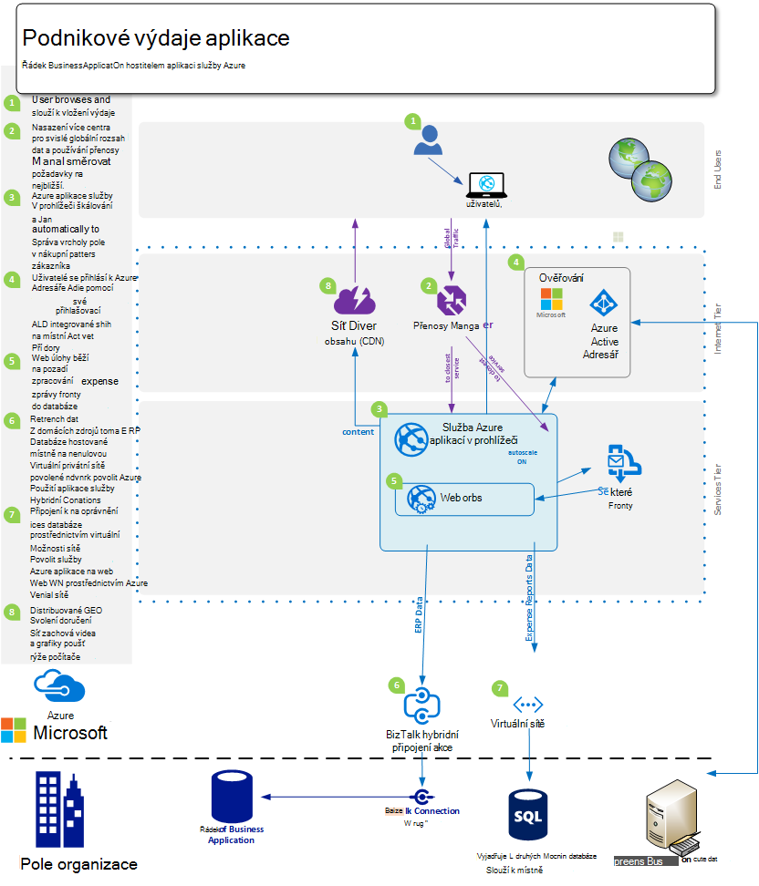
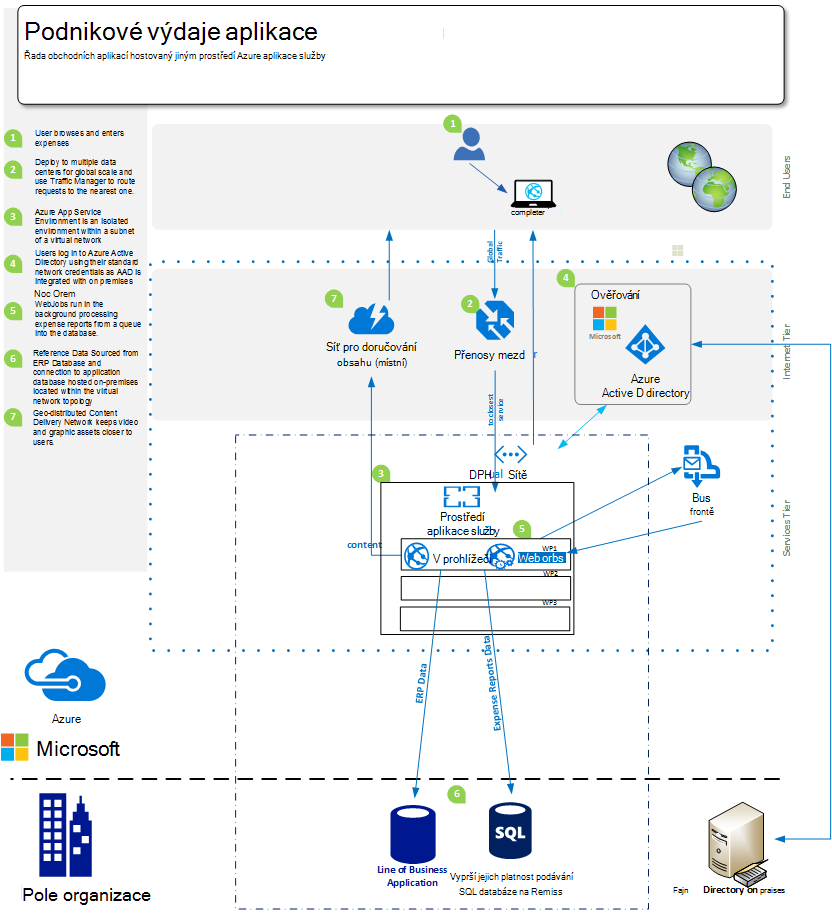
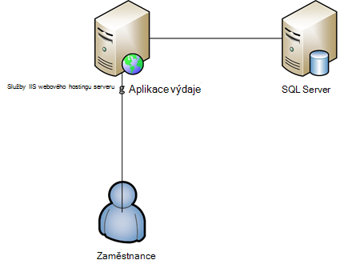

<properties 
    pageTitle="Nabídka aplikace Web Azure aplikace služeb Enterprise" 
    description="Ukazuje, jak pomocí Azure aplikace služby Web Apps můžete vytvářet enterprise webu řešení ve vašem podniku" 
    services="app-service\web" 
    documentationCenter="" 
    authors="apwestgarth" 
    manager="wpickett" 
    editor=""/>

<tags 
    ms.service="app-service-web" 
    ms.workload="web" 
    ms.tgt_pltfrm="na" 
    ms.devlang="na" 
    ms.topic="article" 
    ms.date="07/29/2016" 
    ms.author="anwestg"/>

# Azure aplikaci služby webové aplikace nabídky pro dokument Enterprise #

Potřeba snížit náklady a dodávat IT řešení rychlejší v prostředí rychle vývoj vytvoří nové úkoly pro vývojáře, odborníky a správci. Uživatelé stále hledáte jejich řádek Business (LOB) webové aplikace snadné neodpovídá a k dispozici z libovolného zařízení. Ve stejnou dobu může to být něco co nejjednodušší jednotného přihlašování na zařízeních pomocí služby Active Directory spolupráce v Office 365 pomocí dat z aplikace interní LOB, která zase použije data z společnosti provádění služby Salesforce doplněné, firmy se pokoušíte využití zvýšení produktivity a efektivity pocházející z integrace se službou cloudu a mobilních služeb. [Azure aplikace služby Web Apps](http://go.microsoft.com/fwlink/?LinkId=529714) je Služba cloudu podnikových pro vývoj, testování a spouštět web a mobilní aplikace, rozhraní API webových a obecnou webech. Mohou sloužit k spuštění podnikové weby, intranetových webů, obchodních aplikací a digitální marketingových kampaní v síti globální datacentrech optimalizovaná pro měřítko a dostupnost, spolu s podporou průběžné integrace a moderní DevOps postupy.  

Tento dokument zvýrazní funkcí [Webové aplikace](/services/app-service/web/) služby konkrétně zaměření na systém LOB webových aplikací, překrývajícím migrace existující webové aplikace a nasazení nové webové aplikace LOB platformy. 

## Cílové skupiny ##

IT profesionály tvůrci a správce, kteří pracují na hledané migrovat do pracovního vytížení web cloudu, aktuálně spuštěných místní. Web pracovního vytížení může zahrnovat buď Business zaměstnanci nebo Business pro partnery webové aplikace.

## Úvod ##

Aplikace služby Web Apps je ideální platforma dnem hostovat externích a interních webových aplikací a služeb a poskytuje efektivní, vysoce scalable, spravovaných řešení umožňuje Soustřeďte se na doručení firmy hodnota pro uživatele, spíše než výdaje značné množství času peníze zachování a podporu oddělit prostředí. Web Apps nabízí flexibilní platformy, na kterou chcete nasadit webových aplikací enterprise nabízí možnost nadále ověřování místní služby Active Directory prostřednictvím integrace s Microsoft Azure Active Directory, podporu jednoduché a rychlého nasazení díky použití vašich interní nepřetržitý integrace a nasazení postupů, při automatické změny velikosti růst obchodních potřeb – všechny na spravované platformě, která umožňuje zaměřit na aplikace a ne infrastrukturu. 

## Definice problém ##

Rychle změnit šířku IT, přesunout mimo hostující na tradiční serverech s vysokou kapitálových náklady na rozsáhlé časy, který používá na vyžádání pomocí služeb, které měřítko automaticky zpracovávat načíst. IT oddělení je vyžadováno snížit náklady a stopu infrastruktury a údržba výdajů s fokusem na snížit náklady současně zvyšuje flexibilitu. Konec doby trvání starší infrastruktury platformy, jako je Windows Server 2003, je úvodními IT oddělení kontroloval cloudu migrace možných způsobů, jak vyhnout nové dlouhodobou kapitálu nákladům. V minulosti vedoucí by rozhodovat nákupu pro jiné oblasti; ale stále CMOs a jiných hlava jednotku firmy prováděnou aktivní role v jak strávený jejich rozpočtu a co je návratnost investic. Firmy stále, třeba jejich zaměstnanců jsou mnohem více mobilní než kdykoli dřív se zaměstnanci pracuje na dálku, výdaje delší dobu se zákazníky nutností přístup k systémů starosti.

Obchodní potřeby změnit měsíční, týdenní, každý den. Firmy hledáte rychlé globální služby běžná aktualizované úplné nových funkcí, poskytovány třetích stran nebo interně.  V některých případech firmy taky hledáte funkcí a izolovat žádostí o přístup k prostředkům zatímco také díky použití veřejných cloudu zařízení. Uživatelé mají vyšší očekávání s mnoha využívání službami ve své vlastní soukromé životy například Office 365. Očekávají mít taky přístup ke službám bohaté podobné, aktuální, funkce v jeho životním práce. Čelit tato služba IT musí služby vzhled pomůže firmy aby tato prostřednictvím výběru a integrace se službou třetích stran, opatrnost platformy, které můžete přizpůsobit obchodních potřeb, přičemž je také spolehlivé s celkové náklady omezená na vlastnictví.

Členům týmu vývoje pracují na hledané předvádění okamžité firmy výhoda doručení nových funkcí na základě časté. Hledáte nákladů efektivní spolehlivé platformy, která lze integrovat s existující nástroje a postupy – vývoj, test, uvolněte; a pracovat společně s IT oddělení automaticky nasazení a správu výstrahy všechny s cílem nula výpadek služeb.

<a href="highlevel" />
## Vysoké úrovně řešení ##

Web platformách rámce stále využívané a vývoj, otestujte a hostovat obchodních aplikací.  Typické řádku podnikové aplikaci, třeba systému interní zaměstnanec výdajů, díky kterému často skládající se pouze z web appu s zálohování databáze pro uložení dat souvisejících s aplikace.

Služba aplikací Web Apps je vhodný pro hostování tyto aplikace nabízející scalable a spolehlivé infrastruktury, která je spravován a opravené s poblíž nula ruční zásah a výpadek služeb. Platformu Microsoft Azure obsahuje mnoho možnosti ukládání dat pro podporu webových aplikací hostitelem webových aplikací Web Apps databázi Microsoft Azure SQL, spravovaných scalable relační databáze – jako službu, do oblíbených služeb z našich partnerů například databáze MySQL ClearDB a MongoDB.

Alternativní přístup se dají používat použít existující investice místně. V příkladu scénáři systému výdajů zaměstnanců můžete spravovat úložiště dat v rámci vlastní interní infrastrukturu. Může to být z integrace s vnitřní systémy (vykazování mzdy, fakturace atd.) nebo uspokojili zásady správného řízení požadavku na IT.  Web Apps nabízí řadu metod umožňuje připojit ke infrastruktury na místní:

- [Aplikace služby prostředí](app-service-app-service-environment-intro.md) - aplikace služby prostředí řízení, jsou nové funkce Premium, která byla naposledy přidat do nabídky Microsoft Azure aplikaci služby.  ASEs poskytovat prostředí plně izolace a vyhrazené pro bezpečné spuštění aplikace služby Azure aplikace ve velkém měřítku vysoké a současně nabízí izolace a bezpečný přístup   
- [Hybridní připojení](../biztalk-services/integration-hybrid-connection-overview.md) – hybridní připojení jsou funkce Microsoft Azure BizTalk Services a povolit webových aplikací pro místní zdroje zabezpečené připojení, například SQL Server MySQL, rozhraní API webových a vlastní webové služby. 
- [Virtuální integrace sítě](https://azure.microsoft.com/blog/2014/09/15/azure-websites-virtual-network-integration/) – Web Apps integrace se službou Azure virtuální sítě umožňuje připojit webovou aplikaci virtuální sítě Azure, která zase může být připojená ke infrastruktury na místní prostřednictvím sítě VPN na webu. 

Následující diagramy znázornění jako příklad uceleném řešení s možnostmi připojení pro místní zdroje.  První příklad ukazuje, jak to můžete dosáhnout pomocí standardních funkcí aplikace služby Azure a druhá ukazuje, jak to může být dosáhnout pomocí premium nabízí, aplikací služby prostředí.

Použití funkcí standardní aplikaci služby:

Pomocí prostředí aplikace služby:

## Výhody Business ##

Služba aplikací Web Apps nabízí hostitel firmy výhod, které povolit funkci mnohem víc efektivní a aktivní v předvádění pro obchodních potřeb. 

### PaaS modelu ###

Služba aplikací Web Apps jsou založeny na platformu jako modelu služby, které přináší celou řadu úspor náklady a efektivitu.  Už musíte věnovat hodin Správa VMs, opravy operačních systémů a rámce. Web aplikace je automaticky opravou prostředí, které umožňuje zaměřit na řízení webových aplikací a ne VMs necháte týmy bezplatné poskytují další obchodní hodnotu.

PaaS Model podporu webové aplikace umožňuje lékařů metodiky DevOps ke splnění své cíle. Jako obchodní to znamená, že úplné řízení a integrace v rámci celého životního cyklu aplikace, včetně vývoj, testování, vydání, sledování a správa a podpora. 

Pro členům týmu vývoje je možné konfigurovat z Visual Studio týmovou, GitHub, TeamCity, Hudsonem nebo BitBucket povolení automatické sestavení, testování a nasazení umožňuje rychlejší vydání cyklů zatímco snížení třením účastní uvolnění v infrastruktury průběžné integrace a nasazení pracovní postupy. Webové aplikace taky podporuje vytváření více testování a pracovní prostředí pro pracovní postup vydání, už potřebujete rezervovat nebo přidělit hardwaru k těmto účelům, můžete vytvořit tolik prostředí a chcete definovat vlastní podporu uvolníte pracovního postupu. Firmy, které by mohly rozhodli uvolněte úsek test z ovládacího prvku zdroje, provést řadu testů a po úspěšném zvýšení úrovně úsek fáze a nakonec zaměnit výrobní s žádné prostoje má tu výhodu, webové aplikace hostované na webu aplikace jsou jako software předinstalovaný a teplé poskytovat nejlepší možné spokojenosti zákazníků.  Kromě toho firmy můžete využít testování v výrobní funkcí aplikace služby Web Apps na přímé části umožnění datových přenosů do různých úsek, k ověření změn, před přepnutím všechny přenosy do nového nasazení verzi nebo vrácení zpět všechny přenosy na předchozí nasazení. 

Operace týmům můžete jistotu, že pocházejí na nejlepší možné pozici reagovat problémy s některou z jejich webových aplikací na Web Apps hostovaný jiným vytvořená v funkce sledování a upozornění. By měl operace týmy jste již vložil do technologie pro analýzu a sledování řešení takových z Microsoft Visual Studio aplikace přehledy, nové Relic a AppDynamics. Taky plně jsou podporovány na povolení kontinuitu a známé prostředí, ze kterého chcete sledovat webových aplikací Web Apps.

Nakonec Web Apps nabízí možnost automaticky obecnějším údajům vaší app(s) a hostovanou databází odkázat kontejneru úložišti objektů Blob Azure. Poskytuje jednoduché způsobem a velmi nákladů efektivní metodu, pomocí které chcete obnovit po selhání a snížit množství pro komplexního na místní hardware a software.

### Snadnější migrace ###

Hardware Údržba a otočení v prostoru je jako vydání cykly na hardware a operační systémy pro dosažení vyššího klíčové problém pro firmy. Máte počet Windows Server 2003 R2 servery, které jsou už na konci podpora v 2015, ale budou pořád hostitelem klíčové webové aplikace pro svoji firmu? Služba aplikací Web Apps je skvělý candidate dnem hostovat webové aplikace a chcete racionalizovat majetku firmy hardwaru. Web Apps vám umožňuje přístup k oblasti specifikace hardwaru, které se spravuje a spravují v rámci služby, takže není nutné faktor náhradní náklady a správu v rámci rozpočtu infrastruktury.  Migrace můžete skládat například kopii a vložit operace ze stávajícího nasazení webových aplikací nebo složitější migrace kde pomocníka webových aplikací migrací přidá hodnotu. Migrované webových aplikací líbit úplné dokumentech Azure služby integrace dalších službách k webovým aplikacím. Zvažte například přidání Azure Active Directory pro řízení přístupu k aplikace založené na sdružení uživatelů do skupiny zabezpečení. Jiný příklad může být přidání služby mezipaměti pro zvýšení výkonu a zmenšení latence poskytující celkové lepší uživatelské prostředí. 

### Pole organizace hostingu třídy ###

Služba aplikací Web Apps nabízí stabilní a spolehlivý platformy, která byla ukázal mohli zpracovat širokou škálu obchodní potřeba z malé interní úloh vývoj a testování vysoce zvětšený vysoký provoz weby. Pomocí webové aplikace vytváříte používat stejný enterprise třídy hostingu platformu Microsoft společnost používá pro vysokou hodnotu web úloh. Web Apps, spolu s všechny stránky služby Azure platformu jsou vytvořené pomocí zabezpečení a dodržování zákonných požadavků, například ISO (ISO/IEC 27001:2005); SOC1 a SOC2 SSAE. 16/ISAE 3402 osvědčení HIPAA BAA, PCI a Fedramp v místě srdci každý prvek a funkce pro další informace najdete v článku [http://aka.ms/azurecompliance](/support/trust-center/compliance/). 

Platformu Microsoft Azure umožňuje Role na základě povolení ovládacích prvků povolení úrovně organizace ovládacího prvku zdroje webové aplikace. RBAC dává podniky implementovat vlastní zásady správy přístup pro všechny své aktiv v prostředí Azure pomocí přiřazení uživatelů do skupin a zase přiřazování potřebná oprávnění k těmto skupinám proti materiálů například do webových aplikací. Další informace o RBAC v Azure najdete v článku [http://aka.ms/azurerbac](../active-directory/role-based-access-control-configure.md). Využitím Web Apps chcete mít jistotu zavedení webových aplikací v prostředí bezpečných a zabezpečené a oprávnění Úplné řízení, na které území svém majetku zavedení. 

Prostředí aplikace služby Azure [http://aka.ms/aseintro](http://aka.ms/aseintro) se nová možnost plán služeb premium pro podnikoví uživatelé chtějí můžete využít služby Azure aplikace a tyto poskytovat prostředí plně izolace a vyhrazené.  Díky zákazníci enterprise pro nasazení aplikace, které můžete využít velmi vysoké měřítko a zároveň i s úplnou kontrolu nad příchozí a odchozí v síti a ASEs povolit aplikacím mít vysokorychlostní zabezpečené připojení přes virtuální sítě pro místní zdroje.

Služba aplikací Web Apps se taky plně využívat na investic místní nabídkou možnost připojení zpátky na zdroje, jako je datový sklad nebo prostředí Sharepointu. Jak je uvedeno v [řešením na vysoké úrovni](#highlevel) , kterou vytvoříte pomocí hybridní připojení a virtuální připojení k síti připojit k místní infrastruktury a služeb.

### Globální měřítko ###

Služba aplikací Web Apps je globální a scalable platformu povolení webových aplikací a postupně se zvětšují přizpůsobit rostoucí potřebám rychle a s minimálními dlouhodobou naplánováním a náklady. V typické na místní infrastruktury scénáře rozšíření a zvýšení služba místně a geograficky by vyžadovat velké množství správy, plánování a výdajů trvat i spravovat další infrastrukturu. Web Apps nabízí možnost zobrazit webových aplikací s ebb a cesta vašim požadavkům. Například v aplikaci výdaje jako příklad pro většinu měsíce uživatelé se Příležitostní uživatelé aplikace, ale jako konečný termín každý měsíc pro odeslání výdajů být zadán použití zvýšil v aplikaci, Web Apps má možnost automaticky vytvořit další infrastrukturu pro aplikace a potom po použití má subsided znovu ho lze přizpůsobit zpět, které definujete infrastruktury podle směrného plánu.

Globálně v 24 datacentrech Celosvětová dostupnost a rostoucí neexistuje webové aplikace. Většina aktualizovaný seznam oblastí a umístění najdete v článku [http://aka.ms/azlocations](http://aka.ms/azlocations). S aplikací Web Apps můžete firmy snadno dosáhnout globální reach a měřítko. Narůstající velikostí vaši společnost do nových oblastí, vytváření sestav aplikace řídicí panely, které používáte a hostitele na Web Apps můžete snadno nasadit do další datacentrech a vytisknout místní uživatele úplně rychleji pomocí kombinace webové aplikace a správci přenosy Azure všechny má tu výhodu scalable infrastruktury pod smlouvy a rozbalte jako potřeby změnit místních poboček.
 
## Podrobnosti řešení ##

Podívejme se na příklad scénáři aplikací migrací. To osnovy zobrazí podrobnosti o jak funkce aplikace služby Web Apps společně poskytnout skvělé řešení a obchodní hodnoty.
 
V tomto příkladu je řádku podnikové aplikaci, kterou jsme projednávat vyúčtování aplikace, která umožňuje zaměstnancům odešlete své výdaje o náhradu. Aplikace je hostovaný ve Windows Server 2003 R2 spuštění služby IIS 6 a databáze je databáze SQL Server 2005. Důvod, proč jsme zvolte starší spočívá serveru na nadcházející konec ze služby pro Windows Server 2003 R2 a SQL Server 2005 a máme [Nástroje](http://aka.ms/websitesmigration) a [pokyny](http://aka.ms/websitesmigrationresources) k automaticky migrace pracovního vytížení do Azure. Si uvědomit vzorku v tomto příkladě použita platí pro celou verity scénáře migrace. 

### Migrace stávajícího aplikace ###

Jeden z celkové řešení pro přesunutí řádku obchodní aplikace na Web Apps se popsána existující majetku aplikace a architektura. Webové aplikace technologie ASP.NET hostovaných na jednom serveru IIS s databází hostovaných na samostatném SQL serveru, jak je znázorněno na následujícím obrázku je příklad v tomto dokumentu. Zaměstnanců Přihlášení do systému pomocí kombinace uživatelské jméno a heslo, zadejte podrobnosti nákladů a nahrajte naskenované kopií stvrzenky do databáze pro každou položku výdajů. 
 

#### Položky, které je třeba zvážit ####

Pokud aplikaci migrace z místního prostředí, můžete mít na paměti pár omezení webových aplikací Web Apps. Tady jsou některé klíčové témata nějaká při migraci webovými aplikacemi Web Apps ([http://aka.ms/websitesmigrationresources](http://aka.ms/websitesmigrationresources)):

-   Port vazeb – Web Apps pouze podporuje port 80 HTTP a port 443 přenosů HTTPS. Aplikace používá jiný port a nakonec jednou poštovním aplikace pokusy portu 80 určenou HTTP a port 443 přenosů HTTPS. Toto je často neškodné problém, stejně jako v běžných v místním nasazení aby použití různých portů k vyřešit použít názvy domén, zejména v vývojové a testovací prostředí
-   Ověřování – webové aplikace podporuje anonymní přístup ve výchozím nastavení a ověřování pomocí formulářů označenými aplikace. Web Apps nabízí ověřování systému Windows, když aplikace je integrována s Azure Active Directory a služby AD FS pouze. Jedná se o funkci, která je podrobněji popsána [tady](http://aka.ms/azurebizapp) 
-   GAC na základě sestavení – Web Apps neumožňuje nasazení sestavení do globální mezipaměti sestavení (GAC). Proto, pokud aplikací migrací využívá této funkce místní, zvažte přesunutí sestavení do složky Koš aplikace.
-   IIS5 Režim kompatibility – webové aplikace podporuje režim kompatibility IIS5 jako takové pokaždé Web Apps a všechny webové aplikace v části instance nadřazený Web Apps v a spustit stejného pracovního procesu v rámci jedné aplikace fondu.
-   Použití knihoven COM – Web Apps neumožňuje registrace součástí COM platformy. Proto aplikace upravuje použít u všech součástí modelu COM, tyto bude nutné v spravovaný kód a nasazena s aplikací.
-   Filtry ISAPI – filtry ISAPI můžete na Web Apps podporované. Budou muset být nasazené jako součást aplikace a registrován ve webové aplikaci nastavení(Web.config)). Další informace najdete v tématu [http://aka.ms/azurewebsitesxdt](web-sites-transform-extend.md). 

Jakmile se považují za tato témata, webové aplikace by měl být umístěným v cloudu. A Nedělejte si starosti, pokud není plně splněná některá témata nástroje pro migraci získáte nejlepší plánování řízené úsilí migrace. 

Další kroky procesu migrace se mají vytvořit webovou aplikaci aplikaci služby a databáze SQL Azure. Existuje více velikosti instancí Web Apps s různý počet jádra procesoru a paměti RAM částky umožňující můžete vybrat založená na požadovanou webovou aplikací. Další informace a ceny, přečtěte si téma [http://aka.ms/azurewebsitesskus](/pricing/details/websites/). Podobně databázi Microsoft Azure SQL caters ke všem obchodních potřeb s různými – úrovně služeb a výkonu úrovně požadavky splnit. Další informace najdete v [http://aka.ms/azuresqldbskus](/pricing/details/sql-database/). Po vytvoření aplikace odeslat do aplikace služby webových aplikací Web Apps, buď prostřednictvím protokolu FTP nebo WebDeploy a potom přesuňte do databáze.

V této migrace řešení používá databáze SQL Azure, ale tedy ne jenom databázi, který podporuje na Azure. Použití DocumentDB Azure MySQL, MongoDB a spousta dalšího prostřednictvím doplňky, které můžete zakoupit v [Úložišti Azure](/marketplace/partner-program/)lze také nastavit společnosti. 

Při vytváření databáze SQL Azure jsou dostupné pro import existující databáze z místního serveru z generování skriptu existující databáze do pomocí [osy dat aplikace Export a Import](http://aka.ms/dacpac)několik možností. 

Databáze aplikace výdaje byla vytvořená vytvořením nové databáze SQL Azure, připojení k databázi pomocí SQL Server Management Studio a potom spustit skript k vytvoření schématu databáze a doplníte data z místní databázi.

Posledním krokem při první fázi migrace vyžaduje aktualizaci řetězce připojení k databázi aplikace. Toho můžete dosáhnout pomocí portálu Azure. Pro každý web app můžete změnit určitých nastavení aplikace, včetně jakékoli řetězce připojení aplikace používá pro připojení k žádné databáze.

### Alternativy k používání databáze SQL Azure ###

Azure platformu nabízí celou řadu alternativy k používání databáze SQL Azure jako primární databáze webové aplikace, je tedy povolit různých úloh použití NoSQL řešení nebo povolte nebo zakažte platformu podle potřeb obchodní data. Například na podnik může obsahovat data, která nesmí být uložena mimo nebo v prostředí veřejné cloudu a proto by vzhledu spravovat používání rámců jejich místní databázi.

#### Připojení k pro místní zdroje ####
Služba aplikací Web Apps nabízí řadu možností pro připojení k pro místní zdroje, jako jsou například databáze, povolení opakované použití stávající infrastrukturu vysoké hodnoty. Tyto možnosti jsou podle těchto pokynů:

- Samostatný a vytvořené v rámci podsítě virtuální sítě, tedy povolení prostředí komunikovat s soukromé koncové body umístěny ve stejné síti virtuální - [http://aka.ms/appserviceasenetworking](http://aka.ms/appserviceasenetworking) prostředí aplikace služby
- Integrace virtuální sítě webové aplikace podporuje integraci mezi aplikací Web Apps a Azure virtuální síti povolení přístupu k prostředkům spuštění v síti virtuální umožňující, pokud připojení k síti na místní prostřednictvím sítě VPN na webu připojení přímo na místní systémy.
- Hybridní připojení jsou funkce Azure BizTalk Services a poskytují snadný způsob, jak se připojit k jednotlivým místní zdroje, jako jsou SQL Server MySQL, rozhraní API webových HTTP a nejčastěji vlastní webové služby.

#### Měřítko a odolnost ####

Narůstající velikostí obchodní jeho pracovníků prostřednictvím pořízení nebo přírodní ekologickou geometrického, takže příliš musí webových měřítko aplikací splňovat tyto požadavky na nový. Nakonec dnes je běžné zobrazíte podrobnějších rozložení společně umístit týmy a vzdálené zaměstnanců, například společnosti se sídlem ve Spojených státech, Evropy a Asii, s mobilní prodej platnost v mnoha více oblastí. Web Apps má možnost pohodlně a automaticky zpracovávat pružná změny měřítka.

Služba aplikací Web Apps umožňuje webových aplikací konfiguraci měřítko automaticky prostřednictvím portálu Azure v závislosti na dva způsoby – plánované doby nebo využití procesoru. Webové aplikace automatické měřítko umožňuje nákladů efektivní a velmi flexibilní řešení pro větší změny v části použití pro všechny aplikace business z webové aplikace jako naše vyúčtování systému do marketingového weby, které prostředí vysoké shluk provoz krátké dobu propagační akce. Další informace a pokyny ke měřítka webových aplikací pomocí webové aplikace, najdete v článku [jak měřítko weby](web-sites-scale.md).

Kromě změny měřítka flexibilitu Web Apps platformu celkové umožňuje nepřerušený odolnost proti chybám prostřednictvím možné rozdělení webových aplikací a jejich prostředky napříč několika datacentrech a zeměpisné oblastí.

## Souhrn ##
Služba aplikací Web Apps nabízí flexibilní, nákladů efektivní, neodpovídá řešení pro dynamické potřeb podniku v prostředí rychle vývoj. Webové aplikace pomáhá firmy zvýšení produktivity a efektivitu tak, že provádění pomocí spravovaného platformy má moderní možnosti DevOps a omezená ruce v části Správa zároveň s podnikovými v měřítko, odolnost, zabezpečení a integrace se službou místní prostředky.

## Výzva k akci ##
Další informace o přihlašovacích údajů Azure aplikace služby Web Apps, navštivte web [http://aka.ms/enterprisewebsites](/services/websites/enterprise/) , kde můžete ji Další informace a přihlaste se k používání zkušební verze dnes v [http://aka.ms/azuretrial](/pricing/free-trial/) vyhodnocení službu a seznamte se s výhod pro svoji firmu.

[AZURE.INCLUDE [app-service-web-whats-changed](../../includes/app-service-web-whats-changed.md)]

[AZURE.INCLUDE [app-service-web-try-app-service](../../includes/app-service-web-try-app-service.md)]
 
 
