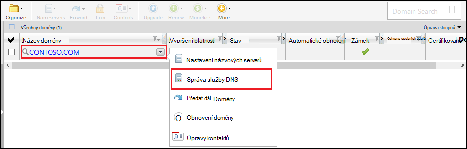
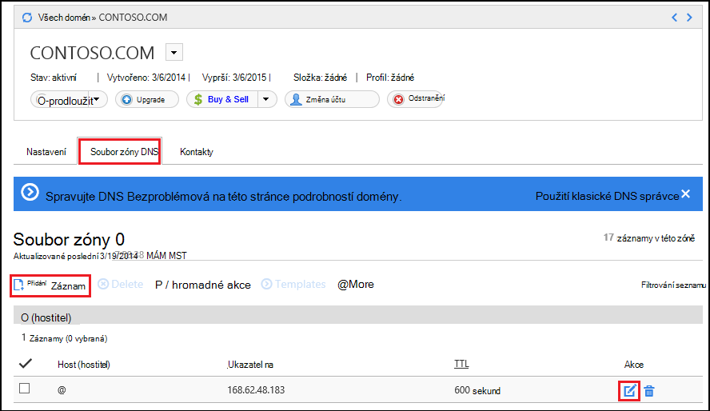
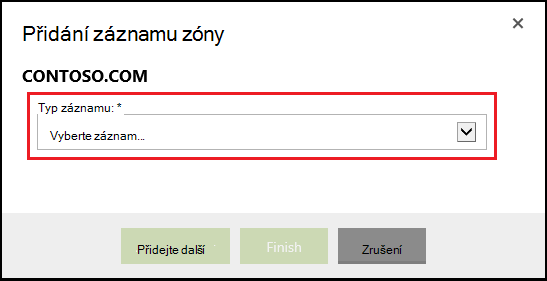
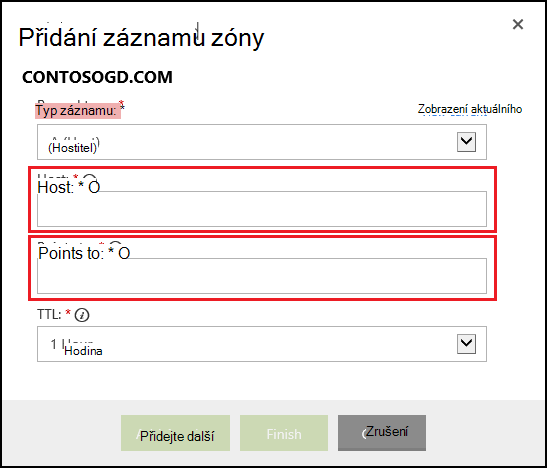

<properties
    pageTitle="Konfigurace vaší vlastní doménou v aplikaci služby Azure (GoDaddy)"
    description="Naučte se používat název domény od GoDaddy s Azure Web Apps"
    services="app-service"
    documentationCenter=""
    authors="erikre"
    manager="wpickett"
    editor="jimbe"/>

<tags
    ms.service="app-service"
    ms.workload="na"
    ms.tgt_pltfrm="na"
    ms.devlang="na"
    ms.topic="article"
    ms.date="01/12/2016"
    ms.author="cephalin"/>

# Konfigurace vaší vlastní doménou v aplikaci služby Azure (Koupeno přímo z GoDaddy)

[AZURE.INCLUDE [web-selector](../../includes/websites-custom-domain-selector.md)]

[AZURE.INCLUDE [intro](../../includes/custom-dns-web-site-intro.md)]

Pokud jste zakoupili doméně přes Azure aplikace služby Web Apps přečtěte posledním kroku [Nákup domény pro Web Apps](custom-dns-web-site-buydomains-web-app.md).

Tento článek obsahuje pokyny k použití názvu vlastní domény, kterou jste si koupili přímo od [GoDaddy](https://godaddy.com) s [Aplikací služby Web Apps](http://go.microsoft.com/fwlink/?LinkId=529714).

[AZURE.INCLUDE [introfooter](../../includes/custom-dns-web-site-intro-notes.md)]

##Principy záznamy DNS

[AZURE.INCLUDE [understandingdns](../../includes/custom-dns-web-site-understanding-dns-raw.md)]

## Přidejte záznam DNS pro vaši vlastní doménu

Přiřazenou vaší vlastní domény do webových aplikací v aplikaci služby, musíte přidáte novou položku v tabulce DNS pro vaši vlastní doménu pomocí nástroje poskytnuté GoDaddy. Pomocí následujících kroků vyhledejte nástroje DNS pro webu GoDaddy.com

1. Přihlaste se ke svému účtu pomocí webu GoDaddy.com a vyberte **Můj účet** a potom **Spravovat moje domény**. Nakonec vyberte rozevírací nabídku pro název domény, který chcete použít Azure webovou aplikaci a potom vyberte **Spravovat službu DNS**.

    

2. Na stránce **Podrobnosti doménu** přejděte na kartu **Soubor zóny DNS** . Toto je v části použít pro přidávání a úpravy záznamů DNS pro váš název domény.

    

    Vyberte **Přidat záznam** pro přidání stávajícího záznamu.

    Chcete-li **Upravit** existující záznam vyberte ikonu pera a papír vedle záznamu.

    > [AZURE.NOTE] Před přidáním nové záznamy, Všimněte si, že GoDaddy již vytvořili DNS záznamy pro oblíbené subdomény (jen v editoru **hostitele** ) jako jsou ** **e-mailu**, **soubory**a ostatní**. Pokud název, který chcete použít už existuje, upravte existující záznam místo abyste vytvářeli novou.

4. Při přidání záznamu, musíte nejdřív vybrat typ záznamu.

    

    Další, je nutné zadat **hostitele** (vlastní doménu nebo subdomény) a jaké **odkazuje na**.

    

    * Při přidání **záznamu (hostitel)** : nastavte v poli **hostitele** buď **@** (představuje název kořenové domény, například **contoso.com**) *(zástupný znak shody více dílčích domén) nebo dílčí doménu chcete použít (například * *www**.) Je třeba nastavit * *odkazuje na** pole k IP adrese Azure webovou aplikaci.

    * Při přidání **záznamu CNAME (alias)** – nastavte pole **hostitele** na dílčí doménu, kterou chcete použít. Například **www**. Nastavte v poli **odkazuje na** **. azurewebsites.net** název domény Azure web appu. Například **contoso.azurewebsites.net**.

5. Klikněte na **Přidat další**.
6. Vyberte jako typ záznamu **TXT** a potom zadejte hodnotu **Host** **@** a hodnotu **ukazatel na** ** &lt;yourwebappname&gt;. azurewebsites.net**.

    > [AZURE.NOTE] Tohoto záznamu TXT používá Azure k ověření vlastnictví domény označená záznam a nebo první záznam TXT. Jakmile se doména má namapovat k web appu na portálu Azure, je možné odebrat tuto položku záznamu TXT.

5. Po dokončení přidávání nebo úpravě záznamů, klikněte na tlačítko **Dokončit** uložte změny.

## Povolení název domény na svoji webovou aplikaci

[AZURE.INCLUDE [modes](../../includes/custom-dns-web-site-enable-on-web-site.md)]

>[AZURE.NOTE] Pokud chcete začít pracovat s aplikaci služby Azure před registrací účet Azure, přejděte na [Zkuste aplikaci služby](http://go.microsoft.com/fwlink/?LinkId=523751), které můžete okamžitě vytvořit web appu krátkodobý starter v aplikaci služby. Žádné povinné; kreditní karty žádné závazky.

## Co se změnilo
* Průvodce na změnu z webů pro aplikaci služby v tématu: [aplikaci služby Azure a jeho dopad na existující služby Azure](http://go.microsoft.com/fwlink/?LinkId=529714)
