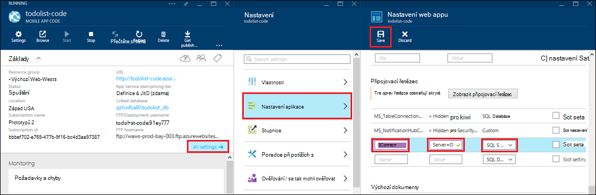

<properties 
    pageTitle="Access místních zdrojů pomocí hybridní připojení aplikace služby Azure" 
    description="Vytvoření připojení mezi web app v aplikaci služby Azure a místních prostředek, který používá statického přístavu TCP" 
    services="app-service" 
    documentationCenter="" 
    authors="cephalin" 
    manager="wpickett" 
    editor="mollybos"/>

<tags 
    ms.service="app-service" 
    ms.workload="na" 
    ms.tgt_pltfrm="na" 
    ms.devlang="na" 
    ms.topic="article" 
    ms.date="02/03/2016" 
    ms.author="cephalin"/>

#Access místních zdrojů pomocí hybridní připojení aplikace služby Azure

Aplikace pro aplikaci služby Azure můžete připojit k žádné místní prostředek, který používá statické TCP portu, například SQL serveru, MySQL, rozhraní API webových HTTP a většina vlastní webové služby. V tomto článku se dozvíte, jak vytvořit hybridní připojení mezi službou aplikace a k místní databázi SQL Server.

> [AZURE.NOTE] Web Apps část funkce hybridního připojení je k dispozici pouze v [Portálu Azure](https://portal.azure.com). Vytvoření připojení služby BizTalk najdete v tématu [Hybridní připojení](http://go.microsoft.com/fwlink/p/?LinkID=397274). 
> 
> Tento obsah se týká rovněž mobilní aplikace v aplikaci služby Azure. 

## Zjistit předpoklady pro
- Předplatné Azure. Neváhejte najdete v článku [Bezplatnou zkušební verzi Azure](https://azure.microsoft.com/pricing/free-trial/). 
 
    Pokud chcete začít pracovat s aplikaci služby Azure před registrací účet Azure, přejděte na [Zkuste aplikaci služby](http://go.microsoft.com/fwlink/?LinkId=523751), které můžete okamžitě vytvořit web appu krátkodobý starter v aplikaci služby. Žádné povinné; kreditní karty žádné závazky.

- Používat databázi serveru SQL Server nebo SQL Server Express místní hybridní připojení, je potřeba povolit na statického přístavu TCP/IP. Protože používá statického přístavu 1433 se doporučuje použít výchozí instanci na serveru SQL Server. Informace o instalaci a konfiguraci SQL serveru Express pro použití s připojením k hybridní najdete v tématu [připojit k serveru SQL místní z webu Azure pomocí hybridní připojení](http://go.microsoft.com/fwlink/?LinkID=397979).

- Počítač, na kterém nainstalujete agenta místní hybridní Connection Manager popsané dál v tomto článku:

    - Musí se připojit k Azure přes port 5671
    - Musí mít přístup *hostname*:*Číslo_portu* místního zdroje. 

> [AZURE.NOTE] Kroky v tomto článku se předpokládá, že používáte prohlížeč z počítače, na kterém uspořádá agenta místní hybridní připojení.

## Vytvoření webové aplikace v portálu Azure ##

> [AZURE.NOTE] Pokud už jste vytvořili v prohlížeči nebo mobilní aplikaci back-end na portálu Azure, který chcete použít pro účely tohoto návodu, můžete přeskočit a přejít k [Vytvoření hybridního připojení a služba BizTalk](#CreateHC) a začněte tady.

1. V levém horním rohu na [Portál Azure](https://portal.azure.com)klikněte na **Nový** > **Web + Mobile** > **Web Appu**.
    
    ![Nové webové aplikace][NewWebsite]
    
2. Na zásuvné **Web appu** zadejte její adresu URL a klikněte na **vytvořit**. 
    
    ![Název webu][WebsiteCreationBlade]
    
3. Za několik okamžiků web appu se vytvoří a zobrazí se jeho zásuvné web app. Zásuvné je svisle posuvné řídicí panel, který umožňuje spravovat svůj web.
    
    ![Web s][WebSiteRunningBlade]
    
4. Abyste ověřili, že je tento web živou, můžete klepnutím na ikonu **Procházet** zobrazíte výchozí stránky.
    
    ![Klikněte na Procházet a najdete v článku webovou aplikaci][Browse]
    
    ![Výchozí web app stránky][DefaultWebSitePage]
    
Vytvoříte dál hybridní připojení a BizTalk služby pro web app.

## Vytvoření hybridní připojení a služba BizTalk ##

1. Ve vaší webové aplikace zásuvné klikněte na možnost **všechny nastavení** > **sítě** > **Konfigurace koncové body vaší hybridní připojení**.
    
    ![Hybridní připojení][CreateHCHCIcon]
    
2. Na zásuvné hybridní připojení klikněte na **Přidat**.
    
    <!-- ![Add a hybrid connnection][CreateHCAddHC]
-->
    
3. **Přidání připojení ke hybridní** zásuvné otevře.  Protože to je první připojení hybridní, předvolená možnost **nové připojení hybridní** a otevře zásuvné **vytvořit hybridní připojení** .
    
    ![Vytvoření hybridní připojení][TwinCreateHCBlades]
    
    Na **zásuvné vytvořit hybridní připojení**:
    - **Název**zadejte název připojení.
    - **Název hostitele**zadejte název místní počítač, který je hostitelem vaší zdroje.
    - **Portu**zadejte číslo portu používané místních zdrojů (1433 pro výchozí instanci systému SQL Server).
    - Klikněte na **stránku mluvit služby**

4. **Vytvoření služba BizTalk** zásuvné otevře. Zadejte název pro službu BizTalk a potom klikněte na **OK**.
    
    ![Vytvoření BizTalk služby][CreateHCCreateBTS]
    
    **Vytvoření služba BizTalk** zásuvné zavře a vrátíte se k **Vytvoření hybridního připojení** zásuvné.
    
5. Na zásuvné připojení hybridní vytvořit klikněte na **OK**. 
    
    ![Klikněte na tlačítko OK][CreateBTScomplete]
    
6. Po dokončení procesu oznamovací oblasti na portálu budete úspěšně vytvořili připojení.
    <!---úkol

    Všechno, co napoprvé tento krok. Služba BizTalk nelze vytvořit v portálu dogfood. Přejděte na portál klasické (úplné portálu) a vytvoření služba BizTalk, ale zdá umožňují spojovacích je – po dokončení kroku vytvořit hybridní připojení, se zobrazí chybová zpráva se nepodařilo vytvořit hybridní připojení RelecIoudHC. Typ zdroje nebyl nalezen v oboru "Microsoft.BizTaIkServices pro rozhraní api verze 2014-06-01".
    
    Tato chyba signalizuje, že nelze najít typ, ne instanci systému.
    ![Upozornění na úspěšné][CreateHCSuccessNotification]
    -->
7. Na web appu zásuvné ikonu **hybridní připojení** teď se zobrazí vytvořené 1 hybridní připojení.
    
    ![Vytvořeno jeden hybridní připojení][CreateHCOneConnectionCreated]
    
V tomto okamžiku jste dokončili důležitou součástí infrastruktury cloudu hybridní připojení. Pak vytvoříte odpovídající konkrétní místní.

## Instalace místní hybridní Connection Manager dokončete připojení ##

1. Na zásuvné web appu klikněte na **všechna nastavení** > **sítě** > **Konfigurace koncové body vaší hybridní připojení**. 
    
    ![Ikona připojení hybridní][HCIcon]
    
2. Na zásuvné **hybridní připojení** se zobrazí sloupci **Stav** u nedávno přidaného koncový bod **nejste připojení**. Klikněte na požadované připojení ji nakonfigurovat.
    
    ![Nejste připojení][NotConnected]
    
    Otevře se zásuvné hybridní připojení.
    
    ![NotConnectedBlade][NotConnectedBlade]
    
3. Na zásuvné klikněte na příkaz **Vzhled posluchače**.
    
    ![Klikněte na příkaz Vzhled posluchače][ClickListenerSetup]
    
4. Otevře se zásuvné **hybridní vlastnosti připojení** . V části **Místní hybridní Connection Manager**zvolte **klikněte sem a nainstalujte**.
    
    ![Instalace po kliknutí sem][ClickToInstallHCM]
    
5. V aplikaci spustit zabezpečení dialogové okno s upozorněním zvolte **Spustit** pokračovat.
    
    ![Vyberte spustit pokračujte][ApplicationRunWarning]
    
6.  V dialogovém okně **Řízení uživatelských účtů** vyberte **Ano**.
    
    ![Klepněte na tlačítko Ano][UAC]
    
7. Hybridní Connection Manager je stáhnout a nainstalovaný za vás. 
    
    ![Instalace][HCMInstalling]
    
8. Po dokončení instalace klikněte na **Zavřít**.
    
    ![Klikněte na tlačítko Zavřít][HCMInstallComplete]
    
    Ve sloupci **Stav** na zásuvné **hybridní připojení** nyní zobrazuje **Připojit**. 
    
    ![Připojení stavu][HCStatusConnected]

Teď infrastruktury připojení hybridní dokončení, můžete vytvořit hybridní aplikaci, která použije. 

>[AZURE.NOTE]V následujících částech předvedení použití hybridního připojení sebou máte projekt back-end mobilní aplikace .NET.

## Konfigurace projektu back-end mobilní aplikace .NET pro připojení k databázi serveru SQL Server

V aplikaci služby projektu back-end mobilní aplikace .NET se jenom ASP.NET webovou aplikaci pomocí další mobilní aplikace SDK nainstalovaný a inicializován. Jako backendovou aplikací Mobile použít webovou aplikaci, musíte [Stáhnout a inicializace back-end Mobile aplikace .NET SDK](../app-service-mobile/app-service-mobile-dotnet-backend-how-to-use-server-sdk.md#install-sdk).  

K aplikacím Mobile musíte taky definovat připojovací řetězec pro místní databázi a změnit back-end použít toto připojení. 

1. V Průzkumníku ve Visual Studiu Web.config soubor otevřen pro mobilní aplikaci .NET backendovou, vyhledejte oddíl **connectionStrings** , přidejte novou položku SqlClient jako následující příkaz, který odkazuje na místní databázi SQL serveru:

        <add name="OnPremisesDBConnection"
         connectionString="Data Source=OnPremisesServer,1433;
         Initial Catalog=OnPremisesDB;
         User ID=HybridConnectionLogin;
         Password=<**secure_password**>;
         MultipleActiveResultSets=True"
         providerName="System.Data.SqlClient" />

    Nezapomeňte nahradit `<**secure_password**>` do tohoto řetězce heslem jste vytvořili pro *HybridConnectionLogin*.

3. Klepněte na tlačítko **Uložit** ve Visual Studiu uložte nastavení(Web.config)).

    > [AZURE.NOTE]Toto nastavení připojení se používá při spuštění v místním počítači. Při spuštění v Azure, toto nastavení je přepsat nastavením připojení definován na portálu.

4. Rozbalte složku **modely** a otevřete soubor datového modelu, které končí na *Context.cs*.

6. Úprava konstruktor instance **DbContext** předat hodnotu `OnPremisesDBConnection` základní **DbContext** konstruktoru, podobně jako následující fragment kódu:

        public class hybridService1Context : DbContext
        {
            public hybridService1Context()
                : base("OnPremisesDBConnection")
            {
            }
        }

    Služba nyní používat nové připojení k databázi serveru SQL Server.

## Aktualizace aplikace Mobile back-end použít místní připojovací řetězec

Pak budete muset přidat aplikaci nastavení pro tento nový připojovací řetězec, aby mohou sloužit z Azure.  

1. Zpátky v [Azure portál](https://portal.azure.com) v kódu back-end webové aplikace pro mobilní aplikaci klikněte na **všechna nastavení**a pak **Nastavení aplikace**.

3. V **Nastavení Web appu** zásuvné přejděte **připojovací řetězec** a přidejte nový řetězec připojení **SQL serveru** s názvem `OnPremisesDBConnection` s hodnotou jako `Server=OnPremisesServer,1433;Database=OnPremisesDB;User ID=HybridConnectionsLogin;Password=<**secure_password**>`.

    Nahrazení `<**secure_password**>` zabezpečené heslem pro místní databázi.

    

2. Stisknutím klávesy **Uložit** uložíte hybridních připojení a připojovací řetězec, který jste právě vytvořili.

V tomto okamžiku můžete publikovat project serveru a otestujte nové připojení s existující aplikace mobilní klienty. Dat bude číst a zapisovat do místní databáze pomocí připojení hybridní.

## Další kroky ##

- Informace o vytváření ASP.NET webové aplikace, která používá připojení hybridní najdete v tématu [připojit k serveru SQL místní z webu Azure pomocí hybridní připojení](http://go.microsoft.com/fwlink/?LinkID=397979). 

### Další zdroje informací

[Přehled hybridní připojení](http://go.microsoft.com/fwlink/p/?LinkID=397274)

[Josh zákrutu představuje hybridní připojení (video Channel 9)](http://channel9.msdn.com/Shows/Azure-Friday/Josh-Twist-introduces-hybrid-connections)

[Hybridní připojení na webu](https://azure.microsoft.com/services/biztalk-services/)

[BizTalk služby: Karty řídicích panelů, Monitor, měřítko, konfigurace a hybridní připojení](../biztalk-services/biztalk-dashboard-monitor-scale-tabs.md)

[Vytvoření hybridní Obláčkem reálný s bezproblémové aplikace přenosnost (Channel 9 video)](http://channel9.msdn.com/events/TechEd/NorthAmerica/2014/DCIM-B323#fbid=)

[Připojení k serveru SQL místní služby Azure mobilní použití hybridního připojení (video Channel 9)](http://channel9.msdn.com/Series/Windows-Azure-Mobile-Services/Connect-to-an-on-premises-SQL-Server-from-Azure-Mobile-Services-using-Hybrid-Connections)

## Co se změnilo
* Průvodce na změnu z webů pro aplikaci služby v tématu: [aplikaci služby Azure a jeho dopad na existující služby Azure](http://go.microsoft.com/fwlink/?LinkId=529714)

<!-- IMAGES -->
[New]:./media/web-sites-hybrid-connection-get-started/B01New.png
[NewWebsite]:./media/web-sites-hybrid-connection-get-started/B02NewWebsite.png
[WebsiteCreationBlade]:./media/web-sites-hybrid-connection-get-started/B03WebsiteCreationBlade.png
[WebSiteRunningBlade]:./media/web-sites-hybrid-connection-get-started/B04WebSiteRunningBlade.png
[Browse]:./media/web-sites-hybrid-connection-get-started/B05Browse.png
[DefaultWebSitePage]:./media/web-sites-hybrid-connection-get-started/B06DefaultWebSitePage.png
[CreateHCHCIcon]:./media/web-sites-hybrid-connection-get-started/C01CreateHCHCIcon.png
[CreateHCAddHC]:./media/web-sites-hybrid-connection-get-started/C02CreateHCAddHC.png
[TwinCreateHCBlades]:./media/web-sites-hybrid-connection-get-started/C03TwinCreateHCBlades.png
[CreateHCCreateBTS]:./media/web-sites-hybrid-connection-get-started/C04CreateHCCreateBTS.png
[CreateBTScomplete]:./media/web-sites-hybrid-connection-get-started/C05CreateBTScomplete.png
[CreateHCSuccessNotification]:./media/web-sites-hybrid-connection-get-started/C06CreateHCSuccessNotification.png
[CreateHCOneConnectionCreated]:./media/web-sites-hybrid-connection-get-started/C07CreateHCOneConnectionCreated.png
[HCIcon]:./media/web-sites-hybrid-connection-get-started/D01HCIcon.png
[NotConnected]:./media/web-sites-hybrid-connection-get-started/D02NotConnected.png
[NotConnectedBlade]:./media/web-sites-hybrid-connection-get-started/D03NotConnectedBlade.png
[ClickListenerSetup]:./media/web-sites-hybrid-connection-get-started/D04ClickListenerSetup.png
[ClickToInstallHCM]:./media/web-sites-hybrid-connection-get-started/D05ClickToInstallHCM.png
[ApplicationRunWarning]:./media/web-sites-hybrid-connection-get-started/D06ApplicationRunWarning.png
[UAC]:./media/web-sites-hybrid-connection-get-started/D07UAC.png
[HCMInstalling]:./media/web-sites-hybrid-connection-get-started/D08HCMInstalling.png
[HCMInstallComplete]:./media/web-sites-hybrid-connection-get-started/D09HCMInstallComplete.png
[HCStatusConnected]:./media/web-sites-hybrid-connection-get-started/D10HCStatusConnected.png
 