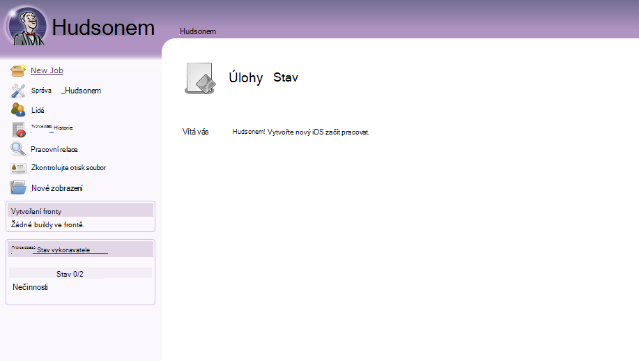
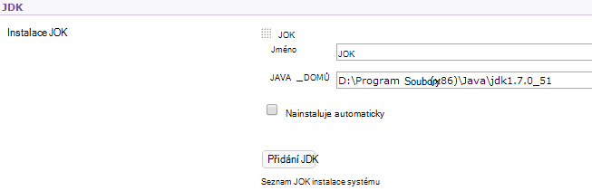
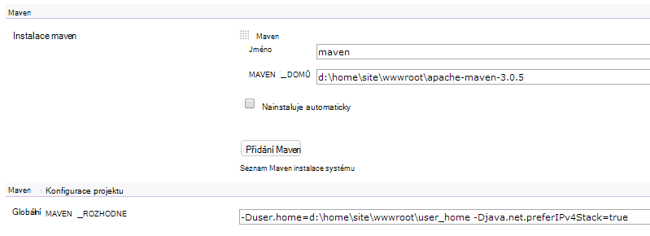

<properties 
    pageTitle="Uložit vlastní webové aplikace Java Azure" 
    description="Tento kurz se dozvíte, jak můžete odeslat vlastní webové aplikace Java Azure aplikace služby Web Apps." 
    services="app-service\web" 
    documentationCenter="java" 
    authors="rmcmurray" 
    manager="wpickett" 
    editor=""/>

<tags 
    ms.service="app-service-web" 
    ms.workload="web" 
    ms.tgt_pltfrm="na" 
    ms.devlang="Java" 
    ms.topic="article" 
    ms.date="08/11/2016" 
    ms.author="robmcm"/>

# Uložit vlastní webové aplikace Java Azure

Toto téma vysvětluje, jak nahrát vlastní webové aplikace Java k [Aplikaci služby Azure] Web Apps. Součástí jsou informace o vztahující se k některou Java web nebo web aplikaci a také několik příkladů pro konkrétní aplikace.

Všimněte si, že Azure umožňuje vytváření Java webových aplikací web apps pomocí portálu Azure konfigurace uživatelského rozhraní a Azure Marketplace, jak je uvedeno v [vytvořte Java webovou aplikaci pro aplikaci služby Azure](web-sites-java-get-started.md). Tento kurz je scénáře, které nechcete používat portál Azure konfigurace uživatelské rozhraní nebo Azure Marketplace.  

## Pokyny ke konfiguraci

V následujícím textu najdete nastavení pro vlastní webové aplikace Java na Azure.

- Port HTTP používaný procesu Java je dynamickou.  Proces musí používat port z prostředí proměnné `HTTP_PLATFORM_PORT`.
- Všechny porty poslech než jednoho posluchače HTTP by měly být zakázány.  V Tomcat, která obsahuje vypnutí, HTTPS a AJP porty.
- Kontejner, musí být nakonfigurované pro data typu IPv4 pouze.
- Příkaz **při spuštění** aplikace je třeba nastavit v konfiguraci.
- Aplikace, které vyžadují adresářů s napište oprávnění se musí být umístěné v Azure web appu adresář s obsahem, který je **D:\home**.  Proměnná prostředí `HOME` odkazuje na D:\home.  

Proměnné podle potřeby můžete nastavit v nastavení(Web.config)).

## Konfigurace httpPlatform Web.config

Tyto informace popisuje formátu **httpPlatform** v rámci web.config.
                                 
**argumenty** (Výchozí = ""). Argumenty spustitelný soubor nebo skriptu určené v nastavení **processPath** .

Příklady (viz s **processPath** zahrnutý):

    processPath="%HOME%\site\wwwroot\bin\tomcat\bin\catalina.bat"
    arguments="start"
    
    processPath="%JAVA_HOME\bin\java.exe"
    arguments="-Djava.net.preferIPv4Stack=true -Djetty.port=%HTTP\_PLATFORM\_PORT% -Djetty.base=&quot;%HOME%\site\wwwroot\bin\jetty-distribution-9.1.0.v20131115&quot; -jar &quot;%HOME%\site\wwwroot\bin\jetty-distribution-9.1.0.v20131115\start.jar&quot;"

**processPath** – cesta k spustitelný soubor nebo skript, který spustí proces naslouchají požadavků HTTP.

Příklady:

    processPath="%JAVA_HOME%\bin\java.exe"

    processPath="%HOME%\site\wwwroot\bin\tomcat\bin\startup.bat"

    processPath="%HOME%\site\wwwroot\bin\tomcat\bin\catalina.bat"
                                                                                       
**rapidFailsPerMinute** (Výchozí = 10.) Počet procesu podle **processPath** smí pád za minutu. Pokud toto omezení je překročena, **HttpPlatformHandler** přestanou se vám spuštění procesu pro zbytek minuty.
                                    
**requestTimeout** (Výchozí = "00: 02:00".) Doba trvání, pro které bude **HttpPlatformHandler** čekat odpověď procesu listening na `%HTTP_PLATFORM_PORT%`.

**startupRetryCount** (Výchozí = 10.) Počet **HttpPlatformHandler** pokusí o spuštění procesu podle **processPath**. V tématu **startupTimeLimit** další podrobnosti.

**startupTimeLimit** (Výchozí = 10 sekund.) Doba trvání, pro které bude **HttpPlatformHandler** čekat spustitelný soubor nebo skript, který chcete spustit proces přijímá požadavky na port.  Pokud tento časového limitu se **HttpPlatformHandler** ukončit proces a pokuste se otevřít znovu **startupRetryCount** časů.
                                                                                      
**stdoutLogEnabled** (Výchozí = "true".) Pokud platí, **stdout** a **stderr** procesu určené v nastavení **processPath** přesměrovaní na souboru zadaného v **stdoutLogFile** (viz oddíl **stdoutLogFile** ).
                                    
**stdoutLogFile** (Default="d:\home\LogFiles\httpPlatformStdout.log".) Absolutní cesta k souboru pro kterou se bude Zaprotokolují **stdout** a **stderr** procesu podle **processPath** .
                                    
> [AZURE.NOTE] `%HTTP_PLATFORM_PORT%`je speciální zástupného symbolu, který je potřeba zadat jako součást **argumenty** nebo jako součást seznamu **environmentVariables** **httpPlatform** . Tím se nahradí interně vygenerovaných port tak, že **HttpPlatformHandler** tak, aby proces stanovených **processPath** můžete přehrávat na tomto portu.

## Nasazení

Webové aplikace založené na Java základě webové aplikace můžete snadno instalovaných prostřednictvím většina stejným způsobem, která se používají s informace služby (internetové).  FTP, libovolná a Kudu podporují jako mechanismy nasazení, jako je integrované funkce Správce služeb pro webové aplikace. WebDeploy funguje jako protokol, ale jako Java není vyvinuté ve Visual Studiu WebDeploy příliš velký s případy použití Java webové aplikace nasazení.

## Konfigurace aplikace příklady

Pro následující aplikace, soubor web.config a aplikace konfigurace má formu příklady ukazují, jak povolit aplikaci Java v aplikaci služby Web Apps.

### Tomcat
I když jsou dva různé varianty Tomcat, které jsou součástí aplikace služby Web Apps, lze přesto úplně nahrát konkrétní instance zákazníka. Níže je příklad instalace Tomcat se různé Java virtuálního počítače (JVM).

    <?xml version="1.0" encoding="UTF-8"?>
    <configuration>
      <system.webServer>
        <handlers>
          <add name="httpPlatformHandler" path="*" verb="*" modules="httpPlatformHandler" resourceType="Unspecified" />
        </handlers>
        <httpPlatform processPath="%HOME%\site\wwwroot\bin\tomcat\bin\startup.bat" 
            arguments="">
          <environmentVariables>
            <environmentVariable name="CATALINA_OPTS" value="-Dport.http=%HTTP_PLATFORM_PORT%" />
            <environmentVariable name="CATALINA_HOME" value="%HOME%\site\wwwroot\bin\tomcat" />
            <environmentVariable name="JRE_HOME" value="%HOME%\site\wwwroot\bin\java" /> <!-- optional, if not specified, this will default to %programfiles%\Java -->
            <environmentVariable name="JAVA_OPTS" value="-Djava.net.preferIPv4Stack=true" />
          </environmentVariables>
        </httpPlatform>
      </system.webServer>
    </configuration>

Na straně Tomcat existuje několik změny konfigurace, které je potřeba provést. Server.xml, musí být upravit nastavení:

-   Vypnutí port = -1
-   Port spojnice HTTP = ${port.http}
-   Adresa spojnice HTTP = "127.0.0.1"
-   Poznámky HTTPS a AJP spojnic
-   Nastavení protokolu IPv4 lze také nastavit v souboru catalina.properties, které můžete přidat`java.net.preferIPv4Stack=true`
    
Volání Direct3d nejsou podporovány v aplikaci služby Web Apps. Zakázání těch, přidejte následující možnosti jazyka Java připomínat aplikace tyto hovory:`-Dsun.java2d.d3d=false`

### Molo

Stejně jako v případě pro Tomcat, Zákazníci můžete nahrát své vlastní instance molo. V případě systém plná instalace molo, konfiguraci by vypadal takhle:

    <?xml version="1.0" encoding="UTF-8"?>
    <configuration>
      <system.webServer>
        <handlers>
          <add name="httppPlatformHandler" path="*" verb="*" modules="httpPlatformHandler" resourceType="Unspecified" />
        </handlers>
        <httpPlatform processPath="%JAVA_HOME%\bin\java.exe" 
             arguments="-Djava.net.preferIPv4Stack=true -Djetty.port=%HTTP_PLATFORM_PORT% -Djetty.base=&quot;%HOME%\site\wwwroot\bin\jetty-distribution-9.1.0.v20131115&quot; -jar &quot;%HOME%\site\wwwroot\bin\jetty-distribution-9.1.0.v20131115\start.jar&quot;"
            startupTimeLimit="20"
          startupRetryCount="10"
          stdoutLogEnabled="true">
        </httpPlatform>
      </system.webServer>
    </configuration>

Konfigurace molo musí změnit start.ini nastavení `java.net.preferIPv4Stack=true`.

### Springboot
Abyste mohli získávat Springboot aplikace, budete muset umístěte vložit ovládací prvek SKLENICE nebo WAR a přidejte následující nastavení(Web.config)). Nastavení(Web.config)) přejde do složky kořenových. V web.config upravte argumenty tak, aby ukazovaly na SKLENICE soubor, v následujícím příkladu SKLENICE soubor je umístěn ve složce kořenových.  

    <?xml version="1.0" encoding="UTF-8"?>
    <configuration>
      <system.webServer>
        <handlers>
          <add name="httpPlatformHandler" path="*" verb="*" modules="httpPlatformHandler" resourceType="Unspecified" />
        </handlers>
        <httpPlatform processPath="%JAVA_HOME%\bin\java.exe"
            arguments="-Djava.net.preferIPv4Stack=true -Dserver.port=%HTTP_PLATFORM_PORT% -jar &quot;%HOME%\site\wwwroot\my-web-project.jar&quot;">
        </httpPlatform>
      </system.webServer>
    </configuration>

### Hudsonem

Testovacím používá war Hudsonem 3.1.2 a výchozí instanci Tomcat 7.0.50, ale bez použití uživatelského rozhraní nastavit jednotlivé položky.  Vzhledem k tomu Hudsonem nástrojem sestavení softwaru, doporučuje nainstalovat na vyhrazené případy, kdy může příznak **AlwaysOn** nastavená na web appu.

1. V kořenovém adresáři webovou aplikaci, tedy **d:\home\site\wwwroot**, vytvořte **webapps** adresář (pokud už existuje) a umístěte Hudson.war **d:\home\site\wwwroot\webapps**.
2. Stáhněte si apache maven 3.0.5 (kompatibilní s Hudsonem) a jeho umístění v **d:\home\site\wwwroot**.
3. Vytvoření web.config v **d:\home\site\wwwroot** a vložte následující obsah:
    
        <?xml version="1.0" encoding="UTF-8"?>
        <configuration>
          <system.webServer>
            <handlers>
              <add name="httppPlatformHandler" path="*" verb="*" 
        modules="httpPlatformHandler" resourceType="Unspecified" />
            </handlers>
            <httpPlatform processPath="%AZURE_TOMCAT7_HOME%\bin\startup.bat"
        startupTimeLimit="20"
        startupRetryCount="10">
        <environmentVariables>
          <environmentVariable name="HUDSON_HOME" 
        value="%HOME%\site\wwwroot\hudson_home" />
          <environmentVariable name="JAVA_OPTS" 
        value="-Djava.net.preferIPv4Stack=true -Duser.home=%HOME%/site/wwwroot/user_home -Dhudson.DNSMultiCast.disabled=true" />
        </environmentVariables>            
            </httpPlatform>
          </system.webServer>
        </configuration>

    V tomto okamžiku web appu můžete restartovat provádět změny.  Připojení k http://yourwebapp/hudson zahájíte Hudsonem.

4. Po Hudsonem automaticky nakonfiguruje, měli byste vidět na následující obrazovce:

    
    
5. Přístup ke stránce konfigurace Hudsonem: klikněte na **Spravovat Hudsonem**a klikněte na **Konfigurovat systému**.
6. Konfigurace JDK, jak je ukázáno v následujícím příkladu:

    

7. Konfigurace Maven, jak je ukázáno v následujícím příkladu:

    

8. Uložení nastavení. Hudsonem by se měla nakonfigurován a je připraven k použití.

Další informace o Hudsonem najdete v tématu [http://hudson-ci.org](http://hudson-ci.org).

### Liferay

Liferay je podporované v aplikaci služby Web Apps. Protože Liferay můžete vyžadují paměť o významné, web appu, musí běžet střední nebo velký vyhrazené pracovník, které můžete poskytují dostatek paměti. Liferay také trvá otevřou několik minut. Proto doporučujeme nastavení web appu k **Vždy na**.  

Použití Liferay 6.1.2, které komunity Edition GA3 kombinovaný s Tomcat, následující soubory upravená po stažení Liferay:

**Server.XML**

- Změna vypnutí port -1.
- Změna HTTP spojnice tak, aby      `<Connector port="${port.http}" protocol="HTTP/1.1" connectionTimeout="600000" address="127.0.0.1" URIEncoding="UTF-8" />`
- Poznámky AJP spojnice.

Ve složce **liferay\tomcat-7.0.40\webapps\ROOT\WEB-INF\classes** vytvořte do souboru nazvaného **portál ext.properties**. Tento soubor, musí obsahovat jeden řádek, jak je znázorněno zde:

    liferay.home=%HOME%/site/wwwroot/liferay

Na stejné úrovni adresáře jako je složka tomcat 7.0.40 vytvořte do souboru nazvaného **web.config** následující obsahu:

    <?xml version="1.0" encoding="UTF-8"?>
    <configuration>
      <system.webServer>
        <handlers>
    <add name="httpPlatformHandler" path="*" verb="*"
         modules="httpPlatformHandler" resourceType="Unspecified" />
        </handlers>
        <httpPlatform processPath="%HOME%\site\wwwroot\tomcat-7.0.40\bin\catalina.bat" 
                      arguments="run" 
                      startupTimeLimit="10" 
                      requestTimeout="00:10:00" 
                      stdoutLogEnabled="true">
          <environmentVariables>
      <environmentVariable name="CATALINA_OPTS" value="-Dport.http=%HTTP_PLATFORM_PORT%" />
      <environmentVariable name="CATALINA_HOME" value="%HOME%\site\wwwroot\tomcat-7.0.40" />
            <environmentVariable name="JRE_HOME" value="D:\Program Files\Java\jdk1.7.0_51" /> 
            <environmentVariable name="JAVA_OPTS" value="-Djava.net.preferIPv4Stack=true" />
          </environmentVariables>
        </httpPlatform>
      </system.webServer>
    </configuration>

V části blokování **httpPlatform** **requestTimeout** nastavena na "00:10:00".  Můžete sníží ale pak budete pravděpodobně zobrazíte některé chyby vypršení časového limitu během zavádění Liferay.  Pokud se změní tuto hodnotu, takže pak **connectionTimeout** v tomcat server.xml také třeba změnit.  

Je vhodné poznamenat, že JRE_HOME environnment varariable podle výše uvedených web.config tak, aby ukazovaly JDK 64bitová verze. Výchozí hodnota je 32bitová verze, ale od Liferay může vyžadovat vysoké úrovně paměti, je vhodné použít JDK 64bitová verze.

Po provedení těchto změn restartujte vaší webové aplikace pro systém Liferay, otevřete http://yourwebapp. Portál Liferay je k dispozici v kořenovém web app. 

## Další kroky

Další informace o Liferay najdete v tématu [http://www.liferay.com](http://www.liferay.com).

Další informace o Java naleznete v článku [Středisko pro vývojáře Java](/develop/java/).

[AZURE.INCLUDE [app-service-web-whats-changed](../../includes/app-service-web-whats-changed.md)]

[AZURE.INCLUDE [app-service-web-try-app-service](../../includes/app-service-web-try-app-service.md)]
 
 
<!-- External Links -->
[Azure aplikace služby]: http://go.microsoft.com/fwlink/?LinkId=529714
