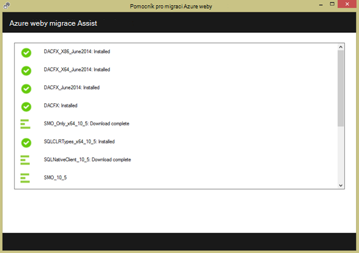
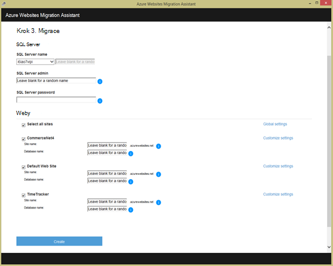

<properties 
    pageTitle="Migrace webovou aplikaci podnikové aplikaci služby Azure" 
    description="Ukazuje, jak pomocí webových aplikací migrací pomocníka rychle migrovat stávající webů služby IIS do Azure aplikace služby Web Apps" 
    services="app-service" 
    documentationCenter="" 
    authors="cephalin" 
    writer="cephalin" 
    manager="wpickett" 
    editor=""/>

<tags 
    ms.service="app-service" 
    ms.workload="na" 
    ms.tgt_pltfrm="na" 
    ms.devlang="na" 
    ms.topic="article" 
    ms.date="07/01/2016" 
    ms.author="cephalin"/>

# Migrace webovou aplikaci podnikové aplikaci služby Azure

Můžete snadno přenést svůj existující weby, které spustit na informace služby Internetové informační 6 nebo novější pro [Aplikaci služby Web Apps](http://go.microsoft.com/fwlink/?LinkId=529714). 

>[AZURE.IMPORTANT] Windows Server 2003 konci support na 14 červenec 2015. Pokud jsou aktuálně hostuje vaše weby na serveru IIS, která je Windows Server 2003, Web Apps je minimum rizika, minimum náklady a nízkým třením způsob, jak zabránit weby online a webových aplikací migrací pomocníka pomáhají automatizovat procesu migrace. 

[Webových aplikací migrací pomocníka](https://www.movemetothecloud.net/) analyzovat instalaci serveru IIS, můžete určit servery, které můžete migrovat do aplikace služby prvky, které nelze migrovat nebo jsou podporovány na platformě zvýraznit a pak migraci vaše weby a přidružené databáze do Azure.

[AZURE.INCLUDE [app-service-web-to-api-and-mobile](../../includes/app-service-web-to-api-and-mobile.md)]

## Prvky ověření během analýzy funkce pro kompatibilitu ##
Pomocník pro migrace vytvoří sestavu připravenosti k identifikaci možné příčiny oznámení o znepokojení nebo blokování problémy, které můžou bránit programu úspěšně migrovat z místního serveru IIS na Azure aplikace služby Web Apps. Některé klíčové položky nějaká jsou:

-   Port vazeb – webové aplikace podporuje pouze Port 80 protokolu HTTP a Port 443 přenosů HTTPS. Konfigurace jiný port bude ignorována a bude směrovat přenosy 80 a 443. 
-   Ověřování – webové aplikace podporuje anonymní přístup ve výchozím nastavení a ověřování pomocí formulářů kde nastavil aplikace. Ověřování systému Windows může používat jenom integrace s Azure Active Directory a služby AD FS. Všechny jinými formami ověřování – například základní ověřování – aktuálně nepodporuje. 
-   Globální mezipaměti sestavení (GAC) – GAC není podporována ve webových aplikacích. Pokud aplikace odkazuje sestav, které obvykle nasadíte GAC, budete muset nasadit do složky Koš aplikace ve webových aplikacích. 
-   IIS5 Režim kompatibility – tato možnost není podporována ve webových aplikacích. 
-   Fondy aplikací – Web Apps, jednotlivých webů a její podřízené aplikace spustit ve stejném fondu aplikací. Pokud má váš web více aplikací podřízené využití více fondů aplikací, je sloučit do jedné aplikace fondu s běžná nastavení nebo migrace jednotlivé aplikace do samostatných webových aplikací.
-   Součásti COM – Web Apps neumožňuje registrovat součástí COM na platformě. Pokud vaše weby nebo aplikací můžete využít všechny komponenty modelu COM, musíte revize v spravovaný kód a nasazení se web nebo aplikaci.
-   Filtry ISAPI – Web Apps můžete nepodporují ISAPI filtry. Potřebujete postupujte takto:
    -   nasazení DLL webovou aplikaci 
    -   registrace používání [Web.config](http://www.iis.net/configreference/system.webserver/isapifilters) knihoven DLL
    -   Umístěte soubor applicationHost.xdt v kořenovém webu s obsahem níže:

            <?xml version="1.0"?>
            <configuration xmlns:xdt="http://schemas.microsoft.com/XML-Document-Transform">
            <configSections>
                <sectionGroup name="system.webServer">
                  <section name="isapiFilters" xdt:Transform="SetAttributes(overrideModeDefault)" overrideModeDefault="Allow" />
                </sectionGroup>
              </configSections>
            </configuration>

        Další příklady použití transformací dokumentů XML s webem najdete v článku [transformace webu Microsoft Azure](http://blogs.msdn.com/b/waws/archive/2014/06/17/transform-your-microsoft-azure-web-site.aspx).

-   Další součásti například SharePoint a rozšíření serveru FrontPage (FPSE), FTP, migrovat nebude certifikáty SSL.

## Jak s použitím pomocníka webových aplikací migrací ##
Tento oddíl kroky až příklad k migrace několika weby používající databáze SQL serveru a spuštěné v počítači místní Windows Server 2003 R2 (IIS 6.0):

1.  Na serveru IIS nebo klientském počítači přejděte na [https://www.movemetothecloud.net/](https://www.movemetothecloud.net/) 

    

2.  Nainstalujte webových aplikací migrací pomocníka kliknutím na tlačítko **Snaží serveru IIS** . Další možnosti budou možnosti nevidět. 
4.  Klikněte na tlačítko **Nainstalovat nástroj** nainstalovat webových aplikací migrací pomocníka ve vašem počítači.

    

    >[AZURE.NOTE] Můžete také kliknutím na tlačítko **Stáhnout pro offline nainstalovat** stažení souboru ZIP při instalaci na serverech nejste připojení k Internetu. Nebo můžete kliknout na **Nahrát existující sestavy připravenosti migrace**, který je upřesňující možnosti práce s existující migrace připravenosti sestavy, které jste dříve vygenerovali (vysvětleno dále).

5.  Na obrazovce pro **Instalaci aplikací** klikněte na nainstalovat na počítač **nainstalovat** . Je také nainstaluje odpovídající závislosti například nasazení webu DacFX a služby IIS, v případě potřeby. 

    

    Po instalaci webových aplikací migrací pomocníka spustí automaticky.
  
6.  Zvolte **migrace sítě a databází ze na vzdálený server Azure**. Zadejte přihlašovací údaje pro správu pro vzdálený server a klikněte na **pokračovat**. 

    

    Samozřejmě můžete migrovat z místního serveru. Vzdálené možnost je užitečná, když chcete migrovat weby ze serveru IIS výroby.
 
    V tomto okamžiku bude kontrola nástroje pro migraci serveru IIS konfigurace, například weby, aplikace, fondy aplikací a závislosti identifikovat candidate weby pro migraci. 

8.  Následující obrázek ukazuje tři weby – **výchozí web** **TimeTracker**a **CommerceNet4**. Všechny uvedené máte přidružené databáze, které chceme, které se mají migrovat. Vyberte všechny weby, které se mají vyhodnotit a pak klikněte na **Další**.

    
 
9.  Klikněte na **Odeslat** na Odeslat zprávu o přípravu. Pokud kliknete na tlačítko **Uložit místně**, můžete později spuštění nástroje pro migraci a odeslat zprávu uložené připravenosti výše uvedených hodnot.

    
 
    Jakmile odeslat zprávu připravenosti Azure provádí připravenosti analýzu a zobrazí výsledky. Podrobné informace hodnocení pro každý web a ujistěte se, pochopit nebo vyřešili všechny problémy, než budete pokračovat. 
 
    

12. Klikněte na **Začít migrace** zahájení migrace. Teď budou přesměrováni na Azure přihlásit ke svému účtu. Je důležité přihlásit pomocí účtu, který má aktivní předplatné Azure. Pokud nemáte účet Azure potom můžou registraci bezplatnou zkušební verzi [tady](https://azure.microsoft.com/pricing/free-trial/?WT.srch=1&WT.mc_ID=SEM_). 

13. Vyberte účet klienta, předplatné Azure a oblasti, kterou chcete použít pro migrované Azure webové aplikace a databáze a klikněte na **Spustit migraci**. Můžete vybrat weby na pozdější migrace.

    

14. Na další obrazovce můžete provedete změny výchozí nastavení migrace, například:

    - použít existující databázi SQL Azure nebo vytvořte novou databázi SQL Azure a konfigurace své přihlašovací údaje
    - Vyberte weby, které se mají migrovat
    - Definujte názvy pro Azure web apps a jejich propojené SQL databáze
    - Přizpůsobení nastavení úrovni webů a globálních nastavení

    Následující obrázek ukazuje všechny weby vybrané migrace s výchozím nastavením.

    

    >[AZURE.NOTE] zaškrtávací políčko **Povolit Azure Active Directory** v dialogovém okně Vlastní nastavení integruje Azure web appu s [Azure Active Directory](active-directory-whatis.md) ( **Výchozí adresář**). Další informace o synchronizaci Azure Active Directory službou Active Directory v místní najdete v článku [Integrace adresářů](http://msdn.microsoft.com/library/jj573653).

16.  Po provedení požadované změny, klikněte na **vytvořit** a spuštění migračního procesu. Nástroje pro migraci vytvoříte databázi SQL Azure a Azure web app a pak publikovat obsah webu a databází. Průběhu migrace jasně zobrazený nástroje pro migraci a uvidíte obrazovku Přehled na konci, které podrobnosti poštovním weby, jestli to byl úspěšný, odkazy na nově vytvořený Azure webových aplikacích. 

    V případě všechny chyby v průběhu migrace nástroje pro migraci jasně označí selhání a vrácení změn. Můžete se taky můžou odeslat zprávu o chybě přímo do engineering týmu po kliknutí na tlačítko **Odeslat zprávu o chybách** s zásobníku volání zachycený selhání a vytvořte text zprávy. 

    

    Pokud migrace povede bez chyb, můžete také kliknutím na tlačítko **Předat svůj názor** všechny názor přímo. 
 
20. Kliknutí na příslušné odkazy Azure webovými aplikacemi Web apps a ověřte, že migrace proběhla úspěšně.

21. Teď můžete spravovat migrované web apps v aplikaci služby Azure. K tomuto účelu Přihlaste se k [Portálu Azure](https://portal.azure.com).

22. Na portálu Azure otevřít Web Apps zásuvné zobrazíte vaše migrované weby (viz jako webové aplikace) a potom klikněte na kterékoli z nich správou web appu, například konfigurace nepřetržitý publikování, vytváření záloh neobsahovaly text a sledování použití a výkonu.

    

>[AZURE.NOTE] Pokud chcete začít pracovat s aplikaci služby Azure před registrací účet Azure, přejděte na [Zkuste aplikaci služby](http://go.microsoft.com/fwlink/?LinkId=523751), které můžete okamžitě vytvořit web appu krátkodobý starter v aplikaci služby. Žádné povinné; kreditní karty žádné závazky.

## Co se změnilo
* Průvodce na změnu z webů pro aplikaci služby v tématu: [aplikaci služby Azure a jeho dopad na existující služby Azure](http://go.microsoft.com/fwlink/?LinkId=529714)
 
