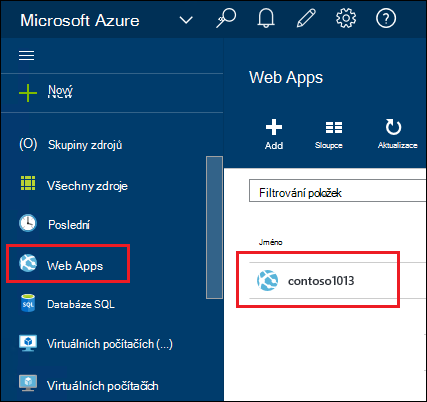
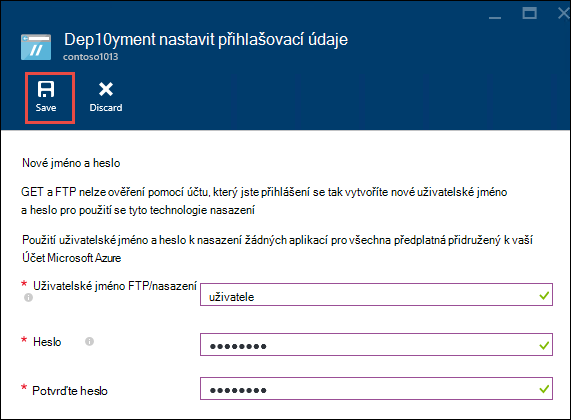
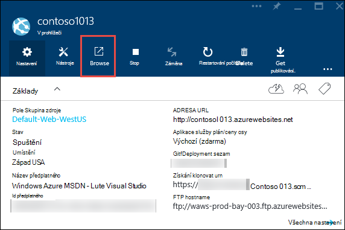
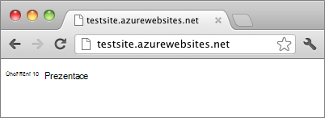

<properties
    pageTitle="Vytvoření webové aplikace Node.js v aplikaci služby Azure | Microsoft Azure"
    description="Naučte se nasadit aplikaci Node.js web app v aplikaci služby Azure."
    services="app-service\web"
    documentationCenter="nodejs"
    authors="rmcmurray"
    manager="wpickett"
    editor=""/>

<tags
    ms.service="app-service-web"
    ms.workload="web"
    ms.tgt_pltfrm="na"
    ms.devlang="nodejs"
    ms.topic="hero-article"
    ms.date="08/11/2016"
    ms.author="robmcm"/>

# Vytvoření webové aplikace Node.js v aplikaci služby Azure

> [AZURE.SELECTOR]
- [.NET](web-sites-dotnet-get-started.md)
- [Node.js](web-sites-nodejs-develop-deploy-mac.md)
- [Java](web-sites-java-get-started.md)
- [PHP - libovolná](web-sites-php-mysql-deploy-use-git.md)
- [PHP - FTP](web-sites-php-mysql-deploy-use-ftp.md)
- [Python](web-sites-python-ptvs-django-mysql.md)

Tento kurz ukazuje, jak vytvořit jednoduchý aplikaci [Node.js](http://nodejs.org) a nasadit na [web appu](app-service-web-overview.md) v [Aplikaci služby Azure](../app-service/app-service-value-prop-what-is.md) pomocí [Libovolná](http://git-scm.com). Pokyny v tomto kurzu může být zahájen v operačním systému, který může systém Node.js.

Se dozvíte:

* Jak vytvořit web appu v aplikaci služby Azure pomocí portálu Azure.
* Jak nasadit aplikaci Node.js web appu stisknutím do úložiště libovolná web appu.

Dokončené aplikace zapisuje krátké řetězec "Vítáme" do prohlížeče.

![Prohlížeč zprávou "Ahoj světe".][helloworld-completed]

Výukové programy a ukázkový kód s aplikacemi složitější Node.js nebo další témata o použití Node.js v Azure naleznete v článku [Středisko pro vývojáře Node.js](/develop/nodejs/).

> [AZURE.NOTE]
> Pro dokončení tohoto kurzu, třeba účet Microsoft Azure. Pokud nemáte účet, můžete [aktivovat své Visual Studio účastnická výhody](/en-us/pricing/member-offers/msdn-benefits-details/?WT.mc_id=A261C142F) nebo [zaregistrovat bezplatnou zkušební verzi](/en-us/pricing/free-trial/?WT.mc_id=A261C142F).
>
> Pokud chcete začít pracovat s aplikaci služby Azure před registraci účet Azure, přejděte na [Zkuste aplikaci služby](http://go.microsoft.com/fwlink/?LinkId=523751). Můžete okamžitě vytvořit web appu krátkodobý starter v aplikaci služby – bez platební kartou povinné a bez závazky.

## Vytvořit web appu a povolit libovolná publikování

Tímto postupem vytvořte webovou aplikaci pro aplikaci služby Azure a povolení libovolná publikování. 

[Libovolná](http://git-scm.com/) je systému správy verzí distribuované použitý pro nasazení webu Azure. Chcete ukládat kód, který napíšete pro webovou aplikaci v místním úložišti libovolná a budete nasadíte kódu Azure stisknutím do vzdálené úložiště. Tento způsob nasazení je funkce aplikací pro webovou aplikaci služby.  

1. Přihlaste se k [portálu Azure](https://portal.azure.com).

2. Klikněte na ikonu **+ Nový** horní levé části portálu Azure.

3. Klikněte na **Web + Mobile**a potom klikněte na **Web app**.

    ![][portal-quick-create]

4. Zadejte název pro web app v poli **v prohlížeči** .

    Tento název musí být jedinečný v doméně azurewebsites.net, protože bude adresa URL webové aplikace {název}. azurewebsites.net. Není-li zadané jméno jedinečné, zobrazí se v textovém poli červený vykřičník.

5. Vyberte **předplatné**.

6. **Pole Skupina zdroje** vyberte nebo vytvořte nový účet.

    Další informace o skupinách prostředků najdete v článku [Přehled Správce prostředků Azure](../azure-resource-manager/resource-group-overview.md).

7. Vyberte **Aplikaci služby plán/umístění** nebo vytvořte nový účet.

    Další informace o různých plánech aplikaci služby najdete v článku [Přehled plány aplikace služby Azure](../azure-web-sites-web-hosting-plans-in-depth-overview.md)

8. Klikněte na **vytvořit**.
   
    ![][portal-quick-create2]

    Ve chvíli, obvykle méně než jednu minutu Azure skončí, vytvoření nové webové aplikace.

9. Klikněte na **webové aplikace > {novou webovou aplikaci}**.

    

10. V zásuvné **Web appu** klikněte na část **nasazení** .

    ![][deployment-part]

11. V **Souvislé nasazení** zásuvné klikněte na **Zvolit zdroj**

12. Klikněte na **Místní úložiště libovolná**a potom klikněte na **OK**.

    ![][setup-git-publishing]

13. Nastavení přihlašovacích údajů nasazení, pokud jste tak již neučinili.

    na. Ve webové aplikaci zásuvné, klikněte na **Nastavení > pověření nasazení**.

    ![][deployment-credentials]
 
    b. Vytvořte uživatelské jméno a heslo. 
    
    

14. Ve webové aplikaci zásuvné klikněte na **Nastavení**a potom klikněte na **Vlastnosti**.
 
    Pokud chcete publikovat, budete nabízená do vzdálené libovolná úložiště. Adresa URL úložiště je uvedené v části **Adresa URL libovolná**. Tato adresa URL použijete dál v tomto kurzu.

    ![][git-url]

## Vytvořte a otestujte vaše aplikace místně

V této části vytvoříte **server.js** soubor, který obsahuje mírně změnila verzi "Ahoj světe" příklad z [nodejs.org]. Kód přidá process.env.PORT jako port poslouchat při spuštění v Azure webovou aplikaci.

1. Vytvořte adresář *Hello World*.

2. Umožňuje vytvořit nový soubor s názvem **server.js** v adresáři *Hello World* textovém editoru.

2. Zkopírujte následující kód do souboru **server.js** a uložte soubor:

        var http = require('http')
        var port = process.env.PORT || 1337;
        http.createServer(function(req, res) {
          res.writeHead(200, { 'Content-Type': 'text/plain' });
          res.end('Hello World\n');
        }).listen(port);

3. Otevřete příkazový řádek a zadejte následující příkaz spustit místně web appu.

        node server.js

4. Otevřete webový prohlížeč a přejděte na http://localhost:1337. 

    Zobrazí se na webovou stránku, která se zobrazí "Ahoj světe", jak je vidět na následující snímek obrazovky.

    ![Prohlížeč zprávou "Ahoj světe".][helloworld-localhost]

## Publikování aplikace

1. Pokud jste to ještě neudělali, nainstalujte libovolná.

    Pokyny k instalaci pro svoji platformu najdete v článku [Libovolná stáhnout stránky](http://git-scm.com/download).

1. Z příkazového řádku změňte adresářů k adresáři **Hello World** a zadejte tento příkaz inicializace místní úložiště libovolná.

        git init

2. Chcete-li přidat soubory do úložiště použijte následující příkazy:

        git add .
        git commit -m "initial commit"

3. Přidejte libovolná vzdálené pro předání aktualizace do webové aplikace, který jste vytvořili v předchozích verzích pomocí následujícího příkazu:

        git remote add azure [URL for remote repository]

4. Použít změny pro Azure pomocí tento příkaz:

        git push azure master

    Zobrazí se výzva k zadání hesla, že jste dříve vytvořili. Výstup je podobný jako v následujícím příkladu.

        Counting objects: 3, done.
        Delta compression using up to 8 threads.
        Compressing objects: 100% (2/2), done.
        Writing objects: 100% (3/3), 374 bytes, done.
        Total 3 (delta 0), reused 0 (delta 0)
        remote: New deployment received.
        remote: Updating branch 'master'.
        remote: Preparing deployment for commit id '5ebbe250c9'.
        remote: Preparing files for deployment.
        remote: Deploying Web.config to enable Node.js activation.
        remote: Deployment successful.
        To https://user@testsite.scm.azurewebsites.net/testsite.git
         * [new branch]      master -> master

5. Aplikace zobrazíte kliknutím na tlačítko **Procházet** na **Web** appem na portálu Azure.

    

    

## Publikování změn do aplikace

1. Otevřete soubor **server.js** v textovém editoru a změňte "World\n Ahoj" na "Ahoj Azure\n". 

2. Uložte soubor.

2. Z příkazového řádku přejděte v adresáři **Hello World** adresáře a následující příkazy:

        git add .
        git commit -m "changing to hello azure"
        git push azure master

    Zobrazí se výzva k zadání hesla znova.

3. Aktualizujte okno prohlížeče, které jste přešli na adresu URL webové aplikace.

    ![Webová stránka zobrazující "Ahoj Azure"][helloworld-completed]

## Vrátit zpět na nasazení

Z zásuvné **Web appu** kliknete **Nastavení > nepřetržitý nasazení** zobrazíte historii nasazení v zásuvné **nasazení** . Pokud potřebujete vrátit zpět k starší nasazení, můžete ho vyberte a klikněte na kartu **přeinstalujte** ve zásuvné **Nasazení podrobnosti** .

## Další kroky

Jste nasazené Node.js aplikace pro web app v aplikaci služby Azure. Další informace o aplikaci služby webové aplikace možností spouštění aplikací Node.js najdete v tématu [Azure aplikace služby Web Apps: Node.js](http://blogs.msdn.com/b/silverlining/archive/2012/06/14/windows-azure-websites-node-js.aspx) a [Určení verze Node.js v aplikaci Azure](../nodejs-specify-node-version-azure-apps.md).

Node.js obsahuje bohaté ekosystému modulů kontroly, které lze použít aplikace. Informace o fungování Web Apps s modulů kontroly, najdete v článku [použití Node.js moduly s Azure aplikace](../nodejs-use-node-modules-azure-apps.md).

Pokud po nasazení k Azure docházet k problémům s aplikací, informace najdete v tématu [jak ladění aplikace Node.js v aplikaci služby Azure](web-sites-nodejs-debug.md) na Diagnostika problémů.

Tento článek portálu Azure slouží k vytváření do webových aplikací. Taky můžete [rozhraní příkazového řádku Azure](../xplat-cli-install.md) nebo [Azure PowerShell](../powershell-install-configure.md) k provádění operací.

Další informace o tom, jak můžete vyvíjet aplikace Node.js v Azure najdete v článku [Středisko pro vývojáře Node.js](/develop/nodejs/).

[helloworld-completed]: ./media/web-sites-nodejs-develop-deploy-mac/helloazure.png
[helloworld-localhost]: ./media/web-sites-nodejs-develop-deploy-mac/helloworldlocal.png
[portal-quick-create]: ./media/web-sites-nodejs-develop-deploy-mac/create-quick-website.png
[portal-quick-create2]: ./media/web-sites-nodejs-develop-deploy-mac/create-quick-website2.png
[setup-git-publishing]: ./media/web-sites-nodejs-develop-deploy-mac/setup_git_publishing.png
[go-to-dashboard]: ./media/web-sites-nodejs-develop-deploy-mac/go_to_dashboard.png
[deployment-part]: ./media/web-sites-nodejs-develop-deploy-mac/deployment-part.png
[deployment-credentials]: ./media/web-sites-nodejs-develop-deploy-mac/deployment-credentials.png
[git-url]: ./media/web-sites-nodejs-develop-deploy-mac/git-url.png
