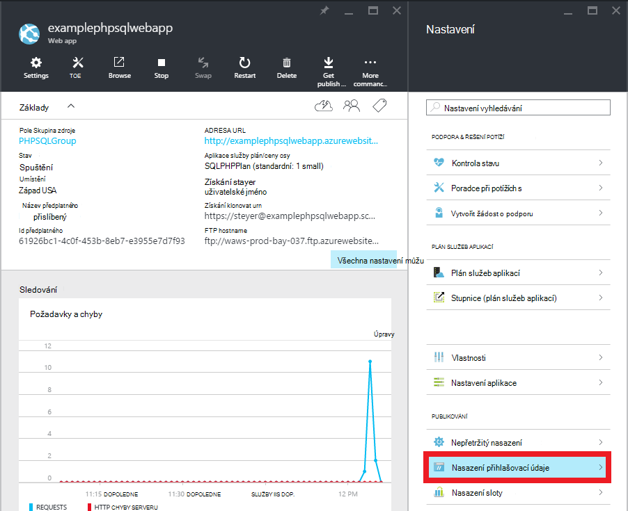
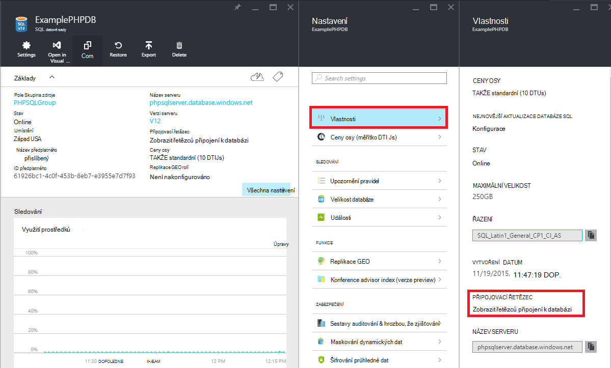

<properties 
    pageTitle="Vytvoření webové aplikace PHP SQL a nasazení aplikace služby Azure pomocí libovolná" 
    description="Kurz, který ukazuje, jak vytvořit web appu PHP, který uchovává data v databázi SQL Azure a použít libovolná nasazení služby Azure aplikace." 
    services="app-service\web, sql-database" 
    documentationCenter="php" 
    authors="rmcmurray" 
    manager="wpickett" 
    editor=""/>

<tags 
    ms.service="app-service-web" 
    ms.workload="web" 
    ms.tgt_pltfrm="na" 
    ms.devlang="PHP" 
    ms.topic="article" 
    ms.date="08/11/2016" 
    ms.author="robmcm"/>

# Vytvoření webové aplikace PHP SQL a nasazení aplikace služby Azure pomocí libovolná

Tento kurz se dozvíte, jak vytvořit web appu PHP v [Aplikaci služby Azure](http://go.microsoft.com/fwlink/?LinkId=529714) , který se připojuje k databázi SQL Azure a jak ji používat libovolná nasadit. Tento kurz předpokládá [PHP][install-php], [SQL Server Express][install-SQLExpress], [Microsoft ovladače pro systém SQL Server pro PHP](http://www.microsoft.com/download/en/details.aspx?id=20098)a [Libovolná] [ install-git] na počítači nainstalovaný. Po dokončení tohoto průvodce, budete mít do webových aplikací PHP SQL Azure aplikaci.

> [AZURE.NOTE]
> Můžete nainstalovat a nakonfigurovat PHP, SQL Server Express a Microsoft Drivers pro systém SQL Server pro PHP pomocí [Webové platformy Microsoft](http://www.microsoft.com/web/downloads/platform.aspx).

Naučíte se:

* Jak vytvořit Azure web app a databázi SQL pomocí [Portálu Azure](http://go.microsoft.com/fwlink/?LinkId=529715). Protože PHP je standardně ve webových aplikacích pro aplikaci služby, žádné zvláštní je potřeba spustit PHP kód.
* Jak publikovat a znova publikovat aplikaci Azure pomocí libovolná.
 
Provedením tohoto kurzu vytvoříte jednoduché registrace webové aplikace v PHP. Aplikace se hostovaná webu Azure. Snímek obrazovky s dokončeným aplikace je níže:

[AZURE.INCLUDE [create-account-and-websites-note](../../includes/create-account-and-websites-note.md)]

>[AZURE.NOTE] Pokud chcete začít pracovat s aplikaci služby Azure před registrací účet Azure, přejděte na [Zkuste aplikaci služby](http://go.microsoft.com/fwlink/?LinkId=523751), které můžete okamžitě vytvořit web appu krátkodobý starter v aplikaci služby. Žádné povinné; kreditní karty žádné závazky.

##Vytvořit Azure webovou aplikaci a nastavit libovolná publikování

Tímto postupem vytvoření Azure web app a databázi SQL:

1. Přihlaste se k [portálu Azure](https://portal.azure.com/).

2. Otevřít z Azure Marketplace obnovit kliknutím na ikonu **Nový** horní levé části na řídicím panelu klikněte na **Vybrat vše** vedle Marketplace a výběrem **Web + Mobile**.
    
3. V Marketplace vyberte **Web + mobilní telefon**.

4. Klikněte na ikonu **v prohlížeči + SQL** .

5. Po přečtení popis v prohlížeči + SQL aplikace, vyberte možnost **vytvořit**.

6. Klikněte na každou část (**Skupina zdroje** **Webové aplikace**, **databáze**a **předplatné**) a zadejte nebo vyberte hodnoty pro požadovaná pole:
    
    - Zadejte název URL podle svého výběru   
    - Konfigurace databáze serveru údaje
    - Vyberte oblast nejblíže

    

7. Po definování web appu, klikněte na **vytvořit**.

    Po vytvoření web appu se tlačítko **oznámení** flash zelené **Úspěch** a zásuvné skupina zdroje otevřít zobrazíte web app a SQL databáze ve skupině.

4. Klikněte na ikonu web appu na zásuvné skupina zdroje otevřete zásuvné web appu.

    

5. V **dialogovém okně Nastavení** klikněte na **Nepřetržitý nasazení** > **konfigurovat požadované nastavení**. Vyberte **Místní úložiště libovolná** a klikněte na **OK**.

    

    Pokud jste nenastavili úložišti libovolná před, je nutné zadat uživatelské jméno a heslo. Klikněte na **Nastavení** > **Nasazení pověření** zásuvné web appu.

    

6. V **Nastavení** klepněte na tlačítko **Vlastnosti** zobrazíte adresu URL vzdálené libovolná musíte použít pro nasazení aplikace PHP později.

##Získat informace o připojení databáze SQL

Připojení k instanci systému SQL databáze, které otevře webovou aplikaci, vaše bude potřebovat informace o připojení, které jste zadali při vytvoření databáze. Chcete-li získat informace o připojení databáze SQL, postupujte takto:

1. Zpátky v zásuvné skupina zdroje klikněte na ikonu SQL databáze.

2. V databázi SQL zásuvné, klikněte na **Nastavení** > **Vlastnosti**, klikněte na **Zobrazit řetězců připojení k databázi**. 

    
    
3. V oddílu **PHP** dialogu výsledné poznamenejte si hodnoty pro `Server`, `SQL Database`, a `User Name`. Použijete tyto hodnoty později při publikování webovou aplikaci PHP aplikace služby Azure.

##Vytvořte a otestujte vaše aplikace místně

Registrace aplikace je jednoduchý PHP aplikace, která umožňuje registrovat události zadáním své jméno a e-mailovou adresu. Zobrazí se informace o předchozí zaregistrované účastníky v tabulce. Registrační informace uložené v instanci databáze SQL. Aplikace se skládá ze dvou souborů (zkopírujte kód k dispozici následující):

* **index.php**: slouží k zobrazení formuláře pro registraci a tabulkou obsahující osob žádajících o registraci informace.
* **CreateTable.php**: vytvoří tabulky databáze SQL pro aplikaci. Tento soubor se používat jenom jednou.

Spusťte aplikaci místně, postupujte následujícím způsobem. Všimněte si, že tyto kroky předpokládají, máte PHP a SQL Server Express nastavení na místním počítači a že jste povolili [CHOP rozšíření pro systém SQL Server][pdo-sqlsrv].

1. Vytvoření databáze SQL serveru s názvem `registration`. Lze provést z `sqlcmd` příkazového řádku pomocí následujících příkazů:

        >sqlcmd -S localhost\sqlexpress -U <local user name> -P <local password>
        1> create database registration
        2> GO   

2. V kořenovém adresáři aplikace, vytvářet dvěma soubory, které – jeden s názvem `createtable.php` a jeden s názvem `index.php`.

3. Otevřít `createtable.php` soubor v textovém editoru nebo v integrovaném vývojovém prostředí a přidat následující kód. Tento kód se použijí k vytvoření `registration_tbl` tabulku v `registration` databáze.

        <?php
        // DB connection info
        $host = "localhost\sqlexpress";
        $user = "user name";
        $pwd = "password";
        $db = "registration";
        try{
            $conn = new PDO( "sqlsrv:Server= $host ; Database = $db ", $user, $pwd);
            $conn->setAttribute( PDO::ATTR_ERRMODE, PDO::ERRMODE_EXCEPTION );
            $sql = "CREATE TABLE registration_tbl(
            id INT NOT NULL IDENTITY(1,1) 
            PRIMARY KEY(id),
            name VARCHAR(30),
            email VARCHAR(30),
            date DATE)";
            $conn->query($sql);
        }
        catch(Exception $e){
            die(print_r($e));
        }
        echo "<h3>Table created.</h3>";
        ?>

    Všimněte si, že byste potřebovali aktualizovat hodnoty pro <code>$user</code> a <code>$pwd</code> pomocí místního serveru SQL Server uživatelského jména a hesla.

4. V terminálu v kořenovém adresáři aplikace zadejte tento příkaz:

        php -S localhost:8000

4. Otevřete webový prohlížeč a přejděte do **http://localhost:8000/createtable.php**. Tím vytvoříte `registration_tbl` tabulky v databázi.

5. Otevřete soubor **index.php** v textovém editoru nebo v integrovaném vývojovém prostředí a přidejte základní kód HTML a CSS stránky (kód PHP se přidají na pozdější kroky).

        <html>
        <head>
        <Title>Registration Form</Title>
        
        </head>
        <body>
        <h1>Register here!</h1>
        
Fill in your name and email address, then click <strong>Submit</strong> to register.

        <form method="post" action="index.php" enctype="multipart/form-data" >
              Name  <input type="text" name="name" id="name"/> 
              Email <input type="text" name="email" id="email"/> 
              <input type="submit" name="submit" value="Submit" />
        </form>
        <?php

        ?>
        </body>
        </html>

6. V rámci značky PHP přidejte kód PHP pro připojení k databázi.

        // DB connection info
        $host = "localhost\sqlexpress";
        $user = "user name";
        $pwd = "password";
        $db = "registration";
        // Connect to database.
        try {
            $conn = new PDO( "sqlsrv:Server= $host ; Database = $db ", $user, $pwd);
            $conn->setAttribute( PDO::ATTR_ERRMODE, PDO::ERRMODE_EXCEPTION );
        }
        catch(Exception $e){
            die(var_dump($e));
        }

    Znovu byste potřebovali aktualizovat hodnoty pro <code>$user</code> a <code>$pwd</code> s místní MySQL uživatelské jméno a heslo.

7. Následující kód připojení databáze přidejte kód pro vložení registračních údajů do databáze.

        if(!empty($_POST)) {
        try {
            $name = $_POST['name'];
            $email = $_POST['email'];
            $date = date("Y-m-d");
            // Insert data
            $sql_insert = "INSERT INTO registration_tbl (name, email, date) 
                           VALUES (?,?,?)";
            $stmt = $conn->prepare($sql_insert);
            $stmt->bindValue(1, $name);
            $stmt->bindValue(2, $email);
            $stmt->bindValue(3, $date);
            $stmt->execute();
        }
        catch(Exception $e) {
            die(var_dump($e));
        }
        echo "<h3>Your're registered!</h3>";
        }

8. Nakonec za výše uvedených kód přidání kódu pro načítání dat z databáze.

        $sql_select = "SELECT * FROM registration_tbl";
        $stmt = $conn->query($sql_select);
        $registrants = $stmt->fetchAll(); 
        if(count($registrants) > 0) {
            echo "<h2>People who are registered:</h2>";
            echo "<table>";
            echo "<tr><th>Name</th>";
            echo "<th>Email</th>";
            echo "<th>Date</th></tr>";
            foreach($registrants as $registrant) {
                echo "<tr><td>".$registrant['name']."</td>";
                echo "<td>".$registrant['email']."</td>";
                echo "<td>".$registrant['date']."</td></tr>";
            }
            echo "</table>";
        } else {
            echo "<h3>No one is currently registered.</h3>";
        }

Teď můžete přecházet na **http://localhost:8000/index.php** testování aplikace.

##Publikování aplikace

Po testování aplikace místně, můžete je Publikujte projekt do aplikace služby webových aplikací Web Apps pomocí libovolná. Ale musíte nejdřív aktualizovat informace o připojení databáze v aplikaci. Podle pokynů připojení databáze jste získali dříve (v části **informace o připojení načíst databáze SQL** ), aktualizace v **obou** tyto informace `createdatabase.php` a `index.php` soubory s příslušnými hodnotami:

    // DB connection info
    $host = "tcp:<value of Server>";
    $user = "<value of User Name>";
    $pwd = "<your password>";
    $db = "<value of SQL Database>";

> [AZURE.NOTE]
> V <code>$host</code>, přínosu serveru musí před lze použít s <code>tcp:</code>.

Teď jste připraveni nastavení libovolná publikování a publikovat aplikace.

> [AZURE.NOTE]
> Toto jsou stejné kroky uvedenými na konci **vytvořit Azure webovou aplikaci a nastavit libovolná publikování** výše.

1. Otevřete GitBash (nebo terminál, pokud je libovolná ve vaší `PATH`), změňte adresáře do kořenového adresáře aplikace ( **Registrace** adresář) a následující příkazy:

        git init
        git add .
        git commit -m "initial commit"
        git remote add azure [URL for remote repository]
        git push azure master

    Zobrazí se výzva k zadání hesla, které jste dříve vytvořili.

2. Přejděte do **http://[web app name].azurewebsites.net/createtable.php** k vytvoření tabulky databáze SQL pro aplikaci.
3. Přejděte do **http://[web app name].azurewebsites.net/index.php** začít používat aplikaci.

Po publikování aplikace, můžete začít provádění změn a použít libovolná publikovat. 

##Publikování změn do aplikace

Publikování změn aplikace, postupujte takto:

1. Provedení změn v aplikaci místně.
2. Otevřete GitBash (nebo terminálu it libovolná je ve vaší `PATH`), změňte adresáře do kořenového adresáře aplikace a následující příkazy:

        git add .
        git commit -m "comment describing changes"
        git push azure master

    Zobrazí se výzva k zadání hesla, které jste dříve vytvořili.

3. Přejděte do **http://[web app name].azurewebsites.net/index.php** zobrazte provedené změny.

## Co se změnilo
* Průvodce na změnu z webů pro aplikaci služby v tématu: [aplikaci služby Azure a jeho dopad na existující služby Azure](http://go.microsoft.com/fwlink/?LinkId=529714)

[install-php]: http://www.php.net/manual/en/install.php
[install-SQLExpress]: http://www.microsoft.com/download/details.aspx?id=29062
[install-Drivers]: http://www.microsoft.com/download/details.aspx?id=20098
[install-git]: http://git-scm.com/
[pdo-sqlsrv]: http://php.net/pdo_sqlsrv
 
