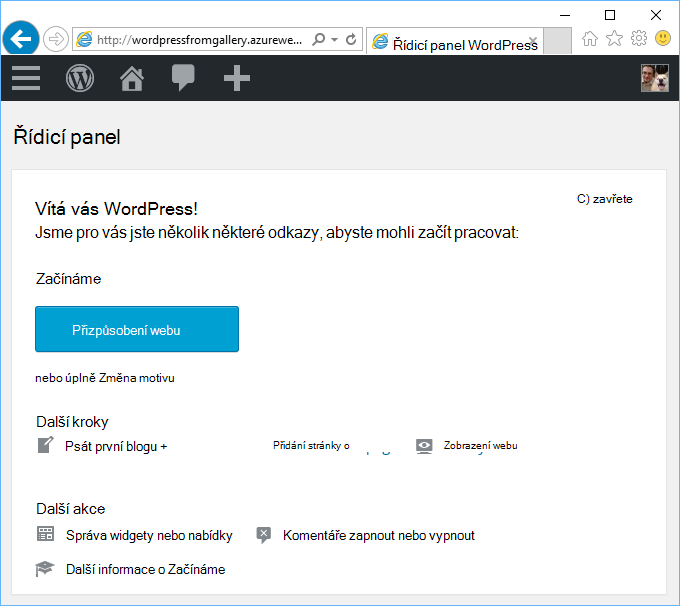
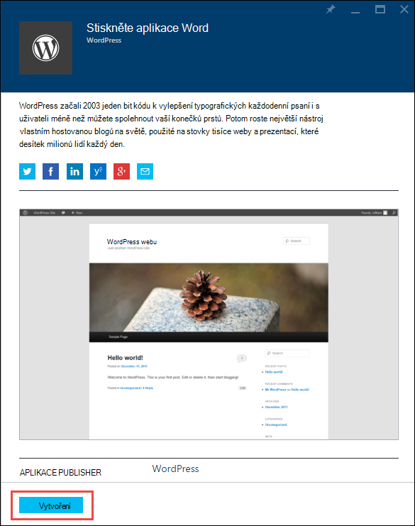
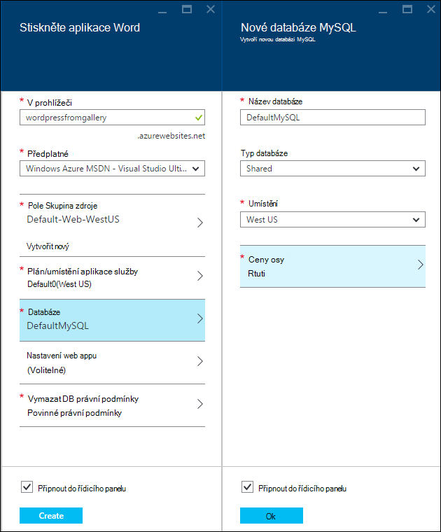
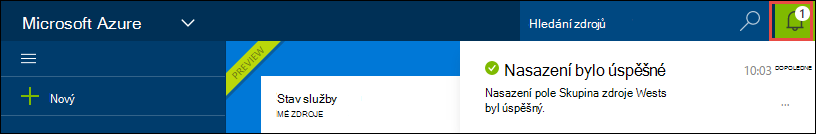
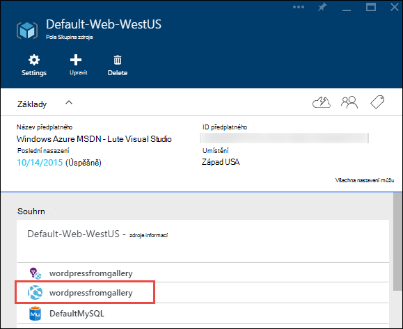
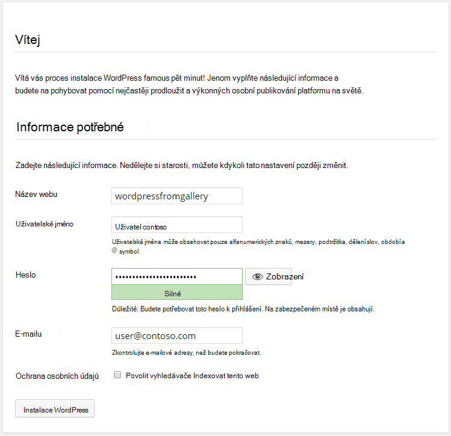

<properties
    pageTitle="Vytvoření webové aplikace WordPress v aplikaci služby Azure | Microsoft Azure"
    description="Naučte se vytvářet nové Azure web app pro WordPress blogu pomocí portálu Azure."
    services="app-service\web"
    documentationCenter="php"
    authors="rmcmurray"
    manager="wpickett"
    editor=""/>

<tags
    ms.service="app-service-web"
    ms.workload="na"
    ms.tgt_pltfrm="na"
    ms.devlang="PHP"
    ms.topic="hero-article"
    ms.date="08/11/2016"
    ms.author="robmcm"/>

# Vytvoření webové aplikace WordPress v aplikaci služby Azure

[AZURE.INCLUDE [tabs](../../includes/app-service-web-get-started-nav-tabs.md)]

Tento kurz ukazuje, jak nasadit web s blogem WordPress z Azure Marketplace.

Až skončíte s kurzu budete mít vlastní WordPress blogu vytvoření a spuštění serveru v cloudu.

Se dozvíte:

* Jak najít šablonu aplikace v Azure Marketplace.
* Jak vytvořit web appu v aplikaci služby Azure, který je založený na šabloně.
* Jak nakonfigurovat aplikaci služby Azure nastavení pro nový web app a databáze.

Azure Marketplace zpřístupní do široké řady oblíbených webových aplikacích vyvinutý společností Microsoft, společnosti třetích stran a iniciativy software otevřít zdroj. Webové aplikace jsou vytvořené v celé řadě Oblíbené rámců, například [PHP](/develop/nodejs/) v této WordPress příklad, [.NET](/develop/net/), [Node.js](/develop/nodejs/), [Java](/develop/java/)a [Python](/develop/python/)pojmenování několik. Při vytváření webové aplikace z webu Azure Marketplace pouze software potřebný je prohlížeč, který používáte pro [Portál Azure](https://portal.azure.com/). 

WordPress web, který nasadíte v tomto kurzu používá databáze MySQL. Pokud chcete místo toho použít databáze SQL databáze, přečtěte si článek [Nami projektu](http://projectnami.org/). **Nami projektu** je také k dispozici prostřednictvím tržiště.

> [AZURE.NOTE]
> Pro dokončení tohoto kurzu, třeba účet Microsoft Azure. Pokud nemáte účet, můžete [aktivovat své Visual Studio účastnická výhody](/pricing/member-offers/msdn-benefits-details/?WT.mc_id=A261C142F) nebo [zaregistrovat bezplatnou zkušební verzi](/en-us/pricing/free-trial/?WT.mc_id=A261C142F).
>
> Pokud chcete začít pracovat s aplikaci služby Azure před registraci účet Azure, přejděte na [Zkuste aplikaci služby](http://go.microsoft.com/fwlink/?LinkId=523751). Můžete okamžitě vytvořit web appu krátkodobý starter v aplikaci služby – bez platební kartou povinné a bez závazky.

## Vyberte WordPress a nakonfigurovat aplikaci služby Azure

1. Přihlaste se k [portálu Azure](https://portal.azure.com/).

2. Klikněte na **Nový**.
    
    ![Vytvořit nový][5]
    
3. Vyhledejte **WordPress**a potom klikněte na **WordPress**. Pokud chcete místo MySQL použijte databáze SQL, vyhledejte **Nami projektu**.

    ![WordPress ze seznamu][7]
    
5. Po přečtení popis WordPress aplikaci, klikněte na **vytvořit**.

    

4. Zadejte název pro web app v poli **v prohlížeči** .

    Tento název musí být jedinečný v doméně azurewebsites.net, protože bude adresa URL webové aplikace {název}. azurewebsites.net. Není-li zadané jméno jedinečné, zobrazí se v textovém poli červený vykřičník.

8. Pokud máte víc předplatných, vyberte tu, kterou chcete použít. 

5. **Pole Skupina zdroje** vyberte nebo vytvořte nový účet.

    Další informace o skupinách prostředků najdete v článku [Přehled Správce prostředků Azure](../azure-resource-manager/resource-group-overview.md).

5. Vyberte **Aplikaci služby plán/umístění** nebo vytvořte nový účet.

    Další informace o různých plánech aplikaci služby najdete v článku [Přehled plány aplikace služby Azure](../azure-web-sites-web-hosting-plans-in-depth-overview.md) 

7. Klikněte na **databáze**a v zásuvné **Nové databáze MySQL** zadejte požadované hodnoty pro konfiguraci databáze MySQL.

    na. Zadejte nový název nebo ponechte výchozí název.

    b. Nechte **Databáze typ** nastavený na **Sdíleno**.

    c. Zvolte stejného umístění, ze kterého jste se rozhodli pro web app.

    d. Zvolte ceny osy. Rtuti (zdarma s minimálními povolených připojení a místa na disku) je v pořádku pro účely tohoto návodu.

8. V **Nové databáze MySQL** zásuvné klikněte na **OK**. 

8. V zásuvné **WordPress** přijměte podmínky pro právnické a potom klikněte na **vytvořit**. 

    

    Web app a služby Azure aplikace obvykle vytvoří za méně než jednu minutu. Po kliknutí na ikony zvonku v horní části stránky portálu můžete sledovat průběh.

    

## Spuštění a spravovat svoji WordPress webovou aplikaci
    
7. Po vytvoření webové aplikace přejděte na portálu Azure ke skupině zdroje, ve kterém jste aplikaci vytvořili a uvidíte web app a databáze.

    Další zdroje s ikonou žárovka je [Přehledy aplikace](/services/application-insights/), které poskytují sledování služby pro web app.

1. V zásuvné **pole Skupina zdroje** klikněte na řádku web app.

    

2. Ve webové aplikaci zásuvné klikněte na **Procházet**.

    ![Adresa URL webu][browse]

3. Na stránce WordPress **úvodní** zadejte informace o konfiguraci vyžadované WordPress a klikněte na **Nainstalovat WordPress**.

    

4. Přihlaste se pomocí přihlašovacích údajů, kterou jste vytvořili na **úvodní** stránce.  

5. Otevře se stránka řídicího panelu vašeho webu.    

    

## Další kroky

Ukázali jsme si postup vytvoření a nasazení aplikace PHP webu z galerie. Další informace o používání PHP v Azure naleznete v článku [Středisko pro vývojáře PHP](/develop/php/).

Další informace o práci s aplikací služby Web Apps najdete v tématech na levé straně stránky (pro celou prohlížeče windows) nebo v horní části stránky (windows úzký prohlížeč). 

## Co se změnilo
* Průvodce na změnu z webů pro aplikaci služby najdete v tématu [aplikaci služby Azure a jejich dopad na existující služby Azure](http://go.microsoft.com/fwlink/?LinkId=529714).

[5]: ./media/web-sites-php-web-site-gallery/startmarketplace.png
[7]: ./media/web-sites-php-web-site-gallery/search-web-app.png
[browse]: ./media/web-sites-php-web-site-gallery/browse-web.png
