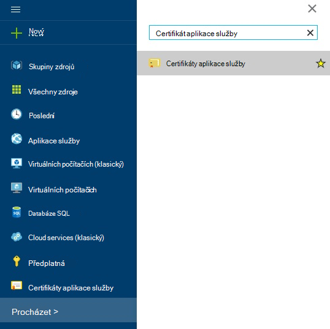
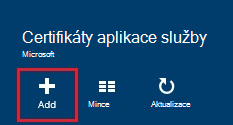
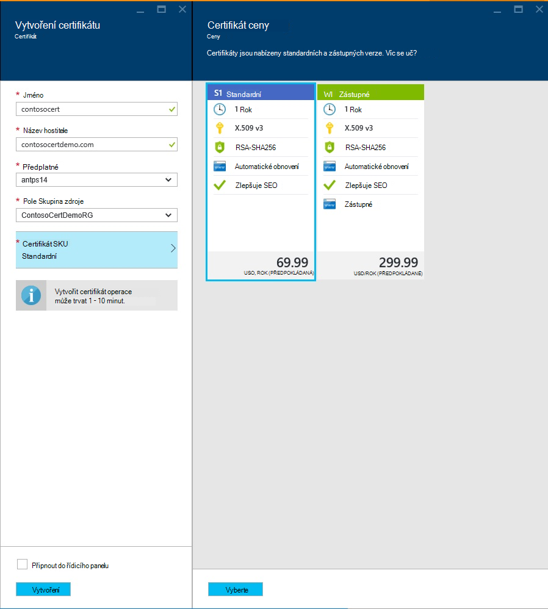
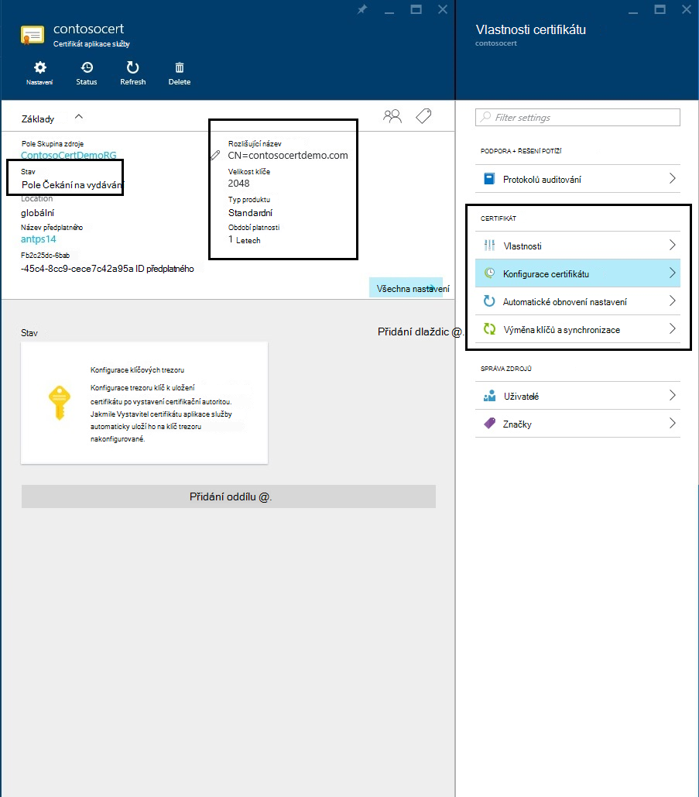
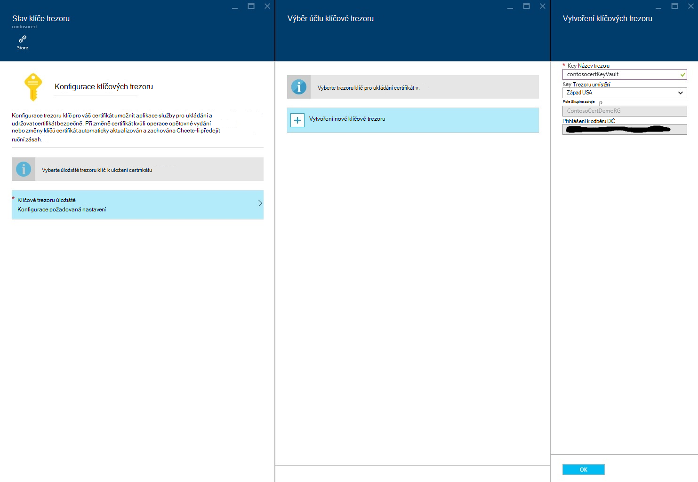
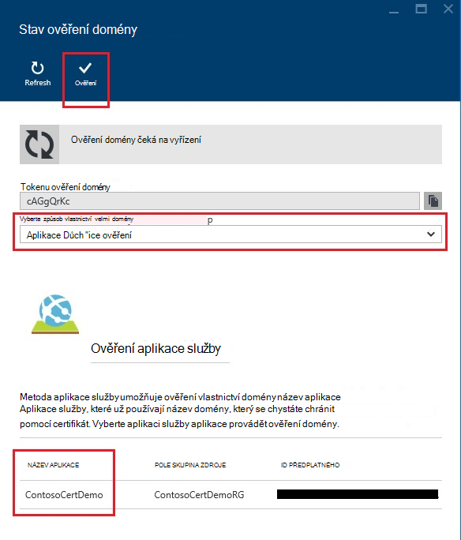
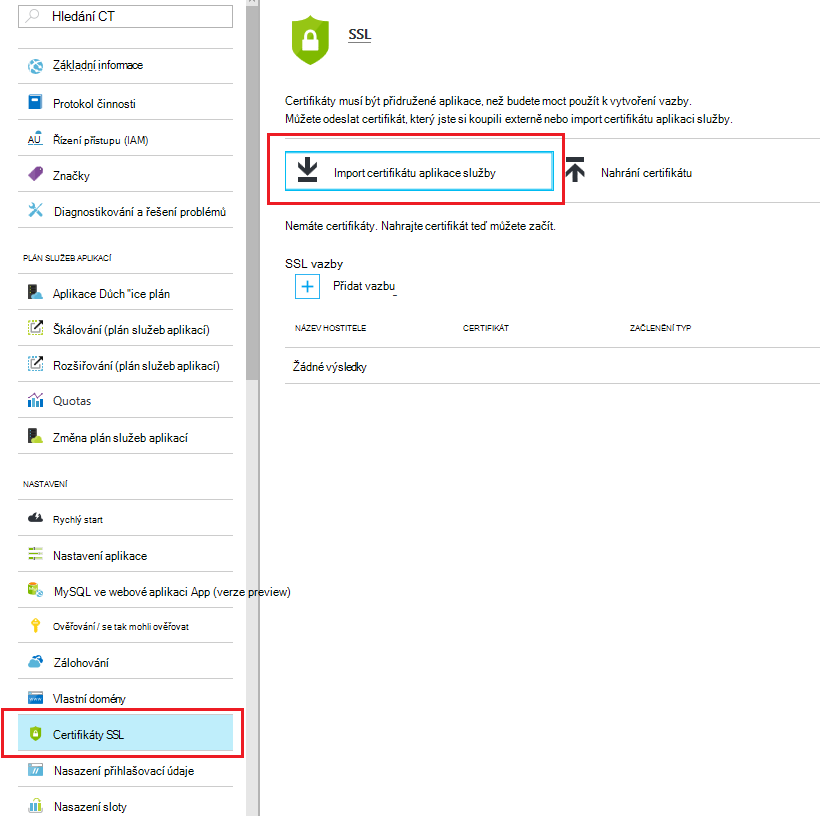
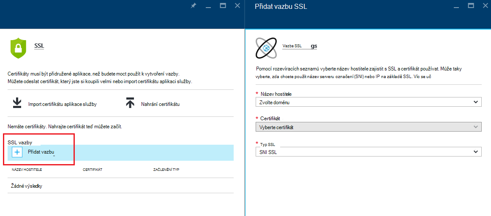
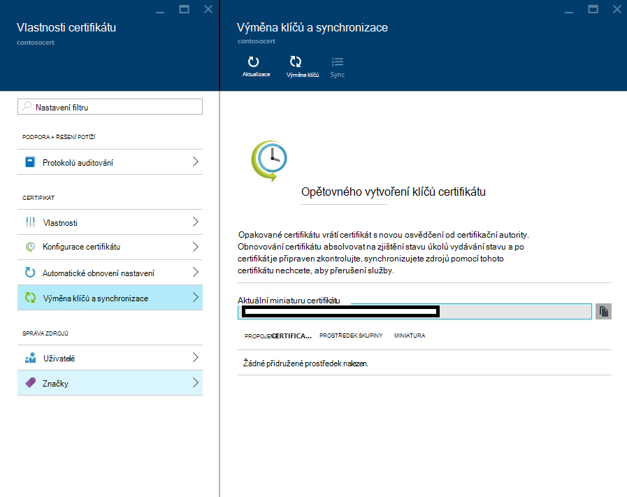

<properties
    pageTitle="Koupit a konfigurace certifikátu SSL Azure službě aplikace"
    description="Zjistěte, jak koupit a konfigurace certifikátu SSL služby Azure aplikace."
    services="app-service"
    documentationCenter=".net"
    authors="apurvajo"
    manager="stefsch"
    editor="cephalin"
    tags="buy-ssl-certificates"/>

<tags
    ms.service="app-service"
    ms.workload="na"
    ms.tgt_pltfrm="na"
    ms.devlang="na"
    ms.topic="article"
    ms.date="09/19/2016"
    ms.author="apurvajo"/>

#Koupit a konfigurace certifikátu SSL služby Azure aplikace

> [AZURE.SELECTOR]
- [Zakoupení certifikátu SSL v Azure](web-sites-purchase-ssl-web-site.md)
- [Použijte certifikát SSL od jinde](web-sites-configure-ssl-certificate.md)

Ve výchozím nastavení **[Aplikace služby Azure](http://go.microsoft.com/fwlink/?LinkId=529714)** už umožňuje HTTPS pro webovou aplikaci pomocí zástupných znaků certifikát *. azurewebsites.net domény. Pokud nemáte v plánu nastavení vlastní domény, pak můžete využít výhod výchozí HTTPS certifikát. Však jako všechny * [domény zástupných znaků](https://casecurity.org/2014/02/26/pros-and-cons-of-single-domain-multi-domain-and-wildcard-certificates)není zabezpečený stejně jako v vlastní certifikát používat vlastní doménu. Azure aplikaci služby nyní obsahuje skutečně zjednodušené způsob, jak koupit a správa certifikát SSL přímo z portálu Azure aniž byste museli opustit na portálu.  
Tento článek vysvětluje, jak koupit a konfigurace certifikátu SSL **[Aplikaci služby Azure](http://go.microsoft.com/fwlink/?LinkId=529714)** 3 jednoduchými kroky. 

> [AZURE.NOTE]
> Certifikáty SSL pro vlastní názvy domén nelze použít s zdarma a sdílené v prohlížeči. Musíte nakonfigurovat webovou aplikaci pro Basic, standardní nebo Premium režimu, což může změnit kolik je faktura pro vaše předplatné. Další informace najdete v tématu **[Webové aplikace ceny podrobnosti](https://azure.microsoft.com/pricing/details/web-sites/)** .

##Základní informace
> [AZURE.NOTE]
> Není pokuste koupit certifikát SSL používání předplatného, ve kterém není aktivní kreditní karty s ním spojené. To může vést k zakázání předplatné. 

##<a>Zakoupení, ukládání a přiřadit certifikát SSL pro vlastní doménu</a>
Chcete-li povolit HTTPS pro vlastní doménu, například contoso.com, musíte ji nejprve ** [konfigurace vaší vlastní doménou v aplikaci služby Azure.](web-sites-custom-domain-name.md)**

Před žádosti o certifikátu SSL, musíte nejdřív určit, které názvy domén bude zabezpečená tak, že certifikát. To bude určovat, jaký druh certifikátu, musíte získat. Pokud potřebujete pouze zajistit jednoho doménou, například contoso.com nebo www.contoso.com standardní (základní) stačí certifikát. Pokud potřebujete zabezpečené víc názvů domén, například contoso.com, www.contoso.com a mail.contoso.com, pak můžete získat ** [certifikát se zástupnými znaky](http://en.wikipedia.org/wiki/Wildcard_certificate)**

##Krok 0: Místo objednávky certifikát SSL

V tomto kroku se dozvíte, jak objednávky pro certifikát SSL podle svého výběru.

1.  Na **[Portálu Azure](https://portal.azure.com/)**klikněte na Procházet a zadejte "Aplikace služby certifikáty" panelu hledání a vyberte "Aplikace služby certifikáty" z výsledků a klikněte na Přidat. 

    

    

2.  Zadejte **popisný název** vašeho certifikátu SSL.

3.  Zadejte **název hostitele**
> [AZURE.NOTE]
    To je jedna nejdůležitější části nákupem. Zkontrolujte, že název správného hostitele (vlastní domény), který chcete chránit pomocí certifikát. **Neodstraňujte** přidat název hostitele s WWW. Například váš vlastní název domény je www.contoso.com nakonec jenom zadejte do pole název hostitele contoso.com, daný certifikát chránit www a kořenové domény. 
    
4.  Vyberte **předplatné**. 

    Pokud máte víc předplatných, pak zkontrolujte, že vytvořit certifikát SSL ve stejném předplatném použitý pro vlastní doménu nebo Web App předmětné.
       
5.  Vyberte nebo vytvořte **pole Skupina zdroje**.

    Skupiny zdrojů vám umožní spravovat související Azure zdroje jako celek a jsou užitečné při vytváření pravidla pro řízení (RBAC) na základě rolí přístupu pro vaše aplikace. Další informace najdete v tématu Správa Azure zdroje.
     
6.  Vyberte **certifikát SKU** 

    Nakonec vyberte certifikát, která potřeby SKU a klikněte na vytvořit. V současné době aplikaci služby Azure umožňuje zakoupit dva různé • skladové jednotky S1 – standardní certifikát s platnosti 1 rok a automatické obnovení  
           • B1 – zástupné certifikátu s 1 rok platnosti a automatického obnovení      
    Další informace najdete v tématu **[Webové aplikace ceny podrobnosti](https://azure.microsoft.com/pricing/details/web-sites/)** .

> [AZURE.NOTE]
> Vytvoření certifikátu SSL bude trvat 1 – 10 minut. Tento proces provádí několik kroků, které jsou jinak velmi náročný provést ruční pozadí.  

##Krok 1: Uložení certifikátu trezoru klíč Azure

V tomto kroku se dozvíte, jak provést úložiště certifikát SSL, který jste si koupili Azure klíč trezoru podle svého výběru.

1.  Po dokončení nákupní certifikát SSL budete muset ručně otevřete **Aplikaci služby certifikáty** zdroje zásuvné procházením znovu (viz krok 1 výše)   

    

    Zjistíte, že stav certifikátu je **"na zjištění stavu úkolů vydávání"** , jsou několik dalších kroků, které musíte udělat, abyste mohli začít používat tato poukázky.
 
2. Klikněte na **"Konfigurace certifikátu"** do vlastnosti certifikátu zásuvné a klepněte na **"krok 1: ukládání"** ukládat tento certifikát v Azure klíč trezoru.

3.  Klepněte na zásuvné **"Stav trezoru klávesy"** na **"klávesy trezoru úložiště"** zvolit existující trezoru klíč pro ukládání certifikát **nebo "vytvořit nový klíč trezoru"** vytvářet nový klíč trezoru do stejné skupiny předplatné a zdroje.
 
    
 
    > [AZURE.NOTE]
    Azure trezoru klíč obsahuje hodně minimální poplatky pro ukládání certifikát. Další informace najdete v tématu **[Azure klíč trezoru ceny podrobnosti](https://azure.microsoft.com/pricing/details/key-vault/)** .

4. Po výběru úložiště trezoru klíč pro ukládání tento certifikát v pokračovat a uložit ho kliknutím na tlačítko **"Ukládání"** nahoře **"stav klíče trezoru"** zásuvné.  

    To měli uděláte pro ukládání certifikát jste si koupili s Azure klíč trezoru podle svého výběru. Po aktualizaci zásuvné, měli byste vidět zelené zaškrtněte označit proti taky v tomto kroku.
    
##Krok 2: Ověřte vlastnictví domény

V tomto kroku se dozvíte, jak provádět ověření vlastnictví domény pro certifikát SSL, který jste právě objednávky pro. 

1.  Klikněte na **"krok 2: ověření"** krok z zásuvné **"Konfigurace certifikátu"** . Existuje 4 typy domény ověření nepodporuje aplikace služby certifikáty.

    * **Ověření aplikace služby** 
    
        * Toto je nejpohodlnější procesem, pokud už máte **vaší vlastní domény přiřazená Spouštěči aplikací služby.** Tento způsob zobrazují se všechny Spouštěči služeb aplikací, které splňují tato kritéria. 
           Například v tomto případě **contosocertdemo.com** je vlastní doménu přiřazené k aplikaci služby aplikace s názvem **"ContosoCertDemo"** a tedy, který je uvedený tady pouze aplikace služby aplikace. Pokud došlo k více oblastí nasazení, potom ho by seznamu je všechny přes oblasti.
        
           Metody ověřování pouze je k dispozici pro nákup standardní certifikát (základní). Zástupné certifikátů přeskočit a přejít k možnost B, C a D dole.
        * Klikněte na tlačítko **"Ověření"** dokončete tento krok.
        * Klikněte na **"Aktualizace"** stav certifikát po dokončení ověření. Může trvat několik minut, než ověření dokončete.
        
             

    * **Ověření domény** 

        * Toto je proces nejpohodlnější **jenom v případě,** že máte **[koupili vaší vlastní domény z aplikace služby Azure.](custom-dns-web-site-buydomains-web-app.md)**
        
        * Klikněte na tlačítko **"Ověření"** dokončete tento krok.
        
        * Klikněte na **"Aktualizace"** stav certifikát po dokončení ověření. Může trvat několik minut, než ověření dokončete.

    * **Ověření pošty**
        
        * Ověření e-mailu už odeslání e-mailové adresy přidružené tuto vlastní doménu.
         
        * Otevřete e-mail a kliknutím na odkaz ověření postupujte podle pokynů ověření e-mailu. 
        
        * Pokud potřebujete odešlete e-mail s ověření klikněte na tlačítko **"opětovné odeslání e-mailu"** .
         
    * **Ruční ověření**    
                 
        1. **Ověření webovou stránku ve formátu HTML**
        
            * Vytvoření souboru HTML s názvem **{Domény ověření tokenu}**.html (tokenu můžete zkopírovat z mu zásuvné stav ověření domény)
            
            * Obsah tohoto souboru by měl být přesný stejný název **Domény ověření tokenu**.
            
            * Nahrajte tento soubor v kořenovém adresáři webového serveru, který je hostitelem vaší domény.
            
            * Klikněte na **"Aktualizace"** stav certifikát po dokončení ověření. Může trvat několik minut, než ověření dokončete.
            
            Třeba při nákupu standardní certifikát contosocertdemo.com s tokenu ověření domény **"cAGgQrKc"** klikněte na web žádost **"http://contosocertdemo.com/cAGgQrKc.html"** , měly vrátit **cAGgQrKc.**
        2. **Ověření záznamu DNS TXT**

            * Pomocí Správce DNS vytvořte záznam TXT na **"DZC"** subdoména s hodnotou rovná **domény ověření tokenu.**
            
            * Klikněte na **"Aktualizace"** stav certifikát po dokončení ověření. Může trvat několik minut, než ověření dokončete.
                              
            Například k provedení ověřovací certifikát zástupných s hostname ** \*. contosocertdemo.com** nebo ** \*. subdomain.contosocertdemo.com** a domény ověření tokenu **cAGgQrKc**, potřebujete k vytvoření záznamu TXT na dzc.contosocertdemo.com s hodnotou **cAGgQrKc.**     

##Krok 3: Přiřazení certifikát k aplikaci služby aplikace

V tomto kroku se budou Naučte se přiřadit nově zakoupené certifikát ke svým aplikacím služby aplikace. 

> [AZURE.NOTE]
> Před provedením kroků v této části, můžete s aplikací spojený vlastním názvem domény. Další informace najdete v tématu [Konfigurace vlastního názvu domény pro web app.](web-sites-custom-domain-name.md) ****

1.  V prohlížeči otevřete ** [Azure portál.](https://portal.azure.com/)**
2.  Vyberte možnost **Aplikaci služby** na levé straně stránky.
3.  Klikněte na název aplikace, ke kterému chcete přiřadit certifikát. 
4.  V části **Nastavení**klikněte na tlačítko **certifikáty SSL**
5.  Klikněte na **Import certifikátu služby aplikace** a vyberte certifikát, který jste si právě koupili

    

6. **Vazby ssl** oddíl, klepněte na **Přidat vazby**
7. V zásuvné **Přidat vazbu SSL** umožňuje rozevíracích seznamů vyberte název domény k zabezpečení s SSL a certifikát používat. Může taky vyberte, zda chcete použít **[Název serveru označení (SNI)](http://en.wikipedia.org/wiki/Server_Name_Indication)** nebo IP na základě SSL.

    

       •    IP based SSL associates a certificate with a domain name by mapping the dedicated public IP address of the server to the domain name. This requires each domain name (contoso.com, fabricam.com, etc.) associated with your service to have a dedicated IP address. This is the traditional          method of associating SSL certificates with a web server.
       •    SNI based SSL is an extension to SSL and **[Transport Layer Security](http://en.wikipedia.org/wiki/Transport_Layer_Security)** (TLS) that allows multiple domains to share the same IP address, with separate security certificates for each domain. Most modern browsers (including Internet Explorer, Chrome, Firefox and Opera) support SNI, however older browsers may not support SNI. For more information on SNI, see the **[Server Name Indication](http://en.wikipedia.org/wiki/Server_Name_Indication)** article on Wikipedia.
       
7. Klikněte na příkaz **Přidat vazbu** uložte změny a povolení SSL.

Pokud jste vybrali **IP na základě SSL** a vlastní domény se konfigurují záznam, musíte provést následující kroky:

* Po dokončení konfigurace IP podle SSL vazbu, vyhrazené IP adresu přiřazen aplikace. Tuto IP adresu můžete najít na stránce **vlastní doménu** v části Nastavení aplikace, vpravo nahoře v části **názvy hostitelů** . Se zobrazí jako **Externí IP adresa**
    
    

    Všimněte si, že tuto IP adresu budou liší od virtuální IP adresy nepoužívali pro nastavení záznamu A pro vaši doménu. Pokud jsou nakonfigurovány na SNI na základě SSL nebo není nakonfigurovaný na používání SSL, žádná adresa se zobrazí pro tuto položku.
    
2. Pomocí nástroje poskytnuté svého doménového registrátora, upravte záznam pro váš vlastní název domény tak, aby ukazovaly na IP adresu v předchozím kroku.
V tomto okamžiku by měl budete moci Navštěvujte blog o aplikaci pomocí HTTPS:// místo HTTP:// ověřit správně nakonfigurované certifikát.

##Opětovného vytvoření klíčů a synchronizovat certifikátu

1. Z bezpečnostních důvodů vyberte Pokud přesto potřebujete opětovného vytvoření klíčů certifikát klikněte jednoduše "opětovného vytvoření klíčů a" možnost **Synchronizovat** zásuvné **"vlastnosti certifikátu"** . 

2. Klikněte na tlačítko **"Opětovného vytvoření klíčů"** zahajte proces. Tento proces může trvat 1-10 minut. 

    

3. Obnovování certifikátu vrátí certifikát s novou osvědčení od certifikační autority.
4. Se nezapočítávají pro Rekeying platnosti certifikátu. 
5. Obnovování certifikátu odejde prostřednictvím stavu na zjištění stavu úkolů vydávání. 
6. Jakmile certifikát je připraven zkontrolujte, že synchronizujete zdrojů pomocí tohoto certifikátu nechcete, aby přerušení služby.
7. Možnost Synchronizovat není k dispozici pro certifikáty, které nejsou dosud nebyly přiřazeny k Web Appu. 

## Další materiály ##
- [Povolení HTTPS pro aplikaci služby Azure aplikace](web-sites-configure-ssl-certificate.md)
- [Koupit a konfigurace vaší vlastní doménou v aplikaci služby Azure](custom-dns-web-site-buydomains-web-app.md)
- [Centrum zabezpečení aplikace Microsoft Azure](/support/trust-center/security/)
- [Konfigurace možností odemknout v Azure weby](http://azure.microsoft.com/blog/2014/01/28/more-to-explore-configuration-options-unlocked-in-windows-azure-web-sites/)
- [Portál Správa Azure](https://manage.windowsazure.com)

>[AZURE.NOTE] Pokud chcete začít pracovat s aplikaci služby Azure před registrací účet Azure, přejděte na [Zkuste aplikaci služby](http://go.microsoft.com/fwlink/?LinkId=523751), které můžete okamžitě vytvořit web appu krátkodobý starter v aplikaci služby. Žádné povinné; kreditní karty žádné závazky.

