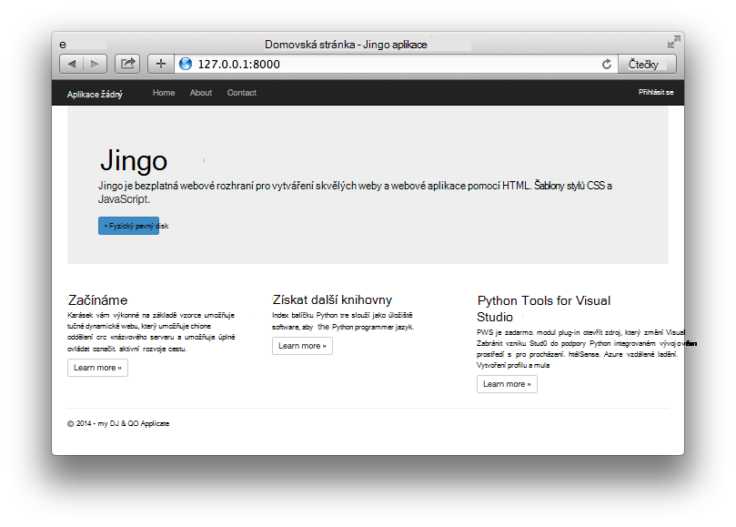

<properties
    pageTitle="Vytváření webových aplikací web apps s Django v Azure"
    description="Kurz, která vás seznámí s spuštěným Python web appem v Azure aplikace služby Web Apps."
    services="app-service\web"
    documentationCenter="python"
    tags="python"
    authors="huguesv" 
    manager="wpickett" 
    editor=""/>

<tags
    ms.service="app-service-web"
    ms.workload="web"
    ms.tgt_pltfrm="na"
    ms.devlang="python"
    ms.topic="hero-article" 
    ms.date="02/19/2016"
    ms.author="huvalo"/>

# Vytváření webových aplikací web apps s Django v Azure

Tento kurz popisuje, jak začít Python spuštěna [Azure aplikace služby Web Apps](http://go.microsoft.com/fwlink/?LinkId=529714). Web Apps poskytuje omezené bezplatná hostingu a rychlého nasazení a používáte Python! Narůstající velikostí aplikace, můžete přepnout na placené hostování a taky můžete integrovat s všechny ostatní služby Azure.

Vytvoříte aplikace pomocí rozhraní webových Django (viz alternativní verze tohoto kurzu [baňka](web-sites-python-create-deploy-flask-app.md) a [lahev na](web-sites-python-create-deploy-bottle-app.md)). Vytvoření webové aplikace z webu Azure Marketplace, nastavíte libovolná nasazení a klonovat úložiště místně. Bude pak místně spustit aplikaci, proveďte změny, potvrďte a použít pro Azure. Kurz ukazuje, jak to provést z Windows nebo Mac a Linux.

[AZURE.INCLUDE [create-account-and-websites-note](../../includes/create-account-and-websites-note.md)]

>[AZURE.NOTE] Pokud chcete začít pracovat s aplikaci služby Azure před registrací účet Azure, přejděte na [Zkuste aplikaci služby](http://go.microsoft.com/fwlink/?LinkId=523751), které můžete okamžitě vytvořit web appu krátkodobý starter v aplikaci služby. Žádné povinné; kreditní karty žádné závazky.

## Zjistit předpoklady pro

- Systémy Windows, Mac a Linux
- Python 2.7 nebo 3.4
- setuptools, pip, virtualenv (pouze Python 2.7)
- Libovolná
- [Python Tools for Visual Studio][] Poznámka: (PTVS) -: Toto je nepovinný krok

**Poznámka**: publikování TFS aktuálně nepodporuje Python projektů.

### Windows

Pokud ještě nemáte Python 2.7 nebo 3.4 nainstalovaný (32bitová verze), doporučujeme nainstalovat [Azure SDK Python 2.7] nebo [Azure SDK Python 3.4] pomocí webové platformy. Nainstalujete 32bitovou verzi Python setuptools, pip, virtualenv, atd (32bitová verze Python je nainstalovaných v počítačích Azure hostitele). Můžete taky dostanete Python z [python.org].

Libovolná doporučujeme [Libovolná pro Windows] nebo [GitHub pro Windows]. Pokud používáte Visual Studiu, můžete použít integrovanou libovolná podporu.

Také, doporučujeme nainstalovat [Python nástroje 2.2 for Visual Studio]. Toto je nepovinný krok, ale pokud máte [Visual Studiu], včetně bezplatná Visual Studio komunity 2013 nebo Visual Studio Express 2013 pro Web, potom to vám nabídne skvělé integrovaném vývojovém Python prostředí.

### Mac a Linux

Má mít Python a libovolná už nainstalovaný, ale ujistěte se, že máte Python 2.7 nebo 3.4.

## Vytvoření webové aplikace na portálu

Prvním krokem při vytváření aplikace je vytvořit web appu prostřednictvím [Portálu Azure](https://portal.azure.com).

1. Přihlaste se k portálu Azure a klikněte na tlačítko **Nový** v levém dolním rohu.
3. Do vyhledávacího pole zadejte "python".
4. Ve výsledcích hledání vyberte **Django** (zveřejněné PTVS) a potom klikněte na **vytvořit**.
5. Nakonfigurujte novou aplikaci Django, jako je vytvoření nového plánu aplikace služby a nové skupiny prostředků pro něj. Potom klikněte na **vytvořit**.
6. Postupujte podle pokynů v [Místním nasazení libovolná aplikace služby Azure](app-service-deploy-local-git.md)konfigurace libovolná publikování pro nově vytvořený web app.

## Přehled aplikací

### Libovolná úložiště obsah

Tady je přehled soubory, které budete v počáteční libovolná úložiště, které jsme budete klonovat v další části.

    \app\__init__.py
    \app\forms.py
    \app\models.py
    \app\tests.py
    \app\views.py
    \app\static\content\
    \app\static\fonts\
    \app\static\scripts\
    \app\templates\about.html
    \app\templates\contact.html
    \app\templates\index.html
    \app\templates\layout.html
    \app\templates\login.html
    \app\templates\loginpartial.html
    \DjangoWebProject\__init__.py
    \DjangoWebProject\settings.py
    \DjangoWebProject\urls.py
    \DjangoWebProject\wsgi.py

Hlavní zdroje pro aplikaci. Obsahuje 3 stránek (o kontaktu index) s rozložení předlohy. Statický obsah a skripty obsahují zavádění, jquery, knihovny a odpovědět na ni.

    \manage.py

Místní správy a vývoj serveru podpory. Slouží k spuštění aplikace místně, synchronizovat databáze, atd.

    \db.sqlite3

Výchozí databáze. Obsahuje tabulky potřebné pro aplikaci spustit, ale neobsahuje žádné uživatele (synchronizovat databáze, kterou chcete vytvořit uživatele).

    \DjangoWebProject.pyproj
    \DjangoWebProject.sln

Soubory pro použití s [Python Tools for Visual Studio]projektu.

    \ptvs_virtualenv_proxy.py

Proxy serveru IIS virtuální prostředí a PTVS vzdálené ladění podpory.

    \requirements.txt

Externí balíčků potřeby tak, že této aplikace. Skript pro nasazení se pip instalaci balíčků uvedené v tomto souboru.

    \web.2.7.config
    \web.3.4.config

Konfigurace služby IIS soubory. Skript pro nasazení pomocí příslušné web.x.y.config a Kopírovat jako web.config.

### Volitelné soubory – vlastní nastavení nasazení

[AZURE.INCLUDE [web-sites-python-django-customizing-deployment](../../includes/web-sites-python-django-customizing-deployment.md)]

### Volitelné soubory - Python runtime

[AZURE.INCLUDE [web-sites-python-customizing-runtime](../../includes/web-sites-python-customizing-runtime.md)]

### Další soubory na server

Některé soubory na serveru, které ale nejsou přidali do úložiště libovolná. Toto jsou vytvářeny skript pro nasazení.

    \web.config

Konfigurační soubor Internetové informační služby. Vytvořená z web.x.y.config v každé nasazení.

    \env\

Virtuální prostředí Python. Pokud vytvoří se při nasazení kompatibilní virtuální prostředí ještě neexistuje na web appu. Balíčky uvedené v requirements.txt jsou pip nainstalovaný, ale pip přeskočí instalaci, pokud už máte nainstalované balíčky.

Další 3 oddíly popisují, jak pokračovat vývoj aplikací webu klikněte v části 3 různých prostředích:

- Windows s Python Tools for Visual Studio
- Windows s příkazového řádku
- Mac a Linux příkazového řádku

## Vývoj pro web app – Windows – Python Tools for Visual Studio

### Klonovat úložiště

Nejdřív klonovat úložiště pomocí adresy URL umístěna na portálu Azure. Další informace najdete v tématu [Místní nasazení libovolná aplikace služby Azure](app-service-deploy-local-git.md).

Otevřete soubor řešení (SLN), který je součástí kořenové úložiště.

### Vytvořit virtuální prostředí

Nyní vytvoříme virtuální prostředí pro místní vývoj. Klikněte pravým tlačítkem myši na **Prostředí Python** vyberte **Přidat virtuální prostředí …**.

- Přesvědčte se, zda je v poli Název prostředí `env`.

- Vyberte základní video interpreter. Zkontrolujte, že použít stejnou verzi aplikace Python vybrané pro webovou aplikaci (v runtime.txt nebo **Nastavení aplikace** zásuvné webovou aplikaci na portálu Azure).

- Ujistěte se, že je zaškrtnuté políčko si stáhněte a nainstalujte balíčků.

Klikněte na **vytvořit**. To vytvořit virtuální prostředí a nainstalujte závislosti uvedené v requirements.txt.

### Vytvoření úroveň superuser

Databáze součástí aplikace neobsahuje žádné superuser definované. Pokud chcete použít funkci přihlašovací v aplikaci nebo rozhraní Django správce (Pokud se rozhodnete ji povolit), musíte vytvořit úroveň superuser.

Spusťte z příkazového řádku ze složky projektu:

    env\scripts\python manage.py createsuperuser

Postupujte podle pokynů k nastavení uživatelské jméno, heslo, atd.

### Spuštění pomocí vývojového serveru

Stisknutím klávesy F5 ladění spustit a váš webový prohlížeč na stránku místně spuštěné automaticky otevře.

Nastavit zarážky ve zdrojích, použijte windows podívejte se na video atd. Zobrazit [Python Tools for Visual Studio dokumentace] Další informace o jednotlivých funkcích.

### Proveďte změny

Teď můžete experimentovat změnou zdrojů aplikace a/nebo šablony.

Po otestování změny potvrďte je do úložiště libovolná:

### Instalace další balíčků

Závislosti za Python a Django může mít vaše aplikace.

Další balíčků pomocí pip můžete nainstalovat. K instalaci balíčku, klikněte pravým tlačítkem myši na virtuální prostředí a vyberte **Nainstalovat Python balíčku**.

Instalace Azure SDK Python, které vám umožňuje přístup k Azure úložiště, bus služby a další služby Azure, zadejte například `azure`:

Klikněte pravým tlačítkem myši na virtuální prostředí a vyberte **Generovat requirements.txt** aktualizovat requirements.txt.

Pak potvrďte změny provedené v requirements.txt libovolná úložiště.

### Nasazení Azure

Spustit nasazení, klepněte na **synchronizovat** nebo **nabízená**. Synchronizace se push a vložit.

První nasazení bude určitou dobu trvat, jako se vytváří prostředí virtuální balíčků Instalační, atd.

Visual Studio se nezobrazují průběh nasazení. Pokud chcete zkontrolovat výstup, naleznete v tématu [Poradce při potížích – nasazení](#troubleshooting-deployment).

Přejděte na adresu URL Azure zobrazíte provedené změny.

## Vývoj aplikací – Windows – příkazového řádku pro web

### Klonovat úložiště

Nejdřív klonovat úložiště pomocí adresy URL umístěna na portálu Azure a přidejte Azure úložiště jako vzdálené. Další informace najdete v tématu [Místní nasazení libovolná aplikace služby Azure](app-service-deploy-local-git.md).

    git clone <repo-url>
    cd <repo-folder>
    git remote add azure <repo-url>

### Vytvořit virtuální prostředí

Vytvoříme nové prostředí virtuální pro účely vývoj (nepřidávejte jej do úložiště). Virtuální prostředí v Python nejsou přemístitelný, aby každý vývojáři pracují na aplikaci bude vytvářet své vlastní místně.

Zkontrolujte, že použít stejnou verzi aplikace Python vybrané pro webovou aplikaci (v runtime.txt nebo nastavení aplikace zásuvné webovou aplikaci na portálu Azure).

Pro Python 2.7:

    c:\python27\python.exe -m virtualenv env

Pro Python 3.4:

    c:\python34\python.exe -m venv env

Nainstalujte všechny externí balíčky vyžaduje vaše aplikace. Soubor requirements.txt kořenové úložiště slouží k instalaci balíčků ve vašem prostředí virtuální:

    env\scripts\pip install -r requirements.txt

### Vytvoření úroveň superuser

Databáze součástí aplikace neobsahuje žádné superuser definované. Pokud chcete použít funkci přihlašovací v aplikaci nebo rozhraní Django správce (Pokud se rozhodnete ji povolit), musíte vytvořit úroveň superuser.

Spusťte z příkazového řádku ze složky projektu:

    env\scripts\python manage.py createsuperuser

Postupujte podle pokynů k nastavení uživatelské jméno, heslo, atd.

### Spuštění pomocí vývojového serveru

Samostatné aplikace v části vývojového serveru pomocí následujícího příkazu:

    env\scripts\python manage.py runserver

Na konzole se zobrazí adresu URL a přijímá port serveru:

Potom otevřete webový prohlížeč na tuto adresu URL.

### Proveďte změny

Teď můžete experimentovat změnou zdrojů aplikace a/nebo šablony.

Po otestování změny potvrďte je do úložiště libovolná:

    git add <modified-file>
    git commit -m "<commit-comment>"

### Instalace další balíčků

Závislosti za Python a Django může mít vaše aplikace.

Další balíčků pomocí pip můžete nainstalovat. Instalace Azure SDK Python, které vám umožňuje přístup k Azure úložiště, bus služby a další služby Azure, zadejte například:

    env\scripts\pip install azure

Zkontrolujte, že aktualizace requirements.txt:

    env\scripts\pip freeze > requirements.txt

Potvrďte změny:

    git add requirements.txt
    git commit -m "Added azure package"

### Nasazení Azure

Spustit nasazení, použít změny pro Azure:

    git push azure master

Zobrazí se výstup skript pro nasazení včetně virtuální prostředí vytváření instalace balení, vytvoření web.config.

Přejděte na adresu URL Azure zobrazíte provedené změny.

## Vývoj aplikací – Mac a Linux - příkazového řádku pro web

### Klonovat úložiště

Nejdřív klonovat úložiště pomocí adresy URL umístěna na portálu Azure a přidejte Azure úložiště jako vzdálené. Další informace najdete v tématu [Místní nasazení libovolná aplikace služby Azure](app-service-deploy-local-git.md).

    git clone <repo-url>
    cd <repo-folder>
    git remote add azure <repo-url>

### Vytvořit virtuální prostředí

Vytvoříme nové prostředí virtuální pro účely vývoj (nepřidávejte jej do úložiště). Virtuální prostředí v Python nejsou přemístitelný, aby každý vývojáři pracují na aplikaci bude vytvářet své vlastní místně.

Zkontrolujte, že použít stejnou verzi aplikace Python vybrané pro webovou aplikaci (v runtime.txt nebo nastavení aplikace zásuvné webovou aplikaci na portálu Azure).

Pro Python 2.7:

    python -m virtualenv env

Pro Python 3.4:

    python -m venv env

nebo

    pyvenv env

Nainstalujte všechny externí balíčky vyžaduje vaše aplikace. Soubor requirements.txt kořenové úložiště slouží k instalaci balíčků ve vašem prostředí virtuální:

    env/bin/pip install -r requirements.txt

### Vytvoření úroveň superuser

Databáze součástí aplikace neobsahuje žádné superuser definované. Pokud chcete použít funkci přihlašovací v aplikaci nebo rozhraní Django správce (Pokud se rozhodnete ji povolit), musíte vytvořit úroveň superuser.

Spusťte z příkazového řádku ze složky projektu:

    env/bin/python manage.py createsuperuser

Postupujte podle pokynů k nastavení uživatelské jméno, heslo, atd.

### Spuštění pomocí vývojového serveru

Samostatné aplikace v části vývojového serveru pomocí následujícího příkazu:

    env/bin/python manage.py runserver

Na konzole se zobrazí adresu URL a přijímá port serveru:

Potom otevřete webový prohlížeč na tuto adresu URL.

### Proveďte změny

Teď můžete experimentovat změnou zdrojů aplikace a/nebo šablony.

Po otestování změny potvrďte je do úložiště libovolná:

    git add <modified-file>
    git commit -m "<commit-comment>"

### Instalace další balíčků

Závislosti za Python a Django může mít vaše aplikace.

Další balíčků pomocí pip můžete nainstalovat. Instalace Azure SDK Python, které vám umožňuje přístup k Azure úložiště, bus služby a další služby Azure, zadejte například:

    env/bin/pip install azure

Zkontrolujte, že aktualizace requirements.txt:

    env/bin/pip freeze > requirements.txt

Potvrďte změny:

    git add requirements.txt
    git commit -m "Added azure package"

### Nasazení Azure

Spustit nasazení, použít změny pro Azure:

    git push azure master

Zobrazí se výstup skript pro nasazení včetně virtuální prostředí vytváření instalace balení, vytvoření web.config.

Přejděte na adresu URL Azure zobrazíte provedené změny.

## Poradce při potížích – instalační balíček

[AZURE.INCLUDE [web-sites-python-troubleshooting-package-installation](../../includes/web-sites-python-troubleshooting-package-installation.md)]

## Poradce při potížích – virtuální prostředí

[AZURE.INCLUDE [web-sites-python-troubleshooting-virtual-environment](../../includes/web-sites-python-troubleshooting-virtual-environment.md)]

## Poradce při potížích – statické soubory

Django má koncept shromažďování statický. Přenese všechny statické soubory z původního umístění a zkopírují do jedné složky. K této aplikaci se zkopírují do `/static`.

Důvodem je, že statické soubory mohou pocházet z různých Django "aplikace". Například statické soubory z rozhraní správce Django najdete v podsložce knihovny Django v prostředí virtuální. Statické soubory definované tato aplikace nacházejí v `/app/static`. Při použití více Django "aplikace", budete mít statické soubory umístěné ve více místa.

Při spuštění aplikace v režimu ladění, aplikace slouží statické soubory z původního umístění.

Pokud spuštění aplikace v režimu verze, provede aplikace **není** statické soubory poskytovat. Odpovídá webového serveru, který bude sloužit soubory. K této aplikaci služby IIS poslouží statické soubory z `/static`.

Kolekce statické soubory probíhá automaticky jako součást skript pro nasazení vymazání dříve shromažďované soubory. To znamená kolekci dochází v každé nasazení zpomalovat nasazení trochu, ale zajišťuje, že zastaralé soubory nebudou dostupné, že potenciální problém se zabezpečením.

Pokud chcete přeskočit kolekce statické soubory Django aplikace:

    \.skipDjango

Pak budete potřebovat provést shromažďování ručně na místním počítači:

    env\scripts\python manage.py collectstatic

Odeberte `\static` ze složky `.gitignore` a přiřadit ji někomu libovolná úložiště.

## Poradce při potížích – nastavení

Můžete změnit různá nastavení pro aplikaci `DjangoWebProject/settings.py`.

Pro vývojáře usnadnění je povolen režim ladění. Jeden hodní straně efekt, který je, že byste měli zobrazují obrázky a další statický obsah při spuštění místně, aniž byste museli shromáždit statické soubory.

Zakázání režimu ladění:

    DEBUG = False

Když zakážete ladění, hodnota pro `ALLOWED_HOSTS` potřeba aktualizovat zahrnout název Azure hostitele. Příklad:

    ALLOWED_HOSTS = (
        'pythonapp.azurewebsites.net',
    )

nebo znovu povolit:

    ALLOWED_HOSTS = (
        '*',
    )

Ve skutečnosti můžete chtít udělat něco složitější zabývat přepínání mezi ladění a uvolnit režimu a zprovoznění název hostitele.

Proměnné portálu Azure **KONFIGUROVAT** stránky, můžete nastavit v části **Nastavení aplikace** .  To může být užitečné pro nastavení hodnot požadovaný nemusí zobrazit v zdrojů (připojovací řetězec, hesla a další) nebo, který chcete nastavit jinak mezi Azure a místního počítače. V `settings.py`, můžete dotaz proměnné pomocí `os.getenv`.

## Práce s databází

Databáze, která není součástí aplikace je sqlite databáze. Toto je vhodné a užitečné výchozí databáze pro účely vývoj, protože vyžaduje téměř žádné nastavení. Je databáze uložená v souboru db.sqlite3 ve složce projektu.

Azure poskytuje databáze služby, které jsou snadno se použije z aplikace Django. Výukové programy pro používání [Databáze SQL] a [MySQL] z aplikace Django zobrazit kroky potřebné k vytvoření databáze služby, změňte nastavení databáze ve `DjangoWebProject/settings.py`a knihoven, které jsou zapotřebí nainstalovat.

Samozřejmě pokud chcete spravovat serverech databáze, můžete využijete virtuálních počítačích Windows nebo Linux spuštěna Azure.

## Rozhraní Django správce

Jakmile začnete vytvářet vaše modely, je vhodné k naplnění databáze se některá data. Snadný způsob, jak přidávat a upravovat obsah interaktivně, je použít Django rozhraní pro správu.

Kód pro správu rozhraní je změněna na komentář v aplikaci zdroje, ale bude označeno jasně tak, aby je možné snadno povolit (vyhledejte "admin").

Po povolení, synchronizovat databázi, spusťte aplikaci a přejděte na `/admin`.

## Další kroky

Tyto odkazy vedou na další informace o Django a nástroje Python for Visual Studio:

- [Si přečtěte následující dokumentaci Django]
- [Python Tools for Visual Studio si přečtěte následující dokumentaci]

Informace o použití databáze SQL a MySQL:

- [Django a MySQL Azure s Python Tools for Visual Studio]
- [Django a SQL databáze na Azure s Python Tools for Visual Studio]

Další informace najdete v tématu [Středisko pro vývojáře Python](/develop/python/).

## Co se změnilo
* Průvodce na změnu z webů pro aplikaci služby v tématu: [aplikaci služby Azure a jeho dopad na existující služby Azure](http://go.microsoft.com/fwlink/?LinkId=529714)

<!--Link references-->
[Django a MySQL Azure s Python Tools for Visual Studio]: web-sites-python-ptvs-django-mysql.md
[Django a SQL databáze na Azure s Python Tools for Visual Studio]: web-sites-python-ptvs-django-sql.md
[Databáze SQL]: web-sites-python-ptvs-django-sql.md
[MySQL]: web-sites-python-ptvs-django-mysql.md

<!--External Link references-->
[Azure SDK Python 2.7]: http://go.microsoft.com/fwlink/?linkid=254281
[Azure SDK Python 3.4]: http://go.microsoft.com/fwlink/?linkid=516990
[Python.org]: http://www.python.org/
[Libovolná pro Windows]: http://msysgit.github.io/
[GitHub pro Windows]: https://windows.github.com/
[Python Tools for Visual Studio]: http://aka.ms/ptvs
[Python 2.2 Tools for Visual Studio]: http://go.microsoft.com/fwlink/?LinkID=624025
[Visual Studio]: http://www.visualstudio.com/
[Python Tools for Visual Studio si přečtěte následující dokumentaci]: http://aka.ms/ptvsdocs
[Si přečtěte následující dokumentaci Django]: https://www.djangoproject.com/
