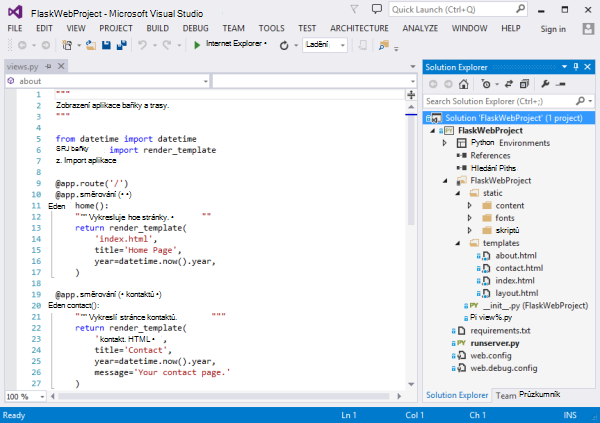
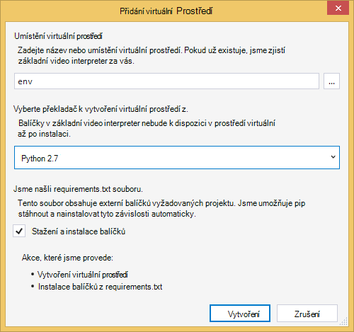
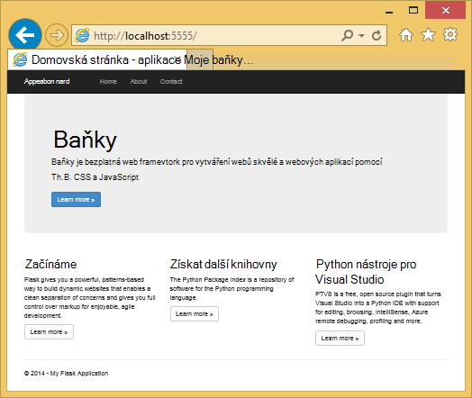
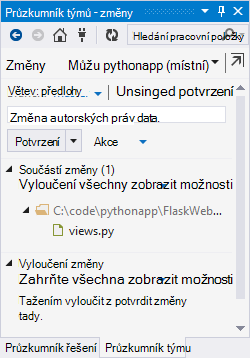
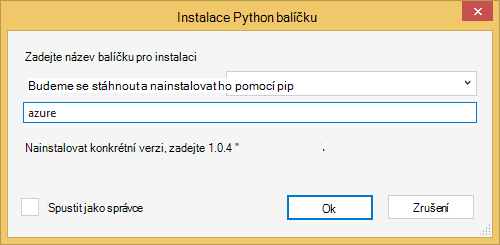
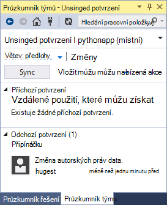
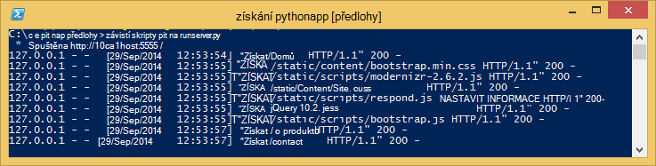
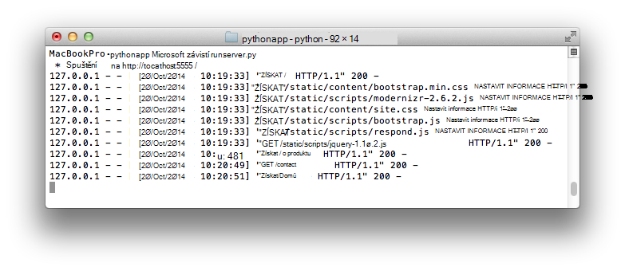
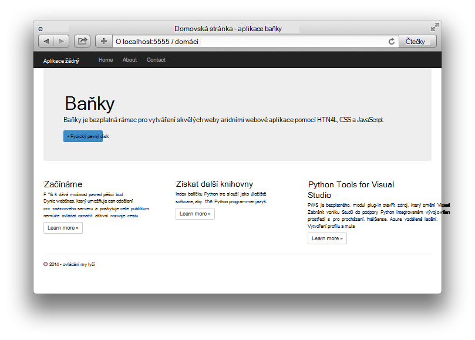

<properties 
    pageTitle="Vytváření webových aplikací web apps s baňku Azure" 
    description="Kurz, která vás seznámí s spuštěna Azure Python web appu." 
    services="app-service\web" 
    documentationCenter="python"
    tags="python"
    authors="huguesv" 
    manager="wpickett" 
    editor=""/>

<tags 
    ms.service="app-service-web" 
    ms.workload="web" 
    ms.tgt_pltfrm="na" 
    ms.devlang="python" 
    ms.topic="article" 
    ms.date="02/20/2016"
    ms.author="huvalo"/>

# Vytváření webových aplikací web apps s baňky v Azure

Tento kurz popisuje, jak začít systém Python v [Azure aplikace služby Web Apps](http://go.microsoft.com/fwlink/?LinkId=529714).  Web Apps poskytuje omezené bezplatná hostingu a rychlého nasazení a používáte Python!  Narůstající velikostí aplikace, můžete přepnout na placené hostování a taky můžete integrovat s všechny ostatní služby Azure.

Vytvoříte aplikace pomocí rozhraní webových baňky (podívejte se na alternativní verze tohoto kurzu [Django](web-sites-python-create-deploy-django-app.md) a [lahev na](web-sites-python-create-deploy-bottle-app.md)).  Vytvoření webu z Galerie Azure, nastavíte libovolná nasazení a klonovat úložiště místně.  Bude pak místně spustit aplikaci, proveďte změny, potvrďte a použít pro Azure.  Kurz ukazuje, jak to provést z Windows nebo Mac a Linux.

[AZURE.INCLUDE [create-account-and-websites-note](../../includes/create-account-and-websites-note.md)]

>[AZURE.NOTE] Pokud chcete začít pracovat s aplikaci služby Azure před registrací účet Azure, přejděte na [Zkuste aplikaci služby](http://go.microsoft.com/fwlink/?LinkId=523751), které můžete okamžitě vytvořit web appu krátkodobý starter v aplikaci služby. Žádné povinné; kreditní karty žádné závazky.

## Zjistit předpoklady pro

- Systémy Windows, Mac a Linux
- Python 2.7 nebo 3.4
- setuptools, pip, virtualenv (pouze Python 2.7)
- Libovolná
- [Python Tools for Visual Studio][] Poznámka: (PTVS) -: Toto je nepovinný krok

**Poznámka**: publikování TFS aktuálně nepodporuje Python projektů.

### Windows

Pokud ještě nemáte Python 2.7 nebo 3.4 nainstalovaný (32bitová verze), doporučujeme nainstalovat [Azure SDK Python 2.7] nebo [Azure SDK Python 3.4] pomocí webové platformy.  Nainstalujete 32bitovou verzi Python setuptools, pip, virtualenv, atd (32bitová verze Python je nainstalovaných v počítačích Azure hostitele).  Můžete taky dostanete Python z [python.org].

Libovolná doporučujeme [Libovolná pro Windows] nebo [GitHub pro Windows].  Pokud používáte Visual Studiu, můžete použít integrovanou libovolná podporu.

Také, doporučujeme nainstalovat [Python nástroje 2.2 for Visual Studio].  Toto je nepovinný krok, ale pokud máte [Visual Studiu], včetně bezplatná Visual Studio komunity 2013 nebo Visual Studio Express 2013 pro Web, potom to vám nabídne skvělé integrovaném vývojovém Python prostředí.

### Mac a Linux

Má mít Python a libovolná už nainstalovaný, ale ujistěte se, že máte Python 2.7 nebo 3.4.

## Na portálu Azure vytvořit web appu

Prvním krokem při vytváření aplikace je vytvořit web appu prostřednictvím [Portálu Azure](https://portal.azure.com). 

1. Přihlaste se k portálu Azure a klikněte na tlačítko **Nový** v levém dolním rohu. 
2. Klikněte na **Web + Mobile**.
3. Do vyhledávacího pole zadejte "python".
4. Ve výsledcích hledání vyberte **baňky**a potom klikněte na **vytvořit**.
5. Nakonfigurujte novou aplikaci baňky, jako je vytvoření nového plánu aplikace služby a nové skupiny prostředků pro něj. Potom klikněte na **vytvořit**.
6. Postupujte podle pokynů v [Místním nasazení libovolná aplikace služby Azure](app-service-deploy-local-git.md)konfigurace libovolná publikování pro nově vytvořený web app.

## Přehled aplikací

### Libovolná úložiště obsah

Tady je přehled soubory, které budete v počáteční libovolná úložiště, které jsme budete klonovat v další části.

    \FlaskWebProject\__init__.py
    \FlaskWebProject\views.py
    \FlaskWebProject\static\content\
    \FlaskWebProject\static\fonts\
    \FlaskWebProject\static\scripts\
    \FlaskWebProject\templates\about.html
    \FlaskWebProject\templates\contact.html
    \FlaskWebProject\templates\index.html
    \FlaskWebProject\templates\layout.html

Hlavní zdroje pro aplikaci.  Obsahuje 3 stránek (o kontaktu index) s rozložení předlohy.  Statický obsah a skripty obsahují zavádění, jquery, knihovny a odpovědět na ni.

    \runserver.py

Podpora místní vývoje serveru. Slouží k místní spuštění aplikace.

    \FlaskWebProject.pyproj
    \FlaskWebProject.sln

Soubory pro použití s [Python Tools for Visual Studio]projektu.

    \ptvs_virtualenv_proxy.py

Proxy serveru IIS virtuální prostředí a PTVS vzdálené ladění podpory.

    \requirements.txt

Externí balíčků potřeby tak, že této aplikace. Skript pro nasazení se pip instalaci balíčků uvedené v tomto souboru.
 
    \web.2.7.config
    \web.3.4.config

Konfigurace služby IIS soubory.  Skript pro nasazení pomocí příslušné web.x.y.config a Kopírovat jako web.config.

### Volitelné soubory – vlastní nastavení nasazení

[AZURE.INCLUDE [web-sites-python-customizing-deployment](../../includes/web-sites-python-customizing-deployment.md)]

### Volitelné soubory - Python runtime

[AZURE.INCLUDE [web-sites-python-customizing-runtime](../../includes/web-sites-python-customizing-runtime.md)]

### Další soubory na server

Některé soubory na serveru, které ale nejsou přidali do úložiště libovolná.  Toto jsou vytvářeny skript pro nasazení.

    \web.config

Konfigurační soubor Internetové informační služby.  Vytvořená z web.x.y.config v každé nasazení.

    \env\

Virtuální prostředí Python.  Pokud vytvoří se při nasazení kompatibilní virtuální prostředí ještě neexistuje na aplikace.  Balíčky uvedené v requirements.txt jsou pip nainstalovaný, ale pip přeskočí instalaci, pokud už máte nainstalované balíčky.

Další 3 oddíly popisují, jak pokračovat vývoj aplikací webu klikněte v části 3 různých prostředích:

- Windows s Python Tools for Visual Studio
- Windows s příkazového řádku
- Mac a Linux příkazového řádku

## Vývoj pro web app – Windows – Python Tools for Visual Studio

### Klonovat úložiště

Nejdřív klonovat úložiště pomocí adresy URL umístěna na portálu Azure. Další informace najdete v tématu [Místní nasazení libovolná aplikace služby Azure](app-service-deploy-local-git.md).

Otevřete soubor řešení (SLN), který je součástí kořenové úložiště.

### Vytvořit virtuální prostředí

Nyní vytvoříme virtuální prostředí pro místní vývoj.  Klikněte pravým tlačítkem myši na **Prostředí Python** vyberte **Přidat virtuální prostředí …**.

- Přesvědčte se, zda je v poli Název prostředí `env`.

- Vyberte základní video interpreter.  Zkontrolujte, že použít stejnou verzi aplikace Python vybrané pro webovou aplikaci (v runtime.txt nebo **Nastavení aplikace** zásuvné webovou aplikaci na portálu Azure).

- Ujistěte se, že je zaškrtnuté políčko si stáhněte a nainstalujte balíčků.

Klikněte na **vytvořit**.  To vytvořit virtuální prostředí a nainstalujte závislosti uvedené v requirements.txt.

### Spuštění pomocí vývojového serveru

Stisknutím klávesy F5 ladění spustit a váš webový prohlížeč na stránku místně spuštěné automaticky otevře.

Nastavit zarážky ve zdrojích, použijte windows podívejte se na video atd.  Zobrazit [Python Tools for Visual Studio dokumentace] Další informace o jednotlivých funkcích.

### Proveďte změny

Teď můžete experimentovat změnou zdrojů aplikace a/nebo šablony.

Po otestování změny potvrďte je do úložiště libovolná:

### Instalace další balíčků

Závislosti za Python a baňky může mít vaše aplikace.

Další balíčků pomocí pip můžete nainstalovat.  K instalaci balíčku, klikněte pravým tlačítkem myši na virtuální prostředí a vyberte **Nainstalovat Python balíčku**.

Instalace Azure SDK Python, které vám umožňuje přístup k Azure úložiště, bus služby a další služby Azure, zadejte například `azure`:

Klikněte pravým tlačítkem myši na virtuální prostředí a vyberte **Generovat requirements.txt** aktualizovat requirements.txt.

Pak potvrďte změny provedené v requirements.txt libovolná úložiště.

### Nasazení Azure

Spustit nasazení, klepněte na **synchronizovat** nebo **nabízená**.  Synchronizace se push a vložit.

První nasazení bude určitou dobu trvat, jako se vytváří prostředí virtuální balíčků Instalační, atd.

Visual Studio se nezobrazují průběh nasazení.  Pokud chcete zkontrolovat výstup, naleznete v tématu [Poradce při potížích – nasazení](#troubleshooting-deployment).

Přejděte na adresu URL Azure zobrazíte provedené změny.

## Vývoj aplikací – Windows – příkazového řádku pro web

### Klonovat úložiště

Nejdřív klonovat úložiště pomocí adresy URL umístěna na portálu Azure a přidejte Azure úložiště jako vzdálené. Další informace najdete v tématu [Místní nasazení libovolná aplikace služby Azure](app-service-deploy-local-git.md).

    git clone <repo-url>
    cd <repo-folder>
    git remote add azure <repo-url> 

### Vytvořit virtuální prostředí

Vytvoříme nové prostředí virtuální pro účely vývoj (nepřidávejte jej do úložiště).  Virtuální prostředí v Python nejsou přemístitelný, aby každý vývojáři pracují na aplikaci bude vytvářet své vlastní místně.

Zkontrolujte, že použít stejnou verzi aplikace Python vybrané pro webovou aplikaci (v runtime.txt nebo **Nastavení aplikace** zásuvné webovou aplikaci na portálu Azure).

Pro Python 2.7:

    c:\python27\python.exe -m virtualenv env

Pro Python 3.4:

    c:\python34\python.exe -m venv env

Nainstalujte všechny externí balíčky vyžaduje vaše aplikace. Soubor requirements.txt kořenové úložiště slouží k instalaci balíčků ve vašem prostředí virtuální:

    env\scripts\pip install -r requirements.txt

### Spuštění pomocí vývojového serveru

Samostatné aplikace v části vývojového serveru pomocí následujícího příkazu:

    env\scripts\python runserver.py

Na konzole se zobrazí adresu URL a přijímá port serveru:

Potom otevřete webový prohlížeč na tuto adresu URL.

### Proveďte změny

Teď můžete experimentovat změnou zdrojů aplikace a/nebo šablony.

Po otestování změny potvrďte je do úložiště libovolná:

    git add <modified-file>
    git commit -m "<commit-comment>"

### Instalace další balíčků

Závislosti za Python a baňky může mít vaše aplikace.

Další balíčků pomocí pip můžete nainstalovat.  Instalace Azure SDK Python, které vám umožňuje přístup k Azure úložiště, bus služby a další služby Azure, zadejte například:

    env\scripts\pip install azure

Zkontrolujte, že aktualizace requirements.txt:

    env\scripts\pip freeze > requirements.txt

Potvrďte změny:

    git add requirements.txt
    git commit -m "Added azure package"

### Nasazení Azure

Spustit nasazení, použít změny pro Azure:

    git push azure master

Zobrazí se výstup skript pro nasazení včetně virtuální prostředí vytváření instalace balení, vytvoření web.config.

Přejděte na adresu URL Azure zobrazíte provedené změny.

## Vývoj aplikací – Mac a Linux - příkazového řádku pro web

### Klonovat úložiště

Nejdřív klonovat úložiště pomocí adresy URL umístěna na portálu Azure a přidejte Azure úložiště jako vzdálené. Další informace najdete v tématu [Místní nasazení libovolná aplikace služby Azure](app-service-deploy-local-git.md).

    git clone <repo-url>
    cd <repo-folder>
    git remote add azure <repo-url> 

### Vytvořit virtuální prostředí

Vytvoříme nové prostředí virtuální pro účely vývoj (nepřidávejte jej do úložiště).  Virtuální prostředí v Python nejsou přemístitelný, aby každý vývojáři pracují na aplikaci bude vytvářet své vlastní místně.

Zkontrolujte, že použít stejnou verzi aplikace Python vybrané pro webovou aplikaci (v runtime.txt nebo **Nastavení aplikace** zásuvné webovou aplikaci na portálu Azure).

Pro Python 2.7:

    python -m virtualenv env

Pro Python 3.4:

    python -m venv env
nebo pyvenv Obálka

Nainstalujte všechny externí balíčky vyžaduje vaše aplikace. Soubor requirements.txt kořenové úložiště slouží k instalaci balíčků ve vašem prostředí virtuální:

    env/bin/pip install -r requirements.txt

### Spuštění pomocí vývojového serveru

Samostatné aplikace v části vývojového serveru pomocí následujícího příkazu:

    env/bin/python runserver.py

Na konzole se zobrazí adresu URL a přijímá port serveru:

Potom otevřete webový prohlížeč na tuto adresu URL.

### Proveďte změny

Teď můžete experimentovat změnou zdrojů aplikace a/nebo šablony.

Po otestování změny potvrďte je do úložiště libovolná:

    git add <modified-file>
    git commit -m "<commit-comment>"

### Instalace další balíčků

Závislosti za Python a baňky může mít vaše aplikace.

Další balíčků pomocí pip můžete nainstalovat.  Instalace Azure SDK Python, které vám umožňuje přístup k Azure úložiště, bus služby a další služby Azure, zadejte například:

    env/bin/pip install azure

Zkontrolujte, že aktualizace requirements.txt:

    env/bin/pip freeze > requirements.txt

Potvrďte změny:

    git add requirements.txt
    git commit -m "Added azure package"

### Nasazení Azure

Spustit nasazení, použít změny pro Azure:

    git push azure master

Zobrazí se výstup skript pro nasazení včetně virtuální prostředí vytváření instalace balení, vytvoření web.config.

Přejděte na adresu URL Azure zobrazíte provedené změny.

## Poradce při potížích – instalační balíček

[AZURE.INCLUDE [web-sites-python-troubleshooting-package-installation](../../includes/web-sites-python-troubleshooting-package-installation.md)]

## Poradce při potížích – virtuální prostředí

[AZURE.INCLUDE [web-sites-python-troubleshooting-virtual-environment](../../includes/web-sites-python-troubleshooting-virtual-environment.md)]

## Další kroky

Tyto odkazy vedou na další informace o baňky a nástroje Python for Visual Studio: 
 
- [Si přečtěte následující dokumentaci baňky]
- [Python Tools for Visual Studio si přečtěte následující dokumentaci]

Informace o použití úložiště tabulek Azure a MongoDB:

- [Baňka a MongoDB na Azure s Python Tools for Visual Studio]
- [Baňka a úložiště tabulek Azure na Azure s Python Tools for Visual Studio]

Další informace najdete v tématu taky [Středisko pro vývojáře Python](/develop/python/).

## Co se změnilo
* Průvodce na změnu z webů pro aplikaci služby v tématu: [aplikaci služby Azure a jeho dopad na existující služby Azure](http://go.microsoft.com/fwlink/?LinkId=529714)

<!--Link references-->
[Baňka a MongoDB na Azure s Python Tools for Visual Studio]: https://github.com/microsoft/ptvs/wiki/Flask-and-MongoDB-on-Azure
[Baňka a úložiště tabulek Azure na Azure s Python Tools for Visual Studio]: web-sites-python-ptvs-flask-table-storage.md

<!--External Link references-->
[Azure SDK Python 2.7]: http://go.microsoft.com/fwlink/?linkid=254281
[Azure SDK Python 3.4]: http://go.microsoft.com/fwlink/?linkid=516990
[Python.org]: http://www.python.org/
[Libovolná pro Windows]: http://msysgit.github.io/
[GitHub pro Windows]: https://windows.github.com/
[Python Tools for Visual Studio]: http://aka.ms/ptvs
[Python 2.2 Tools for Visual Studio]: http://go.microsoft.com/fwlink/?LinkID=624025
[Visual Studio]: http://www.visualstudio.com/
[Python Tools for Visual Studio si přečtěte následující dokumentaci]: http://aka.ms/ptvsdocs
[Si přečtěte následující dokumentaci baňky]: http://flask.pocoo.org/ 
 
