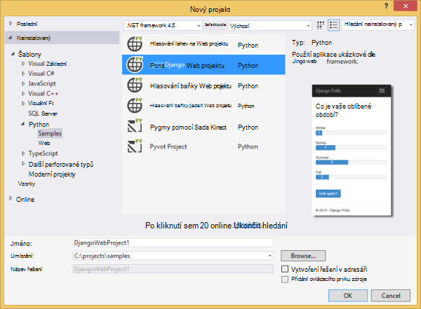
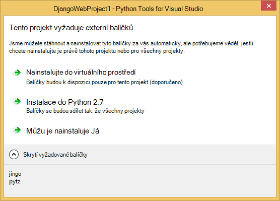
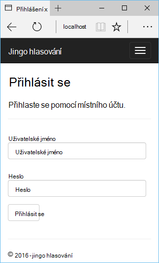
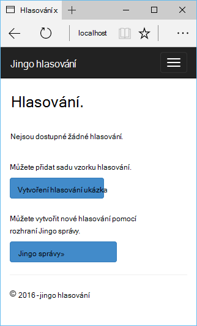
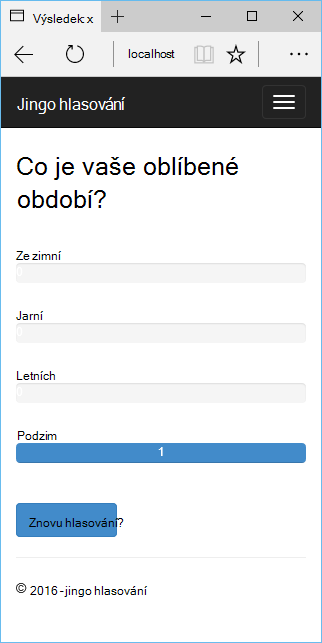
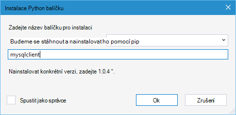
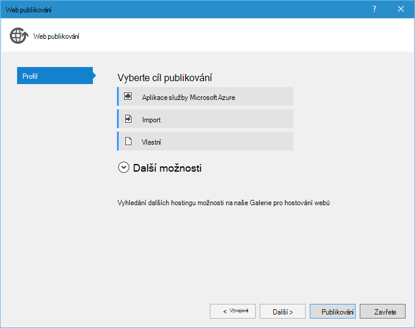
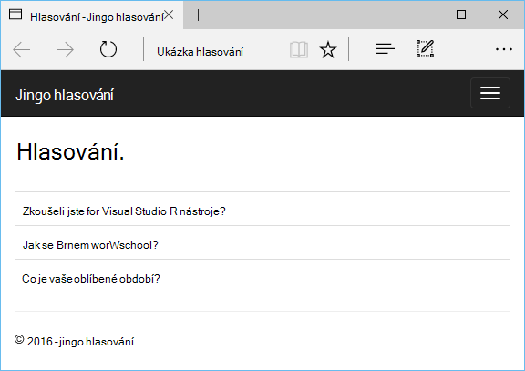

<properties 
    pageTitle="Django a MySQL Azure pomocí nástrojů Python 2.2 for Visual Studio" 
    description="Naučte se používat nástroje Python for Visual Studio vytvořit web appu Django obsahujícího data instance databáze MySQL a ho nasadit do Azure aplikace služby Web Apps." 
    services="app-service\web" 
    documentationCenter="python" 
    authors="huguesv" 
    manager="wpickett" 
    editor=""/>

<tags 
    ms.service="app-service-web" 
    ms.workload="web" 
    ms.tgt_pltfrm="na" 
    ms.devlang="python"
    ms.topic="get-started-article" 
    ms.date="07/07/2016"
    ms.author="huvalo"/>

# Django a MySQL Azure pomocí nástrojů Python 2.2 for Visual Studio 

[AZURE.INCLUDE [tabs](../../includes/app-service-web-get-started-nav-tabs.md)]

V tomto kurzu použijete k vytvoříte jednoduché hlasování webovou aplikaci pomocí jedné ze šablon ukázkové PTVS [Python Tools for Visual Studio] (PTVS). Se dozvíte, jak používat službu MySQL hostitelem Azure, jak nakonfigurovat web appu používat MySQL a jak publikovat web appu [Azure aplikace služby Web Apps](http://go.microsoft.com/fwlink/?LinkId=529714).

> [AZURE.NOTE] Informace obsažené v tomto kurzu je také k dispozici v následujícím videu:
> 
> [PTVS 2.1: Aplikaci Django s MySQL][video]

Viz [Středisko pro vývojáře Python] další články, které tam rozvojem Azure aplikace služby webových aplikací Web Apps s PTVS pomocí lahve, baňky a Django rámce webové služby úložiště tabulek Azure MySQL a databáze SQL. Tento článek se zaměřuje na aplikaci služby, kroky jsou podobné při vytváření [Azure Cloud Services].

## Zjistit předpoklady pro

 - Visual Studio 2015
 - [Python 2.7 32bitová verze] nebo [Python 3.4 32bitová verze]
 - [Python 2.2 Tools for Visual Studio]
 - [Python Tools for Visual Studio ukázky VSIX 2.2]
 - [Azure SDK nástroje pro a 2015]
 - Django 1,9 nebo novější

[AZURE.INCLUDE [create-account-and-websites-note](../../includes/create-account-and-websites-note.md)]

<!-- This note should not render as part of the the previous include. -->

> [AZURE.NOTE] Pokud chcete začít pracovat s aplikaci služby Azure před registrací účet Azure, přejděte na [Zkuste aplikaci služby](http://go.microsoft.com/fwlink/?LinkId=523751), které můžete okamžitě vytvořit web appu krátkodobý starter v aplikaci služby. Požaduje bez platební kartou a bez závazky jsou potřeba.

## Vytvoření projektu

V této části vytvoříte Visual Studio projektu v ukázkové šablony. Vytvoříte prostředí virtuální a nainstalovat požadovaný balíčků. Vytvoříte pomocí sqlite místní databázi. Pak spustíte aplikaci místně.

1. Ve Visual Studiu vyberte **soubor**, **Nový projekt**.

1. Šablony projektu z [Python 2.2 nástroje pro aplikace Visual Studio ukázky VSIX] jsou k dispozici v části **Python**, **ukázek**. Vyberte **Hlasování Django Web Project** a vytvořte projekt kliknutím na OK.

    

1. Zobrazí se výzva k instalaci externí balíčků. Vyberte **nainstalovat do virtuálního prostředí**.

    

1. Vyberte jako základní video interpreter **Python 2.7** nebo **Python 3.4** .

    

1. V **Okně Průzkumník řešení**klikněte pravým tlačítkem myši na uzel projektu a vyberte **Python**a pak vyberte **Django migrace**.  Vyberte **Vytvořit Superuser Django**.

1. Tím spusťte konzolu Správa Django a vytvořit databázi sqlite ve složce projektu. Postupujte podle pokynů k vytvoření uživatele.

1. Potvrzení, že aplikace funguje stisknutím kombinace kláves `F5`.

1. V navigačním panelu v horní klikněte na **přihlásit** .

    

1. Zadejte přihlašovací údaje uživatele, který jste vytvořili při synchronizaci databáze.

    

1. Klikněte na **Vytvořit hlasování vzorku**.

    

1. Klikněte na hlasování a hlasování.

    

## Vytvoření databáze MySQL

Pro databázi vytvoříte hostovanou databáze ClearDB MySQL na Azure.

Jako alternativu můžete vytvářet vlastní virtuální počítač v Azure, a pak nainstalovat a spravovat MySQL sami.

Provedením těchto kroků můžete vytvořit databázi pomocí bezplatné plánu.

1. Přihlaste se k [portálu Azure].

1. V horní části navigačního podokna klikněte na **Nový**a pak klikněte na **Data + úložiště**a klikněte na **Databáze MySQL**. 

1. Vytvoření nové skupiny prostředků nakonfigurovat nové databáze MySQL a vyberte požadované umístění pro něj.

1. Po vytvoření databáze MySQL v zásuvné databáze klikněte na **Vlastnosti** .

1. Pomocí tlačítka Kopírovat vložte hodnotu **PŘIPOJOVACÍ řetězec** do schránky.

## Konfigurace projektu

V této části nakonfigurujete naše web appu používat databáze MySQL, který jste právě vytvořili. Budete taky nainstalovat další balíčky Python potřebný k použití databáze MySQL s Django. Potom spuštěním web appu místně.

1. Ve Visual Studiu otevřete **settings.py**ze složky *názevprojektu* . V editoru dočasně vložte připojovací řetězec. Připojovací řetězec je v tomto formátu:

        Database=<NAME>;Data Source=<HOST>;User Id=<USER>;Password=<PASSWORD>

    Změnit výchozí databázi **ENGINE** použít MySQL, aplikaci a nastavit hodnoty **název**, **uživatele**, **heslo** a **hostitele** **CONNECTIONSTRING**.

        DATABASES = {
            'default': {
                'ENGINE': 'django.db.backends.mysql',
                'NAME': '<Database>',
                'USER': '<User Id>',
                'PASSWORD': '<Password>',
                'HOST': '<Data Source>',
                'PORT': '',
            }
        }

1. V Průzkumníku v části **Python prostředí**klikněte pravým tlačítkem myši na virtuální prostředí a vyberte **Nainstalovat Python balíček**.

1. Instalace balíček `mysqlclient` pomocí **pip**.

    

1. V **Okně Průzkumník řešení**klikněte pravým tlačítkem myši na uzel projektu a vyberte **Python**a pak vyberte **Django migrace**.  Vyberte **Vytvořit Superuser Django**.

    Tím vytvoříte tabulek pro databázi MySQL, kterou jste vytvořili v předchozí části. Postupujte podle pokynů k vytvoření uživatele, který nemá podle uživatele v databázi sqlite vytvořili v prvním části tohoto článku.

1. Spusťte aplikaci `F5`. Hlasování, které jsou vytvořené pomocí **Vytvoření hlasování vzorku** a data odeslaná hlasování bude serializována databáze MySQL.

## Publikování web appu aplikace služby Azure

Azure .NET SDK poskytuje snadný způsob, jak nasadit webovou aplikaci služby Azure aplikace.

1. V **Okně Průzkumník řešení**klikněte pravým tlačítkem myši na uzel projektu a vyberte **Publikovat**.

    

1. Klikněte na **Microsoft Azure aplikaci služby**.

1. Klikněte na **Nový** k vytvoření nové webové aplikace.

1. Vyplňte následující pole a klikněte na **vytvořit**:
    - **Název webové aplikace**
    - **Plán služeb aplikací**
    - **Pole Skupina zdroje**
    - **Oblast**
    - Nechte **databázový server** nastavte na **bez databáze**

1. Přijmout všechny jiné výchozí hodnoty a klikněte na **Publikovat**.

1. Webový prohlížeč se automaticky otevře do publikovaného web appu. Měli byste vidět práce očekávaným způsobem, databáze **MySQL** hostitelem Azure pomocí web appu.

    

    Blahopřejeme! Na základě MySQL webovou aplikaci se úspěšně publikovaly na Azure.

## Další kroky

Tyto odkazy vedou na další informace o nástrojích Python Visual Studiu, Django a MySQL.

- [Python Tools for Visual Studio si přečtěte následující dokumentaci]
  - [Web projekty]
  - [Cloudové služby projekty]
  - [Vzdálené ladění na Microsoft Azure]
- [Si přečtěte následující dokumentaci Django]
- [MySQL]

Další informace najdete v tématu [Středisko pro vývojáře Python](/develop/python/).

<!--Link references-->

[Středisko pro vývojáře Python]: /develop/python/
[Služby Azure Cloud Services]: ../cloud-services-python-ptvs.md

<!--External Link references-->

[Portál Azure]: https://portal.azure.com
[Python Tools for Visual Studio]: http://aka.ms/ptvs
[Python 2.2 Tools for Visual Studio]: http://go.microsoft.com/fwlink/?LinkID=624025
[Python Tools for Visual Studio ukázky VSIX 2.2]: http://go.microsoft.com/fwlink/?LinkID=624025
[Azure SDK nástroje pro a 2015]: http://go.microsoft.com/fwlink/?LinkId=518003
[Python 2.7 32bitová verze]: http://go.microsoft.com/fwlink/?LinkId=517190 
[Python 3.4 32bitová verze]: http://go.microsoft.com/fwlink/?LinkId=517191
[Python Tools for Visual Studio si přečtěte následující dokumentaci]: http://aka.ms/ptvsdocs
[Vzdálené ladění na Microsoft Azure]: http://go.microsoft.com/fwlink/?LinkId=624026
[Web projekty]: http://go.microsoft.com/fwlink/?LinkId=624027
[Cloudové služby projekty]: http://go.microsoft.com/fwlink/?LinkId=624028
[Si přečtěte následující dokumentaci Django]: https://www.djangoproject.com/
[MySQL]: http://www.mysql.com/
[video]: http://youtu.be/oKCApIrS0Lo
