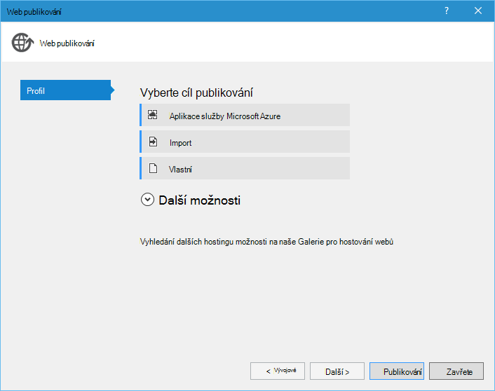

<properties 
    pageTitle="Django a SQL databáze na Azure pomocí nástrojů Python 2.2 for Visual Studio" 
    description="Naučte se používat nástroje Python for Visual Studio vytvořit web appu Django obsahujícího data instance databáze SQL a nasadit na Azure aplikace služby Web Apps." 
    services="app-service\web" 
    tags="python"
    documentationCenter="python" 
    authors="huguesv" 
    manager="wpickett" 
    editor=""/>

<tags 
    ms.service="app-service-web" 
    ms.workload="web" 
    ms.tgt_pltfrm="na" 
    ms.devlang="python" 
    ms.topic="article" 
    ms.date="07/07/2016"
    ms.author="huguesv"/>

# Django a SQL databáze na Azure pomocí nástrojů Python 2.2 for Visual Studio 

V tomto kurzu budeme používat [Python Tools for Visual Studio] při vytváření aplikace jednoduché hlasování web pomocí jedné ze šablon PTVS vzorku. Tento kurz neexistuje také jako [video](https://www.youtube.com/watch?v=ZwcoGcIeHF4).

Jsme najdete informace, jak používat databázi SQL Azure hostitelem, jak nakonfigurovat web appu používat databázi SQL a jak publikovat web appu [Azure aplikace služby Web Apps](http://go.microsoft.com/fwlink/?LinkId=529714).

Viz [Středisko pro vývojáře Python] další články, které tam rozvojem Azure aplikace služby webových aplikací Web Apps s PTVS pomocí lahve, baňky a Django rámce webové služby úložiště tabulek Azure, MySQL a databáze SQL. Tento článek se zaměřuje na aplikaci služby, kroky jsou podobné při vytváření [Azure Cloud Services].

## Zjistit předpoklady pro

 - Visual Studio 2015
 - [Python 2.7 32bitová verze]
 - [Python 2.2 Tools for Visual Studio]
 - [Python Tools for Visual Studio ukázky VSIX 2.2]
 - [Azure SDK nástroje pro a 2015]
 - Django 1,9 nebo novější

[AZURE.INCLUDE [create-account-and-websites-note](../../includes/create-account-and-websites-note.md)]

>[AZURE.NOTE] Pokud chcete začít pracovat s aplikaci služby Azure před registrací účet Azure, přejděte na [Zkuste aplikaci služby](http://go.microsoft.com/fwlink/?LinkId=523751), které můžete okamžitě vytvořit web appu krátkodobý starter v aplikaci služby. Žádné povinné; kreditní karty žádné závazky.

## Vytvoření projektu

V této části vytvoříme Visual Studio projektu v ukázkové šablony. Jsme vytvoříte prostředí virtuální a nainstalovat požadovaný balíčků. Vytvoříme místní databázi pomocí sqlite. Budeme se spusťte web appu místně.

1.  Ve Visual Studiu vyberte **soubor**, **Nový projekt**.

1.  Šablony projektu z [Python 2.2 nástroje pro aplikace Visual Studio ukázky VSIX] jsou k dispozici v části **Python**, **ukázek**. Vyberte **Hlasování Django Web Project** a vytvořte projekt kliknutím na OK.

    

1.  Zobrazí se výzva k instalaci externí balíčků. Vyberte **nainstalovat do virtuálního prostředí**.

    

1.  Vyberte **Python 2.7** jako základní video interpreter.

    

1.  V **Okně Průzkumník řešení**klikněte pravým tlačítkem myši na uzel projektu a vyberte **Python**a pak vyberte **Django migrace**.  Vyberte **Vytvořit Superuser Django**.

1.  Tím spusťte konzolu Správa Django a vytvořit databázi sqlite ve složce projektu. Postupujte podle pokynů k vytvoření uživatele.

1.  Potvrzení, že aplikace funguje stisknutím klávesy <kbd>F5</kbd>.

1.  V navigačním panelu v horní klikněte na **přihlásit** .

    

1.  Zadejte přihlašovací údaje uživatele, který jste vytvořili při synchronizaci databáze.

    

1.  Klikněte na **Vytvořit hlasování vzorku**.

    

1.  Klikněte na hlasování a hlasování.

    

## Vytvoření databáze SQL

Pro databázi vytvoříme databáze Azure SQL.

Vytvoření databáze pomocí následujících kroků.

1.  Přihlaste se k [portálu Azure].

1.  Ve spodní části navigačního podokna klikněte na **Nový**. , klikněte na **Data + úložiště** > **Databáze SQL**.

1.  Vytvoření nové skupiny prostředků nakonfigurovat nové databáze SQL a vyberte požadované umístění pro něj.

1.  Po vytvoření databáze SQL klikněte na **Otevřít v aplikaci Visual Studio** v databázi zásuvné.
2.  Klikněte na **Konfigurovat bránu firewall**.
3.  V **Nastavení brány Firewall** zásuvné přidáte že pravidlo brány firewall **IP zahájení** a **Ukončení IP** nastavena na veřejnou IP adresu počítače vývoj. Klikněte na **Uložit**.

    Připojení k databázovému serveru to vám umožní z počítače vývoj.

4.  Po návratu do zásuvné databáze klikněte na **Vlastnosti**a potom klikněte na **Zobrazit řetězců připojení k databázi**. 

2.  Pomocí tlačítka Kopírovat vložte hodnotu **ADO.NET** do schránky.

## Konfigurace projektu

V této části jsme budete konfigurovat naše web appu používat SQL databáze, kterou jsme vytvořili. Budete taky nainstalován dalších balíčků Python potřebný k použití SQL databáze s Django. Budeme se spusťte web appu místně.

1.  Ve Visual Studiu otevřete **settings.py**ze složky *názevprojektu* . V editoru dočasně vložte připojovací řetězec. Připojovací řetězec je v tomto formátu:

        Server=<ServerName>,<ServerPort>;Database=<DatabaseName>;User ID=<UserName>;Password={your_password_here};Encrypt=True;TrustServerCertificate=False;Connection Timeout=30;

Úprava definice `DATABASES` použití výše uvedených hodnot.

        DATABASES = {
            'default': {
                'ENGINE': 'sql_server.pyodbc',
                'NAME': '<DatabaseName>',
                'USER': '<UserName>',
                'PASSWORD': '{your_password_here}',
                'HOST': '<ServerName>',
                'PORT': '<ServerPort>',
                'OPTIONS': {
                    'driver': 'SQL Server Native Client 11.0',
                    'MARS_Connection': 'True',
                }
            }
        }

1.  V Průzkumníku v části **Python prostředí**klikněte pravým tlačítkem myši na virtuální prostředí a vyberte **Nainstalovat Python balíček**.

1.  Instalace balíček `pyodbc` pomocí **pip**.

    

1.  Instalace balíček `django-pyodbc-azure` pomocí **pip**.

    

1.  V **Okně Průzkumník řešení**klikněte pravým tlačítkem myši na uzel projektu a vyberte **Python**a pak vyberte **Django migrace**.  Vyberte **Vytvořit Superuser Django**.

    Tím vytvoříte tabulky SQL databáze, kterou jsme vytvořili v předchozí části. Postupujte podle pokynů k vytvoření uživatele, který nemá podle uživatele systému sqlite databáze vytvořené v části první.

1.  Spusťte aplikaci `F5`. Hlasování, které jsou vytvořené pomocí **Vytvoření hlasování vzorku** a data odeslaná hlasování bude serializován v databázi SQL.

## Publikování web appu aplikace služby Azure

Azure .NET SDK poskytuje snadný způsob, jak nasadit webovou aplikaci webu Azure aplikace služby Web Apps.

1.  V **Okně Průzkumník řešení**klikněte pravým tlačítkem myši na uzel projektu a vyberte **Publikovat**.

    

1.  Klikněte na **Microsoft Azure webové aplikace**.

1.  Klikněte na **Nový** k vytvoření nové webové aplikace.

1.  Vyplňte následující pole a klikněte na **vytvořit**.
    -   **Název webové aplikace**
    -   **Plán služeb aplikací**
    -   **Pole Skupina zdroje**
    -   **Oblast**
    -   Nechte **databázový server** nastavte na **bez databáze**

1.  Přijmout všechny jiné výchozí hodnoty a klikněte na **Publikovat**.

1.  Webový prohlížeč se automaticky otevře do publikovaného web appu. Měli byste vidět web appu práce očekávaným způsobem, pomocí databáze **SQL** Azure hostitelem.

    Blahopřejeme!

    

## Další kroky

Tyto odkazy vedou na další informace o nástrojích Python Visual Studiu, Django a databáze SQL.

- [Python Tools for Visual Studio si přečtěte následující dokumentaci]
  - [Web projekty]
  - [Cloudové služby projekty]
  - [Vzdálené ladění na Microsoft Azure]
- [Si přečtěte následující dokumentaci Django]
- [Databáze SQL]

## Co se změnilo
* Průvodce na změnu z webů pro aplikaci služby v tématu: [aplikaci služby Azure a jeho dopad na existující služby Azure](http://go.microsoft.com/fwlink/?LinkId=529714)

<!--Link references-->
[Středisko pro vývojáře Python]: /develop/python/
[Služby Azure Cloud Services]: ../cloud-services-python-ptvs.md

<!--External Link references-->
[Azure portálu]: https://portal.azure.com
[Python Tools for Visual Studio]: http://aka.ms/ptvs
[Python 2.2 Tools for Visual Studio]: http://go.microsoft.com/fwlink/?LinkID=624025
[Python Tools for Visual Studio ukázky VSIX 2.2]: http://go.microsoft.com/fwlink/?LinkID=624025
[Azure SDK nástroje pro a 2015]: http://go.microsoft.com/fwlink/?LinkId=518003
[Python 2.7 32bitová verze]: http://go.microsoft.com/fwlink/?LinkId=517190 
[Python Tools for Visual Studio si přečtěte následující dokumentaci]: http://aka.ms/ptvsdocs
[Vzdálené ladění na Microsoft Azure]: http://go.microsoft.com/fwlink/?LinkId=624026
[Web projekty]: http://go.microsoft.com/fwlink/?LinkId=624027
[Cloudové služby projekty]: http://go.microsoft.com/fwlink/?LinkId=624028
[Si přečtěte následující dokumentaci Django]: https://www.djangoproject.com/
[Databáze SQL]: /documentation/services/sql-database/
