<properties 
    pageTitle="Baňka a Azure Table Storage na Azure pomocí nástrojů Python 2.2 for Visual Studio" 
    description="Naučte se používat nástroje Python for Visual Studio při vytváření aplikace baňky web, který uchovává data v úložišti tabulek Azure a nasadit na Azure aplikace služby Web Apps." 
    services="app-service\web"
    tags="python"
    documentationCenter="python" 
    authors="huguesv" 
    manager="wpickett" 
    editor=""/>

<tags 
    ms.service="app-service-web" 
    ms.workload="web" 
    ms.tgt_pltfrm="na" 
    ms.devlang="python" 
    ms.topic="article" 
    ms.date="07/07/2016"
    ms.author="huvalo"/>

# Baňka a úložiště tabulek Azure na Azure pomocí nástrojů Python 2.2 for Visual Studio 

V tomto kurzu budeme používat [Python Tools for Visual Studio] při vytváření aplikace jednoduché hlasování web pomocí jedné ze šablon PTVS vzorku. Tento kurz neexistuje také jako [video](https://www.youtube.com/watch?v=qUtZWtPwbTk).

Web appu hlasování definuje odběru pro jeho úložiště, takže můžete snadno přepínat mezi různými typy úložištích (v paměti úložiště tabulek Azure MongoDB).

Jsme najdete informace, jak vytvořit účet Azure úložiště, jak nakonfigurovat web appu používat úložiště tabulek Azure a jak publikovat web appu k [Azure aplikace služby Web Apps](http://go.microsoft.com/fwlink/?LinkId=529714).

Viz [Středisko pro vývojáře Python] další články, které tam rozvojem Azure aplikace služby webových aplikací Web Apps s PTVS pomocí lahve, baňky a Django rámce webové služby MongoDB úložiště tabulek Azure, MySQL a databáze SQL. Tento článek se zaměřuje na aplikaci služby, kroky jsou podobné při vytváření [Azure Cloud Services].

## Zjistit předpoklady pro

 - Visual Studio 2015
 - [Python 2.2 Tools for Visual Studio]
 - [Python Tools for Visual Studio ukázky VSIX 2.2]
 - [Azure SDK nástroje pro a 2015]
 - [Python 2.7 32bitová verze] nebo [Python 3.4 32bitová verze]

[AZURE.INCLUDE [create-account-and-websites-note](../../includes/create-account-and-websites-note.md)]

>[AZURE.NOTE] Pokud chcete začít pracovat s aplikaci služby Azure před registrací účet Azure, přejděte na [Zkuste aplikaci služby](http://go.microsoft.com/fwlink/?LinkId=523751), které můžete okamžitě vytvořit web appu krátkodobý starter v aplikaci služby. Žádné povinné; kreditní karty žádné závazky.

## Vytvoření projektu

V této části vytvoříme Visual Studio projektu v ukázkové šablony. Jsme vytvoříte prostředí virtuální a nainstalovat požadovaný balíčků. Budeme se spusťte aplikaci místně s použitím výchozího v paměti úložiště.

1.  Ve Visual Studiu vyberte **soubor**, **Nový projekt**.

1.  Šablony projektu z [Python 2.2 nástroje pro aplikace Visual Studio ukázky VSIX] jsou k dispozici v části **Python**, **ukázek**. Vyberte **Hlasování baňky Web Project** a vytvořte projekt kliknutím na OK.

    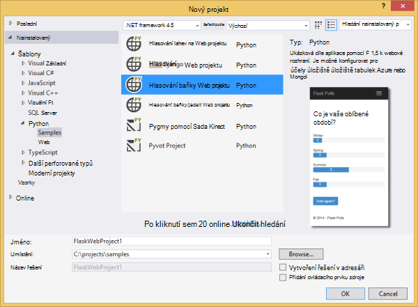

1.  Zobrazí se výzva k instalaci externí balíčků. Vyberte **nainstalovat do virtuálního prostředí**.

    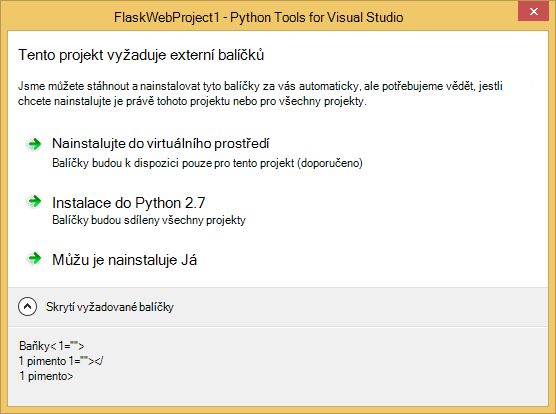

1.  Vyberte jako základní video interpreter **Python 2.7** nebo **Python 3.4** .

    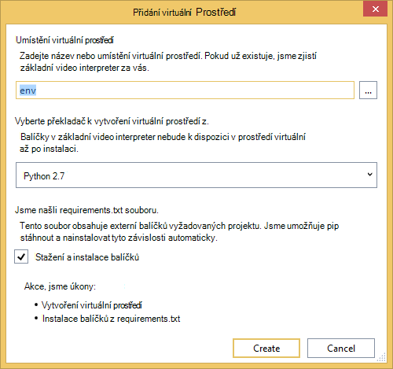

1.  Potvrzení, že aplikace funguje stisknutím kombinace kláves `F5`. Ve výchozím nastavení používá aplikace v paměti úložiště, který nevyžaduje žádnou konfiguraci. Všechna data budou ztraceny při zastavení webový server.

1.  Klikněte na **Vytvořit hlasování vzorku**a potom klikněte na hlasování a hlasování.

    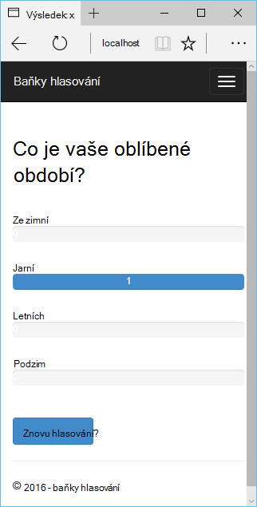

## Vytvořte účet Azure úložiště

Abyste mohli používat skladování, potřebujete účet Azure úložiště. Pomocí následujících kroků můžete vytvořit účet úložiště.

1.  Přihlaste se k [portálu Azure](https://portal.azure.com/).

2. Klikněte na ikonu **Nový** horní levé části portálu, potom klikněte na **Data + úložiště** > **Účtu úložiště**. Klikněte na **vytvořit**, a pak zadejte jedinečný název účtu úložiště a pro něj vytvořte nové [pole Skupina zdroje](../azure-resource-manager/resource-group-overview.md) .

    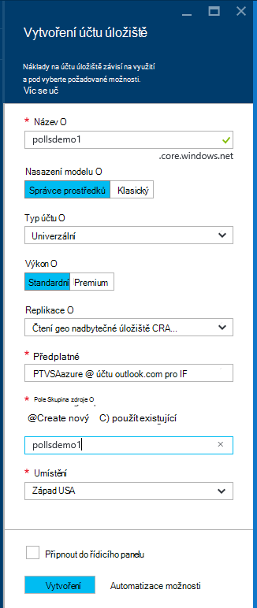

    Po vytvoření účtu úložiště na tlačítko **oznámení** bude flash zelené **úspěšné** a zásuvné účtu úložiště je otevřené zobrazíte patří nové skupiny prostředků, kterou jste vytvořili.

5. Klikněte na část **Přístupových kláves z verze** na zásuvné účtu úložiště. Tady je pár poznámek na název účtu a klíč1.

    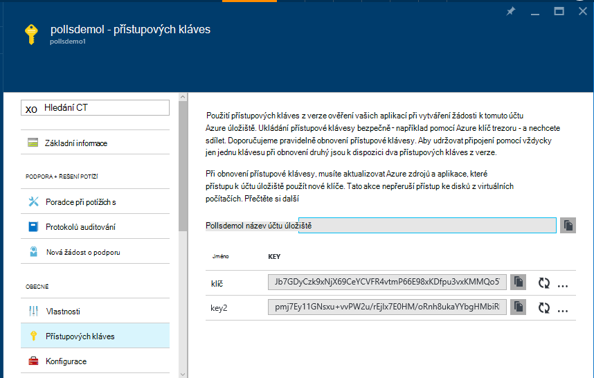

    Potřebujeme tyto informace ke konfiguraci projektu v další části.

## Konfigurace projektu

V této části jsme budete naše aplikace nakonfigurovat pro použití účtu úložiště, kterou jsme vytvořili. Ukážeme, jak získat nastavení připojení z portálu Microsoft Azure. Budeme se spusťte aplikaci místně.

1.  Ve Visual Studiu klikněte pravým tlačítkem myši na uzel projektu v Průzkumníku řešení a vyberte **Vlastnosti**. Klikněte na kartu **ladění** .

    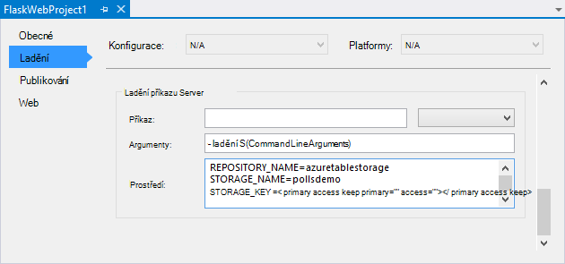

1.  Nastavení hodnot proměnné vyžaduje aplikace v **Ladění příkaz serveru** **prostředí**.

        REPOSITORY_NAME=azuretablestorage
        STORAGE_NAME=<storage account name>
        STORAGE_KEY=<primary access key>

    Tato možnost nastaví proměnné prostředí při můžete **Začít ladění**. Pokud chcete proměnné nastavení nastavíte-li **Spustit bez ladění**stejné hodnoty v části **Spuštění příkazu Server** stejně.

    Můžete taky můžete definovat proměnné pomocí ovládacího panelu Windows. To je lepší volba, pokud chcete přihlašovací údaje Neuchovávejte ve zdrojovém kódu / souboru projektu. Všimněte si, že bude potřeba restartovat Visual Studio pro nové hodnoty prostředí k dispozici pro aplikace.

1.  Kód pro implementující úložiště tabulek Azure úložiště je v **models/azuretablestorage.py**. Zobrazit [si přečtěte následující dokumentaci] pro další informace o používání tabulku služba z Python.

1.  Spusťte aplikaci `F5`. Hlasování, které jsou vytvořené pomocí **Vytvoření hlasování vzorku** a data odeslaná hlasování bude serializován v úložišti tabulek Azure.

    > [AZURE.NOTE] Prostředí virtuální 2.7 Python může způsobit výjimku konec ve Visual Studiu.  Stiskněte `F5` pokračujte načítání web projektu.

1.  Přejděte na stránku **o** k ověření, že aplikace používá úložišti **Úložiště tabulek Azure** .

    

## Prozkoumání Azure Table Storage

Není těžké si prohlížení a úpravy tabulek úložiště pomocí Průzkumníka cloudu ve Visual Studiu. V této části používáme Průzkumník serveru zobrazíte obsah v tabulkách aplikace hlasování.

> [AZURE.NOTE] Při této akci musí nástroje systému Microsoft Azure je třeba nainstalovat, které jsou k dispozici v rámci [Azure SDK pro .NET].

1.  Otevřete **Průzkumníka cloudu**. Rozbalte **Úložiště účty**účtu úložiště **tabulek**.

    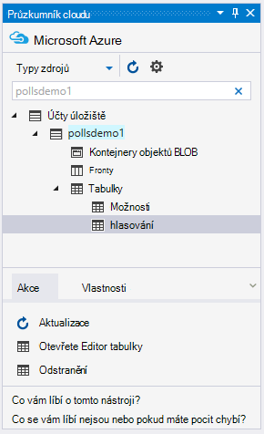

1.  Poklikejte na tabulce **hlasování** nebo **Možnosti** zobrazíte obsah tabulky v okně dokumentu, jakož i Přidat/odebrat/upravit entity.

    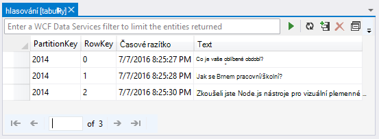

## Publikování web appu aplikace služby Azure

Azure .NET SDK poskytuje snadný způsob, jak nasadit webovou aplikaci služby Azure aplikace.

1.  V **Okně Průzkumník řešení**klikněte pravým tlačítkem myši na uzel projektu a vyberte **Publikovat**.

    

1.  Klikněte na **Microsoft Azure webové aplikace**.

1.  Klikněte na **Nový** k vytvoření nové webové aplikace.

1.  Vyplňte následující pole a klikněte na **vytvořit**.
    -   **Název webové aplikace**
    -   **Plán služeb aplikací**
    -   **Pole Skupina zdroje**
    -   **Oblast**
    -   Nechte **databázový server** nastavte na **bez databáze**

1.  Přijmout všechny jiné výchozí hodnoty a klikněte na **Publikovat**.

1.  Webový prohlížeč se automaticky otevře do publikovaného web appu. Pokud přejdete stránka, zobrazí se použije **V paměti** úložiště, ne úložišti **Úložiště tabulek Azure** .

    Je to proto, že proměnné prostředí nejsou nastavenou na Web Apps instance aplikace služby Azure, tak, aby používala hodnoty zadané v **settings.py**.

## Konfigurace instance Web Apps

V této části jsme budete konfigurovat proměnné instance Web Apps.

1.  [Portál Azure](https://portal.azure.com), otevřete zásuvné web appu po kliknutí na **Procházet** > **Aplikace služby** > název vaší webové aplikace.

1.  V zásuvné webovou aplikaci klikněte na **Všechna nastavení**a potom klikněte na **Nastavení aplikace**.

1.  Přejděte dolů do části **Nastavení aplikace** a nastavte hodnoty pro **úložiště\_název**, **úložiště\_název** a **úložiště\_klíč** podle popisu v části **Konfigurovat projektu** .

    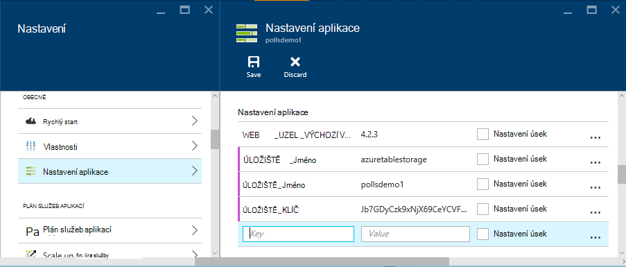

1.  Klikněte na **Uložit**. Poté, co jste dostali oznámení, že byly použity změny, klikněte na **Procházet** z hlavního zásuvné Web app.

1.  Měli byste vidět práce očekávaným způsobem, úložiště **Úložiště tabulek Azure** pomocí web appu.

    Blahopřejeme!

    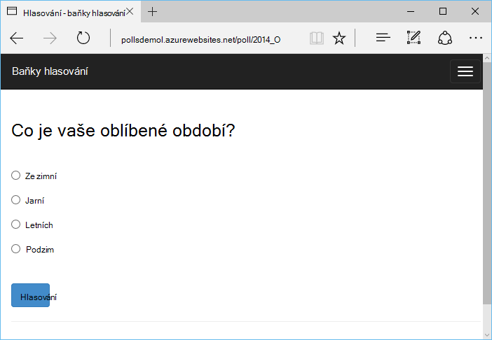

## Další kroky

Tyto odkazy vedou na další informace o nástrojích Python Visual Studiu, baňky a úložiště tabulek Azure.

- [Python Tools for Visual Studio si přečtěte následující dokumentaci]
  - [Web projekty]
  - [Cloudové služby projekty]
  - [Vzdálené ladění na Microsoft Azure]
- [Si přečtěte následující dokumentaci baňky]
- [Azure úložiště]
- [Azure SDK Python]
- [Jak používat tabulku služba úložiště z Python]

## Co se změnilo
* Průvodce na změnu z webů pro aplikaci služby v tématu: [aplikaci služby Azure a jeho dopad na existující služby Azure](http://go.microsoft.com/fwlink/?LinkId=529714)

<!--Link references-->
[Středisko pro vývojáře Python]: /develop/python/
[Služby Azure Cloud Services]: ../cloud-services-python-ptvs.md
[si přečtěte následující dokumentaci]: ../storage-python-how-to-use-table-storage.md
[Jak používat tabulku služba úložiště z Python]: ../storage-python-how-to-use-table-storage.md

<!--External Link references-->
[Azure Portal]: https://portal.azure.com
[Azure SDK pro .NET]: http://azure.microsoft.com/downloads/
[Python Tools for Visual Studio]: http://aka.ms/ptvs
[Python 2.2 Tools for Visual Studio]: http://go.microsoft.com/fwlink/?LinkID=624025
[Python Tools for Visual Studio ukázky VSIX 2.2]: http://go.microsoft.com/fwlink/?LinkID=624025
[Azure SDK nástroje pro a 2015]: http://go.microsoft.com/fwlink/?linkid=518003
[Python 2.7 32bitová verze]: http://go.microsoft.com/fwlink/?LinkId=517190 
[Python 3.4 32bitová verze]: http://go.microsoft.com/fwlink/?LinkId=517191
[Python Tools for Visual Studio si přečtěte následující dokumentaci]: http://aka.ms/ptvsdocs
[Si přečtěte následující dokumentaci baňky]: http://flask.pocoo.org/
[Vzdálené ladění na Microsoft Azure]: http://go.microsoft.com/fwlink/?LinkId=624026
[Web projekty]: http://go.microsoft.com/fwlink/?LinkId=624027
[Cloudové služby projekty]: http://go.microsoft.com/fwlink/?LinkId=624028
[Azure úložiště]: http://azure.microsoft.com/documentation/services/storage/
[Azure SDK Python]: https://github.com/Azure/azure-sdk-for-python
 
