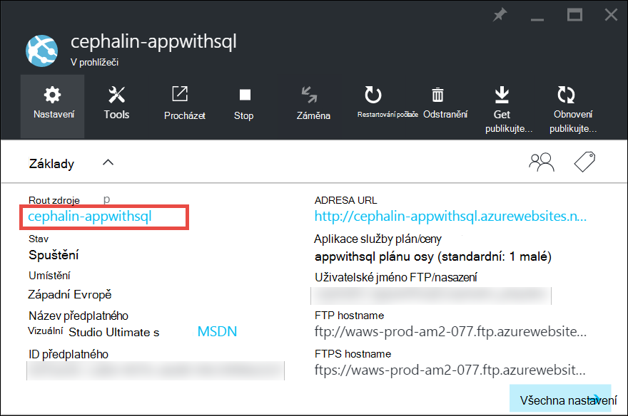
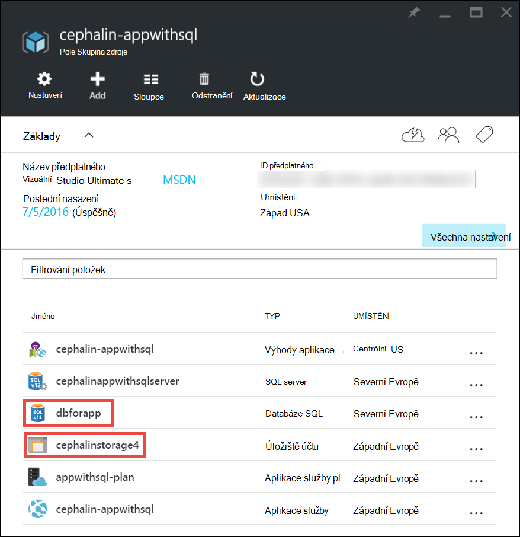
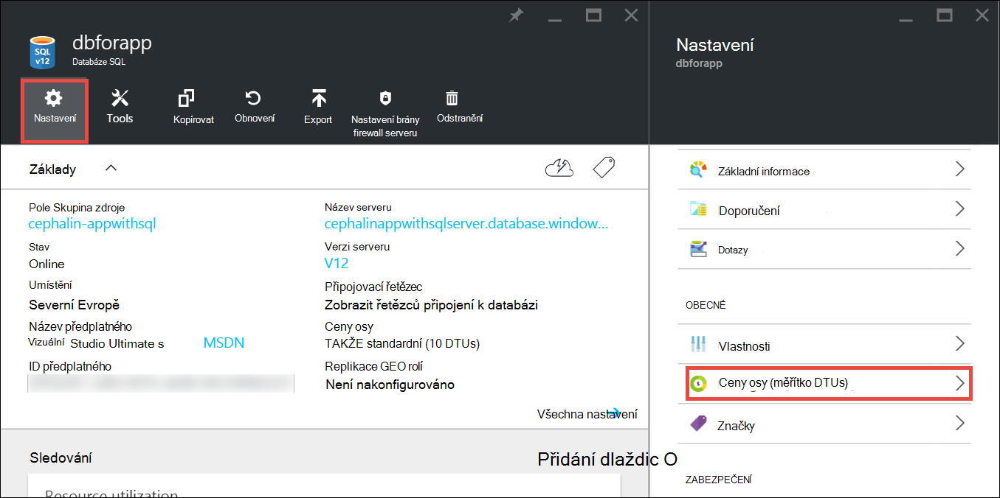
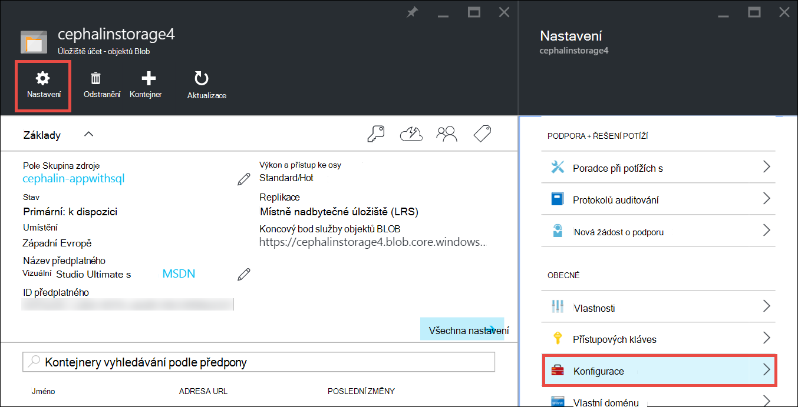

<properties
    pageTitle="Škálování aplikace v Azure | Microsoft Azure"
    description="Naučte se škálování aplikace v aplikaci služby Azure přidat funkce a funkce."
    services="app-service"
    documentationCenter=""
    authors="cephalin"
    manager="wpickett"
    editor="mollybos"/>

<tags
    ms.service="app-service"
    ms.workload="na"
    ms.tgt_pltfrm="na"
    ms.devlang="na"
    ms.topic="article"
    ms.date="07/05/2016"
    ms.author="cephalin"/>

# Škálování aplikace v Azure #

Tento článek ukazuje, jak změnit velikost aplikace v aplikaci služby Azure. Existují dva pracovní postupy pro změny měřítka, měřítko nahoru a měřítko a tento článek vysvětluje měřítko nahoru pracovního postupu.

- [Škálování](https://en.wikipedia.org/wiki/Scalability#Horizontal_and_vertical_scaling): Získejte další procesoru paměti, místo na disku a dalších funkcí, jako je vyhrazený virtuálních počítačích (VMs), vlastní domény a certifikátech, přípravu sloty neobsahovaly text a další. Škálování změnou ceny vrstvě plán služeb aplikace, které patří aplikace.
- [Měřítko,](https://en.wikipedia.org/wiki/Scalability#Horizontal_and_vertical_scaling): zvýšení počtu instance OM, které spustit aplikaci.
Můžete změnit až 20 instancí, v závislosti na ceny vrstvě. [Aplikace služby prostředí](../app-service/app-service-app-service-environments-readme.md) ve vrstvě **Premium** další zvýší škálování count na 50 instance. Další informace o rozšiřování najdete v článku [Měřítko počet instancí, ať už ručně nebo automaticky](../monitoring-and-diagnostics/insights-how-to-scale.md). Zde najdete informace o tom, jak používat neobsahovaly text, který je zobrazit počet instancí automaticky na základě pravidel a plány.

Nastavení měřítka trvat pouze sekund, než použít a ovlivňují všechny aplikace v váš [plán služeb aplikací](../app-service/azure-web-sites-web-hosting-plans-in-depth-overview.md).
Změnu kódu nebo nasadit aplikaci nevyžadují.

Informace o ceny a součástí jednotlivých plánů aplikaci služby najdete v tématu [Údaje ceny aplikace](/pricing/details/web-sites/).  

> [AZURE.NOTE] Před na jiný plán aplikaci služby od osy **zdarma** , je třeba nejprve odebrat [výdaje limity](/pricing/spending-limits/) místě předplatného Azure. Zobrazení nebo změna možností u vašeho předplatného Microsoft Azure aplikaci služby naleznete na [Microsoft Azure předplatná][azuresubscriptions].

## Škálování ceny osy

1. V prohlížeči otevřete [Azure portál][portal].

2. V zásuvné vaše aplikace klikněte na **všechna nastavení**a potom klikněte na **Měřítko nahoru**.

    ![Přejděte na škálování Azure aplikace.][ChooseWHP]

4. Vyberte svůj vrstvy a klikněte na **Vybrat**.

    Karta **oznámení** bude flash zelené **Úspěch** po dokončení operace.

## Zobrazit související materiály
Aplikace závisí na jiných služeb, jako jsou databáze SQL Azure nebo Azure úložiště, můžete také změnit si tyto materiály podle vašich potřeb. Tyto materiály nejsou změněnou velikostí s plán služeb aplikací a musí být zachován samostatně.

1. V **Essentials**klikněte na odkaz **pole Skupina zdroje** .

    

2. V části **Souhrn** zásuvné **pole Skupina zdroje** klikněte na zdroj, který chcete změnit měřítko. Následující obrázek ukazuje zdroj databáze SQL a úložišti Azure zdroje.

    

3. Zdroj databáze SQL, klikněte na **Nastavení** > **ceny osy** zobrazit cen úroveň.

    

    Můžete taky zapnete [geo replikace](../sql-database/sql-database-geo-replication-overview.md) databáze SQL instance.

    Prostředek úložišti Azure klikněte na **Nastavení** > **Konfigurace** zobrazit možnosti úložiště.

    

## Další informace o funkce pro vývojáře
V závislosti na ceny osy orientovaného vývojář jsou k dispozici následující:

### Počet bitů ###

- **Základní** **Standardní**a **Premium** úrovně podpory 64bitovou a 32bitovou verzi aplikace.
- **Zdarma** a **sdílené** plán úrovně podpory pouze 32bitové aplikace.

### Podpora ladění ###

- Podpora ladění je k dispozici pro **Free** **Shared**a **základní** způsoby na jedno připojení na plán služeb aplikací.
- Podpora ladění je k dispozici v režimu **Standardní** a **Premium** na pět souběžné připojení na plán služeb aplikací.

## Další informace o dalších funkcí

- Podrobné informace o všech zbývajících funkce v aplikaci služby plánů, včetně cen a funkce potřebné pro všechny uživatele (včetně vývojáři) najdete v článku [Aplikace služby ceny podrobnosti](/pricing/details/web-sites/).

>[AZURE.NOTE] Pokud chcete začít pracovat s aplikaci služby Azure před vaší registraci k účtu Azure, přejděte na [Zkuste aplikaci služby](http://go.microsoft.com/fwlink/?LinkId=523751) , které můžete okamžitě vytvořit web appu krátkodobý starter v aplikaci služby. Bez kreditní karty jsou potřeba a nejsou žádné závazky.

## Další kroky

- Začínáme s Azure, najdete v článku [Microsoft Azure bezplatnou zkušební verzi](/pricing/free-trial/).
- Informace o cenách podpory a SLA Navštěvujte blog o následující odkazy.

    [Podrobnosti o cenách přenese dat](/pricing/details/data-transfers/)

    [Plány Microsoft Azure odborné pomoci](/support/plans/)

    [Smlouvy o úrovni služeb](/support/legal/sla/)

    [Podrobnosti ceny SQL databáze](/pricing/details/sql-database/)

    [Virtuální počítač a velikosti cloudové služby Microsoft Azure][vmsizes]

    [Podrobnosti o ceny aplikace služby](/pricing/details/app-service/)

    [Aplikace služby ceny podrobnosti – připojení SSL](/pricing/details/web-sites/#ssl-connections)

- Informace o aplikaci služby Azure najdete v článku doporučené postupy, včetně vytváření architekturu scalable a pružné [Doporučené postupy: Azure aplikace služby Web Apps](http://blogs.msdn.com/b/windowsazure/archive/2014/02/10/best-practices-windows-azure-websites-waws.aspx).

- Videa týkající se měřítko aplikaci služby aplikace najdete v následujících zdrojích:

    - [Kdy se má zobrazit Azure weby - se vám Stefanova situace Schackow](/documentation/videos/azure-web-sites-free-vs-standard-scaling/)
    - [Automatické změny velikosti Azure weby, které se sloupcem procesor nebo plánovaných - se vám Stefanova situace Schackow](/documentation/videos/auto-scaling-azure-web-sites/)
    - [Jak Azure měřítko weby - se vám Stefanova situace Schackow](/documentation/videos/how-azure-web-sites-scale/)

<!-- LINKS -->
[vmsizes]:/pricing/details/app-service/
[SQLaccountsbilling]:http://go.microsoft.com/fwlink/?LinkId=234930
[azuresubscriptions]:http://go.microsoft.com/fwlink/?LinkID=235288
[portal]: https://portal.azure.com/

<!-- IMAGES -->
[ChooseWHP]: ./media/web-sites-scale/scale1ChooseWHP.png
[ChooseBasicInstances]: ./media/web-sites-scale/scale2InstancesBasic.png
[SaveButton]: ./media/web-sites-scale/05SaveButton.png
[BasicComplete]: ./media/web-sites-scale/06BasicComplete.png
[ScaleStandard]: ./media/web-sites-scale/scale3InstancesStandard.png
[Autoscale]: ./media/web-sites-scale/scale4AutoScale.png
[SetTargetMetrics]: ./media/web-sites-scale/scale5AutoScaleTargetMetrics.png
[SetFirstRule]: ./media/web-sites-scale/scale6AutoScaleFirstRule.png
[SetSecondRule]: ./media/web-sites-scale/scale7AutoScaleSecondRule.png
[SetThirdRule]: ./media/web-sites-scale/scale8AutoScaleThirdRule.png
[SetRulesFinal]: ./media/web-sites-scale/scale9AutoScaleFinal.png
[ResourceGroup]: ./media/web-sites-scale/scale10ResourceGroup.png
[ScaleDatabase]: ./media/web-sites-scale/scale11SQLScale.png
[GeoReplication]: ./media/web-sites-scale/scale12SQLGeoReplication.png
