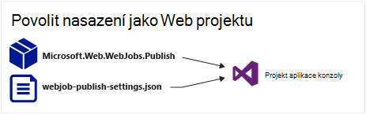
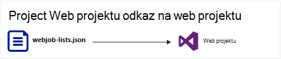
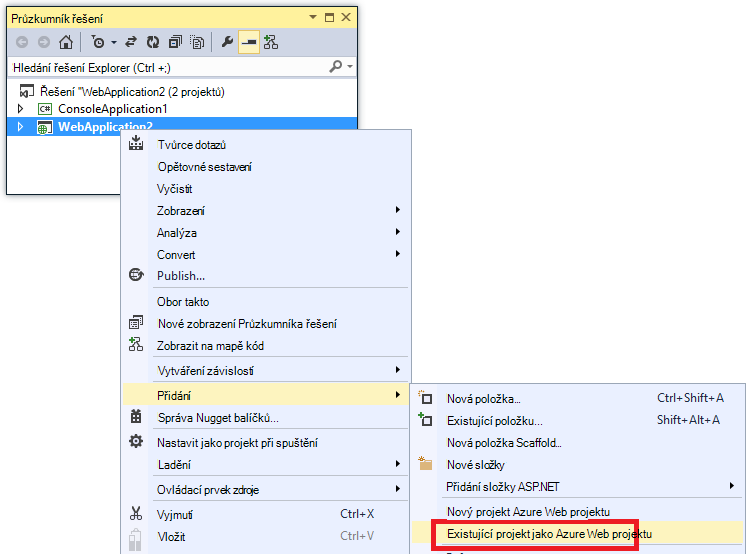
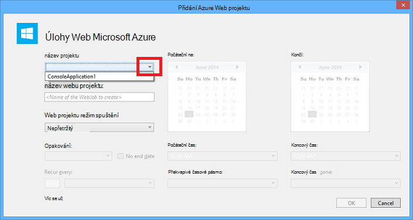
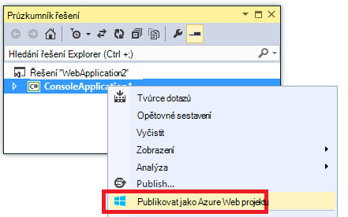
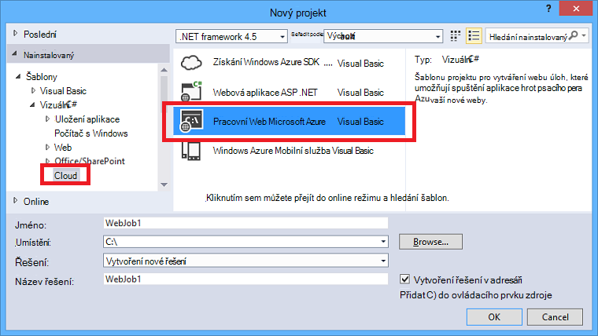
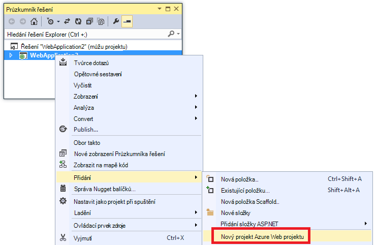
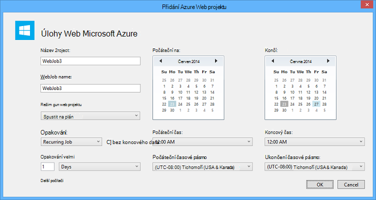

<properties 
    pageTitle="Nasazení WebJobs pomocí aplikace Visual Studio" 
    description="Naučte se nasadit Azure WebJobs Azure aplikace služby webových aplikací Web Apps pomocí aplikace Visual Studio." 
    services="app-service" 
    documentationCenter="" 
    authors="tdykstra" 
    manager="wpickett" 
    editor="jimbe"/>

<tags 
    ms.service="app-service" 
    ms.devlang="dotnet" 
    ms.topic="article" 
    ms.tgt_pltfrm="na" 
    ms.workload="na" 
    ms.date="04/27/2016" 
    ms.author="tdykstra"/>

# Nasazení WebJobs pomocí aplikace Visual Studio

## Základní informace

Toto téma vysvětluje, jak pomocí aplikace Visual Studio nasadit konzoly aplikace project web app v [Aplikaci služby](http://go.microsoft.com/fwlink/?LinkId=529714) [Azure WebJob](http://go.microsoft.com/fwlink/?LinkId=390226). Informace o tom, jak nasazení WebJobs pomocí [Portálu Azure](https://portal.azure.com)najdete v tématu [úlohy na spustit pozadí s WebJobs](web-sites-create-web-jobs.md).

Po Visual Studio nasadí projekt WebJobs s podporou aplikace konzoly, provede dva úkoly:

* Zkopíruje runtime soubory do příslušné složky ve web appu (*App_Data/úlohy/nepřetržitý* pro nepřetržitý WebJobs, *App_Data/úlohy/spouštěný* pro plánované a na vyžádání WebJobs).
* Nastaví [Azure Plánovač úloh](#scheduler) za WebJobs, který je naplánováno spuštěny v určitou dobu. (To není nutné pro nepřetržitý WebJobs).

U kterých je povolené WebJobs projektu obsahuje následující položky do ní přidat:

* Balíček NuGet [Microsoft.Web.WebJobs.Publish](http://www.nuget.org/packages/Microsoft.Web.WebJobs.Publish/) .
* [Webjob publikovat settings.json](#publishsettings) soubor, který obsahuje nastavení nasazení a Plánovač. 

Můžete tyto položky přidat do existující projekt aplikace konzoly nebo pomocí šablony vytvořit nový projekt WebJobs s podporou konzoly aplikace. 

Nasazení projektu jako WebJob samostatně nebo odkaz na web projektu tak, aby automaticky nasadí pokaždé, když nasadíte web projektu. Jestli Pokud chcete propojit projekty, Visual Studio obsahuje název projektu, u kterých je povolené WebJobs v souboru [webjobs list.json](#webjobslist) v aplikaci project web.

## Zjistit předpoklady pro

Funkce nasazení WebJobs jsou k dispozici ve Visual Studiu 2015 při instalaci Azure SDK pro .NET:

* [Azure SDK pro .NET (Visual Studio 2015)](http://go.microsoft.com/fwlink/?linkid=518003).

## Povolení WebJobs nasazení existující projekt aplikace konzoly

Máte dvě možnosti:

* [Povolit automatické nasazení se web projektu](#convertlink).

    Konfigurace existující projekt aplikace konzoly tak, aby ho automaticky nasadí jako WebJob při nasazení web projektu. Tuto možnost použijte, když budete chtít spustit vaší WebJob ve stejném web appu, ve kterém spustíte související webové aplikace.

* [Povolit nasazení bez web projektu](#convertnolink).

    Konfigurace existující projekt aplikace konzoly nasazení jako WebJob samostatně, s žádné odkaz na web projektu. Tuto možnost použijte, když budete chtít spustit WebJob ve web appu samostatně, s žádné webové aplikace ve web appu. Můžete to udělat, aby bylo možné zobrazit dostupné prostředky WebJob nezávisle na zdrojům webové aplikace.

### Povolit automatické nasazení WebJobs sebou máte projekt web
  
1. Klikněte pravým tlačítkem myši web projektu v **Okně Průzkumník**a potom klikněte na **Přidat** > **Existujícího projektu jako Azure WebJob**.

    
    
    Zobrazí se dialogové okno [Přidat WebJob Azure](#configure) .

1. V rozevíracím seznamu **název projektu** vyberte projekt aplikace konzoly přidat jako WebJob.

    

2. Dokončete dialogové okno [Přidat WebJob Azure](#configure) a potom klikněte na **OK**. 

### Povolit WebJobs nasazení bez web projektu
  
1. Klikněte pravým tlačítkem projekt aplikace konzoly v **Průzkumníku řešení**a potom klikněte na **Publikovat jako Azure WebJob**. 

    
    
    Zobrazí se dialogové okno [Přidat WebJob Azure](#configure) s projektem v poli **název projektu** .

2.  Vyplňte dialogové okno [Přidat WebJob Azure](#configure) a potom klikněte na **OK**.

    Zobrazí se průvodce **Publikovat Web** .  Pokud nechcete, aby okamžitě publikovat, zavřete průvodce. Nastavení, která jste zadali se ukládají pro, když budete chtít [nasazení projektu](#deploy).

## Vytvoření nového projektu WebJobs s podporou

K vytvoření nového projektu WebJobs s podporou, můžete použít šablonu projektu aplikace konzoly a povolit WebJobs nasazení způsobem popsaným v [předchozí části](#convert). Jako alternativu můžete použít šablonu WebJobs nového projektu:

* [Šablona WebJobs nového projektu pro nezávislé WebJob](#createnolink)

    Vytvoření projektu a nakonfigurujte ho nasadit samostatně jako WebJob s žádné odkaz na web projektu. Tuto možnost použijte, když budete chtít spustit WebJob ve web appu samostatně, s žádné webové aplikace ve web appu. Můžete to udělat, aby bylo možné zobrazit dostupné prostředky WebJob nezávisle na zdrojům webové aplikace.

* [Použití šablony nový projekt WebJobs pro WebJob připojena k webu projektu.](#createlink)

    Vytvořte projekt, který je nakonfigurovaný na nasazení automaticky jako WebJob nasazené web projektu ve stejném řešení. Tuto možnost použijte, když budete chtít spustit vaší WebJob ve stejném web appu, ve kterém spustíte související webové aplikace.

> [AZURE.NOTE] Šablona Nový projekt WebJobs automaticky nainstaluje NuGet balíčků a obsahuje kód v *Program.cs* pro [WebJobs SDK](http://www.asp.net/aspnet/overview/developing-apps-with-windows-azure/getting-started-with-windows-azure-webjobs). Pokud si chcete použít WebJobs SDK nebo chcete použít plánované spíše než nepřetržitý WebJob, odebrání nebo změna `host.RunAndBlock` následný výběr v *Program.cs*.

### Šablona WebJobs nového projektu pro nezávislé WebJob
  
1. Klikněte na **soubor** > **Nového projektu**a potom v dialogovém okně **Nový projekt** klikněte na **Cloud** > **Microsoft Azure WebJob**.

    
    
2. Postupujte podle pokynů uvedené výše aby [Konzoly aplikace project nezávislé WebJobs projektu](#convertnolink).

### Použití šablony nový projekt WebJobs pro WebJob propojené s web project

1. Klikněte pravým tlačítkem myši web projektu v **Okně Průzkumník**a potom klikněte na **Přidat** > **Nový projekt WebJob Azure**.

    

    Zobrazí se dialogové okno [Přidat WebJob Azure](#configure) .

2. Vyplňte dialogové okno [Přidat WebJob Azure](#configure) a potom klikněte na **OK**.

## Dialogové okno Přidat WebJob Azure

Dialogové okno **Přidat WebJob Azure** umožňuje zadat název WebJob a plánování nastavení vašeho WebJob. 

Pole v tomto dialogovém okně odpovídat polím v dialogovém okně **Nová úloha** portálu Azure. Další informace najdete v tématu [spuštění pozadí úkoly s WebJobs](web-sites-create-web-jobs.md).

Pro plánované WebJob (ne pro nepřetržitý WebJobs) Visual Studio vytvoří kolekci [Azure Plánovač](/services/scheduler/) úloh, pokud jeden dosud neexistuje a vytvoří úlohy v kolekci:

* Plánovač úloh kolekce jmenuje *WebJobs-{regionname}* kde *{regionname}* odkazuje oblast webu aplikace je hostovaný ve. Příklad: WebJobs WestUS.
* Plánovač úloh jmenuje *{webappname}-{webjobname}*. Příklad: MyWebApp MyWebJob. 
 
>[AZURE.NOTE]
> 
>* Informace o příkazového řádku nasazení najdete v tématu [Povolení příkazového řádku nebo nepřetržitý doručení Azure WebJobs](/blog/2014/08/18/enabling-command-line-or-continuous-delivery-of-azure-webjobs/).
>* Pokud konfigurovat **Periodický projekt** a opakování možnost frekvence nastavte počet minut, není bezplatné služby Azure plánovač. Neobsahují další frekvencí (hodin dnů a tak dále).
>* Pokud nasadit WebJob a pak se rozhodnete, že chcete změnit typ WebJob a opětovném nasazení, musíte odstranit webjobs publikovat settings.json soubor. To, bude Visual Studio nezobrazovat možnosti publikování, abyste je mohli měnit typ WebJob.
>* Pokud nasadit WebJob a později změnit režim spuštění z nepřetržitý nesouvislé nebo naopak Visual Studio vytvoří nový WebJob v Azure při nasazením. Pokud můžete taky změnit některé plánování nastavení však opustit režim spuštění stejné nebo přepínání mezi plánovaná a na vyžádání Visual Studio aktualizuje existující úlohu místo vytvořte nový účet.

## webjob publikovat settings.json

Při konfiguraci aplikace konzoly pro nasazení WebJobs Visual Studio instaluje balíček NuGet [Microsoft.Web.WebJobs.Publish](http://www.nuget.org/packages/Microsoft.Web.WebJobs.Publish/) a informacemi o plánování v souboru *webjob publikovat settings.json* ve složce *Vlastnosti* projektu WebJobs projektu. Tady je příklad tohoto souboru:

        {
          "$schema": "http://schemastore.org/schemas/json/webjob-publish-settings.json",
          "webJobName": "WebJob1",
          "startTime": "2014-06-23T00:00:00-08:00",
          "endTime": "2014-06-27T00:00:00-08:00",
          "jobRecurrenceFrequency": "Minute",
          "interval": 5,
          "runMode": "Scheduled"
        }

Můžete upravit tento soubor přímo a Visual Studio nabízí technologii IntelliSense. Schéma soubor uložený v [http://schemastore.org](http://schemastore.org/schemas/json/webjob-publish-settings.json) a lze je zobrazit.  

>[AZURE.NOTE]
>
>* Pokud konfigurovat **Periodický projekt** a opakování možnost frekvence nastavte počet minut, není bezplatné služby Azure plánovač. Neobsahují další frekvencí (hodin dnů a tak dále).

## webjobs list.json

Při propojení WebJobs s podporou projektu do web project Visual Studio ukládá název projektu WebJobs *webjobs list.json* soubor ve složce *Vlastnosti* web projektu. Seznam může obsahovat více projektů WebJobs, jak je vidět v následujícím příkladu:

        {
          "$schema": "http://schemastore.org/schemas/json/webjobs-list.json",
          "WebJobs": [
            {
              "filePath": "../ConsoleApplication1/ConsoleApplication1.csproj"
            },
            {
              "filePath": "../WebJob1/WebJob1.csproj"
            }
          ]
        }

Můžete upravit tento soubor přímo a Visual Studio nabízí technologii IntelliSense. Schéma soubor uložený v [http://schemastore.org](http://schemastore.org/schemas/json/webjobs-list.json) a lze je zobrazit.
  
## Nasazení WebJobs projektu

WebJobs projekt, který jste připojeni k webu projektu nasadí automaticky k webu projektu. Informace o nasazení webu projektu najdete v tématu [jak nasadit na Web Apps](web-sites-deploy.md).

Nasazení projektu WebJobs samostatně, klikněte pravým tlačítkem myši na projekt v **Průzkumníku řešení**a klikněte na **Publikovat jako Azure WebJob**. 

    
Pro nezávislé WebJob, stejného průvodce **Publikovat Web** , který se používá pro projekty web se zobrazí, ale s méně nastavení k dispozici pro změnu.

## Další kroky

Tento článek obsahuje vysvětlení nasazení WebJobs pomocí aplikace Visual Studio. Další informace o tom, jak implementovat Azure WebJobs najdete v článku [Azure WebJobs - doporučené zdroje – nasazení](http://www.asp.net/aspnet/overview/developing-apps-with-windows-azure/azure-webjobs-recommended-resources#deploying).
