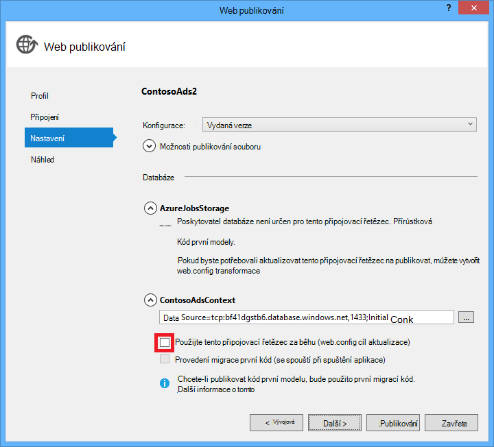

<properties
    pageTitle="Vytvoření .NET WebJob služby Azure aplikace | Microsoft Azure"
    description="Vytvoření vícevrstvého aplikace pomocí technologie ASP.NET MVC a Azure. Přední konce běží ve web appu v aplikaci služby Azure a back-end běží jako WebJob. Aplikace využívá Entity Framework, databáze SQL a fronty Azure úložiště a objekty BLOB."
    services="app-service"
    documentationCenter=".net"
    authors="tdykstra"
    manager="wpickett"
    editor="mollybos"/>

<tags
    ms.service="app-service"
    ms.workload="na"
    ms.tgt_pltfrm="na"
    ms.devlang="na"
    ms.topic="article"
    ms.date="10/28/2016"
    ms.author="tdykstra"/>

# Vytvoření .NET WebJob v aplikaci služby Azure

Tento kurz ukazuje, jak kódu pro jednoduché vícevrstvého ASP.NET MVC 5 aplikace, která používá [WebJobs SDK](websites-dotnet-webjobs-sdk.md).

Má [WebJobs SDK](websites-webjobs-resources.md) účel zjednodušit kód, který napíšete pro běžné úkoly, můžete provést, například zpracování obrázků, fronty zpracování WebJob RSS agregace, soubor údržby a odesílání e-mailů. WebJobs SDK má zabudovaných funkcí pro práci s Azure úložiště a služby Bus pro plánování úkolů a zpracování chyb a pro další obvyklé scénáře. Kromě toho je navržen tak, aby byl extensible a je [otevřete úložiště zdrojů pro rozšíření](https://github.com/Azure/azure-webjobs-sdk-extensions/wiki/Binding-Extensions-Overview).

Ukázková aplikace je vývěska zobrazování reklam. Uživatele můžete nahrát obrázky služby Active Directory a back-end proces převádí obrázky na miniatury. Na stránce Seznam ad zobrazuje miniatury a na stránce Podrobnosti ad zobrazuje obrázek plné velikosti. Tady je snímek obrazovky:

Tato ukázková aplikace spolupracuje [Azure fronty](http://www.asp.net/aspnet/overview/developing-apps-with-windows-azure/building-real-world-cloud-apps-with-windows-azure/queue-centric-work-pattern) a [objektů BLOB Azure](http://www.asp.net/aspnet/overview/developing-apps-with-windows-azure/building-real-world-cloud-apps-with-windows-azure/unstructured-blob-storage). Kurz ukazuje, jak nasazení aplikace [Služby Azure aplikace](http://go.microsoft.com/fwlink/?LinkId=529714) a [Databáze SQL Azure](http://msdn.microsoft.com/library/azure/ee336279).

## Zjistit předpoklady pro

Kurz se předpokládá, že víte, jak pracovat s [ASP.NET MVC 5](http://www.asp.net/mvc/tutorials/mvc-5/introduction/getting-started) projekty ve Visual Studiu.

Kurz napsané Visual Studio 2013. Pokud už nemáte Visual Studiu, se budou nainstalovány za vás automaticky při instalaci Azure SDK pro .NET.

Kurz se dá používat se Visual Studio 2015, ale před spuštěním aplikace místně budete muset změnit `Data Source` součástí připojovací řetězec SQL Server LocalDB v souborech Web.config a App.config z `Data Source=(localdb)\v11.0` k `Data Source=(LocalDb)\MSSQLLocalDB`. 

> [AZURE.NOTE] Musíte mít účet Azure tento kurz:
  >
  > + Můžete [Otevřít účet Azure zdarma](https://azure.microsoft.com/pricing/free-trial/?WT.mc_id=A261C142F): získání přeplatky můžete vyzkoušet placené služby Azure a i po byli zvyklí až můžete ponechat účet a použití uvolnit Azure služby, jako je weby. Platební kartou nikdy strhne příslušná, pokud explicitně změňte nastavení a požádat o platit.
  >
  > + Je možné [Aktivovat výhod odběratele MSDN](https://azure.microsoft.com/pricing/member-offers/msdn-benefits-details/?WT.mc_id=A261C142F): web MSDN pro vaše předplatné vám přeplatky každý měsíc, využívající služby placené Azure.
  >
  >Pokud chcete začít pracovat s aplikaci služby Azure před registrací účet Azure, přejděte na [Zkuste aplikaci služby](http://go.microsoft.com/fwlink/?LinkId=523751), které můžete okamžitě vytvořit web appu krátkodobý starter v aplikaci služby. Žádné povinné; kreditní karty žádné závazky.

## Co se dozvíte

Kurz ukazuje, jak provádět následující úkoly:

* Povolte počítači pro Azure vývoj instalací Azure SDK.
* Vytvořte projekt aplikace konzoly automaticky nasadí jako Azure WebJob při nasazení přidružené web projektu.
* Otestujte back-end WebJobs SDK místně ve vývojovém počítači.
* Publikování aplikace s back-end WebJobs pro web app v aplikaci služby.
* Nahrání souborů a byly ukládány ve službě objektů Blob Azure.
* Použití Azure WebJobs SDK pro práci s fronty Azure úložiště a objekty BLOB.

## Architektura aplikací

Ukázková aplikace používá [vzorek fronty zaměřené na zpracování práce](http://www.asp.net/aspnet/overview/developing-apps-with-windows-azure/building-real-world-cloud-apps-with-windows-azure/queue-centric-work-pattern) k vyvážka procesoru vyžadující značnou práce pro vytváření miniatury back-end procesu.

Aplikace ukládá služby Active Directory v databázi SQL pomocí Entity Framework kód první k vytváření tabulek a přístup k datům. Pro každou reklamu v databázi jsou uložena dvě adresy URL: jedna pro plné velikosti obrázků a obrázku.

Uživatel odešle obrázek, web appu ukládá obrázek [objektů blob Azure](http://www.asp.net/aspnet/overview/developing-apps-with-windows-azure/building-real-world-cloud-apps-with-windows-azure/unstructured-blob-storage)a ukládá ad informací v databázi s adresou URL odkazující na objekt blob. Ve stejnou dobu zapíše zprávy Azure fronty. WebJobs SDK zjišťuje ve výrobním procesu back-end spuštěný jako Azure WebJob, ve frontě pro nové zprávy. Po zobrazení novou zprávu WebJob miniaturu na tomto obrázku a miniatur databáze pole adresy URL pro tuto ad aktualizuje. Zde je diagram zobrazující interakce části aplikace:

[AZURE.INCLUDE [install-sdk](../../includes/install-sdk-2015-2013.md)]

Výuková pokyny se vztahují na Azure SDK pro .NET 2.7.1 nebo novější.

## Vytvořte účet Azure úložiště

Účet Azure úložiště obsahuje prostředky pro ukládání fronty a objektů blob dat do cloudu. Je taky používá WebJobs SDK k ukládání dat protokolování řídicího panelu.

V aplikaci reálný obvykle vytvořit samostatné účty aplikace dat porovnání dat protokolování a samostatnou účtů pro testovací data a data výroby. Pro účely tohoto návodu budete používat jenom přes jeden účet.

1. Otevřete okno **Průzkumníka serveru** ve Visual Studiu.

2. Klikněte pravým tlačítkem myši na uzel **Azure** a potom klikněte na **připojit k Microsoft Azure**.

3. Přihlaste se pomocí svých přihlašovacích údajů Azure.

5. Klikněte pravým tlačítkem **úložiště** Azure uzlu a potom klikněte na **Vytvořit účet úložiště**.

3. V dialogovém okně **Vytvořit účet úložiště** zadejte název účtu úložiště.

    Název musí být musí být jedinečný (jiný účet Azure úložiště můžete mít stejný název). Pokud zadané jméno se už používá dostanete možnost ho změnit.

    Adresa URL pro přístup ke svému účtu úložiště bude *{název}*. core.windows.net.

5. Nastavení rozevíracího seznamu **oblast nebo skupinu spřažení** k oblasti nejblíže.

    Tohle nastavení určuje, které Azure datacentra uspořádá účtu úložiště. Pro účely tohoto návodu nepoužijí svojí volbě výrazná rozdíl. Však do webových aplikací výrobní chcete webového serveru a vaším účtem úložiště ve stejné oblasti, kterou chcete minimalizovat latence a data výstupní náklady. Webové aplikace (vytvoříte později) datacentra by měl být co nejblíže prohlížeče za účelem minimalizovat latence přístup k web appu.

6. Nastavte **místně nadbytečné** **replikace** rozevíracího seznamu.

    Když geo replikace aktivované řešení účet úložiště, uložené obsah replikovat na vedlejší datacentra povolit přepnutí do tohoto umístění pro nečekané hlavní katastrofě primární umístění. Replikace GEO můžete další vynakládá. U účtů test a vývoj obecně nechcete, aby si zaplatit geo replikace. Další informace najdete v tématu [Vytvoření, spravovat, nebo odstraněním účtu úložiště](../storage-create-storage-account/#replication-options).

5. Klikněte na **vytvořit**.

    

## Stáhnout aplikaci

1. Stáhněte si a rozbalte [dokončení řešení](http://code.msdn.microsoft.com/Simple-Azure-Website-with-b4391eeb).

2. Spusťte aplikaci Visual Studio.

3. V nabídce **soubor** na výběr **Otevřít > projektu/řešení**, přejděte na místo, kam jste stáhli řešení a pak otevřete soubor řešení.

4. Stiskněte kombinaci kláves CTRL + SHIFT + B vytvářet řešení.

    Ve výchozím nastavení Visual Studio automaticky obnoví NuGet balíčku obsahu, který nebyl zahrnuté v souboru *ZIP* . Pokud balení není obnovit, nainstalujte je ručně tak, že přejdete do dialogového okna **Spravovat NuGet balíčků řešení** a kliknutím na tlačítko **Obnovit** vpravo nahoře.

5. V **Okně Průzkumník**Ujistěte se, **ContosoAdsWeb** je zúžený projekt při spuštění.

## Nakonfigurovat aplikaci pro použití účtu úložiště

1. Otevření souboru *Web.config* aplikace v projectu ContosoAdsWeb.

    Soubor obsahuje připojovací řetězec SQL a Azure úložiště připojovací řetězec pro práci s objekty BLOB a dotazů.

    Připojovací řetězec SQL bodů k databázi [SQL serveru Express LocalDB](http://msdn.microsoft.com/library/hh510202.aspx) .

    Připojovací řetězec úložiště je příklad, který má zástupné symboly pro klíč název a přístup k účtu úložiště. Budete nahradíte tím připojovací řetězec, který obsahuje název a klíč účtu úložiště.  

    <pre class="prettyprint">&lt;connectionStrings&gt;
   &lt;přidejte název = "ContosoAdsContext" connectionString = "zdroj dat = \v11.0 (localdb); Počáteční katalogu = ContosoAds; Integrované zabezpečení = PRAVDA a naopak. Atribut MultipleActiveResultSets = PRAVDA; "providerName="System.Data.SqlClient "/&gt;
   &lt;přidejte název ="AzureWebJobsStorage"connectionString =" DefaultEndpointsProtocol = https; Název účtu =<mark>[název účtu]</mark>; AccountKey =<mark>[accesskey]</mark>"/&gt; 
    &lt;/connectionStrings      &gt;</pre>

    Připojovací řetězec úložiště názvem AzureWebJobsStorage protože to je název, který používá WebJobs SDK ve výchozím nastavení. Stejný název slouží tady, budete muset nastavit jedinou hodnotu připojovacího řetězce v Azure prostředí.

2. V **Průzkumníku serveru**klikněte pravým tlačítkem myši účtu úložiště uzlu **úložiště** a potom klikněte na **Vlastnosti**.

    

3. V okně **Vlastnosti** klikněte na **Úložiště účtu klávesy**a potom klikněte na tři tečky.

    

4. Zkopírujte **připojovací řetězec**.

    

5. Nahraďte úložiště připojovací řetězec do *nastavení(Web.config))* připojovací řetězec, který jste zkopírovali. Zkontrolujte, že vyberete všechny položky v uvozovkách, ale ne včetně znak uzavírající před vložením.

6. Otevření *konfiguračního* souboru v projectu ContosoAdsWebJob.

    Tento soubor obsahuje dva řetězce připojení úložiště, jeden pro data aplikace a jeden pro protokolování. Samostatné úložiště účtů můžete použít pro protokolování a dat aplikace a používáte [víc účtů úložiště pro data](https://github.com/Azure/azure-webjobs-sdk/blob/master/test/Microsoft.Azure.WebJobs.Host.EndToEndTests/MultipleStorageAccountsEndToEndTests.cs). Pro účely tohoto návodu použijete vašeho účtu jednoho úložiště. Připojení řetězce mají zástupné symboly pro klíče účtu úložiště. 
    <pre class="prettyprint">&lt;konfigurace&gt; 
    &lt;connectionStrings&gt;
   &lt;přidejte název = "AzureWebJobsDashboard" connectionString = "DefaultEndpointsProtocol = https; Název účtu =<mark>[název účtu]</mark>; AccountKey =<mark>[accesskey]</mark>"/&gt;
   &lt;přidejte název ="AzureWebJobsStorage"connectionString =" DefaultEndpointsProtocol = https; Název účtu =<mark>[název účtu]</mark>; AccountKey =<mark>[accesskey]</mark>"/&gt;
   &lt;přidejte název ="ContosoAdsContext"connectionString =" zdroj dat = \v11.0 (localdb); Počáteční katalogu = ContosoAds; Integrované zabezpečení = PRAVDA a naopak. Atribut MultipleActiveResultSets = PRAVDA; " /&gt; 
    &lt;/connectionStrings&gt;
   &lt;spuštění&gt;
   &lt;supportedRuntime verze = "4.0" sku = ". NETFramework, verze = v4.5 "/&gt; 
    &lt;/startup&gt;
&lt;/Configuration                             &gt;</pre>

    Ve výchozím nastavení WebJobs SDK Vyhledá připojovací řetězec s názvem AzureWebJobsStorage a AzureWebJobsDashboard. Jako alternativu můžete provést tyto akce [úložiště připojovací řetězec, ale chcete a předejte mu v explicitně do `JobHost` objekt](websites-dotnet-webjobs-sdk-storage-queues-how-to.md#config).

7. Nahraďte obou úložiště připojovací řetězec připojovací řetězec, který jste si zkopírovali.

8. Uložte provedené změny.

## Spusťte aplikaci místně

1. Začít frontend webové aplikace, stiskněte kombinaci kláves CTRL + F5.

    Jako výchozí prohlížeč otevře domovskou stránku. (Web projektu nespustí, protože ho jste provedli po spuštění projektu)

    

2. Spusťte back-end WebJob aplikace, klikněte pravým tlačítkem myši ContosoAdsWebJob projekt v **Průzkumníku řešení**a klikněte na **ladění** > **spuštění nové instance**.

    Okno aplikace konzoly spustí a zobrazí zprávy protokolování označovat tak, že objekt WebJobs SDK JobHost spustila spustit.

    

3. V prohlížeči klikněte na **vytvořit Ad**.

4. Zadejte některé testovací data a vyberte obrázek, který chcete nahrát a pak klikněte na **vytvořit**.

    

    Aplikaci přejde na stránku Index, ale nezobrazí na miniaturu pro nové ad vzhledem k tomu, že zpracování nestane ještě.

    Mezitím po krátké čekání zobrazuje zprávu protokolování v okně aplikace konzoly byla přijata i po zpracování zprávy fronty.

    

5. Po zobrazení zprávy protokolování v okně aplikace konzoly obnovit stránku Index zobrazíte miniaturu.

    

6. Klikněte na **Podrobnosti** o vaší ad zobrazíte plné velikosti obrázku.

    

Jste byla spuštění aplikace ve vašem počítači a používá Server SQL databáze v počítači, ale funguje s fronty a objekty BLOB v cloudu. V následující části spuštěním aplikace v cloudu, pomocí databázi cloudu i objektů BLOB cloudu a dotazů.  

## Spuštění aplikace v cloudu

Můžete udělat následující kroky pro spuštění aplikace v cloudu:

* Nasaďte na Web Apps. Nové webové aplikace Visual Studio automaticky vytvoří v aplikaci služby a instance databáze SQL.
* Konfigurace web appu používat účet Azure SQL databáze a úložiště.

Po vytvoření některé reklam při spuštění v cloudu, zobrazí WebJobs SDK řídicího panelu zobrazíte ve formátu RTF funkcí, které se nabízejí sledování.

### Nasadit na Web Apps

1. Zavřete prohlížeč a okna aplikace konzoly.

2. V **Okně Průzkumník řešení**klikněte pravým tlačítkem ContosoAdsWeb projektu a potom klikněte na **Publikovat**.

3. V kroku **profilu** průvodce **Publikovat Web** klikněte na **Microsoft Azure webové aplikace**.

    

4. Pokud ještě nejste přihlášení, přihlaste se k Azure.

5. Klikněte na **Nový**.

    Dialogové okno může vypadat trochu lišit podle toho, jakou verzi systému SDK Azure pro .NET jste nainstalovali.

    

6. V dialogovém okně **vytvořit web appu na Microsoft Azure** zadejte jedinečný název do pole **název webové aplikace** .

    Úplnou adresu URL bude obsahovat co zadáte plus. azurewebsites.net (znázorněná vedle textového pole **název aplikace Web** ). -Li na název webové aplikace ContosoAds, například adresa URL bude ContosoAds.azurewebsites.net.

7. V rozevíracím seznamu [plán služeb aplikací](../app-service/azure-web-sites-web-hosting-plans-in-depth-overview.md) vyberte **vytvořit nový plán služeb aplikací**. Zadejte název pro plán služeb aplikací, jako je ContosoAdsPlan.

8. V rozevíracím seznamu [pole Skupina zdroje](../azure-resource-manager/resource-group-overview.md) zvolte **vytvořit nové skupiny prostředků**.

9. Zadejte název skupiny zdrojů, jako je ContosoAdsGroup.

10. V rozevíracím seznamu **oblast** zvolte stejné oblasti, které jste se rozhodli pro váš účet úložiště.

    Tohle nastavení určuje, které Azure datacentra webovou aplikaci se spustí v. Zachování web app a úložiště účtu ve stejném datacentru minimalizuje latence a data výstupní náklady.

11. V rozevíracím seznamu **databázového serveru** vyberte **vytvořit nový server**.

12. Zadejte název pro databázový server, například contosoadsserver + číslo nebo název, aby jedinečný název serveru. 

    Název serveru musí být jedinečná. Může obsahovat malá písmena, číslice a spojovníky. Nesmí obsahovat koncových pomlčku. 

    Předplatné už má serveru, které můžete vybrat tento server z rozevíracího seznamu.

12. Zadejte správce **uživatelské jméno** a **heslo databáze**.

    Pokud jste vybrali **nové databáze SQL serveru** nejsou zadávání existující jméno a heslo tady, zadávání nový název a heslo, které definujete teď pro pozdější použití, kdy získáváte přístup k databázi. Pokud jste vybrali serveru, který jste vytvořili dříve, budete vyzváni k zadání hesla k účtu správce jste již vytvořili.

13. Klikněte na **vytvořit**.

    

    Visual Studio vytvoří řešení, web project, web app v Azure a instance databáze SQL Azure.

14. V kroku **připojení** průvodce **Publikovat Web** klikněte na **Další**.

    

15. V kroku **Nastavení** zrušte zaškrtnutí políčka **použít tento připojovací řetězec za běhu** a klikněte na tlačítko **Další**.

    

    Nemusíte použijte dialogové okno Publikovat nastavit připojovací řetězec SQL, protože vytvoříte daná hodnota v Azure prostředí později.

    Můžete ignorovat upozornění na této stránce.

    * Za normálních okolností účtu úložiště používáte při spuštění v Azure by jinak, než tu, kterou používáte při spuštění místně, ale na tento kurz používáte stejné tu v každém z obou prostředí. Připojovací řetězec AzureWebJobsStorage tak nemusí být transformovat. I když chcete používat účet jiné úložiště v cloudu, nebude potřebujete transformace připojovací řetězec, protože aplikace používá nastavení Azure prostředí v Azure. Zobrazí se tato dál v tomto kurzu.

    * Pro účely tohoto návodu, které nechcete být změn do datového modelu pro databázi ContosoAdsContext tak je potřeba používat Entity Framework kód první migrace pro nasazení. Nejdřív automaticky vytvoří nový čas databáze první aplikaci pokusí o přístup k datům SQL.

    Pro účely tohoto návodu jsou výchozí hodnoty možnosti v části **Možnosti publikování souboru** pořádku.

16. V kroku **náhledu** klikněte na tlačítko **Start náhled**.

    

    Upozornění o žádné databáze publikován můžete ignorovat. Entita Framework kód první vytvoří databázi. není potřeba publikování.

    Náhled, zobrazí se, že binární soubory a soubory konfigurace z projektu WebJob zkopírují do složky *app_data\jobs\continuous* ve web appu.

    

17. Klikněte na **Publikovat**.

    Visual Studio nasadí aplikace a otevře adresa URL domovské stránky v prohlížeči.

    Nebudete moct pomocí web appu přejděte na nastavení připojovací řetězec v Azure prostředí v další části. Zobrazí se chybová stránka nebo na domovskou stránku v závislosti na web app a databáze vytváření možnosti, které jste se dříve rozhodli.

### Konfigurace web appu používat účet Azure SQL databáze a úložiště.

Je zabezpečení nejvhodnější [nevkládejte citlivé informace, například připojení řetězce v souborech, které jsou uložené v úložištích kód zdroje](http://www.asp.net/aspnet/overview/developing-apps-with-windows-azure/building-real-world-cloud-apps-with-windows-azure/source-control#secrets). Azure poskytuje způsob, jak to udělat: v Azure prostředí možné zadat připojovací řetězec a dalších hodnot nastavení a konfigurace ASP.NET rozhraní API tyto hodnoty automaticky vystopovat, při spuštění aplikace v Azure. Tyto hodnoty můžete nastavit v Azure pomocí **Průzkumníka serveru**, na portálu Azure, prostředí Windows PowerShell nebo rozhraní různé platformy příkazového řádku. Další informace najdete v tématu [jak řetězce aplikace a připojení řetězce práce](/blog/2013/07/17/windows-azure-web-sites-how-application-strings-and-connection-strings-work/).

V této části pomocí **Průzkumníka serveru** můžete nastavit připojení řetězcových hodnot v Azure.

7. V **Průzkumníku serveru**, klikněte pravým tlačítkem myši webovou aplikaci v části **Azure > aplikaci služby > {skupiny zdrojů}**a potom klikněte na **Nastavení zobrazení**.

    Na kartě **Konfigurace** otevře okno **Azure v prohlížeči** .

9. Změna názvu připojovací řetězec DefaultConnection ContosoAdsContext.

    Azure automaticky vytvoří tento připojovací řetězec při vytvoření web appu s přidružené databáze, takže už má hodnotu správné připojovacího řetězce. Na co je kód hledali, kterou chcete změnit pouze název.

9. Přidejte dva nové připojení řetězce s názvem AzureWebJobsStorage a AzureWebJobsDashboard. Nastavit typ na možnost Vlastní a nastavte hodnotu připojovacího řetězce na stejnou hodnotu, které jste použili dříve pro soubory *Web.config* a *App.config* . (Zkontrolujte obsahuje celou připojovací řetězec, nejenom přístupová klávesa a nezahrnovat znak uzavírající.)

    Tyto připojení řetězce používají WebJobs SDK jeden pro data aplikací a jeden pro přihlášení. Jak jste viděli dříve, na jeden z dat aplikace používá také kód webových front-end.

9. Klikněte na **Uložit**.

    

10. V **Průzkumníku serveru**klikněte pravým tlačítkem myši v prohlížeči a pak klikněte na **Zastavit**.

12. Po ukončení web appu, klikněte pravým tlačítkem v prohlížeči a klikněte na tlačítko **Spustit**.

    WebJob automaticky spustí publikování, ale ukončení po provedení změn v konfiguraci. Restartujte ho můžete buď restartování web appu nebo WebJob [Portál Azure](http://go.microsoft.com/fwlink/?LinkId=529715). Obecně doporučujeme po změně konfigurace restartujte web appu.

9. Aktualizujte okno prohlížeče, které obsahuje adresa URL webové aplikace do adresního řádku.

    Zobrazí se na domovskou stránku.

10. Vytvoření ad, stejně jako při spuštění aplikace místně.

    Stránka indexu zobrazí bez miniaturu nejdřív.

11. Po několik sekund, než a miniatury se zobrazí po aktualizaci stránky.

    Pokud se nezobrazuje na miniaturu, se může projevit až chvíli, aby pro WebJob restartujte. Pokud po a chvíli nevidíte miniaturu Jakmile aktualizujete stránku, WebJob nesmí začali automaticky. V takovém případě přejděte na kartu WebJobs na stránce [klasický portálu](https://manage.windowsazure.com) pro web app a potom klepněte na tlačítko **Start**.

### Zobrazení řídicího panelu WebJobs SDK

1. V [klasickém portál](https://manage.windowsazure.com)vyberte webovou aplikaci.

2. Klikněte na kartu **WebJobs** .

3. Klepněte na adresu URL ve sloupci protokoly pro vaše WebJob.

    

    Na řídicím panelu WebJobs SDK otevře na nové záložce prohlížeče. Řídicí panel ukazuje, že WebJob běží a zobrazí se seznam funkcí v kódu, který spustil WebJobs SDK.

4. Klikněte na jednu z těchto funkcích najdete v článku informace o spuštění.

    

    

    Tlačítko **Funkce znova se přehrávat** na této stránce způsobí, že framework WebJobs SDK znovu volat funkci a to vám nabídne ke změně dat nejdřív předán funkci.

>[AZURE.NOTE] Po dokončení testování odstranit web app a instanci systému SQL databáze. Webové aplikace je zadarmo, ale instance SQL databáze a úložiště účet nabíhání nákladů (minimální kvůli řídicího panelu). Taky když opustíte aplikaci web s každý, kdo najde svoji adresu URL můžete vytvářet a zobrazovat služby Active Directory. Na portálu klasické přejděte na kartu **řídicí panel** pro web app a potom klikněte na tlačítko **Odstranit** v dolní části stránky. Můžete pak zaškrtněte políčko Odstranit instanci systému SQL databáze ve stejnou dobu. Pokud chcete dočasně zabránit ostatním přístup k web appu, klikněte místo toho na **Zastavit** . V takovém případě poplatky zůstanou metodu nabíhání nákladů pro účet databáze SQL a úložiště. Podobně jako postup odstranění SQL databáze a úložiště účtu, když už je budete potřebovat.

## Vytvoření aplikace od začátku

V této části můžete udělat následující úkoly:

* Vytvoření řešení Visual Studio v aplikaci web project.
* Přidáte projekt knihovna tříd pro vrstvy přístupu k datům, který je sdílený mezi front-end a back-end.
* Přidáte projekt aplikace konzoly pro back-end, s nasazením WebJobs povolené.
* Přidání NuGet balíčků.
* Nastavení project odkazy.
* Zkopírujte kód a konfigurace soubory aplikace z stažené aplikace, která jste pracovali v předchozí části kurzu.
* Prozkoumejte kódu, které spolupracují s objekty BLOB Azure a fronty a WebJobs SDK.

### Vytvoření řešení Visual Studio s web project a projekt knihovna tříd

1. Ve Visual Studiu, zvolte **Nový** > **projektu** z nabídky **soubor** .

2. V dialogovém okně **Nový projekt** vyberte **Visual Basic** > **Web** > **ASP.NET webové aplikace**.

3. Název projektu ContosoAdsWeb, název řešení ContosoAdsWebJobsSDK (změnit název řešení Pokud umísťujete ho do stejné složky jako stažené řešení) a potom klikněte na **OK**.

    

5. V dialogovém okně **Nový projekt ASP.NET** šablonu vybrat v MVC a zrušte zaškrtnutí políčka **hostitele v cloudu** v části **Microsoft Azure**.

    Výběr **hostitele v cloudu** umožňuje Visual Studio automaticky vytvořit novou Azure webovou aplikaci SQL databáze. Vzhledem k tomu, že jste již vytvořili tyto, nemusíte proto teď při vytváření projektu. Pokud chcete vytvořit novou, zaškrtněte políčko. Potom můžete nakonfigurovat nový web app a SQL databázi stejným způsobem, jakým jste instalovali při nasazení aplikace.

5. Klikněte na **změnit ověření**.

    

7. V dialogovém okně **Změnit ověřování** zvolte **Bez ověřování**a klikněte na **OK**.

    

8. V dialogovém okně **Nový projekt ASP.NET** klikněte na **OK**.

    Visual Studio vytvoří řešení a web projektu.

9. V **Okně Průzkumník řešení**, klikněte pravým tlačítkem myši na řešení (není projekt) a zvolte **Přidat** > **Nový projekt**.

11. V dialogovém okně **Přidat nový projekt** vyberte **Visual Basic** > **Počítač s Windows** > šablonu**Knihovna tříd** .  

10. Název projektu *ContosoAdsCommon*a potom klikněte na **OK**.

    Tento projekt bude obsahovat kontext Entity Framework a datový model, který budou používat front-end a back-end. Jako alternativu můžete definovat EF související třídy v aplikaci project web a vytvořte odkaz projektu z WebJob project. Ale potom WebJob projektu má odkaz na web sestav, které není potřeba.

### Přidání aplikace konzoly projektu, který má povolené WebJobs nasazení

1. Klikněte pravým tlačítkem na web projektu (ne řešení nebo projekt knihovny tříd) a potom klikněte na **Přidat** > **Nový projekt WebJob Azure**.

    

2. V dialogovém okně **Přidat WebJob Azure** zadejte ContosoAdsWebJob jako **název projektu** a **WebJob název**. Nechte **WebJob spustit režim** nastavena na **Spustit nepřetržitě**.

3.  Klikněte na **OK**.

    Visual Studio vytvoří aplikace konzoly, který je nakonfigurovaný na nasazení jako WebJob pokaždé, když nasadíte web project. Aby je dostala, provádět následující úkoly po vytvoření projektu:

    * Přidání souboru *webjob publikovat settings.json* ve složce WebJob projektu vlastnosti.
    * Přidali *webjobs list.json* soubor ve složce web projektu vlastnosti.
    * V aplikaci project WebJob nainstalovali balíček Microsoft.Web.WebJobs.Publish NuGet.

    Další informace o těchto změnách najdete v článku [jak nasazení WebJobs pomocí aplikace Visual Studio](websites-dotnet-deploy-webjobs.md).

### Přidání NuGet balíčků

Šablona nového projektu pro projekt WebJob nainstaluje automaticky balíček WebJobs SDK NuGet [Microsoft.Azure.WebJobs](http://www.nuget.org/packages/Microsoft.Azure.WebJobs) a jeho závislosti.

Jednou z WebJobs SDK závislostí, které se instaluje automaticky v aplikaci project WebJob je Azure úložiště klienta knihovny (SCL). Potřebujete přidat do project web pro práci s objekty BLOB a fronty.

1. Otevřete dialogové okno **Spravovat balíčků NuGet** řešení.

2. V levém podokně vyberte **balíčků nainstalováno**.

3. Najděte balíček *Azure úložiště* a potom klikněte na **Spravovat**.

4. V dialogovém okně **Vybrat projekty** **ContosoAdsWeb** zaškrtněte políčko a potom klikněte na **OK**.

    Všechny tři projekty pomocí Entity Framework pro práci s daty v databázi SQL.

5. V levém podokně vyberte **Online**.

6. Vyhledání balíčku NuGet *EntityFramework* a nainstalujte ji ve všech tři projekty.

### Nastavení project odkazy

Web a WebJob projektů se pracovat databázi SQL tak i potřebujete odkaz na projekt ContosoAdsCommon.

1. V aplikaci project ContosoAdsWeb nastavte odkaz ContosoAdsCommon projektu. (Klikněte pravým tlačítkem myši na ContosoAdsWeb projekt a potom klikněte na **Přidat** > **odkaz**. V dialogovém okně **Odkaz správce** vyberte **řešení** > **projekty** > **ContosoAdsCommon**a klikněte na **OK**.)

1. V aplikaci project ContosoAdsWebJob nastavte odkaz ContosAdsCommon projektu.

    Projekt WebJob potřebuje odkazy pro práci s obrázky a pro přístup ke spojení řetězců.

3. V aplikaci project ContosoAdsWebJob nastavit odkaz `System.Drawing` a `System.Configuration`.

### Přidání kódu a konfigurace soubory

Tento kurz nezobrazuje, [vytvářet MVC řadiče a zobrazení pomocí generování uživatelského rozhraní](http://www.asp.net/mvc/tutorials/mvc-5/introduction/getting-started), jak [psát Entity Framework kód, který spolupracuje databáze systému SQL Server](http://www.asp.net/mvc/tutorials/getting-started-with-ef-using-mvc)nebo [Základy asynchronní programování v ASP.NET 4.5](http://www.asp.net/aspnet/overview/developing-apps-with-windows-azure/building-real-world-cloud-apps-with-windows-azure/web-development-best-practices#async). To udělat zbývá kód a konfigurace kopírovaných souborů stažené řešení do nové řešení. Až to uděláte, v následujících částech zobrazit a vysvětlit klíčové části kódu.

Pokud chcete přidat soubory do projektu nebo do složky, klikněte pravým tlačítkem myši na projektu nebo složku a klikněte na **Přidat** > **Existující položky**. Vyberte soubory a klikněte na **Přidat**. Pokud se zobrazí výzva, zda chcete nahradit existující soubory, klikněte na **Ano**.

1. V aplikaci project ContosoAdsCommon odstraňte soubor *Class1.cs* a můžete přidat v jeho umístění následující soubory stažené projektu.

    - *AD.cs*
    - *ContosoAdscontext.cs*
    - *BlobInformation.cs*  

2. V projectu ContosoAdsWeb přidejte následující soubory z stažený projektu.

    - *Web.config*
    - *Global.asax.cs*  
    - Ve složce *řadiče* : *AdController.cs*
    - Ve složce *Views\Shared* : *_Layout.cshtml* souboru
    - Ve složce *Views\Home* : *Index.cshtml*
    - Ve složce *Views\Ad* (nejprve vytvořit složku): pět *.cshtml* souborů  

3. V projectu ContosoAdsWebJob přidejte následující soubory z stažený projektu.

    - *App.config* (změnit filtr typ souborů na možnost **Všechny soubory**)
    - *Program.cs*
    - *Functions.cs*

Teď můžete vytvářet, spustit a nasazení aplikace podle pokynů dříve v tomto kurzu. Než to uděláte, ale vypnout WebJob, na kterém běží pořád aplikaci první web, který jste nasadili. V opačném případě této WebJob zpracuje zpráv vytvořené místně nebo aplikace spuštěné v nové webové aplikace, protože jsou použít u všech stejný účet úložiště.

## Revize kód aplikace

Následující části popisují kód vztahující se k práci s objekty BLOB Azure úložiště a WebJobs SDK a fronty.

> [AZURE.NOTE] Specifické pro WebJobs SDK kód najdete v části [Program.cs a Functions.cs](#programcs) .

### ContosoAdsCommon - Ad.cs

Soubor Ad.cs definuje výčet pro ad kategorie a třídy entity POCO ad informace.

        public enum Category
        {
            Cars,
            [Display(Name="Real Estate")]
            RealEstate,
            [Display(Name = "Free Stuff")]
            FreeStuff
        }

        public class Ad
        {
            public int AdId { get; set; }

            [StringLength(100)]
            public string Title { get; set; }

            public int Price { get; set; }

            [StringLength(1000)]
            [DataType(DataType.MultilineText)]
            public string Description { get; set; }

            [StringLength(1000)]
            [DisplayName("Full-size Image")]
            public string ImageURL { get; set; }

            [StringLength(1000)]
            [DisplayName("Thumbnail")]
            public string ThumbnailURL { get; set; }

            [DataType(DataType.Date)]
            [DisplayFormat(DataFormatString = "{0:yyyy-MM-dd}", ApplyFormatInEditMode = true)]
            public DateTime PostedDate { get; set; }

            public Category? Category { get; set; }
            [StringLength(12)]
            public string Phone { get; set; }
        }

### ContosoAdsCommon - ContosoAdsContext.cs

Třídy ContosoAdsContext Určuje, že třídy Ad slouží v kolekci DbSet Entity Framework jsou uloženy v databázi SQL.

        public class ContosoAdsContext : DbContext
        {
            public ContosoAdsContext() : base("name=ContosoAdsContext")
            {
            }
            public ContosoAdsContext(string connString)
                : base(connString)
            {
            }
            public System.Data.Entity.DbSet<Ad> Ads { get; set; }
        }

Předmětu má dva konstruktory. První používá web project a určuje název připojovací řetězec, který je uložený v prostředí Azure runtime nebo nastavení(Web.config)). Druhý konstruktor umožňuje předat připojovací řetězec. Který je nutný pro WebJob projektu, protože nemá soubor Web.config. Jste viděli dříve uložené tento připojovací řetězec, kde uvidíte později jak kód získá připojovací řetězec, když vytvoří DbContext předmětu.

### ContosoAdsCommon - BlobInformation.cs

`BlobInformation` Třídy slouží k uložení informací o objektů blob obrázek do fronty zprávy.

        public class BlobInformation
        {
            public Uri BlobUri { get; set; }

            public string BlobName
            {
                get
                {
                    return BlobUri.Segments[BlobUri.Segments.Length - 1];
                }
            }
            public string BlobNameWithoutExtension
            {
                get
                {
                    return Path.GetFileNameWithoutExtension(BlobName);
                }
            }
            public int AdId { get; set; }
        }

### ContosoAdsWeb - Global.asax.cs

Kód, který se nazývá z `Application_Start` metoda vytvoří kontejneru objektů blob *obrázky* a *obrázky* fronty Pokud není již existují. Zajistíte tak, že při každém spuštění pomocí nového účtu úložiště požadované objektů blob kontejner a fronty jsou vytvářeny automaticky.

Kód získá přístup k účtu úložiště pomocí úložiště připojovacího řetězce z *nastavení(Web.config))* nebo Azure prostředí.

        var storageAccount = CloudStorageAccount.Parse
            (ConfigurationManager.ConnectionStrings["AzureWebJobsStorage"].ToString());

Potom získá odkaz na kontejner objektů blob *obrázky* , vytvoří kontejneru, pokud ho ještě neexistuje a nastaví oprávnění k přístupu na nový kontejner. Ve výchozím nastavení nových kontejnerů klientům umožnit, jenom s přihlašovací údaje účtu úložiště pro přístup k objektů BLOB. Web appu vyžaduje objektů BLOB byl veřejný, takže ji můžete zobrazit obrázky pomocí URL odkazujícími objektů BLOB obrázek.

        var blobClient = storageAccount.CreateCloudBlobClient();
        var imagesBlobContainer = blobClient.GetContainerReference("images");
        if (imagesBlobContainer.CreateIfNotExists())
        {
            imagesBlobContainer.SetPermissions(
                new BlobContainerPermissions
                {
                    PublicAccess = BlobContainerPublicAccessType.Blob
                });
        }

Podobný kód získá odkaz do fronty *thumbnailrequest* a vytvoří nové fronty. V tomto případě je třeba beze změny oprávnění. 

        CloudQueueClient queueClient = storageAccount.CreateCloudQueueClient();
        var imagesQueue = queueClient.GetQueueReference("thumbnailrequest");
        imagesQueue.CreateIfNotExists();

### ContosoAdsWeb - _Layout.cshtml

Soubor *_Layout.cshtml* nastaví na název aplikace v záhlaví a zápatí a vytvoří položku nabídky "Reklam".

### ContosoAdsWeb - Views\Home\Index.cshtml

Soubor *Views\Home\Index.cshtml* zobrazuje kategorie odkazy na domovské stránce. Propojení předat celočíselnou hodnotu `Category` výčet v řetězci dotazu proměnné na stránku služby Active Directory Index.

        <li>@Html.ActionLink("Cars", "Index", "Ad", new { category = (int)Category.Cars }, null)</li>
        <li>@Html.ActionLink("Real estate", "Index", "Ad", new { category = (int)Category.RealEstate }, null)</li>
        <li>@Html.ActionLink("Free stuff", "Index", "Ad", new { category = (int)Category.FreeStuff }, null)</li>
        <li>@Html.ActionLink("All", "Index", "Ad", null, null)</li>

### ContosoAdsWeb - AdController.cs

V *AdController.cs* souboru konstruktor hovory `InitializeStorage` způsob, jak vytvořit objekty Azure úložiště klienta knihovny, které jsou zdrojem rozhraní API pro práci s objekty BLOB a dotazů.

Kód pak získá odkaz na kontejner objektů blob *obrázky* , jak jste viděli v *Global.asax.cs*. Při řešením konfliktů, nastaví výchozí [Opakovat zásad](http://www.asp.net/aspnet/overview/developing-apps-with-windows-azure/building-real-world-cloud-apps-with-windows-azure/transient-fault-handling) vhodné pro web app. Výchozí zásady opakovat exponenciální zdvojnásobení může zablokování web appu po dobu delší než minutu na opakované pokusy pro přechodná poruch. Zásady opakovat zadaném čeká 3 sekundy po jednotlivých vyzkoušejte pro až 3 pokusech.

        var blobClient = storageAccount.CreateCloudBlobClient();
        blobClient.DefaultRequestOptions.RetryPolicy = new LinearRetry(TimeSpan.FromSeconds(3), 3);
        imagesBlobContainer = blobClient.GetContainerReference("images");

Podobný kód získá odkaz do fronty *obrázky* .

        CloudQueueClient queueClient = storageAccount.CreateCloudQueueClient();
        queueClient.DefaultRequestOptions.RetryPolicy = new LinearRetry(TimeSpan.FromSeconds(3), 3);
        imagesQueue = queueClient.GetQueueReference("blobnamerequest");

Většina kódu řadiče je typické pro práci s datového modelu Entity Framework pomocí DbContext třídy. Výjimky je HttpPost `Create` metodu, která odešle soubor a uloží jej v úložišti objektů blob. Pořadače model obsahuje objekt [HttpPostedFileBase](http://msdn.microsoft.com/library/system.web.httppostedfilebase.aspx) metody.

        [HttpPost]
        [ValidateAntiForgeryToken]
        public async Task<ActionResult> Create(
            [Bind(Include = "Title,Price,Description,Category,Phone")] Ad ad,
            HttpPostedFileBase imageFile)

Pokud uživatel vybraný soubor k nahrání, kód nahraje soubor uloží ve objektů blob a aktualizace záznamu v databázi Ad s adresou URL odkazující na objekt blob.

        if (imageFile != null && imageFile.ContentLength != 0)
        {
            blob = await UploadAndSaveBlobAsync(imageFile);
            ad.ImageURL = blob.Uri.ToString();
        }

Kód, který nahrávání je v `UploadAndSaveBlobAsync` metody. Ho vytvoří GUID název objektů blob, odešle slouží k uložení souboru a k vrácení odkazu uložené objektů blob.

        private async Task<CloudBlockBlob> UploadAndSaveBlobAsync(HttpPostedFileBase imageFile)
        {
            string blobName = Guid.NewGuid().ToString() + Path.GetExtension(imageFile.FileName);
            CloudBlockBlob imageBlob = imagesBlobContainer.GetBlockBlobReference(blobName);
            using (var fileStream = imageFile.InputStream)
            {
                await imageBlob.UploadFromStreamAsync(fileStream);
            }
            return imageBlob;
        }

Po HttpPost `Create` způsob odesílání objektů blob a aktualizace databáze, vytvoří zprávu fronty informovat procesu back-end, jestli je připravená k převodu na miniaturu obrázku.

        BlobInformation blobInfo = new BlobInformation() { AdId = ad.AdId, BlobUri = new Uri(ad.ImageURL) };
        var queueMessage = new CloudQueueMessage(JsonConvert.SerializeObject(blobInfo));
        await thumbnailRequestQueue.AddMessageAsync(queueMessage);

Kód HttpPost `Edit` způsob je podobný s tím rozdílem, že pokud uživatel vybere nový soubor obrázku je odstranit všechny objekty BLOB, které již existují pro tento ad.

        if (imageFile != null && imageFile.ContentLength != 0)
        {
            await DeleteAdBlobsAsync(ad);
            imageBlob = await UploadAndSaveBlobAsync(imageFile);
            ad.ImageURL = imageBlob.Uri.ToString();
        }

Tady je kód, který slouží k odstranění objektů BLOB při odstranění ad:

        private async Task DeleteAdBlobsAsync(Ad ad)
        {
            if (!string.IsNullOrWhiteSpace(ad.ImageURL))
            {
                Uri blobUri = new Uri(ad.ImageURL);
                await DeleteAdBlobAsync(blobUri);
            }
            if (!string.IsNullOrWhiteSpace(ad.ThumbnailURL))
            {
                Uri blobUri = new Uri(ad.ThumbnailURL);
                await DeleteAdBlobAsync(blobUri);
            }
        }
        private static async Task DeleteAdBlobAsync(Uri blobUri)
        {
            string blobName = blobUri.Segments[blobUri.Segments.Length - 1];
            CloudBlockBlob blobToDelete = imagesBlobContainer.GetBlockBlobReference(blobName);
            await blobToDelete.DeleteAsync();
        }

### ContosoAdsWeb - Views\Ad\Index.cshtml a Details.cshtml

Soubor *Index.cshtml* slouží k zobrazení miniatur s jinými ad údaji:

        

Soubor *Details.cshtml* zobrazí plné velikosti obrázku:

        

### ContosoAdsWeb - Views\Ad\Create.cshtml a Edit.cshtml

Soubory *Create.cshtml* a *Edit.cshtml* zadat formuláře kódování, který umožňuje řadiče získat `HttpPostedFileBase` objektu.

        @using (Html.BeginForm("Create", "Ad", FormMethod.Post, new { enctype = "multipart/form-data" }))

`<input>` Prvek říká prohlížeče, který poskytuje dialog pro výběr souboru.

        <input type="file" name="imageFile" accept="image/*" class="form-control fileupload" />

### ContosoAdsWebJob - Program.cs

Při spuštění WebJob, `Main` metoda volá WebJobs SDK `JobHost.RunAndBlock` způsob, jak začít provádění spouštěný funkcí na aktuální vlákna.

        static void Main(string[] args)
        {
            JobHost host = new JobHost();
            host.RunAndBlock();
        }

### Metoda GenerateThumbnail ContosoAdsWebJob - Functions.cs-

WebJobs SDK volá tuto metodu po přijetí frontě zprávy. Metoda vytvoří miniatury a umístí miniaturu URL v databázi.

        public static void GenerateThumbnail(
        [QueueTrigger("thumbnailrequest")] BlobInformation blobInfo,
        [Blob("images/{BlobName}", FileAccess.Read)] Stream input,
        [Blob("images/{BlobNameWithoutExtension}_thumbnail.jpg")] CloudBlockBlob outputBlob)
        {
            using (Stream output = outputBlob.OpenWrite())
            {
                ConvertImageToThumbnailJPG(input, output);
                outputBlob.Properties.ContentType = "image/jpeg";
            }

            // Entity Framework context class is not thread-safe, so it must
            // be instantiated and disposed within the function.
            using (ContosoAdsContext db = new ContosoAdsContext())
            {
                var id = blobInfo.AdId;
                Ad ad = db.Ads.Find(id);
                if (ad == null)
                {
                    throw new Exception(String.Format("AdId {0} not found, can't create thumbnail", id.ToString()));
                }
                ad.ThumbnailURL = outputBlob.Uri.ToString();
                db.SaveChanges();
            }
        }

* `QueueTrigger` Atribut směrovat tak, aby SDK WebJobs volání tato metoda při doručení nové zprávy ve frontě thumbnailrequest.

        [QueueTrigger("thumbnailrequest")] BlobInformation blobInfo,

    `BlobInformation` Objekt ve zprávě fronty je automaticky rekonstruované do `blobInfo` parametr. Po dokončení metodu fronty zpráva odstraněna. Pokud metodu nepovede před dokončením, není odstraněna zprávy fronty; až 10 minut vypršení, zpráva uvolnit být převzít znovu a zpracování. Tato řada nebudou donekonečna udržovat opakovat, pokud zprávu vždy způsobí výjimku. Po 5 neúspěšných pokusech o zprávu zpracovat, zpráva se přesune do fronty s názvem {název_fronty}-poškozená. Maximální počet neúspěšných pokusech o je, která dokáže nahradit.

* Dva `Blob` atributy poskytují objekty, které jsou propojeny s objekty BLOB: jedna ku existující obrázek blob a z nich budete nové miniatur objektů blob, která metoda vytvoří.

        [Blob("images/{BlobName}", FileAccess.Read)] Stream input,
        [Blob("images/{BlobNameWithoutExtension}_thumbnail.jpg")] CloudBlockBlob outputBlob)

    Názvy objektů BLOB pocházet z vlastnosti `BlobInformation` objekt přijetí frontě zprávy (`BlobName` a `BlobNameWithoutExtension`). Chcete-li získat plnou funkčnost knihovně úložiště klienta, můžete použít `CloudBlockBlob` třídy pro práci s objekty BLOB. Chcete-li znovu použít kód, který napsané pro práci s `Stream` objektů, můžete použít `Stream` předmětu.

Další informace o tom, jak napsat funkce, které použít atributy WebJobs SDK najdete v následujících zdrojích:

* [Použití úložiště Azure fronty s WebJobs SDK](websites-dotnet-webjobs-sdk-storage-queues-how-to.md)
* [Jak pomocí WebJobs SDK úložišti objektů blob Azure](websites-dotnet-webjobs-sdk-storage-blobs-how-to.md)
* [Použití úložiště tabulek Azure s WebJobs SDK](websites-dotnet-webjobs-sdk-storage-tables-how-to.md)
* [Jak používat Bus služby Azure s WebJobs SDK](websites-dotnet-webjobs-sdk-service-bus.md)

> [AZURE.NOTE]
>
> * Pokud váš web appu získáte na více VMs více WebJobs budou pracovat současně a v některých případech může být výsledkem stejná data zpracovány tisknutím. Toto není problém, pokud používáte předdefinované fronty, objektů blob a aktivace služby Bus. V SDK zaručuje, že vaše funkce dojde ke zpracování pouze jednou pro každou zprávu nebo objektů blob.
>
> * Informace o tom, jak implementovat vypnutí najdete v tématu [Vypnutí](websites-dotnet-webjobs-sdk-storage-queues-how-to.md#graceful).
>
> * Kód v `ConvertImageToThumbnailJPG` (není vidět) používá třídy v `System.Drawing` názvů pro zjednodušení. Třídy v tomto názvů byly však určeny pro použití s Windows formuláře. Při použití ve službě Windows nebo ASP.NET nejsou podporovaná. Další informace o zpracování možnosti obrázku najdete v tématu [Dynamické generování obrázek](http://www.hanselman.com/blog/BackToBasicsDynamicImageGenerationASPNETControllersRoutingIHttpHandlersAndRunAllManagedModulesForAllRequests.aspx) a [Hloubkové uvnitř Změna velikosti obrázků](http://www.hanselminutes.com/313/deep-inside-image-resizing-and-scaling-with-aspnet-and-iis-with-imageresizingnet-author-na).

## Další kroky

V tomto kurzu ukázali jsme si jednoduchou vícevrstvého aplikaci, která používá WebJobs SDK pro zpracování back-end. Tato část nabízí několik návrhů dozvědět další informace o aplikacích vícevrstvého ASP.NET a WebJobs.

### Chybějící funkce

Aplikace je jednoduché výukové začínáte pracovat. V aplikaci reálný by implementovat [závislost vkládání](http://www.asp.net/mvc/tutorials/hands-on-labs/aspnet-mvc-4-dependency-injection) a [úložiště a jednotky práce vzorky](http://www.asp.net/mvc/tutorials/getting-started-with-ef-using-mvc/advanced-entity-framework-scenarios-for-an-mvc-web-application#repo), pomocí [rozhraní pro protokolování](http://www.asp.net/aspnet/overview/developing-apps-with-windows-azure/building-real-world-cloud-apps-with-windows-azure/monitoring-and-telemetry#log), Správa datového modelu změny pomocí [EF kód první migrace](http://www.asp.net/mvc/tutorials/getting-started-with-ef-using-mvc/migrations-and-deployment-with-the-entity-framework-in-an-asp-net-mvc-application) a použít [EF připojení odolnost proti chybám](http://www.asp.net/mvc/tutorials/getting-started-with-ef-using-mvc/connection-resiliency-and-command-interception-with-the-entity-framework-in-an-asp-net-mvc-application) ke správě chyby přechodná sítě.

### Změna měřítka WebJobs

WebJobs spustit v kontextu do webových aplikací a ostatní vás scalable samostatně. Pokud jste ještě jednou instancí aplikace standardního webového, máte jenom jedna instance spuštěný proces na pozadí a používá některé serverových prostředků (procesoru, paměti atd.), které v opačném případě bude k dispozici pro práci s obsahem webu.

Pokud přenosy se liší podle denní nebo den týdne a zpracování back-end, budete muset počkat, plánujete WebJobs spuštění v čase provozu minimum. Pokud načíst je příliš velký řešení, můžete spustit back-end jako WebJob v vyhrazené samostatnou webovou aplikaci k tomuto účelu. Můžete pak zmenšit webovou aplikaci back-end nezávisle na sobě z vaší webové aplikace frontend.

Další informace najdete v tématu [Změna měřítka WebJobs](websites-webjobs-resources.md#scale).

### Zamezení webové aplikace vypršení časového limitu vypnout-seznamy filtrů

Abyste měli jistotu vaší WebJobs používáte vždy a systémem všechny výskyty webovou aplikaci, musíte povolit funkci [AlwaysOn](http://weblogs.asp.net/scottgu/archive/2014/01/16/windows-azure-staging-publishing-support-for-web-sites-monitoring-improvements-hyper-v-recovery-manager-ga-and-pci-compliance.aspx) .

### Použití SDK WebJobs mimo WebJobs

Program, který používá WebJobs SDK nemá spuštění Azure WebJob. Ho mohlo by umožnit spuštění místně a můžete taky spustit v jiných prostředích roli pracovníka cloudové služby ATP služba systému Windows. Však pouze se dostanete na řídicím panelu WebJobs SDK prostřednictvím Azure webovou aplikaci. Použít na řídicím panelu máte web appu pro připojení k účtu úložiště, používané nastavením připojovací řetězec AzureWebJobsDashboard na kartě **Konfigurovat** klasické portálu. Potom se dostanete do řídicího panelu pomocí následující adresu URL:

https://{webappname}.SCM.azurewebsites.NET/azurejobs/#/functions

Další informace najdete v tématu [získání řídicího panelu pro místní vývoj s WebJobs SDK](http://blogs.msdn.com/b/jmstall/archive/2014/01/27/getting-a-dashboard-for-local-development-with-the-webjobs-sdk.aspx), ale Všimněte si, že zobrazuje původní název připojovacího řetězce.

### Následující dokumentaci pro další WebJobs

Další informace najdete v tématu [Azure WebJobs si přečtěte následující dokumentaci zdroje](http://go.microsoft.com/fwlink/?LinkId=390226).
