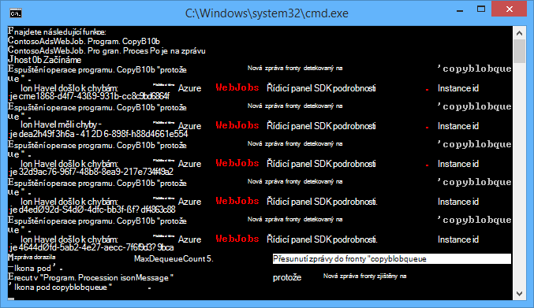
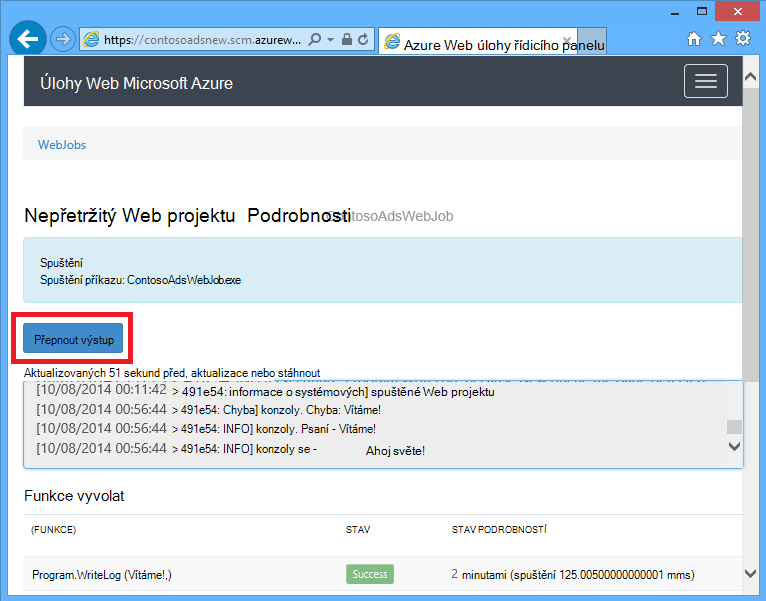
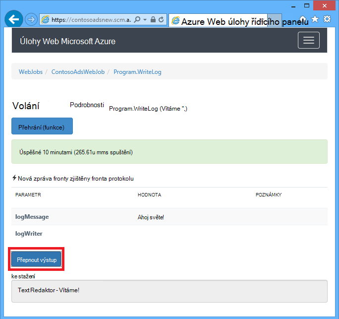
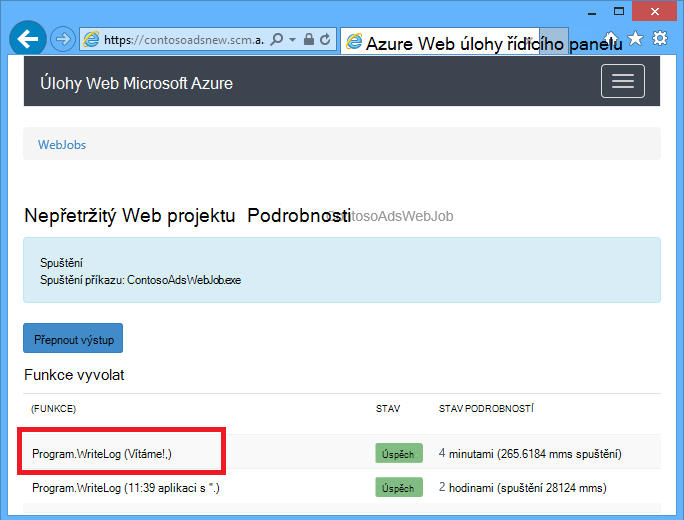
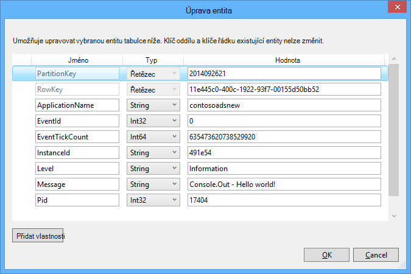
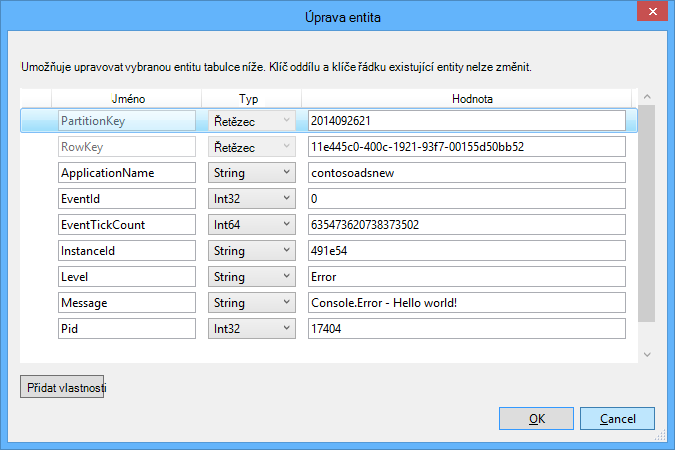

<properties 
    pageTitle="Použití úložiště Azure fronty s WebJobs SDK" 
    description="Naučte se používat úložiště Azure fronty s WebJobs SDK. Vytváření a odstraňování fronty; Vložení prohlížet, získat a odstraňování zpráv a další." 
    services="app-service\web, storage" 
    documentationCenter=".net" 
    authors="tdykstra" 
    manager="wpickett" 
    editor="jimbe"/>

<tags 
    ms.service="app-service-web" 
    ms.workload="web" 
    ms.tgt_pltfrm="na" 
    ms.devlang="dotnet" 
    ms.topic="article" 
    ms.date="06/01/2016" 
    ms.author="tdykstra"/>

# <a name="how-to-use-azure-queue-storage-with-the-webjobs-sdk"></a>Použití úložiště Azure fronty s WebJobs SDK

## <a name="overview"></a>Základní informace

Tato příručka obsahuje C# ukázek kódu, které ukazují, jak používat verzi Azure WebJobs SDK 1.x se službou Azure fronty úložiště.

Průvodce předpokládá víte, [jak vytvořit projekt WebJob ve Visual Studiu s připojovací řetězec, které přejděte ke svému účtu úložiště](websites-dotnet-webjobs-sdk-get-started.md#configure-storage) nebo k [víc účtům úložiště](https://github.com/Azure/azure-webjobs-sdk/blob/master/test/Microsoft.Azure.WebJobs.Host.EndToEndTests/MultipleStorageAccountsEndToEndTests.cs).

Většina fragmenty kódu zobrazí jenom funkce, není kód, který vytvoří `JobHost` objekt jako v následujícím příkladu:

        static void Main(string[] args)
        {
            JobHost host = new JobHost();
            host.RunAndBlock();
        }
        
Průvodce obsahuje následující témata:

-   [Jak aktivovat funkci po přijetí frontě zprávy](#trigger)
    - Řetězec zpráv
    - POCO zpráv
    - Funkce asynchronní
    - Typy atribut QueueTrigger označené jako pracuje s
    - Algoritmus hlasování
    - Více instancí
    - Paralelní spuštění
    - Získání fronty nebo fronty zprávy metadata
    - Vypnutí
-   [Jak vytvořit zprávu fronty při zpracování zprávy fronty](#createqueue)
    - Řetězec zpráv
    - POCO zpráv
    - Vytvoření více zpráv nebo v asynchronních funkcí
    - Typy spolupracuje atribut fronty
    - Použít atributy WebJobs SDK v těle funkce
-   [Jak číst a psát objektů BLOB při zpracování zprávy fronty](#blobs)
    - Řetězec zpráv
    - POCO zpráv
    - Typy objektů Blob atribut označené jako pracuje s
-   [Postup v případě poškozená zprávy](#poison)
    - Automatické poškozená zpráva zpracování
    - Ruční poškozená zpráva zpracování
-   [Nastavení možností konfigurace](#config)
    - Nastavení SDK připojovací řetězec v kódu
    - Konfigurace nastavení QueueTrigger
    - Nastavení hodnot pro WebJobs SDK konstruktor parametrů v kódu
-   [Jak aktivovat funkci ručně](#manual)
-   [Jak psát protokoly](#logs) 
-   [Jak obsloužení chyb a konfigurace časové limity](#errors)
-   [Další kroky](#nextsteps)

## <a id="trigger"></a>Jak aktivovat funkci po přijetí frontě zprávy

Psaní funkci, která volá WebJobs SDK po přijetí frontě zprávu, můžete `QueueTrigger` atribut. Atribut konstruktor má parametr řetězec určující název fronty dotazování. Můžete také [nastavit název fronty dynamicky](#config).

### <a name="string-queue-messages"></a>Řetězec zpráv

V následujícím příkladu fronty obsahuje řetězec zprávu, takže `QueueTrigger` se použije pro parametr řetězec s názvem `logMessage` obsahující obsah zprávy fronty. Funkce [zapíše do protokolu zprávu do řídicího panelu](#logs).
 

        public static void ProcessQueueMessage([QueueTrigger("logqueue")] string logMessage, TextWriter logger)
        {
            logger.WriteLine(logMessage);
        }

Kromě `string`, parametr může být polem bajt `CloudQueueMessage` objektu nebo POCO, který určíte.

### <a name="poco-plain-old-clr-objecthttpenwikipediaorgwikiplainoldclrobject-queue-messages"></a>POCO [(obyčejný původní objekt CLR](http://en.wikipedia.org/wiki/Plain_Old_CLR_Object)) fronty zprávy

V následujícím příkladu fronty zpráva obsahuje JSON pro `BlobInformation` objekt, který obsahuje `BlobName` vlastnost. V SDK automaticky deserializuje objekt.

        public static void WriteLogPOCO([QueueTrigger("logqueue")] BlobInformation blobInfo, TextWriter logger)
        {
            logger.WriteLine("Queue message refers to blob: " + blobInfo.BlobName);
        }

V SDK používá [Newtonsoft.Json NuGet balíčku](http://www.nuget.org/packages/Newtonsoft.Json) serializovat a deserializovat zprávy. Pokud vytvoříte zpráv v aplikaci, která nepoužívá WebJobs SDK, můžete napsat kód jako v následujícím příkladu vytvořte POCO fronty zprávu, která lze analyzovat SDK. 

        BlobInformation blobInfo = new BlobInformation() { BlobName = "log.txt" };
        var queueMessage = new CloudQueueMessage(JsonConvert.SerializeObject(blobInfo));
        logQueue.AddMessage(queueMessage);

### <a name="async-functions"></a>Asynchronních funkcí

Následující asynchronní funkce [zapíše protokolu na řídicí panel](#logs).

        public async static Task ProcessQueueMessageAsync([QueueTrigger("logqueue")] string logMessage, TextWriter logger)
        {
            await logger.WriteLineAsync(logMessage);
        }

Funkce asynchronní může trvat [token zrušení](http://www.asp.net/mvc/overview/performance/using-asynchronous-methods-in-aspnet-mvc-4#CancelToken), jak je vidět v následujícím příkladu, který slouží ke kopírování objektů blob. (Vysvětlení `queueTrigger` zástupný symbol, naleznete v části [objektů BLOB](#blobs) .)

        public async static Task ProcessQueueMessageAsyncCancellationToken(
            [QueueTrigger("blobcopyqueue")] string blobName, 
            [Blob("textblobs/{queueTrigger}",FileAccess.Read)] Stream blobInput,
            [Blob("textblobs/{queueTrigger}-new",FileAccess.Write)] Stream blobOutput,
            CancellationToken token)
        {
            await blobInput.CopyToAsync(blobOutput, 4096, token);
        }

### <a id="qtattributetypes"></a>Typy atribut QueueTrigger označené jako pracuje s

Můžete použít `QueueTrigger` s následujícími typy:

* `string`
* Typ POCO serializován jako JSON
* `byte[]`
* `CloudQueueMessage`

### <a id="polling"></a>Algoritmus hlasování

V SDK používá exponenciální zpět vypnout algoritmu náhodných snížit efekt nečinnosti fronty dotazování na náklady transakce úložiště.  Po nalezení zprávy v SDK čeká dvě sekundy a potom hledá další zprávu; Při nalezení žádná zpráva čeká asi čtyř sekund před pokusem znovu. Po dalších neúspěšných pokusech o mi zpráva o fronty pokračuje prodleva zvětšíte dokud nedosáhnete čas maximální čekání jednu minutu ve výchozím nastavení. [Maximální prodleva je možné nakonfigurovat](#config).

### <a id="instances"></a>Více instancí

Pokud váš web appu získáte v několika instancích spuštěných nepřetržitý WebJob běží na každém počítači a každý počítač bude počkejte aktivačních událostí a spouštět funkce. Aktivační událost fronty WebJobs SDK automaticky zabrání funkci zpracování zprávy fronty tisknutím; funkce nemusí být idempotent se měly zapisovat. Ale pokud chcete zajistit, které jenom jednou instancí funkci spustí i v případě, že máte víc instancí aplikace web host, můžete použít `Singleton` atribut. 

### <a id="parallel"></a>Paralelní spuštění

Pokud máte víc funkcí listening na různých fronty SDK se jim zavolá paralelně přijetí zpráv současně. 

Platí pro jediné fronty přijetí více zpráv. Ve výchozím nastavení v SDK získá dávky 16 zpráv najednou a provede funkci, která zpracuje souběžně. [Velikost dávku](#config). Pokud číslo zpracovávání bude polovina velikosti dávku, SDK získá jiný list a spustí zpracování zprávy. Maximální počet souběžné zpráv zpracovávání za funkce proto je jeden a půl krát dávku velikost. Toto omezení platí pro každou funkci, která obsahuje nezávisle `QueueTrigger` atribut. 

Pokud nechcete, aby paralelního spuštění zprávy přijaté v jedné fronty, můžete nastavit velikost dávky 1. Další informace najdete v článku **větší kontrolu nad zpracování fronty** v [Azure WebJobs SDK 1.1.0 RTM](/blog/azure-webjobs-sdk-1-1-0-rtm/).

### <a id="queuemetadata"></a>Získání fronty nebo fronty zprávy metadata

Následující vlastnosti zpráv můžete získat tak, že přidáte parametry, Access podpis metody:

* `DateTimeOffset`expirationTime
* `DateTimeOffset`insertionTime
* `DateTimeOffset`nextVisibleTime
* `string`queueTrigger (obsahuje text zprávy)
* `string`ID
* `string`popReceipt
* `int`dequeueCount

Pokud chcete Přímá práce s Azure úložiště rozhraní API, můžete si taky přidat `CloudStorageAccount` parametr.

Následující příklad všechny tato metadata zapíše do protokolu aplikace informace. V příkladu logMessage a queueTrigger obsahují obsah zprávy fronty.

        public static void WriteLog([QueueTrigger("logqueue")] string logMessage,
            DateTimeOffset expirationTime,
            DateTimeOffset insertionTime,
            DateTimeOffset nextVisibleTime,
            string id,
            string popReceipt,
            int dequeueCount,
            string queueTrigger,
            CloudStorageAccount cloudStorageAccount,
            TextWriter logger)
        {
            logger.WriteLine(
                "logMessage={0}\n" +
            "expirationTime={1}\ninsertionTime={2}\n" +
                "nextVisibleTime={3}\n" +
                "id={4}\npopReceipt={5}\ndequeueCount={6}\n" +
                "queue endpoint={7} queueTrigger={8}",
                logMessage, expirationTime,
                insertionTime,
                nextVisibleTime, id,
                popReceipt, dequeueCount,
                cloudStorageAccount.QueueEndpoint,
                queueTrigger);
        }

Tady je ukázka protokol napsal ukázkový kód:

        logMessage=Hello world!
        expirationTime=10/14/2014 10:31:04 PM +00:00
        insertionTime=10/7/2014 10:31:04 PM +00:00
        nextVisibleTime=10/7/2014 10:41:23 PM +00:00
        id=262e49cd-26d3-4303-ae88-33baf8796d91
        popReceipt=AgAAAAMAAAAAAAAAfc9H0n/izwE=
        dequeueCount=1
        queue endpoint=https://contosoads.queue.core.windows.net/
        queueTrigger=Hello world!

### <a id="graceful"></a>Vypnutí

Funkce, které se spouští v souvislé WebJob jsou přijatelné `CancellationToken` parametr, což umožňuje operační systém upozorní WebJob se brzo skončit funkci. Toto oznámení umožňuje Ujistěte se, že funkce není tak, aby data ponechá ve stavu nekonzistentní neočekávané ukončení.

Následující příklad ukazuje, jak se mají zjišťovat blížícím ukončení WebJob ve funkci.

    public static void GracefulShutdownDemo(
                [QueueTrigger("inputqueue")] string inputText,
                TextWriter logger,
                CancellationToken token)
    {
        for (int i = 0; i < 100; i++)
        {
            if (token.IsCancellationRequested)
            {
                logger.WriteLine("Function was cancelled at iteration {0}", i);
                break;
            }
            Thread.Sleep(1000);
            logger.WriteLine("Normal processing for queue message={0}", inputText);
        }
    }

**Poznámka:** Řídicí panel nemusí správně ukazují stav a výstup funkcí, které byl vypnout.
 
Další informace najdete v tématu [WebJobs vypnutí](http://blog.amitapple.com/post/2014/05/webjobs-graceful-shutdown/#.VCt1GXl0wpR).   

## <a id="createqueue"></a>Jak vytvořit zprávu fronty při zpracování zprávy fronty

Psaní funkci, která vytvoří novou zprávu fronty, můžete `Queue` atribut. Jako `QueueTrigger`, předáváte ve frontě jako řetězec nebo můžete [nastavit název fronty dynamicky](#config).

### <a name="string-queue-messages"></a>Řetězec zpráv

Následující příklad kódu není asynchronní vytvoří novou zprávu fronty ve frontě s názvem "outputqueue" s stejný obsah ve frontě zprávy doručeny do fronty s názvem "inputqueue". (Asynchronních funkcí dosáhnete `IAsyncCollector<T>` uvedeno dále v této části.)


        public static void CreateQueueMessage(
            [QueueTrigger("inputqueue")] string queueMessage,
            [Queue("outputqueue")] out string outputQueueMessage )
        {
            outputQueueMessage = queueMessage;
        }
  
### <a name="poco-plain-old-clr-objecthttpenwikipediaorgwikiplainoldclrobject-queue-messages"></a>POCO [(obyčejný původní objekt CLR](http://en.wikipedia.org/wiki/Plain_Old_CLR_Object)) fronty zprávy

Vytvoření fronty zprávu, která obsahuje POCO spíše než řetězec, předá typ POCO jako výstupní parametr k `Queue` konstruktor atributu.
 
        public static void CreateQueueMessage(
            [QueueTrigger("inputqueue")] BlobInformation blobInfoInput,
            [Queue("outputqueue")] out BlobInformation blobInfoOutput )
        {
            blobInfoOutput = blobInfoInput;
        }

V SDK jsou automaticky objekt JSON. Fronta zprávu vždy vytvoření i v případě, že objekt je null.

### <a name="create-multiple-messages-or-in-async-functions"></a>Vytvoření více zpráv nebo v asynchronních funkcí

Vytvoření více zpráv, aby typ parametru fronty výstup `ICollector<T>` nebo `IAsyncCollector<T>`, jak je ukázáno v následujícím příkladu.

        public static void CreateQueueMessages(
            [QueueTrigger("inputqueue")] string queueMessage,
            [Queue("outputqueue")] ICollector<string> outputQueueMessage,
            TextWriter logger)
        {
            logger.WriteLine("Creating 2 messages in outputqueue");
            outputQueueMessage.Add(queueMessage + "1");
            outputQueueMessage.Add(queueMessage + "2");
        }

Každá zpráva fronty vznikne ihned po `Add` s názvem metody.

### <a name="types-that-the-queue-attribute-works-with"></a>Typy spolupracuje atribut fronty

Můžete použít `Queue` atribut na následující typy parametrů:

* `out string`(Pokud je hodnota parametru jinou hodnotu než null po ukončení funkce vytvoří zprávu fronty)
* `out byte[]`(funguje jako `string`) 
* `out CloudQueueMessage`(funguje jako `string`) 
* `out POCO`(typu serializovatelný vytvoří zprávu s objektem null Pokud parametr null, když skončí platnost funkce)
* `ICollector`
* `IAsyncCollector`
* `CloudQueue`(při vytváření zprávy ručně pomocí rozhraní API úložiště Azure přímo)

### <a id="ibinder"></a>Použít atributy WebJobs SDK v těle funkce

Pokud je potřeba udělat některé práce ve vaší funkci před použitím atribut WebJobs SDK jako `Queue`, `Blob`, nebo `Table`, můžete použít `IBinder` rozhraní.

Následující příklad zabírá zprávu vstupní fronty a vytvoří novou zprávu s stejný obsah ve frontě výstupu. Název fronty výstup nastavenou tak, že kód v těle funkce.

        public static void CreateQueueMessage(
            [QueueTrigger("inputqueue")] string queueMessage,
            IBinder binder)
        {
            string outputQueueName = "outputqueue" + DateTime.Now.Month.ToString();
            QueueAttribute queueAttribute = new QueueAttribute(outputQueueName);
            CloudQueue outputQueue = binder.Bind<CloudQueue>(queueAttribute);
            outputQueue.AddMessage(new CloudQueueMessage(queueMessage));
        }

`IBinder` Rozhraní lze také s `Table` a `Blob` atributy.

## <a id="blobs"></a>Jak číst a psát objektů BLOB a tabulek a zpracování zprávy fronty

`Blob` a `Table` atributy umožňují čtení a zápis objektů BLOB a tabulky. Příklady v této části platí pro objekty BLOB. Ukázky, které ukazují, jak aktivovat procesy vytvořila nebo aktualizovala objektů BLOB vás [naučí používat úložišti objektů blob Azure s WebJobs SDK](websites-dotnet-webjobs-sdk-storage-blobs-how-to.md)a ukázek kódu, které čtení a zápis tabulek, najdete v článku [Použití úložiště tabulek Azure s WebJobs SDK](websites-dotnet-webjobs-sdk-storage-tables-how-to.md).

### <a name="string-queue-messages-triggering-blob-operations"></a>Spuštění operace objektů blob zprávy fronty řetězec

Fronty zprávu, která obsahuje řetězec `queueTrigger` je zástupný symbol můžete použít v `Blob` atributu `blobPath` parametr, který obsahuje obsah zprávy. 

V následujícím příkladu `Stream` objekty pro čtení a zápis objektů BLOB. Zpráva fronty stejný název objektů blob obsažených v kontejneru textblobs. Kopii objektů blob s "-nové" připojena k názvu se vytvoří ve stejném kontejneru. 

        public static void ProcessQueueMessage(
            [QueueTrigger("blobcopyqueue")] string blobName, 
            [Blob("textblobs/{queueTrigger}",FileAccess.Read)] Stream blobInput,
            [Blob("textblobs/{queueTrigger}-new",FileAccess.Write)] Stream blobOutput)
        {
            blobInput.CopyTo(blobOutput, 4096);
        }

`Blob` Atribut konstruktor přijímá `blobPath` parametr, který určuje jméno container a objektů blob. Další informace o tento zástupný symbol najdete v článku [používání úložišti objektů blob Azure s WebJobs SDK](websites-dotnet-webjobs-sdk-storage-blobs-how-to.md) 

Pokud atribut upraví `Stream` objektu, jiné konstruktor parametr určuje `FileAccess` režimu jako přečtené, zápis nebo pro čtení i zápis. 

V následujícím příkladu `CloudBlockBlob` objekt, který chcete odstranit objektů blob. Zpráva fronty stejný název objektů blob.

        public static void DeleteBlob(
            [QueueTrigger("deleteblobqueue")] string blobName,
            [Blob("textblobs/{queueTrigger}")] CloudBlockBlob blobToDelete)
        {
            blobToDelete.Delete();
        }

### <a id="pocoblobs"></a>POCO [(obyčejný původní objekt CLR](http://en.wikipedia.org/wiki/Plain_Old_CLR_Object)) fronty zprávy

Pro POCO uložených jako JSON ve frontě zprávu, můžete použít zástupné znaky, které název vlastnosti objektu v `Queue` atributu `blobPath` parametr. Můžete taky [názvy vlastností metadat fronty](#queuemetadata) jako zástupné symboly. 

V následujícím příkladu zkopíruje objektů blob do nových objektů blob s jinou příponou. Zpráva fronty `BlobInformation` objekt, který obsahuje `BlobName` a `BlobNameWithoutExtension` vlastnosti. Názvy vlastností jsou používána jako zástupné symboly do pole Cesta objektů blob pro `Blob` atributy. 
 
        public static void CopyBlobPOCO(
            [QueueTrigger("copyblobqueue")] BlobInformation blobInfo,
            [Blob("textblobs/{BlobName}", FileAccess.Read)] Stream blobInput,
            [Blob("textblobs/{BlobNameWithoutExtension}.txt", FileAccess.Write)] Stream blobOutput)
        {
            blobInput.CopyTo(blobOutput, 4096);
        }

V SDK používá [Newtonsoft.Json NuGet balíčku](http://www.nuget.org/packages/Newtonsoft.Json) serializovat a deserializovat zprávy. Pokud vytvoříte zpráv v aplikaci, která nepoužívá WebJobs SDK, můžete napsat kód jako v následujícím příkladu vytvořte POCO fronty zprávu, která lze analyzovat SDK.

        BlobInformation blobInfo = new BlobInformation() { BlobName = "boot.log", BlobNameWithoutExtension = "boot" };
        var queueMessage = new CloudQueueMessage(JsonConvert.SerializeObject(blobInfo));
        logQueue.AddMessage(queueMessage);

Pokud potřebujete udělat některé práce ve vaší funkci před vazby objektů blob k objektu, můžete použít atribut v těle funkci, [jak je znázorněno dříve atributu fronty](#ibinder).

### <a id="blobattributetypes"></a>Typy použitelných atribut objektů Blob s
 
`Blob` Atribut lze použít s následujícími typy:

* `Stream`(načtení nebo zápisu dat, rozlišit pomocí parametru konstruktoru FileAccess)
* `TextReader`
* `TextWriter`
* `string`(pro čtení)
* `out string`(napište; vytvoří objektů blob pouze v případě parametr řetězec jinou hodnotu než null až vrátí hodnotu funkce)
* POCO (pro čtení)
* mimo POCO (psaní; vždy vytvoří objektů blob, vytvoří jako objekt null, pokud POCO parametr není zadán, až vrátí hodnotu funkce)
* `CloudBlobStream`(napište)
* `ICloudBlob`(pro čtení a zápis)
* `CloudBlockBlob`(pro čtení a zápis) 
* `CloudPageBlob`(pro čtení a zápis) 

## <a id="poison"></a>Postup v případě poškozená zprávy

Zprávy, jejíž obsah způsobí, že funkce selhání nazývají *poškozená zprávy*. Při funkci nepovede, zpráva fronty není odstraněna a nakonec je převzít znovu příčinou obrázku opakovat. V SDK můžete automaticky vás nemají rušit, cyklu po omezenou počtu iterací nebo potřebujete k tomu ručně.

### <a name="automatic-poison-message-handling"></a>Automatické poškozená zpráva zpracování

V SDK bude volání funkce až 5 číslem fronty zprávu zpracovat. Když na pátý vyzkoušet nepovede, zpráva se přesune do poškozená fronty. [Maximální počet opakování je, která dokáže nahradit](#config). 

Poškozená fronty jmenuje *{originalqueuename}*-poškozená. Můžete psát, že není potřeba funkci, kterou chcete zpracování zpráv z poškozená fronty protokolování je nebo odesláním oznámení, které ruční pozornost. 

V následujícím příkladu `CopyBlob` funkce selže, když fronty zpráva obsahuje název objektů blob, který neexistuje. Když k tomu dojde, zpráva je už není ve frontě copyblobqueue fronty copyblobqueue poison. `ProcessPoisonMessage` Potom zaznamená poškozená zpráva.

        public static void CopyBlob(
            [QueueTrigger("copyblobqueue")] string blobName,
            [Blob("textblobs/{queueTrigger}", FileAccess.Read)] Stream blobInput,
            [Blob("textblobs/{queueTrigger}-new", FileAccess.Write)] Stream blobOutput)
        {
            blobInput.CopyTo(blobOutput, 4096);
        }
        
        public static void ProcessPoisonMessage(
            [QueueTrigger("copyblobqueue-poison")] string blobName, TextWriter logger)
        {
            logger.WriteLine("Failed to copy blob, name=" + blobName);
        }

Následující obrázek znázorňuje výstup konzoly z těchto funkcí při zpracování poškozená zpráva.



### <a name="manual-poison-message-handling"></a>Ruční poškozená zpráva zpracování

Přidáním můžete získat počet vybral zprávy pro zpracování `int` parametr s názvem `dequeueCount` vaší funkce. Pak můžete zkontrolovat počet dequeue za kód (funkce) a provést vlastní poškozená zpracování zpráv při číslo větší než mezní hodnota, jak je vidět v následujícím příkladu.

        public static void CopyBlob(
            [QueueTrigger("copyblobqueue")] string blobName, int dequeueCount,
            [Blob("textblobs/{queueTrigger}", FileAccess.Read)] Stream blobInput,
            [Blob("textblobs/{queueTrigger}-new", FileAccess.Write)] Stream blobOutput,
            TextWriter logger)
        {
            if (dequeueCount > 3)
            {
                logger.WriteLine("Failed to copy blob, name=" + blobName);
            }
            else
            {
            blobInput.CopyTo(blobOutput, 4096);
            }
        }

## <a id="config"></a>Nastavení možností konfigurace

Můžete použít `JobHostConfiguration` typ chcete nastavit následující možnosti konfigurace:

* Nastavení připojení řetězce SDK v kódu.
* Konfigurace `QueueTrigger` dequeue nastavení, například maximální počet.
* Získáte fronty názvy z konfigurace.

### <a id="setconnstr"></a>Nastavení SDK připojovací řetězec v kódu

Nastavení připojení řetězce SDK v kódu vám umožní použít vlastní řetězec názvy připojení ve konfigurace soubory nebo proměnné, jak je vidět v následujícím příkladu.

        static void Main(string[] args)
        {
            var _storageConn = ConfigurationManager
                .ConnectionStrings["MyStorageConnection"].ConnectionString;
        
            var _dashboardConn = ConfigurationManager
                .ConnectionStrings["MyDashboardConnection"].ConnectionString;
        
            var _serviceBusConn = ConfigurationManager
                .ConnectionStrings["MyServiceBusConnection"].ConnectionString;
        
            JobHostConfiguration config = new JobHostConfiguration();
            config.StorageConnectionString = _storageConn;
            config.DashboardConnectionString = _dashboardConn;
            config.ServiceBusConnectionString = _serviceBusConn;
            JobHost host = new JobHost(config);
            host.RunAndBlock();
        }

### <a id="configqueue"></a>Konfigurace nastavení QueueTrigger

Můžete konfigurovat tato nastavení, které platí pro zpracování zprávy fronty:

- Maximální počet zpráv, které jsou převzít současně má provádět paralelně (výchozí hodnota je 16).
- Maximální počet opakování odesílá nějaká zpráva fronty poškozená fronty (výchozí hodnota je 5).
- Maximální doba před znovu dotazování, kdy je do fronty prázdný (výchozí hodnota je 1 minutu).

Následující příklad ukazuje, jak tato nastavení konfigurujete takhle:

        static void Main(string[] args)
        {
            JobHostConfiguration config = new JobHostConfiguration();
            config.Queues.BatchSize = 8;
            config.Queues.MaxDequeueCount = 4;
            config.Queues.MaxPollingInterval = TimeSpan.FromSeconds(15);
            JobHost host = new JobHost(config);
            host.RunAndBlock();
        }

### <a id="setnamesincode"></a>Nastavení hodnot pro WebJobs SDK konstruktor parametrů v kódu

Někdy chcete zadat název fronty, název objektů blob nebo kontejneru nebo tabulky název v kódu spíše než pevného kódu. Můžete třeba zadat název fronty `QueueTrigger` konfigurační soubor nebo prostředí proměnné. 

Můžete to udělat předáním `NameResolver` objektu `JobHostConfiguration` typu. Se zástupnými symboly zvláštní uzavřen znaménka procent (%) v dialogovém okně WebJobs SDK atribut konstruktor parametry a `NameResolver` kód určuje skutečné hodnoty, které lze použít místo tyto zástupné symboly.

Předpokládejme například, že chcete použít fronty s názvem logqueuetest v testovacím prostředí a jeden pojmenované logqueueprod v výroby. Místo názvu pevně fronty, chcete-li zadat název položky v `appSettings` kolekce, budou mít aktuální frontě. Pokud `appSettings` klíč logqueue, funkce by měl vypadat jako v následujícím příkladu.

        public static void WriteLog([QueueTrigger("%logqueue%")] string logMessage)
        {
            Console.WriteLine(logMessage);
        }

Vaše `NameResolver` třídy potom mohl frontě z `appSettings` jak je vidět v následujícím příkladu:

        public class QueueNameResolver : INameResolver
        {
            public string Resolve(string name)
            {
                return ConfigurationManager.AppSettings[name].ToString();
            }
        }

Předáte `NameResolver` třídu v `JobHost` objektu, jak je vidět v následujícím příkladu.

        static void Main(string[] args)
        {
            JobHostConfiguration config = new JobHostConfiguration();
            config.NameResolver = new QueueNameResolver();
            JobHost host = new JobHost(config);
            host.RunAndBlock();
        }
 
**Poznámka:** Vyřešit fronty, tabulky a názvy objektů blob pokaždé, když je místo toho funkci, ale objektů blob kontejneru jmen pouze při spuštění aplikace. Můžete název změnit nedá objektů blob kontejneru je spuštěná úloha. 

## <a id="manual"></a>Jak aktivovat funkci ručně

Chcete-li ručně spustit funkci, použijte `Call` nebo `CallAsync` metoda na `JobHost` objektu a `NoAutomaticTrigger` atribut na funkci, jak je vidět v následujícím příkladu. 

        public class Program
        {
            static void Main(string[] args)
            {
                JobHost host = new JobHost();
                host.Call(typeof(Program).GetMethod("CreateQueueMessage"), new { value = "Hello world!" });
            }
        
            [NoAutomaticTrigger]
            public static void CreateQueueMessage(
                TextWriter logger, 
                string value, 
                [Queue("outputqueue")] out string message)
            {
                message = value;
                logger.WriteLine("Creating queue message: ", message);
            }
        }

## <a id="logs"></a>Jak psát protokoly

Řídicí panel zobrazuje protokoly na dvou místech: na stránce pro WebJob a na stránce pro konkrétní vyvolání WebJob. 





Výstup z konzoly metody, zavoláte ve funkci nebo v `Main()` metoda zobrazí stránky řídicího panelu WebJob, nikoliv na stránce pro vyvolání konkrétní metody. Výstup z TextWriter objekt, který získáte z parametru do podpisu metoda se zobrazí na stránce řídicí panel pro vyvolání metody.

Výstup konzoly nemohou být propojeny s vyvolání konkrétní metody, protože konzole jedním podprocesem, spuštěná mnoho funkcí projektu může být ve stejnou dobu. Proto SDK poskytuje každý vyvolání funkce s vlastní jedinečný protokolu Redaktor objekt.

K zápisu [protokolů trasování aplikace](web-sites-dotnet-troubleshoot-visual-studio.md#logsoverview), použijte `Console.Out` (vytvoří protokoly, která je označená jako informace) a `Console.Error` (vytvoří protokoly označena jako chyba). Další možností je používat [Sledování nebo TraceSource](http://blogs.msdn.com/b/mcsuksoldev/archive/2014/09/04/adding-trace-to-azure-web-sites-and-web-jobs.aspx), která poskytuje podrobné, upozornění a kritický úrovně kromě informace a chyby. Protokoly sledování aplikace se zobrazují v web app protokoly, Azure tabulek nebo objekty BLOB Azure podle toho, jak nakonfigurovat Azure webovou aplikaci. Platí pro všechny výstup konzoly, protokolech posledních 100 aplikace taky se zobrazí v stránky řídicího panelu pro WebJob, nikoli na stránku pro vyvolání funkce. 

Výstup konzoly se zobrazí na řídicím panelu jenom v případě, že aplikaci v Azure WebJob, není-li aplikaci místně nebo v jiném prostředí.

Vypnutí protokolování řídicího panelu vysoce výkonných scénářích. Ve výchozím nastavení v SDK zápisu protokolů do úložiště a tuto aktivitu může dojít ke snížení výkonu při zpracování velké množství zpráv. Vypnutí protokolování, nastavte řídicího panelu připojovací řetězec na hodnotu null, jak je vidět v následujícím příkladu.

        JobHostConfiguration config = new JobHostConfiguration();       
        config.DashboardConnectionString = "";        
        JobHost host = new JobHost(config);
        host.RunAndBlock();

Následující příklad ukazuje několika různými způsoby zápisu protokolů:

        public static void WriteLog(
            [QueueTrigger("logqueue")] string logMessage,
            TextWriter logger)
        {
            Console.WriteLine("Console.Write - " + logMessage);
            Console.Out.WriteLine("Console.Out - " + logMessage);
            Console.Error.WriteLine("Console.Error - " + logMessage);
            logger.WriteLine("TextWriter - " + logMessage);
        }

V WebJobs SDK řídicím panelu Výstup `TextWriter` zobrazí objekt přejdete na stránku pro konkrétní fungovat vyvolání a klikněte na **Přepínač výstup**:




Na řídicím panelu SDK WebJobs posledních 100 řádků konzoly výstupní zobrazit nahoru po přejděte na stránku pro WebJob (ne pro vyvolání funkce) a klikněte na **Přepínač výstup**.
 


V souvislé WebJob protokoly aplikace objeví v/data/úlohy/nepřetržitý /*{webjobname}*/job_log.txt v systému souborů web app.

        [09/26/2014 21:01:13 > 491e54: INFO] Console.Write - Hello world!
        [09/26/2014 21:01:13 > 491e54: ERR ] Console.Error - Hello world!
        [09/26/2014 21:01:13 > 491e54: INFO] Console.Out - Hello world!

V Azure objektů blob aplikaci protokoly vypadají takto: 2014-09-26T21:01:13,Information,contosoadsnew,491e54,635473620738373502,0,17404,17,Console.Write - Vítáme!, 2014-09-26T21:01:13,Error,contosoadsnew,491e54,635473620738373502,0,17404,19,Console.Error - Vítáme!, 2014-09-26T21:01:13,Information,contosoadsnew,491e54,635473620738529920,0,17404,17,Console.Out - Vítáme!,

A v tabulce Azure `Console.Out` a `Console.Error` protokoly vypadat takto:





Pokud chcete připojit vlastní protokoly, přejděte [v tomto příkladu](http://github.com/Azure/azure-webjobs-sdk-samples/blob/master/BasicSamples/MiscOperations/Program.cs).

## <a id="errors"></a>Jak obsloužení chyb a konfigurace časové limity

WebJobs SDK obsahuje taky [vypršení časového limitu](http://github.com/Azure/azure-webjobs-sdk-samples/blob/master/BasicSamples/MiscOperations/Functions.cs) atribut, který slouží k způsobit funkci, kterou chcete zrušit, pokud není dokončena v rámci zadaný časový úsek. A pokud chcete zvýšit upozornění při příliš mnoho chyb v rámci zadané období, můžete `ErrorTrigger` atribut. Tady je [Příklad ErrorTrigger](https://github.com/Azure/azure-webjobs-sdk-extensions/wiki/Error-Monitoring).

```
public static void ErrorMonitor(
[ErrorTrigger("00:01:00", 1)] TraceFilter filter, TextWriter log,
[SendGrid(
    To = "admin@emailaddress.com",
    Subject = "Error!")]
 SendGridMessage message)
{
    // log last 5 detailed errors to the Dashboard
   log.WriteLine(filter.GetDetailedMessage(5));
   message.Text = filter.GetDetailedMessage(1);
}
```

Můžete také dynamicky zakázání a povolení funkcí na ovládací prvek, zda je možné spouštět, pomocí konfigurace přepínač, který může být nastavení aplikace nebo název proměnné prostředí. Ukázkový kód, najdete `Disable` atribut v [úložišti vzorky WebJobs SDK](https://github.com/Azure/azure-webjobs-sdk-samples/blob/master/BasicSamples/MiscOperations/Functions.cs).

## <a id="nextsteps"></a>Další kroky

Tato příručka dodala ukázek kódu, které ukazují, jak řešit obvyklé scénáře pro práci s Azure fronty. Další informace o používání Azure WebJobs a WebJobs SDK tématech [Azure WebJobs doporučené](http://go.microsoft.com/fwlink/?linkid=390226).
 
