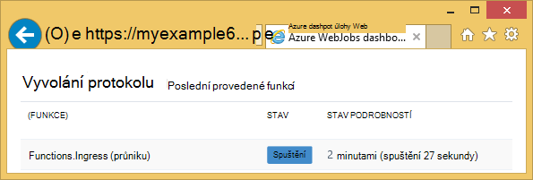
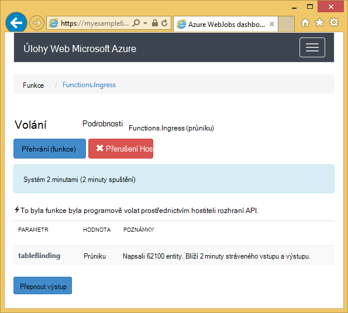
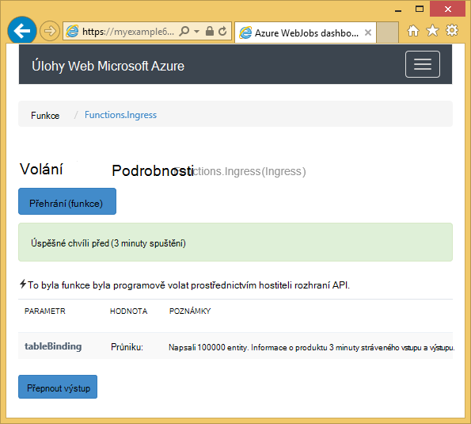

<properties 
    pageTitle="Použití úložiště tabulek Azure s WebJobs SDK" 
    description="Zjistěte, jak úložiště tabulek Azure pomocí služby WebJobs SDK. Vytvoření tabulky, přidejte entity do tabulek a číst existující tabulky." 
    services="app-service\web, storage" 
    documentationCenter=".net" 
    authors="tdykstra" 
    manager="wpickett" 
    editor="jimbe"/>

<tags 
    ms.service="app-service-web" 
    ms.workload="web" 
    ms.tgt_pltfrm="na" 
    ms.devlang="dotnet" 
    ms.topic="article" 
    ms.date="06/01/2016" 
    ms.author="tdykstra"/>

# Použití úložiště tabulek Azure s WebJobs SDK

## Základní informace

Tato příručka obsahuje C# ukázek kódu, které ukazují, jak pro čtení a zápis tabulek Azure úložiště pomocí verze [WebJobs SDK](websites-dotnet-webjobs-sdk.md) 1.x.

Průvodce předpokládá víte, [jak vytvořit projekt WebJob ve Visual Studiu s připojovací řetězec, které přejděte ke svému účtu úložiště](websites-dotnet-webjobs-sdk-get-started.md) nebo k [víc účtům úložiště](https://github.com/Azure/azure-webjobs-sdk/blob/master/test/Microsoft.Azure.WebJobs.Host.EndToEndTests/MultipleStorageAccountsEndToEndTests.cs).
        
Část zobrazit fragmenty kódu `Table` atribut používané funkce, které nejsou [volat ručně](websites-dotnet-webjobs-sdk-storage-queues-how-to.md#manual), to znamená, pomocí jedné atributy aktivační událost. 

## Jak přidat entity do tabulky

Přidat entity do tabulky, použijte `Table` atributem `ICollector<T>` nebo `IAsyncCollector<T>` parametr kde `T` určuje schématu entit, který chcete přidat. Atribut konstruktor má parametr řetězec určující název tabulky. 

Následující příklad kódu přidá `Person` entit v tabulce s názvem *průniku*.

        [NoAutomaticTrigger]
        public static void IngressDemo(
            [Table("Ingress")] ICollector<Person> tableBinding)
        {
            for (int i = 0; i < 100000; i++)
            {
                tableBinding.Add(
                    new Person() { 
                        PartitionKey = "Test", 
                        RowKey = i.ToString(), 
                        Name = "Name" }
                    );
            }
        }

Obvykle typ používáte s `ICollector` je odvozena z `TableEntity` nebo implementuje `ITableEntity`, ale není potřeba. Jedním z následujících `Person` třídy práce s kódem zobrazeným v předchozím `Ingress` metody.

        public class Person : TableEntity
        {
            public string Name { get; set; }
        }

        public class Person
        {
            public string PartitionKey { get; set; }
            public string RowKey { get; set; }
            public string Name { get; set; }
        }

Pokud chcete Přímá práce s Azure úložiště rozhraní API, můžete přidat `CloudStorageAccount` parametr podpis metody.

## Sledování v reálném čase

Protože funkce průniku dat často zpracovat velké objemy dat, na řídicím panelu WebJobs SDK obsahuje data v reálném čase sledování. Pokud funkce spuštěné popsaný v části **Vyvolání protokolu** .

Stránka **Podrobnosti vyvolání** sestavy průběhu funkce (počet entit napsané) je spuštěn a nabízí možnost zrušit ho. 

Po dokončení funkci stránku **Podrobnosti vyvolání** hlásí počet řádků napsali.

## Jak číst více entit z tabulky

Čtení tabulky, můžete `Table` atributem `IQueryable<T>` parametr typem `T` je odvozena z `TableEntity` nebo implementuje `ITableEntity`.

Následující příklad kódu bude číst a protokoly všech řádků z `Ingress` tabulky:
 
        public static void ReadTable(
            [Table("Ingress")] IQueryable<Person> tableBinding,
            TextWriter logger)
        {
            var query = from p in tableBinding select p;
            foreach (Person person in query)
            {
                logger.WriteLine("PK:{0}, RK:{1}, Name:{2}", 
                    person.PartitionKey, person.RowKey, person.Name);
            }
        }

### Jak číst jedna entita z tabulky

Je `Table` konstruktor atributu se dvěma parametry další, které umožňují určit klíč oddílu a klíče řádku, když budete chtít vytvořit vazbu s jednou tabulkou entity.

Následující příklad kódu přečte řádek tabulky pro `Person` entity podle oddíl klíč řádku klíčové hodnoty a přijetí frontě zprávy:  

        public static void ReadTableEntity(
            [QueueTrigger("inputqueue")] Person personInQueue,
            [Table("persontable","{PartitionKey}", "{RowKey}")] Person personInTable,
            TextWriter logger)
        {
            if (personInTable == null)
            {
                logger.WriteLine("Person not found: PK:{0}, RK:{1}",
                        personInQueue.PartitionKey, personInQueue.RowKey);
            }
            else
            {
                logger.WriteLine("Person found: PK:{0}, RK:{1}, Name:{2}",
                        personInTable.PartitionKey, personInTable.RowKey, personInTable.Name);
            }
        }

`Person` Třídy v tomto příkladu nemá implementovat `ITableEntity`.

## Jak lze pomocí rozhraní API úložiště .NET přímo pracovat s tabulkou

Můžete taky použít `Table` atributem `CloudTable` objektu pro větší flexibilitu při práci s tabulkou.

Následující kód používá ukázkový `CloudTable` objekt, který chcete přidat jednu entitu k tabulce *průniku* . 
 
        public static void UseStorageAPI(
            [Table("Ingress")] CloudTable tableBinding,
            TextWriter logger)
        {
            var person = new Person()
                {
                    PartitionKey = "Test",
                    RowKey = "100",
                    Name = "Name"
                };
            TableOperation insertOperation = TableOperation.Insert(person);
            tableBinding.Execute(insertOperation);
        }

Další informace o tom, jak používat `CloudTable` objektu, přečtěte si, [jak používat úložiště tabulek z .NET](../storage/storage-dotnet-how-to-use-tables.md). 

## Související témata článek s postupy fronty

Další informace o tom, jak řešit zpracování tabulky spouštěný zobrazí zpráva o fronty nebo WebJobs SDK scénáře nejsou specifické pro tabulky zpracování najdete v článku [Použití úložiště Azure fronty s WebJobs SDK](websites-dotnet-webjobs-sdk-storage-queues-how-to.md). 

Témata v tomto článku patřit následující úkoly:

* Funkce asynchronní
* Více instancí
* Vypnutí
* Použít atributy WebJobs SDK v těle funkce
* Nastavení připojení řetězce SDK v kódu
* Nastavení hodnot pro WebJobs SDK konstruktor parametrů v kódu
* Aktivace funkce ručně
* Zápisu protokolů

## Další kroky

Tato příručka dodala ukázek kódu, které ukazují, jak řešit obvyklé scénáře práce s tabulkami Azure. Další informace o používání Azure WebJobs a WebJobs SDK tématech [Azure WebJobs doporučené](http://go.microsoft.com/fwlink/?linkid=390226).
 
