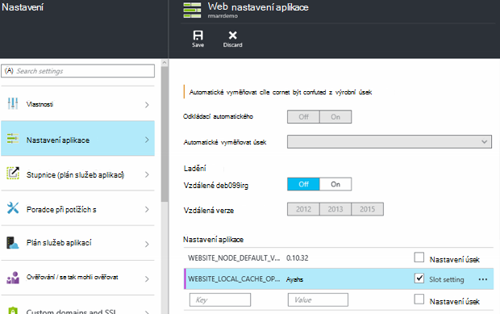

<properties
   pageTitle="Přehled místní mezipaměti aplikace služby Azure | Microsoft Azure"
   description="Tento článek popisuje, jak povolit, změnou velikosti a stav funkce Azure aplikace služby místní mezipaměti dotazu"
   services="app-service"
   documentationCenter="app-service"
   authors="SyntaxC4"
   manager="yochayk"
   editor=""
   tags="optional"
   keywords=""/>

<tags
   ms.service="app-service"
   ms.devlang="multiple"
   ms.topic="article"
   ms.tgt_pltfrm="na"
   ms.workload="na"
   ms.date="03/04/2016"
   ms.author="cfowler"/>

# <a name="azure-app-service-local-cache-overview"></a>Azure místní mezipaměti aplikace služby základní informace

Azure webové aplikace obsah je uložen v úložišti Azure a vytažená nahoru trvalé způsobem jako obsahu sdílet. Tento návrh je určená pro práci s různými aplikace a má následující atributy:  

* V několika instancích virtuálního počítače (OM) ve web appu se sdílí obsahu.
* Obsah je trvalé a kterou lze spuštěním webových aplikací web apps.
* Soubory protokolu a diagnostiky datové soubory jsou k dispozici ve složce stejné sdíleného obsahu.
* Publikování nový obsah přímo aktualizuje obsahu složky. Můžete okamžitě zobrazit stejný obsah prostřednictvím webu Správce služeb a pracovního web app (obvykle některé technologiemi usnadnění, například ASP.NET zahájit restartování web app na některé změny souboru k získání nejnovějšího obsahu).

Mnoho webové aplikace používají jednotlivě nebo všechny tyto funkce, ale některé webové aplikace stačí, když výkonné, jen pro čtení obsahu: ukládání, která lze spustit z s vysokou dostupnost. Tyto aplikace využívat OM výskyt určitých místní mezipaměti.

Funkce místní mezipaměti služby Azure aplikace poskytuje zobrazení role webového obsahu. Tento obsah je zapsat ale zahodit mezipaměť obsahu úložiště, která se vytvoří asynchronní při spuštění webu. Pokud mezipaměti hotovou, webu přepnout do kontrolovat obsah v mezipaměti. Webové aplikace spuštěné v operačním systému místní mezipaměti má následující výhody:

* Jsou tedy vůči čekacích dob, ke kterým dochází při přístupu k obsahu na Azure úložiště.
* Jsou tedy vůči plánovaná aktualizace nebo neplánované downtimes a všechny ostatní přerušení poskytování s úložištěm Azure probíhajících na serverech, které slouží obsahu sdílet.
* Mají méně restartování aplikace kvůli změnám sdílet úložiště.

## <a name="how-local-cache-changes-the-behavior-of-app-service"></a>Jak se změní místní mezipaměti, chování aplikace služby

* Místní mezipaměti je kopii složky /site a /siteextensions ve web appu. Vytvoření místní instance OM při spuštění webové aplikace. Velikost místní mezipaměti na web appu se omezí na 300 MB ve výchozím nastavení, ale můžete ho zvětšit až 1 GB.
* Místní mezipaměti je pro čtení i zápis. Však změny budou ztraceny při web appu nepřesune virtuálních počítačích nebo získá restartovat. K aplikacím, které obsahují důležitá data v úložišti obsahu neměli používat místní mezipaměti.
* Web apps můžete dál psát soubory protokolu a diagnostických dat jako právě. Soubory protokolu a data, ale jsou uložená místně na OM. Potom zkopírují přes pravidelně k úložišti sdíleného obsahu. Pole Kopírovat do sdíleného obsahu úložiště je nejlepší dílem – zápisu zkopíruje může dojít ke ztrátě termín náhlé pád OM instance.
* Dojde ke změně v struktura složek složky LogFiles a Data webových aplikací používajících místní mezipaměti. Zde jsou teď podsložky úložiště LogFiles a Data složky, které následují za vzor pro pojmenování "Jedinečný identifikátor" + časové razítko. Jednotlivé podsložky odpovídá instanci OM kde webových aplikací běží nebo spuštění.  
* Publikování změn web appu libovolným publikování mechanismy publikují k úložišti sdíleného obsahu. Jedná se o záměr, protože chceme publikované obsahu pro trvalé. Abyste mohli aktualizovat místní mezipaměti web appu, je nutné restartovat. To zdá se, nadbytečné krok? Chcete-li životním cyklu Bezproblémová, přečtěte si informace dál v tomto článku.
* D:\Home bude ukazovat místní mezipaměti. D:\Local zůstanou v přejdete dočasné OM konkrétní úložiště.
* Výchozí zobrazení obsahu webu, Správce služeb budou nadále s sdílených úložiště obsahu.

## <a name="enable-local-cache-in-app-service"></a>Povolit místní mezipaměti v aplikaci služby

Konfigurace místní mezipaměti pomocí kombinace nastavení rezervovaná aplikace. Nastavení aplikace můžete nakonfigurovat tak, že následujícími způsoby:

* [Azure portálu](#Configure-Local-Cache-Portal)
* [Azure správce prostředků](#Configure-Local-Cache-ARM)

### <a name="configure-local-cache-by-using-the-azure-portal"></a>Konfigurace místní mezipaměti pomocí portálu Azure
<a name="Configure-Local-Cache-Portal"></a>

Povolení místní mezipaměti u jednotlivých aplikací na web pomocí tohoto nastavení aplikace:`WEBSITE_LOCAL_CACHE_OPTION` = `Always`  



### <a name="configure-local-cache-by-using-azure-resource-manager"></a>Konfigurace místní mezipaměti pomocí Správce prostředků Azure
<a name="Configure-Local-Cache-ARM"></a>

```
...

{
    "apiVersion": "2015-08-01",
    "type": "config",
    "name": "appsettings",
    "dependsOn": [
        "[resourceId('Microsoft.Web/sites/', variables('siteName'))]"
    ],
    "properties": {
        "WEBSITE_LOCAL_CACHE_OPTION": "Always",
        "WEBSITE_LOCAL_CACHE_SIZEINMB": "300"
    }
}

...
```

## <a name="change-the-size-setting-in-local-cache"></a>Změna nastavení velikosti v místní mezipaměti

Ve výchozím nastavení je velikost místní mezipaměti **300 MB**. Platí to i /site a /siteextensions složky, které se zkopírují z obchodu obsahu, jakož i všechny místně vytvořené složky protokoly a data. Pokud chcete zvýšit toto omezení, použijte nastavení aplikace `WEBSITE_LOCAL_CACHE_SIZEINMB`. Můžete zvětšit velikost až **1 GB** (1 000 MB) na web appu.

## <a name="best-practices-for-using-app-service-local-cache"></a>Osvědčené postupy pro používání místní mezipaměti aplikace služby

Doporučujeme použít místní mezipaměti ve spojení s funkcí [Pracovní prostředí](../app-service-web/web-sites-staged-publishing.md) .

* Přidání _rychlé_ nastavení aplikace `WEBSITE_LOCAL_CACHE_OPTION` s hodnotou `Always` na **výrobní** pozici. Pokud používáte `WEBSITE_LOCAL_CACHE_SIZEINMB`, také přidat jako rychlé nastavení úsek výroby.
* Vytvořit **pracovní** pozici a publikovat na vaší pracovní pozici. Obvykle nenastavíte pracovní pozici používat místní mezipaměti pro povolení bezproblémovou životního cyklu sestavení nasazení test pro přípravu Pokud se zobrazí výhody místní mezipaměti pro úsek výroby.
*   Testování webu proti pracovní pozici.  
*   Jakmile budete připraveni, zadejte [vyměňovat operace](../app-service-web/web-sites-staged-publishing.md#to-swap-deployment-slots) mezi pracovní a výrobních sloty.  
*   Rychlé nastavení zahrnovat jméno a rychlé pozici. Tak až do provozu získá vyměnit pracovní pozici, budou dědit nastavení aplikace místní mezipaměti. Nově vyměněný úsek výrobní se spustí hledání místní mezipaměti za několik minut a bude jde provozní teplotu jako součást úsek zahřívání po vyměňovat. Takže po dokončení vyměňovat úsek výrobní úsek spuštěn s místní mezipaměti.

## <a name="frequently-asked-questions-faq"></a>Nejčastější dotazy

### <a name="how-can-i-tell-if-local-cache-applies-to-my-web-app"></a>Jak zjistím, pokud platí místní mezipaměti pro svůj web appu?

Pokud webovou aplikaci potřebuje výkonné a spolehlivý úložiště obsahu, není úložiště obsahu můžete začít psát pomocí důležitá data za běhu a celková velikost je menší než 1 GB, pak odpověď je "Ano"! Chcete-li získat celkovou velikost složky /site a /siteextensions, můžete použít rozšíření webu "Azure webové aplikace disku využití".  

### <a name="how-can-i-tell-if-my-site-has-switched-to-using-local-cache"></a>Jak lze poznat, pokud osobní web přepnul pomocí místní mezipaměti?

Pokud používáte funkci místní mezipaměti s pracovní prostředí, operace vyměňovat dokončena až předehřívá místní mezipaměti. Pokud chcete zkontrolovat, jestli váš web je spuštěný proti místní mezipaměti, můžete zkontrolovat proměnnou pracovního procesu prostředí `WEBSITE_LOCALCACHE_READY`. Pomocí pokynů na stránce [proměnné pracovního procesu](https://github.com/projectkudu/kudu/wiki/Process-Threads-list-and-minidump-gcdump-diagsession#process-environment-variable) pro přístup k proměnnou pracovního procesu prostředí v několika instancích spuštěných.  

### <a name="i-just-published-new-changes-but-my-web-app-does-not-seem-to-have-them-why"></a>Právě publikovaný nové změny, ale můj web appu nefunguje a požádejte. Proč?

Pokud váš web appu používá místní mezipaměti, je potřeba restartovat svůj web a získat poslední změny. Nechcete, aby publikovat změny výrobní Web? Zobrazí možnosti úsek v předchozí části Doporučené postupy.

### <a name="where-are-my-logs"></a>Kde jsou protokoly?

S místní mezipaměti vypadá trochu odlišně složky dat a protokolování. Však strukturu podsložkách zůstane stejná, s tím rozdílem, že podsložky jsou nestled v části podsložku pomocí formátu "jedinečný OM identifikátor" + časové razítko.

### <a name="i-have-local-cache-enabled-but-my-web-app-still-gets-restarted-why-is-that-i-thought-local-cache-helped-with-frequent-app-restarts"></a>Mám místní mezipaměti, ale získá nerestartuje pořád Můj web appu. Co to znamená? Můžu představit, že místní mezipaměti pomohl s restartování časté aplikace.

Místní mezipaměti zabránit restartování souvisejících s úložištěm web app. Však webovou aplikaci by mohla pořád projít restartování během plánované infrastruktury inovací OM. Celková restartování aplikace, které se setkáte s místní mezipaměti by měl být méně.
