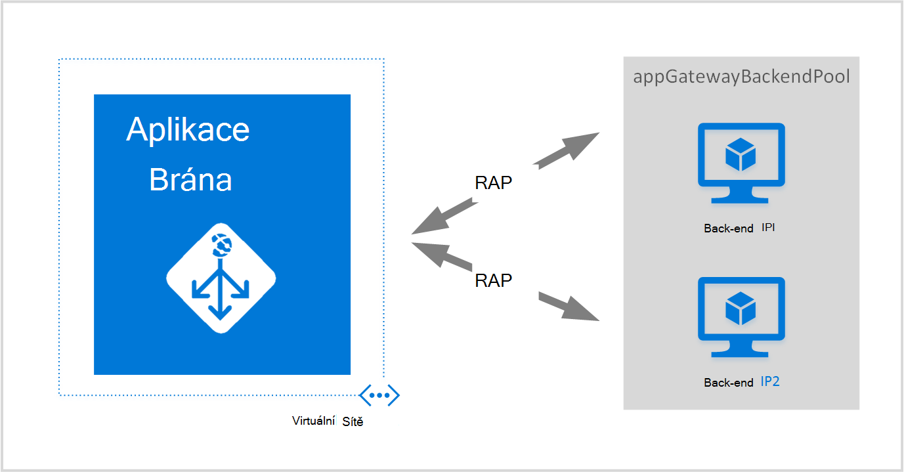
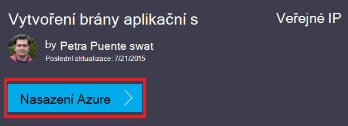
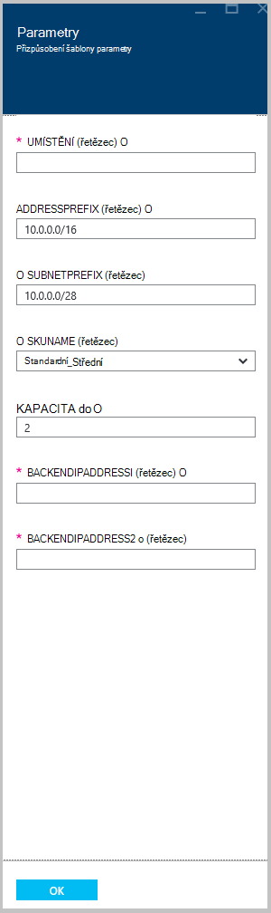

<properties
   pageTitle="Vytvoření aplikace brány pomocí Správce prostředků Azure šablon | Microsoft Azure"
   description="Tato stránka obsahuje pokyny k vytvoření Azure aplikace brány pomocí Správce prostředků Azure šablony"
   documentationCenter="na"
   services="application-gateway"
   authors="georgewallace"
   manager="carmonm"
   editor="tysonn"/>
<tags
   ms.service="application-gateway"
   ms.devlang="na"
   ms.topic="article"
   ms.tgt_pltfrm="na"
   ms.workload="infrastructure-services"
   ms.date="10/25/2016"
   ms.author="gwallace"/>

# Vytvoření aplikace brány pomocí Správce prostředků Azure šablony

> [AZURE.SELECTOR]
- [Azure portálu](application-gateway-create-gateway-portal.md)
- [Azure prostředí PowerShell správce prostředků](application-gateway-create-gateway-arm.md)
- [Azure klasické prostředí PowerShell](application-gateway-create-gateway.md)
- [Azure správce prostředků šablony](application-gateway-create-gateway-arm-template.md)
- [Azure rozhraní příkazového řádku](application-gateway-create-gateway-cli.md)

Azure aplikace brána je Vyrovnávání zatížení vrstvy-7. Poskytuje selhání směrování výkonu požadavků HTTP mezi jiné servery, ať už jde o v cloudu a místní. Aplikace brány nabízí spoustu z funkcí aplikace doručení řadiče ADC včetně Vyrovnávání zatížení HTTP, na základě souborů cookie relace spřažení, převzít Secure (Sockets Layer SSL), vlastní stavu sond podporu více webů a mnoha dalších. Úplný seznam podporovaných funkcí naleznete [Přehled brány aplikace](application-gateway-introduction.md)

Informace o stahování a upravit existující šablony správce prostředků Azure z GitHub a nasazení šablony z GitHub, prostředí PowerShell a rozhraní příkazového řádku Azure.

Pokud jsou jednoduše nasazení šablony správce prostředků Azure přímo z GitHub beze změn, přejděte na nasazení šablony z GitHub.

## Scénář

V tomto scénáři udělejte toto:

- Vytvoření brány aplikační s dvě instance.
- Vytvořte virtuální síť s názvem VirtualNetwork1 s rezervovaná CIDR blokem 10.0.0.0/16.
- Vytvoření podsítě s názvem Appgatewaysubnet používající 10.0.0.0/28 jako jeho blokování CIDR.
- Nastavení služby dvě dříve konfigurované IP adresy back-end webových serverů, chcete-li vyrovnávání zatížení přenos. V tomto příkladu šablony IP adresy back-end se 10.0.1.10 10.0.1.11.

>[AZURE.NOTE] Tato nastavení jsou parametry pro tuto šablonu. Přizpůsobení šablony, můžete změnit pravidla, posluchače a protokol SSL, který se otevře azuredeploy.json.

## Stáhněte si a chápete šabloně správce prostředků Azure

Můžete si stáhnout existující šablony správce prostředků Azure vytvořit virtuální sítě a dvě podsítí z GitHub, proveďte požadované změny může má a znovu použít. Postup, pomocí následujících kroků:

1. Přejděte na [Vytvoření brány pro aplikace](https://github.com/Azure/azure-quickstart-templates/tree/master/101-application-gateway-create).
2. Klikněte na **azuredeploy.json**a potom klikněte na **původní**.
3. Uložte soubor do místní složky ve vašem počítači.
4. Pokud máte zkušenosti s správce prostředků Azure šablony, přejděte ke kroku 7.
5. Otevřete soubor, který jste uložili a podívejte se na obsah v **parametrů** v řádku 5. Azure parametry šablony správce prostředků poskytují zástupný symbol pro hodnoty, které lze vyplnit při nasazení.

  	| Parametr | Popis |
  	|---|---|
  	| **umístění** | Azure oblasti, kde je vytvořená brány aplikace |
  	| **VirtualNetwork1** | Název pro nová virtuální síť |
  	| **addressPrefix** | Adresní prostor pro virtuální sítě ve formátu CIDR |
  	| **ApplicationGatewaysubnet** | Název brány podsítě aplikace |
  	| **subnetPrefix** | Blokování CIDR podsítě brány aplikace |
  	| **skuname** | Velikost instance SKU |
  	| **kapacity** | Počet výskytů |
  	| **backendaddress1** | IP adresu první webový server |
  	| **backendaddress2** | IP adresu druhý webový server |

    >[AZURE.IMPORTANT] Azure správce prostředků šablony vedou v GitHub můžete v průběhu času mění. Ujistěte se, zkontrolujte šabloně, než ho začnete používat.

6. Zkontrolovat obsah v seznamu **zdroje** a Všimněte si takto:

    - **Typ**. Typ zdroje vytvořené pomocí šablony. V tomto případě je typu **Microsoft.Network/applicationGateways**, která představuje brány aplikační.
    - **název**. Název zdroje. Všimněte si použití **[parameters('applicationGatewayName')]**, což znamená, že název je k dispozici jako vstup vy nebo tak, že soubor parametr během nasazení.
    - **Vlastnosti**. Seznam vlastností daného zdroje. Tato šablona používá virtuální sítě a veřejnou IP adresu při tvorbě brány aplikace.

7. Přejděte zpět [https://github.com/Azure/azure-quickstart-templates/blob/master/101-application-gateway-create/](https://github.com/Azure/azure-quickstart-templates/blob/master/101-application-gateway-create).
8. Klikněte na **azuredeploy paremeters.json**a potom klikněte na **původní**.
9. Uložte soubor do místní složky ve vašem počítači.
10. Otevřete soubor, který jste uložili a upravte hodnoty parametrů. Nasazení aplikace brány popsané v našem případě pomocí následující hodnoty.

        {
        "$schema": "http://schema.management.azure.com/schemas/2015-01-01/deploymentParameters.json#",
        {
        "location" : {
        "value" : "West US"
        },
        "addressPrefix": {
        "value": "10.0.0.0/16"
        },
        "subnetPrefix": {
        "value": "10.0.0.0/24"
        },
        "skuName": {
        "value": "Standard_Small"
        },
        "capacity": {
        "value": 2
        },
        "backendIpAddress1": {
        "value": "10.0.1.10"
        },
        "backendIpAddress2": {
        "value": "10.0.1.11"
        }
        }

11. Uložte soubor. Pomocí nástroje ověření online JSON jako [JSlint.com](http://www.jslint.com/)můžete otestovat JSON šablony a parametr šablony.

## Nasazení šablony správce prostředků Azure pomocí prostředí PowerShell

Pokud máte Azure Powershellu, přečtěte si, [Jak nainstalovat a nakonfigurovat Azure PowerShell](../powershell-install-configure.md) a postupujte podle pokynů a přihlaste se k Azure a vyberte předplatné.

### Krok 1

    Login-AzureRmAccount

### Krok 2

Zaškrtněte políčko předplatná pro účet.

    Get-AzureRmSubscription

Zobrazí se výzva k ověření pomocí svých přihlašovacích údajů.

### Krok 3

Zvolte, které předplatné Azure používat.

    Select-AzureRmSubscription -Subscriptionid "GUID of subscription"

### Krok 4

V případě potřeby vytvářet skupiny zdrojů pomocí rutinu **New-AzureResourceGroup** . V následujícím příkladu vytvoříte skupinu zdroje s názvem AppgatewayRG ve východoasijských USA umístění.

    New-AzureRmResourceGroup -Name AppgatewayRG -Location "East US"

Spusťte rutinu **New-AzureRmResourceGroupDeployment** nasazení novou síť virtuální pomocí předchozího šablony a parametr soubory stažené a změny.

    New-AzureRmResourceGroupDeployment -Name TestAppgatewayDeployment -ResourceGroupName AppgatewayRG `
        -TemplateFile C:\ARM\azuredeploy.json -TemplateParameterFile C:\ARM\azuredeploy-parameters.json

## Nasazení šablony správce prostředků Azure pomocí rozhraní příkazového řádku Azure

Abyste mohli nasadit správce prostředků Azure šablonu, kterou jste si stáhli pomocí rozhraní příkazového řádku Azure, postupujte následujícím způsobem:

### Krok 1

Pokud jste použili nikdy Azure rozhraní příkazového řádku, přečtěte si článek [instalace a konfigurace rozhraní příkazového řádku Azure](../xplat-cli-install.md) a postupujte podle pokynů až do okamžiku, kdy vyberte svůj účet Azure a předplatné.

### Krok 2

Příkaz **azure konfigurace režim** přepněte do režimu správce prostředků, jak je ukázáno v následujícím příkladu.

    azure config mode arm

Tady je očekávané výstup pro výše uvedené příkaz:

    info:   New mode is arm

### Krok 3

V případě potřeby příkaz **vytvořit azure skupiny** k vytvoření nové skupiny prostředků, jak je ukázáno v následujícím příkladu. Všimněte si výstup příkazu. Seznam zobrazený po výstup vysvětluje parametry použité. Další informace o skupinách prostředků Navštěvujte blog o [Přehled Správce prostředků Azure](../azure-resource-manager/resource-group-overview.md).

    azure group create -n appgatewayRG -l eastus

**n (nebo – název)**. Název nové skupiny prostředků. Náš scénář je *appgatewayRG*.

**-l (nebo – umístění)**. Azure oblast, kde je vytvořena nová skupina zdrojů. Náš scénář je *eastus*.

### Krok 4

Spusťte rutinu **azure skupiny nasazení vytvořit** nasazení nová virtuální síť pomocí šablony a parametr soubory můžete stáhnout a kterou nad. Seznam zobrazený po výstup vysvětluje parametry použité.

    azure group deployment create -g appgatewayRG -n TestAppgatewayDeployment -f C:\ARM\azuredeploy.json -e C:\ARM\azuredeploy-parameters.json

## Nasazení šablony správce prostředků Azure pomocí, klikněte na nasazení

Klikněte na nasazení je jiný způsob, jak používat Správce prostředků Azure šablony. Je snadný způsob, jak pomocí portálu Azure šablony.

### Krok 1

Přejděte na téma [vytváření brány aplikační s veřejnou IP](https://azure.microsoft.com/documentation/templates/101-application-gateway-public-ip/).

### Krok 2

Klikněte na **nasazení Azure**.

### Krok 3

Vyplňte parametry pro nasazení šablony na portálu a klikněte na **OK**.

### Krok 4

**Právní termíny** vybrat a klikněte na **koupit**.

### Krok 5

Na zásuvné nasazení vlastní klikněte na **vytvořit**.

## Další kroky

Pokud chcete konfigurovat SSL převedení, přečtěte si téma [Konfigurace brány aplikační pro SSL převzít](application-gateway-ssl.md).

Pokud chcete konfigurovat brány aplikace pomocí služby Vyrovnávání zatížení vnitřní, v tématu [Vytvoření brány aplikační s Vyrovnávání zatížení vnitřní (ILB)](application-gateway-ilb.md).

Pokud budete potřebovat další informace o načtení vyrovnávání možnosti obecně, navštěvujte blog o:

- [Vyrovnávání zatížení Azure](https://azure.microsoft.com/documentation/services/load-balancer/)
- [Azure přenosy správce](https://azure.microsoft.com/documentation/services/traffic-manager/)
