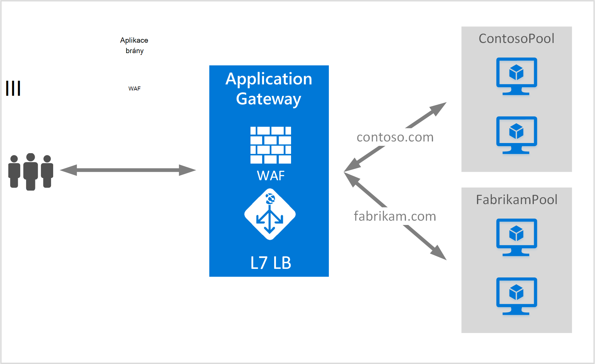

<properties
   pageTitle="Vytvoření brány aplikací pro publikování na více webech | Microsoft Azure"
   description="Tato stránka obsahuje pokyny k vytváření, nakonfigurujte bránu Azure aplikací pro publikování na více webových aplikací ve stejné bráně."
   documentationCenter="na"
   services="application-gateway"
   authors="amsriva"
   manager="rossort"
   editor="amsriva"/>
<tags
   ms.service="application-gateway"
   ms.devlang="na"
   ms.topic="article"
   ms.tgt_pltfrm="na"
   ms.workload="infrastructure-services"
   ms.date="10/25/2016"
   ms.author="amsriva"/>

# Vytvoření brány aplikací pro publikování na více webových aplikací

> [AZURE.SELECTOR]
- [Azure portálu](application-gateway-create-multisite-portal.md)
- [Azure prostředí PowerShell správce prostředků](application-gateway-create-multisite-azureresourcemanager-powershell.md)

Více hostování webů umožňuje nasazení více než jeden web aplikace ve stejné bráně aplikace. Závisí na přítomnosti záhlaví hostitele v pozvánce na schůzku příchozí HTTP, a zjistit, jaký posluchače dostal přenosy. Posluchače potom směrovat tak, aby umožnění datových přenosů do příslušné back-end fondu nakonfigurovaná v definici pravidla brány. Ve webových aplikacích SSL povolené aplikace brány závisí na koncovku označení název serveru (SNI) zvolit správný posluchače přenosů web. Společné použití pro více hostingu webu je načtení zůstatek žádosti o různých webových domén do různých serveru back-end fondů. Podobně víc subdomén stejné kořenovou doménu mohou být umístěny ve stejné bráně aplikace.

## Scénář

V následujícím příkladu aplikace brány slouží návštěvníci contoso.com a fabrikam.com s dvěma fondů serveru back-end: contoso serveru fondu a fondu fabrikam serveru. Podobně jako nastavení může hostitele subdomény jako app.contoso.com a blog.contoso.com.

## Než začnete

1. Nainstalujte nejnovější verzi rutiny prostředí PowerShell Azure pomocí webové platformy. Můžete stáhnout a nainstalovat nejnovější verzi z části **Prostředí Windows PowerShell** [ke stažení stránky](https://azure.microsoft.com/downloads/).
2. Servery přidané do fondu back-end použití aplikace brány musí existovat nebo jejich koncové body vytvořili buď v virtuální sítě samostatné podsítě nebo s veřejnou IP/VIP přiřazené.

## Požadavky

- **Back-end serveru fondu:** Seznam IP adres servery back-end. IP adresy uvedené by měl buď patří do podsítě virtuální sítě nebo by měl být veřejnou IP/VIP. Plně kvalifikovaný název domény můžete taky použít.
- **Nastavení fondu back-end serveru:** Každý fondu má nastavení například port Protocol (protokol) a na základě souborů cookie spřažení. Toto nastavení je stejným do fondu a zaevidují do všech serverů v rámci fondu.
- **Front-end portu:** Toto je veřejné port, který je otevřen v bráně aplikace. Přenosy narazí tento port a potom přesměrována k některému z back-end serverů.
- **Posluchače:** Posluchače má front-end port protokol (Http nebo Https tyto hodnoty jsou malá a velká písmena) a název certifikátu SSL (Pokud konfigurace SSL převzít). Aplikace více webů s povolenou bran název hostitele a indikátory SNI taky přidají.
- **Pravidlo:** Pravidlo váže posluchače fondu serveru back-end a definuje které serveru back-end fondu přenos budou přesměrovány při narazí konkrétní posluchače.

## Vytvoření brány pro aplikace

Následují kroky potřebné k vytvoření brány aplikace:

1. Umožňuje vytvořte skupinu zdroje pro správce prostředků.
2. Vytvořte virtuální sítě, podsítí a veřejnou IP brány aplikace.
3. Vytvoření objektu konfigurace brány aplikace.
4. Vytvoření brány prostředek aplikace.

## Vytvoření skupiny zdroje pro správce prostředků

Ujistěte se, že používáte nejnovější verzi Azure Powershellu. Další informace najdete na [Pomocí Windows Powershellu pomocí Správce prostředků](../powershell-azure-resource-manager.md).

### Krok 1

Přihlaste se k Azure

    Login-AzureRmAccount

Zobrazí se výzva k ověření pomocí svých přihlašovacích údajů.

### Krok 2

Zaškrtněte políčko předplatná pro účet.

    Get-AzureRmSubscription

### Krok 3

Zvolte, které předplatné Azure používat.

    Select-AzureRmSubscription -SubscriptionName "Name of subscription"

### Krok 4

Vytvoření skupina zdroje (Přeskočit tento krok při použití existující skupiny zdrojů).

    New-AzureRmResourceGroup -Name appgw-RG -location "West US"

Můžete taky můžete také vytvořit značky pro skupinu zdrojů aplikace bránu pro:

    $resourceGroup = New-AzureRmResourceGroup -Name appgw-RG -Location "West US" -Tags @{Name = "testtag"; Value = "Application Gateway multiple site"}

Azure správce prostředků vyžaduje, aby všechny skupiny prostředků zadejte umístění. Toto umístění slouží jako výchozí umístění pro zdroje v dané skupině zdroje. Ujistěte se, že všechny příkazy k vytvoření brány aplikační použít stejné skupiny prostředků.

Ve výše uvedeném příkladu jsme vytvořili zdroje skupiny nazvané "appgw-RG" umístění "Západní cz".

>[AZURE.NOTE] Pokud potřebujete konfigurovat vlastní zkušební aplikace brány, v tématu [Vytvoření brány aplikační s vlastní sond pomocí prostředí PowerShell](application-gateway-create-probe-ps.md). Přejděte na [vlastní sond a sledování stavu](application-gateway-probe-overview.md) Další informace.

## Vytváření virtuálních sítí a podsítí

Následující příklad ukazuje, jak vytvořit virtuální síť pomocí Správce prostředků. Dva podsítí vzniká v tomto kroku. První podsítě je aplikace brány samotné. Aplikace brány vyžaduje vlastní podsítě podržte její instance. Pouze jiné aplikace brány můžete nasazenou v této podsítě. Druhá podsítě se používá k ukládání aplikačních back-end serverů.

### Krok 1

Přiřaďte 10.0.0.0/24 oblast adresu proměnnou podsítě se nemusí používat k ukládání brány aplikace.

    $subnet = New-AzureRmVirtualNetworkSubnetConfig -Name appgatewaysubnet -AddressPrefix 10.0.0.0/24

### Krok 2

Přiřaďte 10.0.1.0/24 oblast adresu proměnnou Podsíť2 pro fondy back-end.

    $subnet2 = New-AzureRmVirtualNetworkSubnetConfig -Name backendsubnet -AddressPrefix 10.0.1.0/24

### Krok 3

Vytvořit virtuální sítě s názvem "appgwvnet" v zdrojů skupina "appgw-rg" pro oblastí Západ USA pomocí 10.0.0.0/16 předponu s podsítě 10.0.0.0/24 a 10.0.1.0/24.

    $vnet = New-AzureRmVirtualNetwork -Name appgwvnet -ResourceGroupName appgw-RG -Location "West US" -AddressPrefix 10.0.0.0/16 -Subnet $subnet,$subnet2

### Krok 4

Přiřazení podsítě proměnné pro další kroky, které vytvoří brány aplikační.

    $appgatewaysubnet = Get-AzureRmVirtualNetworkSubnetConfig -Name appgatewaysubnet -VirtualNetwork $vnet
    $backendsubnet = Get-AzureRmVirtualNetworkSubnetConfig -Name backendsubnet -VirtualNetwork $vnet

## Vytvořit veřejnou IP adresu front-end konfigurace

Vytvoření veřejného zdroje IP "publicIP01" v zdrojů skupina "appgw-rg" pro oblastí Západ USA.

    $publicip = New-AzureRmPublicIpAddress -ResourceGroupName appgw-RG -name publicIP01 -location "West US" -AllocationMethod Dynamic

IP adresy se přiřadí k bráně aplikace při spuštění služby.

## Vytvoření brány konfigurace aplikace

Všechny položky konfigurace musíte nastavit před vytvořením aplikace brány. Podle těchto kroků vytvořit konfigurační položky, které jsou potřebné pro zdroj brány aplikace.

### Krok 1

Vytvoření konfigurace IP brány aplikace s názvem "gatewayIP01". Po spuštění aplikace brány vyzvedne IP adresu z podsítě nakonfigurované a sítě provoz směrovat na IP adresy IP fondu back-end. Mějte na paměti, že pokaždé trvá IP adres.

    $gipconfig = New-AzureRmApplicationGatewayIPConfiguration -Name gatewayIP01 -Subnet $appgatewaysubnet

### Krok 2

Konfigurace fondu back-end IP adres s názvem "pool01" a "pool2" k IP adresám "10.0.1.100, 10.0.1.101,10.0.1.102" "pool1" a "10.0.1.103 10.0.1.104, 10.0.1.105" k "pool2".

    $pool1 = New-AzureRmApplicationGatewayBackendAddressPool -Name pool01 -BackendIPAddresses 10.0.1.100, 10.0.1.101, 10.0.1.102
    $pool2 = New-AzureRmApplicationGatewayBackendAddressPool -Name pool02 -BackendIPAddresses 10.0.1.103, 10.0.1.104, 10.0.1.105

V tomto příkladu jsou dvě fondů back-end chcete směrovat přenosy v síti na požadovaný web. Jeden fond přijímá přenosy z webu "contoso.com" a další fond přijímá přenosy z webu "fabrikam.com". Budete muset nahradit předchozí IP adresy přidat vlastní koncové body aplikace IP adres. Místo vnitřní IP adresy může taky pomocí veřejné adresy IP, plně kvalifikovaný název domény nebo NIC OM instancí back-end. Použití "-BackendFQDNs" parametrů v prostředí PowerShell můžete určit certifikátu místo IP adresy.

### Krok 3

Konfigurace nastavení brány aplikace "poolsetting01" a "poolsetting02" pro vyrovnávání zatížení sítě přenosy ve fondu back-end. V tomto příkladu je nastavení různých back-end fondu fondů back-end. Každý back-end fond může mít vlastní nastavení back-end fondu.

    $poolSetting01 = New-AzureRmApplicationGatewayBackendHttpSettings -Name "besetting01" -Port 80 -Protocol Http -CookieBasedAffinity Disabled -RequestTimeout 120
    $poolSetting02 = New-AzureRmApplicationGatewayBackendHttpSettings -Name "besetting02" -Port 80 -Protocol Http -CookieBasedAffinity Enabled -RequestTimeout 240

### Krok 4

Nakonfigurujte front-end IP koncovém veřejné.

    $fipconfig01 = New-AzureRmApplicationGatewayFrontendIPConfig -Name "frontend1" -PublicIPAddress $publicip

### Krok 5

Konfigurace front-end portů brány aplikace.

    $fp01 = New-AzureRmApplicationGatewayFrontendPort -Name "fep01" -Port 443

### Krok 6

Konfigurace dvou certifikáty SSL dva weby, že bude podporovat v tomto příkladu. Jeden certifikát pro přenos contoso.com a druhý pro přenos fabrikam.com. Tato poukázky by měl být certifikační autorita certifikáty pro vaše weby. Podepsaný certifikáty jsou podporované, ale nedoporučuje přenosů výroby.

    $cert01 = New-AzureRmApplicationGatewaySslCertificate -Name contosocert -CertificateFile <file path> -Password <password>
    $cert02 = New-AzureRmApplicationGatewaySslCertificate -Name fabrikamcert -CertificateFile <file path> -Password <password>

### Krok 7

Konfigurace dva posluchače dvou webů v tomto příkladu. Tento krok nakonfiguruje posluchače pro veřejné IP adresu port a Host (hostitel) slouží k přijímání příchozích. HostName parametr je nutný pro podporu víc webů a nastavte příslušný web jehož přenos dostali. Parametr RequireServerNameIndication je třeba nastavit na hodnotu true pro weby, které potřebujete podporu pro SSL ve scénáři více Host (hostitel). Pokud Podpora SSL je potřeba, bude potřeba zadat certifikát SSL, který se používá k zabezpečení návštěvníci této webové aplikace. Kombinace FrontendIPConfiguration FrontendPort a HostName musí být jedinečné pro posluchače. Každý posluchače podporují certifikátů.

    $listener01 = New-AzureRmApplicationGatewayHttpListener -Name "listener01" -Protocol Https -FrontendIPConfiguration $fipconfig01 -FrontendPort $fp01 -HostName "contoso11.com" -RequireServerNameIndication true  -SslCertificate $cert01
    $listener02 = New-AzureRmApplicationGatewayHttpListener -Name "listener02" -Protocol Https -FrontendIPConfiguration $fipconfig01 -FrontendPort $fp01 -HostName "fabrikam11.com" -RequireServerNameIndication true -SslCertificate $cert02

### Krok 8

Vytvořte dvě nastavení pravidla pro dva webové aplikace v tomto příkladu. Pravidlo spojuje společně posluchače, fondů back-end a nastavení protokolu http. Tento krok nakonfiguruje brána aplikace používat základní směrování pravidlo pro každý web. Umožnění datových přenosů do každého webu je dostali nakonfigurované posluchače ale pak přesměrován do jeho fondu nakonfigurované back-end pomocí vlastností podle BackendHttpSettings.

    $rule01 = New-AzureRmApplicationGatewayRequestRoutingRule -Name "rule01" -RuleType Basic -HttpListener $listener01 -BackendHttpSettings $poolSetting01 -BackendAddressPool $pool1
    $rule02 = New-AzureRmApplicationGatewayRequestRoutingRule -Name "rule02" -RuleType Basic -HttpListener $listener02 -BackendHttpSettings $poolSetting02 -BackendAddressPool $pool2

### Krok 9

Konfigurace počet instance a velikost brány aplikace.

    $sku = New-AzureRmApplicationGatewaySku -Name "Standard_Medium" -Tier Standard -Capacity 2

## Vytvoření brány pro aplikace

Vytvoření brány aplikační u všech objektů konfigurace z předchozích kroků.

    $appgw = New-AzureRmApplicationGateway -Name appgwtest -ResourceGroupName appgw-RG -Location "West US" -BackendAddressPools $pool1,$pool2 -BackendHttpSettingsCollection $poolSetting01, $poolSetting02 -FrontendIpConfigurations $fipconfig01 -GatewayIpConfigurations $gipconfig -FrontendPorts $fp01 -HttpListeners $listener01, $listener02 -RequestRoutingRules $rule01, $rule02 -Sku $sku -SslCertificates $cert01, $cert02

>[AZURE.IMPORTANT] Zřízení brány aplikace je dlouhodobé operace a může chvíli trvat dokončete.

## Získání aplikace brány DNS jména

Po vytvoření brány dalším krokem je třeba nakonfigurovat front-end pro komunikaci. Při použití veřejnou IP vyžaduje aplikaci brány dynamicky přiřazené názvu DNS, které není vhodné. Zajistěte, aby koncoví uživatelé mohli přístupů brány aplikace záznam CNAME lze tak, aby ukazovaly na veřejné koncový bod brány aplikace. [Konfigurace vlastního názvu domény pro v Azure](../cloud-services/cloud-services-custom-domain-name-portal.md). K tomuto účelu načítejte podrobnosti o bráně aplikace a názvu přidružené IP/DNS pomocí elementu PublicIPAddress připojena k bráně aplikace. Název brány aplikace DNS bude použito k vytvoření záznamu CNAME, který odkazuje dvou webových aplikací pro tento název DNS. Použití záznamy o se nedoporučuje, protože VIP může změnit po restartování aplikace brány.
    
    Get-AzureRmPublicIpAddress -ResourceGroupName appgw-RG -Name publicIP01
        
    Name                     : publicIP01
    ResourceGroupName        : appgw-RG
    Location                 : westus
    Id                       : /subscriptions/<subscription_id>/resourceGroups/appgw-RG/providers/Microsoft.Network/publicIPAddresses/publicIP01
    Etag                     : W/"00000d5b-54ed-4907-bae8-99bd5766d0e5"
    ResourceGuid             : 00000000-0000-0000-0000-000000000000
    ProvisioningState        : Succeeded
    Tags                     : 
    PublicIpAllocationMethod : Dynamic
    IpAddress                : xx.xx.xxx.xx
    PublicIpAddressVersion   : IPv4
    IdleTimeoutInMinutes     : 4
    IpConfiguration          : {
                                 "Id": "/subscriptions/<subscription_id>/resourceGroups/appgw-RG/providers/Microsoft.Network/applicationGateways/appgwtest/frontendIP
                               Configurations/frontend1"
                               }
    DnsSettings              : {
                                 "Fqdn": "00000000-0000-xxxx-xxxx-xxxxxxxxxxxx.cloudapp.net"
                               }

## Další kroky

Zjistěte, jak chránit vaše weby s [Aplikací brány - webové aplikace Firewall](application-gateway-webapplicationfirewall-overview.md)