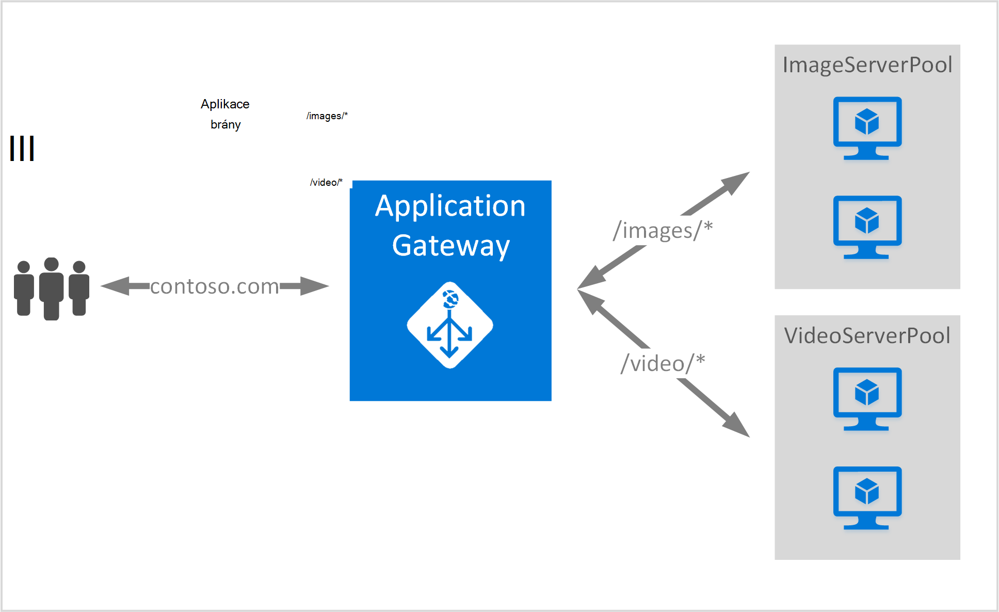

<properties
   pageTitle="Vytvoření aplikace brány pomocí pravidel pro směrování adres URL | Microsoft Azure"
   description="Tato stránka obsahuje pokyny k vytvoření, konfigurace brány Azure aplikační pomocí pravidel pro směrování adres URL"
   documentationCenter="na"
   services="application-gateway"
   authors="georgewallace"
   manager="jdial"
   editor="tysonn"/>
<tags
   ms.service="application-gateway"
   ms.devlang="na"
   ms.topic="article"
   ms.tgt_pltfrm="na"
   ms.workload="infrastructure-services"
   ms.date="10/25/2016"
   ms.author="gwallace"/>

# Vytvoření brány aplikační použití směrování na základě cesta 

> [AZURE.SELECTOR]
- [Azure portálu](application-gateway-create-url-route-portal.md)
- [Azure prostředí PowerShell správce prostředků](application-gateway-create-url-route-arm-ps.md)

Na základě cestu směrování adres URL umožňuje spojit postupy založené na adresu URL žádost Http. Zkontroluje, zda je směrování do back-end fondu nakonfigurován pro seznamy adresa URL aplikace brány a odešlete provozu v síti do fondu definovaný back-end. Společné použití aplikace založené na adrese URL směrování je načtení zůstatek žádosti o různých typů obsahu k jiné serveru back-end fondů.

Nový typ pravidla ho bráně aplikace založené na adrese URL směrování představuje. Aplikace brány má dva typy pravidel: základní a PathBasedRouting. Základní pravidla typ poskytuje kruhového služby pro fondy back-end při PathBasedRouting kromě kruhového rozdělení, taky, která bude cesta vzor požadavku na adresu URL v úvahu při výběru fondu back-end.

>[AZURE.IMPORTANT] PathPattern: Seznam cestu vzorků podle. Každý musí začínat / a pouze blokování "\*" smí je na konci. Platné příklady /xyz /xyz* nebo /xyz/*. Řetězec naplnění objekt přiřazení vzorce cesta neobsahuje žádný text po prvním "?" nebo "#" a tyto znaky nejsou povolené. 

## Scénář
V následujícím příkladu aplikace brány slouží návštěvníci contoso.com s dvěma fondů serveru back-end: videa serveru fondu a fondu serveru obrázek.

Požadavky na* směrovány do fondu serveru obrázek (pool1) a http://contoso.com/video* http://contoso.com/image jsou směrovány do fondu videa serveru (pool2). Výchozí fond serveru (pool1) zaškrtnuté, pokud žádná vzorků cesta odpovídá.

## Než začnete

1. Nainstalujte nejnovější verzi rutiny prostředí PowerShell Azure pomocí webové platformy. Můžete stáhnout a nainstalovat nejnovější verzi z části **Prostředí Windows PowerShell** [ke stažení stránky](https://azure.microsoft.com/downloads/).
2. Vytvořit virtuální sítě a podsítě aplikace brány. Ujistěte se, že bez cloudu nasazení nebo virtuálních počítačích jsou podsítě. Aplikace brány musí být osamoceně v podsítě virtuální sítě.
3. Servery přidané do fondu back-end použití aplikace brány musí existovat nebo jejich koncové body vytvořili virtuální sítě nebo s veřejnou IP/VIP přiřazené.

## Co je nutné k vytvoření brány aplikační?

- **Back-end serveru fondu:** Seznam IP adres servery back-end. IP adresy uvedené by měl buď patří do podsítě virtuální sítě nebo by měl být veřejnou IP/VIP.
- **Nastavení fondu back-end serveru:** Každý fondu má nastavení například port Protocol (protokol) a na základě souborů cookie spřažení. Toto nastavení je stejným do fondu a zaevidují do všech serverů v rámci fondu.
- **Front-end portu:** Toto je veřejné port, který je otevřen v bráně aplikace. Přenosy narazí tento port a potom přesměrována k některému z back-end serverů.
- **Posluchače:** Posluchače má front-end port protokol (Http nebo Https Toto jsou malá a velká písmena) a název certifikátu SSL (Pokud konfigurace SSL převzít).
- **Pravidlo:** Pravidlo váže posluchače fondu serveru back-end a definuje které serveru back-end fondu přenos budou přesměrovány při narazí konkrétní posluchače.

## Vytvoření brány pro aplikace

Rozdíl mezi používáním Azure klasické a správce prostředků Azure je pořadí, ve kterém vytvoříte aplikace brány a položky, které třeba nakonfigurovat.

Pomocí Správce prostředků všechny položky, které usnadňují brány aplikační jsou nakonfigurované jednotlivě a vložte můžete vytvořit prostředku brány aplikace.

Tady je postup, které jsou potřeba k vytvoření brány aplikace:

1. Umožňuje vytvořte skupinu zdroje pro správce prostředků.
2. Vytvořte virtuální sítě, podsítě a veřejnou IP brány aplikace.
3. Vytvoření objektu konfigurace brány aplikace.
4. Vytvoření brány prostředek aplikace.

## Vytvoření skupiny zdroje pro správce prostředků

Ujistěte se, že používáte nejnovější verzi Azure Powershellu. Další informace najdete na [Pomocí Windows Powershellu pomocí Správce prostředků](../powershell-azure-resource-manager.md).

### Krok 1

Přihlaste se k Azure

    Login-AzureRmAccount

Zobrazí se výzva k ověření pomocí svých přihlašovacích údajů. 

### Krok 2

Zaškrtněte políčko předplatná pro účet.

    Get-AzureRmSubscription

### Krok 3

Zvolte, které předplatné Azure používat.  

    Select-AzureRmSubscription -Subscriptionid "GUID of subscription"

### Krok 4

Vytvoření skupina zdroje (Přeskočit tento krok při použití existující skupiny zdrojů).

    New-AzureRmResourceGroup -Name appgw-RG -Location "West US"

Můžete taky můžete také vytvořit značky pro skupinu zdrojů aplikace bránu pro:
    
    $resourceGroup = New-AzureRmResourceGroup -Name appgw-RG -Location "West US" -Tags @{Name = "testtag"; Value = "Application Gateway URL routing"} 

Azure správce prostředků vyžaduje, aby všechny skupiny prostředků zadejte umístění. Se používá jako výchozí umístění pro zdroje v dané skupině zdroje. Ujistěte se, že všechny příkazy k vytvoření brány aplikační použít stejné skupiny prostředků.

Ve výše uvedeném příkladu jsme vytvořili zdroje skupiny nazvané "appgw RG" a "Západní nám" umístění.

>[AZURE.NOTE] Pokud potřebujete konfigurovat vlastní zkušební aplikace brány, v tématu [Vytvoření brány aplikační s vlastní sond pomocí prostředí PowerShell](application-gateway-create-probe-ps.md). Podívejte se na [vlastní sond a sledování stavu](application-gateway-probe-overview.md) Další informace.

## Vytvořit virtuální sítě a podsítě brány aplikace

Následující příklad ukazuje, jak vytvořit virtuální síť pomocí Správce prostředků.

### Krok 1

Přiřaďte 10.0.0.0/24 oblast adresu podsítě proměnnou použít k vytvoření virtuální sítě.

    $subnet = New-AzureRmVirtualNetworkSubnetConfig -Name subnet01 -AddressPrefix 10.0.0.0/24

### Krok 2

Vytvořte virtuální síť s názvem "appgwvnet" v zdrojů skupina "appgw-rg" pro oblastí Západ USA pomocí 10.0.0.0/16 předponu s podsítě 10.0.0.0/24.

    $vnet = New-AzureRmVirtualNetwork -Name appgwvnet -ResourceGroupName appgw-RG -Location "West US" -AddressPrefix 10.0.0.0/16 -Subnet $subnet

### Krok 3

Přiřazení podsítě proměnné pro další kroky, které vytvoří brány aplikace.

    $subnet=$vnet.Subnets[0]

## Vytvořit veřejnou IP adresu front-end konfigurace

Vytvoření veřejného zdroje IP "publicIP01" v zdrojů skupina "appgw-rg" pro oblastí Západ USA.

    $publicip = New-AzureRmPublicIpAddress -ResourceGroupName appgw-RG -name publicIP01 -location "West US" -AllocationMethod Dynamic

IP adresy se přiřadí k bráně aplikace při spuštění služby.

## Vytvoření brány konfigurace aplikace

Všechny položky konfigurace musíte nastavit před vytvořením aplikace brány. Podle těchto kroků vytvořit konfigurační položky, které jsou potřebné pro zdroj brány aplikace.

### Krok 1

Vytvoření konfigurace IP brány aplikace s názvem "gatewayIP01". Po spuštění aplikace brány vyzvedne IP adresu z podsítě nakonfigurované a sítě provoz směrovat na IP adresy IP fondu back-end. Mějte na paměti, že pokaždé trvá IP adres.

    $gipconfig = New-AzureRmApplicationGatewayIPConfiguration -Name gatewayIP01 -Subnet $subnet

### Krok 2

Konfigurace fondu back-end IP adres s názvem "pool01" a "pool2" k IP adresám "134.170.185.46, 134.170.188.221,134.170.185.50" k "pool1" a "134.170.186.46, 134.170.189.221,134.170.186.50" k "pool2".

    $pool1 = New-AzureRmApplicationGatewayBackendAddressPool -Name pool01 -BackendIPAddresses 134.170.185.46, 134.170.188.221,134.170.185.50

    $pool2 = New-AzureRmApplicationGatewayBackendAddressPool -Name pool02 -BackendIPAddresses 134.170.186.46, 134.170.189.221,134.170.186.50

V tomto příkladu jsou dvě fondů back-end chcete směrovat přenosy v síti na adresa URL. Jeden fond přijímá přenosy z cesta URL "/ video" a další fond přijímat přenosy z cestu "/ obrázek". Nahraďte předchozí IP adresy přidat vlastní koncové body aplikace IP adres. 

### Krok 3

Konfigurace nastavení brány aplikace "poolsetting01" a "poolsetting02" pro vyrovnávání zatížení sítě přenosy ve fondu back-end. V tomto příkladu je nastavení různých back-end fondu fondů back-end. Každý back-end fond může mít vlastní nastavení back-end fondu.

    $poolSetting01 = New-AzureRmApplicationGatewayBackendHttpSettings -Name "besetting01" -Port 80 -Protocol Http -CookieBasedAffinity Disabled -RequestTimeout 120

    $poolSetting02 = New-AzureRmApplicationGatewayBackendHttpSettings -Name "besetting02" -Port 80 -Protocol Http -CookieBasedAffinity Enabled -RequestTimeout 240

### Krok 4

Nakonfigurujte front-end IP koncovém veřejné.

    $fipconfig01 = New-AzureRmApplicationGatewayFrontendIPConfig -Name "frontend1" -PublicIPAddress $publicip

### Krok 5 

Konfigurace front-end portů brány aplikace.

    $fp01 = New-AzureRmApplicationGatewayFrontendPort -Name "fep01" -Port 80
### Krok 6

Konfigurace posluchače. Tento krok nakonfiguruje posluchače pro veřejnou IP adresu a port sloužící k přijímat příchozí v síti. 
 
    $listener = New-AzureRmApplicationGatewayHttpListener -Name "listener01" -Protocol Http -FrontendIPConfiguration $fipconfig01 -FrontendPort $fp01

### Krok 7 

Konfigurace cesty pravidlo adresy URL pro fondy back-end. Tento krok nakonfiguruje relativní cestu použije aplikace brána mapování mezi cesta URL a které back-end fondu přiřazena zpracovávání příchozích přenosů.

Následující příklad vytvoří dvě pravidla: jedno pro "/ obrázek /" cestu směrování umožnění datových přenosů do back-end "pool1" a "/ video /" cestu směrování přenosů do back-end "pool2" nějaký jiný.
    
    $imagePathRule = New-AzureRmApplicationGatewayPathRuleConfig -Name "pathrule1" -Paths "/image/*" -BackendAddressPool $pool1 -BackendHttpSettings $poolSetting01

    $videoPathRule = New-AzureRmApplicationGatewayPathRuleConfig -Name "pathrule2" -Paths "/video/*" -BackendAddressPool $pool2 -BackendHttpSettings $poolSetting02

Konfigurace mapování cestu pravidla také nakonfiguruje výchozí adresu back-end fond Pokud cestu neshoduje s žádnou z předdefinovaných cestu pravidel. 

    $urlPathMap = New-AzureRmApplicationGatewayUrlPathMapConfig -Name "urlpathmap" -PathRules $videoPathRule, $imagePathRule -DefaultBackendAddressPool $pool1 -DefaultBackendHttpSettings $poolSetting02

### Krok 8

Vytvořte pravidlo nastavení. Tento krok nakonfiguruje brána aplikaci používat na základě cestu směrování adres URL.

    $rule01 = New-AzureRmApplicationGatewayRequestRoutingRule -Name "rule1" -RuleType PathBasedRouting -HttpListener $listener -UrlPathMap $urlPathMap

### Krok 9

Konfigurace počet instance a velikost brány aplikace.

    $sku = New-AzureRmApplicationGatewaySku -Name "Standard_Small" -Tier Standard -Capacity 2

## Vytvoření brány pro aplikace

Vytvoření brány aplikační u všech objektů konfigurace z předchozích kroků.

    $appgw = New-AzureRmApplicationGateway -Name appgwtest -ResourceGroupName appgw-RG -Location "West US" -BackendAddressPools $pool1,$pool2 -BackendHttpSettingsCollection $poolSetting01, $poolSetting02 -FrontendIpConfigurations $fipconfig01 -GatewayIpConfigurations $gipconfig -FrontendPorts $fp01 -HttpListeners $listener -UrlPathMaps $urlPathMap -RequestRoutingRules $rule01 -Sku $sku

## Získání aplikace brány DNS jména

Po vytvoření brány dalším krokem je třeba nakonfigurovat front-end pro komunikaci. Při použití veřejnou IP vyžaduje aplikaci brány dynamicky přiřazené názvu DNS, které není vhodné. Zajistěte, aby koncoví uživatelé mohli přístupů brány aplikace záznam CNAME lze tak, aby ukazovaly na veřejné koncový bod brány aplikace. [Konfigurace vlastního názvu domény pro v Azure](../cloud-services/cloud-services-custom-domain-name-portal.md). K tomuto účelu načítejte podrobnosti o bráně aplikace a názvu přidružené IP/DNS pomocí PublicIPAddress prvek připojen k bráně aplikace. Název brány aplikace DNS bude použito k vytvoření záznamu CNAME, který odkazuje dvou webových aplikací pro tento název DNS. Použití záznamy o se nedoporučuje, protože VIP může změnit po restartování aplikace brány.
    
    Get-AzureRmPublicIpAddress -ResourceGroupName appgw-RG -Name publicIP01
        
    Name                     : publicIP01
    ResourceGroupName        : appgw-RG
    Location                 : westus
    Id                       : /subscriptions/<subscription_id>/resourceGroups/appgw-RG/providers/Microsoft.Network/publicIPAddresses/publicIP01
    Etag                     : W/"00000d5b-54ed-4907-bae8-99bd5766d0e5"
    ResourceGuid             : 00000000-0000-0000-0000-000000000000
    ProvisioningState        : Succeeded
    Tags                     : 
    PublicIpAllocationMethod : Dynamic
    IpAddress                : xx.xx.xxx.xx
    PublicIpAddressVersion   : IPv4
    IdleTimeoutInMinutes     : 4
    IpConfiguration          : {
                                 "Id": "/subscriptions/<subscription_id>/resourceGroups/appgw-RG/providers/Microsoft.Network/applicationGateways/appgwtest/frontendIP
                               Configurations/frontend1"
                               }
    DnsSettings              : {
                                 "Fqdn": "00000000-0000-xxxx-xxxx-xxxxxxxxxxxx.cloudapp.net"
                               }

## Další kroky

Pokud chcete získat převedení Secure (Sockets Layer SSL), přečtěte si téma [Konfigurace brány aplikační pro SSL převzít](application-gateway-ssl-arm.md).