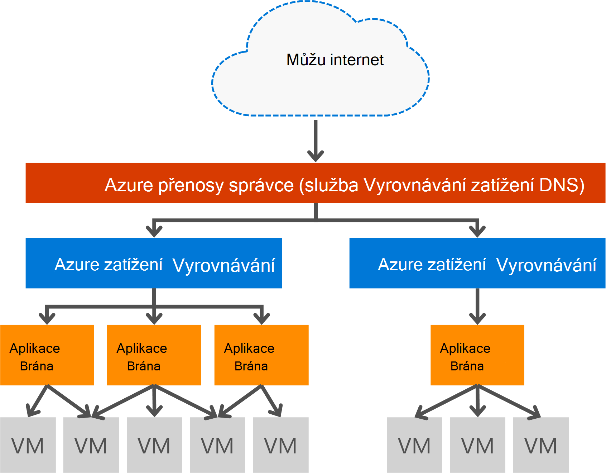

<properties
   pageTitle="Úvod k bráně aplikace | Microsoft Azure"
   description="Na této stránce najdete základní informace o službě aplikace brány vrstvy 7 Vyrovnávání zatížení, včetně velikostí brány, HTTP načíst vyrovnávání, na základě souborů cookie spřažení relace a převzít SSL."
   documentationCenter="na"
   services="application-gateway"
   authors="georgewallace"
   manager="carmonm"
   editor="tysonn"/>
<tags
   ms.service="application-gateway"
   ms.devlang="na"
   ms.topic="hero-article"
   ms.tgt_pltfrm="na"
   ms.workload="infrastructure-services"
   ms.date="10/25/2016"
   ms.author="gwallace"/>

# Přehled aplikací brány

## Co je aplikace brány

Microsoft Azure aplikace brány poskytuje aplikace doručení řadiče ADC jako služba, nabízí různé možnosti pro aplikaci pro vyrovnávání zatížení vrstvy 7. Umožňuje zákazníci optimalizovat web produktivity přesměrováním procesoru náročné SSL ukončení ho bráně aplikace. Také poskytuje další směrování možnosti vrstvy 7 včetně kruhového výskyt příchozích, souborů cookie založeny affinity relace, adresu URL na základě směrování a možnost hostovat více webů za jeden brány aplikace. Aplikace brány má i firewall webové aplikace (WAF), která chrání aplikace proti většina OWASP horní 10 běžné web chyby. Aplikační brána je možné konfigurovat jako vystaveného brány, vnitřní pouze brány nebo kombinaci obojího internet. Aplikace brána je plně Azure spravované, scalable a snadno dostupné. Poskytuje bohatou sadu funkcí diagnostických nástrojů a funkcí protokolování pro lepší možnosti správy. Aplikace brány spolupracuje virtuálních počítačích, cloudovými službami a interní a externí vystaveného webových aplikací.

Aplikace brána je vyhrazený virtuální zařízení aplikace a zahrnuje víc instancí pracovního pro škálovatelnost a dostupnost. Při vytváření brány aplikační koncového bodu (veřejné VIP nebo interní IP ILB) přidružené a použít k průniku v síti. Tento virtuální nebo ILB IP poskytuje služby Vyrovnávání zatížení Azure práce na úrovni transport (TCP/UDP) a na všechny příchozí v síti se rozloženy pracovníka instancí bran aplikace. Aplikace brány a trasy přenosy protokolu HTTP/HTTPS na základě jeho konfigurace ať už jde virtuálního počítače cloudové služby, vnitřní nebo externí IP adresu. Pro SLA a ceny, podívejte se na stránky [SLA](https://azure.microsoft.com/support/legal/sla/) a [ceny](https://azure.microsoft.com/pricing/details/application-gateway/) .

## Funkce

Brána pro aplikace v současné době podporuje vrstvy 7 aplikace doručení pomocí následujících funkcí:

- **[Brána Firewall webové aplikace (verze Preview)](application-gateway-webapplicationfirewall-overview.md)** – webové aplikace bránu firewall (WAF) v bráně aplikace Azure chrání před běžné web útoky jako vkládáním příkazu SQL, útoky skriptování webů a hijacks relace webových aplikací.
- **Vyrovnávání zatížení HTTP** - aplikace brány poskytuje Vyrovnávání zatížení kruhového. Vyrovnávání zatížení probíhá v 7 vrstvy a slouží k pouze přenosy protokolu HTTP (ne).
- **Na základě souborů cookie relace spřažení** – tato funkce je užitečná, když chcete zachovat relaci uživatele na stejné back-end. Pomocí soubory cookie brány spravovat aplikace brána je moct následné směrovaly z relace uživatele do stejné back-end pro zpracování. Tato funkce je důležité v případě stavu relace uložení místně na serveru back-end pro relaci uživatele.
- **[Převzít secure (Sockets Layer SSL)](application-gateway-ssl-arm.md)** – tato funkce trvá nákladné úkolu dešifrování HTTPS přenosy vypnout webových serverů. Ukončení připojení SSL v bráně aplikace a přesměrování požadavek na serveru zrušením šifrované, webového serveru unburdened tak, že dešifrování.  Aplikace brány znovu šifruje odpověď před odesláním klientovi. Tato funkce je užitečný v případech, kdy je umístěn back-end ve stejné síti zabezpečené virtuální jako brány aplikace v Azure.
- **[Konce SSL](application-gateway-backend-ssl.md)** - brány aplikace podporuje šifrování konce provoz. Aplikace brány k tomu ukončení připojení SSL v bráně aplikace. Brána pak se týká pravidla směrování přenosu, znovu zašifrování paketu a předá paket odpovídající back-end podle pravidla směrování definované. Odpovědi z webového serveru, půjde stejné procesem zpět koncového uživatele.
- **[Založené na adrese URL směrování obsahu](application-gateway-url-route-overview.md)** : Tato funkce je k dispozici možnost použít jiné servery back-end pro jiný přenos. Přenosy se složkou na webový server nebo CDN může nasměrovaná různých back-end, snížení nepotřebné zatížení back-end, kterou nechcete vytisknout konkrétní obsah.
- **[Směrování více sítě](application-gateway-multi-site-overview.md)** – aplikace brány umožňuje sloučení až 20 weby v jedné aplikaci brány.
- **[Podpora Websocket](application-gateway-websocket.md)** - jiné skvělé funkce aplikace brány je nativní podpora Websocket.
- **[Sledování stavu](application-gateway-probe-overview.md)** - aplikace brány obsahuje výchozí stav sledování back-end zdrojů a vlastní sond ke sledování více konkrétních situacích.

## Výhody

Aplikace brána je užitečné pro:

- Aplikace, které vyžadují žádosti o stejné uživatelské/klientské relace k dosažení stejném počítači virtuální back-end. Příklady tyto aplikace by nákupní košík apps a webové poštovní servery.
- Aplikace, které chcete uvolnit webové serverové farmy shora ukončení SSL.
- Aplikací, jako je síť pro doručování obsahu, který vyžaduje více HTTP požadavků na stejné připojení pomocí protokolu TCP dlouho probíhajících na směrovány nebo načtení rovnováha jiné servery back-end.
- Aplikace, které podporují websocket přenosy
- Ochrana webových aplikací útoky běžné založené na webu, jako SQL vkládání útoky skriptování webů a hijacks relace.

Aplikace brány Vyrovnávání zatížení při služby Azure Správa přístupových práv umožňuje zřizování Vyrovnávání zatížení vrstvy 7 za vyrovnávání zatížení Azure software. Přenosy správce mohou sloužit k dokončení scénáře, jak je vidět na následujícím obrázku. Pokud správce přenosy poskytuje přesměrování a dostupnost, Vyrovnávání zatížení obsahuje v oblasti škálovatelnost a dostupnost, a aplikace brány Vyrovnávání zatížení křížového oblast vrstvy 7.

[AZURE.INCLUDE [load-balancer-compare-tm-ag-lb-include.md](../../includes/load-balancer-compare-tm-ag-lb-include.md)]

## Velikost brány a instance

Aplikační brána je aktuálně k dispozici v tři formáty: malý, střední a velikost velké. Malé instance velikosti jsou určeny pro vývoj a testování scénáře.

Jsou aktuálně dvou SKU brány aplikace: WAF a standardní.

Můžete vytvořit maximálně 50 aplikace brány na jedno předplatné a každou bránu aplikace může mít až 10 instance. Brána pro jednotlivé aplikace mohou být tvořeny 20 http posluchače. Úplný seznam omezení brány aplikací naleznete na stránce [Služby omezení](../azure-subscription-service-limits.md#application-gateway) .

Následující tabulka zobrazuje průměrný výkon výkon pro každou brány instanci aplikace:

| Odpovědi back-end stránky | Small | Střední | Velká|
|---|---|---|---|
| 6K | 7.5 MB / | 13 MB / | 50 MB / |
|100 KB | 35 MB / | 100 MB /| 200 MB / |

>[AZURE.NOTE] Tyto hodnoty jsou přibližnou pro výkon brány aplikace. Skutečné výkon závisí na různých prostředí podrobnosti, například velikosti průměr stránky umístění instancí back-end a zpracovávání času a bude předávat na stránku. Přesné výkonu čísla by měla běžet vlastní testy, tyto hodnoty jsou k dispozici pouze pro plánování pokyny kapacity.

## Sledování stavu

Azure brány aplikace automaticky sleduje instancí back-end prostřednictvím basic nebo sond vlastní stavu. Pomocí stavu sond zajistíte pouze správný hosts odpovídat přenosy. Další informace najdete v tématu [Přehled sledování stavu aplikace brány](application-gateway-probe-overview.md).

## Konfigurace a správy

Jejího koncového bodu aplikace brány pokud mohou být IP veřejné nebo soukromé IP je nakonfigurované. Aplikace bránu uvnitř virtuální sítě v samostatném podsítě. Pouze prostředky, které jsou povoleny v podsítě jsou jiné aplikace brány, podsítě vytvořené nebo při použití aplikace brány nesmí obsahovat všechny ostatní typy zdrojů. K zabezpečení prostředků back-end back-end můžete servery obsažená v různých podsítě ve stejné síti virtuální jako brány aplikace. Tato další adres podsítí, který se nemusí aplikací back-end, dokud aplikace brány zobrazíte ip adresu, aplikace brána je mohli dát ADC funkcí pro back-end servery.

Můžete vytvořit a spravovat aplikace brány pomocí rozhraní REST API, rutiny prostředí PowerShell, rozhraní příkazového řádku Azure nebo [Azure portálu](https://portal.azure.com/).

## Další kroky

Po získání informací o bráně aplikace, můžete [vytvořit brány aplikační](application-gateway-create-gateway-portal.md) nebo můžete [vytvořit brány aplikační převzít SSL](application-gateway-ssl-arm.md) na Vyrovnávání zatížení HTTPS připojení.

Naučte se vytvářet brány aplikační použití založené na adrese URL směrování obsahu, přejděte na [Vytvoření brány aplikační použití založené na adrese URL směrování](application-gateway-create-url-route-arm-ps.md) Další informace.

