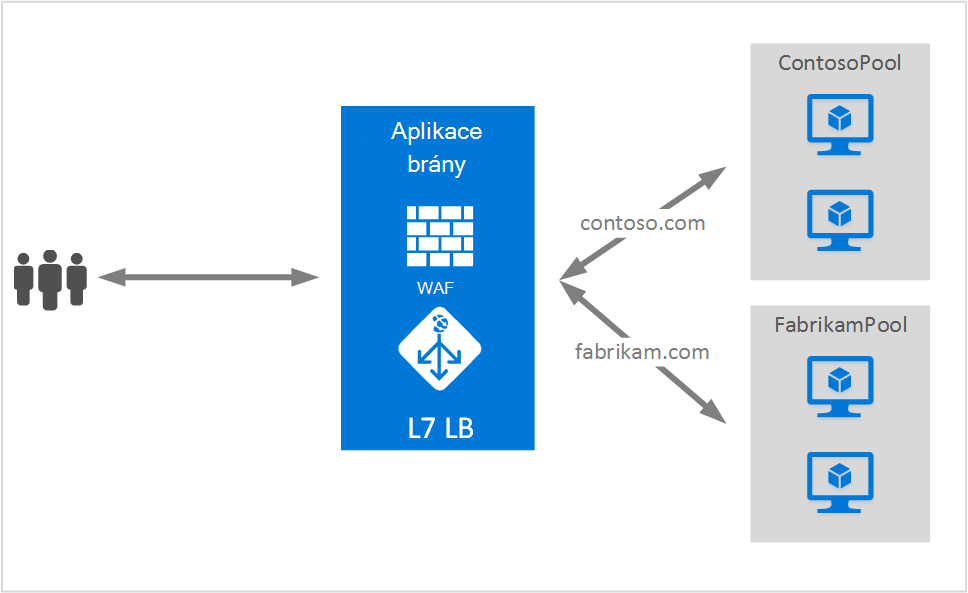

<properties
   pageTitle="Hostování více webů na brány aplikace | Microsoft Azure"
   description="Tato stránka obsahuje přehled podpory víc webů aplikace brány."
   documentationCenter="na"
   services="application-gateway"
   authors="amsriva"
   manager="rossort"
   editor="amsriva"/>
<tags
   ms.service="application-gateway"
   ms.devlang="na"
   ms.topic="hero-article"
   ms.tgt_pltfrm="na"
   ms.workload="infrastructure-services"
   ms.date="10/25/2016"
   ms.author="amsriva"/>

# Aplikace brány více hostingu webu

Více hostingu webu umožňují konfigurovat více než jednu webovou aplikaci ve stejné instanci aplikace brány. Tato funkce umožňuje konfigurovat efektivnější topologii vaše nasazení přidáním až 20 weby do jedné aplikace brány. Každý web můžete přesměrováni na svůj vlastní fond back-end. V následujícím příkladu slouží aplikaci brány návštěvníci contoso.com a fabrikam.com ze dvou serveru back-end fondů s názvem ContosoServerPool a FabrikamServerPool.

Požadavky na http://contoso.com jsou směrovány ContosoServerPool a http://fabrikam.com jsou směrovány FabrikamServerPool.

Dva subdomény tu samou doménu nadřazené můžete podobně hostovaný ve stejné bráně nasazení aplikace. Příklady použití subdomény zahrnovat http://blog.contoso.com a http://app.contoso.com hostitelem nasazení brány jedné aplikace.

## Host (hostitel) záhlaví a název serveru označení (SNI)

Existují tři společné mechanismy pro povolení více hostingu webu na stejné infrastruktury.

1. Hostovat více webových aplikací každý na jedinečnou IP adresu.
2. Název hostitele použijte hostovat více webových aplikací na stejnou IP adresu.
3. Použití různých porty hostovat více webových aplikací na stejnou IP adresu.

Aktuálně brány aplikační získá jednu veřejnou IP adresu podle kterého čeká přenosy. Proto podporu více aplikací, oba objekty mají vlastní IP adresu, aktuálně nepodporuje. Aplikace brány podporuje hostingu více aplikací každý listening na různé porty, ale tento scénář vyžadují aplikací přijmout přenosy na nestandardní porty a často není požadovaná konfigurace. Aplikace brány závisí na HTTP 1.1 hostitele záhlaví hostovat více než jeden web na stejné veřejnou IP adresu a portu. Weby hostované ve bráně aplikace můžete taky převedení SSL podporu s příponou TLS označení název serveru (SNI). Tento scénář znamená, že farmy webové prohlížeče a back-end klienta musí podporovat protokolu HTTP/1.1 a rozšíření TLS podle RFC 6066.

## Konfigurace prvek posluchače

Existující HTTPListener konfigurační element je rozšířeného podporuje hostitele název serveru název označení prvků, které se používají aplikace brána provoz směrovat na příslušný back-end fondu. Následující příklad je fragment HttpListeners prvek ze souboru šablony.

    "httpListeners": [
                {
                    "name": "appGatewayHttpsListener1",
                    "properties": {
                        "FrontendIPConfiguration": {
                            "Id": "/subscriptions/<subid>/resourceGroups/<rgName>/providers/Microsoft.Network/applicationGateways/applicationGateway1/frontendIPConfigurations/DefaultFrontendPublicIP"
                        },
                        "FrontendPort": {
                            "Id": "/subscriptions/<subid>/resourceGroups/<rgName>/providers/Microsoft.Network/applicationGateways/applicationGateway1/frontendPorts/appGatewayFrontendPort443'"
                        },
                        "Protocol": "Https",
                        "SslCertificate": {
                            "Id": "/subscriptions/<subid>/resourceGroups/<rgName>/providers/Microsoft.Network/applicationGateways/applicationGateway1/sslCertificates/appGatewaySslCert1'"
                        },
                        "HostName": "contoso.com",
                        "RequireServerNameIndication": "true"
                    }
                },
                {
                    "name": "appGatewayHttpListener2",
                    "properties": {
                        "FrontendIPConfiguration": {
                            "Id": "/subscriptions/<subid>/resourceGroups/<rgName>/providers/Microsoft.Network/applicationGateways/applicationGateway1/frontendIPConfigurations/appGatewayFrontendIP'"
                        },
                        "FrontendPort": {
                            "Id": "/subscriptions/<subid>/resourceGroups/<rgName>/providers/Microsoft.Network/applicationGateways/applicationGateway1/frontendPorts/appGatewayFrontendPort80'"
                        },
                        "Protocol": "Http",
                        "HostName": "fabrikam.com",
                        "RequireServerNameIndication": "false"
                    }
                }
            ],

[Správce prostředků šablony pomocí několika hostingu webu](https://github.com/Azure/azure-quickstart-templates/blob/master/201-application-gateway-multihosting) můžou navštívit pro nasazení založené na šabloně konce.

## Pravidla směrování

Je stejně jako v pravidla směrování vyžaduje. Pravidla směrování "Basic" nadále zvolit tak, aby nevážou posluchače příslušný web odpovídající fondu adres back-end.

    "requestRoutingRules": [
    {
        "name": "<ruleName1>",
        "properties": {
            "RuleType": "Basic",
            "httpListener": {
                "id": "/subscriptions/<subid>/resourceGroups/<rgName>/providers/Microsoft.Network/applicationGateways/applicationGateway1/httpListeners/appGatewayHttpsListener1')]"
            },
            "backendAddressPool": {
                "id": "/subscriptions/<subid>/resourceGroups/<rgName>/providers/Microsoft.Network/applicationGateways/applicationGateway1/backendAddressPools/ContosoServerPool')]"
            },
            "backendHttpSettings": {
                "id": "/subscriptions/<subid>/resourceGroups/<rgName>/providers/Microsoft.Network/applicationGateways/applicationGateway1/backendHttpSettingsCollection/appGatewayBackendHttpSettings')]"
            }
        }

    },
    {
        "name": "<ruleName2>",
        "properties": {
            "RuleType": "Basic",
            "httpListener": {
                "id": "/subscriptions/<subid>/resourceGroups/<rgName>/providers/Microsoft.Network/applicationGateways/applicationGateway1/httpListeners/appGatewayHttpListener2')]"
            },
            "backendAddressPool": {
                "id": "/subscriptions/<subid>/resourceGroups/<rgName>/providers/Microsoft.Network/applicationGateways/applicationGateway1/backendAddressPools/FabrikamServerPool')]"
            },
            "backendHttpSettings": {
                "id": "/subscriptions/<subid>/resourceGroups/<rgName>/providers/Microsoft.Network/applicationGateways/applicationGateway1/backendHttpSettingsCollection/appGatewayBackendHttpSettings')]"
            }
        }

    }
    ]

## Další kroky

Po získání informací o hostování více webů, přejděte na [Vytvoření brány aplikační pomocí několika hostingu webu](application-gateway-create-multisite-azureresourcemanager-powershell.md) vytvořit brány aplikační s možnost podporuje více než jednu webovou aplikaci.
