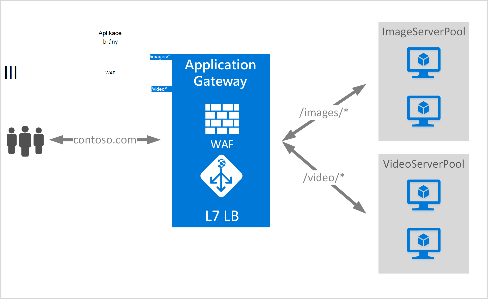

<properties
   pageTitle="Založené na adrese URL obsahu Přehled směrování | Microsoft Azure"
   description="Tato stránka obsahuje přehled založené na adrese URL brány aplikace směrování obsahu, UrlPathMap konfigurace a PathBasedRouting pravidlo."
   documentationCenter="na"
   services="application-gateway"
   authors="georgewallace"
   manager="carmonm"
   editor="tysonn"/>
<tags
   ms.service="application-gateway"
   ms.devlang="na"
   ms.topic="hero-article"
   ms.tgt_pltfrm="na"
   ms.workload="infrastructure-services"
   ms.date="10/25/2016"
   ms.author="gwallace"/>

# Směrování na základě cestu URL – přehled

Na základě směrování adres URL cesta lze provoz směrovat na serveru back-end fondů založené na cestách URL žádosti o. Scénáře reprodukujte ke směrování požadavků na různých back-end serveru fondů různých typů obsahu.
V následujícím příkladu použití brány slouží návštěvníci contoso.com ze tří fondů serveru back-end například: VideoServerPool ImageServerPool a DefaultServerPool.

Požadavky na* směrovány VideoServerPool, a http://contoso.com/images* http://contoso.com/video jsou směrovány ImageServerPool. DefaultServerPool zaškrtnuté, pokud žádná vzorků cesta odpovídá.

## Konfigurace prvek UrlPathMap

UrlPathMap element slouží k určení vzorků cesta k serveru back-end fond mapování. Následující příklad je fragment urlPathMap prvek ze souboru šablony.

    "urlPathMaps": [
    {
    "name": "<urlPathMapName>",
    "id": "/subscriptions/<subscriptionId>/../microsoft.network/applicationGateways/<gatewayName>/ urlPathMaps/<urlPathMapName>",
    "properties": {
        "defaultBackendAddressPool": {
            "id": "/subscriptions/<subscriptionId>/../microsoft.network/applicationGateways/<gatewayName>/backendAddressPools/<poolName>"
        },
        "defaultBackendHttpSettings": {
            "id": "/subscriptions/<subscriptionId>/../microsoft.network/applicationGateways/<gatewayName>/backendHttpSettingsList/<settingsName>"
        },
        "pathRules": [
            {
                "paths": [
                    <pathPattern>
                ],
                "backendAddressPool": {
                    "id": "/subscriptions/<subscriptionId>/../microsoft.network/applicationGateways/<gatewayName>/backendAddressPools/<poolName2>"
                },
                "backendHttpsettings": {
                    "id": "/subscriptions/<subscriptionId>/../microsoft.network/applicationGateways/<gatewayName>/backendHttpsettingsList/<settingsName2>"
                },

            },

        ],

    }
    }
    

>[AZURE.NOTE] PathPattern: Toto nastavení je seznam vzorků cestu podle. Každý musí začínat / a pouze blokování "*" smí je po uplynutí konce "/". Řetězec naplnění objekt přiřazení vzorce cesta neobsahuje žádný text za první? nebo se tady nepovoluje # a tyto znaky. 

Můžete se podívat [Správce prostředků šablony pomocí založené na adrese URL směrování](https://azure.microsoft.com/documentation/templates/201-application-gateway-url-path-based-routing) Další informace.

## PathBasedRouting pravidla

RequestRoutingRule typu PathBasedRouting slouží k posluchače svázat urlPathMap. Všechny požadavky, které jsou doručeny pro tento posluchače jsou směrovány na základě zásad podle urlPathMap.
Fragment PathBasedRouting pravidla:

    "requestRoutingRules": [
    {

    "name": "<ruleName>",
    "id": "/subscriptions/<subscriptionId>/../microsoft.network/applicationGateways/<gatewayName>/requestRoutingRules/<ruleName>",
    "properties": {
        "ruleType": "PathBasedRouting",
        "httpListener": {
            "id": "/subscriptions/<subscriptionId>/../microsoft.network/applicationGateways/<gatewayName>/httpListeners/<listenerName>"
        },
        "urlPathMap": {
            "id": "/subscriptions/<subscriptionId>/../microsoft.network/applicationGateways/<gatewayName>/ urlPathMaps/<urlPathMapName>"
        },

    }
    
## Další kroky

Po získání informací o založené na adrese URL směrování obsahu, přejděte k [Vytvoření brány aplikační použití založené na adrese URL směrování](application-gateway-create-url-route-portal.md) do vytvoření brány aplikační pomocí pravidel pro směrování adres URL.
