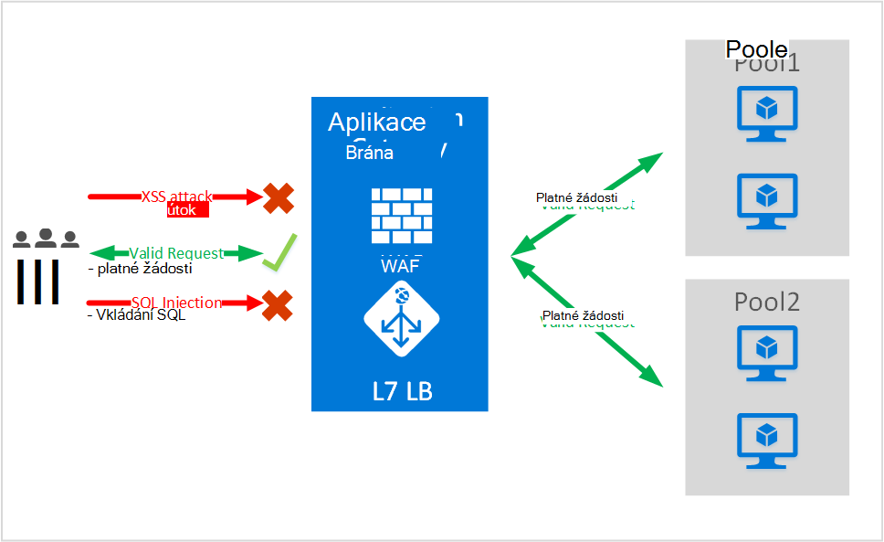
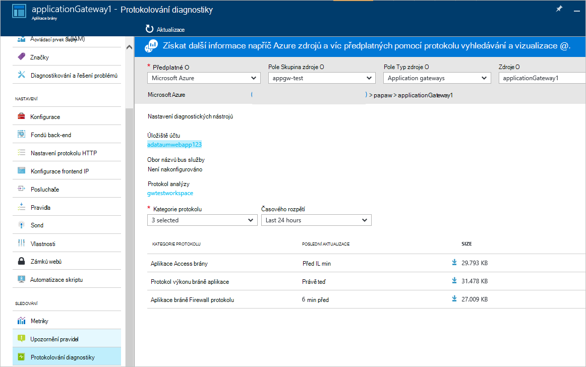

<properties
   pageTitle="Úvod k webové aplikace brány Firewall (WAF) aplikace brány | Microsoft Azure"
   description="Na této stránce najdete základní informace o webové aplikace bránu Firewall (WAF) pro bráně aplikace "
   documentationCenter="na"
   services="application-gateway"
   authors="amsriva"
   manager="rossort"
   editor="amsriva"/>
<tags
   ms.service="application-gateway"
   ms.devlang="na"
   ms.topic="hero-article"
   ms.tgt_pltfrm="na"
   ms.workload="infrastructure-services"
   ms.date="10/25/2016"
   ms.author="amsriva"/>

# Aplikace brány webové aplikace Firewall (verze preview)

Brána firewall webové aplikace (WAF) je funkce brány azure aplikace, která poskytuje ochranu do webových aplikací, které využívají brány aplikace pro standardních funkcí aplikace doručení ovládací prvek ADC. Webové aplikace firewall to tak, že je proti většina OWASP horní 10 běžné web chyby chrání. Jsou webové aplikace stále cílů škodlivým útokům zneužití známé běžných chyb. Běžné mezi tyto zneužití útoky vložení příkazu SQL, skriptování mezi útoků pojmenování několik. Ochrana před zadáním takových útoků v kódu aplikace může být náročné a může vyžadovat náročné údržbu opravy a sledování více vrstev topologie aplikací. Brána firewall centralizované webové aplikace pro ochranu před útoky web mnohem usnadňuje Správa zabezpečení a poskytuje lepší assurance aplikaci proti hrozeb průniky. Řešení WAF můžete taky reagovat na bezpečnostní riziko rychlejší tak, že opravy slabých na jednom centrálním místě a zabezpečení všech jednotlivých webových aplikací. Existující bran aplikace můžete snadno převedou na bráně aplikace pro web aplikace bránu firewall.

Bráně aplikace funguje jako řadiče doručení aplikace a nabízí SSL ukončení, na základě souborů cookie relace spřažení, kruhového zatížení rozmístění obsahu na základě směrování, možnost hostovat víc webů a zabezpečení vylepšení. Vylepšení zabezpečení zaměstnanecké brány aplikace, které zahrnují SSL zásady správy Podpora SSL konce. Možnosti zabezpečení aplikace naší služby jsme jsou posílit zavedením WAF (webové aplikace firewallem) přímo integrovaný ADC nabízející. To umožňuje snadno konfigurace centrální umístění pro správu a ochranu webových aplikací proti běžné chyby web.

Konfigurace WAF v bráně aplikace poskytuje následující výhody můžete:

- Webová aplikace Chraňte před web chyby a útoky beze změny back-end kódu.
- Ochrana více webových aplikací ve stejnou dobu za brány aplikace. Brána pro aplikace podporuje, hostingu až 20 weby za jeden brány, který by mohl všechny chráněny před útoky web.
- Sledování webové aplikace před útoky použití v reálném čase sestavy vytvořené protokoly brány WAF aplikace.
- Některé ovládací prvky dodržování předpisů vyžadují všechny internet vystaveného koncové body chráněny WAF řešení. Pomocí bráně aplikace WAF povoleno, budete splňovat tyto požadavky.

## Základní informace

Aplikace brány WAF je k dispozici v nové skladové jednotky (WAF SKU) a dodávají se předkonfigurované s ModSecurity a sady pravidel Core OWASP nabízet podle směrného plánu ochrany proti většina OWASP horní 10 běžné web chyby.

- Ochrana proti vkládání příkazu SQL
- Křížové skriptování ochranu webu
- Běžné Web útoky ochrany například příkaz vložení, žádost HTTP převádění odpověď HTTP rozdělení a útok zahrnutí vzdáleného souboru
- Ochrana proti porušení protokolu HTTP
- Ochrana proti odchylky protokolu HTTP například chybějící hostovat uživatelského agenta a přijměte záhlaví
- Ochrana DoS HTTP včetně HTTP zaplavení pomalé předcházení HTTP DoS
- Prevence před roboti, indexaci a skenery
- Zjištění běžné chyby konfigurace aplikace (tedy Apache služby IIS, atd)

## Režimy WAF

Aplikace brány WAF lze nakonfigurovat následující dva způsoby spuštění:

- **Režim zjišťování** – nakonfigurován pro spuštění v režimu detekce aplikace brány WAF sleduje a přihlásí všechna upozornění hrozbou, že soubor protokolu. Je třeba zajistit, že protokolování diagnostiky brány aplikace je zapnutá pomocí oddíl diagnostických nástrojů. Musíte se taky ověřit, že protokol WAF vybraná a zapnutý.
- **Režim zabránění** – když nakonfigurován pro spuštění v režimu prevence, aplikace brány aktivně blokuje průniky a útoky detekovaný pravidly. Mohl obdrží 403 neoprávněnému přístupu výjimky a ukončen připojení. Režim zabránění zůstane takových útoků přihlásit WAF protokoly.

## Sestavy WAF bráně aplikace

Aplikace brány WAF poskytuje podrobné sestavy na každé hrozbou, který zjistí. Protokolování je integrována protokolování diagnostiky Azure a upozornění se zaznamenávají ve formátu json.

    {
        "resourceId": "/SUBSCRIPTIONS/<subscriptionId>/RESOURCEGROUPS/<resourceGroupName>/PROVIDERS/MICROSOFT.NETWORK/APPLICATIONGATEWAYS/<applicationGatewayName>",
        "operationName": "ApplicationGatewayFirewall",
        "time": "2016-09-20T00:40:04.9138513Z",
        "category": "ApplicationGatewayFirewallLog",
        "properties":     {
            "instanceId":"ApplicationGatewayRole_IN_0",
            "clientIp":"108.41.16.164",
            "clientPort":1815,
            "requestUri":"/wavsep/active/RXSS-Detection-Evaluation-POST/",
            "ruleId":"OWASP_973336",
            "message":"XSS Filter - Category 1: Script Tag Vector",
            "action":"Logged",
            "site":"Global",
            "message":"XSS Filter - Category 1: Script Tag Vector",
            "details":{"message":" Warning. Pattern match "(?i)(<script","file":"/owasp_crs/base_rules/modsecurity_crs_41_xss_attacks.conf","line":"14"}}
    }

## Aplikace brány WAF SKU ceny

Během zobrazení náhledu jsou žádné další poplatky za použití WAF brány aplikace. Můžete nadále platit za stávající základní SKU poplatky. V době GA jsme bude komunikovat WAF SKU poplatky. Zákazníci, kteří se rozhodli nasazení aplikace brány v WAF SKU by začněte vyplývající WAF SKU ceny až po GA oznámení.

## Další kroky

Po získání dalších informací o možnostech WAF, navštivte [konfiguraci brány Firewall webové aplikace ve bráně aplikace](application-gateway-web-application-firewall-portal.md).
