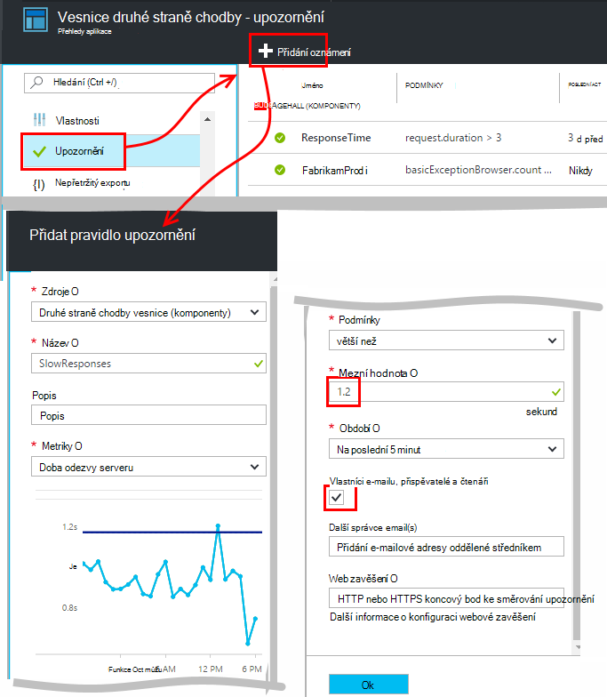
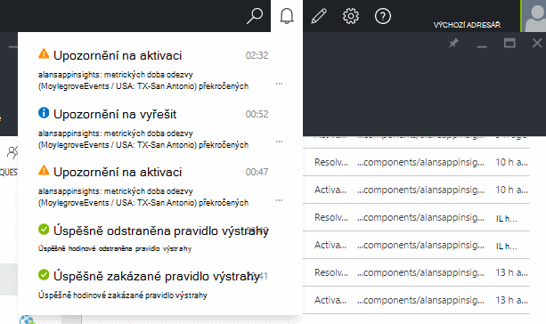
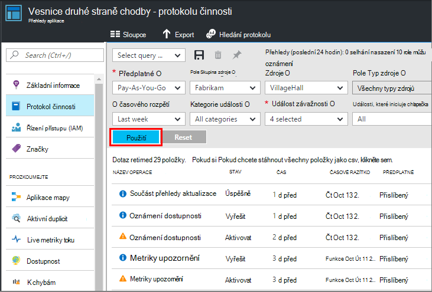

<properties 
    pageTitle="Nastavení upozornění v aplikaci přehledy | Microsoft Azure" 
    description="Oznámení o pomalé odezvy výjimky a výkonu nebo jiných použití změn ve web appu." 
    services="application-insights" 
    documentationCenter=""
    authors="alancameronwills" 
    manager="douge"/>

<tags 
    ms.service="application-insights" 
    ms.workload="tbd" 
    ms.tgt_pltfrm="ibiza" 
    ms.devlang="na" 
    ms.topic="article" 
    ms.date="10/14/2016" 
    ms.author="awills"/>
 
# Nastavení upozornění v aplikaci přehledy

[Přehledy aplikace Visual Studio] [ start] můžete je zobrazeno upozornění na změny v výkonu a využití metriky ve web appu. 

Aplikace přehledy sleduje živé aplikace na [celou řadu platformách] [ platforms] vám pomůže diagnostikovat potíže s výkonem a porozumět využití vyhledávání.

Existují tři typy upozornění:

* **Metriky upozornění** zjistit, kdy všechny míru ve výkresu protínají mezní hodnota některé dobu – třeba doby odezvy, počty výjimek, využití procesoru nebo zobrazení stránky. 
* [**Web testů** ] [ availability] zjistit, kdy je váš web není k dispozici na Internetu nebo reagovat pomalu. [Další informace][availability].
* [**Aktivní diagnostiky**](app-insights-proactive-diagnostics.md) nakonfigurovaný automaticky upozornit vzorků neobvyklé výkonu.

Budeme se zaměřují na metrických upozornění v tomto článku.

## Nastavit upozornění na metrických

Otevřete zásuvné upozornění pravidel a pak můžete pomocí tlačítka Přidat. 

* Nastavení zdroje před další vlastnosti. **Zvolte zdroje "(komponenty)"** Pokud chcete nastavit upozornění výkonu a využití metrice.
* Název, který dát upozornění musí být jedinečný v rámci skupina zdroje (nejen aplikace).
* Věnujte jednotky, ve kterých se zobrazí výzva k zadání mezní hodnota.
* Pokud toto políčko "E-mailu vlastníci..." oznámení odešle e-mailem každému, kdo má přístup k této skupiny zdrojů. Rozbalte tuto sadu lidí, přidejte je do [pole Skupina zdroje nebo předplatného](app-insights-resources-roles-access-control.md) (ne zdroje).
* Pokud zadáte "Další e-mailů", odešle upozornění vhodným uživatelům nebo skupinám (jestli jste zaškrtli políčko "e-mailem vlastníci..."). 
* Pokud jste nastavili do webových aplikací, které odpoví na upozornění na nastavte [webhook adresu](../monitoring-and-diagnostics/insights-webhooks-alerts.md) . Bude mít název upozornění při aktivaci (který se spustí) i když je vyřešit. (Všimněte si, že v současnosti, ale nejsou parametry dotazu předána jako vlastnosti webhook.)
* Můžete zakázat nebo povolení oznámení: tlačítka v horní části zásuvné zobrazit.

*Proč není vidět tlačítko Přidat oznámení.* 

- Používáte účet organizace? Upozornění jde nastavit, pokud máte vlastník nebo přispěvatelů přístup k tomuto prostředku aplikace. Podívejte se na zásuvné řízení přístupu. [Další informace o řízení přístupu][roles].

> [AZURE.NOTE] V upozornění na zásuvné, zobrazí se, že již sady upozornění: [Aktivní diagnostiky](app-insights-proactive-failure-diagnostics.md). Toto je Automatické upozornění, která sleduje jeden konkrétní metrických, žádost o výpadek. Pokud budete chtít zakázat upozornění na aktivní, není potřeba nastavit vlastní upozornění na žádost o výpadek. 

## Zobrazit oznámení

Odeslat e-mail při oznámení změny stavu mezi a neaktivní. 

Aktuální stav jednotlivých upozornění se zobrazí v zásuvné upozornění pravidel.

Rozevírací seznam neexistuje souhrnu poslední aktivity v oddílu upozornění:

Historie změn stavu je v protokolu aktivity:

## Fungování upozornění

* Upozornění má tři stavy: "Nikdy aktivovali", "Aktivní" a "Vyřešit,." Aktivované prostředky podmínka, kterou jste zadali při true naposledy vyhodnoceno.

* Oznámení dojde oznámení změny stavu. (Pokud upozornění byla podmínka už splněna při vytvoření upozornění, nemusí se oznámení, dokud podmínka přejde false.)

* Každé oznámení vygeneruje e-mailu Pokud zaškrtnete políčko e-mailů, nebo pokud e-mailové adresy. Taky můžete zobrazit v rozevíracím seznamu oznámení.

* Upozornění je vyhodnocen pokaždé, když přijde metriky, ale ne jinak.

* Hodnocení sloučí metriky za předchozí období a potom ji ve srovnání se prahové hodnoty ke zjištění nových stavu.

* Období, které zvolíte Určuje interval přes které metriky agregován. Nemá vliv, jak často upozornění Vyhodnocená každá její položka:, závisí na požadovanou frekvenci přijetí metriky.

* Pokud žádná data přichází na konkrétní metriky delší dobu, má mezeru různých efektů na hodnocení upozornění a v grafech v metrických Průzkumníka. V metrických Průzkumník Windows Pokud žádná data se zobrazí po dobu delší než interval vzorkování na graf, graf zobrazuje hodnota 0. Ale upozornění založen na stejné míru není třeba opět hodnotit a upozornění na stát se nezmění. 

    Přijde-li data nakonec, graf se přejde zpět nenulovou hodnotu. Vyhodnotí upozornění na základě dat k dispozici pro zadané období. Nový datový bod pouze má k dispozici v období placení, agregace je založen na jenom na, že datový bod.

* I když nastavíte delší upozornění často blikat mezi stavy upozornění a správný. To může dojít, pokud hodnotu metriky pohybuje kolem prahové hodnoty. Mezní hodnota je žádné hystereze: na stejnou hodnotu jako přechodu správný se stane přechodu na upozornění.

## Co je dobré upozornění nastavení?

To záleží na aplikace. Abyste mohli začít je nejlepší nastavit příliš mnoho metriky. Věnujte chvíli prohlížíte metrických grafů aplikace je spuštěná, k zjistěte, ho chování běžným způsobem. To vám pomůže najít způsoby, jak zlepšit jeho výkon. Nastavte upozornění zjistit, kdy metriky přejděte mimo zónu normální. 

Oblíbené upozornění, patří:

* [Metriky prohlížeče][client], zejména prohlížeče **načítáním stránek**, je dobré pro webové aplikace. Pokud stránku obsahuje hodně skripty, je vhodné věnujte pozornost **výjimky prohlížeče**. Abyste mohli získávat tyto metriky a výstrahy, budete muset nastavit [Sledování webovou stránku][client].
* **Doba odezvy serveru** webových aplikací na straně serveru. A nastavte si upozornění, prohlédněte si tato metriky zobrazíte, pokud ji se liší podle nepřiměřeně rychlosti vysoké požadavků:, může to znamenat, že vaše aplikace není dost zdroje. 
* **Výjimky serveru** - neuvidíte, je potřeba udělat některé [Další nastavení](app-insights-asp-net-exceptions.md).

Nezapomeňte, které [aktivní selhání sazba Diagnostika](app-insights-proactive-failure-diagnostics.md) automaticky sledovat tempo, jakou aplikaci odpovídá žádosti o selhání kódy. 

## Automatizace

* [Použití Powershellu ke automatizovat nastavení upozornění](app-insights-powershell-alerts.md)
* [Použít webhooks k automatizaci reagovat na výstrahy](../monitoring-and-diagnostics/insights-webhooks-alerts.md)

## Viz taky

* [Dostupnost webových testů](app-insights-monitor-web-app-availability.md)
* [Automatizace nastavení upozornění](app-insights-powershell-alerts.md)
* [Aktivní diagnostiky](app-insights-proactive-diagnostics.md) 

<!--Link references-->

[availability]: app-insights-monitor-web-app-availability.md
[client]: app-insights-javascript.md
[platforms]: app-insights-platforms.md
[roles]: app-insights-resources-roles-access-control.md
[start]: app-insights-overview.md

 