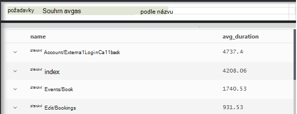
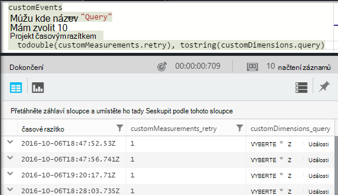

<properties 
    pageTitle="Prohlídka prostřednictvím technologie pro analýzu v aplikaci přehledy | Microsoft Azure" 
    description="Krátké příklady hlavní dotazů v analýzy, nástroj výkonné vyhledávání aplikace přehledy." 
    services="application-insights" 
    documentationCenter=""
    authors="alancameronwills" 
    manager="douge"/>

<tags 
    ms.service="application-insights" 
    ms.workload="tbd" 
    ms.tgt_pltfrm="ibiza" 
    ms.devlang="na" 
    ms.topic="article" 
    ms.date="10/15/2016" 
    ms.author="awills"/>


 
# <a name="a-tour-of-analytics-in-application-insights"></a>Přehled funkcí analýzy v aplikaci přehledy


[Technologie pro analýzu](app-insights-analytics.md) je funkce výkonné vyhledávání [Aplikace přehledy](app-insights-overview.md). Tyto stránky popisují lanquage dotazu analýzy.


* **[Podívejte se na úvodní video](https://applicationanalytics-media.azureedge.net/home_page_video.mp4)**.
* **[Vyzkoušení analýzy na naše simulovaný data](https://analytics.applicationinsights.io/demo)** při aplikace není odesílání dat pro přehledy aplikaci ještě.


Podívejme se procházení některé základní dotazy, abyste mohli začít pracovat.

## <a name="connect-to-your-application-insights-data"></a>Připojení k datům aplikace přehledy

Otevření technologie pro analýzu z vaší aplikaci [zásuvné přehled](app-insights-dashboards.md) v aplikaci přehledy:


    
## <a name="takeapp-insights-analytics-referencemdtake-operator-show-me-n-rows"></a>[Prohlédněte](app-insights-analytics-reference.md#take-operator): ukázat n řádků

Datové body, které protokolu uživatelské operace (obvykle HTTP žádosti o dostali webovou aplikaci) jsou uloženy v tabulce s názvem `requests`. Každý řádek představuje datový bod telemetrie dostali od SDK přehledy aplikace v aplikaci.

Začneme tím, že zkoumání několik řádků ukázkové tabulky:


> [AZURE.NOTE] Umístěte kurzor jinam, postupujte v příkazu před kliknutím na cestách. Můžete rozdělit výkaz přes delší než jeden řádek, ale nevkládejte prázdné řádky ve výrazu. Prázdné řádky jsou vhodné pro zachování několik samostatných dotazů v okně.


Vybrat sloupce, přetáhněte je seskupení podle sloupců a filtrování: 


Rozbalte kteroukoliv položku zobrazíte podrobnosti:
 


> [AZURE.NOTE] Klikněte na záhlaví sloupce znovu uspořádat výsledky dostupné ve webovém prohlížeči. Ale mějte na paměti, že pro velké výsledné množinu je omezený počet řádků stáhli do prohlížeče. Řazení tímto způsobem, vždy se nezobrazují se skutečné nejvyšších nebo nejnižších položek. Problémy se spolehlivým seřadit položky, můžete `top` nebo `sort` operátor. 

## <a name="topapp-insights-analytics-referencemdtop-operator-and-sortapp-insights-analytics-referencemdsort-operator"></a>[Nahoře](app-insights-analytics-reference.md#top-operator) a [řazení](app-insights-analytics-reference.md#sort-operator)

`take`je vhodné získat rychlý výběru výsledku, ale zobrazuje řádků z tabulky v určitém pořadí. Pořadí zobrazení, použijte `top` (ukázku) nebo `sort` (přes celou tabulku).

Zobrazte první n řádků seřazené podle určitého sloupce:

```AIQL

    requests | top 10 by timestamp desc 
```

* *Syntaxe:* Většina operátorů, jako má klíčové slovo parametry `by`.
* `desc`= sestupném pořadí `asc` = vzestupně.


`top...`je další způsob performant oznámením `sort ... | take...`. Společnost Microsoft může vytvořilo:

```AIQL

    requests | sort by timestamp desc | take 10
```

Výsledek bude stejná, ale by trochu pomaleji spustit. (Můžete taky napsat `order`, což je alias `sort`.)

Záhlaví sloupců v zobrazení tabulky lze také řadit výsledky na obrazovce. Ale pokud jste vypotřebovali samozřejmě `take` nebo `top` k načtení pouze části tabulky, můžete se jenom změnit pořadí záznamy jste načíst.


## <a name="projectapp-insights-analytics-referencemdproject-operator-select-rename-and-compute-columns"></a>[Projekt](app-insights-analytics-reference.md#project-operator): vyberte Přejmenovat a výpočet sloupce

Použití [`project`](app-insights-analytics-reference.md#project-operator) vybrat jenom sloupce chcete:

```AIQL

    requests | top 10 by timestamp desc
             | project timestamp, name, resultCode
```


Můžete také přejmenujte sloupce a definovat nové:

```AIQL

    requests 
  	| top 10 by timestamp desc 
  	| project  
            name, 
            response = resultCode,
            timestamp, 
            ['time of day'] = floor(timestamp % 1d, 1s)
```


* [Názvy sloupců](app-insights-analytics-reference.md#names) mohou obsahovat mezery nebo symboly případě, že jsou v závorkách takto: `['...']` nebo`["..."]`
* `%`je obvykle modulo operátor. 
* `1d`(to je číslici, a pak měli ") je timespan literál znamená jeden den. Tady jsou některé další literály timespan: `12h`, `30m`, `10s`, `0.01s`.
* `floor`(alias `bin`) Zaokrouhlí hodnotu dolů na nejbližší násobek čísla základní hodnota zadaná. Takže `floor(aTime, 1s)` zaokrouhlí čas dolů na nejbližší druhé.

[Výrazy](app-insights-analytics-reference.md#scalars) mohou obsahovat běžné operátory (`+`, `-`;...), a to není řadu užitečných funkcí.

    

## <a name="extendapp-insights-analytics-referencemdextend-operator-compute-columns"></a>[Rozšířit](app-insights-analytics-reference.md#extend-operator): výpočet sloupce

Pokud chcete přidat sloupce do existující skupiny, použijte [`extend`](app-insights-analytics-reference.md#extend-operator):

```AIQL

    requests 
  	| top 10 by timestamp desc
  	| extend timeOfDay = floor(timestamp % 1d, 1s)
```

Použití [`extend`](app-insights-analytics-reference.md#extend-operator) je menší než podrobného [`project`](app-insights-analytics-reference.md#project-operator) Pokud chcete zachovat stávající sloupce.


## <a name="summarizeapp-insights-analytics-referencemdsummarize-operator-aggregate-groups-of-rows"></a>[Funkce Summarize](app-insights-analytics-reference.md#summarize-operator): agregování skupiny řádků

`Summarize`slouží k použití určité *funkce agregace* přes skupiny řádků. 

Například čas webovou aplikaci, která bude odpovědět na žádost o uvedená v poli `duration`. Podívejme Průměrná doba odezvy na všechny požadavky:


Nebo jsme může výsledek rozdělit žádosti o různých názvů:




`Summarize`shromažďuje datových bodů v proudu do skupin, u kterého `by` klauzule vyhodnotí rovnoměrně z vnější. Každá hodnota v `by` výraz - jménech operace ve výše uvedeném příkladu - výsledkem jeden řádek v tabulce výsledek. 

Nebo jsme může seskupení výsledků podle dne:


Všimněte si, jak Pracujeme s programem `bin` funkce (označovaná taky jako `floor`). Pokud jsme použili `by timestamp`, každého vstupního řádku by skončily ve vlastním malou skupinu. Pro průběžné skalární jako času nebo čísla, máme souvislé oblasti rozdělí spravovatelnosti počet abstraktní hodnot a `bin` – tedy pouze známé zaokrouhlení dolů `floor` fungovat – je nejjednodušší způsob, jak to udělat.

Můžeme použít stejné techniky zmenšení oblasti řetězce:


Všimněte si, že můžete použít `name=` nastavit název výsledek sloupce, buď ve výrazech agregace nebo tak, že klauzule.

## <a name="counting-sampled-data"></a>Počítání vzorky dat

`sum(itemCount)`je doporučené agregace počítat události. V mnoha případech itemCount == 1, takže funkce jednoduše spočítá počet řádků ve skupině. Po [odběru](app-insights-sampling.md) v operaci jenom část původní události se zachovají jako počet datových bodů v aplikaci přehledy tak, aby všechny datové body zobrazí existuje, ale `itemCount` události. 

Například pokud odběr zahodí 75 % původní události a potom itemCount == 4 v dosažených záznamy – to znamená pro každý záznam dosažených došlo k čtyři původní záznamy. 

Adaptivní odběr způsobí, že itemCount být vyšší během doby, kdy aplikace je vytížený.

Sčítat itemCount proto vám bude radit dobrého odhadu původní počet událostí.


Existuje také `count()` agregace (a operace počet) pro případy, kdy Opravdu chcete spočítat počet řádků ve skupině.


Je oblast [agregačních funkcí](app-insights-analytics-reference.md#aggregations).


## <a name="charting-the-results"></a>Vytváření grafů výsledky


```AIQL

    exceptions 
       | summarize count()  
         by bin(timestamp, 1d)
```

Ve výchozím nastavení výsledcích se zobrazí tabulky:


Můžeme půjde vám ještě snadněji zobrazení tabulky. Podívejme se na výsledky v zobrazení diagramu se svislé ose pruhu možnost:


Všimněte si, že i když jsme neměli řadit výsledky čas (jak je vidět v zobrazení tabulky), zobrazení grafu vždy zobrazí data a času ve správném pořadí.


## <a name="whereapp-insights-analytics-referencemdwhere-operator-filtering-on-a-condition"></a>[Kde](app-insights-analytics-reference.md#where-operator): filtrování na podmínce

Pokud jste nastavili pro [klienta](app-insights-javascript.md) a serveru strany aplikace pro sledování přehledy aplikace, některé telemetrie v databázi pochází z prohlížeče.

Podívejme jenom výjimky nahlášené z prohlížeče:

```AIQL

    exceptions 
  	| where client_Type == "Browser" 
  	|  summarize count() 
       by client_Browser, outerMessage 
```


`where` Operátor má logický výraz. Tady jsou některé klíčové body o nich znáte:

 * `and`, `or`: Logické operátory
 * `==`, `<>` : a nejsou rovny
 * `=~`, `!=` : velká a malá písmena řetězec stejný a nerovná. Existuje víc další řetězce relační operátory.

Přečtěte si všechny o [Skalární výrazů](app-insights-analytics-reference.md#scalars).

### <a name="filtering-events"></a>Filtrování událostí

Vyhledání neúspěšné požadavky:

```AIQL

    requests 
  	| where isnotempty(resultCode) and toint(resultCode) >= 400
```

`responseCode`má typu řetězec, takže jsme musíte [jej převést](app-insights-analytics-reference.md#casts) pro číselné porovnání.

Shrnutí jiné odpovědi:

```AIQL

    requests
  	| where isnotempty(resultCode) and toint(resultCode) >= 400
  	| summarize count() 
      by resultCode
```

## <a name="timecharts"></a>Timecharts

Zobrazte, kolik nějaké události, které jsou každý den:

```AIQL

    requests
      | summarize event_count=count()
        by bin(timestamp, 1d)
```

Vyberte požadovanou možnost zobrazení graf:


## <a name="multiple-series"></a>Několik řad 

Víc výrazů v `summarize` vytváří víc sloupců.

Víc výrazů v `by` klauzule vytváří víc řádků, jedno pro každé kombinací hodnot.


```AIQL

    requests
  	| summarize count(), avg(duration) 
      by bin(timestamp, 1d), client_StateOrProvince, client_City 
  	| order by timestamp asc, client_StateOrProvince, client_City
```


### <a name="segment-a-chart-by-dimensions"></a>Segmentech grafu tak, že rozměry

Pokud graf tabulku obsahující sloupec řetězce a číselné sloupce řetězec mohou sloužit k rozdělení číselná data do samostatných řadu bodů. Pokud existuje více než jeden sloupec řetězec, můžete zvolit sloupců, které chcete použít jako diskriminátor. 


### <a name="display-multiple-metrics"></a>Zobrazení několika metrik

Pokud graf tabulky tohoto víc číselné sloupce kromě časové razítko, můžete zobrazit libovolné z nich.


Není rozdělení je nutné vybrat před můžete vybrat více číselných sloupcích, které nelze rozdělit podle sloupce řetězce ve stejnou dobu jako zobrazení více než jeden číselný sloupec. 


## <a name="daily-average-cycle"></a>Denní průměr obrázku

Jak se liší použití myši průměr den?

Počet žádosti o podle času modulo jeden den, binned do hodin:

```AIQL

    requests
  	| extend hour = floor(timestamp % 1d , 1h) 
          + datetime("2016-01-01")
  	| summarize event_count=count() by hour
```


>[AZURE.NOTE] Všimněte si v současné době máme převést dobu trvání data a času k zobrazení na v grafu.


## <a name="compare-multiple-daily-series"></a>Porovnání několik denní řad

Způsob použití liší časem dne v různých zemí?

```AIQL

 requests  | where tostring(operation_SyntheticSource)
     | extend hour= floor( timestamp % 1d , 1h)
           + datetime("2001-01-01")
     | summarize event_count=count() 
       by hour, client_CountryOrRegion 
     | render timechart
```


## <a name="plot-a-distribution"></a>Vykreslovat rozdělení.

Kolik relací existují různé délky?

```AIQL

    requests 
  	| where isnotnull(session_Id) and isnotempty(session_Id) 
  	| summarize min(timestamp), max(timestamp) 
      by session_Id 
  	| extend sessionDuration = max_timestamp - min_timestamp 
  	| where sessionDuration > 1s and sessionDuration < 3m 
  	| summarize count() by floor(sessionDuration, 3s) 
  	| project d = sessionDuration + datetime("2016-01-01"), count_
```

Poslední řádek je muset převést na datový typ datetime. Osy x grafu je zobrazen jako skalární jenom v případě, že je datetime.

`where` Klauzule nezahrnuje jednorázové relace (sessionDuration == 0) a nastaví délku osy x.


## <a name="percentilesapp-insights-analytics-referencemdpercentiles"></a>[Percentily](app-insights-analytics-reference.md#percentiles)

Jaké oblasti doby trvání zahrnovat různá procenta relací?

Pomocí výše uvedený dotaz, ale nahradit poslední řádek:

```AIQL

    requests 
  	| where isnotnull(session_Id) and isnotempty(session_Id) 
  	| summarize min(timestamp), max(timestamp) 
      by session_Id 
  	| extend sesh = max_timestamp - min_timestamp 
  	| where sesh > 1s
  	| summarize count() by floor(sesh, 3s) 
  	| summarize percentiles(sesh, 5, 20, 50, 80, 95)
```

Jsme také odebrat horní mez do pole kde klauzule za účelem získání správného obrázky včetně všechny relace s víc než jednu žádost o:


Odkud je vidět, který:

* 5 % relací trvají menší než 3 minuty 34s; 
* 50 % relací naposledy menší než 36 minnutes;
* 5 % relací posledních více než 7 dnů

Získat samostatné rozdělení pro jednotlivé země, jsme jenom přenést sumarizovat sloupci client_CountryOrRegion samostatně prostřednictvím obě operátory:

```AIQL

    requests 
  	| where isnotnull(session_Id) and isnotempty(session_Id) 
  	| summarize min(timestamp), max(timestamp) 
      by session_Id, client_CountryOrRegion
  	| extend sesh = max_timestamp - min_timestamp 
  	| where sesh > 1s
  	| summarize count() by floor(sesh, 3s), client_CountryOrRegion
  	| summarize percentiles(sesh, 5, 20, 50, 80, 95)
      by client_CountryOrRegion
```


## <a name="joinapp-insights-analytics-referencemdjoin"></a>[Spojení](app-insights-analytics-reference.md#join)

Máme přístup k několika tabulek, včetně žádosti o schůzku a výjimky.

Výjimky související s žádost vrácena chyba odpověď najdete jsme spojte tabulky na `session_Id`:

```AIQL

    requests 
  	| where toint(responseCode) >= 500 
  	| join (exceptions) on operation_Id 
  	| take 30
```


Je vhodné použít `project` vyberte jenom sloupce, potřebujeme před provedením spojení.
Ve stejném klauzule jsme přejmenujte sloupec časové razítko.


## <a name="letapp-insights-analytics-referencemdlet-clause-assign-a-result-to-a-variable"></a>[Povolení](app-insights-analytics-reference.md#let-clause): přiřadit proměnné výsledku

Umožňuje [, aby](./app-insights-analytics-reference.md#let-statements) oddělit části předchozího výrazu. Výsledky jsou beze změny:

```AIQL

    let bad_requests = 
      requests
        | where  toint(resultCode) >= 500  ;
    bad_requests
  	| join (exceptions) on session_Id 
  	| take 30
```

> Tip: V klientovi analýzy, nevkládejte prázdné řádky mezi částmi tohoto. Zkontrolujte, že všechno spustit.


## <a name="accessing-nested-objects"></a>Přístup k vnořené objekty

Vnořené objekty lze snadno přistupovat. Například v toku výjimky se zobrazí strukturovaný objekty takto:


Výběrem vlastnosti, které vás zajímá můžete sloučit ho:

```AIQL

    exceptions | take 10
  	| extend method1 = tostring(details[0].parsedStack[1].method)
```

Všimněte si, že je potřeba použít [cast](app-insights-analytics-reference.md#casts) do příslušného typu.

## <a name="custom-properties-and-measurements"></a>Vlastní vlastnosti a naměřené hodnoty

Pokud aplikace připojí k události [Vlastní rozměry (Vlastnosti) a vlastní rozměry](app-insights-api-custom-events-metrics.md#properties) a zobrazí se v `customDimensions` a `customMeasurements` objekty.


Pokud například aplikace zahrnuje:

```C#

    var dimensions = new Dictionary<string, string> 
                     {{"p1", "v1"},{"p2", "v2"}};
    var measurements = new Dictionary<string, double>
                     {{"m1", 42.0}, {"m2", 43.2}};
    telemetryClient.TrackEvent("myEvent", dimensions, measurements);
```

Chcete-li extrahovat v technologie pro analýzu tyto hodnoty:

```AIQL

    customEvents
  	| extend p1 = customDimensions.p1, 
      m1 = todouble(customMeasurements.m1) // cast to expected type

``` 

## <a name="tables"></a>Tabulky

Toku telemetrie dostali z aplikace přístupný pomocí několika tabulek. Schéma vlastnosti jsou k dispozici pro každou tabulku se zobrazuje v levé části okna.

### <a name="requests-table"></a>Požadavky na tabulky

Počet HTTP požadavky na váš web app a segmentu podle názvu stránky:


Vyhledání požadavky, které nepovede většina:


### <a name="custom-events-table"></a>Vlastní události tabulky

Pokud používáte [TrackEvent()](app-insights-api-custom-events-metrics.md#track-event) posílat vlastní události, si můžete přečíst v této tabulce. 

Podívejme se příklad kterých aplikace kód obsahuje tyto řádky:

```C#

    telemetry.TrackEvent("Query", 
       new Dictionary<string,string> {{"query", sqlCmd}},
       new Dictionary<string,double> {
           {"retry", retryCount},
           {"querytime", totalTime}})
```

Zobrazí frekvenci z následujících událostí:
 


Extrahování rozměry a dimenzí z události:



### <a name="custom-metrics-table"></a>Vlastní metriky tabulky

Pokud používáte [TrackMetric()](app-insights-api-custom-events-metrics.md#track-metric) odeslat metrických hodnoty, najdete v toku **customMetrics** jeho výsledky. Příklad:  


> [AZURE.NOTE] V [Průzkumníkovi metriky](app-insights-metrics-explorer.md), všechny vlastní rozměry připojené k libovolný typ telemetrie vzájemného postavení v zásuvné metriky spolu s metriky odesílá provedením `TrackMetric()`. Ale v analýzy, vlastní rozměry stále připojeni na libovolný typ telemetrie byly provedeny na - události nebo žádosti a podobně – během metriky odeslaný TrackMetric se zobrazí v vlastní proudu.

### <a name="performance-counters-table"></a>Tabulka čítače výkonu

[Výkonnosti](app-insights-performance-counters.md) zobrazit základní systém metriky aplikace, jako je využití procesoru, paměti a využití sítě. Můžete nakonfigurovat SDK odeslání další údaje, včetně vlastní vlastních čítačů.

Zpřístupňuje schématu **jako** `category`, `counter` název a `instance` název každého čítače. Názvy instance čítačů platí jenom pro některé výkonnosti a obvykle uveďte název obrázku, ke kterému se týká počet. V telemetrie pro každou aplikaci zobrazí se pouze čítače pro tuto aplikaci. Například najdete v článku jaký čítače jsou k dispozici: 


Chcete-li získat graf dostupnou pamětí přes nedávnému období: 


Stejně jako další telemetrie **jako** taky má sloupec `cloud_RoleInstance` , která označuje identity na hostitelském počítači, na kterém běží aplikace. Chcete-li například porovnat aplikace na různých počítačích: 


### <a name="exceptions-table"></a>Výjimky tabulky

[Výjimky vykázaného tak, že aplikace](app-insights-asp-net-exceptions.md) jsou dostupné v této tabulce. 

Žádost HTTP, která byla aplikace pro zpracování při aktivované výjimku najdete spojení se nepoužijí operation_Id:


### <a name="browser-timings-table"></a>Prohlížeče časování tabulky

`browserTimings`Zobrazuje stránky načítání dat shromážděných v prohlížečích vašich uživatelů.

Chcete-li zobrazit tyto metriky [Nastavení aplikace pro klienta telemetrie](app-insights-javascript.md) . 

Schéma zahrnuje [metriky označující délky různé fáze procesu načítání stránky](app-insights-javascript.md#page-load-performance). (Není označují časový interval, který uživatelé přečíst stránku.)  

Zobrazit popularities různé stránky a načíst časy pro každou stránku:


### <a name="availbility-results-table"></a>Tabulka výsledků Availbility

`availabilityResults`Zobrazuje výsledky [testů web](app-insights-monitor-web-app-availability.md). Každé spuštění testy každé umístění test je uveden samostatně. 


### <a name="dependencies-table"></a>Závislosti tabulky

Obsahuje výsledky hovory, že aplikace umožňuje databází a rozhraní REST API a jiných volání TrackDependency().

### <a name="traces-table"></a>Trasování tabulky

Obsahuje odeslány pomocí aplikace pomocí TrackTrace() nebo [jiných rámců protokolování](app-insights-asp-net-trace-logs.md)telemetrie.

## <a name="dashboards"></a>Řídicí panely

Připnout výsledky do řídicího panelu za účelem sjednocení všechny vaše nejdůležitější grafy a tabulky.

* [Řídicí panel Azure sdílené](app-insights-dashboards.md#share-dashboards): klikněte na ikonu připínáčku. Než to uděláte, musíte mít sdílené řídicího panelu. Na portálu Azure otevřete nebo vytvořte řídicího panelu a klikněte na sdílet.
* [Řídicí panel Power BI](app-insights-export-power-bi.md): klikněte na exportovat, Power BI dotazu. Výhodou toto alternativní je, že můžete zobrazit dotaz vedle další výsledky velmi široká škála zdrojů.


## <a name="next-steps"></a>Další kroky

* [Referenční příručka jazyka analýzy](app-insights-analytics-reference.md)

[AZURE.INCLUDE [app-insights-analytics-footer](../../includes/app-insights-analytics-footer.md)]


